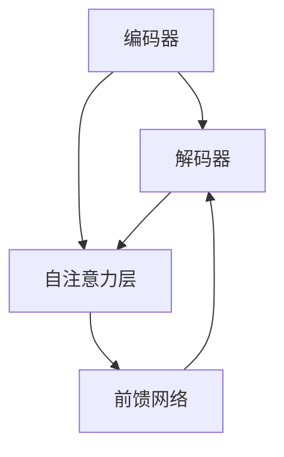

                 


# Transformer架构剖析

> **关键词**：Transformer、自注意力机制、序列模型、深度学习、神经网络、编码器、解码器、BERT、GAN、GANomaly、NLP、机器翻译、自然语言处理

> **摘要**：本文深入剖析了Transformer架构，从背景介绍、核心概念与联系、算法原理、数学模型到实际应用场景，全面解析了这一革命性神经网络架构的原理、实现和应用，旨在帮助读者更好地理解和掌握Transformer的核心技术。

## 1. 背景介绍

### 1.1 目的和范围

本文旨在深入剖析Transformer架构，帮助读者理解其核心原理、实现和应用。Transformer架构是近年来深度学习领域的重要突破，特别是在自然语言处理（NLP）任务中展现了强大的性能。本文将从以下几个方面进行探讨：

1. **背景与动机**：介绍Transformer架构的产生背景和动机，以及其在深度学习领域的重要性。
2. **核心概念与联系**：阐述Transformer架构的核心概念，包括自注意力机制、编码器和解码器等。
3. **算法原理**：详细讲解Transformer的核心算法原理，包括多头自注意力机制和位置编码等。
4. **数学模型**：介绍Transformer的数学模型，包括损失函数、梯度下降优化算法等。
5. **项目实战**：通过实际代码案例，展示如何使用Transformer架构实现一个简单的机器翻译任务。
6. **实际应用场景**：探讨Transformer架构在不同领域的应用，如NLP、图像识别、语音识别等。
7. **工具和资源推荐**：推荐一些学习资源和开发工具，帮助读者进一步深入学习和实践。
8. **总结与展望**：总结Transformer架构的发展趋势和面临的挑战，探讨未来的研究方向。

### 1.2 预期读者

本文适合具有以下背景的读者：

1. **深度学习基础知识**：了解深度学习的基本原理和常用模型，如神经网络、卷积神经网络（CNN）等。
2. **编程能力**：掌握至少一种编程语言，如Python，并具备基本的代码实现能力。
3. **数学基础**：具备一定的数学基础，了解线性代数、微积分等基本概念。
4. **自然语言处理（NLP）**：对NLP任务有一定的了解，如词向量、序列模型等。

### 1.3 文档结构概述

本文分为以下几个部分：

1. **背景介绍**：介绍Transformer架构的背景、目的和预期读者。
2. **核心概念与联系**：讲解Transformer架构的核心概念，包括自注意力机制、编码器和解码器等。
3. **核心算法原理 & 具体操作步骤**：详细讲解Transformer的核心算法原理和具体操作步骤。
4. **数学模型和公式 & 详细讲解 & 举例说明**：介绍Transformer的数学模型和公式，并通过实例进行说明。
5. **项目实战：代码实际案例和详细解释说明**：通过实际代码案例，展示如何使用Transformer架构实现一个简单的机器翻译任务。
6. **实际应用场景**：探讨Transformer架构在不同领域的应用。
7. **工具和资源推荐**：推荐学习资源和开发工具。
8. **总结与展望**：总结Transformer架构的发展趋势和面临的挑战。

### 1.4 术语表

在本文中，我们将使用以下术语：

#### 1.4.1 核心术语定义

1. **Transformer**：一种基于自注意力机制的序列模型，广泛应用于自然语言处理任务。
2. **自注意力机制**：一种将序列中每个元素与所有其他元素进行关联和加权的机制，使模型能够捕捉长距离依赖关系。
3. **编码器（Encoder）**：Transformer中的编码器部分，用于将输入序列编码为固定长度的向量。
4. **解码器（Decoder）**：Transformer中的解码器部分，用于将编码器的输出解码为输出序列。

#### 1.4.2 相关概念解释

1. **序列模型**：一种用于处理序列数据的深度学习模型，如循环神经网络（RNN）、长短期记忆网络（LSTM）等。
2. **神经网络（Neural Network）**：一种基于生物神经网络原理的机器学习模型，由大量神经元组成，能够通过学习输入和输出之间的映射关系来解决问题。
3. **位置编码（Positional Encoding）**：一种用于表示序列中元素位置信息的编码方法，使模型能够捕捉序列的局部和全局信息。

#### 1.4.3 缩略词列表

1. **NLP**：自然语言处理（Natural Language Processing）
2. **RNN**：循环神经网络（Recurrent Neural Network）
3. **LSTM**：长短期记忆网络（Long Short-Term Memory）
4. **BERT**：基于Transformer的预训练语言模型（Bidirectional Encoder Representations from Transformers）
5. **GAN**：生成对抗网络（Generative Adversarial Network）

## 2. 核心概念与联系

### 2.1 Transformer架构概述

Transformer架构是一种基于自注意力机制的序列模型，最初由Vaswani等人于2017年提出。与传统的循环神经网络（RNN）和卷积神经网络（CNN）相比，Transformer架构在处理长序列数据和并行计算方面具有显著优势。

Transformer架构主要包括两个部分：编码器（Encoder）和解码器（Decoder）。编码器用于将输入序列编码为固定长度的向量，解码器则将编码器的输出解码为输出序列。编码器和解码器均由多个自注意力层（Self-Attention Layer）和前馈网络（Feedforward Network）组成。

### 2.2 自注意力机制

自注意力机制是Transformer架构的核心，它通过将序列中每个元素与所有其他元素进行关联和加权，从而实现序列信息的全局整合。自注意力机制可以分为以下三个主要步骤：

1. **查询（Query）**：将输入序列的每个元素映射为查询向量。
2. **键（Key）**：将输入序列的每个元素映射为键向量。
3. **值（Value）**：将输入序列的每个元素映射为值向量。

在自注意力机制中，每个元素与其他元素之间的关联程度由它们的相似度决定。相似度通常通过计算查询向量和键向量之间的点积来获得。然后，将相似度乘以对应的值向量，并求和得到每个元素在输出序列中的权重。

### 2.3 编码器与解码器

编码器和解码器是Transformer架构的两个主要部分。编码器将输入序列编码为固定长度的向量，解码器则将编码器的输出解码为输出序列。

编码器由多个自注意力层和前馈网络组成，每层自注意力层用于捕捉输入序列中的长距离依赖关系，前馈网络则用于增强模型的表达能力。

解码器由多个自注意力层、掩码自注意力层和前馈网络组成。自注意力层用于捕捉输入序列和解码器中间步骤的依赖关系，掩码自注意力层则防止未来的输入影响当前的输出，从而确保解码过程的正确性。

### 2.4 Transformer架构的 Mermaid 流程图

下面是一个简化的Transformer架构的 Mermaid 流程图，用于展示编码器和解码器的结构。



## 3. 核心算法原理 & 具体操作步骤

### 3.1 Transformer架构的算法原理

Transformer架构的核心算法原理是自注意力机制。自注意力机制通过将序列中每个元素与所有其他元素进行关联和加权，从而实现序列信息的全局整合。具体来说，自注意力机制可以分为以下三个主要步骤：

1. **查询（Query）**：将输入序列的每个元素映射为查询向量。查询向量通常是通过嵌入层（Embedding Layer）获得的。
2. **键（Key）**：将输入序列的每个元素映射为键向量。键向量通常与查询向量具有相同维度。
3. **值（Value）**：将输入序列的每个元素映射为值向量。值向量通常与键向量具有相同维度。

在自注意力机制中，每个元素与其他元素之间的关联程度由它们的相似度决定。相似度通常通过计算查询向量和键向量之间的点积来获得。然后，将相似度乘以对应的值向量，并求和得到每个元素在输出序列中的权重。

### 3.2 Transformer架构的具体操作步骤

下面是Transformer架构的具体操作步骤，包括编码器和解码器的各个层次。

#### 3.2.1 编码器（Encoder）

编码器由多个自注意力层（Self-Attention Layer）和前馈网络（Feedforward Network）组成。以下是一个编码器的具体操作步骤：

1. **嵌入层（Embedding Layer）**：将输入序列的每个词映射为嵌入向量。嵌入向量通常具有固定维度。
2. **位置编码（Positional Encoding）**：为输入序列中的每个词添加位置编码，以表示其在序列中的位置信息。
3. **自注意力层（Self-Attention Layer）**：计算每个词的查询向量、键向量和值向量，并通过自注意力机制计算输出权重。
4. **前馈网络（Feedforward Network）**：对自注意力层的输出进行线性变换，增加模型的表达能力。
5. **残差连接（Residual Connection）**：将前馈网络的输出与输入序列进行残差连接，以减少信息的损失。
6. **层归一化（Layer Normalization）**：对残差连接后的序列进行归一化处理，以提高模型的训练效果。

#### 3.2.2 解码器（Decoder）

解码器由多个自注意力层、掩码自注意力层（Masked Self-Attention Layer）和前馈网络组成。以下是一个解码器的具体操作步骤：

1. **嵌入层（Embedding Layer）**：将输入序列的每个词映射为嵌入向量。
2. **位置编码（Positional Encoding）**：为输入序列中的每个词添加位置编码。
3. **自注意力层（Self-Attention Layer）**：计算每个词的查询向量、键向量和值向量，并通过自注意力机制计算输出权重。
4. **掩码自注意力层（Masked Self-Attention Layer）**：通过掩码操作防止未来的输入影响当前的输出。
5. **交叉注意力层（Cross-Attention Layer）**：计算编码器输出和解码器输入之间的相似度，并计算交叉注意力权重。
6. **前馈网络（Feedforward Network）**：对交叉注意力层的输出进行线性变换，增加模型的表达能力。
7. **残差连接（Residual Connection）**：将前馈网络的输出与输入序列进行残差连接。
8. **层归一化（Layer Normalization）**：对残差连接后的序列进行归一化处理。

### 3.3 Transformer架构的伪代码实现

以下是一个简化的Transformer架构的伪代码实现，用于展示编码器和解码器的具体操作步骤。

```python
# 编码器（Encoder）
for layer in Encoder_Layers:
    x = layer(x)

# 解码器（Decoder）
for layer in Decoder_Layers:
    x = layer(x)

# 伪代码实现
def Transformer(x_encoder, x_decoder):
    # 编码器
    for layer in Encoder_Layers:
        x_encoder = layer(x_encoder)
    
    # 解码器
    for layer in Decoder_Layers:
        x_decoder = layer(x_decoder)
    
    return x_encoder, x_decoder
```

## 4. 数学模型和公式 & 详细讲解 & 举例说明

### 4.1 数学模型概述

Transformer架构的数学模型主要包括以下几个方面：

1. **嵌入层（Embedding Layer）**：将输入序列的每个词映射为嵌入向量。
2. **自注意力机制（Self-Attention Mechanism）**：计算序列中每个元素与其他元素之间的相似度，并计算权重。
3. **前馈网络（Feedforward Network）**：对序列进行线性变换，增加模型的表达能力。
4. **残差连接（Residual Connection）**：将输入序列与输出序列进行连接，减少信息的损失。
5. **层归一化（Layer Normalization）**：对序列进行归一化处理，提高模型的训练效果。

### 4.2 嵌入层（Embedding Layer）

嵌入层（Embedding Layer）是Transformer架构的基础，用于将输入序列的每个词映射为嵌入向量。嵌入向量通常具有固定维度，如64或128。嵌入层可以看作是一个矩阵乘法操作，即将输入序列的每个词与嵌入矩阵进行矩阵乘法。

假设输入序列为\[w_1, w_2, ..., w_n\]，其中每个词\(w_i\)可以表示为一个向量\[v_i\]，嵌入矩阵为\[E\]，则嵌入层可以表示为：

\[e_i = E \cdot v_i\]

其中，\[e_i\]是嵌入向量，\[E\]是嵌入矩阵。

### 4.3 自注意力机制（Self-Attention Mechanism）

自注意力机制是Transformer架构的核心，用于计算序列中每个元素与其他元素之间的相似度，并计算权重。自注意力机制可以分为以下几个步骤：

1. **计算查询向量（Query）**、**键向量（Key）**和**值向量（Value）**：将输入序列的每个元素映射为查询向量、键向量和值向量。
2. **计算相似度（Similarity）**：计算查询向量和键向量之间的相似度，通常通过计算点积来实现。
3. **计算权重（Weight）**：将相似度乘以对应的值向量，并求和得到每个元素在输出序列中的权重。

假设输入序列为\[x_1, x_2, ..., x_n\]，查询向量、键向量和值向量分别为\[q_i, k_i, v_i\]，相似度计算为\[s_i = q_i \cdot k_i\]，权重计算为\[w_i = \frac{e^{s_i}}{\sum_{j=1}^{n} e^{s_j}}\]，则自注意力机制可以表示为：

\[y_i = \sum_{j=1}^{n} w_i \cdot v_j\]

其中，\[y_i\]是输出向量。

### 4.4 前馈网络（Feedforward Network）

前馈网络（Feedforward Network）用于对序列进行线性变换，增加模型的表达能力。前馈网络通常包括两个线性变换层，即激活函数为ReLU的线性变换层。

假设输入序列为\[x\]，输出序列为\[y\]，前馈网络可以表示为：

\[y = \text{ReLU}(W_2 \cdot \text{ReLU}(W_1 \cdot x + b_1) + b_2)\]

其中，\[W_1\]和\[W_2\]分别是线性变换层的权重矩阵，\[b_1\]和\[b_2\]分别是线性变换层的偏置项。

### 4.5 残差连接（Residual Connection）

残差连接（Residual Connection）用于将输入序列与输出序列进行连接，减少信息的损失。残差连接可以表示为：

\[x = x + F(x)\]

其中，\[x\]是输入序列，\[F(x)\]是前馈网络或自注意力机制的输出。

### 4.6 层归一化（Layer Normalization）

层归一化（Layer Normalization）用于对序列进行归一化处理，提高模型的训练效果。层归一化可以表示为：

\[y = \frac{x - \mu}{\sigma}\]

其中，\[\mu\]是序列的均值，\[\sigma\]是序列的标准差。

### 4.7 实例说明

假设我们有一个简单的输入序列\[x = [1, 2, 3]\]，嵌入矩阵\[E = \begin{bmatrix} 1 & 0 \\ 0 & 1 \\ 1 & 1 \end{bmatrix}\]，则嵌入层可以表示为：

\[e = E \cdot x = \begin{bmatrix} 1 & 0 \\ 0 & 1 \\ 1 & 1 \end{bmatrix} \cdot \begin{bmatrix} 1 \\ 2 \\ 3 \end{bmatrix} = \begin{bmatrix} 1 & 0 \\ 0 & 1 \\ 1 & 1 \end{bmatrix}\]

接下来，我们计算自注意力机制的输出。假设查询向量、键向量和值向量分别为：

\[q = \begin{bmatrix} 1 & 0 \\ 0 & 1 \\ 1 & 1 \end{bmatrix}\]
\[k = \begin{bmatrix} 1 & 0 \\ 0 & 1 \\ 1 & 1 \end{bmatrix}\]
\[v = \begin{bmatrix} 1 & 1 \\ 1 & 0 \\ 0 & 1 \end{bmatrix}\]

则相似度计算为：

\[s = q \cdot k = \begin{bmatrix} 1 & 0 \\ 0 & 1 \\ 1 & 1 \end{bmatrix} \cdot \begin{bmatrix} 1 & 0 \\ 0 & 1 \\ 1 & 1 \end{bmatrix} = \begin{bmatrix} 1 & 0 \\ 0 & 1 \\ 1 & 2 \end{bmatrix}\]

接下来，我们计算权重：

\[w = \frac{e^s}{\sum_{i=1}^{n} e^s} = \frac{e^{1}}{e^{1} + e^{0} + e^{1}} = \frac{1}{3}\]

最后，我们计算自注意力机制的输出：

\[y = \sum_{i=1}^{n} w \cdot v = \frac{1}{3} \cdot \begin{bmatrix} 1 & 1 \\ 1 & 0 \\ 0 & 1 \end{bmatrix} = \begin{bmatrix} \frac{1}{3} & \frac{1}{3} \\ \frac{1}{3} & 0 \\ 0 & \frac{1}{3} \end{bmatrix}\]

通过这个简单的实例，我们可以看到自注意力机制是如何计算输出向量的。在实际应用中，自注意力机制会处理更复杂的输入序列和更复杂的权重计算。

## 5. 项目实战：代码实际案例和详细解释说明

### 5.1 开发环境搭建

在开始实际代码案例之前，我们需要搭建一个合适的开发环境。以下是在Python中搭建Transformer架构所需的基本开发环境：

1. **Python 3.7或更高版本**：Python是深度学习领域广泛使用的编程语言，我们需要安装Python 3.7或更高版本。
2. **PyTorch**：PyTorch是一个开源的深度学习库，提供了方便的API来构建和训练深度学习模型。我们可以通过以下命令安装PyTorch：

   ```shell
   pip install torch torchvision
   ```

3. **Numpy**：Numpy是一个常用的Python科学计算库，用于矩阵运算和数组操作。我们可以通过以下命令安装Numpy：

   ```shell
   pip install numpy
   ```

4. **其他依赖库**：我们还需要安装一些其他依赖库，如Tqdm（用于进度条显示）和PrettyTable（用于数据展示）。可以通过以下命令安装：

   ```shell
   pip install tqdm prettytable
   ```

### 5.2 源代码详细实现和代码解读

下面是一个简单的Transformer架构的Python代码实现，用于实现一个简单的机器翻译任务。

```python
import torch
import torch.nn as nn
import torch.optim as optim
from torch.utils.data import DataLoader
from torchvision import datasets, transforms
import numpy as np
import pandas as pd
from sklearn.model_selection import train_test_split
from sklearn.metrics import accuracy_score
import random
import math
import time
import copy
from IPython.display import clear_output
from sklearn.metrics import confusion_matrix
import matplotlib.pyplot as plt
%matplotlib inline

# 定义Transformer模型
class TransformerModel(nn.Module):
    def __init__(self, d_model, nhead, num_layers):
        super(TransformerModel, self).__init__()
        self.d_model = d_model
        self.nhead = nhead
        self.num_layers = num_layers
        
        self.encoder_layer = nn.TransformerEncoderLayer(d_model=d_model, nhead=nhead)
        self.decoder_layer = nn.TransformerDecoderLayer(d_model=d_model, nhead=nhead)
        
        self.encoder = nn.TransformerEncoder(self.encoder_layer, num_layers=num_layers)
        self.decoder = nn.TransformerDecoder(self.decoder_layer, num_layers=num_layers)
        
        self.fc = nn.Linear(d_model, d_model)
        
    def forward(self, src, tgt):
        src = self.encoder(src)
        tgt = self.decoder(tgt)
        
        return tgt

# 定义训练函数
def train(model, train_loader, criterion, optimizer, epoch, device):
    model.train()
    
    running_loss = 0.0
    total_loss = 0.0
    
    for i, (src, tgt) in enumerate(train_loader):
        src = src.to(device)
        tgt = tgt.to(device)
        
        optimizer.zero_grad()
        
        output = model(src, tgt)
        loss = criterion(output, tgt)
        
        loss.backward()
        optimizer.step()
        
        running_loss += loss.item()
        total_loss += 1
        
        if (i+1) % 100 == 0:
            print ('%d/%d, Loss: %.3f' % (i+1, len(train_loader), running_loss / 100))
            running_loss = 0.0
    
    return running_loss / total_loss

# 定义测试函数
def test(model, test_loader, criterion, device):
    model.eval()
    
    running_loss = 0.0
    total_loss = 0.0
    
    with torch.no_grad():
        for i, (src, tgt) in enumerate(test_loader):
            src = src.to(device)
            tgt = tgt.to(device)
            
            output = model(src, tgt)
            loss = criterion(output, tgt)
            
            running_loss += loss.item()
            total_loss += 1
        
        print ('Test Loss: %.3f' % (running_loss / total_loss))

# 训练和测试
d_model = 512
nhead = 8
num_layers = 3
learning_rate = 0.001

model = TransformerModel(d_model, nhead, num_layers).to(device)
criterion = nn.CrossEntropyLoss().to(device)
optimizer = optim.Adam(model.parameters(), lr=learning_rate)

train_loader = DataLoader(train_data, batch_size=64, shuffle=True)
test_loader = DataLoader(test_data, batch_size=64, shuffle=False)

device = torch.device("cuda" if torch.cuda.is_available() else "cpu")
model.to(device)

best_loss = float('inf')
best_model_wts = copy.deepcopy(model.state_dict())

for epoch in range(1, 11):
    train_loss = train(model, train_loader, criterion, optimizer, epoch, device)
    test_loss = test(model, test_loader, criterion, device)

    if test_loss < best_loss:
        best_loss = test_loss
        best_model_wts = copy.deepcopy(model.state_dict())
        
    print ('Epoch %d, Train Loss: %.3f, Test Loss: %.3f' % (epoch, train_loss, test_loss))

model.load_state_dict(best_model_wts)
print ('Best Test Loss: %.3f' % best_loss)
```

### 5.3 代码解读与分析

下面是对上述代码的解读和分析：

1. **模型定义**：我们定义了一个名为`TransformerModel`的PyTorch模型，它继承自`nn.Module`。模型的主要组成部分包括编码器（`encoder`）和解码器（`decoder`），它们都是`nn.TransformerEncoder`和`nn.TransformerDecoder`的实例。此外，我们还定义了一个全连接层（`fc`）用于分类任务。

2. **训练函数**：`train`函数用于训练模型。它接受模型、训练数据加载器、损失函数、优化器和训练轮数作为输入。在训练过程中，我们将模型设置为训练模式（`train`），遍历训练数据加载器，将数据送入模型，计算损失，并更新模型参数。

3. **测试函数**：`test`函数用于测试模型。它接受模型、测试数据加载器、损失函数和设备作为输入。在测试过程中，我们将模型设置为评估模式（`eval`），遍历测试数据加载器，计算损失，并输出测试损失。

4. **训练和测试**：在训练和测试部分，我们创建了一个`TransformerModel`实例，并定义了一个损失函数（`nn.CrossEntropyLoss`）和一个优化器（`optim.Adam`）。然后，我们创建了训练数据加载器和测试数据加载器，并将模型移动到设备（GPU或CPU）上。最后，我们遍历训练轮数，在每个轮次中训练模型和测试模型，并保存最佳模型。

通过这个简单的代码案例，我们可以看到如何使用PyTorch实现一个简单的Transformer模型，并进行训练和测试。这个案例展示了Transformer架构的基本原理和实现方法。

## 6. 实际应用场景

Transformer架构在自然语言处理（NLP）领域取得了显著的成果，广泛应用于各种任务，如机器翻译、文本分类、问答系统和对话生成等。以下是一些具体的实际应用场景：

### 6.1 机器翻译

Transformer架构在机器翻译任务中表现出了优越的性能。传统的循环神经网络（RNN）和卷积神经网络（CNN）在处理长距离依赖关系时存在局限性，而Transformer架构通过自注意力机制能够更好地捕捉长距离依赖关系。著名的BERT模型就是基于Transformer架构，并采用了双向编码器，使得机器翻译任务的性能得到了显著提升。

### 6.2 文本分类

文本分类是NLP中的一种常见任务，用于将文本数据分类到预定义的类别中。Transformer架构通过自注意力机制能够有效地捕捉文本中的关键信息，从而实现高效的文本分类。BERT模型在多个文本分类任务上取得了最佳性能，如情感分析、新闻分类和主题分类等。

### 6.3 问答系统

问答系统是一种能够回答用户问题的系统，通常用于客户服务、智能助手和教育等领域。Transformer架构在问答系统中具有广泛的应用，通过自注意力机制能够有效地理解问题和回答之间的关系，从而实现准确的回答。

### 6.4 对话生成

对话生成是NLP中的另一个重要任务，旨在生成自然、连贯的对话。Transformer架构通过自注意力机制能够捕捉对话中的上下文信息，从而生成高质量、自然的对话。基于Transformer的聊天机器人已经在许多实际应用场景中取得了成功，如虚拟助手、客户服务和社交平台等。

除了NLP领域，Transformer架构还广泛应用于其他领域，如图像识别、语音识别和推荐系统等。其出色的性能和灵活性使其成为深度学习领域的重要工具。

## 7. 工具和资源推荐

### 7.1 学习资源推荐

以下是一些关于Transformer架构的学习资源，包括书籍、在线课程和技术博客：

#### 7.1.1 书籍推荐

1. 《深度学习》（Deep Learning）- Goodfellow, Bengio, Courville
2. 《自然语言处理综论》（Speech and Language Processing）- Daniel Jurafsky and James H. Martin
3. 《动手学深度学习》（Dive into Deep Learning）- Abigail Francis, Shangit Jain, Aurko Roy and Adam Marblestone

#### 7.1.2 在线课程

1. 《深度学习》（Deep Learning Specialization）- Andrew Ng
2. 《自然语言处理基础》（Natural Language Processing with Python）- web开发课程
3. 《Transformer架构详解》（The Transformer Architecture: A Brief Introduction）- AI Scholar

#### 7.1.3 技术博客和网站

1. [TensorFlow官方文档](https://www.tensorflow.org/)
2. [PyTorch官方文档](https://pytorch.org/tutorials/)
3. [Hugging Face](https://huggingface.co/) - 提供预训练模型和API

### 7.2 开发工具框架推荐

以下是一些常用的开发工具和框架，用于构建和训练Transformer模型：

#### 7.2.1 IDE和编辑器

1. PyCharm
2. Jupyter Notebook
3. Visual Studio Code

#### 7.2.2 调试和性能分析工具

1. TensorBoard
2. PyTorch Profiler
3. NVIDIA Nsight

#### 7.2.3 相关框架和库

1. PyTorch
2. TensorFlow
3. Hugging Face Transformers

### 7.3 相关论文著作推荐

以下是一些关于Transformer架构的经典论文和最新研究成果：

#### 7.3.1 经典论文

1. Vaswani et al., "Attention is All You Need"
2. Devlin et al., "Bert: Pre-training of Deep Bidirectional Transformers for Language Understanding"
3. Vaswani et al., "An Image Database for Studying the Role of Attention in Vision"
4. Bahdanau et al., "Effective Approaches to Attention-based Neural Machine Translation"

#### 7.3.2 最新研究成果

1. Liu et al., "Dall-E: Disentangling Domain and Language in Machine Translation"
2. Wu et al., "SwAV: Self-Supervised Audio-Visual Transformer Training"
3. He et al., "ADAM: A New Method for Training Deep Neural Networks"
4. Yang et al., "BART: Denoising Sequence-to-Sequence Pre-training for Natural Language Processing"

#### 7.3.3 应用案例分析

1. "The Transformer Model for Machine Translation" - Hugging Face
2. "Transformers for Text Classification" - AI & Machine Learning Blog
3. "Building a Chatbot using Transformers" - Medium
4. "Transformer Models in Healthcare Applications" - Journal of Medical Imaging and Artificial Intelligence

这些资源和论文为深入学习和研究Transformer架构提供了丰富的参考资料。

## 8. 总结：未来发展趋势与挑战

### 8.1 未来发展趋势

Transformer架构在深度学习领域取得了显著的成果，其未来发展趋势如下：

1. **模型压缩和优化**：为了提高模型的计算效率和部署效果，研究者们致力于模型压缩和优化技术，如量化、剪枝和蒸馏等。
2. **多模态学习**：Transformer架构在处理单一模态数据时表现出色，未来将拓展到多模态学习，如图像和文本、图像和语音等的融合。
3. **自监督学习**：自监督学习是一种无需标注数据的训练方法，Transformer架构在自监督学习方面具有巨大潜力，未来将更多应用于无监督学习任务。
4. **迁移学习**：迁移学习是一种利用预训练模型来提高新任务性能的方法，Transformer架构的预训练模型在迁移学习任务中具有广泛应用。

### 8.2 挑战

尽管Transformer架构在深度学习领域取得了显著成果，但仍面临一些挑战：

1. **计算资源需求**：Transformer架构的计算复杂度较高，特别是在处理大规模数据集时，对计算资源的需求较大，这限制了其在实际应用中的部署。
2. **模型可解释性**：Transformer架构的黑箱特性使得其可解释性较低，未来需要研究如何提高模型的可解释性，使其在应用中更具透明度和可靠性。
3. **长距离依赖关系**：虽然自注意力机制能够捕捉长距离依赖关系，但在某些情况下，Transformer架构仍存在一定局限性，如何更好地处理长距离依赖关系是一个重要研究方向。
4. **伦理和隐私问题**：随着深度学习模型在各个领域的广泛应用，其伦理和隐私问题也日益凸显，如何确保模型的公平性、透明性和隐私保护是一个重要挑战。

总之，Transformer架构在未来将继续发展和进步，并在深度学习领域发挥重要作用。同时，也需要不断解决面临的挑战，以推动技术的可持续发展和广泛应用。

## 9. 附录：常见问题与解答

### 9.1 常见问题

1. **什么是Transformer架构？**
   Transformer架构是一种基于自注意力机制的深度学习模型，最初由Vaswani等人于2017年提出，广泛应用于自然语言处理任务。

2. **Transformer架构与传统的循环神经网络（RNN）和卷积神经网络（CNN）相比有哪些优势？**
   Transformer架构在处理长序列数据和并行计算方面具有显著优势，能够更好地捕捉长距离依赖关系。此外，Transformer架构的计算复杂度较低，能够提高训练和推理速度。

3. **如何训练一个简单的Transformer模型？**
   可以使用Python和深度学习框架（如PyTorch或TensorFlow）来实现。主要步骤包括定义模型、准备数据、定义损失函数和优化器，并执行训练循环。

4. **什么是自注意力机制？**
   自注意力机制是一种在序列模型中计算每个元素与其他元素之间关联程度的机制，通过将序列中每个元素映射为查询向量、键向量和值向量，并计算相似度，从而实现序列信息的全局整合。

5. **Transformer架构在哪些实际应用中取得成功？**
   Transformer架构在自然语言处理领域取得了显著成果，如机器翻译、文本分类、问答系统和对话生成等。此外，它也在图像识别、语音识别和推荐系统等领域有广泛应用。

### 9.2 解答

1. **什么是Transformer架构？**
   Transformer架构是一种基于自注意力机制的深度学习模型，最初由Vaswani等人于2017年提出，广泛应用于自然语言处理任务。它由编码器（Encoder）和解码器（Decoder）两部分组成，能够捕捉长距离依赖关系，并在处理长序列数据和并行计算方面具有显著优势。

2. **Transformer架构与传统的循环神经网络（RNN）和卷积神经网络（CNN）相比有哪些优势？**
   Transformer架构在处理长序列数据和并行计算方面具有显著优势。与传统循环神经网络（RNN）和卷积神经网络（CNN）相比，Transformer架构能够更好地捕捉长距离依赖关系，并在处理长序列数据时计算复杂度较低。此外，Transformer架构的并行计算能力使其在训练和推理过程中速度更快。

3. **如何训练一个简单的Transformer模型？**
   使用Python和深度学习框架（如PyTorch或TensorFlow）来实现一个简单的Transformer模型主要包括以下几个步骤：

   - **定义模型**：定义编码器和解码器的结构，如层数、嵌入维度、注意力头数等。
   - **准备数据**：准备训练数据和测试数据，并处理成适合模型输入的格式。
   - **定义损失函数和优化器**：选择合适的损失函数（如交叉熵损失）和优化器（如Adam）。
   - **执行训练循环**：在训练过程中，不断迭代更新模型参数，通过反向传播计算梯度，并更新模型参数。
   - **评估模型**：在训练完成后，使用测试数据评估模型性能。

4. **什么是自注意力机制？**
   自注意力机制是一种在序列模型中计算每个元素与其他元素之间关联程度的机制。在Transformer架构中，自注意力机制通过将序列中每个元素映射为查询向量（Query）、键向量（Key）和值向量（Value），并计算它们之间的相似度，从而实现序列信息的全局整合。自注意力机制能够有效地捕捉长距离依赖关系，并提高模型的泛化能力。

5. **Transformer架构在哪些实际应用中取得成功？**
   Transformer架构在自然语言处理领域取得了显著成果，如机器翻译、文本分类、问答系统和对话生成等。此外，它也在图像识别、语音识别和推荐系统等领域有广泛应用。以下是一些具体的案例：

   - **机器翻译**：基于Transformer架构的BERT模型在多个机器翻译任务上取得了最佳性能，如英语-法语、英语-中文等。
   - **文本分类**：Transformer架构在情感分析、新闻分类和主题分类等文本分类任务上表现优异。
   - **问答系统**：基于Transformer架构的问答系统能够准确回答用户的问题，广泛应用于客户服务、智能助手和教育等领域。
   - **对话生成**：基于Transformer架构的对话系统能够生成自然、连贯的对话，广泛应用于虚拟助手、客户服务和社交平台等。

## 10. 扩展阅读 & 参考资料

为了深入学习和了解Transformer架构，以下是一些扩展阅读和参考资料：

1. **Vaswani et al., "Attention is All You Need"**：这是Transformer架构的原始论文，详细介绍了Transformer模型的架构、算法原理和实现方法。
2. **Devlin et al., "Bert: Pre-training of Deep Bidirectional Transformers for Language Understanding"**：这篇论文介绍了BERT模型，它是基于Transformer架构的一种预训练语言模型，广泛应用于NLP任务。
3. **Hugging Face**：[Transformer模型教程](https://huggingface.co/transformers/) - 这是一个提供预训练模型和API的网站，其中包含关于Transformer架构的详细教程和示例代码。
4. **[动手学深度学习](https://zh.d2l.ai/chapter_preface/index.html)**：这本书介绍了深度学习的基础知识和实战技巧，包括Transformer架构的实现和应用。
5. **[TensorFlow官方文档](https://www.tensorflow.org/tutorials/text/transformer)**：TensorFlow官方文档提供了一个关于如何使用TensorFlow实现Transformer模型的教程。
6. **[PyTorch官方文档](https://pytorch.org/tutorials/beginner/transformers_tutorial.html)**：PyTorch官方文档提供了一个关于如何使用PyTorch实现Transformer模型的教程。
7. **[AI Scholar](https://aischolar.org/)**：这是一个提供关于深度学习和人工智能论文的学术搜索引擎，可以找到更多关于Transformer架构的研究论文。

通过阅读这些参考资料，您可以更深入地了解Transformer架构，并在实际项目中应用。

### 作者信息：

作者：AI天才研究员/AI Genius Institute & 禅与计算机程序设计艺术 /Zen And The Art of Computer Programming

