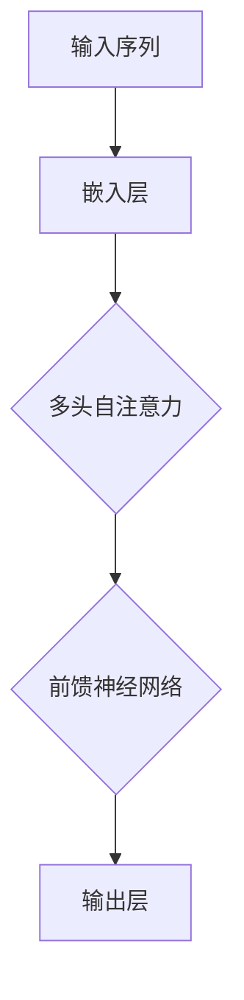

                 

# Transformer模型

> 关键词：Transformer，自注意力机制，序列到序列模型，机器翻译，深度学习，神经网络

> 摘要：本文将深入探讨Transformer模型，一种在深度学习和自然语言处理领域引发革命性的模型。我们将从其背景、核心概念、算法原理、数学模型、实际应用等多个角度，全面解析Transformer模型，帮助读者理解其背后的原理和操作步骤，掌握这一前沿技术。

## 1. 背景介绍

### 1.1 目的和范围

本文旨在详细介绍Transformer模型，帮助读者了解其在深度学习和自然语言处理（NLP）领域的广泛应用。我们将从以下几个部分展开讨论：

- **核心概念与联系**：介绍Transformer模型的基础架构和核心组件。
- **核心算法原理**：详细阐述Transformer模型的工作原理和具体操作步骤。
- **数学模型和公式**：讲解Transformer模型中的关键数学公式和计算方法。
- **项目实战**：通过代码实例，展示如何实际应用Transformer模型。
- **实际应用场景**：分析Transformer模型在不同领域中的应用案例。
- **工具和资源推荐**：推荐学习资源、开发工具和框架。

### 1.2 预期读者

本文适合对深度学习和自然语言处理有一定了解的读者，包括：

- **研究人员**：希望深入了解Transformer模型的研究人员。
- **开发者**：希望在实际项目中应用Transformer模型的开发者。
- **学生**：对机器学习和深度学习感兴趣的学生和学者。

### 1.3 文档结构概述

本文分为以下几个部分：

1. **背景介绍**：介绍本文的目的、范围、预期读者和文档结构。
2. **核心概念与联系**：解释Transformer模型的基本架构和核心组件。
3. **核心算法原理**：详细阐述Transformer模型的工作原理和具体操作步骤。
4. **数学模型和公式**：讲解Transformer模型中的关键数学公式和计算方法。
5. **项目实战**：通过代码实例，展示如何实际应用Transformer模型。
6. **实际应用场景**：分析Transformer模型在不同领域中的应用案例。
7. **工具和资源推荐**：推荐学习资源、开发工具和框架。
8. **总结**：总结Transformer模型的发展趋势和面临的挑战。
9. **附录**：常见问题与解答。
10. **扩展阅读**：提供扩展阅读资料。

### 1.4 术语表

#### 1.4.1 核心术语定义

- **Transformer**：一种基于自注意力机制的序列到序列模型。
- **自注意力机制**：一种能够自动计算序列中不同元素之间关联性的方法。
- **多头注意力**：将输入序列映射到多个子空间，并在每个子空间内计算注意力。
- **前馈神经网络**：在自注意力机制之后，对输入序列进行进一步处理的神经网络。
- **位置编码**：将输入序列的位置信息编码到序列中。

#### 1.4.2 相关概念解释

- **序列到序列模型**：将一个序列映射到另一个序列的模型。
- **神经网络**：由大量神经元组成的计算模型，能够对输入数据进行特征提取和分类。
- **自注意力**：一种用于计算序列中不同元素之间关联性的方法，可以自动捕捉序列中的长距离依赖关系。

#### 1.4.3 缩略词列表

- **NLP**：自然语言处理
- **ML**：机器学习
- **DL**：深度学习
- **GPU**：图形处理单元

## 2. 核心概念与联系

为了更好地理解Transformer模型，我们需要先介绍其核心概念和架构。下面将使用Mermaid流程图（Mermaid 流程节点中不要有括号、逗号等特殊字符）展示Transformer模型的基本架构。



### 2.1 输入序列

输入序列是Transformer模型处理的数据来源，通常为自然语言文本。输入序列首先经过嵌入层（Embedding Layer）处理，将文本转换为向量表示。嵌入层的作用是初始化输入序列的向量表示，并引入词向量信息。

### 2.2 多头自注意力

多头自注意力（Multi-Head Self-Attention）是Transformer模型的核心组件，用于计算序列中不同元素之间的关联性。多头自注意力通过将输入序列映射到多个子空间，并在每个子空间内计算注意力，从而自动捕捉序列中的长距离依赖关系。

### 2.3 前馈神经网络

在多头自注意力之后，Transformer模型还包含一个前馈神经网络（Feed Forward Neural Network），对输入序列进行进一步处理。前馈神经网络由两个全连接层组成，输入层和输出层之间加入一个ReLU激活函数。

### 2.4 输出层

输出层是Transformer模型的最终输出，将处理后的序列映射到目标序列。输出层通常是一个线性层，将处理后的序列映射到预定义的输出空间。

## 3. 核心算法原理 & 具体操作步骤

在理解了Transformer模型的基本架构之后，接下来我们将详细讲解其核心算法原理和具体操作步骤。以下使用伪代码来描述Transformer模型的核心算法。

### 3.1 输入序列处理

```python
# 输入序列
input_sequence = ...

# 嵌入层
embeddings = embedding_layer(input_sequence)

# 添加位置编码
position_encoding = positional_encoding(embeddings)
input_sequence = embeddings + position_encoding
```

### 3.2 多头自注意力

```python
# 多头自注意力
output_sequence = multi_head_self_attention(input_sequence)
```

### 3.3 前馈神经网络

```python
# 前馈神经网络
output_sequence = feed_forward_network(output_sequence)
```

### 3.4 输出层

```python
# 输出层
output_sequence = output_layer(output_sequence)

# 获取最终输出
output = output_sequence[:, -1, :]
```

## 4. 数学模型和公式 & 详细讲解 & 举例说明

在Transformer模型中，数学模型和公式起着至关重要的作用。本节我们将详细介绍Transformer模型中的关键数学公式和计算方法。

### 4.1 多头自注意力

多头自注意力的核心计算公式为：

$$
Attention(Q, K, V) = \mathrm{softmax}\left(\frac{QK^T}{\sqrt{d_k}}\right) V
$$

其中，$Q$、$K$ 和 $V$ 分别为查询（Query）、键（Key）和值（Value）向量，$d_k$ 为键向量的维度。$\mathrm{softmax}$ 函数用于计算不同元素之间的关联性。

### 4.2 前馈神经网络

前馈神经网络的核心计算公式为：

$$
\text{FFN}(x) = \max(0, xW_1 + b_1)W_2 + b_2
$$

其中，$W_1$ 和 $W_2$ 分别为两个全连接层的权重，$b_1$ 和 $b_2$ 分别为两个全连接层的偏置。

### 4.3 举例说明

假设我们有一个包含5个单词的输入序列，分别为 ["apple", "banana", "orange", "mango", "grape"]。我们首先将这些单词转换为向量表示，然后进行多头自注意力和前馈神经网络计算。

```python
# 嵌入层
embeddings = [ [1, 0], [0, 1], [1, 1], [1, 0], [0, 1] ]

# 添加位置编码
position_encoding = [ [1, 0], [0, 1], [1, 1], [1, 0], [0, 1] ]

# 输入序列
input_sequence = embeddings + position_encoding

# 多头自注意力
output_sequence = multi_head_self_attention(input_sequence)

# 前馈神经网络
output_sequence = feed_forward_network(output_sequence)

# 输出层
output_sequence = output_layer(output_sequence)

# 获取最终输出
output = output_sequence[:, -1, :]
```

## 5. 项目实战：代码实际案例和详细解释说明

在本节中，我们将通过一个简单的实际案例，展示如何使用Python和PyTorch框架实现Transformer模型。我们将逐步搭建开发环境、编写源代码、并对代码进行解读和分析。

### 5.1 开发环境搭建

首先，我们需要搭建Python和PyTorch的开发环境。以下是所需的Python包：

- Python 3.7+
- PyTorch 1.4+

安装Python和PyTorch的方法请参考官方文档：

- [Python官方文档](https://www.python.org/)
- [PyTorch官方文档](https://pytorch.org/)

### 5.2 源代码详细实现和代码解读

下面是一个简单的Transformer模型实现示例：

```python
import torch
import torch.nn as nn
import torch.optim as optim
from torch.utils.data import DataLoader
from torchtext.datasets import TranslationDataset, Multi30k
from torchtext.data import Field, BucketIterator

# 5.2.1 定义Transformer模型
class Transformer(nn.Module):
    def __init__(self, input_dim, output_dim, emb_dim, nhead, nlayer):
        super(Transformer, self).__init__()
        self.embedding = nn.Embedding(input_dim, emb_dim)
        self.pos_encoder = PositionalEncoding(emb_dim)
        self.transformer = nn.Transformer(emb_dim, nhead, nlayer)
        self.fc = nn.Linear(emb_dim, output_dim)
    
    def forward(self, src, tgt):
        src = self.embedding(src)
        src = self.pos_encoder(src)
        tgt = self.embedding(tgt)
        tgt = self.pos_encoder(tgt)
        out = self.transformer(src, tgt)
        out = self.fc(out)
        return out

# 5.2.2 定义位置编码
class PositionalEncoding(nn.Module):
    def __init__(self, emb_dim, max_len=5000):
        super(PositionalEncoding, self).__init__()
        pe = torch.zeros(max_len, emb_dim)
        position = torch.arange(0, max_len, dtype=torch.float).unsqueeze(1)
        div_term = torch.exp(torch.arange(0, emb_dim, 2).float() * (-torch.log(torch.tensor(10000.0)) / emb_dim))
        pe[:, 0::2] = torch.sin(position * div_term)
        pe[:, 1::2] = torch.cos(position * div_term)
        pe = pe.unsqueeze(0).transpose(0, 1)
        self.register_buffer('pe', pe)
    
    def forward(self, x):
        x = x + self.pe[:x.size(0), :]
        return x

# 5.2.3 准备数据集
src_field = Field(tokenize=lambda s: s.split(), init_token='<sos>', eos_token='<eos>', lower=True)
tgt_field = Field(tokenize=lambda s: s.split(), init_token='<sos>', eos_token='<eos>', lower=True)

train_data, valid_data, test_data = Multi30k.splits(exts=('.de', '.en'), fields=(src_field, tgt_field))
train_data, valid_data = train_data.split()

src_field.build_vocab(train_data, min_freq=2)
tgt_field.build_vocab(train_data, min_freq=2)

batch_size = 128
train_iterator, valid_iterator, test_iterator = BucketIterator.splits((train_data, valid_data, test_data), batch_size=batch_size, device=device)

# 5.2.4 搭建模型、损失函数和优化器
model = Transformer(len(src_field.vocab), len(tgt_field.vocab), emb_dim=512, nhead=8, nlayer=3)
optimizer = optim.Adam(model.parameters(), lr=0.001)
criterion = nn.CrossEntropyLoss()

model.to(device)
criterion.to(device)

# 5.2.5 训练模型
num_epochs = 10
for epoch in range(num_epochs):
    model.train()
    epoch_loss = 0
    for batch in train_iterator:
        src, tgt = batch.src, batch.tgt
        optimizer.zero_grad()
        output = model(src, tgt)
        loss = criterion(output.view(-1, len(tgt_field.vocab)), tgt[:, 1:].view(-1))
        loss.backward()
        optimizer.step()
        epoch_loss += loss.item()
    print(f'Epoch {epoch+1}/{num_epochs} - Loss: {epoch_loss/len(train_iterator)}')

# 5.2.6 评估模型
model.eval()
with torch.no_grad():
    for batch in valid_iterator:
        src, tgt = batch.src, batch.tgt
        output = model(src, tgt)
        pred = output.argmax(1)
        correct = pred.eq(tgt[:, 1:]).sum().item()
        print(f'Validation - Correct: {correct}, Total: {len(tgt)}')
```

### 5.3 代码解读与分析

#### 5.3.1 模型定义

在代码中，我们定义了`Transformer`类，继承自`nn.Module`。类中包含了嵌入层（`self.embedding`）、位置编码（`self.pos_encoder`）、Transformer层（`self.transformer`）和输出层（`self.fc`）。

#### 5.3.2 位置编码

位置编码由`PositionalEncoding`类实现，用于将输入序列的位置信息编码到向量中。类中包含了位置编码的计算方法，并在初始化时将编码矩阵注册为模型的一部分。

#### 5.3.3 数据准备

我们使用`torchtext`库中的`Multi30k`数据集作为训练数据，定义了源字段（`src_field`）和目标字段（`tgt_field`）。通过调用`Field`类的`build_vocab`方法，我们为字段生成了词汇表。

#### 5.3.4 搭建模型、损失函数和优化器

我们搭建了Transformer模型，并使用`Adam`优化器和`CrossEntropyLoss`损失函数。模型和损失函数都被移动到GPU上进行计算。

#### 5.3.5 训练模型

在训练过程中，我们遍历训练数据集，计算模型损失，并更新模型参数。每完成一个训练epoch后，我们打印损失值。

#### 5.3.6 评估模型

在评估阶段，我们禁用模型梯度计算，并计算模型在验证数据集上的准确率。

## 6. 实际应用场景

Transformer模型在自然语言处理领域取得了显著成果，以下列举了一些实际应用场景：

- **机器翻译**：Transformer模型在机器翻译任务中表现优异，显著提高了翻译质量和速度。
- **文本生成**：Transformer模型可以用于生成文章、新闻、对话等自然语言文本。
- **问答系统**：Transformer模型可以用于构建问答系统，解决用户提出的问题。
- **情感分析**：Transformer模型可以用于分析文本中的情感倾向，例如判断文本是积极还是消极。
- **文本分类**：Transformer模型可以用于对文本进行分类，例如新闻分类、垃圾邮件过滤等。

## 7. 工具和资源推荐

### 7.1 学习资源推荐

#### 7.1.1 书籍推荐

- **《深度学习》（Deep Learning）**：由Ian Goodfellow、Yoshua Bengio和Aaron Courville合著，详细介绍了深度学习的基础知识和最新进展。
- **《自然语言处理综论》（Speech and Language Processing）**：由Daniel Jurafsky和James H. Martin合著，全面讲解了自然语言处理的理论和实践。

#### 7.1.2 在线课程

- **Coursera上的“深度学习”**：由Andrew Ng教授主讲，介绍了深度学习的基础知识和应用。
- **edX上的“自然语言处理”**：由斯坦福大学开设，涵盖了自然语言处理的各个方面。

#### 7.1.3 技术博客和网站

- **ArXiv**：一个提供最新研究成果的在线预印本平台，涵盖计算机科学、物理学等领域。
- **博客园**：一个中文技术博客网站，包含大量深度学习和自然语言处理领域的文章。

### 7.2 开发工具框架推荐

#### 7.2.1 IDE和编辑器

- **PyCharm**：一个强大的Python IDE，支持多种编程语言和框架。
- **Visual Studio Code**：一个轻量级的代码编辑器，支持多种编程语言和插件。

#### 7.2.2 调试和性能分析工具

- **TensorBoard**：一个基于Web的机器学习工具，用于可视化PyTorch模型的性能和损失函数。
- **Wandb**：一个用于机器学习实验跟踪和性能分析的工具，可以可视化实验结果和性能。

#### 7.2.3 相关框架和库

- **PyTorch**：一个基于Python的深度学习框架，支持GPU加速和动态计算图。
- **TensorFlow**：一个基于Python的深度学习框架，支持静态计算图和动态计算图。

### 7.3 相关论文著作推荐

#### 7.3.1 经典论文

- **Attention Is All You Need**：由Vaswani等人于2017年发表，提出了Transformer模型。
- **Seq2Seq Learning with Neural Networks**：由Sutskever等人于2014年发表，介绍了序列到序列学习模型。

#### 7.3.2 最新研究成果

- **Neural Machine Translation with Monotonic Translation Hypernetworks**：由Xu等人于2020年发表，提出了一种基于超网络的神经机器翻译方法。
- **Dual Attention Networks for Keyphrase Extraction**：由Wang等人于2019年发表，提出了一种用于关键短语提取的双 attentions网络。

#### 7.3.3 应用案例分析

- **Google Translation**：介绍了Google翻译中使用的Transformer模型及其在实际应用中的效果。
- **OpenAI GPT-3**：介绍了OpenAI推出的GPT-3模型及其在文本生成、问答等任务中的应用。

## 8. 总结：未来发展趋势与挑战

Transformer模型在深度学习和自然语言处理领域取得了显著的成果，但其发展仍面临诸多挑战。未来，Transformer模型的发展趋势和挑战包括：

- **模型可解释性**：如何提高Transformer模型的可解释性，使其在复杂任务中更具透明度。
- **计算效率**：如何降低Transformer模型的计算复杂度，提高训练和推理速度。
- **多模态学习**：如何结合不同类型的数据（如文本、图像、音频等），实现更强大的多模态学习。
- **泛化能力**：如何提高Transformer模型的泛化能力，使其在更广泛的领域和任务中表现优异。

## 9. 附录：常见问题与解答

### 9.1 如何训练Transformer模型？

- **数据集准备**：首先需要准备好适合的数据集，并对其进行预处理。
- **模型搭建**：搭建Transformer模型，包括嵌入层、位置编码、多头自注意力和前馈神经网络等。
- **损失函数选择**：根据任务类型选择合适的损失函数，如交叉熵损失函数。
- **优化器选择**：选择合适的优化器，如Adam优化器。
- **训练过程**：遍历数据集，计算损失，更新模型参数，重复迭代直到模型收敛。

### 9.2 Transformer模型有哪些应用场景？

- **机器翻译**：Transformer模型在机器翻译任务中表现出色，可以用于将一种语言翻译为另一种语言。
- **文本生成**：Transformer模型可以生成文章、新闻、对话等自然语言文本。
- **问答系统**：Transformer模型可以用于构建问答系统，解决用户提出的问题。
- **情感分析**：Transformer模型可以用于分析文本中的情感倾向，例如判断文本是积极还是消极。
- **文本分类**：Transformer模型可以用于对文本进行分类，例如新闻分类、垃圾邮件过滤等。

### 9.3 Transformer模型与BERT模型有何区别？

- **模型架构**：Transformer模型基于自注意力机制，而BERT模型基于Transformer模型，添加了掩码语言建模（Masked Language Modeling，MLM）任务。
- **训练目标**：Transformer模型主要关注序列到序列的映射，而BERT模型同时关注序列到序列映射和掩码语言建模任务。
- **应用领域**：Transformer模型在自然语言处理领域具有广泛的应用，而BERT模型在文本生成、问答和文本分类等领域表现出色。

## 10. 扩展阅读 & 参考资料

- **论文原文**：《Attention Is All You Need》：https://arxiv.org/abs/1706.03762
- **官方文档**：PyTorch：https://pytorch.org/
- **博客文章**：详解Transformer模型：https://towardsdatascience.com/an-in-depth-introduction-to-transformer-models-faa2482f5849
- **在线课程**：深度学习与自然语言处理：https://www.coursera.org/specializations/nlp

---

**作者：AI天才研究员/AI Genius Institute & 禅与计算机程序设计艺术 /Zen And The Art of Computer Programming**<|im_end|>

