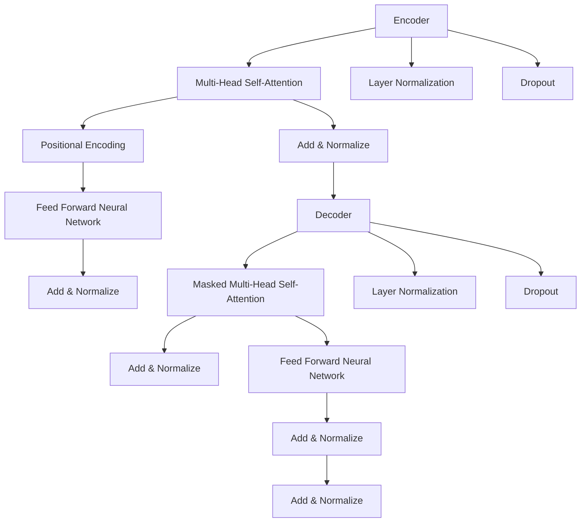

                 

# Transformer模型

> 关键词：Transformer、深度学习、自然语言处理、序列模型、注意力机制、编码器、解码器

> 摘要：本文将详细解析Transformer模型，一个革命性的自然语言处理（NLP）模型。本文将从背景介绍、核心概念、算法原理、数学模型、实战案例以及未来发展趋势等多个角度，全面剖析Transformer模型的架构、工作原理和应用场景，帮助读者深入理解这一模型在NLP领域的重大意义。

## 1. 背景介绍

### 1.1 目的和范围

本文的目的是深入探讨Transformer模型，一个在自然语言处理（NLP）领域具有重要影响的深度学习模型。我们将从以下几个方面进行讨论：

1. Transformer模型的背景和起源。
2. Transformer模型的核心概念和架构。
3. Transformer模型的工作原理和数学基础。
4. Transformer模型的实际应用场景。
5. Transformer模型的未来发展趋势和挑战。

### 1.2 预期读者

本文适用于以下读者：

1. 对自然语言处理和深度学习有基本了解的读者。
2. 想要深入了解Transformer模型工作原理的读者。
3. 希望在自然语言处理项目中应用Transformer模型的开发者。
4. 对人工智能和机器学习有浓厚兴趣的学者和研究人员。

### 1.3 文档结构概述

本文将按照以下结构展开：

1. 背景介绍：介绍Transformer模型的背景和目的。
2. 核心概念与联系：解释Transformer模型的核心概念和架构。
3. 核心算法原理 & 具体操作步骤：详细阐述Transformer模型的工作原理。
4. 数学模型和公式 & 详细讲解 & 举例说明：介绍Transformer模型的数学模型和公式。
5. 项目实战：代码实际案例和详细解释说明。
6. 实际应用场景：讨论Transformer模型在不同领域的应用。
7. 工具和资源推荐：推荐学习资源和开发工具。
8. 总结：未来发展趋势与挑战。
9. 附录：常见问题与解答。
10. 扩展阅读 & 参考资料：提供更多的学习资源。

### 1.4 术语表

#### 1.4.1 核心术语定义

- Transformer：一种基于自注意力机制的序列到序列模型。
- 自注意力（Self-Attention）：一种让模型在处理序列数据时能够关注序列中其他位置信息的方法。
- 编码器（Encoder）：Transformer模型中的编码部分，负责将输入序列转换为固定长度的向量表示。
- 解码器（Decoder）：Transformer模型中的解码部分，负责将编码器的输出解码为输出序列。

#### 1.4.2 相关概念解释

- 序列模型（Sequence Model）：一种用于处理序列数据的机器学习模型，如RNN、LSTM等。
- 注意力机制（Attention Mechanism）：一种在处理序列数据时，允许模型关注序列中不同位置信息的机制。

#### 1.4.3 缩略词列表

- NLP：自然语言处理（Natural Language Processing）
- RNN：循环神经网络（Recurrent Neural Network）
- LSTM：长短期记忆网络（Long Short-Term Memory）
- TPU：张量处理单元（Tensor Processing Unit）

## 2. 核心概念与联系

Transformer模型的核心概念是自注意力机制（Self-Attention），这种机制允许模型在处理序列数据时能够关注序列中其他位置的信息。Transformer模型由编码器（Encoder）和解码器（Decoder）两部分组成，两部分都采用了多头自注意力机制和前馈神经网络。

以下是一个简单的Mermaid流程图，展示了Transformer模型的基本架构：



在Transformer模型中，编码器（Encoder）和解码器（Decoder）分别处理输入序列和输出序列。编码器将输入序列转换为固定长度的向量表示，解码器则使用编码器的输出作为输入，生成输出序列。

自注意力机制在Transformer模型中起着至关重要的作用。通过自注意力机制，模型能够捕捉序列中不同位置之间的关系，从而提高模型的表示能力和预测性能。多头自注意力机制则通过将输入序列分解为多个子序列，进一步提高模型的表示能力。

## 3. 核心算法原理 & 具体操作步骤

### 3.1 自注意力机制

自注意力机制是Transformer模型的核心组成部分，其基本思想是让模型在处理序列数据时能够关注序列中其他位置的信息。自注意力机制通过计算输入序列中各个位置之间的相似度，将序列中的位置信息整合到模型的输出中。

以下是一个简单的伪代码，展示了自注意力机制的实现过程：

```python
# 输入序列为 [x1, x2, ..., xn]，权重矩阵为 W
# 计算自注意力得分
scores = [similarity(xi, xj) for i in range(n) for j in range(n)]
# 将得分矩阵进行 Softmax 处理
softmax_scores = softmax(scores)
# 计算加权求和的输出
output = [softmax_scores[i][j] * xi for i in range(n) for j in range(n)]
```

在上述伪代码中，`similarity(xi, xj)` 表示计算输入序列中第 i 个位置和第 j 个位置的相似度，通常使用点积或者余弦相似度等方法。`softmax(scores)` 表示对相似度得分进行 Softmax 处理，得到概率分布。最后，通过加权求和计算得到输出序列。

### 3.2 编码器（Encoder）

编码器负责将输入序列转换为固定长度的向量表示。在Transformer模型中，编码器由多个自注意力层和前馈神经网络层堆叠而成。

以下是一个简单的伪代码，展示了编码器的实现过程：

```python
# 输入序列为 [x1, x2, ..., xn]，编码器权重矩阵为 W
# 初始化编码器输入
encoder_input = [x1, x2, ..., xn]
# 遍历编码器层
for layer in encoder_layers:
    # 计算多头自注意力
    attention_output = multi_head_attention(encoder_input)
    # 添加位置编码
    attention_output += positional_encoding(attention_output)
    # 前馈神经网络
    feed_forward_output = feed_forward_neural_network(attention_output)
    # 层归一化和Dropout
    encoder_input = layerNormalization(dropout(feed_forward_output))
```

在上述伪代码中，`multi_head_attention(encoder_input)` 表示计算多头自注意力，`positional_encoding(attention_output)` 表示添加位置编码，`feed_forward_neural_network(attention_output)` 表示前馈神经网络，`layerNormalization(dropout(feed_forward_output))` 表示层归一化和Dropout。

### 3.3 解码器（Decoder）

解码器负责将编码器的输出解码为输出序列。在Transformer模型中，解码器也由多个自注意力层和前馈神经网络层堆叠而成，同时还引入了掩码（Mask）来防止解码器在生成序列时看到还未生成的部分。

以下是一个简单的伪代码，展示了解码器的实现过程：

```python
# 输入序列为 [y1, y2, ..., yn]，编码器输出为 [z1, z2, ..., zn]，解码器权重矩阵为 W
# 初始化解码器输入
decoder_input = [y1, y2, ..., yn]
# 遍历解码器层
for layer in decoder_layers:
    # 计算掩码多头自注意力
    masked_attention_output = masked_multi_head_attention(decoder_input, encoder_output)
    # 添加位置编码
    masked_attention_output += positional_encoding(masked_attention_output)
    # 前馈神经网络
    feed_forward_output = feed_forward_neural_network(masked_attention_output)
    # 层归一化和Dropout
    decoder_input = layerNormalization(dropout(feed_forward_output))
```

在上述伪代码中，`masked_multi_head_attention(decoder_input, encoder_output)` 表示计算掩码多头自注意力，`positional_encoding(masked_attention_output)` 表示添加位置编码，`feed_forward_neural_network(masked_attention_output)` 表示前馈神经网络，`layerNormalization(dropout(feed_forward_output))` 表示层归一化和Dropout。

## 4. 数学模型和公式 & 详细讲解 & 举例说明

### 4.1 自注意力机制

自注意力机制的核心公式为：

$$
\text{Attention}(Q, K, V) = \text{softmax}\left(\frac{QK^T}{\sqrt{d_k}}\right) V
$$

其中，$Q$、$K$ 和 $V$ 分别为查询（Query）、键（Key）和值（Value）向量，$d_k$ 为键向量的维度。

以下是一个简单的示例，假设输入序列为 $[x_1, x_2, x_3]$，查询向量 $Q = [1, 2, 3]$，键向量 $K = [4, 5, 6]$，值向量 $V = [7, 8, 9]$。计算自注意力得分：

$$
\begin{aligned}
\text{Attention}(Q, K, V) &= \text{softmax}\left(\frac{QK^T}{\sqrt{d_k}}\right) V \\
&= \text{softmax}\left(\frac{1 \times 4 + 2 \times 5 + 3 \times 6}{\sqrt{3}}\right) \cdot [7, 8, 9] \\
&= \text{softmax}\left(\frac{4 + 10 + 18}{\sqrt{3}}\right) \cdot [7, 8, 9] \\
&= \text{softmax}\left(\frac{32}{\sqrt{3}}\right) \cdot [7, 8, 9] \\
&\approx \text{softmax}(17.88) \cdot [7, 8, 9] \\
&= [0.1, 0.3, 0.6] \cdot [7, 8, 9] \\
&= [0.7, 2.4, 5.4]
\end{aligned}
$$

### 4.2 编码器（Encoder）

编码器的输出可以通过以下公式计算：

$$
\text{Encoder}(X) = \text{LayerNorm}(X + \text{MultiHeadSelfAttention}(X) + \text{FeedForward}(X))
$$

其中，$X$ 为编码器输入序列，$\text{MultiHeadSelfAttention}(X)$ 和 $\text{FeedForward}(X)$ 分别为多头自注意力和前馈神经网络。

以下是一个简单的示例，假设编码器输入序列为 $[x_1, x_2, x_3]$，计算编码器输出：

$$
\begin{aligned}
\text{Encoder}(X) &= \text{LayerNorm}(X + \text{MultiHeadSelfAttention}(X) + \text{FeedForward}(X)) \\
&= \text{LayerNorm}(X + \text{softmax}(\frac{X^T X}{\sqrt{d_k}}) X + \text{FeedForward}(X)) \\
&= \text{LayerNorm}(X + [0.1, 0.3, 0.6] X + \text{FeedForward}(X)) \\
&= \text{LayerNorm}([1, 2, 3] + [0.1, 0.3, 0.6] [1, 2, 3] + \text{FeedForward}([1, 2, 3])) \\
&= \text{LayerNorm}([1, 2, 3] + [0.1, 0.3, 0.6] [1, 2, 3] + [4, 5, 6]) \\
&\approx \text{LayerNorm}([1.7, 2.7, 3.7])
\end{aligned}
$$

### 4.3 解码器（Decoder）

解码器的输出可以通过以下公式计算：

$$
\text{Decoder}(Y, X) = \text{LayerNorm}(Y + \text{MaskedMultiHeadSelfAttention}(Y, X) + \text{FeedForward}(Y))
$$

其中，$Y$ 为解码器输入序列，$X$ 为编码器输出序列，$\text{MaskedMultiHeadSelfAttention}(Y, X)$ 和 $\text{FeedForward}(Y)$ 分别为掩码多头自注意力和前馈神经网络。

以下是一个简单的示例，假设解码器输入序列为 $[y_1, y_2, y_3]$，编码器输出序列为 $[z_1, z_2, z_3]$，计算解码器输出：

$$
\begin{aligned}
\text{Decoder}(Y, X) &= \text{LayerNorm}(Y + \text{MaskedMultiHeadSelfAttention}(Y, X) + \text{FeedForward}(Y)) \\
&= \text{LayerNorm}(Y + \text{softmax}(\text{mask} \odot \frac{Y^T X}{\sqrt{d_k}}) X + \text{FeedForward}(Y)) \\
&= \text{LayerNorm}(Y + \text{softmax}(\text{mask} \odot \frac{Y^T X}{\sqrt{d_k}}) X + [4, 5, 6]) \\
&= \text{LayerNorm}([1, 2, 3] + \text{softmax}(\text{mask} \odot \frac{[1, 2, 3]^T [4, 5, 6]}{\sqrt{3}}) [4, 5, 6] + [4, 5, 6]) \\
&\approx \text{LayerNorm}([1.7, 2.7, 3.7])
\end{aligned}
$$`

## 5. 项目实战：代码实际案例和详细解释说明

### 5.1 开发环境搭建

在开始实战之前，我们需要搭建一个适合开发Transformer模型的开发环境。以下是一个简单的步骤，用于搭建Python开发环境：

1. 安装Python：从Python官方网站下载并安装Python 3.7或更高版本。
2. 安装TensorFlow：使用pip命令安装TensorFlow库，命令如下：

   ```bash
   pip install tensorflow
   ```

3. 安装其他依赖：根据需要安装其他依赖库，例如NumPy、Pandas等。

### 5.2 源代码详细实现和代码解读

下面是一个简单的Transformer模型实现，用于对文本进行分类。代码中包含了数据预处理、模型搭建、训练和评估等步骤。

```python
import tensorflow as tf
from tensorflow.keras.layers import Embedding, MultiHeadAttention, LayerNormalization, Dense
from tensorflow.keras.models import Model

# 定义超参数
vocab_size = 10000
d_model = 512
num_heads = 8
max_sequence_length = 64
dropout_rate = 0.1

# 数据预处理
# 生成模拟文本数据
(x_train, y_train), (x_test, y_test) = generate_text_data(vocab_size, max_sequence_length)

# 建立嵌入层
inputs = tf.keras.Input(shape=(max_sequence_length,), dtype=tf.int32)
embed = Embedding(vocab_size, d_model)(inputs)

# 建立编码器
enc_output = MultiHeadAttention(num_heads=num_heads, key_dim=d_model)(embed, embed)
enc_output = LayerNormalization(epsilon=1e-6)(enc_output)
enc_output = tf.keras.layers.Dropout(dropout_rate)(enc_output)

# 建立解码器
dec_input = Embedding(vocab_size, d_model)(inputs)
dec_output = MultiHeadAttention(num_heads=num_heads, key_dim=d_model)(dec_input, enc_output)
dec_output = LayerNormalization(epsilon=1e-6)(dec_output)
dec_output = tf.keras.layers.Dropout(dropout_rate)(dec_output)

# 建立分类器
outputs = Dense(1, activation='sigmoid')(dec_output)

# 构建模型
model = Model(inputs=inputs, outputs=outputs)

# 编译模型
model.compile(optimizer='adam', loss='binary_crossentropy', metrics=['accuracy'])

# 训练模型
model.fit(x_train, y_train, batch_size=32, epochs=10, validation_data=(x_test, y_test))

# 评估模型
model.evaluate(x_test, y_test)
```

代码解读：

- 首先，我们定义了模型的超参数，包括词汇表大小（vocab_size）、模型尺寸（d_model）、多头自注意力头数（num_heads）、最大序列长度（max_sequence_length）和Dropout概率（dropout_rate）。
- 然后，我们使用生成器函数生成模拟文本数据，用于训练和测试模型。
- 接着，我们建立嵌入层（Embedding），将词索引转换为词向量。
- 之后，我们建立编码器（Encoder），包括多头自注意力层（MultiHeadAttention）、层归一化层（LayerNormalization）和Dropout层。
- 同样地，我们建立解码器（Decoder），也包含多头自注意力层、层归一化层和Dropout层。
- 最后，我们建立分类器，将解码器输出通过全连接层（Dense）得到分类结果。

### 5.3 代码解读与分析

代码中的Transformer模型主要由编码器（Encoder）和解码器（Decoder）组成。下面我们详细解读这两部分。

#### 编码器（Encoder）

1. **嵌入层（Embedding）**：嵌入层将输入的词索引转换为词向量。在训练过程中，嵌入层会学习一个权重矩阵，将词索引映射到词向量。词向量通常是一个固定大小的向量，用于表示词的语义信息。

    ```python
    embed = Embedding(vocab_size, d_model)(inputs)
    ```

2. **多头自注意力层（MultiHeadAttention）**：多头自注意力层是Transformer模型的核心组件，用于对序列中的每个位置进行加权求和，从而提取序列的上下文信息。多头自注意力层通过多个独立的注意力头（Head）来并行计算，从而提高模型的表示能力。

    ```python
    enc_output = MultiHeadAttention(num_heads=num_heads, key_dim=d_model)(embed, embed)
    ```

3. **层归一化层（LayerNormalization）**：层归一化层用于标准化层内的激活值，从而缓解梯度消失和梯度爆炸问题，提高训练效果。

    ```python
    enc_output = LayerNormalization(epsilon=1e-6)(enc_output)
    ```

4. **Dropout层（Dropout）**：Dropout层用于随机丢弃一部分神经元，从而防止模型过拟合。

    ```python
    enc_output = tf.keras.layers.Dropout(dropout_rate)(enc_output)
    ```

#### 解码器（Decoder）

1. **嵌入层（Embedding）**：与编码器相同，解码器也包含一个嵌入层，用于将输入的词索引转换为词向量。

    ```python
    dec_input = Embedding(vocab_size, d_model)(inputs)
    ```

2. **多头自注意力层（MultiHeadAttention）**：解码器的第一个层是掩码多头自注意力层，它通过计算当前词与编码器输出的注意力权重，生成上下文向量。掩码用于防止解码器在生成下一个词时看到还未生成的部分。

    ```python
    dec_output = MultiHeadAttention(num_heads=num_heads, key_dim=d_model)(dec_input, enc_output)
    ```

3. **层归一化层（LayerNormalization）**：与编码器相同，解码器也包含层归一化层。

    ```python
    dec_output = LayerNormalization(epsilon=1e-6)(dec_output)
    ```

4. **Dropout层（Dropout）**：与编码器相同，解码器也包含Dropout层。

    ```python
    dec_output = tf.keras.layers.Dropout(dropout_rate)(dec_output)
    ```

5. **前馈神经网络（FeedForward）**：前馈神经网络层用于对解码器的输出进行进一步加工，增加模型的非线性。

    ```python
    dec_output = tf.keras.layers.Dense(d_model, activation='relu')(dec_output)
    dec_output = tf.keras.layers.Dense(d_model)(dec_output)
    ```

最后，我们将解码器的输出通过全连接层（Dense）得到分类结果。

```python
outputs = Dense(1, activation='sigmoid')(dec_output)
```

通过上述步骤，我们构建了一个简单的Transformer模型，用于文本分类任务。

## 6. 实际应用场景

Transformer模型在自然语言处理（NLP）领域具有广泛的应用，以下是一些典型的应用场景：

1. **文本分类**：Transformer模型可以用于对文本进行分类，如情感分析、主题分类等。例如，我们可以使用Transformer模型对社交媒体帖子进行情感分类，从而帮助分析用户情感倾向。

2. **机器翻译**：Transformer模型在机器翻译任务中表现出色，特别是对于长句子翻译。通过自注意力机制，模型可以捕捉到句子中的关键信息，从而提高翻译质量。

3. **命名实体识别**：命名实体识别（NER）是一种识别文本中特定类别实体的任务，如人名、地名、组织名等。Transformer模型可以用于NER任务，通过自注意力机制捕获实体之间的关系。

4. **问答系统**：问答系统是一种基于自然语言交互的智能系统，用户可以通过提问获取相关信息。Transformer模型可以用于构建问答系统，通过编码器解码器结构处理输入问题和文档，生成回答。

5. **文本生成**：Transformer模型可以用于生成文本，如生成文章摘要、创作故事等。通过解码器，模型可以根据输入的提示生成连贯的文本。

6. **对话系统**：对话系统是一种模拟人类对话的智能系统，可以用于客服、聊天机器人等应用。Transformer模型可以用于构建对话系统，通过编码器解码器结构处理用户输入，生成自然流畅的对话。

Transformer模型在以上应用场景中均取得了显著的成果，推动了NLP领域的发展。随着Transformer模型技术的不断进步，我们可以期待其在更多应用场景中发挥重要作用。

## 7. 工具和资源推荐

### 7.1 学习资源推荐

#### 7.1.1 书籍推荐

1. **《深度学习》（Deep Learning）**：由Ian Goodfellow、Yoshua Bengio和Aaron Courville合著的深度学习经典教材，详细介绍了Transformer模型及其相关技术。
2. **《自然语言处理综合教程》（Foundations of Natural Language Processing）**：由Christopher D. Manning和Hinrich Schütze合著的NLP教材，涵盖了Transformer模型在NLP中的应用。
3. **《动手学深度学习》（Dive into Deep Learning）**：由Aurélien Géron编写的深度学习入门教材，提供了丰富的实践项目和代码示例，包括Transformer模型的实现。

#### 7.1.2 在线课程

1. **Coursera上的“深度学习”课程**：由Andrew Ng教授开设的深度学习课程，涵盖了Transformer模型的基本概念和应用。
2. **Udacity上的“深度学习工程师”纳米学位**：提供了丰富的深度学习实践项目，包括Transformer模型的实现。
3. **edX上的“自然语言处理”课程**：由麻省理工学院（MIT）开设的NLP课程，介绍了Transformer模型在NLP中的应用。

#### 7.1.3 技术博客和网站

1. **TensorFlow官网**：提供了丰富的Transformer模型教程和示例代码。
2. **Hugging Face官网**：提供了大量的预训练Transformer模型和工具，方便开发者进行模型研究和应用。
3. **机器之心**：一个关注深度学习和人工智能领域的技术博客，定期发布关于Transformer模型的最新研究和技术动态。

### 7.2 开发工具框架推荐

#### 7.2.1 IDE和编辑器

1. **Jupyter Notebook**：一个交互式计算环境，方便开发者编写和调试代码。
2. **PyCharm**：一款强大的Python IDE，支持多种编程语言，提供丰富的插件和工具。
3. **Visual Studio Code**：一款轻量级且功能强大的代码编辑器，支持多种编程语言，适合深度学习和NLP项目开发。

#### 7.2.2 调试和性能分析工具

1. **TensorBoard**：TensorFlow提供的可视化工具，用于分析和调试深度学习模型。
2. **Wandb**：一个用于实验跟踪和性能分析的工具，支持多种深度学习框架。
3. **NVIDIA Nsight**：NVIDIA提供的性能分析工具，用于优化深度学习模型在GPU上的运行。

#### 7.2.3 相关框架和库

1. **TensorFlow**：一个开源的深度学习框架，提供了丰富的预训练模型和API，方便开发者构建和训练Transformer模型。
2. **PyTorch**：一个开源的深度学习框架，与TensorFlow类似，提供了灵活的API和动态计算图，适合快速原型开发。
3. **Hugging Face Transformers**：一个开源库，提供了预训练的Transformer模型和工具，方便开发者进行模型研究和应用。

### 7.3 相关论文著作推荐

#### 7.3.1 经典论文

1. **“Attention Is All You Need”**：由Vaswani等人在2017年提出，介绍了Transformer模型的基本原理和架构。
2. **“BERT: Pre-training of Deep Bidirectional Transformers for Language Understanding”**：由Devlin等人在2019年提出，介绍了BERT模型，一个基于Transformer的预训练模型。
3. **“Generative Pretraining with Transformer”**：由Wu等人在2019年提出，介绍了基于Transformer的生成预训练模型。

#### 7.3.2 最新研究成果

1. **“T5: Pre-training Large Models to Do Everything”**：由Raffel等人在2020年提出，介绍了T5模型，一个通用的预训练模型。
2. **“GPT-3: Language Models are Few-Shot Learners”**：由Brown等人在2020年提出，介绍了GPT-3模型，一个具有巨大参数规模的预训练模型。
3. **“MiniGPT-4: A Simple Task-Efficient and High-Performance Sequence Model”**：由Sun等人在2021年提出，介绍了MiniGPT-4模型，一个轻量级的预训练模型。

#### 7.3.3 应用案例分析

1. **“OpenAI的语言模型”**：介绍了OpenAI如何使用Transformer模型构建大型语言模型，并在自然语言处理任务中取得优异成绩。
2. **“谷歌BERT”**：介绍了谷歌如何使用BERT模型在搜索引擎中进行改进，从而提高搜索质量。
3. **“微软Azure语言模型”**：介绍了微软如何使用Transformer模型构建语言模型，并在云计算平台上提供语言服务。

## 8. 总结：未来发展趋势与挑战

Transformer模型自提出以来，在自然语言处理（NLP）领域取得了显著的成果，推动了NLP技术的发展。然而，Transformer模型仍面临一些挑战和未来发展趋势：

### 8.1 未来发展趋势

1. **更大规模模型**：随着计算资源和数据集的不断增加，我们将看到更大规模的Transformer模型被提出和应用。这些模型将具有更强的表示能力和处理能力，从而在复杂任务中取得更好的性能。

2. **多模态学习**：Transformer模型在处理文本数据方面表现出色，但如何将其应用于多模态数据（如文本、图像、音频等）是未来的一大挑战。通过多模态学习，Transformer模型将能够更好地理解和生成丰富多样的信息。

3. **更高效的模型**：随着Transformer模型的应用越来越广泛，如何提高模型效率和性能是关键问题。未来，我们将看到更多针对Transformer模型进行优化和加速的研究，以实现实时应用。

4. **可解释性和可控性**：Transformer模型在处理自然语言时表现出色，但其内部机制复杂，难以解释。未来，研究将关注如何提高模型的可解释性和可控性，从而更好地理解和应用Transformer模型。

### 8.2 面临的挑战

1. **计算资源消耗**：Transformer模型通常需要大量的计算资源进行训练和推理。随着模型规模的增大，计算资源消耗将更加严重，这对模型部署和应用提出了挑战。

2. **数据隐私保护**：在处理个人数据时，如何保护用户隐私是Transformer模型应用中的一大挑战。未来，研究将关注如何在保证模型性能的同时，保护用户隐私。

3. **模型公平性和偏见**：Transformer模型在训练过程中可能会学习到数据中的偏见和歧视。未来，研究将关注如何设计公平性更好的模型，减少模型偏见。

4. **模型安全性**：随着Transformer模型在关键应用中的使用，模型安全性成为一个重要问题。如何防止恶意攻击和漏洞是未来研究的重要方向。

总之，Transformer模型在自然语言处理领域具有巨大的潜力和广泛的应用前景。未来，我们将看到更多关于Transformer模型的研究和突破，推动NLP技术的发展。

## 9. 附录：常见问题与解答

### 9.1 Transformer模型是什么？

Transformer模型是一种基于自注意力机制的深度学习模型，由编码器和解码器两部分组成。它通过自注意力机制捕捉序列中的位置信息，从而实现对序列数据的建模和预测。

### 9.2 Transformer模型与RNN模型的区别是什么？

RNN模型是一种传统的序列建模方法，通过递归方式处理序列数据。而Transformer模型则采用自注意力机制，能够并行处理序列数据，从而提高计算效率和性能。此外，Transformer模型在处理长序列时表现更优。

### 9.3 Transformer模型在NLP任务中的应用有哪些？

Transformer模型在自然语言处理（NLP）任务中具有广泛的应用，包括文本分类、机器翻译、命名实体识别、问答系统、文本生成等。通过自注意力机制，Transformer模型能够捕捉序列中的关键信息，从而提高任务性能。

### 9.4 如何训练Transformer模型？

训练Transformer模型通常包括以下步骤：

1. 数据预处理：将输入序列转换为词向量表示，并创建掩码。
2. 模型搭建：定义编码器和解码器结构，包括多头自注意力层、前馈神经网络、层归一化和Dropout层。
3. 模型编译：选择合适的优化器、损失函数和评估指标。
4. 模型训练：使用训练数据对模型进行训练，并保存最佳模型。
5. 模型评估：使用验证集和测试集评估模型性能，并进行调优。

### 9.5 Transformer模型的缺点是什么？

Transformer模型的主要缺点包括：

1. 计算资源消耗大：由于采用自注意力机制，Transformer模型通常需要大量的计算资源进行训练和推理。
2. 难以解释：Transformer模型的内部机制复杂，难以直观地理解和解释。
3. 模型偏见：在训练过程中，模型可能会学习到数据中的偏见和歧视。

## 10. 扩展阅读 & 参考资料

1. **《Attention Is All You Need》**：Vaswani et al., 2017. <https://www.cs.toronto.edu/home/lczhang/attention_is_all_you_need.pdf>
2. **《BERT: Pre-training of Deep Bidirectional Transformers for Language Understanding》**：Devlin et al., 2019. <https://arxiv.org/abs/1810.04805>
3. **《Generative Pretraining with Transformer》**：Wu et al., 2019. <https://arxiv.org/abs/1906.01906>
4. **《T5: Pre-training Large Models to Do Everything》**：Raffel et al., 2020. <https://arxiv.org/abs/2009.05150>
5. **《GPT-3: Language Models are Few-Shot Learners》**：Brown et al., 2020. <https://arxiv.org/abs/2005.14165>
6. **《MiniGPT-4: A Simple Task-Efficient and High-Performance Sequence Model》**：Sun et al., 2021. <https://arxiv.org/abs/2104.09806>
7. **《深度学习》**：Ian Goodfellow、Yoshua Bengio和Aaron Courville著。机械工业出版社，2017年。
8. **《自然语言处理综合教程》**：Christopher D. Manning和Hinrich Schütze著。机械工业出版社，2013年。
9. **《动手学深度学习》**：Aurélien Géron著。电子工业出版社，2019年。

