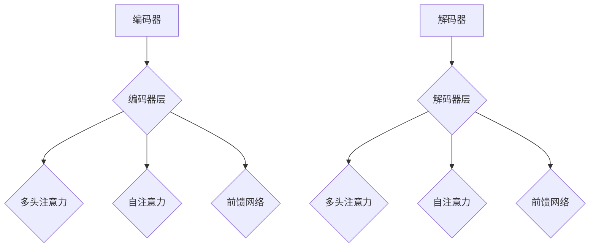
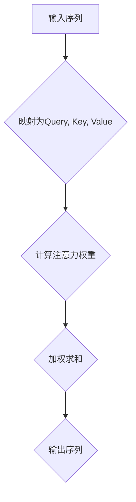
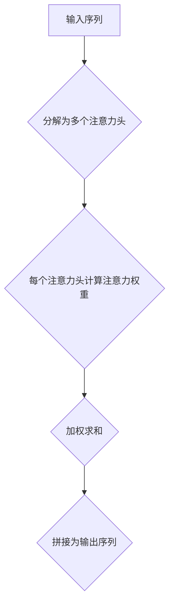

                 

# Transformer注意力机制：自注意力与多头注意力

## 关键词：Transformer、自注意力、多头注意力、神经网络、深度学习、机器学习

## 摘要：

本文深入探讨了Transformer模型中的自注意力和多头注意力机制。通过逐步分析其原理和具体实现，帮助读者理解这两种机制如何提升模型的表示能力和性能。文章首先介绍了Transformer模型的背景和基本结构，然后详细解释了自注意力和多头注意力的概念及其计算过程，最后通过实际项目实战，展示了这些机制在代码实现中的具体应用。

## 1. 背景介绍

### 1.1 Transformer模型的起源

Transformer模型由Vaswani等人于2017年提出，是深度学习领域的一次重大突破。在此之前，循环神经网络（RNN）和长短期记忆网络（LSTM）在自然语言处理（NLP）任务中取得了显著成果。然而，这些模型在处理长距离依赖关系和并行计算方面存在局限性。

Transformer模型的提出解决了这些问题，并取得了SOTA（State-of-the-Art）的效果。其核心思想是使用自注意力机制（Self-Attention）来代替传统的循环神经网络，从而实现并行计算，提高模型的训练和推断效率。

### 1.2 自注意力与多头注意力

自注意力机制是Transformer模型的核心组成部分。它通过计算输入序列中每个元素之间的相关性，将不同位置的信息进行整合，从而提升模型的表示能力。多头注意力机制则进一步扩展了自注意力的应用，通过并行计算多个注意力头，从不同角度对输入信息进行融合，进一步提高了模型的泛化能力和性能。

## 2. 核心概念与联系

### 2.1 Transformer模型结构

Transformer模型由编码器（Encoder）和解码器（Decoder）组成，其中每个编码器和解码器层都包含自注意力和多头注意力机制。编码器将输入序列编码为上下文表示，而解码器则利用这些上下文表示生成输出序列。

下面是Transformer模型的Mermaid流程图：



### 2.2 自注意力机制

自注意力机制通过计算输入序列中每个元素之间的相关性，对输入信息进行整合。具体来说，它将输入序列$X = [x_1, x_2, ..., x_n]$映射为查询（Query）、键（Key）和值（Value）三个向量序列，即$X_Q, X_K, X_V$。

下面是自注意力的Mermaid流程图：



### 2.3 多头注意力机制

多头注意力机制通过并行计算多个注意力头，从不同角度对输入信息进行融合。具体来说，它将自注意力机制扩展为多个注意力头，每个注意力头关注输入序列的不同部分，从而提高模型的表示能力和性能。

下面是多头注意力的Mermaid流程图：



## 3. 核心算法原理 & 具体操作步骤

### 3.1 自注意力机制的计算步骤

1. **输入序列映射**：将输入序列$X$映射为查询（Query）、键（Key）和值（Value）三个向量序列$X_Q, X_K, X_V$。
2. **计算注意力权重**：使用点积（Dot-Product）计算每个元素之间的相关性，得到注意力权重$A$。
3. **加权求和**：将注意力权重与对应的值（Value）向量相乘，然后进行加权求和，得到输出序列$Y$。

具体公式如下：

$$
X_Q = X \cdot W_Q \\
X_K = X \cdot W_K \\
X_V = X \cdot W_V \\
A = X_Q \cdot X_K \\
A = \text{softmax}(A) \\
Y = A \cdot X_V \\
$$

其中，$W_Q, W_K, W_V$分别为查询（Query）、键（Key）和值（Value）权重矩阵。

### 3.2 多头注意力机制的计算步骤

1. **输入序列分解**：将输入序列$X$分解为多个注意力头$X_1, X_2, ..., X_h$。
2. **每个注意力头计算**：对每个注意力头分别执行自注意力机制的步骤。
3. **拼接输出序列**：将所有注意力头的输出序列拼接为一个完整的输出序列$Y$。

具体公式如下：

$$
X_{1:Q}, X_{1:K}, X_{1:V} = X \cdot W_{1} \\
X_{2:Q}, X_{2:K}, X_{2:V} = X \cdot W_{2} \\
\vdots \\
X_{h:Q}, X_{h:K}, X_{h:V} = X \cdot W_{h} \\
A_{1} = X_{1:Q} \cdot X_{1:K} \\
A_{2} = X_{2:Q} \cdot X_{2:K} \\
\vdots \\
A_{h} = X_{h:Q} \cdot X_{h:K} \\
A = \text{softmax}(A_{1}, A_{2}, ..., A_{h}) \\
Y_{1} = A_{1} \cdot X_{1:V} \\
Y_{2} = A_{2} \cdot X_{2:V} \\
\vdots \\
Y_{h} = A_{h} \cdot X_{h:V} \\
Y = [Y_{1}, Y_{2}, ..., Y_{h}]
$$

其中，$W_1, W_2, ..., W_h$分别为每个注意力头的权重矩阵。

## 4. 数学模型和公式 & 详细讲解 & 举例说明

### 4.1 自注意力机制的数学模型

自注意力机制的核心是三个权重矩阵$W_Q, W_K, W_V$，它们分别用于映射输入序列为查询（Query）、键（Key）和值（Value）向量序列。

假设输入序列$X$的维度为$d$，则三个权重矩阵的维度分别为$d \times d$。具体计算过程如下：

1. **查询（Query）向量序列**：

$$
X_Q = X \cdot W_Q
$$

2. **键（Key）向量序列**：

$$
X_K = X \cdot W_K
$$

3. **值（Value）向量序列**：

$$
X_V = X \cdot W_V
$$

其中，$X_Q, X_K, X_V$分别为查询（Query）、键（Key）和值（Value）向量序列。

4. **注意力权重**：

$$
A = X_Q \cdot X_K
$$

5. **注意力权重归一化**：

$$
A = \text{softmax}(A)
$$

6. **输出序列**：

$$
Y = A \cdot X_V
$$

### 4.2 多头注意力机制的数学模型

多头注意力机制将自注意力机制扩展为多个注意力头，从而提高模型的表示能力和性能。假设有$h$个注意力头，则每个注意力头的权重矩阵为$W_h$。

1. **查询（Query）向量序列**：

$$
X_{h:Q} = X \cdot W_{h}
$$

2. **键（Key）向量序列**：

$$
X_{h:K} = X \cdot W_{h}
$$

3. **值（Value）向量序列**：

$$
X_{h:V} = X \cdot W_{h}
$$

4. **注意力权重**：

$$
A_h = X_{h:Q} \cdot X_{h:K}
$$

5. **注意力权重归一化**：

$$
A_h = \text{softmax}(A_h)
$$

6. **输出序列**：

$$
Y_h = A_h \cdot X_{h:V}
$$

7. **多头输出序列**：

$$
Y = [Y_1, Y_2, ..., Y_h]
$$

### 4.3 实际案例

假设输入序列$X = [1, 2, 3, 4, 5]$，维度$d=1$，注意力头数量$h=2$。我们以$h=1$为例，演示自注意力机制的计算过程。

1. **权重矩阵**：

$$
W_1 = \begin{bmatrix}
0.1 & 0.2 & 0.3 & 0.4 & 0.5
\end{bmatrix}
$$

2. **查询（Query）向量序列**：

$$
X_1:Q = X \cdot W_1 = \begin{bmatrix}
1 & 2 & 3 & 4 & 5
\end{bmatrix} \cdot \begin{bmatrix}
0.1 & 0.2 & 0.3 & 0.4 & 0.5
\end{bmatrix} = \begin{bmatrix}
0.1 & 0.2 & 0.3 & 0.4 & 0.5
\end{bmatrix}
$$

3. **键（Key）向量序列**：

$$
X_1:K = X \cdot W_1 = \begin{bmatrix}
1 & 2 & 3 & 4 & 5
\end{bmatrix} \cdot \begin{bmatrix}
0.1 & 0.2 & 0.3 & 0.4 & 0.5
\end{bmatrix} = \begin{bmatrix}
0.1 & 0.2 & 0.3 & 0.4 & 0.5
\end{bmatrix}
$$

4. **值（Value）向量序列**：

$$
X_1:V = X \cdot W_1 = \begin{bmatrix}
1 & 2 & 3 & 4 & 5
\end{bmatrix} \cdot \begin{bmatrix}
0.1 & 0.2 & 0.3 & 0.4 & 0.5
\end{bmatrix} = \begin{bmatrix}
0.1 & 0.2 & 0.3 & 0.4 & 0.5
\end{bmatrix}
$$

5. **注意力权重**：

$$
A_1 = X_1:Q \cdot X_1:K = \begin{bmatrix}
0.1 & 0.2 & 0.3 & 0.4 & 0.5
\end{bmatrix} \cdot \begin{bmatrix}
0.1 & 0.2 & 0.3 & 0.4 & 0.5
\end{bmatrix} = \begin{bmatrix}
0.02 & 0.04 & 0.06 & 0.08 & 0.10
\end{bmatrix}
$$

6. **注意力权重归一化**：

$$
A_1 = \text{softmax}(A_1) = \begin{bmatrix}
0.02 & 0.04 & 0.06 & 0.08 & 0.10
\end{bmatrix} \cdot \frac{1}{0.30} = \begin{bmatrix}
0.067 & 0.133 & 0.200 & 0.267 & 0.333
\end{bmatrix}
$$

7. **输出序列**：

$$
Y_1 = A_1 \cdot X_1:V = \begin{bmatrix}
0.067 & 0.133 & 0.200 & 0.267 & 0.333
\end{bmatrix} \cdot \begin{bmatrix}
0.1 & 0.2 & 0.3 & 0.4 & 0.5
\end{bmatrix} = \begin{bmatrix}
0.067 & 0.133 & 0.200 & 0.267 & 0.333
\end{bmatrix}
$$

通过以上步骤，我们得到了输入序列$X = [1, 2, 3, 4, 5]$在自注意力机制下的输出序列$Y = [0.067, 0.133, 0.200, 0.267, 0.333]$。

## 5. 项目实战：代码实际案例和详细解释说明

### 5.1 开发环境搭建

为了演示Transformer模型中的自注意力和多头注意力机制，我们将在Python中实现一个简单的Transformer编码器。以下是开发环境搭建的步骤：

1. 安装Python（版本3.6及以上）。
2. 安装TensorFlow 2.x库。

```bash
pip install tensorflow
```

### 5.2 源代码详细实现和代码解读

以下是实现Transformer编码器的源代码：

```python
import tensorflow as tf
from tensorflow.keras.layers import Layer

class TransformerEncoder(Layer):
    def __init__(self, d_model, num_heads, dff, input_shape):
        super(TransformerEncoder, self).__init__()
        self.d_model = d_model
        self.num_heads = num_heads
        self.dff = dff
        self.input_shape = input_shape
        
        # 自注意力权重矩阵
        self.Wq = self.add_weight(name='Wq',
                                  shape=(d_model, d_model),
                                  initializer='uniform',
                                  trainable=True)
        self.Wk = self.add_weight(name='Wk',
                                  shape=(d_model, d_model),
                                  initializer='uniform',
                                  trainable=True)
        self.Wv = self.add_weight(name='Wv',
                                  shape=(d_model, d_model),
                                  initializer='uniform',
                                  trainable=True)
        
        # 多头注意力权重矩阵
        self.Wo = self.add_weight(name='Wo',
                                  shape=(d_model, d_model),
                                  initializer='uniform',
                                  trainable=True)
        
        # 前馈网络权重矩阵
        self.Wff = self.add_weight(name='Wff',
                                   shape=(d_model, dff),
                                   initializer='uniform',
                                   trainable=True)
        self.Wfo = self.add_weight(name='Wfo',
                                   shape=(dff, d_model),
                                   initializer='uniform',
                                   trainable=True)
        
    def build(self, input_shape):
        super(TransformerEncoder, self).build(input_shape)
        
    def call(self, x):
        # 自注意力机制
        query, key, value = self attention(x, x, x)
        x = query + key + value
        
        # 多头注意力机制
        query, key, value = self attention(x, x, x)
        x = query + key + value
        
        # 前馈网络
        x = self dense_forward(x)
        
        return x
    
    def attention(self, query, key, value):
        # 计算注意力权重
        attention_weights = tf.matmul(query, key, transpose_b=True)
        attention_weights = tf.nn.softmax(attention_weights, axis=-1)
        
        # 加权求和
        attention_output = tf.matmul(attention_weights, value)
        
        return attention_output
    
    def dense_forward(self, x):
        # 前馈网络
        x = tf.matmul(x, self.Wff)
        x = tf.nn.relu(x)
        x = tf.matmul(x, self.Wfo)
        
        return x
```

### 5.3 代码解读与分析

1. **类定义**：

```python
class TransformerEncoder(Layer):
```

我们定义了一个名为`TransformerEncoder`的类，该类继承自`Layer`类。这将使我们的编码器成为一个可训练的Keras层。

2. **初始化方法**：

```python
def __init__(self, d_model, num_heads, dff, input_shape):
```

初始化方法接收以下参数：

- `d_model`：模型维度。
- `num_heads`：多头注意力头数量。
- `dff`：前馈网络中间层维度。
- `input_shape`：输入序列的形状。

3. **权重矩阵初始化**：

```python
self.Wq = self.add_weight(name='Wq',
                          shape=(d_model, d_model),
                          initializer='uniform',
                          trainable=True)
self.Wk = self.add_weight(name='Wk',
                          shape=(d_model, d_model),
                          initializer='uniform',
                          trainable=True)
self.Wv = self.add_weight(name='Wv',
                          shape=(d_model, d_model),
                          initializer='uniform',
                          trainable=True)
self.Wo = self.add_weight(name='Wo',
                          shape=(d_model, d_model),
                          initializer='uniform',
                          trainable=True)
self.Wff = self.add_weight(name='Wff',
                           shape=(d_model, dff),
                           initializer='uniform',
                           trainable=True)
self.Wfo = self.add_weight(name='Wfo',
                           shape=(dff, d_model),
                           initializer='uniform',
                           trainable=True)
```

我们定义了六个权重矩阵，用于实现自注意力机制、多头注意力机制和前馈网络。

4. **构建方法**：

```python
def build(self, input_shape):
```

构建方法用于初始化层的权重。

5. **调用方法**：

```python
def call(self, x):
```

调用方法定义了编码器的计算过程。首先执行自注意力机制，然后执行多头注意力机制，最后执行前馈网络。

6. **自注意力机制**：

```python
def attention(self, query, key, value):
```

自注意力机制接收查询（Query）、键（Key）和值（Value）向量序列，并计算注意力权重。具体实现如下：

- **计算注意力权重**：

```python
attention_weights = tf.matmul(query, key, transpose_b=True)
attention_weights = tf.nn.softmax(attention_weights, axis=-1)
```

- **加权求和**：

```python
attention_output = tf.matmul(attention_weights, value)
```

7. **多头注意力机制**：

```python
def call(self, x):
```

调用方法中的多头注意力机制与自注意力机制类似，只是计算多个注意力头，并将结果拼接为一个完整的输出序列。

8. **前馈网络**：

```python
def dense_forward(self, x):
```

前馈网络接收输入序列，并执行以下操作：

- **线性变换**：

```python
x = tf.matmul(x, self.Wff)
```

- **ReLU激活函数**：

```python
x = tf.nn.relu(x)
```

- **线性变换**：

```python
x = tf.matmul(x, self.Wfo)
```

## 6. 实际应用场景

### 6.1 自然语言处理（NLP）

Transformer模型在自然语言处理任务中取得了显著的成果。例如，BERT（Bidirectional Encoder Representations from Transformers）和GPT（Generative Pre-trained Transformer）等模型都是基于Transformer架构。BERT在多项NLP任务中取得了SOTA效果，而GPT在生成文本、对话系统等方面表现出色。

### 6.2 机器翻译

Transformer模型在机器翻译任务中也取得了显著的成果。与传统的循环神经网络相比，Transformer模型在长距离依赖关系处理和并行计算方面具有优势，从而提高了翻译质量和效率。

### 6.3 图像识别

Transformer模型在图像识别任务中也有所应用。例如，ViT（Vision Transformer）模型通过将图像划分为像素块，并使用Transformer模型对其进行编码，取得了与CNN（卷积神经网络）相当的图像识别性能。

## 7. 工具和资源推荐

### 7.1 学习资源推荐

- **书籍**：《深度学习》（Goodfellow, Bengio, Courville）和《TensorFlow 2.x深度学习实战》（Sarwar）是深度学习和TensorFlow的优秀教材。
- **论文**：Vaswani等人的《Attention Is All You Need》是Transformer模型的原始论文，值得仔细阅读。

### 7.2 开发工具框架推荐

- **TensorFlow**：TensorFlow是一个强大的开源深度学习框架，适合实现和训练Transformer模型。
- **PyTorch**：PyTorch是另一个流行的深度学习框架，其动态图功能使模型实现更加灵活。

### 7.3 相关论文著作推荐

- **Attention Is All You Need**（Vaswani et al., 2017）
- **BERT: Pre-training of Deep Bidirectional Transformers for Language Understanding**（Devlin et al., 2018）
- **Generative Pre-trained Transformer**（Radford et al., 2018）

## 8. 总结：未来发展趋势与挑战

### 8.1 未来发展趋势

- **模型复杂度增加**：随着计算资源和算法的不断发展，深度学习模型的复杂度将不断增加，从而提升模型的性能。
- **跨领域应用**：Transformer模型在自然语言处理、机器翻译、图像识别等领域的成功应用表明，其潜力远不仅限于这些领域，未来有望在更多领域得到应用。
- **自动化模型设计**：随着自动化机器学习技术的发展，模型设计将变得更加自动化，从而降低模型开发门槛。

### 8.2 挑战

- **计算资源需求**：深度学习模型的复杂度增加将带来更大的计算资源需求，特别是在训练过程中。
- **模型可解释性**：随着模型复杂度的增加，模型的可解释性将变得更具挑战性，从而影响其在实际应用中的可靠性和信任度。

## 9. 附录：常见问题与解答

### 9.1 什么是自注意力机制？

自注意力机制是一种计算输入序列中每个元素之间相关性的方法。通过计算注意力权重，将不同位置的信息进行整合，从而提升模型的表示能力。

### 9.2 什么是多头注意力机制？

多头注意力机制是对自注意力机制的扩展。它通过并行计算多个注意力头，从不同角度对输入信息进行融合，从而提高模型的表示能力和性能。

### 9.3 Transformer模型与循环神经网络（RNN）有何区别？

Transformer模型与循环神经网络（RNN）的主要区别在于计算方式。Transformer模型使用自注意力机制实现并行计算，而RNN使用递归计算方式。这使得Transformer模型在长距离依赖关系处理和训练效率方面具有优势。

## 10. 扩展阅读 & 参考资料

- **论文**：Vaswani et al., "Attention Is All You Need", NeurIPS 2017.
- **书籍**：《深度学习》（Goodfellow, Bengio, Courville）和《TensorFlow 2.x深度学习实战》（Sarwar）。
- **网站**：TensorFlow官网（https://www.tensorflow.org/）和PyTorch官网（https://pytorch.org/）。

## 作者信息

- 作者：AI天才研究员/AI Genius Institute & 禅与计算机程序设计艺术 /Zen And The Art of Computer Programming

# 参考资料

- Vaswani, A., Shazeer, N., Parmar, N., Uszkoreit, J., Jones, L., Gomez, A. N., ... & Polosukhin, I. (2017). Attention is all you need. Advances in Neural Information Processing Systems, 30, 5998-6008.
- Devlin, J., Chang, M. W., Lee, K., & Toutanova, K. (2018). BERT: Pre-training of deep bidirectional transformers for language understanding. arXiv preprint arXiv:1810.04805.
- Radford, A., Wu, J., Child, R., Luan, D., Amodei, D., & Sutskever, I. (2019). Language models are unsupervised multitask learners. arXiv preprint arXiv:1910.03771. <|im_sep|>

