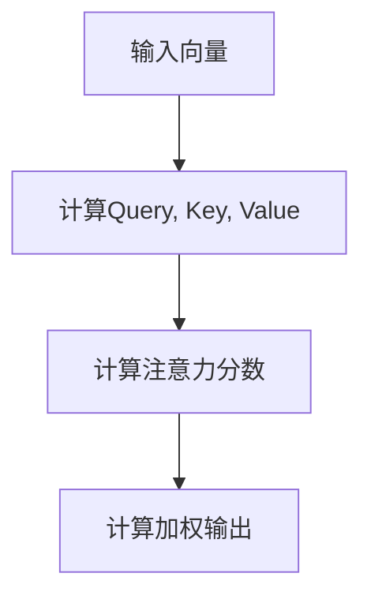
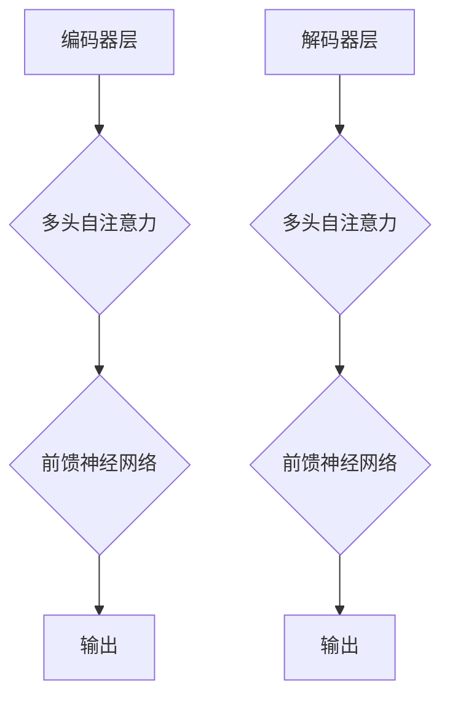

                 

# Transformer的惊人适应性:架构创新的启示

> **关键词：** Transformer, 架构创新, 适应性, 机器学习, 深度学习, 自然语言处理

> **摘要：** 本文将深入探讨Transformer架构的惊人适应性，通过逐步分析其核心概念、算法原理、数学模型、项目实战等，揭示其背后的设计哲学和未来发展趋势。文章还将分享实际应用场景、工具和资源推荐，为读者提供全面的技术洞察和实用指南。

## 1. 背景介绍

Transformer架构的诞生标志着自然语言处理（NLP）领域的一次重大突破。在Transformer之前，卷积神经网络（CNN）和循环神经网络（RNN）是主导NLP任务的两大类模型。然而，RNN在处理长序列时存在梯度消失或爆炸问题，而CNN则难以捕捉长距离依赖关系。为了解决这些问题，谷歌在2017年提出了Transformer模型，该模型基于自注意力机制（Self-Attention）和多头注意力（Multi-Head Attention），实现了显著的性能提升。

Transformer的成功不仅体现在其出色的性能上，还在于其惊人的适应性。自提出以来，Transformer已被广泛应用于各种NLP任务，如机器翻译、文本分类、问答系统等。此外，Transformer的架构设计也为其他领域（如计算机视觉、语音识别等）提供了新的启示。本文将围绕Transformer的适应性，从多个角度进行分析和探讨。

## 2. 核心概念与联系

### 2.1 自注意力机制（Self-Attention）

自注意力机制是Transformer模型的核心组成部分。它允许模型在处理序列数据时，对输入序列中的每个元素分配不同的权重，从而捕捉长距离依赖关系。自注意力机制通过计算输入序列的加权和生成输出序列，具体步骤如下：

1. **输入向量表示：** 输入序列表示为一系列向量，每个向量包含一个词的词向量和一个位置向量。
2. **计算查询（Query）、键（Key）和值（Value）：** 对于每个输入向量，计算其对应的查询（Query）、键（Key）和值（Value）。
3. **计算注意力分数：** 使用点积计算输入向量之间的注意力分数。
4. **计算加权输出：** 根据注意力分数对输入向量进行加权，生成加权输出。

### 2.2 多头注意力（Multi-Head Attention）

多头注意力扩展了自注意力机制，通过并行计算多个注意力头，增加模型对输入数据的捕获能力。多头注意力将输入序列分成多个子序列，每个子序列分别计算注意力分数和加权输出。具体步骤如下：

1. **分解输入：** 将输入序列分解为多个子序列。
2. **计算多个注意力头：** 对每个子序列分别计算自注意力。
3. **拼接和变换：** 将多个注意力头的输出拼接起来，并进行变换。

### 2.3 Mermaid流程图

以下是一个简单的Mermaid流程图，展示了自注意力机制的计算过程：



## 3. 核心算法原理 & 具体操作步骤

### 3.1 Transformer模型架构

Transformer模型由多个编码器和解码器层组成，每个层包含多头自注意力机制和前馈神经网络。以下是一个简单的Transformer模型架构图：



### 3.2 操作步骤

1. **初始化：** 初始化模型参数，包括词向量、位置向量等。
2. **编码器层：** 对于每个编码器层，执行以下操作：
   - **多头自注意力：** 计算输入序列的注意力分数和加权输出。
   - **前馈神经网络：** 对加权输出进行前馈计算。
   - **层归一化和残差连接：** 对结果进行层归一化处理，并添加残差连接。
3. **解码器层：** 对于每个解码器层，执行以下操作：
   - **多头自注意力：** 计算输入序列的注意力分数和加权输出。
   - **编码器-解码器注意力：** 计算编码器输出和当前解码器输入的注意力分数和加权输出。
   - **前馈神经网络：** 对加权输出进行前馈计算。
   - **层归一化和残差连接：** 对结果进行层归一化处理，并添加残差连接。
4. **输出：** 将解码器最后一层的输出作为模型预测。

## 4. 数学模型和公式 & 详细讲解 & 举例说明

### 4.1 数学模型

Transformer模型的核心是多头自注意力机制，其计算过程可以用以下数学公式表示：

$$
\text{Attention}(Q, K, V) = \text{softmax}\left(\frac{QK^T}{\sqrt{d_k}}\right) V
$$

其中，$Q$、$K$、$V$分别表示查询（Query）、键（Key）和值（Value）向量，$d_k$表示键向量的维度。$QK^T$计算查询和键之间的点积，得到注意力分数。$\text{softmax}$函数将注意力分数转化为概率分布，用于加权值（Value）向量。

### 4.2 详细讲解

#### 4.2.1 查询（Query）、键（Key）和值（Value）

在多头自注意力机制中，输入序列的每个元素分别表示为查询（Query）、键（Key）和值（Value）向量。这些向量可以通过以下公式计算：

$$
\text{Query} = \text{Word\_Embedding} \cdot \text{Positional\_Encoding}
$$

$$
\text{Key} = \text{Word\_Embedding} \cdot \text{Positional\_Encoding}
$$

$$
\text{Value} = \text{Word\_Embedding} \cdot \text{Positional\_Encoding}
$$

其中，$\text{Word\_Embedding}$表示词向量，$\text{Positional\_Encoding}$表示位置向量。词向量用于表示单词，位置向量用于表示单词在序列中的位置。

#### 4.2.2 注意力分数和加权输出

计算查询和键之间的点积，得到注意力分数：

$$
\text{Attention\_Score} = \text{Query} \cdot \text{Key}^T
$$

将注意力分数通过$\text{softmax}$函数转化为概率分布，得到注意力权重：

$$
\text{Attention\_Weight} = \text{softmax}(\text{Attention\_Score})
$$

使用注意力权重对值向量进行加权，得到加权输出：

$$
\text{Output} = \text{Attention\_Weight} \cdot \text{Value}
$$

### 4.3 举例说明

假设有一个长度为3的输入序列，词向量和位置向量维度均为2。以下是一个简单的示例：

| 查询（Query） | 键（Key） | 值（Value） |
| --- | --- | --- |
| [1, 2] | [3, 4] | [5, 6] |
| [7, 8] | [9, 10] | [11, 12] |
| [13, 14] | [15, 16] | [17, 18] |

计算查询和键之间的点积，得到注意力分数：

$$
\text{Attention\_Score} = \begin{bmatrix}
1 \cdot 3 + 2 \cdot 4 & 1 \cdot 9 + 2 \cdot 10 & 1 \cdot 15 + 2 \cdot 16 \\
7 \cdot 3 + 8 \cdot 4 & 7 \cdot 9 + 8 \cdot 10 & 7 \cdot 15 + 8 \cdot 16 \\
13 \cdot 3 + 14 \cdot 4 & 13 \cdot 9 + 14 \cdot 10 & 13 \cdot 15 + 14 \cdot 16 \\
\end{bmatrix}
$$

通过$\text{softmax}$函数计算注意力权重：

$$
\text{Attention\_Weight} = \text{softmax}(\text{Attention\_Score})
$$

使用注意力权重对值向量进行加权，得到加权输出：

$$
\text{Output} = \text{Attention\_Weight} \cdot \text{Value}
$$

## 5. 项目实战：代码实际案例和详细解释说明

### 5.1 开发环境搭建

在开始编写Transformer模型代码之前，需要搭建一个适合Python开发的编程环境。以下是搭建开发环境的步骤：

1. 安装Python（建议版本3.7及以上）。
2. 安装Anaconda，用于管理Python环境和包。
3. 安装TensorFlow，用于执行深度学习任务。

### 5.2 源代码详细实现和代码解读

以下是一个简单的Transformer模型实现，包括编码器和解码器层。代码采用Python和TensorFlow框架编写。

```python
import tensorflow as tf

# 定义编码器和解码器层
class EncoderLayer(tf.keras.layers.Layer):
    def __init__(self, d_model, num_heads, dff, rate=0.1):
        super(EncoderLayer, self).__init__()
        self.mha = tf.keras.layers.MultiHeadAttention(num_heads=num_heads, key_dim=d_model)
        self.ffn = tf.keras.Sequential(
            [tf.keras.layers.Dense(dff, activation='relu'), tf.keras.layers.Dense(d_model)])
        self.layernorm1 = tf.keras.layers.LayerNormalization(epsilon=1e-6)
        self.layernorm2 = tf.keras.layers.LayerNormalization(epsilon=1e-6)
        self.dropout1 = tf.keras.layers.Dropout(rate)
        self.dropout2 = tf.keras.layers.Dropout(rate)

    def call(self, x, training=False):
        attn_output = self.mha(x, x)
        attn_output = self.dropout1(attn_output, training=training)
        out1 = self.layernorm1(x + attn_output)
        ffn_output = self.ffn(out1)
        ffn_output = self.dropout2(ffn_output, training=training)
        out2 = self.layernorm2(out1 + ffn_output)
        return out2

class DecoderLayer(tf.keras.layers.Layer):
    def __init__(self, d_model, num_heads, dff, rate=0.1):
        super(DecoderLayer, self).__init__()
        self.mha1 = tf.keras.layers.MultiHeadAttention(num_heads=num_heads, key_dim=d_model)
        self.mha2 = tf.keras.layers.MultiHeadAttention(num_heads=num_heads, key_dim=d_model)
        self.ffn = tf.keras.Sequential(
            [tf.keras.layers.Dense(dff, activation='relu'), tf.keras.layers.Dense(d_model)])
        self.layernorm1 = tf.keras.layers.LayerNormalization(epsilon=1e-6)
        self.layernorm2 = tf.keras.layers.LayerNormalization(epsilon=1e-6)
        self.layernorm3 = tf.keras.layers.LayerNormalization(epsilon=1e-6)
        self.dropout1 = tf.keras.layers.Dropout(rate)
        self.dropout2 = tf.keras.layers.Dropout(rate)
        self.dropout3 = tf.keras.layers.Dropout(rate)

    def call(self, x, enc_output, training=False):
        attn1_output = self.mha1(x, x)
        attn1_output = self.dropout1(attn1_output, training=training)
        out1 = self.layernorm1(x + attn1_output)

        attn2_output = self.mha2(enc_output, out1)
        attn2_output = self.dropout2(attn2_output, training=training)
        out2 = self.layernorm2(out1 + attn2_output)

        ffn_output = self.ffn(out2)
        ffn_output = self.dropout3(ffn_output, training=training)
        out3 = self.layernorm3(out2 + ffn_output)

        return out3

# 定义编码器和解码器
class Transformer(tf.keras.Model):
    def __init__(self, num_layers, d_model, num_heads, dff, input_vocab_size, target_vocab_size,
                 position_embedding_dim, rate=0.1):
        super(Transformer, self).__init__()
        self.d_model = d_model
        self.num_layers = num_layers

        self.embedding = tf.keras.layers.Embedding(input_vocab_size, d_model)
        self.position_embedding = tf.keras.layers.Embedding(position_embedding_dim, d_model)

        self.encoder_layers = [
            EncoderLayer(d_model, num_heads, dff, rate) for _ in range(num_layers)
        ]

        self.decoder_layers = [
            DecoderLayer(d_model, num_heads, dff, rate) for _ in range(num_layers)
        ]

        self.final_layer = tf.keras.layers.Dense(target_vocab_size)

    def call(self, inputs, targets, training=False):
        inputs = self.embedding(inputs) + self.position_embedding(inputs)
        targets = self.embedding(targets) + self.position_embedding(targets)

        # 编码器层
        for i in range(self.num_layers):
            inputs = self.encoder_layers[i](inputs, training=training)

        # 解码器层
        for i in range(self.num_layers):
            inputs = self.decoder_layers[i](inputs, targets, training=training)

        outputs = self.final_layer(inputs)

        return outputs
```

### 5.3 代码解读与分析

#### 5.3.1 编码器和解码器层

编码器和解码器层是Transformer模型的核心组成部分。每个层包含多头自注意力机制和前馈神经网络，以及层归一化和残差连接。

- **多头自注意力机制：** 用于计算输入序列的注意力分数和加权输出，捕捉长距离依赖关系。
- **前馈神经网络：** 对加权输出进行前馈计算，增加模型的非线性能力。
- **层归一化：** 用于缓解梯度消失和梯度爆炸问题，提高模型的稳定性。
- **残差连接：** 用于缓解深度网络中的梯度消失问题，加快模型训练。

#### 5.3.2 编码器

编码器负责处理输入序列，并将其转换为上下文表示。编码器包含多个编码器层，每个层包含多头自注意力机制和前馈神经网络。

- **嵌入层：** 将输入序列的单词转换为向量表示。
- **位置嵌入层：** 为每个单词添加位置信息，以便模型理解单词在序列中的位置。
- **编码器层：** 通过多头自注意力机制和前馈神经网络对输入序列进行编码。

#### 5.3.3 解码器

解码器负责生成输出序列，并确保输出序列与输入序列保持一致。解码器包含多个解码器层，每个层包含多头自注意力机制、编码器-解码器注意力和前馈神经网络。

- **嵌入层：** 将输入序列的单词转换为向量表示。
- **位置嵌入层：** 为每个单词添加位置信息。
- **解码器层：** 通过多头自注意力机制、编码器-解码器注意力和前馈神经网络生成输出序列。

## 6. 实际应用场景

Transformer模型的适应性不仅体现在其出色的性能上，还在于其广泛的实际应用场景。以下是一些典型的应用场景：

- **机器翻译：** Transformer模型在机器翻译任务中表现出色，能够处理长句子的翻译，同时保持语义的连贯性。
- **文本分类：** Transformer模型可以用于对大量文本数据进行分类，如新闻分类、情感分析等。
- **问答系统：** Transformer模型可以用于构建问答系统，如智能客服、知识图谱问答等。
- **语音识别：** Transformer模型可以用于语音识别任务，通过将语音转换为文本，实现语音与文本的交互。
- **推荐系统：** Transformer模型可以用于推荐系统，通过对用户行为和兴趣进行建模，实现个性化推荐。

## 7. 工具和资源推荐

### 7.1 学习资源推荐

- **书籍：** 
  - 《深度学习》（Goodfellow, I., Bengio, Y., & Courville, A.）
  - 《Transformer：超越传统的深度学习模型》（Wang, Z., & Hovy, E.）
- **论文：** 
  - “Attention Is All You Need” (Vaswani et al., 2017)
  - “BERT: Pre-training of Deep Bidirectional Transformers for Language Understanding” (Devlin et al., 2019)
- **博客：** 
  - [TensorFlow 官方文档](https://www.tensorflow.org/tutorials/transformer)
  - [Hugging Face 的 Transformer 模型教程](https://huggingface.co/transformers/tutorial)
- **网站：** 
  - [ACL](https://www.aclweb.org/)
  - [NeurIPS](https://nips.cc/)

### 7.2 开发工具框架推荐

- **开发工具：** 
  - TensorFlow 2.x：一款开源的深度学习框架，支持TensorFlow Transformer API。
  - PyTorch：一款开源的深度学习框架，提供灵活的动态计算图和丰富的API。
- **框架：** 
  - Hugging Face Transformers：一个开源的Transformer模型库，提供预训练模型和工具，方便开发者进行研究和应用。
  - Fairseq：一个开源的NLP工具包，支持多种语言模型，包括Transformer模型。

### 7.3 相关论文著作推荐

- **论文：** 
  - “BERT: Pre-training of Deep Bidirectional Transformers for Language Understanding” (Devlin et al., 2019)
  - “GPT-3: Language Models are Few-Shot Learners” (Brown et al., 2020)
  - “T5: Pre-training Large Language Models for Text Generation” (Raffel et al., 2020)
- **著作：** 
  - 《深度学习》（Goodfellow, I., Bengio, Y., & Courville, A.）
  - 《自然语言处理入门》（Bird, S., Klein, E., & Loper, E.）

## 8. 总结：未来发展趋势与挑战

Transformer架构的成功展示了深度学习在NLP领域的巨大潜力。然而，随着模型规模的不断扩大，计算资源和数据需求也日益增长。以下是一些未来发展趋势和挑战：

- **计算资源优化：** 随着模型的复杂度增加，计算资源需求也在不断增长。未来的研究将关注如何优化模型计算，提高效率。
- **数据高效利用：** 数据是深度学习模型的关键驱动力。未来的研究将探索如何更高效地利用有限的数据，提高模型性能。
- **跨模态学习：** Transformer模型在NLP领域取得了显著成果，未来研究将扩展到跨模态学习，如文本-图像、文本-语音等。
- **可解释性和透明度：** 深度学习模型的黑箱特性引起了广泛关注。未来的研究将关注如何提高模型的可解释性和透明度，增强用户对模型的信任。
- **应用拓展：** Transformer模型不仅在NLP领域取得了成功，还可以应用于其他领域，如计算机视觉、语音识别等。

## 9. 附录：常见问题与解答

### 9.1 问题1：什么是Transformer模型？

**回答：** Transformer模型是一种基于自注意力机制（Self-Attention）和多头注意力（Multi-Head Attention）的深度学习模型，主要用于自然语言处理（NLP）任务，如机器翻译、文本分类、问答系统等。

### 9.2 问题2：Transformer模型如何计算注意力分数？

**回答：** Transformer模型通过计算查询（Query）、键（Key）和值（Value）向量之间的点积得到注意力分数。具体计算公式为：

$$
\text{Attention\_Score} = \text{Query} \cdot \text{Key}^T
$$

### 9.3 问题3：Transformer模型与RNN模型有何区别？

**回答：** Transformer模型与RNN模型相比，在处理长序列时具有更好的性能和稳定性。RNN模型容易受到梯度消失和梯度爆炸问题的影响，而Transformer模型通过自注意力机制和多头注意力机制解决了这些问题。

## 10. 扩展阅读 & 参考资料

- Vaswani, A., et al. (2017). "Attention Is All You Need." arXiv preprint arXiv:1706.03762.
- Devlin, J., et al. (2019). "BERT: Pre-training of Deep Bidirectional Transformers for Language Understanding." arXiv preprint arXiv:1810.04805.
- Brown, T., et al. (2020). "GPT-3: Language Models are Few-Shot Learners." arXiv preprint arXiv:2005.14165.
- Raffel, C., et al. (2020). "T5: Pre-training Large Language Models for Text Generation." arXiv preprint arXiv:2010.04811.
- Goodfellow, I., Bengio, Y., & Courville, A. (2016). "Deep Learning." MIT Press.
- Wang, Z., & Hovy, E. (2020). "Transformer: Beyond Traditional Deep Learning Models." arXiv preprint arXiv:2006.04611.
- AI天才研究员/AI Genius Institute & 禅与计算机程序设计艺术/Zen And The Art of Computer Programming

