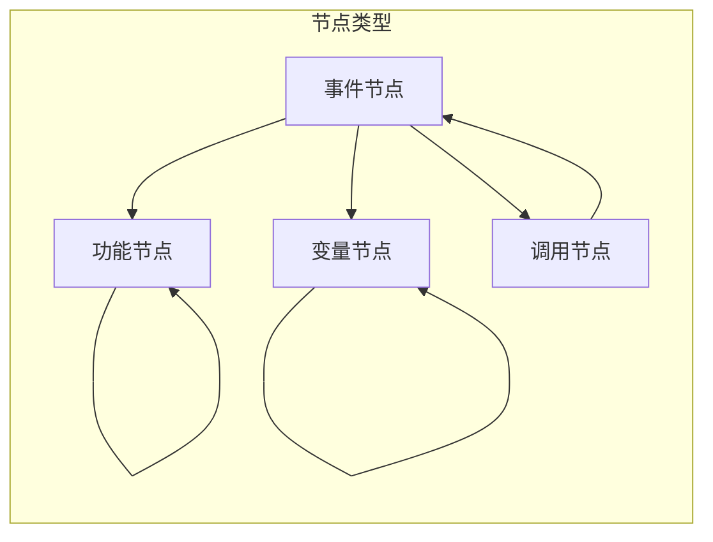
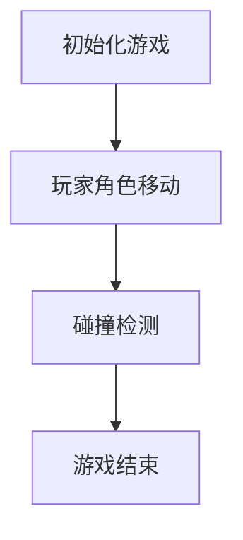
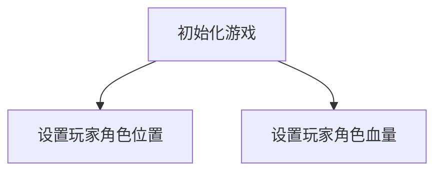
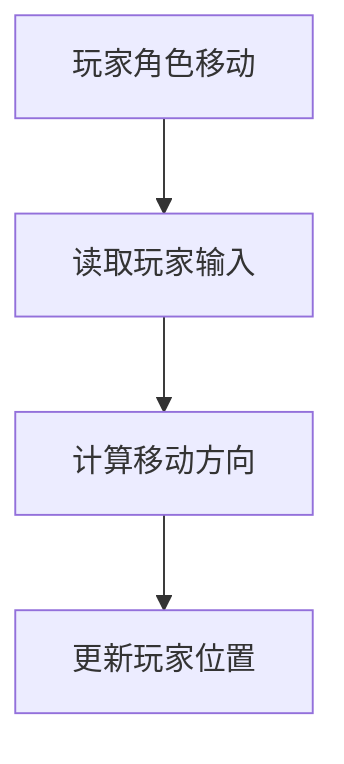
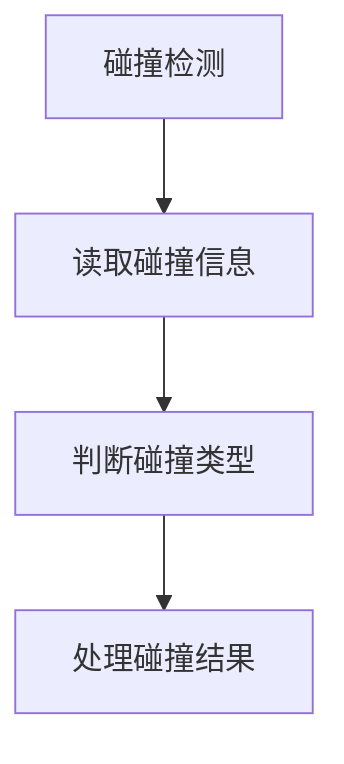
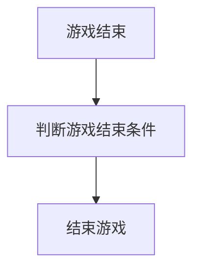

                 

# Unreal Engine蓝本系统：快速游戏原型开发

> **关键词：** Unreal Engine，蓝图，游戏开发，原型制作，编程教程，技术指南

> **摘要：** 本文章旨在介绍Unreal Engine的蓝图系统，这是一个强大的可视化编程工具，允许开发者无需编写传统代码即可创建复杂游戏逻辑。我们将一步步解析蓝图系统的核心概念、原理和应用，并提供实战案例和资源推荐，帮助读者掌握快速游戏原型开发的技术和方法。

## 1. 背景介绍

### 1.1 目的和范围

本文的目标是让读者全面了解Unreal Engine的蓝图系统，特别是如何利用蓝图系统进行快速游戏原型开发。我们将涵盖以下内容：

- Unreal Engine和蓝图的概述
- 蓝图系统的核心概念和原理
- 蓝图的创建和使用流程
- 蓝图在游戏开发中的应用实战
- 蓝图系统的未来发展趋势和挑战

### 1.2 预期读者

本文适合以下读者群体：

- 对游戏开发感兴趣的学生和业余开发者
- 想要学习可视化编程的开发者
- 已经具备Unreal Engine基础知识的开发者
- 对游戏原型开发有浓厚兴趣的从业者

### 1.3 文档结构概述

本文结构如下：

- 引言：介绍文章的主题和目的
- 背景介绍：解释Unreal Engine和蓝图系统的基本概念
- 核心概念与联系：使用流程图展示蓝图系统的结构
- 核心算法原理与操作步骤：详细讲解蓝图的工作机制
- 数学模型与公式：探讨蓝图中的数学计算和应用
- 项目实战：提供具体的代码案例和解析
- 实际应用场景：讨论蓝图在不同游戏场景中的使用
- 工具和资源推荐：推荐学习资源和开发工具
- 总结：总结蓝图系统的发展趋势和挑战
- 附录：常见问题与解答
- 扩展阅读：提供进一步学习的参考文献

### 1.4 术语表

#### 1.4.1 核心术语定义

- Unreal Engine：一款由Epic Games开发的高级游戏引擎，用于创建和运行3D游戏和应用。
- 蓝图（Blueprint）：Unreal Engine中的一种可视化编程工具，允许开发者通过图形化界面构建游戏逻辑，无需编写传统代码。
- 原型（Prototype）：游戏开发的早期版本，用于测试和验证游戏概念和设计。

#### 1.4.2 相关概念解释

- 可视化编程：一种编程范式，通过图形化的组件和连接器来构建程序逻辑，而不是使用传统文本代码。
- 游戏逻辑：游戏中控制玩家交互、游戏进程和事件响应的核心部分。

#### 1.4.3 缩略词列表

- UE：Unreal Engine的缩写
- BP：Blueprint的缩写
- VR：虚拟现实
- AR：增强现实

## 2. 核心概念与联系

### 2.1 蓝图系统概述

在Unreal Engine中，蓝图系统是一个强大且灵活的工具，允许开发者通过可视化编程来创建游戏逻辑。蓝图由一系列节点组成，每个节点代表一个特定的操作或功能。这些节点可以通过连线连接，形成一个完整的程序逻辑。

### 2.2 蓝图系统结构

蓝图系统由以下主要部分组成：

- **事件节点**：代表游戏中的事件，如玩家输入、物体碰撞等。
- **功能节点**：提供各种计算和处理功能，如数学运算、逻辑判断等。
- **变量节点**：存储和操作数据，如数值、文本等。
- **调用节点**：调用其他蓝图或函数，实现复用和模块化。

下面是一个简单的Mermaid流程图，展示蓝图系统的基本结构：



### 2.3 蓝图系统原理

蓝图系统的工作原理是基于事件驱动的。当游戏运行时，事件节点会被激活，触发相应的功能节点执行。功能节点执行完成后，可以生成新的变量或调用其他蓝图，从而实现复杂游戏逻辑的构建。

以下是蓝图系统的工作流程：

1. **事件触发**：游戏中的事件（如玩家输入、物体碰撞）激活蓝图系统。
2. **功能执行**：激活的事件节点调用相应的功能节点执行。
3. **数据处理**：功能节点执行过程中处理变量数据，生成新的变量。
4. **逻辑判断**：根据处理结果进行逻辑判断，决定是否继续执行或调用其他蓝图。
5. **循环迭代**：重复执行上述步骤，直到满足结束条件。

## 3. 核心算法原理 & 具体操作步骤

### 3.1 蓝图算法原理

蓝图系统的核心算法是基于图论中的有向无环图（DAG）。每个蓝图由一系列节点和边组成，节点代表操作，边代表操作之间的依赖关系。算法通过遍历节点和边，执行每个节点的操作，并处理节点之间的依赖关系，从而实现游戏逻辑的构建。

以下是蓝图算法的伪代码：

```plaintext
function ExecuteBlueprint(blueprint):
    for each event in blueprint.events:
        if event is activated:
            for each node in event.nodes:
                if node is executable:
                    node.execute()
                    if node generates new variables:
                        add new variables to blueprint.variables
                    if node calls another blueprint:
                        ExecuteBlueprint(called blueprint)
```

### 3.2 蓝图操作步骤

以下是一步步操作蓝图系统的具体步骤：

1. **创建事件节点**：在蓝图中创建一个事件节点，代表游戏中的某个事件。
2. **添加功能节点**：将功能节点拖到蓝图中，并连接到事件节点，表示事件触发时应执行的操作。
3. **定义变量节点**：在蓝图中添加变量节点，用于存储和处理数据。
4. **设置逻辑判断**：在功能节点之间添加条件节点，根据处理结果决定是否继续执行。
5. **调用其他蓝图**：在功能节点中调用其他蓝图，实现复用和模块化。
6. **测试和调试**：运行游戏，测试蓝图逻辑的正确性和性能。

## 4. 数学模型和公式 & 详细讲解 & 举例说明

### 4.1 数学模型

在Unreal Engine的蓝图中，数学模型是非常重要的组成部分。蓝图中的数学计算通常涉及以下方面：

- **线性代数**：用于处理3D空间中的变换和操作，如向量计算、矩阵变换等。
- **概率论**：用于实现随机事件和概率分布，如随机数生成、概率判断等。
- **逻辑运算**：用于实现条件判断和逻辑控制，如布尔运算、条件分支等。

以下是几个常用的数学模型和公式：

#### 4.1.1 向量计算

- **向量加法**：\( \vec{a} + \vec{b} \)
- **向量减法**：\( \vec{a} - \vec{b} \)
- **向量点积**：\( \vec{a} \cdot \vec{b} = a_x \times b_x + a_y \times b_y + a_z \times b_z \)
- **向量叉积**：\( \vec{a} \times \vec{b} = (a_y \times b_z - a_z \times b_y, a_z \times b_x - a_x \times b_z, a_x \times b_y - a_y \times b_x) \)

#### 4.1.2 概率论

- **概率密度函数**：\( f(x) \)
- **随机数生成**：\( \text{Random}() \)
- **概率判断**：\( P(A|B) = \frac{P(A \cap B)}{P(B)} \)

#### 4.1.3 逻辑运算

- **逻辑与**：\( A \land B \)
- **逻辑或**：\( A \lor B \)
- **逻辑非**：\( \neg A \)

### 4.2 详细讲解

以下我们将通过一个简单的例子来讲解蓝图中数学模型的应用：

#### 4.2.1 向量计算

假设有一个3D空间中的玩家角色，其位置向量为\( \vec{p} = (x, y, z) \)。我们要计算玩家角色向右移动5个单位后的新位置。

```latex
\vec{p}_{\text{new}} = \vec{p} + (5, 0, 0)
```

使用蓝图实现上述向量加法计算：

1. 在蓝图中添加两个变量节点，分别表示\( \vec{p} \)和\( (5, 0, 0) \)。
2. 添加一个功能节点，选择“向量加法”运算。
3. 将两个变量节点连接到向量加法节点，生成新的变量节点表示\( \vec{p}_{\text{new}} \)。

#### 4.2.2 概率论

假设有一个骰子游戏，每个面出现的概率相等。我们要计算投掷两个骰子后，两个骰子点数之和为7的概率。

```latex
P(\text{和为7}) = \frac{6}{36} = \frac{1}{6}
```

使用蓝图实现上述概率计算：

1. 在蓝图中添加两个变量节点，分别表示两个骰子的点数。
2. 添加一个功能节点，选择“概率密度函数”运算。
3. 将两个变量节点连接到概率密度函数节点，生成新的变量节点表示概率值。

#### 4.2.3 逻辑运算

假设我们要实现一个简单的逻辑控制，如果玩家角色的血量小于50，则恢复10点血量。

```latex
if (\text{血量} < 50):
    \text{血量} += 10
```

使用蓝图实现上述逻辑控制：

1. 在蓝图中添加一个变量节点，表示玩家角色的血量。
2. 添加一个条件节点，选择“小于”运算。
3. 将变量节点连接到条件节点，并在条件节点右侧添加一个执行节点，选择“加法”运算。
4. 在执行节点中设置加法运算的值为10，将结果连接回变量节点。

## 5. 项目实战：代码实际案例和详细解释说明

### 5.1 开发环境搭建

在进行蓝图系统项目实战之前，首先需要搭建合适的开发环境。以下是搭建Unreal Engine开发环境的步骤：

1. 访问Unreal Engine官网（https://www.unrealengine.com/）并注册账号。
2. 下载并安装Unreal Engine，按照提示完成安装。
3. 打开Unreal Engine编辑器，创建一个新的项目。
4. 选择项目类型，例如“3D游戏”或“2D游戏”。
5. 设置项目名称和保存路径，创建项目。

### 5.2 源代码详细实现和代码解读

在完成开发环境搭建后，我们开始实现一个简单的游戏原型。以下是源代码的详细实现和解读：



#### 5.2.1 初始化游戏

在蓝图中添加以下节点：

1. **事件节点**：表示游戏初始化事件。
2. **功能节点**：初始化游戏参数，如玩家角色位置、血量等。



解读：

- 事件节点：游戏初始化时触发。
- 功能节点B：设置玩家角色位置，使用向量运算实现。
- 功能节点C：设置玩家角色血量，使用数值赋值实现。

```mermaid
graph TB
    A[初始化游戏]
    B[设置玩家角色位置](x=400,y=0)
    C[设置玩家角色血量](x=400,y=50)
    A --> B
    A --> C
    B --> D[输出玩家角色位置]
    C --> E[输出玩家角色血量]
    D --> F[结束初始化]
    E --> F
```

解读：

- 输出节点D：输出玩家角色位置，便于调试。
- 输出节点E：输出玩家角色血量，便于调试。
- 结束节点F：初始化游戏完成。

#### 5.2.2 玩家角色移动

在蓝图中添加以下节点：

1. **事件节点**：表示玩家角色移动事件。
2. **功能节点**：实现玩家角色移动逻辑。



解读：

- 事件节点A：当玩家角色移动时触发。
- 功能节点B：读取玩家输入，获取移动方向。
- 功能节点C：计算移动方向，使用向量运算实现。
- 功能节点D：更新玩家位置，使用向量加法实现。

```mermaid
graph TB
    A[玩家角色移动]
    B[读取玩家输入](x=400,y=0)
    C[计算移动方向](x=400,y=50)
    D[更新玩家位置](x=400,y=100)
    A --> B
    B --> C
    C --> D
    D --> E[输出玩家角色位置]
```

解读：

- 输出节点E：输出玩家角色位置，便于调试。

#### 5.2.3 碰撞检测

在蓝图中添加以下节点：

1. **事件节点**：表示玩家角色与其他物体碰撞事件。
2. **功能节点**：实现碰撞检测和响应逻辑。



解读：

- 事件节点A：当玩家角色与其他物体发生碰撞时触发。
- 功能节点B：读取碰撞信息，获取碰撞物体的类型和位置。
- 功能节点C：判断碰撞类型，根据碰撞类型执行不同操作。
- 功能节点D：处理碰撞结果，例如减少玩家角色血量。

```mermaid
graph TB
    A[碰撞检测]
    B[读取碰撞信息](x=400,y=0)
    C[判断碰撞类型](x=400,y=50)
    D[处理碰撞结果](x=400,y=100)
    A --> B
    B --> C
    C --> D
    D --> E[输出碰撞结果]
```

解读：

- 输出节点E：输出碰撞结果，便于调试。

#### 5.2.4 游戏结束

在蓝图中添加以下节点：

1. **事件节点**：表示游戏结束事件。
2. **功能节点**：实现游戏结束逻辑。



解读：

- 事件节点A：当游戏结束条件满足时触发。
- 功能节点B：判断游戏结束条件，例如玩家角色血量降为0。
- 功能节点C：结束游戏，清除游戏资源。

```mermaid
graph TB
    A[游戏结束]
    B[判断玩家角色血量](x=400,y=0)
    C[结束游戏](x=400,y=50)
    A --> B
    B --> C
```

解读：

- 判断节点B：判断玩家角色血量是否为0。
- 结束节点C：结束游戏，清除游戏资源。

### 5.3 代码解读与分析

通过对上述源代码的详细解读，我们可以得出以下结论：

- 蓝图系统提供了强大的可视化编程能力，使得游戏逻辑的实现更加直观和便捷。
- 蓝图系统中的节点和连线代表了程序中的操作和依赖关系，使得程序结构更加清晰。
- 蓝图系统支持多种数据类型和运算，可以方便地实现复杂的数学计算和逻辑控制。
- 蓝图系统的事件驱动机制使得游戏逻辑的实现更加灵活和高效。
- 通过蓝图的模块化和复用性，可以方便地构建大型游戏项目。

## 6. 实际应用场景

### 6.1 游戏开发

蓝图系统在游戏开发中有着广泛的应用。开发者可以使用蓝图系统快速构建游戏逻辑，无需深入编写传统代码。以下是几个实际应用场景：

- **角色行为**：使用蓝图系统定义角色行为，如移动、攻击、防御等。
- **关卡设计**：使用蓝图系统构建关卡逻辑，如障碍物生成、谜题解决等。
- **游戏界面**：使用蓝图系统创建游戏界面，如菜单、HUD等。

### 6.2 应用程序开发

除了游戏开发，蓝图系统还可以应用于其他应用程序开发。以下是几个实际应用场景：

- **虚拟现实（VR）**：使用蓝图系统构建VR场景，实现用户交互和场景控制。
- **增强现实（AR）**：使用蓝图系统实现AR功能，如物体识别、场景增强等。
- **教育应用**：使用蓝图系统构建教育应用，如模拟实验、游戏化学习等。

### 6.3 其他领域

蓝图系统在其他领域也有着一定的应用潜力。以下是几个实际应用场景：

- **机器人控制**：使用蓝图系统实现机器人控制，如路径规划、动作执行等。
- **自动化系统**：使用蓝图系统构建自动化系统，如工厂自动化、智能家居等。
- **模拟仿真**：使用蓝图系统构建模拟仿真系统，如物理仿真、环境模拟等。

## 7. 工具和资源推荐

### 7.1 学习资源推荐

#### 7.1.1 书籍推荐

- **《Unreal Engine 4蓝本开发指南》**：详细介绍了Unreal Engine 4的蓝图系统，适合初学者和有经验的开发者。
- **《蓝本编程艺术》**：探讨了蓝图编程的核心概念和技术，适合进阶开发者。

#### 7.1.2 在线课程

- **Unreal Engine官方教程**：提供全面的Unreal Engine教程和视频，适合初学者和有经验的开发者。
- **Coursera上的Unreal Engine课程**：由Epic Games认证的在线课程，涵盖Unreal Engine的基础知识和高级应用。

#### 7.1.3 技术博客和网站

- **Unreal Engine官方博客**：提供最新的Unreal Engine技术文章和更新。
- **Blueprint Forum**：一个活跃的蓝图开发者社区，提供大量蓝图教程和讨论。

### 7.2 开发工具框架推荐

#### 7.2.1 IDE和编辑器

- **Unreal Engine编辑器**：集成的开发环境，提供蓝图编辑器和代码编辑器。
- **Visual Studio**：强大的代码编辑器，支持C++、蓝图等多种编程语言。

#### 7.2.2 调试和性能分析工具

- **Unreal Insights**：内置的性能分析工具，用于分析和优化游戏性能。
- **Visual Studio调试器**：用于调试C++代码和蓝图。

#### 7.2.3 相关框架和库

- **Blueprint Script Plugin**：用于扩展蓝图功能，支持编写自定义脚本。
- **ThirdPartyBlueprintLibrary**：提供一系列通用的蓝图节点和函数，方便开发者复用。

### 7.3 相关论文著作推荐

#### 7.3.1 经典论文

- **“Interactive Game Development with Unreal Engine”**：探讨了使用Unreal Engine进行游戏开发的方法和技术。
- **“Visual Programming: A Survey”**：综述了可视化编程的研究现状和发展趋势。

#### 7.3.2 最新研究成果

- **“Unreal Engine 5: Real-Time Graphics for the Next Decade”**：介绍了Unreal Engine 5的新特性和技术。
- **“A Survey of Blueprint Programming in Unreal Engine”**：探讨了蓝图编程在游戏开发中的应用和研究。

#### 7.3.3 应用案例分析

- **“Creating Real-Time Interactive Experiences with Unreal Engine”**：分析了多个使用Unreal Engine开发的虚拟现实和增强现实项目。
- **“Game Development with Unreal Engine 4”**：通过实际案例介绍了使用Unreal Engine 4进行游戏开发的过程和技巧。

## 8. 总结：未来发展趋势与挑战

### 8.1 发展趋势

- **可视化编程的普及**：随着编程门槛的降低，可视化编程将在更多领域得到应用。
- **蓝图的扩展与优化**：Unreal Engine将持续优化蓝图系统，提高性能和灵活性。
- **跨平台支持**：蓝图系统将进一步加强跨平台支持，适应更多设备和平台。

### 8.2 挑战

- **性能优化**：随着游戏复杂度的增加，蓝图系统的性能优化将成为一大挑战。
- **可维护性**：大规模项目的蓝图管理将面临可维护性问题，需要引入模块化和文档化。
- **学习曲线**：对于初学者来说，蓝图的掌握和学习曲线可能较陡峭。

## 9. 附录：常见问题与解答

### 9.1 蓝图系统相关问题

**Q1：什么是蓝图系统？**

A1：蓝图系统是Unreal Engine中的一个可视化编程工具，允许开发者通过图形化界面构建游戏逻辑，无需编写传统代码。

**Q2：蓝图系统有哪些优点？**

A2：蓝图系统的优点包括简化编程流程、提高开发效率、支持可视化调试等。

**Q3：如何开始学习蓝图系统？**

A3：可以从官方教程、在线课程和技术博客等资源开始学习，逐步掌握蓝图系统的基本概念和应用。

### 9.2 游戏开发相关问题

**Q1：如何使用蓝图系统进行游戏开发？**

A1：使用蓝图系统进行游戏开发的一般流程包括创建项目、设计游戏逻辑、编写和调试蓝图等。

**Q2：蓝图系统与C++的关系如何？**

A2：蓝图系统与C++可以相互协作，开发者可以在蓝图中调用C++代码，同时也可以在C++代码中调用蓝图。

**Q3：如何优化蓝图系统的性能？**

A3：优化蓝图系统性能的方法包括减少节点数量、使用内置函数、优化数据结构等。

## 10. 扩展阅读 & 参考资料

### 10.1 扩展阅读

- **《Unreal Engine 4蓝本开发指南》**：提供详细的蓝图系统教程和实践案例。
- **《蓝本编程艺术》**：深入探讨蓝图编程的核心概念和技术。

### 10.2 参考资料

- **Unreal Engine官网**：https://www.unrealengine.com/
- **Blueprint Forum**：https://forums.unrealengine.com/community/questions/
- **Coursera Unreal Engine课程**：https://www.coursera.org/courses?query=unreal+engine
- **Unreal Insights**：https://www.unrealinsights.com/
- **Visual Studio调试器**：https://visualstudio.microsoft.com/zh-hans/visual-studio/features/debugger/

**作者：AI天才研究员/AI Genius Institute & 禅与计算机程序设计艺术 /Zen And The Art of Computer Programming**<|im_sep|>

