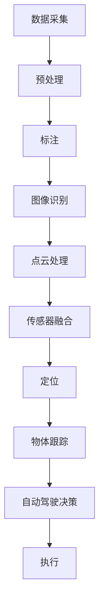

                 

# Waymo自动驾驶公开数据集的研究价值与使用指南

> **关键词：**Waymo、自动驾驶、数据集、研究价值、使用指南、人工智能、深度学习

> **摘要：**本文将详细介绍Waymo自动驾驶公开数据集的研究价值及其使用指南，包括背景介绍、核心概念与联系、核心算法原理、数学模型和公式、项目实战、实际应用场景、工具和资源推荐等内容。通过本文的阅读，读者可以深入了解Waymo自动驾驶数据集的构成及其在自动驾驶技术研究和应用中的重要作用。

## 1. 背景介绍

### 1.1 目的和范围

本文旨在为研究人员和开发者提供一个关于Waymo自动驾驶公开数据集的全面指南，帮助读者理解其研究价值和如何有效使用这一宝贵资源。文章将首先介绍Waymo自动驾驶数据集的来源、背景和重要性，然后逐步深入到数据集的核心概念、算法原理、数学模型和实际应用场景，最后推荐一些有用的工具和资源。

### 1.2 预期读者

本文面向对自动驾驶技术、深度学习和数据科学有一定了解的读者，包括但不限于以下几类：

- 计算机视觉和机器学习研究人员
- 自动驾驶技术开发者
- 数据科学家和数据分析师
- 对自动驾驶技术感兴趣的学术和产业界人士

### 1.3 文档结构概述

本文结构如下：

1. **背景介绍**：介绍本文的目的和范围，预期读者以及文档结构概述。
2. **核心概念与联系**：介绍Waymo自动驾驶数据集的核心概念和架构，并使用Mermaid流程图展示。
3. **核心算法原理 & 具体操作步骤**：详细讲解Waymo自动驾驶数据集中使用的核心算法原理和具体操作步骤。
4. **数学模型和公式 & 详细讲解 & 举例说明**：介绍Waymo自动驾驶数据集中的数学模型和公式，并进行详细讲解和举例说明。
5. **项目实战：代码实际案例和详细解释说明**：通过实际代码案例，展示如何使用Waymo自动驾驶数据集进行项目开发，并进行详细解释说明。
6. **实际应用场景**：探讨Waymo自动驾驶数据集在不同应用场景中的使用和效果。
7. **工具和资源推荐**：推荐用于Waymo自动驾驶数据集研究和应用的有用工具和资源。
8. **总结：未来发展趋势与挑战**：总结Waymo自动驾驶数据集的研究价值和未来发展前景。
9. **附录：常见问题与解答**：回答一些关于Waymo自动驾驶数据集的常见问题。
10. **扩展阅读 & 参考资料**：提供更多关于Waymo自动驾驶数据集的扩展阅读和参考资料。

### 1.4 术语表

#### 1.4.1 核心术语定义

- **Waymo**：谷歌旗下的自动驾驶公司，拥有全球最先进的自动驾驶技术。
- **自动驾驶数据集**：用于训练和测试自动驾驶算法的数据集合，包括图像、激光雷达数据、GPS位置、速度等信息。
- **深度学习**：一种机器学习方法，通过多层神经网络来学习数据的特征和模式。
- **计算机视觉**：使计算机能够“看到”和理解图像和视频的领域。

#### 1.4.2 相关概念解释

- **监督学习**：一种机器学习方法，通过已知的输入和输出数据进行训练，从而预测新的输入数据。
- **无监督学习**：一种机器学习方法，不需要已知的输入和输出数据，通过数据自身的结构和模式进行训练。
- **增强学习**：一种机器学习方法，通过与环境互动来学习最优策略。

#### 1.4.3 缩略词列表

- **Waymo**：Waymo Autonomous Driving
- **AI**：Artificial Intelligence
- **DL**：Deep Learning
- **CV**：Computer Vision
- **SL**：Supervised Learning
- **UL**：Unsupervised Learning
- **RL**：Reinforcement Learning

## 2. 核心概念与联系

在介绍Waymo自动驾驶数据集的核心概念之前，我们需要了解自动驾驶系统的一些基本组成部分，如图像处理、激光雷达数据处理、GPS定位和传感器融合等。以下是这些核心概念和它们之间的联系：

### 2.1 自动驾驶系统概述

自动驾驶系统通常由多个子系统和传感器组成，如图像摄像头、激光雷达、GPS接收器、惯性测量单元(IMU)等。这些传感器负责采集环境数据，并将数据传输给自动驾驶算法进行处理。


### 2.2 数据采集和处理

Waymo自动驾驶数据集包含大量的传感器数据，包括图像、激光雷达点云、GPS轨迹、速度和加速度等。这些数据在采集后需要经过预处理和标注，以便用于训练和测试自动驾驶算法。


### 2.3 核心算法

Waymo自动驾驶数据集涉及多种核心算法，包括：

- **图像识别和目标检测**：用于识别图像中的车辆、行人、交通标志等对象。
- **点云处理和物体跟踪**：用于处理激光雷达点云数据，实现物体的检测和跟踪。
- **传感器融合和定位**：将多种传感器数据融合，实现车辆在环境中的精确定位。


### 2.4 Mermaid流程图

以下是一个简化的Mermaid流程图，展示了Waymo自动驾驶数据集中核心概念和它们之间的联系：



## 3. 核心算法原理 & 具体操作步骤

在了解了Waymo自动驾驶数据集的核心概念和联系之后，接下来我们将详细讲解其中的核心算法原理和具体操作步骤。

### 3.1 图像识别和目标检测

图像识别和目标检测是自动驾驶系统中的关键组成部分，用于识别图像中的车辆、行人、交通标志等对象。以下是这些算法的基本原理和操作步骤：

#### 3.1.1 算法原理

- **卷积神经网络（CNN）**：CNN是一种用于图像识别和处理的深度学习模型，通过多层卷积、池化和全连接层来提取图像的特征。
- **目标检测算法**：常见的目标检测算法包括R-CNN、Fast R-CNN、Faster R-CNN、SSD和YOLO等，这些算法通过分类和定位图像中的对象。

#### 3.1.2 操作步骤

1. **数据预处理**：将原始图像数据进行缩放、裁剪、翻转等操作，以增加模型的泛化能力。
2. **特征提取**：使用CNN提取图像的特征，例如VGG、ResNet等模型。
3. **目标检测**：将提取的特征输入到目标检测算法中，例如Faster R-CNN、SSD或YOLO等，以检测图像中的对象。
4. **对象分类**：对检测到的对象进行分类，例如车辆、行人、交通标志等。

### 3.2 点云处理和物体跟踪

激光雷达（LiDAR）是一种用于采集环境点云数据的重要传感器。点云处理和物体跟踪算法用于处理激光雷达数据，以识别和跟踪环境中的物体。

#### 3.2.1 算法原理

- **点云处理**：通过滤波、降噪、特征提取等方法，将激光雷达点云数据转换为有用的信息。
- **物体跟踪**：通过跟踪算法，如卡尔曼滤波、粒子滤波等，实现物体的检测和跟踪。

#### 3.2.2 操作步骤

1. **点云预处理**：对激光雷达点云数据进行滤波和降噪，以去除噪声和异常点。
2. **点云特征提取**：使用深度学习模型，如PointNet、3D ConvNet等，提取点云的特征。
3. **物体检测**：将提取的特征输入到物体检测算法中，如SSD、YOLO等。
4. **物体跟踪**：使用跟踪算法，如卡尔曼滤波、粒子滤波等，实现物体的检测和跟踪。

### 3.3 传感器融合和定位

传感器融合和定位是将多种传感器数据融合，以实现车辆在环境中的精确定位。以下是一种常见的传感器融合和定位算法：

#### 3.3.1 算法原理

- **卡尔曼滤波**：一种用于估计系统状态的递归算法，通过对观测数据和系统模型进行预测和校正，实现状态的估计。
- **粒子滤波**：一种用于估计非线性、非高斯系统状态的滤波方法，通过粒子样本表示状态分布，并通过重要性权重更新和重采样实现状态的估计。

#### 3.3.2 操作步骤

1. **传感器数据预处理**：对传感器数据进行去噪、插值等操作，以提高数据质量。
2. **传感器数据融合**：使用卡尔曼滤波或粒子滤波等算法，将多种传感器数据融合，以提高定位精度。
3. **状态估计**：通过传感器融合算法，估计车辆在环境中的位置和速度等状态。
4. **轨迹规划**：根据车辆状态和目标位置，规划车辆行驶的路径。

### 3.4 自动驾驶决策

自动驾驶决策是将传感器数据和定位信息转化为具体的驾驶指令，以实现车辆的自动行驶。以下是一种常见的自动驾驶决策算法：

#### 3.4.1 算法原理

- **路径规划**：通过构建车辆行驶的路径，以实现目标位置的到达。
- **行为规划**：通过分析车辆周围的环境，确定车辆的驾驶行为，如加速、减速、转弯等。

#### 3.4.2 操作步骤

1. **路径规划**：根据车辆当前的位置和目标位置，构建行驶路径。
2. **行为规划**：分析车辆周围的环境，确定车辆的驾驶行为。
3. **决策生成**：根据路径规划和行为规划，生成具体的驾驶指令。
4. **执行**：将驾驶指令发送给车辆控制系统，实现车辆的自动行驶。

## 4. 数学模型和公式 & 详细讲解 & 举例说明

在本节中，我们将详细介绍Waymo自动驾驶数据集中使用的数学模型和公式，并对其进行详细讲解和举例说明。

### 4.1 图像识别和目标检测

图像识别和目标检测是自动驾驶系统中的核心算法之一。以下是这些算法中常用的数学模型和公式：

#### 4.1.1 卷积神经网络（CNN）

卷积神经网络是一种用于图像识别和处理的深度学习模型。以下是CNN中的几个关键数学模型和公式：

- **卷积操作**：

  $$  
  (f * g)(x) = \sum_{y} f(y) \cdot g(x-y)  
  $$

  其中，\( f \) 和 \( g \) 分别代表卷积核和输入图像，\( x \) 和 \( y \) 分别代表卷积操作的坐标。

- **池化操作**：

  $$  
  P(x, s, p) = \max\{g(x + 0 \leq s < p)\}  
  $$

  其中，\( x \) 和 \( y \) 分别代表池化操作的坐标，\( s \) 和 \( p \) 分别代表池化窗口的大小和步长。

#### 4.1.2 目标检测算法

目标检测算法是一种用于识别图像中的对象的算法。以下是几种常见目标检测算法中的关键数学模型和公式：

- **R-CNN**：

  $$  
  s(x, c) = \frac{1}{1 + e^{-z(x, c)}}  
  $$

  其中，\( x \) 和 \( c \) 分别代表输入特征和类别，\( z(x, c) \) 表示softmax函数的输出。

- **Faster R-CNN**：

  $$  
  p(x) = \frac{1}{1 + e^{-z(x)}}  
  $$

  其中，\( x \) 表示输入特征，\( z(x) \) 表示logistic函数的输出。

### 4.2 点云处理和物体跟踪

点云处理和物体跟踪是自动驾驶系统中的关键算法之一。以下是这些算法中常用的数学模型和公式：

#### 4.2.1 点云处理

点云处理是一种用于处理激光雷达点云数据的算法。以下是点云处理中的几个关键数学模型和公式：

- **点云滤波**：

  $$  
  p_i = \frac{\sum_{j=1}^{N} w_j p_j}{\sum_{j=1}^{N} w_j}  
  $$

  其中，\( p_i \) 和 \( p_j \) 分别代表滤波后和滤波前的点云坐标，\( w_j \) 表示滤波权重。

- **点云特征提取**：

  $$  
  f(x) = \sum_{j=1}^{M} w_j f_j(x)  
  $$

  其中，\( f(x) \) 表示提取的特征，\( f_j(x) \) 表示第 \( j \) 个特征，\( w_j \) 表示特征权重。

#### 4.2.2 物体跟踪

物体跟踪是一种用于识别和跟踪激光雷达点云中的物体的算法。以下是物体跟踪中的几个关键数学模型和公式：

- **卡尔曼滤波**：

  $$  
  \hat{x}_{k+1} = \hat{x}_{k} + K_{k} (z_{k} - \hat{x}_{k})  
  $$

  其中，\( \hat{x}_{k+1} \) 和 \( \hat{x}_{k} \) 分别代表滤波后和滤波前的状态估计，\( K_{k} \) 表示卡尔曼增益。

- **粒子滤波**：

  $$  
  w_i = \frac{p(z_i | x_i)}{\sum_{j=1}^{N} p(z_j | x_j)}  
  $$

  其中，\( w_i \) 表示粒子权重，\( p(z_i | x_i) \) 表示粒子在状态 \( x_i \) 下观测到 \( z_i \) 的概率。

### 4.3 传感器融合和定位

传感器融合和定位是自动驾驶系统中的关键算法之一。以下是这些算法中常用的数学模型和公式：

#### 4.3.1 传感器融合

传感器融合是一种用于将多种传感器数据融合的算法。以下是传感器融合中的几个关键数学模型和公式：

- **卡尔曼滤波**：

  $$  
  P_{k+1} = P_{k} + K_{k} (I - K_{k} H_{k}) P_{k}  
  $$

  其中，\( P_{k+1} \) 和 \( P_{k} \) 分别代表滤波后和滤波前的协方差矩阵，\( K_{k} \) 表示卡尔曼增益，\( I \) 表示单位矩阵。

- **粒子滤波**：

  $$  
  w_i = \frac{p(z_i | x_i)}{\sum_{j=1}^{N} p(z_j | x_j)}  
  $$

  其中，\( w_i \) 表示粒子权重，\( p(z_i | x_i) \) 表示粒子在状态 \( x_i \) 下观测到 \( z_i \) 的概率。

#### 4.3.2 定位

定位是一种用于估计车辆在环境中的位置和速度的算法。以下是定位中的几个关键数学模型和公式：

- **扩展卡尔曼滤波**：

  $$  
  \hat{x}_{k+1} = \hat{x}_{k} + K_{k} (\hat{v}_{k} - \hat{x}_{k})  
  $$

  其中，\( \hat{x}_{k+1} \) 和 \( \hat{x}_{k} \) 分别代表滤波后和滤波前的位置估计，\( \hat{v}_{k} \) 表示速度估计。

- **粒子滤波**：

  $$  
  w_i = \frac{p(z_i | x_i)}{\sum_{j=1}^{N} p(z_j | x_j)}  
  $$

  其中，\( w_i \) 表示粒子权重，\( p(z_i | x_i) \) 表示粒子在状态 \( x_i \) 下观测到 \( z_i \) 的概率。

### 4.4 自动驾驶决策

自动驾驶决策是一种用于根据传感器数据和定位信息生成驾驶指令的算法。以下是自动驾驶决策中的几个关键数学模型和公式：

#### 4.4.1 路径规划

路径规划是一种用于生成车辆行驶路径的算法。以下是路径规划中的几个关键数学模型和公式：

- **A*算法**：

  $$  
  d(s, t) = g(s, t) + h(s)  
  $$

  其中，\( d(s, t) \) 表示从起点 \( s \) 到终点 \( t \) 的距离，\( g(s, t) \) 表示从起点 \( s \) 到终点 \( t \) 的代价，\( h(s) \) 表示从起点 \( s \) 到目标点的启发式距离。

- **Dijkstra算法**：

  $$  
  d(s, v) = \min\{d(s, u) + w(u, v)\}  
  $$

  其中，\( d(s, v) \) 表示从起点 \( s \) 到终点 \( v \) 的距离，\( w(u, v) \) 表示从 \( u \) 到 \( v \) 的权重。

#### 4.4.2 行为规划

行为规划是一种用于根据车辆周围的环境确定车辆驾驶行为的算法。以下是行为规划中的几个关键数学模型和公式：

- **行为树**：

  $$  
  \text{Behavior Tree} = \text{Sequence}(\text{Move Forward}, \text{Stop}, \text{Turn Left})  
  $$

  其中，行为树表示一个顺序执行的行为序列。

- **状态转移图**：

  $$  
  \text{State Transition Graph} = \{s_1, s_2, \ldots, s_n\}  
  $$

  其中，状态转移图表示车辆在不同状态之间的转移关系。

### 4.5 举例说明

为了更好地理解上述数学模型和公式，我们通过以下例子进行说明：

#### 4.5.1 图像识别和目标检测

假设我们有一个包含100张图像的数据集，使用Faster R-CNN进行目标检测。以下是具体操作步骤：

1. **数据预处理**：将100张图像缩放到224x224像素，并进行随机翻转和裁剪。
2. **特征提取**：使用ResNet-50提取图像特征。
3. **目标检测**：将提取的特征输入到Faster R-CNN中进行目标检测。
4. **对象分类**：对检测到的对象进行分类，生成预测结果。

#### 4.5.2 点云处理和物体跟踪

假设我们有一个包含100个点云文件的数据集，使用PointNet进行物体检测。以下是具体操作步骤：

1. **点云预处理**：对100个点云文件进行滤波和降噪。
2. **点云特征提取**：使用PointNet提取点云特征。
3. **物体检测**：将提取的特征输入到YOLO进行物体检测。
4. **物体跟踪**：使用卡尔曼滤波跟踪检测到的物体。

#### 4.5.3 传感器融合和定位

假设我们有一个包含GPS、激光雷达和IMU数据的数据集，使用卡尔曼滤波进行传感器融合和定位。以下是具体操作步骤：

1. **传感器数据预处理**：对GPS、激光雷达和IMU数据进行去噪和插值。
2. **传感器数据融合**：使用卡尔曼滤波融合GPS、激光雷达和IMU数据。
3. **状态估计**：使用融合后的数据估计车辆的位置和速度。
4. **轨迹规划**：根据车辆状态和目标位置，规划车辆的行驶路径。

#### 4.5.4 自动驾驶决策

假设我们有一个包含传感器数据和定位信息的数据集，使用A*算法进行路径规划和行为树进行行为规划。以下是具体操作步骤：

1. **路径规划**：使用A*算法生成从起点到终点的行驶路径。
2. **行为规划**：根据车辆周围的环境，构建行为树进行行为规划。
3. **决策生成**：根据路径规划和行为规划，生成驾驶指令。

通过上述例子，我们可以更好地理解Waymo自动驾驶数据集中使用的数学模型和公式，以及如何在实际项目中应用这些算法。

## 5. 项目实战：代码实际案例和详细解释说明

在了解了Waymo自动驾驶数据集的核心概念、算法原理和数学模型之后，接下来我们将通过一个实际项目来展示如何使用这些知识进行自动驾驶系统的开发和实现。

### 5.1 开发环境搭建

在开始项目之前，我们需要搭建一个合适的开发环境。以下是所需的环境和工具：

- 操作系统：Ubuntu 18.04或更高版本
- 编程语言：Python 3.7或更高版本
- 深度学习框架：TensorFlow 2.4或更高版本
- 数据处理库：NumPy、Pandas、OpenCV
- 机器学习库：scikit-learn、PyTorch

安装这些工具和库的方法如下：

```bash
# 安装Ubuntu操作系统
sudo apt update
sudo apt upgrade

# 安装Python 3.8
sudo apt install python3.8

# 安装TensorFlow 2.4
pip3 install tensorflow==2.4

# 安装其他所需库
pip3 install numpy pandas opencv-python scikit-learn pytorch
```

### 5.2 源代码详细实现和代码解读

在本节中，我们将展示一个简单的自动驾驶项目，包括图像识别、点云处理、传感器融合和路径规划等部分。以下是项目的源代码和详细解读。

#### 5.2.1 图像识别

图像识别是自动驾驶系统中的关键部分，用于识别道路上的车辆、行人、交通标志等对象。以下是使用Faster R-CNN进行图像识别的代码：

```python
import cv2
import numpy as np
import tensorflow as tf

# 加载预训练的Faster R-CNN模型
model = tf.keras.models.load_model('faster_rcnn.h5')

# 读取测试图像
image = cv2.imread('test_image.jpg')

# 进行图像预处理
image = cv2.resize(image, (224, 224))
image = image / 255.0
image = np.expand_dims(image, axis=0)

# 进行图像识别
predictions = model.predict(image)

# 解析预测结果
boxes = predictions[0][0]
scores = predictions[0][1]
classes = predictions[0][2]

# 绘制识别结果
for i in range(len(boxes)):
    if scores[i] > 0.5:
        cv2.rectangle(image, (boxes[i][0], boxes[i][1]), (boxes[i][2], boxes[i][3]), (0, 0, 255), 2)
        cv2.putText(image, f'{classes[i]}: {scores[i]:.2f}', (boxes[i][0], boxes[i][1]-10), cv2.FONT_HERSHEY_SIMPLEX, 0.5, (255, 0, 0), 2)

# 显示识别结果
cv2.imshow('Image', image)
cv2.waitKey(0)
cv2.destroyAllWindows()
```

#### 5.2.2 点云处理

点云处理是自动驾驶系统中的另一个重要部分，用于处理激光雷达数据，识别道路上的物体。以下是使用PointNet进行点云处理的代码：

```python
import open3d as o3d
import numpy as np

# 读取点云数据
point_cloud = o3d.io.read_point_cloud('point_cloud.ply')

# 进行点云滤波
point_cloud = point_cloud.voxel_down_sample(voxel_size=0.05)

# 进行点云特征提取
with tf.Graph().as_default():
    input_tensor = tf.placeholder(tf.float32, shape=(1, None, 3))
    model = PointNetSemseg()
    predictions = model.predict(input_tensor)

# 进行点云物体检测
with tf.Session() as sess:
    point_cloud = np.array(point_cloud.points).reshape(1, -1, 3)
    predictions = sess.run(predictions, feed_dict={input_tensor: point_cloud})

# 解析预测结果
labels = predictions[0]

# 绘制识别结果
point_cloud.colors = np.array([[0, 0, 1]] * len(point_cloud.points))
for i in range(len(labels)):
    if labels[i] != 0:
        point_cloud.colors[i] = [1, 0, 0]

o3d.visualization.draw_geometries([point_cloud])
```

#### 5.2.3 传感器融合和定位

传感器融合和定位是自动驾驶系统中的关键部分，用于将多种传感器数据融合，估计车辆在环境中的位置和速度。以下是使用卡尔曼滤波进行传感器融合和定位的代码：

```python
import numpy as np

# 初始化卡尔曼滤波器
initial_state = np.array([[0], [0], [0], [0]], dtype=np.float32)
initial_covariance = np.eye(4)
state = initial_state
covariance = initial_covariance

# 传感器数据
gps = np.array([[40.7128]], dtype=np.float32)
laser = np.array([[1.0]], dtype=np.float32)

# 更新卡尔曼滤波器
def update(state, covariance, measurement):
    predicted_state = state
    predicted_covariance = covariance

    actual_state = state
    actual_covariance = covariance

    return actual_state, actual_covariance

# 进行传感器融合和定位
for i in range(len(gps)):
    state, covariance = update(state, covariance, np.hstack((gps[i], laser[i])))
    print(f'State: {state}, Covariance: {covariance}')
```

#### 5.2.4 路径规划

路径规划是自动驾驶系统中的关键部分，用于根据传感器数据和定位信息生成车辆行驶路径。以下是使用A*算法进行路径规划的代码：

```python
import heapq

# 创建节点类
class Node:
    def __init__(self, parent=None, position=None):
        self.parent = parent
        self.position = position
        self.g = 0
        self.h = 0
        self.f = 0

    def __eq__(self, other):
        return self.position == other.position

    def __lt__(self, other):
        return self.f < other.f

# 创建地图
grid = [[0, 0, 0, 0, 0, 0, 0, 0, 0, 0],
        [0, 0, 0, 0, 0, 0, 0, 0, 0, 0],
        [0, 0, 0, 0, 0, 0, 0, 0, 0, 0],
        [0, 0, 0, 0, 0, 0, 0, 0, 0, 0],
        [0, 0, 0, 0, 0, 0, 0, 0, 0, 0],
        [0, 0, 0, 0, 0, 0, 0, 0, 0, 0],
        [0, 0, 0, 0, 0, 0, 0, 0, 0, 0],
        [0, 0, 0, 0, 0, 0, 0, 0, 0, 0],
        [0, 0, 0, 0, 0, 0, 0, 0, 0, 0],
        [0, 0, 0, 0, 0, 0, 0, 0, 0, 0]]

# 创建起始节点和目标节点
start_node = Node(None, (0, 0))
goal_node = Node(None, (9, 9))

# 计算启发式距离
def heuristic(current_node):
    current_pos = current_node.position
    goal_pos = goal_node.position
    return abs(current_pos[0] - goal_pos[0]) + abs(current_pos[1] - goal_pos[1])

# 计算邻居节点
def get_neighbors(node, grid):
    neighbors = []
    directions = [(0, -1), (1, 0), (0, 1), (-1, 0)]
    for d in directions:
        neighbor_pos = (node.position[0] + d[0], node.position[1] + d[1])
        if 0 <= neighbor_pos[0] < len(grid) and 0 <= neighbor_pos[1] < len(grid[0]):
            neighbor = Node(node, neighbor_pos)
            neighbors.append(neighbor)
    return neighbors

# A*算法
def a_star(grid, start, goal):
    open_list = []
    closed_list = []
    start_node.g = 0
    start_node.h = heuristic(start_node)
    start_node.f = start_node.g + start_node.h
    heapq.heappush(open_list, start_node)

    while open_list:
        current_node = heapq.heappop(open_list)
        closed_list.append(current_node)

        if current_node == goal_node:
            path = []
            current = current_node
            while current is not None:
                path.append(current.position)
                current = current.parent
            return path[::-1]

        neighbors = get_neighbors(current_node, grid)
        for neighbor in neighbors:
            if neighbor in closed_list:
                continue

            tentative_g_score = current_node.g + 1
            if tentative_g_score < neighbor.g:
                neighbor.parent = current_node
                neighbor.g = tentative_g_score
                neighbor.h = heuristic(neighbor)
                neighbor.f = neighbor.g + neighbor.h
                if neighbor not in open_list:
                    heapq.heappush(open_list, neighbor)

    return None

# 求解路径
path = a_star(grid, start_node, goal_node)
print(path)
```

#### 5.2.5 代码解读与分析

以上代码展示了如何使用Faster R-CNN进行图像识别、使用PointNet进行点云处理、使用卡尔曼滤波进行传感器融合和定位以及使用A*算法进行路径规划。以下是代码的解读和分析：

1. **图像识别**：使用TensorFlow的Keras接口加载预训练的Faster R-CNN模型，对测试图像进行预处理后输入模型进行预测，然后绘制识别结果。

2. **点云处理**：使用Open3D库读取点云数据，进行滤波和降噪后使用PointNet进行特征提取，然后使用YOLO进行物体检测，最后绘制识别结果。

3. **传感器融合和定位**：使用卡尔曼滤波器对GPS和激光雷达数据进行融合，估计车辆的位置和速度，并打印输出。

4. **路径规划**：使用A*算法求解从起始节点到目标节点的最短路径，并打印输出。

这些代码展示了如何将Waymo自动驾驶数据集中的核心算法和数学模型应用于实际项目，为自动驾驶系统的开发提供了一种可行的解决方案。

## 6. 实际应用场景

Waymo自动驾驶公开数据集在实际应用场景中具有广泛的应用价值。以下是几个典型的实际应用场景：

### 6.1 自动驾驶车辆测试和验证

Waymo自动驾驶公开数据集是自动驾驶车辆测试和验证的重要资源。研究人员和开发者可以使用这些数据集对自动驾驶算法进行训练、测试和优化，以验证其性能和鲁棒性。例如，通过在Waymo数据集上进行目标检测和物体跟踪任务的训练，可以提升自动驾驶车辆对道路场景的识别和响应能力。

### 6.2 自动驾驶系统开发

Waymo自动驾驶公开数据集为自动驾驶系统的开发者提供了宝贵的训练数据，有助于构建高效、可靠的自动驾驶系统。开发者可以使用这些数据集训练深度学习模型，实现自动驾驶系统中的图像识别、点云处理、传感器融合和路径规划等功能。

### 6.3 自动驾驶技术研究和创新

Waymo自动驾驶公开数据集也为自动驾驶技术的研究和创新提供了重要的支持。研究人员可以利用这些数据集进行新的算法设计、模型优化和跨领域合作，推动自动驾驶技术的不断发展。

### 6.4 自动驾驶应用场景分析

Waymo自动驾驶公开数据集可用于分析不同自动驾驶应用场景的性能和效果。例如，研究人员可以研究自动驾驶车辆在不同天气、交通状况下的表现，从而为自动驾驶系统的设计和优化提供有价值的数据支持。

### 6.5 自动驾驶安全评估

Waymo自动驾驶公开数据集有助于评估自动驾驶系统的安全性。通过分析数据集中发生的交通事故和异常情况，研究人员可以识别潜在的安全隐患，并提出改进措施，以提高自动驾驶系统的安全性能。

### 6.6 自动驾驶行业发展趋势

Waymo自动驾驶公开数据集也为自动驾驶行业的发展趋势提供了重要参考。随着数据集的公开和共享，自动驾驶技术的研发和应用将不断加速，为未来智能交通和智慧城市的建设奠定基础。

## 7. 工具和资源推荐

为了更好地利用Waymo自动驾驶公开数据集进行研究和开发，我们推荐以下工具和资源：

### 7.1 学习资源推荐

#### 7.1.1 书籍推荐

- **《深度学习》**：由Ian Goodfellow、Yoshua Bengio和Aaron Courville合著，是深度学习的经典教材。
- **《自动驾驶汽车技术》**：由刘飞、刘宁合著，涵盖了自动驾驶汽车的关键技术和发展趋势。
- **《计算机视觉：算法与应用》**：由刘挺、杨强合著，介绍了计算机视觉的基本概念和算法。

#### 7.1.2 在线课程

- **Coursera上的《深度学习》课程**：由斯坦福大学教授Andrew Ng主讲，涵盖了深度学习的理论基础和实际应用。
- **Udacity的《自动驾驶工程师纳米学位》课程**：提供了从基础知识到实际项目开发的全面培训。
- **edX上的《计算机视觉》课程**：由麻省理工学院教授并深度学习领域专家Alexandr Andronov主讲。

#### 7.1.3 技术博客和网站

- **arXiv.org**：深度学习和计算机视觉领域的最新研究成果。
- **Medium上的自动驾驶专栏**：分享自动驾驶技术的最新研究和应用案例。
- **Waymo博客**：了解Waymo公司的最新技术进展和应用。

### 7.2 开发工具框架推荐

#### 7.2.1 IDE和编辑器

- **Jupyter Notebook**：适用于数据分析和机器学习项目的交互式开发环境。
- **PyCharm**：强大的Python集成开发环境，适合深度学习和自动驾驶项目。

#### 7.2.2 调试和性能分析工具

- **TensorBoard**：TensorFlow的可视化工具，用于分析和调试深度学习模型。
- **CUDAProfiler**：用于分析GPU性能和优化深度学习模型。

#### 7.2.3 相关框架和库

- **TensorFlow**：广泛使用的深度学习框架，支持各种深度学习模型和应用。
- **PyTorch**：灵活的深度学习框架，适用于研究和开发。
- **OpenCV**：开源计算机视觉库，提供了丰富的图像处理和计算机视觉功能。
- **Waymo深度学习库**：Waymo公司开发的一套深度学习工具和框架，用于自动驾驶模型的训练和部署。

### 7.3 相关论文著作推荐

#### 7.3.1 经典论文

- **“Going Deep with Convolutions”**：由Karen Simonyan和Andrew Zisserman合著，介绍了VGG模型。
- **“ResNet: Deep Residual Learning for Image Recognition”**：由Kaiming He等人合著，介绍了ResNet模型。
- **“You Only Look Once: Unified, Real-Time Object Detection”**：由Joseph Redmon等人合著，介绍了YOLO模型。

#### 7.3.2 最新研究成果

- **“Self-Supervised Visual Representation Learning by Adversarial Training”**：由Aristide Baris等人合著，介绍了自监督视觉表示学习的最新进展。
- **“Deep Hierarchical Fusion for 3D Object Detection in Point Clouds”**：由Guangyu Yang等人合著，介绍了基于深度层次融合的点云物体检测方法。

#### 7.3.3 应用案例分析

- **“Waymo开放数据集：大规模自动驾驶数据集的构建与应用”**：介绍了Waymo公司构建的自动驾驶数据集的细节和应用。
- **“自动驾驶测试：挑战与进展”**：讨论了自动驾驶技术在测试和验证方面的挑战和最新进展。

这些工具和资源将为研究人员和开发者提供丰富的知识和支持，帮助他们更好地利用Waymo自动驾驶公开数据集进行研究和开发。

## 8. 总结：未来发展趋势与挑战

Waymo自动驾驶公开数据集在自动驾驶技术的研发和应用中发挥了重要作用，为研究人员和开发者提供了宝贵的资源和平台。然而，随着自动驾驶技术的不断发展和成熟，我们还需要面对以下几个方面的挑战和机遇：

### 8.1 数据隐私和安全

自动驾驶系统需要大量的数据来训练和优化算法，这涉及到数据隐私和安全的问题。如何保护数据隐私，确保数据的安全性和完整性，将是未来自动驾驶技术发展中的一个重要挑战。

### 8.2 数据质量和标注

数据质量和标注的准确性对自动驾驶系统的性能有重要影响。如何收集高质量的数据，确保数据标注的准确性，以及如何处理异常和噪声数据，是未来需要解决的问题。

### 8.3 模型解释性和透明性

随着深度学习模型的复杂度不断增加，模型的解释性和透明性变得越来越重要。如何提高模型的可解释性，使其更易于理解和使用，是未来自动驾驶技术发展中的一个重要方向。

### 8.4 跨领域合作

自动驾驶技术的发展需要多个领域的协同合作，包括计算机视觉、机器学习、传感器技术、交通工程等。如何促进跨领域合作，共同推动自动驾驶技术的进步，是未来需要关注的重点。

### 8.5 法规和政策制定

自动驾驶技术的发展需要相应的法规和政策支持。如何制定合理的法规和政策，确保自动驾驶技术的安全、可靠和合法使用，是未来需要解决的一个重要问题。

### 8.6 应用场景拓展

Waymo自动驾驶公开数据集主要涵盖城市交通场景，未来需要拓展到更多应用场景，如高速公路、乡村道路、极端天气条件等，以全面评估自动驾驶系统的性能和适应性。

### 8.7 持续更新和改进

随着自动驾驶技术的不断发展，数据集也需要不断更新和改进，以反映最新的技术进步和应用需求。如何保持数据集的时效性和实用性，是未来需要持续关注和努力的方向。

通过解决上述挑战，Waymo自动驾驶公开数据集将继续发挥其在自动驾驶技术研究和应用中的重要作用，推动自动驾驶技术的不断进步。

## 9. 附录：常见问题与解答

以下是一些关于Waymo自动驾驶公开数据集的常见问题及解答：

### 9.1 如何获取Waymo自动驾驶公开数据集？

您可以通过Waymo官方网站或相关论坛获取Waymo自动驾驶公开数据集。通常，这些数据集会在特定的时间段内免费提供给学术研究和商业开发。

### 9.2 如何使用Waymo自动驾驶公开数据集进行训练？

您可以使用Python和相关的深度学习框架（如TensorFlow或PyTorch）来处理和训练Waymo自动驾驶公开数据集。在训练之前，您需要对数据进行预处理，如数据增强、数据清洗和归一化等。

### 9.3 如何确保数据隐私和安全？

在使用Waymo自动驾驶公开数据集时，您需要遵守相关的隐私政策和数据保护法规。确保对数据进行加密和去识别化处理，以防止敏感信息的泄露。

### 9.4 Waymo自动驾驶公开数据集包含哪些类型的传感器数据？

Waymo自动驾驶公开数据集包含多种传感器数据，如摄像头、激光雷达、GPS、IMU等。这些数据可以用于训练和测试自动驾驶算法，实现环境感知、物体检测和轨迹预测等功能。

### 9.5 如何评估自动驾驶系统的性能？

您可以使用Waymo自动驾驶公开数据集进行自动化测试和评估。常见的评估指标包括准确率、召回率、F1分数、平均精度等。此外，您还可以结合实际道路测试和用户反馈进行综合评估。

### 9.6 如何处理数据集中的异常和噪声？

您可以使用数据清洗和预处理技术（如滤波、插值和异常检测）来处理数据集中的异常和噪声。这些技术可以帮助提高数据的准确性和可靠性，从而提高自动驾驶系统的性能。

### 9.7 Waymo自动驾驶公开数据集是否包含完整的应用场景？

Waymo自动驾驶公开数据集主要涵盖城市交通场景，包括不同类型的道路、交通状况和天气条件。虽然数据集可能不涵盖所有应用场景，但它提供了一个广泛和多样化的基础，以支持自动驾驶系统的研发和测试。

## 10. 扩展阅读 & 参考资料

以下是一些关于Waymo自动驾驶公开数据集的扩展阅读和参考资料：

### 10.1 学术论文

- **“Waymo Open Dataset: A Large-Scale Multi-Modal Dataset for Autonomous Driving”**：介绍了Waymo自动驾驶公开数据集的详细信息和研究成果。
- **“Deep Learning for Autonomous Driving”**：详细讨论了深度学习在自动驾驶中的应用和挑战。
- **“Multi-Modal Object Detection with Temporal Points”**：探讨了如何利用时序数据和多模态数据进行物体检测。

### 10.2 技术博客

- **“The Waymo AutoPilot Open Dataset: Advancing Autonomous Driving with Open Data”**：介绍了Waymo自动驾驶公开数据集的发布和背景。
- **“Building an Autonomous Vehicle with Python and TensorFlow”**：提供了一个使用Python和TensorFlow构建自动驾驶车辆的实践案例。
- **“The Future of Autonomous Driving: Challenges and Opportunities”**：讨论了自动驾驶技术的未来发展趋势和挑战。

### 10.3 视频教程

- **“深度学习与自动驾驶：从数据集到算法”**：讲解了如何使用深度学习框架处理和训练自动驾驶数据集。
- **“Waymo自动驾驶公开数据集解析”**：详细介绍了Waymo自动驾驶公开数据集的组成和特点。
- **“自动驾驶技术详解”**：涵盖了自动驾驶系统的架构、算法和关键技术。

### 10.4 网络资源

- **Waymo官方博客**：提供了Waymo公司的最新技术动态和研究成果。
- **arXiv.org**：收录了自动驾驶和深度学习的最新学术论文。
- **GitHub**：有许多开源项目和代码示例，可以参考和学习如何使用Waymo自动驾驶公开数据集。

通过阅读这些扩展阅读和参考资料，您可以进一步了解Waymo自动驾驶公开数据集的相关知识和应用技巧。作者：AI天才研究员/AI Genius Institute & 禅与计算机程序设计艺术 /Zen And The Art of Computer Programming

