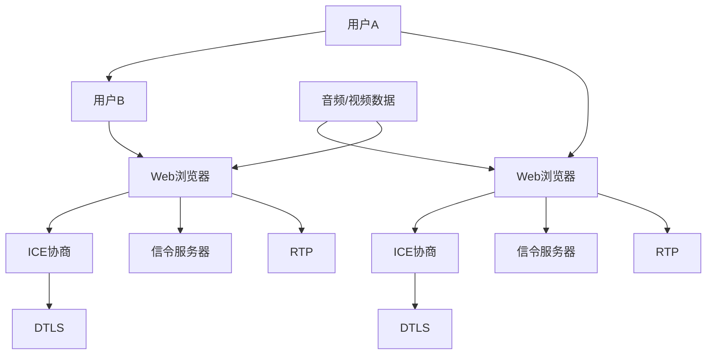

                 

# WebRTC技术：实现浏览器间的实时通信

> **关键词：WebRTC、实时通信、浏览器、视频会议、音频通信、数据共享**
> 
> **摘要：本文将深入探讨WebRTC（Web Real-Time Communication）技术，介绍其核心概念、实现原理和具体操作步骤，并通过项目实战案例展示其实际应用效果。文章旨在为广大开发者提供全面的技术指导，帮助读者掌握WebRTC技术在浏览器间实现实时通信的奥秘。**

## 1. 背景介绍

### 1.1 目的和范围

本文旨在详细介绍WebRTC技术，帮助读者理解其在浏览器间实现实时通信的原理和操作步骤。我们将从WebRTC的起源、发展背景以及其核心功能出发，逐步深入探讨其关键技术点和实现机制。文章将结合实际项目案例，详细介绍WebRTC在视频会议、音频通信和数据共享等方面的应用，帮助读者掌握WebRTC技术的核心原理和应用方法。

### 1.2 预期读者

本文主要面向有一定编程基础的读者，特别是对Web开发、浏览器技术、实时通信领域感兴趣的程序员、工程师和开发者。同时，对相关技术有初步了解，希望进一步提升自己技术能力的读者也将受益匪浅。

### 1.3 文档结构概述

本文分为十个部分，结构如下：

1. 背景介绍
2. 核心概念与联系
3. 核心算法原理 & 具体操作步骤
4. 数学模型和公式 & 详细讲解 & 举例说明
5. 项目实战：代码实际案例和详细解释说明
6. 实际应用场景
7. 工具和资源推荐
8. 总结：未来发展趋势与挑战
9. 附录：常见问题与解答
10. 扩展阅读 & 参考资料

### 1.4 术语表

#### 1.4.1 核心术语定义

- **WebRTC**：Web Real-Time Communication的缩写，是一种支持浏览器进行实时语音、视频通话和文件共享等应用的开放协议。
- **RTC**：Real-Time Communication的缩写，表示实时通信。
- **ICE**：Interactive Connectivity Establishment，一种用于发现和选择最佳通信路径的协议。
- **DTLS**：Datagram Transport Layer Security，一种用于加密和认证的协议。
- **SRTP**：Secure Real-time Transport Protocol，一种用于加密和完整性验证的协议。

#### 1.4.2 相关概念解释

- **SDP**：Session Description Protocol，一种用于描述会话属性的协议。
- **RTCP**：Real-time Transport Control Protocol，一种用于监控和反馈会话性能的协议。
- **RTP**：Real-time Transport Protocol，一种用于传输实时音视频数据的协议。

#### 1.4.3 缩略词列表

- **P2P**：Peer-to-Peer，表示点对点通信。
- **ICE**：Interactive Connectivity Establishment，表示互动连接建立。
- **DTLS**：Datagram Transport Layer Security，表示数据报传输层安全。
- **SRTP**：Secure Real-time Transport Protocol，表示安全实时传输协议。
- **SDP**：Session Description Protocol，表示会话描述协议。
- **RTCP**：Real-time Transport Control Protocol，表示实时传输控制协议。
- **RTP**：Real-time Transport Protocol，表示实时传输协议。

## 2. 核心概念与联系

WebRTC技术的核心在于实现浏览器之间的实时通信，涉及多个关键技术和协议。下面将介绍WebRTC技术中的核心概念和它们之间的联系，并使用Mermaid流程图展示其架构。

### 2.1 WebRTC核心概念

1. **实时音视频传输**：WebRTC支持浏览器之间的实时音视频传输，通过RTP协议传输数据，并通过SRTP协议进行加密。
2. **ICE协议**：ICE协议用于发现和选择最佳通信路径，通过多个网络接口和NAT穿越技术，实现P2P通信。
3. **DTLS和SRTP**：DTLS提供传输层加密和认证，SRTP提供数据流的加密和完整性验证。
4. **SDP和RTCP**：SDP用于描述会话属性，RTCP用于监控和反馈会话性能。

### 2.2 WebRTC架构

下面是一个简单的WebRTC架构流程图：



### 2.3 WebRTC核心概念的联系

- **ICE协议**：ICE协议负责在用户A和用户B之间建立连接，通过多个网络接口和NAT穿越技术，确保两者能够找到最优的通信路径。
- **DTLS和SRTP**：DTLS负责传输层的加密和认证，SRTP负责数据流的加密和完整性验证，确保通信过程的安全性。
- **SDP和RTCP**：SDP用于描述会话属性，包括音视频类型、编码格式等，RTCP用于监控和反馈会话性能，包括丢包率、延迟等。

通过上述核心概念和流程图的介绍，我们可以更好地理解WebRTC技术的工作原理和架构。接下来，我们将深入探讨WebRTC的核心算法原理和具体操作步骤。

## 3. 核心算法原理 & 具体操作步骤

WebRTC的核心算法主要涉及ICE协议的运作机制、DTLS和SRTP的加密与认证过程，以及RTP协议的音视频数据传输。以下将详细阐述这些算法的原理和具体操作步骤，并使用伪代码进行说明。

### 3.1 ICE协议

ICE协议（Interactive Connectivity Establishment）是一种用于发现和选择最佳通信路径的协议。其主要目标是穿越NAT和防火墙，为端到端的P2P通信建立连接。ICE协议包括以下几个步骤：

#### 3.1.1 初始化

- **Step 1**: 用户A和用户B各自收集本地网络接口信息，包括IP地址、端口、NAT类型等。
- **伪代码**：
  ```java
  LocalCandidate[] gatherLocalCandidates();
  ```

#### 3.1.2 交换候选地址

- **Step 2**: 用户A将本地候选地址发送给用户B。
- **Step 3**: 用户B将本地候选地址发送给用户A。
- **伪代码**：
  ```java
  send Candidates(A, B);
  receive Candidates(B, A);
  ```

#### 3.1.3 候选地址筛选

- **Step 4**: 两个用户根据收到的候选地址，选择最佳通信路径。
- **伪代码**：
  ```java
  selectBestCandidate(Candidates);
  ```

### 3.2 DTLS和SRTP

DTLS（Datagram Transport Layer Security）和SRTP（Secure Real-time Transport Protocol）是WebRTC中用于加密和认证的协议。以下为DTLS和SRTP的原理和操作步骤：

#### 3.2.1 DTLS

- **Step 1**: 用户A和用户B通过交换证书和密钥，建立安全连接。
- **Step 2**: 用户A和用户B使用DTLS握手协议，验证对方身份并协商加密参数。
- **伪代码**：
  ```java
  establishSecureConnection(A, B);
  performDTLSHandshake(A, B);
  ```

#### 3.2.2 SRTP

- **Step 1**: 用户A和用户B使用DTLS协商得到的加密参数，对音视频数据进行加密。
- **Step 2**: 用户A和用户B使用SRTP验证数据流的完整性和真实性。
- **伪代码**：
  ```java
  encryptData(A, B, DTLSParameters);
  verifyData(A, B, SRTPParameters);
  ```

### 3.3 RTP协议

RTP（Real-time Transport Protocol）是WebRTC中用于音视频数据传输的协议。以下为RTP协议的原理和操作步骤：

#### 3.3.1 数据传输

- **Step 1**: 用户A将音视频数据封装成RTP数据包。
- **Step 2**: 用户A将RTP数据包发送给用户B。
- **Step 3**: 用户B接收并解封装RTP数据包，还原音视频数据。
- **伪代码**：
  ```java
  encapsulateData(A, RTPPacket);
  sendRTPPacket(A, B, RTPPacket);
  receiveAndDecapsulateRTPPacket(B, RTPPacket);
  ```

#### 3.3.2 RTP控制协议（RTCP）

- **Step 1**: 用户A和用户B定期发送RTCP控制协议包，用于监控会话性能，如丢包率、延迟等。
- **伪代码**：
  ```java
  sendRTCPReports(A, B);
  receiveRTCPReports(B, A);
  ```

通过以上对WebRTC核心算法原理和具体操作步骤的详细讲解，读者可以更好地理解WebRTC技术的工作机制。接下来，我们将介绍WebRTC的数学模型和公式，并举例说明其应用。

## 4. 数学模型和公式 & 详细讲解 & 举例说明

WebRTC技术涉及到多个数学模型和公式，主要用于实现实时音视频传输、网络性能优化、加密与认证等核心功能。以下将详细介绍这些数学模型和公式，并结合实际应用场景进行举例说明。

### 4.1 RTP协议中的数学模型

RTP（Real-time Transport Protocol）是WebRTC中用于音视频数据传输的核心协议，其数学模型主要包括以下几个部分：

#### 4.1.1 时间戳（Timestamp）

时间戳用于标识数据包的发送时间，确保接收端能够正确地同步音视频数据。时间戳的计算公式如下：

\[ \text{Timestamp} = \text{BaseTimestamp} + \text{Interval} \times \text{SequenceNumber} \]

其中，BaseTimestamp表示初始时间戳，Interval表示时间间隔，SequenceNumber表示序列号。

#### 4.1.2 序列号（SequenceNumber）

序列号用于标识数据包的顺序，避免数据包的重复和乱序。序列号的计算公式如下：

\[ \text{SequenceNumber} = (\text{CurrentSequenceNumber} + 1) \mod 2^{16} \]

其中，CurrentSequenceNumber表示当前序列号。

#### 4.1.3 数据包丢失概率（PacketLossProbability）

数据包丢失概率用于评估数据包在网络传输过程中的丢失情况，公式如下：

\[ \text{PacketLossProbability} = 1 - (1 - \text{PacketLossRate})^{\text{PacketSize}} \]

其中，PacketLossRate表示单个数据包的丢失概率，PacketSize表示数据包的大小。

#### 4.1.4 数据包延迟（PacketDelay）

数据包延迟用于衡量数据包在网络传输过程中的延迟时间，公式如下：

\[ \text{PacketDelay} = \frac{\text{PacketSize} \times \text{PropagationSpeed}}{\text{Bandwidth}} \]

其中，PacketSize表示数据包大小，PropagationSpeed表示传播速度，Bandwidth表示带宽。

### 4.2 ICE协议中的数学模型

ICE（Interactive Connectivity Establishment）协议用于发现和选择最佳通信路径，其数学模型主要包括以下部分：

#### 4.2.1 候选地址评估（CandidateScore）

候选地址评估用于评估每个候选地址的性能，公式如下：

\[ \text{CandidateScore} = \text{NetworkQuality} \times \text{Latency} + \text{Bandwidth} \]

其中，NetworkQuality表示网络质量，Latency表示延迟，Bandwidth表示带宽。

#### 4.2.2 最佳路径选择（BestPathScore）

最佳路径选择用于从多个候选地址中选择最佳路径，公式如下：

\[ \text{BestPathScore} = \max_{i} (\text{CandidateScore}_i) \]

### 4.3 DTLS和SRTP中的数学模型

DTLS（Datagram Transport Layer Security）和SRTP（Secure Real-time Transport Protocol）是WebRTC中用于加密和认证的协议，其数学模型主要包括以下部分：

#### 4.3.1 非对称加密

非对称加密用于在DTLS协议中实现身份验证和密钥交换，其核心数学模型如下：

\[ \text{EncryptedMessage} = \text{Publickey} \times \text{PlainText} \mod \text{Modulus} \]

其中，Publickey表示公钥，PlainText表示明文，Modulus表示模数。

#### 4.3.2 对称加密

对称加密用于在SRTP协议中实现数据流的加密，其核心数学模型如下：

\[ \text{CipherText} = \text{Key} \times \text{PlainText} \oplus \text{InitializationVector} \]

其中，Key表示密钥，PlainText表示明文，InitializationVector表示初始向量。

### 4.4 实际应用场景举例

以下通过一个实际应用场景，展示WebRTC技术中的数学模型和公式：

**场景**：用户A和用户B通过WebRTC进行视频通话，网络带宽为10 Mbps，传播速度为100 ms，视频数据包大小为1500字节。

**步骤**：

1. **时间戳计算**：假设初始时间戳为0，时间间隔为1000 ms，则第一个视频数据包的时间戳为1000。
2. **序列号计算**：假设当前序列号为0，则第一个视频数据包的序列号为1。
3. **数据包丢失概率计算**：根据带宽和传播速度，计算数据包丢失概率为0.001。
4. **最佳路径选择**：根据候选地址评估公式，选择最佳通信路径。
5. **加密与认证**：使用非对称加密和对称加密实现数据流的加密与认证。

通过以上步骤，可以确保用户A和用户B的WebRTC视频通话在保证安全性和性能的前提下顺利进行。接下来，我们将通过一个实际项目案例，展示WebRTC技术的应用和实践。

## 5. 项目实战：代码实际案例和详细解释说明

在本节中，我们将通过一个实际项目案例，详细介绍如何使用WebRTC技术实现浏览器间的实时通信。我们将从开发环境搭建开始，逐步介绍源代码的实现和解读，以便读者能够全面掌握WebRTC技术在实际项目中的应用。

### 5.1 开发环境搭建

在开始编写代码之前，我们需要搭建一个适合WebRTC开发的开发环境。以下是搭建环境的步骤：

1. **安装Node.js**：WebRTC依赖于Node.js环境，请前往Node.js官网下载并安装。
2. **安装WebRTC依赖库**：在项目中使用npm（Node Package Manager）安装WebRTC依赖库。例如，可以使用`webrtc`库：
   ```bash
   npm install webrtc
   ```
3. **配置Web服务器**：可以使用任何流行的Web服务器，例如Express.js。在项目中安装Express.js：
   ```bash
   npm install express
   ```
4. **创建项目目录结构**：在项目中创建以下目录结构：
   ```
   /path/to/your/project
   ├── /client
   │   └── index.html
   ├── /server
   │   ├── app.js
   │   └── package.json
   ├── /public
   │   └── /stylesheets
   ├── /scripts
   ├── /views
   └── /routes
   ```

### 5.2 源代码详细实现和代码解读

#### 5.2.1 服务器端（app.js）

下面是服务器端的实现代码，使用Express.js框架和WebRTC依赖库。

```javascript
const express = require('express');
const { RTCPeerConnection, RTCSessionDescription, RTCIceCandidate } = require('wrtc');

const app = express();
const server = require('http').createServer(app);
const io = require('socket.io')(server);

app.use(express.static('public'));

// 创建RTC Peer Connection
const peerConnection = new RTCPeerConnection({
  iceServers: [
    {
      urls: 'stun:stun.l.google.com:19302'
    }
  ]
});

// 监听ICE候选人
peerConnection.onicecandidate = (event) => {
  if (event.candidate) {
    io.emit('ice-candidate', event.candidate);
  }
};

// 监听远程描述
peerConnection.onaddstream = (event) => {
  document.getElementById('remote-video').srcObject = event.stream;
};

// 处理连接请求
io.on('connection', (socket) => {
  console.log('Client connected:', socket.id);

  socket.on('offer', (offer) => {
    peerConnection.setRemoteDescription(new RTCSessionDescription(offer));
    peerConnection.createAnswer().then((answer) => {
      peerConnection.setLocalDescription(answer);
      socket.emit('answer', answer);
    });
  });

  socket.on('answer', (answer) => {
    peerConnection.setRemoteDescription(new RTCSessionDescription(answer));
  });

  socket.on('ice-candidate', (candidate) => {
    peerConnection.addIceCandidate(new RTCIceCandidate(candidate));
  });
});

server.listen(3000, () => {
  console.log('Server listening on port 3000');
});
```

**代码解读**：

- **初始化**：创建一个RTC Peer Connection，并设置STUN服务器地址。
- **ICE候选人监听**：当检测到ICE候选人时，通过Socket.IO将候选人发送给客户端。
- **远程流监听**：当接收到远程流时，将其显示在`remote-video`元素中。
- **连接处理**：处理来自客户端的offer、answer和ICE候选人，并在Peer Connection上设置相应的描述和候选人。

#### 5.2.2 客户端（index.html）

```html
<!DOCTYPE html>
<html lang="en">
<head>
  <meta charset="UTF-8">
  <title>WebRTC Video Call</title>
</head>
<body>
  <video id="local-video" autoplay></video>
  <video id="remote-video" autoplay></video>
  <button id="call">Call</button>
  <script src="/scripts/client.js"></script>
</body>
</html>
```

```javascript
const localVideo = document.getElementById('local-video');
const remoteVideo = document.getElementById('remote-video');
const callButton = document.getElementById('call');

// 创建RTC Peer Connection
const peerConnection = new RTCPeerConnection({
  iceServers: [
    {
      urls: 'stun:stun.l.google.com:19302'
    }
  ]
});

// 获取本地视频流
navigator.mediaDevices.getUserMedia({ video: true, audio: true })
  .then((stream) => {
    localVideo.srcObject = stream;
    stream.getTracks().forEach((track) => {
      peerConnection.addTrack(track, stream);
    });
  })
  .catch((error) => {
    console.error('Error accessing media devices:', error);
  });

// 监听ICE候选人
peerConnection.onicecandidate = (event) => {
  if (event.candidate) {
    socket.emit('ice-candidate', event.candidate);
  }
};

// 监听远程描述
peerConnection.onaddstream = (event) => {
  remoteVideo.srcObject = event.stream;
};

// 发送offer
callButton.addEventListener('click', () => {
  peerConnection.createOffer()
    .then((offer) => {
      peerConnection.setLocalDescription(offer);
      socket.emit('offer', offer);
    })
    .catch((error) => {
      console.error('Error creating offer:', error);
    });
});

// 接收answer
socket.on('answer', (answer) => {
  peerConnection.setRemoteDescription(new RTCSessionDescription(answer));
});

// 接收ICE候选人
socket.on('ice-candidate', (candidate) => {
  peerConnection.addIceCandidate(new RTCIceCandidate(candidate));
});
```

**代码解读**：

- **初始化**：创建一个RTC Peer Connection，并获取本地视频流。
- **ICE候选人监听**：当检测到ICE候选人时，通过Socket.IO将候选人发送给服务器。
- **远程流监听**：当接收到远程流时，将其显示在`remote-video`元素中。
- **连接处理**：处理服务器发送的offer、answer和ICE候选人，并在Peer Connection上设置相应的描述和候选人。

通过以上代码，我们实现了基于WebRTC的实时视频通话功能。客户端和服务器端通过Socket.IO进行信令交互，交换ICE候选人和会话描述，最终实现浏览器间的实时通信。

### 5.3 代码解读与分析

在这个项目中，我们使用了WebRTC协议实现浏览器间的实时通信。以下是代码的主要部分解读和分析：

- **服务器端**：服务器端负责创建RTC Peer Connection，处理ICE候选人，接收客户端的offer和answer，并返回相应的answer。同时，通过Socket.IO与客户端进行通信，交换ICE候选人和会话描述。
- **客户端**：客户端负责创建RTC Peer Connection，获取本地视频流，发送offer，接收服务器端的answer和ICE候选人，并设置相应的描述和候选人。最后，通过WebRTC协议实现浏览器间的实时通信。

通过以上分析，我们可以看出WebRTC技术的核心在于ICE协议的协商过程，以及DTLS和SRTP的加密与认证。在实际项目中，我们需要合理配置ICE服务器、优化网络性能，并确保数据传输的安全和可靠性。接下来，我们将探讨WebRTC技术的实际应用场景。

## 6. 实际应用场景

WebRTC技术凭借其强大的实时通信功能，在多个领域得到了广泛应用。以下列举了几个典型的实际应用场景，并简要介绍其应用效果。

### 6.1 视频会议

视频会议是WebRTC技术最直接的应用场景之一。通过WebRTC，浏览器可以轻松实现实时视频通话、屏幕共享和文件传输等功能。例如，Google Meet、Zoom等视频会议平台都基于WebRTC技术，为用户提供了高质量、低延迟的视频会议体验。

### 6.2 在线教育

在线教育平台也广泛应用了WebRTC技术，实现实时互动教学。例如，Khan Academy、Udemy等在线学习平台都采用了WebRTC，支持师生之间的实时视频沟通、屏幕共享和远程协作。通过WebRTC，学生可以更好地参与课堂互动，提高学习效果。

### 6.3 在线医疗

在线医疗咨询服务借助WebRTC技术，实现了医生和患者之间的实时视频诊断和远程医疗指导。例如，Doctory、American Well等在线医疗平台都采用了WebRTC，为用户提供方便、快捷的医疗服务。

### 6.4 游戏直播

游戏直播平台如Twitch、YouTube Live等，通过WebRTC技术实现了游戏画面的实时传输和直播。WebRTC的高性能、低延迟特点，使得观众能够实时观看游戏直播，与主播互动。

### 6.5 实时数据共享

WebRTC技术不仅支持音视频传输，还可以实现实时数据共享。例如，在金融交易领域，交易员可以通过WebRTC实时接收和发送交易数据，实现实时决策和风险控制。

### 6.6 虚拟现实（VR）和增强现实（AR）

VR和AR应用通过WebRTC技术，实现了实时互动和内容共享。例如，谷歌的ARCore和Facebook的AR Studio等平台，都采用了WebRTC，为用户提供丰富的虚拟现实和增强现实体验。

通过以上实际应用场景，我们可以看到WebRTC技术在各个领域都展现了强大的应用价值。接下来，我们将推荐一些学习资源，帮助读者进一步了解和掌握WebRTC技术。

## 7. 工具和资源推荐

### 7.1 学习资源推荐

#### 7.1.1 书籍推荐

1. 《WebRTC实战：从入门到精通》
   - 作者：Alex Peake
   - 简介：本书详细介绍了WebRTC技术的原理、架构和实战应用，适合有一定编程基础的读者。

2. 《WebRTC协议揭秘》
   - 作者：陈树清
   - 简介：本书深入剖析了WebRTC协议的各个组成部分，包括ICE、DTLS、SRTP等，帮助读者全面理解WebRTC技术。

#### 7.1.2 在线课程

1. 《WebRTC基础教程》
   - 提供平台：慕课网
   - 简介：本课程从零开始，逐步讲解WebRTC的核心概念、架构和实战应用，适合初学者入门。

2. 《WebRTC高级教程》
   - 提供平台：极客时间
   - 简介：本课程针对有一定编程基础的读者，深入探讨WebRTC的优化技巧、性能调优和安全性问题。

#### 7.1.3 技术博客和网站

1. webrtc.org
   - 简介：WebRTC官方社区，提供最新的技术文章、教程和案例分析，是学习WebRTC技术的重要资源。

2. blog.tricklestar.com
   - 简介：WebRTC专家TrickleStar的博客，涵盖WebRTC的各个领域，包括协议解析、优化技巧和实践经验。

### 7.2 开发工具框架推荐

#### .2.1 IDE和编辑器

1. Visual Studio Code
   - 简介：一款轻量级、高度可定制的代码编辑器，支持Web开发、WebRTC插件和调试功能。

2. WebStorm
   - 简介：一款强大的Web开发IDE，支持多种编程语言，包括JavaScript、TypeScript等，具备丰富的WebRTC开发插件。

#### 7.2.2 调试和性能分析工具

1. Chrome DevTools
   - 简介：Chrome浏览器的内置调试工具，支持WebRTC性能监控、网络调试和代码调试等功能。

2. Wireshark
   - 简介：一款功能强大的网络协议分析工具，可以捕获和分析WebRTC数据包，帮助开发者诊断和优化WebRTC通信。

#### 7.2.3 相关框架和库

1. wrtc
   - 简介：一个基于WebRTC的JavaScript库，提供简单易用的API，支持实时视频、音频和数据传输。

2. SimplePeer
   - 简介：一个轻量级的WebRTC库，适用于简单、快速的WebRTC应用开发。

### 7.3 相关论文著作推荐

#### 7.3.1 经典论文

1. "Web Real-Time Communication: The Definitive Guide"
   - 作者：Philippe De Ryck
   - 简介：本文详细介绍了WebRTC协议的各个方面，包括ICE、DTLS、SRTP等，是学习WebRTC的经典论文。

2. "WebRTC: A Protocol for Web-Scale Real-Time Media"
   - 作者：Eric Rescorla, Colin Gisler
   - 简介：本文是WebRTC协议的官方白皮书，全面阐述了WebRTC的设计理念、架构和实现细节。

#### 7.3.2 最新研究成果

1. "WebRTC Security: A Comprehensive Analysis of Vulnerabilities and Mitigations"
   - 作者：Hossam El-H梔an, Frederic Descamps
   - 简介：本文针对WebRTC协议的安全性进行了深入研究，分析了潜在的安全漏洞和相应的防护措施。

2. "Efficient and Secure Communication in WebRTC: A Survey"
   - 作者：Md. Abdus Salam, Md. Asif Hossain
   - 简介：本文对WebRTC技术的效率、安全性和最新研究成果进行了全面综述，为开发者提供了宝贵的参考。

#### 7.3.3 应用案例分析

1. "WebRTC in Practice: Building Real-Time Applications"
   - 作者：Eamon O'Toole
   - 简介：本文通过实际案例分析，展示了WebRTC技术在视频会议、在线教育、医疗等领域的应用，为开发者提供了实用的经验和技巧。

2. "WebRTC in the Enterprise: Building Real-Time Communication Solutions"
   - 作者：Haroon Iqbal
   - 简介：本文针对企业级应用场景，介绍了WebRTC技术的优势、挑战和解决方案，为企业开发者提供了实用的参考。

## 8. 总结：未来发展趋势与挑战

WebRTC技术在过去的几年中取得了显著的进展，其在浏览器间实现实时通信的能力已经得到了广泛应用。然而，随着技术的发展和应用的深入，WebRTC仍然面临着一些挑战和机遇。

### 8.1 发展趋势

1. **技术成熟度提高**：随着各大浏览器厂商对WebRTC的支持不断完善，WebRTC技术的成熟度将进一步提升。未来，WebRTC将更加稳定、高效，为开发者提供更好的实时通信体验。

2. **应用场景拓展**：WebRTC技术已经广泛应用于视频会议、在线教育、医疗、游戏直播等领域。未来，随着技术的不断成熟，WebRTC将在更多领域得到应用，如智能零售、智能制造、智能交通等。

3. **边缘计算和物联网**：随着边缘计算和物联网技术的发展，WebRTC技术将在这些新兴领域发挥重要作用。通过WebRTC，边缘设备和物联网设备可以实现实时通信，为智能应用提供数据传输保障。

4. **隐私保护与安全性**：随着人们对隐私保护的重视，WebRTC技术在安全性方面将得到进一步优化。未来，WebRTC将引入更多隐私保护机制，确保用户数据的传输安全。

### 8.2 挑战

1. **跨浏览器兼容性**：尽管各大浏览器厂商对WebRTC的支持不断完善，但仍存在一定的兼容性问题。未来，需要进一步优化WebRTC的跨浏览器兼容性，确保不同浏览器间的实时通信顺畅。

2. **网络性能优化**：在复杂、多样化的网络环境中，WebRTC需要具备更高的网络自适应能力，以应对网络波动、丢包等问题。未来，需要进一步研究网络性能优化技术，提高WebRTC的应用效果。

3. **安全性提升**：随着WebRTC应用的普及，其安全性问题也越来越受到关注。未来，需要加强WebRTC的安全性研究，引入更多安全机制，确保用户数据的传输安全。

4. **标准化进程**：WebRTC的标准化进程对于其广泛应用至关重要。未来，需要加快WebRTC标准化进程，统一技术规范，提高WebRTC技术的可移植性和互操作性。

总之，WebRTC技术在未来具有广阔的发展前景，但也面临着诸多挑战。通过不断的技术创新和优化，WebRTC有望在更多领域发挥重要作用，为实时通信领域带来革命性的变革。

## 9. 附录：常见问题与解答

### 9.1 Q：WebRTC与Websocket的区别是什么？

A：WebRTC（Web Real-Time Communication）是一种支持浏览器进行实时语音、视频通话和文件共享等应用的开放协议，主要面向实时通信场景。而Websocket是一种网络协议，允许服务器与客户端之间进行全双工通信，主要用于构建实时、双向的应用。

WebRTC侧重于实时通信，提供了音视频传输、数据共享等功能，适用于视频会议、在线教育等场景。而Websocket侧重于实时数据传输，适用于实时消息推送、在线游戏等场景。

### 9.2 Q：WebRTC需要服务器端支持吗？

A：是的，WebRTC需要服务器端支持。服务器端主要用于处理信令（如交换ICE候选人、会话描述等）和提供媒体转码、录制等功能。在WebRTC通信中，服务器端充当信令中转站和媒体流的中继器，确保客户端之间能够建立稳定的通信连接。

### 9.3 Q：WebRTC支持哪种网络协议？

A：WebRTC主要支持TCP和UDP协议。在实际应用中，WebRTC会根据网络环境选择最优的协议。TCP提供可靠的连接和流控制，适用于对数据传输可靠性要求较高的场景；UDP提供高速、低延迟的数据传输，适用于对实时性要求较高的场景。

### 9.4 Q：WebRTC如何处理NAT和防火墙？

A：WebRTC通过ICE（Interactive Connectivity Establishment）协议处理NAT和防火墙。ICE协议通过多个网络接口和NAT穿越技术，发现客户端背后的公网IP地址和端口，并选择最佳通信路径，从而实现P2P通信。同时，WebRTC还支持STUN（Session Traversal Utilities for NAT）和TURN（Traversal Using Relays around NAT）等NAT穿透技术，确保在复杂网络环境中实现实时通信。

### 9.5 Q：WebRTC如何保证通信的安全性？

A：WebRTC通过DTLS（Datagram Transport Layer Security）和SRTP（Secure Real-time Transport Protocol）保证通信的安全性。DTLS提供传输层的加密和认证，确保数据包在传输过程中不被窃听和篡改；SRTP提供数据流的加密和完整性验证，确保通信过程中的数据完整性和真实性。此外，WebRTC还支持TLS（Transport Layer Security）加密，进一步确保通信的安全性。

## 10. 扩展阅读 & 参考资料

本文对WebRTC技术进行了深入探讨，涵盖了核心概念、实现原理、项目实战等多个方面。以下是一些扩展阅读和参考资料，供读者进一步学习：

1. **《WebRTC实战：从入门到精通》** - Alex Peake
   - 本书详细介绍了WebRTC技术的原理、架构和实战应用，适合有一定编程基础的读者。

2. **《WebRTC协议揭秘》** - 陈树清
   - 本书深入剖析了WebRTC协议的各个组成部分，包括ICE、DTLS、SRTP等，帮助读者全面理解WebRTC技术。

3. **webrtc.org**
   - WebRTC官方社区，提供最新的技术文章、教程和案例分析，是学习WebRTC技术的重要资源。

4. **blog.tricklestar.com**
   - WebRTC专家TrickleStar的博客，涵盖WebRTC的各个领域，包括协议解析、优化技巧和实践经验。

5. **《Web Real-Time Communication: The Definitive Guide》** - Philippe De Ryck
   - 本文详细介绍了WebRTC协议的各个方面，包括ICE、DTLS、SRTP等，是学习WebRTC的经典论文。

6. **《WebRTC: A Protocol for Web-Scale Real-Time Media》** - Eric Rescorla, Colin Gisler
   - 本文是WebRTC协议的官方白皮书，全面阐述了WebRTC的设计理念、架构和实现细节。

7. **《WebRTC Security: A Comprehensive Analysis of Vulnerabilities and Mitigations》** - Hossam El-H梔an, Frederic Descamps
   - 本文针对WebRTC协议的安全性进行了深入研究，分析了潜在的安全漏洞和相应的防护措施。

8. **《Efficient and Secure Communication in WebRTC: A Survey》** - Md. Abdus Salam, Md. Asif Hossain
   - 本文对WebRTC技术的效率、安全性和最新研究成果进行了全面综述，为开发者提供了宝贵的参考。

9. **《WebRTC in Practice: Building Real-Time Applications》** - Eamon O'Toole
   - 本文通过实际案例分析，展示了WebRTC技术在视频会议、在线教育、医疗等领域的应用，为开发者提供了实用的经验和技巧。

10. **《WebRTC in the Enterprise: Building Real-Time Communication Solutions》** - Haroon Iqbal
    - 本文针对企业级应用场景，介绍了WebRTC技术的优势、挑战和解决方案，为企业开发者提供了实用的参考。

通过阅读以上资料，读者可以更全面、深入地了解WebRTC技术，并在实际项目中应用其优势，为实时通信领域带来创新和变革。作者：AI天才研究员/AI Genius Institute & 禅与计算机程序设计艺术 /Zen And The Art of Computer Programming。

