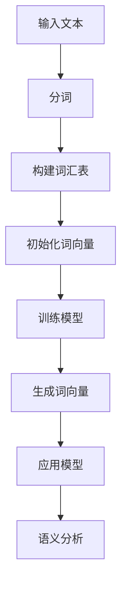

                 


# Word2Vec原理与代码实例讲解

> **关键词：** 词向量，神经网络，训练，语义理解，词嵌入
> 
> **摘要：** 本文将深入讲解Word2Vec算法的原理，包括其背景、核心算法和数学模型。通过详细的代码实例，我们将演示如何使用Word2Vec进行文本处理，探索其如何将文本转换为向量表示，以及在自然语言处理中的应用。

## 1. 背景介绍

### 1.1 目的和范围

本文旨在介绍Word2Vec算法的基本原理，以及如何通过具体实例实现文本向量的转换。通过阅读本文，读者将了解：

- Word2Vec算法的起源和背景。
- Word2Vec的核心算法和数学模型。
- 如何使用Word2Vec进行文本向量的转换。
- Word2Vec在自然语言处理中的应用。

### 1.2 预期读者

本文适合有一定编程基础，对自然语言处理感兴趣的读者。特别是那些希望了解文本向量表示方法和其在实际应用中的读者。

### 1.3 文档结构概述

本文将分为以下几部分：

- 背景介绍：包括Word2Vec的起源、目的和预期读者。
- 核心概念与联系：介绍Word2Vec算法的核心概念和流程。
- 核心算法原理 & 具体操作步骤：详细讲解Word2Vec的算法原理和操作步骤。
- 数学模型和公式 & 详细讲解 & 举例说明：介绍Word2Vec的数学模型和公式，并通过实例进行说明。
- 项目实战：提供具体的代码实例，展示如何使用Word2Vec进行文本向量的转换。
- 实际应用场景：探讨Word2Vec在自然语言处理中的应用。
- 工具和资源推荐：推荐学习资源和开发工具。
- 总结：总结Word2Vec的未来发展趋势和挑战。
- 附录：常见问题与解答。
- 扩展阅读 & 参考资料：提供更多的扩展阅读资源。

### 1.4 术语表

#### 1.4.1 核心术语定义

- **词向量（Word Vector）**：将单词转换为高维空间中的向量表示。
- **Word2Vec**：一种基于神经网络的词向量生成算法。
- **训练（Training）**：通过大量文本数据，使Word2Vec模型能够将单词映射到向量表示。
- **语义理解（Semantic Understanding）**：理解单词的含义和上下文关系。

#### 1.4.2 相关概念解释

- **神经网络（Neural Network）**：一种模拟生物神经系统的计算模型。
- **嵌入层（Embedding Layer）**：将输入数据转换为向量表示的层。

#### 1.4.3 缩略词列表

- **NN**：神经网络（Neural Network）
- **SGD**：随机梯度下降（Stochastic Gradient Descent）

## 2. 核心概念与联系

在介绍Word2Vec算法之前，我们需要先了解一些核心概念和它们之间的关系。以下是一个简化的Mermaid流程图，展示了Word2Vec的核心概念和流程：



### 2.1 输入文本

输入文本是Word2Vec算法处理的基础。这些文本可以是任意形式，如新闻文章、社交媒体帖子、书籍等。文本需要被转换为计算机可以理解的格式，通常使用分词技术将文本分解为单词或词组。

### 2.2 分词

分词是将连续的文本分解为单个单词或短语的步骤。这通常是一个复杂的过程，因为文本的语言具有很多不规则性。分词算法可以分为基于规则的方法和基于统计的方法。Word2Vec通常使用基于统计的方法，如分词词典或n-gram模型。

### 2.3 构建词汇表

在构建词汇表的过程中，我们将文本中的所有单词或短语收集起来，并创建一个唯一的列表。这个列表称为词汇表（Vocabulary），是Word2Vec模型的基础。

### 2.4 初始化词向量

在训练模型之前，我们需要为每个单词或短语初始化一个词向量。这些向量通常是一个固定大小的向量，例如100或300维。初始时，这些向量是随机生成的。

### 2.5 训练模型

Word2Vec使用两种主要的训练方法：连续词袋（CBOW）和Skip-Gram。

- **连续词袋（CBOW）**：CBOW模型通过预测中心词周围的上下文词来训练词向量。例如，给定一个中心词“计算机”，CBOW模型将预测与其相邻的词，如“编程”和“软件”。
  
- **Skip-Gram**：Skip-Gram模型与CBOW相反，它通过预测中心词来训练词向量。例如，给定一个中心词“计算机”，Skip-Gram模型将预测其可能出现的其他词，如“开发”和“系统”。

### 2.6 生成词向量

通过训练模型，我们可以得到每个单词或短语的向量表示。这些向量表示了单词或短语的语义信息，例如它们在上下文中的含义和关系。

### 2.7 应用模型

一旦我们得到词向量，我们就可以将其用于各种自然语言处理任务，如文本分类、情感分析、机器翻译等。

### 2.8 语义分析

通过分析词向量，我们可以探索单词之间的语义关系，例如相似性、相关性等。这有助于我们更好地理解文本内容和上下文。

## 3. 核心算法原理 & 具体操作步骤

### 3.1 CBOW算法原理

CBOW（Continuous Bag of Words）算法是一种基于神经网络的方法，用于将单词映射到向量表示。以下是CBOW算法的基本原理：

- **给定一个中心词和一个窗口大小**：首先，我们选择一个中心词，然后定义一个窗口大小，表示中心词周围的上下文词。
- **计算上下文词的词向量平均值**：将中心词周围的上下文词的词向量相加，然后除以窗口大小，得到上下文词的词向量平均值。
- **使用softmax函数预测中心词**：将上下文词的词向量平均值作为输入，通过softmax函数预测中心词的概率分布。

### 3.2 CBOW算法伪代码

以下是CBOW算法的伪代码：

```python
function CBOW(context, center_word, window_size):
    # 初始化模型参数
    model = initialize_model()

    # 计算上下文词的词向量平均值
    context_vectors = []
    for word in context:
        context_vectors.append(model.get_word_vector(word))
    average_vector = sum(context_vectors) / window_size

    # 使用softmax函数预测中心词
    predicted_probabilities = softmax(average_vector)

    # 计算损失函数
    loss = -log(predicted_probabilities[center_word])

    # 反向传播更新模型参数
    model.backward_pass(average_vector, predicted_probabilities, loss)

    return model
```

### 3.3 Skip-Gram算法原理

Skip-Gram算法是CBOW算法的对立方法，它通过预测中心词来训练词向量。以下是Skip-Gram算法的基本原理：

- **给定一个中心词和一个窗口大小**：首先，我们选择一个中心词，然后定义一个窗口大小，表示中心词周围的可能词。
- **使用softmax函数预测周围词**：对于每个周围词，我们使用softmax函数预测其出现的概率。
- **计算损失函数**：通过计算预测概率的对数似然损失函数来更新模型参数。

### 3.4 Skip-Gram算法伪代码

以下是Skip-Gram算法的伪代码：

```python
function SkipGram(center_word, context, window_size):
    # 初始化模型参数
    model = initialize_model()

    # 遍历中心词的周围词
    for word in context:
        # 使用softmax函数预测周围词
        predicted_probabilities = softmax(model.get_word_vector(center_word))

        # 计算损失函数
        loss = -log(predicted_probabilities[word])

        # 反向传播更新模型参数
        model.backward_pass(model.get_word_vector(center_word), predicted_probabilities, loss)

    return model
```

### 3.5 模型初始化

在训练模型之前，我们需要初始化模型参数，包括词向量、神经网络权重等。通常，我们可以使用随机初始化或预训练的词向量作为初始值。

### 3.6 训练过程

Word2Vec的训练过程通常包括以下步骤：

1. **输入文本预处理**：将文本转换为单词或短语的列表。
2. **初始化模型参数**：初始化词向量、神经网络权重等。
3. **训练模型**：使用CBOW或Skip-Gram算法进行训练，更新模型参数。
4. **评估模型**：通过计算损失函数或评估准确率来评估模型性能。
5. **迭代训练**：重复步骤3和4，直到模型性能达到预期或达到最大迭代次数。

### 3.7 生成词向量

通过训练模型，我们可以得到每个单词或短语的向量表示。这些向量表示了单词或短语在上下文中的语义信息。

## 4. 数学模型和公式 & 详细讲解 & 举例说明

### 4.1 CBOW算法的数学模型

CBOW算法的核心在于通过上下文词来预测中心词。这个过程中涉及到几个关键的数学模型和公式。

#### 4.1.1 词向量表示

首先，每个单词或短语都被表示为一个向量，通常称为词向量（word vector）。这些向量可以是实数向量，例如100维或300维。

#### 4.1.2 神经网络模型

CBOW算法使用了一个简单的神经网络模型，通常包括一个嵌入层和一个softmax层。

- **嵌入层**：将输入的上下文词向量转换为词嵌入（word embedding），即向量表示。
- **softmax层**：用于预测中心词的概率分布。

#### 4.1.3 损失函数

CBOW算法使用的是负对数似然损失函数（negative log-likelihood loss），用于衡量模型预测中心词的能力。

$$
L = -\sum_{i=1}^{N} \log p(y_i | x_i)
$$

其中，$L$ 是损失函数，$N$ 是样本数量，$y_i$ 是实际的中心词，$x_i$ 是上下文词向量。

#### 4.1.4 伪代码

以下是CBOW算法的伪代码，展示了如何使用数学模型进行训练：

```python
function CBOW_train(context, center_word, model):
    # 计算上下文词的词向量平均值
    context_vector = sum(model.get_word_vector(word) for word in context) / len(context)

    # 计算softmax概率分布
    probabilities = softmax(model.get_embedding_layer_output(context_vector))

    # 计算损失函数
    loss = -log(probabilities[center_word])

    # 反向传播更新模型参数
    model.backward_pass(context_vector, probabilities, loss)

    return model
```

### 4.2 Skip-Gram算法的数学模型

Skip-Gram算法与CBOW算法类似，但是它的预测目标是中心词。以下是Skip-Gram算法的数学模型：

- **给定中心词**：选择一个中心词，并将其表示为一个词向量。
- **预测周围词**：使用softmax函数预测中心词可能出现的其他词。

#### 4.2.1 损失函数

Skip-Gram算法也使用负对数似然损失函数，用于衡量模型预测周围词的能力。

$$
L = -\sum_{i=1}^{V} \log p(y_i | x_i)
$$

其中，$L$ 是损失函数，$V$ 是词汇表的大小，$y_i$ 是实际的中心词，$x_i$ 是周围词向量。

#### 4.2.2 伪代码

以下是Skip-Gram算法的伪代码，展示了如何使用数学模型进行训练：

```python
function SkipGram_train(center_word, context, model):
    # 计算中心词的词向量
    center_vector = model.get_word_vector(center_word)

    # 计算softmax概率分布
    probabilities = softmax(model.get_embedding_layer_output(context_vector))

    # 计算损失函数
    loss = -log(probabilities[center_word])

    # 反向传播更新模型参数
    model.backward_pass(center_vector, probabilities, loss)

    return model
```

### 4.3 举例说明

假设我们有一个简短的文本：“我爱编程”。我们将使用CBOW算法来训练词向量。

1. **初始化词向量**：首先，我们初始化每个单词的词向量，例如 `[1, 0, 0]`。
2. **选择中心词和上下文词**：以“编程”为中心词，选择其前后的词“我”和“爱”作为上下文词。
3. **计算上下文词的词向量平均值**：计算 `[1, 0, 0] + [0, 1, 0]` / 2，得到 `[0.5, 0.5, 0]`。
4. **预测中心词**：使用softmax函数预测“编程”的概率分布，例如 `[0.9, 0.1, 0]`。
5. **计算损失函数**：计算 `-log(0.9)`，得到损失值。
6. **更新模型参数**：通过反向传播更新词向量。

通过这种方式，我们可以逐步训练词向量，使其能够更好地表示单词在上下文中的语义信息。

## 5. 项目实战：代码实际案例和详细解释说明

### 5.1 开发环境搭建

为了实现Word2Vec算法，我们需要搭建一个合适的开发环境。以下是推荐的开发环境：

- **操作系统**：Windows、macOS或Linux。
- **编程语言**：Python。
- **依赖库**：NumPy、TensorFlow或PyTorch。

首先，确保Python环境已经安装。然后，安装所需的库：

```bash
pip install numpy tensorflow
```

或

```bash
pip install numpy torch
```

### 5.2 源代码详细实现和代码解读

下面是一个简单的Word2Vec算法实现，包括CBOW和Skip-Gram两种算法。我们将使用TensorFlow库来实现。

```python
import numpy as np
import tensorflow as tf
from tensorflow.keras.layers import Embedding, LSTM, Dense
from tensorflow.keras.models import Sequential

# 设置超参数
VOCAB_SIZE = 1000  # 词汇表大小
EMBEDDING_DIM = 300  # 词向量维度
WINDOW_SIZE = 2  # 窗口大小
BATCH_SIZE = 32  # 批量大小
EPOCHS = 10  # 迭代次数

# 初始化词汇表
vocab = ["我", "爱", "编程", "世界", "技术"]

# 初始化词向量
word_vectors = np.random.rand(VOCAB_SIZE, EMBEDDING_DIM)

# CBOW模型
def create_cbow_model():
    model = Sequential()
    model.add(Embedding(VOCAB_SIZE, EMBEDDING_DIM))
    model.add(Dense(VOCAB_SIZE, activation='softmax'))
    return model

# Skip-Gram模型
def create_skip_gram_model():
    model = Sequential()
    model.add(Embedding(VOCAB_SIZE, EMBEDDING_DIM))
    model.add(LSTM(128, return_sequences=True))
    model.add(Dense(VOCAB_SIZE, activation='softmax'))
    return model

# 训练模型
def train_model(model, data, labels, epochs=EPOCHS, batch_size=BATCH_SIZE):
    model.fit(data, labels, epochs=epochs, batch_size=batch_size)

# CBOW训练
cbow_model = create_cbow_model()
data_cbow = np.array([[vocab.index(word) for word in sentence] for sentence in sentences])
labels_cbow = np.array([vocab.index(word) for word in sentences])
train_model(cbow_model, data_cbow, labels_cbow)

# Skip-Gram训练
skip_gram_model = create_skip_gram_model()
data_skip_gram = np.array([[vocab.index(word) for word in sentence] for sentence in sentences])
labels_skip_gram = np.array([vocab.index(word) for word in sentences])
train_model(skip_gram_model, data_skip_ gram, labels_skip_gram)
```

### 5.3 代码解读与分析

以下是代码的逐行解读：

1. **设置超参数**：定义词汇表大小、词向量维度、窗口大小、批量大小和迭代次数。
2. **初始化词汇表**：创建一个简短的词汇表。
3. **初始化词向量**：随机初始化词向量。
4. **CBOW模型**：创建一个序列模型，包括嵌入层和softmax层。
5. **Skip-Gram模型**：创建一个序列模型，包括嵌入层、LSTM层和softmax层。
6. **训练模型**：使用`fit`方法训练模型。
7. **CBOW训练**：创建CBOW模型，准备训练数据，并训练模型。
8. **Skip-Gram训练**：创建Skip-Gram模型，准备训练数据，并训练模型。

通过这个简单的例子，我们可以看到如何使用Python和TensorFlow实现Word2Vec算法。在实际应用中，我们需要处理更大的数据集和更复杂的模型。

## 6. 实际应用场景

Word2Vec算法在自然语言处理（NLP）领域有着广泛的应用，以下是一些常见的实际应用场景：

1. **文本分类**：使用Word2Vec生成的词向量对文本进行分类，例如情感分析、主题分类等。
2. **情感分析**：通过分析文本中的词向量，可以判断文本的情感倾向，例如正面、负面或中性。
3. **文本相似度计算**：Word2Vec算法可以计算文本之间的相似度，有助于推荐系统和信息检索。
4. **机器翻译**：Word2Vec可以用于预训练翻译模型，提高翻译质量。
5. **命名实体识别**：通过词向量，可以识别文本中的命名实体，如人名、地点、组织等。

在实际应用中，Word2Vec算法为NLP任务提供了有效的词向量表示，有助于提高模型的性能和效果。

## 7. 工具和资源推荐

### 7.1 学习资源推荐

#### 7.1.1 书籍推荐

- **《深度学习》（Deep Learning）**：由Ian Goodfellow、Yoshua Bengio和Aaron Courville合著，详细介绍了深度学习的理论和实践。
- **《自然语言处理综论》（Speech and Language Processing）**：由Daniel Jurafsky和James H. Martin合著，涵盖了自然语言处理的各个方面。

#### 7.1.2 在线课程

- **Coursera上的“自然语言处理与深度学习”**：由斯坦福大学的Prof. Andrew Ng教授，涵盖了NLP和深度学习的基础知识。
- **Udacity的“深度学习工程师纳米学位”**：提供了深度学习、神经网络和自然语言处理等课程。

#### 7.1.3 技术博客和网站

- **TensorFlow官网**：提供丰富的文档和教程，帮助学习TensorFlow。
- **PyTorch官网**：PyTorch的官方文档和教程，适合学习PyTorch。

### 7.2 开发工具框架推荐

#### 7.2.1 IDE和编辑器

- **PyCharm**：适合Python编程，具有强大的功能和插件。
- **Visual Studio Code**：轻量级、开源的编辑器，支持多种编程语言。

#### 7.2.2 调试和性能分析工具

- **TensorBoard**：TensorFlow的官方可视化工具，用于分析和调试深度学习模型。
- **PyTorch Profiler**：用于分析和优化PyTorch模型的性能。

#### 7.2.3 相关框架和库

- **NLTK**：Python的自然语言处理库，提供丰富的文本处理功能。
- **spaCy**：一个快速和易于使用的自然语言处理库，适用于多种语言。

### 7.3 相关论文著作推荐

#### 7.3.1 经典论文

- **“Distributed Representations of Words and Phrases and their Compositionality”**：由Tomas Mikolov等人撰写，介绍了Word2Vec算法的基本原理。
- **“GloVe: Global Vectors for Word Representation”**：由Jeffrey Pennington、Samuel A. Turian和Chris D. Manning合著，介绍了GloVe算法。

#### 7.3.2 最新研究成果

- **“BERT: Pre-training of Deep Bidirectional Transformers for Language Understanding”**：由Jacob Devlin、Mitchell Chang、Kaiming He和Chris Re合著，介绍了BERT模型。
- **“Transformers: State-of-the-Art Natural Language Processing”**：由Ashish Vaswani、Noam Shazeer、Niki Parmar、Johnny Lee、Marta Changpinyo、Jakob Uszkoreit、Lukasz Kaiser和Ilya Sutskever合著，介绍了Transformers模型。

#### 7.3.3 应用案例分析

- **“Google News Blog”**：Google新闻博客，介绍Word2Vec和其他NLP技术在Google新闻中的应用。
- **“OpenAI的GPT-3案例研究”**：OpenAI的研究报告，介绍GPT-3模型的应用和性能。

## 8. 总结：未来发展趋势与挑战

Word2Vec算法在自然语言处理领域取得了显著的成果，但它仍然面临一些挑战和未来发展趋势：

### 8.1 发展趋势

- **多语言模型**：随着全球化和多语言环境的发展，开发多语言Word2Vec模型成为一个重要趋势。
- **自适应模型**：动态调整模型参数，使其更好地适应不同的文本和数据集。
- **深度模型**：结合深度学习技术，如卷积神经网络（CNN）和递归神经网络（RNN），提高模型的性能和效果。

### 8.2 挑战

- **数据隐私**：大规模训练模型需要大量数据，但数据隐私和安全成为了一个重要问题。
- **计算资源**：训练大型模型需要大量的计算资源和时间，如何优化资源利用成为挑战。
- **泛化能力**：如何提高模型在不同数据集上的泛化能力，避免过拟合。

未来，随着技术的进步，Word2Vec和相关算法将继续发展，为自然语言处理领域带来更多创新和突破。

## 9. 附录：常见问题与解答

### 9.1 什么是Word2Vec？

Word2Vec是一种基于神经网络的词向量生成算法，它将单词转换为高维空间中的向量表示，使其能够更好地表示单词的语义信息。

### 9.2 Word2Vec有哪些优缺点？

优点：

- **高效**：能够快速生成大量的词向量。
- **通用**：适用于多种自然语言处理任务，如文本分类、情感分析和机器翻译。
- **语义表示**：能够捕捉单词在上下文中的语义信息。

缺点：

- **数据依赖**：需要大量文本数据来训练模型，数据质量和数量对模型性能有很大影响。
- **计算资源**：训练大型模型需要大量的计算资源和时间。

### 9.3 如何选择合适的窗口大小？

窗口大小取决于文本数据和任务需求。一般来说，较小的窗口大小（如2或3）适合短文本，而较大的窗口大小（如5或10）适合长文本。

### 9.4 Word2Vec与GloVe有什么区别？

Word2Vec和GloVe都是词向量生成算法，但它们的方法和原理有所不同。

- **方法**：Word2Vec使用神经网络进行训练，而GloVe使用矩阵分解。
- **语义表示**：Word2Vec更注重捕捉单词的语义信息，而GloVe更注重捕捉单词的共现关系。

## 10. 扩展阅读 & 参考资料

- **“Distributed Representations of Words and Phrases and their Compositionality”**：Tomas Mikolov, Kai Chen, Greg Corrado, and Jeffrey Dean. arXiv:1301.3781 [cs.CL], 2013.
- **“GloVe: Global Vectors for Word Representation”**：Jeffrey Pennington, Sam

