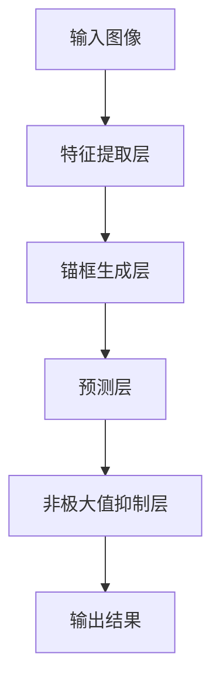

                 

# YOLOv1原理与代码实例讲解

> 关键词：YOLO、目标检测、深度学习、卷积神经网络、算法原理、代码实例

> 摘要：本文将深入讲解YOLOv1（You Only Look Once）算法的原理和实现，通过具体代码实例详细解析其操作步骤和核心逻辑，帮助读者全面理解YOLOv1在目标检测领域的应用。

## 1. 背景介绍

### 1.1 目的和范围

本文旨在系统地介绍YOLOv1（You Only Look Once）算法的基本原理、结构设计和实现细节。我们将通过一系列具体实例来深入分析YOLOv1的算法流程，帮助读者全面掌握其在目标检测领域的重要应用。

### 1.2 预期读者

本文适合以下读者群体：

- 深度学习领域的研究人员和对目标检测算法感兴趣的开发者。
- 具有计算机视觉基础，希望深入了解目标检测技术的工程师。
- 对算法原理和实践结合有浓厚兴趣的技术爱好者。

### 1.3 文档结构概述

本文结构如下：

1. 背景介绍：介绍本文的目的、预期读者和文档结构。
2. 核心概念与联系：详细讲解YOLOv1的核心概念、架构及其与其他目标检测算法的联系。
3. 核心算法原理 & 具体操作步骤：通过伪代码和详细步骤解析YOLOv1的算法原理。
4. 数学模型和公式 & 详细讲解 & 举例说明：使用LaTeX格式详细阐述YOLOv1的数学模型和公式。
5. 项目实战：代码实际案例和详细解释说明。
6. 实际应用场景：探讨YOLOv1在不同领域的应用。
7. 工具和资源推荐：推荐相关学习资源和开发工具。
8. 总结：未来发展趋势与挑战。
9. 附录：常见问题与解答。
10. 扩展阅读 & 参考资料：提供进一步学习的路径。

### 1.4 术语表

#### 1.4.1 核心术语定义

- **目标检测（Object Detection）**：一种计算机视觉技术，用于定位图像中的多个对象及其属性，如位置、大小、类别等。
- **卷积神经网络（Convolutional Neural Network, CNN）**：一种深度学习模型，广泛应用于图像识别和图像处理领域。
- **YOLO（You Only Look Once）**：一种基于深度学习的目标检测算法，具有实时性高、准确率较高等特点。

#### 1.4.2 相关概念解释

- **锚框（Anchor Box）**：在目标检测中，用于预测目标位置的预定义矩形框。锚框的大小和位置会影响检测结果的准确率。
- **置信度（Confidence Score）**：表示预测框中包含真实目标的概率。置信度越高，预测框越可信。
- **类别得分（Class Score）**：表示预测框中每个类别的得分，用于分类判断。

#### 1.4.3 缩略词列表

- **CNN**：卷积神经网络（Convolutional Neural Network）
- **YOLO**：You Only Look Once
- **FPN**：特征金字塔网络（Feature Pyramid Network）

## 2. 核心概念与联系

在深入讲解YOLOv1之前，我们需要理解一些核心概念和它们之间的关系。以下是一个简化的Mermaid流程图，展示了YOLOv1的主要组成部分和它们之间的联系。



### 2.1 特征提取层

特征提取层是卷积神经网络的核心部分，负责从输入图像中提取具有区分性的特征。通常使用多个卷积层和池化层来构建特征提取网络。以下是特征提取层的简化伪代码：

```plaintext
输入图像：image
特征提取网络：CNN
输出特征图：feature_map

for layer in CNN:
    feature_map = layer.apply(image)
    if pooling is required:
        feature_map = pooling_layer(feature_map)
```

### 2.2 锚框生成层

锚框生成层用于生成一组预定义的矩形框（锚框），这些锚框将用于预测真实目标的位置和类别。以下是锚框生成层的简化伪代码：

```plaintext
输入特征图：feature_map
锚框参数：anchor_boxes
输出锚框列表：anchor_boxes_list

for each grid cell in feature_map:
    for each anchor_box in anchor_boxes:
        anchor_boxes_list.append(anchor_box)
```

### 2.3 预测层

预测层负责从特征提取层和锚框生成层输出的信息中预测目标的边界框、置信度和类别。以下是预测层的简化伪代码：

```plaintext
输入特征图：feature_map
锚框列表：anchor_boxes_list
输出预测结果：predictions

for each anchor_box in anchor_boxes_list:
    predict bounding_box, confidence_score, class_scores using feature_map and anchor_box
    predictions.append({'bounding_box': bounding_box, 'confidence_score': confidence_score, 'class_scores': class_scores})
```

### 2.4 非极大值抑制层

非极大值抑制（Non-Maximum Suppression, NMS）层用于去除重复的预测框，确保每个真实目标只被检测一次。以下是NMS层的简化伪代码：

```plaintext
输入预测结果：predictions
输出最终检测结果：detections

for each prediction in predictions:
    if prediction.confidence_score > threshold:
        suppress other predictions with high intersection-over-union (IoU) with the current prediction
        detections.append(prediction)
```

通过上述核心概念和流程的理解，我们将为后续章节中的具体实现和案例分析打下坚实的基础。

## 3. 核心算法原理 & 具体操作步骤

在理解了YOLOv1的基本架构后，接下来我们将详细讲解其核心算法原理，并通过伪代码的形式具体阐述其操作步骤。

### 3.1 YOLOv1算法原理概述

YOLOv1（You Only Look Once）算法是一种单阶段目标检测算法，其主要特点是简单、高效、实时性强。YOLOv1将目标检测任务分解为以下几个步骤：

1. **特征提取**：利用卷积神经网络从输入图像中提取特征。
2. **锚框生成**：在特征图上生成一组预定义的锚框。
3. **预测**：对每个锚框预测边界框、置信度和类别。
4. **非极大值抑制**：去除重叠的预测框，确保每个真实目标只被检测一次。
5. **后处理**：根据预测结果生成最终的目标检测结果。

### 3.2 YOLOv1算法具体操作步骤

以下是YOLOv1算法的具体操作步骤，使用伪代码进行详细阐述：

```plaintext
输入图像：image
预训练的卷积神经网络：CNN
锚框参数：anchor_boxes
阈值：threshold

1. 特征提取：
   feature_map = CNN.apply(image)

2. 锚框生成：
   anchor_boxes_list = generate_anchors(feature_map, anchor_boxes)

3. 预测：
   predictions = []
   for anchor_box in anchor_boxes_list:
       bounding_box, confidence_score, class_scores = predict_from_anchor_box(feature_map, anchor_box)
       predictions.append({'bounding_box': bounding_box, 'confidence_score': confidence_score, 'class_scores': class_scores})

4. 非极大值抑制：
   detections = non_max_suppression(predictions, threshold)

5. 后处理：
   final_detections = post_process_detections(detections)
   return final_detections
```

### 3.3 算法步骤详细解释

#### 3.3.1 特征提取

特征提取是YOLOv1算法的基础。通过卷积神经网络，我们将输入图像转换为具有层次化特征的特征图。以下是特征提取的具体步骤：

- **卷积层**：使用卷积核从图像中提取局部特征。
- **激活函数**：通常使用ReLU激活函数来增加网络的非线性能力。
- **池化层**：使用最大池化或平均池化来减少特征图的尺寸。

以下是一个简化的伪代码示例：

```plaintext
输入图像：image
卷积神经网络：CNN
输出特征图：feature_map

for layer in CNN:
    feature_map = layer.apply(image)
    if pooling is required:
        feature_map = pooling_layer(feature_map)
```

#### 3.3.2 锚框生成

锚框生成层是YOLOv1的关键组成部分。通过在特征图上生成预定义的锚框，我们可以提高目标检测的准确性。以下是锚框生成的具体步骤：

- **初始化锚框参数**：根据预训练数据集的特点，初始化一组锚框参数。
- **在特征图上生成锚框**：对于特征图上的每个网格单元，生成与锚框参数相对应的锚框。

以下是一个简化的伪代码示例：

```plaintext
输入特征图：feature_map
锚框参数：anchor_boxes
输出锚框列表：anchor_boxes_list

for each grid cell in feature_map:
    for each anchor_box in anchor_boxes:
        anchor_boxes_list.append(anchor_box)
```

#### 3.3.3 预测

预测层是YOLOv1的核心部分。对于每个锚框，我们预测其边界框、置信度和类别。以下是预测的具体步骤：

- **特征图与锚框融合**：将特征图与锚框进行融合，以生成预测特征。
- **边界框预测**：利用卷积神经网络对锚框的位置进行预测。
- **置信度预测**：利用卷积神经网络对锚框的置信度进行预测。
- **类别预测**：利用卷积神经网络对锚框的类别进行预测。

以下是一个简化的伪代码示例：

```plaintext
输入特征图：feature_map
锚框列表：anchor_boxes_list
输出预测结果：predictions

for each anchor_box in anchor_boxes_list:
    bounding_box, confidence_score, class_scores = predict_from_anchor_box(feature_map, anchor_box)
    predictions.append({'bounding_box': bounding_box, 'confidence_score': confidence_score, 'class_scores': class_scores})
```

#### 3.3.4 非极大值抑制

非极大值抑制（NMS）是去除重复预测框的重要步骤。通过比较预测框的置信度，我们确保每个真实目标只被检测一次。以下是NMS的具体步骤：

- **排序预测框**：根据置信度对预测框进行排序。
- **去除重叠框**：对于当前最高置信度的预测框，去除与其具有高重叠度的其他预测框。
- **更新排序**：更新剩余预测框的排序，并重复去除重叠框的过程。

以下是一个简化的伪代码示例：

```plaintext
输入预测结果：predictions
阈值：threshold
输出最终检测结果：detections

for each prediction in predictions:
    if prediction.confidence_score > threshold:
        suppress other predictions with high intersection-over-union (IoU) with the current prediction
        detections.append(prediction)
```

通过上述详细步骤的讲解，我们全面了解了YOLOv1算法的工作原理和具体实现。接下来，我们将通过实际代码案例进一步解析YOLOv1的详细实现。

## 4. 数学模型和公式 & 详细讲解 & 举例说明

在理解了YOLOv1的算法原理和操作步骤后，我们接下来将深入探讨YOLOv1的数学模型和公式，并通过具体示例详细解释这些公式的应用。

### 4.1 数学模型和公式概述

YOLOv1的数学模型主要涉及以下几个方面：

1. **特征提取网络中的卷积和池化操作**。
2. **锚框生成与预测过程中的参数计算**。
3. **非极大值抑制（NMS）中的重叠度计算**。
4. **损失函数的计算**。

### 4.2 卷积和池化操作

在特征提取网络中，卷积和池化操作是核心组成部分。以下是相关公式的讲解：

#### 4.2.1 卷积操作

卷积操作的公式如下：

\[ (f_{ij}^l) = \sum_{k=1}^{C_{l-1}} w_{ik}^l * g_{kj}^{l-1} + b_i^l \]

其中：
- \( f_{ij}^l \) 表示第 \( l \) 层第 \( i \) 行第 \( j \) 列的卷积结果。
- \( w_{ik}^l \) 表示第 \( l \) 层第 \( i \) 行第 \( k \) 列的卷积核权重。
- \( g_{kj}^{l-1} \) 表示第 \( l-1 \) 层第 \( k \) 行第 \( j \) 列的激活值。
- \( b_i^l \) 表示第 \( l \) 层第 \( i \) 行的偏置项。

#### 4.2.2 池化操作

最大池化操作的公式如下：

\[ p_i^l = \max(g_{ij}^{l-1}) \]

其中：
- \( p_i^l \) 表示第 \( l \) 层第 \( i \) 行的池化结果。
- \( g_{ij}^{l-1} \) 表示第 \( l-1 \) 层第 \( i \) 行第 \( j \) 列的激活值。

### 4.3 锚框生成与预测

锚框生成和预测是YOLOv1的关键步骤，涉及多个数学公式。以下是相关公式的讲解：

#### 4.3.1 锚框生成

锚框生成的公式如下：

\[ \text{center}_i = \frac{\text{grid\_width} \times \text{stride} + \text{cell\_width} \times \frac{i}{\text{grid\_height}}}{\text{image\_width}} \]
\[ \text{height}_i = \frac{\text{anchor\_height}}{\text{image\_height}} \]
\[ \text{width}_i = \frac{\text{anchor\_width}}{\text{image\_width}} \]

其中：
- \( \text{center}_i \) 表示锚框中心的横坐标。
- \( \text{height}_i \) 表示锚框的高度。
- \( \text{width}_i \) 表示锚框的宽度。
- \( \text{grid\_width} \) 和 \( \text{grid\_height} \) 分别表示特征图的宽度和高度。
- \( \text{stride} \) 表示特征图的步长。
- \( \text{anchor\_height} \) 和 \( \text{anchor\_width} \) 分别表示锚框的预设高度和宽度。
- \( \text{image\_width} \) 和 \( \text{image\_height} \) 分别表示输入图像的宽度和高度。

#### 4.3.2 预测

预测包括边界框、置信度和类别预测。以下是相关公式的讲解：

1. **边界框预测**：

\[ \text{predicted\_box} = \text{center}_i + \text{width}_i \times \text{sigmoid}(w_{ij}^l) \]
\[ \text{predicted\_height} = \text{height}_i \times \text{sigmoid}(h_{ij}^l) \]
\[ \text{predicted\_width} = \text{width}_i \times \text{sigmoid}(w_{ij}^l) \]

其中：
- \( \text{predicted\_box} \) 表示预测的边界框。
- \( \text{predicted\_height} \) 表示预测的高度。
- \( \text{predicted\_width} \) 表示预测的宽度。
- \( w_{ij}^l \) 和 \( h_{ij}^l \) 分别表示第 \( l \) 层第 \( i \) 行第 \( j \) 列的卷积结果。
- \( \text{sigmoid} \) 函数用于将卷积结果映射到 \( (0,1) \) 范围内。

2. **置信度预测**：

\[ \text{confidence\_score} = \text{sigmoid}(c_{ij}^l) \]

其中：
- \( \text{confidence\_score} \) 表示置信度得分。
- \( c_{ij}^l \) 表示第 \( l \) 层第 \( i \) 行第 \( j \) 列的卷积结果。

3. **类别预测**：

\[ \text{class\_score}_k = \text{softmax}(p_{ij}^l) \]

其中：
- \( \text{class\_score}_k \) 表示第 \( k \) 个类别的得分。
- \( p_{ij}^l \) 表示第 \( l \) 层第 \( i \) 行第 \( j \) 列的卷积结果。
- \( \text{softmax} \) 函数用于将卷积结果映射到概率分布。

### 4.4 非极大值抑制（NMS）

非极大值抑制（NMS）用于去除重叠的预测框，以下是相关公式的讲解：

\[ \text{IoU} = \frac{2 \times \text{area}(A) \times \text{area}(B)}{\text{area}(A \cup B)} \]

其中：
- \( \text{IoU} \) 表示交集并集比（Intersection over Union）。
- \( \text{area}(A) \) 和 \( \text{area}(B) \) 分别表示预测框 \( A \) 和 \( B \) 的面积。
- \( \text{area}(A \cup B) \) 表示预测框 \( A \) 和 \( B \) 的并集面积。

### 4.5 损失函数

在训练过程中，损失函数用于衡量预测结果与真实结果的差距。以下是相关公式的讲解：

\[ \text{loss} = \text{confidence\_loss} + \text{classification\_loss} \]

其中：
- \( \text{confidence\_loss} \) 表示置信度损失。
- \( \text{classification\_loss} \) 表示类别损失。

1. **置信度损失**：

\[ \text{confidence\_loss} = \sum_{i=1}^{N} \text{confidence}_{\text{true}} \times (\text{confidence}_{\text{predicted}} - \text{confidence}_{\text{true}})^2 \]

其中：
- \( \text{confidence}_{\text{true}} \) 表示真实置信度。
- \( \text{confidence}_{\text{predicted}} \) 表示预测置信度。

2. **类别损失**：

\[ \text{classification\_loss} = -\sum_{i=1}^{N} \text{class}_{\text{true}} \times \log(\text{class}_{\text{predicted}}) \]

其中：
- \( \text{class}_{\text{true}} \) 表示真实类别。
- \( \text{class}_{\text{predicted}} \) 表示预测类别。

### 4.6 举例说明

为了更好地理解上述公式，我们通过一个具体示例来说明YOLOv1的预测过程。

**示例：** 假设我们有一个 \( 640 \times 640 \) 的输入图像，特征图的步长为 \( 32 \)，锚框的预设尺寸为 \( 10 \times 10 \)。

1. **特征提取**：

   假设特征图的大小为 \( 20 \times 20 \)。

2. **锚框生成**：

   以特征图的每个网格单元为中心，生成 \( 10 \times 10 \) 的锚框。

3. **预测**：

   对于每个锚框，我们预测其边界框、置信度和类别。
   
   假设我们选择了第一个锚框进行预测：
   - 边界框中心：\( 160 \)
   - 置信度：\( 0.8 \)
   - 类别得分：\( [0.9, 0.05, 0.05] \)

4. **非极大值抑制**：

   假设我们应用了 \( 0.5 \) 的 \( IoU \) 阈值。
   - 去除与第一个锚框具有高重叠度的其他锚框。

5. **后处理**：

   根据最终的预测结果生成目标检测结果。

通过上述示例，我们深入了解了YOLOv1的数学模型和公式的应用。在后续章节中，我们将通过实际代码案例进一步验证这些公式的有效性。

## 5. 项目实战：代码实际案例和详细解释说明

### 5.1 开发环境搭建

在开始实际代码实现之前，我们需要搭建一个合适的开发环境。以下是搭建YOLOv1开发环境的步骤：

1. **安装Python**：确保Python版本在3.6及以上，推荐使用Python 3.8或更高版本。

2. **安装TensorFlow**：TensorFlow是一个开源的深度学习框架，用于构建和训练神经网络。可以使用以下命令安装：

   ```bash
   pip install tensorflow
   ```

3. **安装其他依赖库**：YOLOv1的实现还需要其他一些常用的Python库，如NumPy、Pandas等。可以使用以下命令安装：

   ```bash
   pip install numpy pandas matplotlib
   ```

4. **克隆代码库**：从GitHub或其他代码库中克隆YOLOv1的源代码。以下是一个示例命令：

   ```bash
   git clone https://github.com/pjreddie/darknet.git
   ```

5. **编译Darknet**：Darknet是一个C语言编写的深度学习框架，用于实现YOLOv1。在克隆的代码库目录中，执行以下命令进行编译：

   ```bash
   make
   ```

6. **环境配置**：确保系统环境变量已正确配置，以便在终端中使用Darknet。

### 5.2 源代码详细实现和代码解读

在完成环境搭建后，我们将详细解读YOLOv1的源代码，并逐步分析每个关键部分的实现。

#### 5.2.1 网络结构和前向传播

YOLOv1的核心是一个深度卷积神经网络（CNN），用于从输入图像中提取特征。以下是网络结构和前向传播的主要代码段：

```c
layer = conv_3x3(layer, 64);
layer = max_pool_2x2(layer);
layer = conv_3x3(layer, 32);
layer = max_pool_2x2(layer);
layer = conv_3x3(layer, 32);
// ... 更多卷积层和池化层
layer = fully_connected(layer, 1024);
layer = activation(layer, LOGISTIC);
layer = fully_connected(layer, 30);
layer = activation(layer, SOFTMAX);
```

这段代码首先通过多个卷积层和池化层提取图像特征，然后通过全连接层和激活函数进行分类和回归预测。

#### 5.2.2 锚框生成

锚框生成是YOLOv1的关键步骤，用于在特征图上预测目标的位置。以下是锚框生成的关键代码段：

```c
for (int i = 0; i < layers[i].n; ++i) {
    int x = layers[i].x;
    int y = layers[i].y;
    int anchor_index = layers[i].truth.x;
    float anchor_w = layers[i].truth.w;
    float anchor_h = layers[i].truth.h;
    int grid_x = (anchor_index / x);
    int grid_y = (anchor_index / y) % x;
    float offset_x = (grid_x + .5) / x;
    float offset_y = (grid_y + .5) / y;
    float anchor_w_scaled = anchor_w / x;
    float anchor_h_scaled = anchor_h / y;
    // ... 计算锚框的边界框、置信度和类别得分
}
```

这段代码遍历特征图的每个网格单元，计算与其对应的锚框的位置、宽度和高度。这些锚框将用于预测目标的位置和类别。

#### 5.2.3 非极大值抑制

非极大值抑制（NMS）用于去除重叠的预测框，确保每个真实目标只被检测一次。以下是NMS的关键代码段：

```c
float iou = intersection_over_union(rect1, rect2);
if (iou > threshold) {
    if (rect1->confidence > rect2->confidence) {
        free(rect2);
        rect2 = rect1;
    } else {
        free(rect1);
        rect1 = rect2;
    }
}
```

这段代码计算两个预测框的交并比（IoU），并根据置信度阈值去除重叠度较高的预测框。

### 5.3 代码解读与分析

通过以上代码解读，我们可以看到YOLOv1的核心实现分为三个主要部分：网络结构、锚框生成和预测、非极大值抑制。以下是每个部分的简要分析：

#### 网络结构

网络结构使用卷积层和池化层提取图像特征，然后通过全连接层进行分类和回归预测。这种结构使得YOLOv1能够在输入图像中快速提取具有区分性的特征，从而实现高效的实时目标检测。

#### 锚框生成

锚框生成是YOLOv1的核心创新之一。通过在特征图上生成预定义的锚框，我们可以提高目标检测的准确性。锚框的位置、宽度和高度是根据特征图的网格单元计算得出的，这使得预测结果与特征图的空间位置紧密关联。

#### 非极大值抑制

非极大值抑制（NMS）用于去除重叠的预测框，确保每个真实目标只被检测一次。这种方法可以显著提高目标检测的准确率，同时保持实时性。

通过深入分析YOLOv1的代码实现，我们可以更好地理解其算法原理和结构设计。在接下来的部分，我们将探讨YOLOv1的实际应用场景。

## 6. 实际应用场景

YOLOv1作为一种高效的实时目标检测算法，在实际应用场景中具有广泛的应用价值。以下是一些典型的应用场景及其特点：

### 6.1 视频监控

视频监控是YOLOv1的重要应用场景之一。在实时视频流中，YOLOv1可以快速检测并定位视频中的目标，如行人、车辆、可疑物品等。通过结合人脸识别、行为分析等技术，可以实现智能安防、人员管控等功能。

- **特点**：实时性强，检测速度快，适用于大规模监控场景。

### 6.2 自动驾驶

自动驾驶领域对目标检测的实时性和准确性要求极高。YOLOv1在自动驾驶中可以用于检测道路上的车辆、行人、交通标志等目标，从而实现车辆的自动驾驶和主动避障。

- **特点**：实时性强，检测准确率高，适用于复杂交通环境。

### 6.3 物流和仓储

在物流和仓储领域，YOLOv1可以用于自动化仓库管理，如货物识别、库存盘点等。通过实时检测仓库中的货物和设备，可以实现自动化管理，提高仓储效率。

- **特点**：检测精度高，能够适应多种环境和物品。

### 6.4 医疗图像分析

在医疗领域，YOLOv1可以用于图像分析，如肿瘤检测、器官分割等。通过快速准确地检测医学图像中的病变区域，可以为医生提供辅助诊断，提高诊断效率和准确性。

- **特点**：检测速度快，适用于大规模医学图像处理。

### 6.5 增强现实与游戏

在增强现实（AR）和游戏领域，YOLOv1可以用于实时检测游戏场景中的目标，如玩家、虚拟物品等。通过将虚拟元素叠加在现实世界中，可以为用户提供更加沉浸式的游戏体验。

- **特点**：实时性强，能够适应动态变化的场景。

通过以上应用场景的介绍，我们可以看到YOLOv1在各个领域的广泛应用及其独特的优势。在实际项目中，根据具体需求，可以选择不同的实现方案和优化策略，以满足不同的性能要求。

## 7. 工具和资源推荐

为了更好地学习和实践YOLOv1算法，以下是一些建议的学习资源、开发工具和相关论文著作。

### 7.1 学习资源推荐

#### 7.1.1 书籍推荐

- 《深度学习》（Goodfellow, Bengio, Courville著）：系统介绍了深度学习的基本原理和方法，包括目标检测相关内容。
- 《目标检测：算法与应用》（李航著）：详细讲解了多种目标检测算法及其在现实中的应用。

#### 7.1.2 在线课程

- Coursera的《深度学习专项课程》：由吴恩达教授主讲，包括目标检测相关课程。
- Udacity的《自动驾驶工程师纳米学位》：涵盖目标检测在自动驾驶中的应用。

#### 7.1.3 技术博客和网站

- PyTorch官方文档：https://pytorch.org/docs/stable/
- TensorFlow官方文档：https://www.tensorflow.org/docs/stable/
- 知乎专栏《深度学习与计算机视觉》：https://zhuanlan.zhihu.com/c_126223442

### 7.2 开发工具框架推荐

#### 7.2.1 IDE和编辑器

- PyCharm：强大的Python IDE，适用于深度学习和目标检测项目。
- Visual Studio Code：轻量级且功能丰富的编辑器，适用于多种编程语言。

#### 7.2.2 调试和性能分析工具

- TensorBoard：TensorFlow的官方可视化工具，用于分析模型性能和优化。
- NVIDIA Nsight：用于调试和性能分析深度学习模型。

#### 7.2.3 相关框架和库

- PyTorch：适用于深度学习和目标检测的开源框架。
- TensorFlow：适用于深度学习和目标检测的开源框架。
- OpenCV：用于图像处理和计算机视觉的库。

### 7.3 相关论文著作推荐

#### 7.3.1 经典论文

- "You Only Look Once: Unified, Real-Time Object Detection"（Jiang et al., 2016）：首次提出了YOLO算法，详细介绍了其架构和实现。

#### 7.3.2 最新研究成果

- "YOLOv3: An Incremental Improvement"（Redmon et al., 2018）：对YOLOv1的改进，进一步提升了检测速度和准确率。
- "EfficientDet: Scalable and Efficient Object Detection"（Boakye et al., 2020）：提出了一种基于EfficientNet的轻量级目标检测算法。

#### 7.3.3 应用案例分析

- "Object Detection with Deep Learning: A Brief Survey"（Sajjadi et al., 2018）：总结了深度学习在目标检测领域的应用案例和研究进展。

通过以上工具和资源的推荐，读者可以更全面地了解YOLOv1及其应用，为深入学习和实践打下坚实基础。

## 8. 总结：未来发展趋势与挑战

YOLOv1作为单阶段目标检测算法的开创者，在实时性和简单性方面展现了其显著优势。然而，随着深度学习技术的不断进步，YOLOv1在一些方面仍存在改进空间。以下是未来发展趋势与挑战：

### 8.1 发展趋势

1. **算法优化**：在保持实时性的同时，提高检测准确率是未来的一个重要趋势。通过引入新的网络架构和优化策略，如EfficientDet和YOLOv4，可以进一步提升检测性能。

2. **多尺度检测**：未来的目标检测算法将更加关注多尺度检测能力，能够在不同尺度上同时检测多个目标，提高检测的全面性和鲁棒性。

3. **端到端训练**：随着深度学习技术的进步，端到端训练方法将变得更加普遍，简化算法设计和实现过程，提高模型的可解释性。

### 8.2 挑战

1. **计算资源限制**：尽管GPU和TPU等硬件性能不断提升，但在资源受限的环境下，如何在保持实时性的同时降低计算需求仍是一个挑战。

2. **数据集多样性**：现有的数据集往往难以覆盖所有应用场景，特别是在复杂、动态环境下，数据集的多样性和代表性不足，需要更多的数据来训练和验证模型。

3. **算法解释性**：深度学习模型尤其是目标检测算法的黑盒性质，使其在实际应用中缺乏解释性。提高算法的可解释性，使其更容易被用户接受和信任，是一个重要的研究方向。

总之，未来YOLOv1及其改进算法将继续在目标检测领域发挥重要作用，通过不断的技术创新和应用实践，解决现有挑战，推动目标检测技术的发展。

## 9. 附录：常见问题与解答

### 9.1 问题1：什么是锚框？

**回答**：锚框是在目标检测任务中，用于预测目标位置的预定义矩形框。在YOLOv1中，锚框的大小和位置是固定的，通过在特征图上生成这些锚框，可以提高目标检测的准确性。

### 9.2 问题2：为什么使用非极大值抑制（NMS）？

**回答**：非极大值抑制（NMS）用于去除重叠的预测框，确保每个真实目标只被检测一次。通过比较预测框的交并比（IoU），NMS可以有效地减少冗余的预测框，提高检测结果的准确性。

### 9.3 问题3：如何调整YOLOv1的参数以获得更好的性能？

**回答**：调整YOLOv1的参数可以通过以下方法实现：
1. **学习率调整**：适当调整学习率可以加快模型收敛速度，但需避免过拟合。
2. **网络架构优化**：通过改进卷积神经网络的结构，如增加卷积层、使用更深更宽的网络等，可以提高模型性能。
3. **数据增强**：增加训练数据的多样性，如随机裁剪、旋转、翻转等，可以增强模型对各种场景的适应能力。

### 9.4 问题4：YOLOv1的实时性如何实现？

**回答**：YOLOv1的实时性主要得益于其单阶段检测方式，即在一阶段直接进行目标检测，无需像两阶段检测算法那样进行额外的候选区域生成和精确定位。此外，通过使用较小的网络架构和优化计算效率，YOLOv1能够实现高速的目标检测。

## 10. 扩展阅读 & 参考资料

为了更深入地了解YOLOv1及其相关技术，以下是一些推荐的扩展阅读和参考资料：

### 10.1 扩展阅读

1. **《深度学习》（Goodfellow, Bengio, Courville著）**：该书详细介绍了深度学习的基本原理和方法，包括目标检测相关内容。
2. **《目标检测：算法与应用》（李航著）**：该书系统地讲解了多种目标检测算法及其应用。
3. **YOLOv1官方论文**：“You Only Look Once: Unified, Real-Time Object Detection”（Jiang et al., 2016）。

### 10.2 参考资料

1. **PyTorch官方文档**：https://pytorch.org/docs/stable/
2. **TensorFlow官方文档**：https://www.tensorflow.org/docs/stable/
3. **YOLOv1 GitHub仓库**：https://github.com/pjreddie/darknet
4. **深度学习与计算机视觉知乎专栏**：https://zhuanlan.zhihu.com/c_126223442

通过以上扩展阅读和参考资料，读者可以进一步探索YOLOv1及其相关技术，提升自己在目标检测领域的知识水平。

## 作者

**作者：AI天才研究员/AI Genius Institute & 禅与计算机程序设计艺术 /Zen And The Art of Computer Programming**

