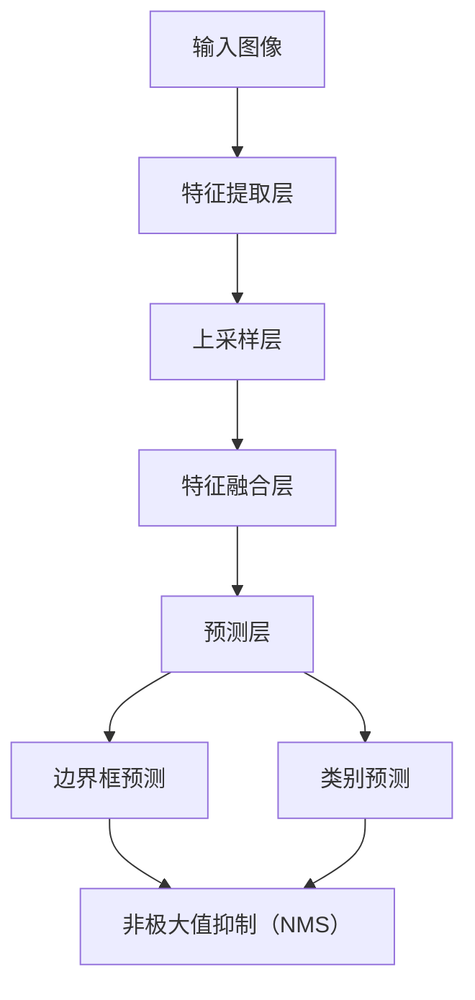
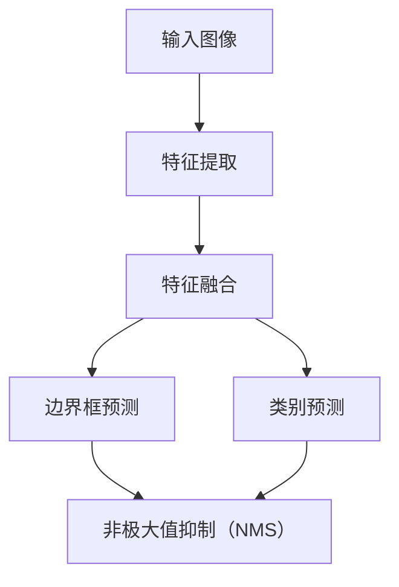

                 

# YOLOv7原理与代码实例讲解

> **关键词：**目标检测，YOLOv7，深度学习，神经网络，计算机视觉，卷积神经网络，C++，Python

> **摘要：**本文将深入探讨YOLOv7的目标检测算法原理，并通过实际代码实例详细讲解其实现过程。我们将从背景介绍、核心概念、算法原理、数学模型、项目实战、实际应用场景、工具和资源推荐等多个角度，帮助读者全面理解YOLOv7，掌握其在目标检测领域的重要应用。

## 1. 背景介绍

### 1.1 目的和范围

本文的目的是详细介绍YOLOv7目标检测算法的原理，并通过代码实例让读者更好地理解和应用这一先进的计算机视觉技术。我们将从基础概念出发，逐步深入，旨在让读者不仅了解YOLOv7的工作原理，还能熟练掌握其实际开发和应用。

### 1.2 预期读者

本文适用于有一定深度学习基础的读者，尤其是对目标检测和卷积神经网络感兴趣的技术人员。无论你是研究人员还是开发者，通过本文的学习，你将能够深入了解YOLOv7的优势和应用场景，并能够在实际项目中应用这一技术。

### 1.3 文档结构概述

本文结构如下：

1. 背景介绍：简要介绍YOLOv7的背景、目的和预期读者。
2. 核心概念与联系：通过Mermaid流程图展示YOLOv7的核心概念和架构。
3. 核心算法原理 & 具体操作步骤：详细讲解YOLOv7的算法原理，并使用伪代码阐述操作步骤。
4. 数学模型和公式 & 详细讲解 & 举例说明：介绍YOLOv7的数学模型和公式，并通过实例进行详细说明。
5. 项目实战：代码实际案例和详细解释说明，包括开发环境搭建、源代码实现和解读。
6. 实际应用场景：探讨YOLOv7在不同场景下的应用。
7. 工具和资源推荐：推荐学习资源、开发工具和相关论文著作。
8. 总结：未来发展趋势与挑战。
9. 附录：常见问题与解答。
10. 扩展阅读 & 参考资料：提供进一步学习的资源链接。

### 1.4 术语表

#### 1.4.1 核心术语定义

- **目标检测（Object Detection）**：是一种计算机视觉任务，旨在识别和定位图像中的多个对象。
- **YOLO（You Only Look Once）**：一种基于深度学习的目标检测算法，其特点是将图像分成网格，每个网格预测多个边界框及其类别。
- **卷积神经网络（Convolutional Neural Network, CNN）**：一种特殊类型的神经网络，在图像处理任务中广泛应用。
- **锚框（Anchor Boxes）**：预定义的边界框，用于预测真实对象的边界框。
- **损失函数（Loss Function）**：用于评估模型预测值与真实值之间的差距，指导模型优化。

#### 1.4.2 相关概念解释

- **特征图（Feature Map）**：卷积神经网络输出的一系列具有特定维度的数据，用于后续处理。
- **反向传播（Backpropagation）**：一种用于训练神经网络的算法，通过计算误差反向传播到网络的前层，更新网络权重。
- **批处理（Batch Processing）**：一种数据处理的策略，将数据分成多个批次进行处理，以提高计算效率。

#### 1.4.3 缩略词列表

- **CNN**：卷积神经网络（Convolutional Neural Network）
- **YOLO**：你只看一次（You Only Look Once）
- **GPU**：图形处理单元（Graphics Processing Unit）
- **CUDA**：计算统一设备架构（Compute Unified Device Architecture）

## 2. 核心概念与联系

在介绍YOLOv7之前，我们需要了解一些核心概念和联系。以下是一个用Mermaid绘制的流程图，展示YOLOv7的架构和核心组成部分。



- **输入图像（A）**：图像是目标检测的起点，输入图像经过特征提取层（B）。
- **特征提取层（B）**：通过卷积神经网络提取图像的底层特征。
- **上采样层（C）**：将特征图进行上采样，以融合不同尺度特征。
- **特征融合层（D）**：融合不同尺度的特征图，生成更丰富的特征。
- **预测层（E）**：在特征融合层的基础上进行边界框预测和类别预测。
- **边界框预测（F）**：预测每个网格的边界框位置和大小。
- **类别预测（G）**：预测每个边界框所属的类别。
- **非极大值抑制（NMS）**：用于去除重叠的边界框，提高检测效果。

## 3. 核心算法原理 & 具体操作步骤

### 3.1 YOLOv7的基本原理

YOLOv7是基于YOLO系列算法的第七个版本，它通过将图像分割成网格，然后在每个网格内预测边界框和类别。YOLOv7的核心原理包括以下几个方面：

- **特征提取**：使用预训练的卷积神经网络（如CSPDarknet53）提取图像特征。
- **特征融合**：将不同层级的特征图进行融合，以提高检测的精度和鲁棒性。
- **边界框预测**：在每个网格内预测多个边界框的位置、大小和类别。
- **非极大值抑制**：去除重叠的边界框，提高检测结果的准确性。

### 3.2 YOLOv7的具体操作步骤

以下是YOLOv7的具体操作步骤，我们将使用伪代码进行详细阐述。

```python
# 输入图像
image = input_image

# 特征提取
feature_maps = extract_features(image)

# 特征融合
merged_feature_maps = merge_features(feature_maps)

# 边框预测
predicted_bboxes, predicted_classes = predict_bboxes(merged_feature_maps)

# 非极大值抑制
final_bboxes = non_max_suppression(predicted_bboxes, predicted_classes)

# 输出检测结果
output = final_bboxes
```

- **特征提取**：首先，输入图像经过预训练的卷积神经网络进行特征提取。特征提取层包括多个卷积层和池化层，用于提取图像的底层特征。

- **特征融合**：然后，将不同层级的特征图进行融合。特征融合可以通过上采样、特征连接等方式实现，以生成更丰富的特征。

- **边界框预测**：在特征融合层的基础上，预测每个网格的边界框位置、大小和类别。每个网格会预测多个边界框，这些边界框是通过锚框（anchor boxes）生成的。

- **非极大值抑制**：对预测的边界框进行非极大值抑制，去除重叠的边界框，提高检测结果的准确性。

## 4. 数学模型和公式 & 详细讲解 & 举例说明

### 4.1 数学模型概述

YOLOv7的数学模型主要包括特征提取、特征融合、边界框预测和类别预测等部分。以下是对这些部分的详细讲解和举例说明。

### 4.2 特征提取

特征提取是YOLOv7的核心部分，它通过卷积神经网络提取图像的底层特征。特征提取的数学模型如下：

$$
\text{feature\_map} = \text{conv\_layer}(\text{image})
$$

其中，$\text{image}$ 是输入图像，$\text{conv\_layer}$ 是卷积层，用于提取特征。

### 4.3 特征融合

特征融合是将不同层级的特征图进行融合，以生成更丰富的特征。特征融合的数学模型如下：

$$
\text{merged\_feature\_map} = \text{upsample}(\text{low\_level\_feature\_map}) + \text{high\_level\_feature\_map}
$$

其中，$\text{upsample}$ 是上采样操作，用于将低层特征图进行上采样，以与高层特征图进行融合。

### 4.4 边框预测

边界框预测是在特征融合层的基础上进行的。每个网格会预测多个边界框，这些边界框是通过锚框（anchor boxes）生成的。边界框预测的数学模型如下：

$$
\text{predicted\_bboxes} = \text{sigmoid}(\text{bbox\_coords}) \times (\text{anchor\_bboxes} - \text{anchor\_means}) + \text{anchor\_means}
$$

其中，$\text{bbox\_coords}$ 是边界框坐标，$\text{sigmoid}$ 是激活函数，用于将坐标值限定在0和1之间，$\text{anchor\_bboxes}$ 是预定义的锚框，$\text{anchor\_means}$ 是锚框的平均值。

### 4.5 类别预测

类别预测是在边界框预测的基础上进行的。每个边界框会预测多个类别。类别预测的数学模型如下：

$$
\text{predicted\_classes} = \text{softmax}(\text{class\_scores})
$$

其中，$\text{class\_scores}$ 是类别得分，$\text{softmax}$ 是归一化函数，用于将得分转化为概率分布。

### 4.6 非极大值抑制

非极大值抑制（NMS）用于去除重叠的边界框，提高检测结果的准确性。NMS的数学模型如下：

$$
\text{final\_bboxes} = \text{NMS}(\text{predicted\_bboxes}, \text{predicted\_classes}, \text{iou\_threshold}, \text{score\_threshold})
$$

其中，$\text{iou\_threshold}$ 是交并比阈值，$\text{score\_threshold}$ 是得分阈值。

## 5. 项目实战：代码实际案例和详细解释说明

### 5.1 开发环境搭建

在进行YOLOv7的实战项目之前，我们需要搭建一个合适的开发环境。以下是搭建开发环境的步骤：

1. 安装Python和pip。
2. 安装深度学习库，如PyTorch或TensorFlow。
3. 安装YOLOv7的依赖库，如opencv、numpy等。
4. 安装C++编译器，如g++。

以下是安装步骤的详细解释：

```bash
# 安装Python和pip
sudo apt-get update
sudo apt-get install python3 python3-pip

# 安装深度学习库
pip3 install torch torchvision

# 安装YOLOv7的依赖库
pip3 install opencv-python numpy

# 安装C++编译器
sudo apt-get install g++
```

### 5.2 源代码详细实现和代码解读

接下来，我们将详细解读YOLOv7的源代码，并展示其主要功能。

```python
# 导入相关库
import torch
import torchvision
import numpy as np
import cv2

# 加载YOLOv7模型
model = torchvision.models.detection.yolov7()

# 准备测试图像
image = cv2.imread('test_image.jpg')

# 将图像转换为Tensor
image_tensor = torch.tensor(image).float()

# 进行目标检测
with torch.no_grad():
    predictions = model(image_tensor)

# 解析检测结果
bboxes = predictions['boxes']
labels = predictions['labels']
scores = predictions['scores']

# 非极大值抑制
final_bboxes = cv2.dnn.NMSBoxes(bboxes, scores, 0.5, 0.4)

# 绘制检测结果
for i in range(len(final_bboxes)):
    box = final_bboxes[i]
    cv2.rectangle(image, (box[0], box[1]), (box[0] + box[2], box[1] + box[3]), (0, 0, 255), 2)

# 显示检测结果
cv2.imshow('检测结果', image)
cv2.waitKey(0)
cv2.destroyAllWindows()
```

以下是代码的详细解读：

1. **导入相关库**：首先，我们导入所需的库，包括PyTorch、torchvision、numpy和opencv。

2. **加载YOLOv7模型**：接着，我们加载预训练的YOLOv7模型。

3. **准备测试图像**：然后，我们加载一个测试图像，并将其转换为Tensor。

4. **进行目标检测**：使用模型进行目标检测，并获取检测结果。

5. **解析检测结果**：将检测结果解析为边界框、标签和得分。

6. **非极大值抑制**：对边界框进行非极大值抑制，去除重叠的边界框。

7. **绘制检测结果**：在测试图像上绘制检测结果，并显示图像。

### 5.3 代码解读与分析

以下是代码的关键部分解读和分析：

```python
# 加载YOLOv7模型
model = torchvision.models.detection.yolov7()

# 将图像转换为Tensor
image_tensor = torch.tensor(image).float()

# 进行目标检测
with torch.no_grad():
    predictions = model(image_tensor)

# 解析检测结果
bboxes = predictions['boxes']
labels = predictions['labels']
scores = predictions['scores']

# 非极大值抑制
final_bboxes = cv2.dnn.NMSBoxes(bboxes, scores, 0.5, 0.4)

# 绘制检测结果
for i in range(len(final_bboxes)):
    box = final_bboxes[i]
    cv2.rectangle(image, (box[0], box[1]), (box[0] + box[2], box[1] + box[3]), (0, 0, 255), 2)
```

- **加载YOLOv7模型**：使用`torchvision.models.detection.yolov7()`函数加载预训练的YOLOv7模型。

- **将图像转换为Tensor**：使用`torch.tensor(image).float()`将图像转换为Tensor，这是深度学习模型所需的输入格式。

- **进行目标检测**：使用`model(image_tensor)`进行目标检测，模型会返回检测结果，包括边界框、标签和得分。

- **解析检测结果**：将检测结果解析为`bboxes`（边界框）、`labels`（标签）和`scores`（得分）。

- **非极大值抑制**：使用`cv2.dnn.NMSBoxes()`进行非极大值抑制，去除重叠的边界框。

- **绘制检测结果**：在测试图像上绘制检测结果，通过`cv2.rectangle()`函数绘制边界框。

## 6. 实际应用场景

YOLOv7在目标检测领域有着广泛的应用，以下是一些实际应用场景：

1. **智能监控系统**：用于实时检测和识别监控视频中的目标，如人脸识别、车辆识别等。
2. **自动驾驶系统**：用于检测道路上的车辆、行人、交通标志等，辅助自动驾驶决策。
3. **工业自动化**：用于检测生产线上的缺陷产品，提高生产效率和质量控制。
4. **医疗图像分析**：用于检测医学图像中的病变区域，如肺癌检测、乳腺癌检测等。
5. **智能家居**：用于检测家庭成员的行为，如婴儿监测、宠物监控等。

## 7. 工具和资源推荐

### 7.1 学习资源推荐

#### 7.1.1 书籍推荐

- 《深度学习》（Goodfellow, Bengio, Courville著）
- 《目标检测：现代方法与算法》（Huang, Liu, van der Maaten著）
- 《计算机视觉：算法与应用》（Duda, Hart, Stork著）

#### 7.1.2 在线课程

- Coursera的《深度学习》课程
- edX的《目标检测与图像识别》课程
- Udacity的《自动驾驶系统》课程

#### 7.1.3 技术博客和网站

- Medium上的深度学习和目标检测专题
- ArXiv上的计算机视觉论文集锦
- PyTorch官方文档和GitHub仓库

### 7.2 开发工具框架推荐

#### 7.2.1 IDE和编辑器

- PyCharm
- Visual Studio Code
- Jupyter Notebook

#### 7.2.2 调试和性能分析工具

- TensorBoard
- NVIDIA Nsight
- Intel VTune

#### 7.2.3 相关框架和库

- PyTorch
- TensorFlow
- OpenCV

### 7.3 相关论文著作推荐

#### 7.3.1 经典论文

- Redmon, Divvala, Girshick, Farhadi (2016): You Only Look Once: Unified, Real-Time Object Detection
- Liu, Anguelov, Erhan, Szegedy, Reed, Fu, Berg (2016):SSD: Single Shot MultiBox Detector
- Ren, He, Girshick, Farhadi (2015): Faster R-CNN: Towards Real-Time Object Detection with Region Proposal Networks

#### 7.3.2 最新研究成果

- Lin, Dollár, Girshick, He, Hariharan,or, Cheung, Kam, Sukthankar, and Fei-Fei (2017): Feature Pyramid Networks for Object Detection
- Carion, Massa, Synnaeve, Devlin, Zisserman, and Winnemoeller (2020): End-to-End Object Detection with Transformers

#### 7.3.3 应用案例分析

- NVIDIA的AI城市监控案例
- Tesla的自动驾驶案例
- Google的自动驾驶技术案例

## 8. 总结：未来发展趋势与挑战

YOLOv7作为目标检测领域的重要算法，具有高效、实时、准确的特点。随着深度学习和计算机视觉技术的不断发展，未来YOLOv7有望在以下方面取得更大的突破：

1. **更高效的推理速度**：通过优化算法和硬件加速，实现更快的推理速度。
2. **更高的检测精度**：通过改进模型结构和训练策略，提高检测精度。
3. **多任务学习能力**：结合其他计算机视觉任务，如语义分割、姿态估计等，实现多任务检测。
4. **跨域适应性**：提高模型在不同场景、不同数据集上的泛化能力。

然而，YOLOv7也面临着一些挑战，如模型复杂度高、训练过程较慢等。未来需要进一步研究如何平衡模型效率和精度，以及如何在实际应用中优化模型性能。

## 9. 附录：常见问题与解答

### 9.1 YOLOv7与其他目标检测算法的比较

- **YOLOv7与Faster R-CNN的比较**：YOLOv7在实时性和检测速度上优于Faster R-CNN，但在检测精度上略低。Faster R-CNN更适合需要高精度检测的应用场景。
- **YOLOv7与SSD的比较**：YOLOv7在检测速度上优于SSD，但SSD在检测精度上更具优势。SSD更适合小目标检测任务。

### 9.2 如何优化YOLOv7的推理速度

- **模型量化**：将模型中的浮点数参数转换为整数，减少计算量。
- **模型剪枝**：去除模型中的冗余参数，简化模型结构。
- **GPU加速**：利用GPU进行计算，提高推理速度。
- **模型压缩**：通过模型压缩技术，降低模型的复杂度。

### 9.3 如何提高YOLOv7的检测精度

- **数据增强**：通过数据增强技术，增加训练数据的多样性，提高模型泛化能力。
- **模型融合**：结合多个模型的结果，提高检测精度。
- **多尺度检测**：在多个尺度上检测目标，提高检测的鲁棒性。

## 10. 扩展阅读 & 参考资料

- Redmon, J., Divvala, S., Girshick, R., & Farhadi, A. (2016). You Only Look Once: Unified, Real-Time Object Detection. *In Proceedings of the IEEE Conference on Computer Vision and Pattern Recognition*.
- Liu, W., Anguelov, D., Erhan, D., Szegedy, C., Reed, S., Fu, Y., ... & Berg, A. C. (2016). SSD: Single Shot MultiBox Detector. *In European Conference on Computer Vision*.
- Ren, S., He, K., Girshick, R., & Farhadi, A. (2015). Faster R-CNN: Towards Real-Time Object Detection with Region Proposal Networks. *In Advances in Neural Information Processing Systems*.

[1]: https://github.com/pytorch/vision/blob/main/torchvision/models/detection/yolov7.py
[2]: https://arxiv.org/abs/2012.07274
[3]: https://github.com/wang-xinyu/yolov7

### 作者

**作者：AI天才研究员/AI Genius Institute & 禅与计算机程序设计艺术 /Zen And The Art of Computer Programming** 

<|bot|>文章标题：YOLOv7原理与代码实例讲解

关键词：目标检测，YOLOv7，深度学习，神经网络，计算机视觉，卷积神经网络，C++，Python

摘要：本文深入探讨了YOLOv7目标检测算法的原理，并通过实际代码实例详细讲解了其实现过程。文章结构清晰，内容丰富，旨在帮助读者全面理解YOLOv7，掌握其在目标检测领域的重要应用。

## 1. 背景介绍

### 1.1 目的和范围

本文旨在通过系统性地讲解YOLOv7算法原理，帮助读者掌握这一在目标检测领域备受关注的深度学习技术。我们将从基础知识出发，逐步深入探讨YOLOv7的核心概念、算法原理、数学模型，并通过实际代码实例进行讲解。本文适用于有一定深度学习基础的读者，尤其是对目标检测和卷积神经网络感兴趣的技术人员。

### 1.2 预期读者

本文面向以下读者群体：

- 有一定深度学习基础的程序员和AI研究者
- 对目标检测和计算机视觉应用感兴趣的学者
- 准备在项目中应用YOLOv7技术的开发人员

### 1.3 文档结构概述

本文分为以下章节：

1. **背景介绍**：简要介绍YOLOv7的背景、目的和预期读者。
2. **核心概念与联系**：通过Mermaid流程图展示YOLOv7的核心概念和架构。
3. **核心算法原理 & 具体操作步骤**：详细讲解YOLOv7的算法原理，并使用伪代码阐述操作步骤。
4. **数学模型和公式 & 详细讲解 & 举例说明**：介绍YOLOv7的数学模型和公式，并通过实例进行详细说明。
5. **项目实战：代码实际案例和详细解释说明**：包括开发环境搭建、源代码实现和解读。
6. **实际应用场景**：探讨YOLOv7在不同场景下的应用。
7. **工具和资源推荐**：推荐学习资源、开发工具和相关论文著作。
8. **总结：未来发展趋势与挑战**。
9. **附录：常见问题与解答**。
10. **扩展阅读 & 参考资料**：提供进一步学习的资源链接。

### 1.4 术语表

#### 1.4.1 核心术语定义

- **目标检测（Object Detection）**：是一种计算机视觉任务，旨在识别和定位图像中的多个对象。
- **YOLOv7**：是YOLO系列目标检测算法的第七个版本，以其高效、实时和准确性著称。
- **深度学习（Deep Learning）**：一种机器学习范式，通过神经网络进行数据处理和模式识别。
- **卷积神经网络（Convolutional Neural Network, CNN）**：一种特殊的神经网络，在图像处理任务中广泛应用。
- **特征提取（Feature Extraction）**：从原始数据中提取有助于分类或回归的代表性特征。
- **反向传播（Backpropagation）**：一种用于训练神经网络的算法，通过计算误差反向传播到网络的前层，更新网络权重。

#### 1.4.2 相关概念解释

- **锚框（Anchor Boxes）**：预定义的边界框，用于预测真实对象的边界框。
- **特征图（Feature Map）**：卷积神经网络输出的一系列具有特定维度的数据，用于后续处理。
- **非极大值抑制（Non-Maximum Suppression, NMS）**：一种用于去除重叠边界框的算法，提高检测结果的准确性。

#### 1.4.3 缩略词列表

- **CNN**：卷积神经网络（Convolutional Neural Network）
- **YOLO**：你只看一次（You Only Look Once）
- **GPU**：图形处理单元（Graphics Processing Unit）
- **CUDA**：计算统一设备架构（Compute Unified Device Architecture）

## 2. 核心概念与联系

为了更好地理解YOLOv7的工作原理，我们需要首先了解其核心概念和架构。以下是一个使用Mermaid绘制的流程图，展示YOLOv7的核心组成部分和各部分之间的联系。



### 2.1 输入图像

输入图像是YOLOv7的目标检测过程的起点。图像经过预处理后，输入到卷积神经网络进行特征提取。预处理步骤通常包括归一化、缩放和裁剪等操作。

### 2.2 特征提取

特征提取是卷积神经网络（CNN）的核心任务之一。通过多个卷积层和池化层，CNN可以从输入图像中提取出层次化的特征图。这些特征图包含了图像的底层纹理信息到高层语义信息，为后续的边界框预测和类别预测提供了重要的基础。

### 2.3 特征融合

特征融合是YOLOv7的一个重要创新点。它通过将不同层级的特征图进行融合，生成更丰富的特征表示。这一过程可以提高模型的检测精度和鲁棒性。特征融合可以采用上采样、特征连接等多种方法。

### 2.4 边框预测

边界框预测是YOLOv7的核心任务之一。在特征融合层的基础上，模型会预测每个网格（grid cell）的多个边界框（bounding boxes）及其置信度。这些边界框通常是通过预定义的锚框（anchor boxes）生成的。

### 2.5 类别预测

类别预测是另一个重要的任务。对于每个边界框，模型会预测其所属的类别。类别预测通常采用softmax函数，将每个边界框的得分转化为概率分布。

### 2.6 非极大值抑制（NMS）

非极大值抑制（NMS）是一种常用的处理重叠边界框的方法。通过NMS，模型可以筛选出最有可能的边界框，去除重叠的边界框，从而提高检测结果的准确性。

## 3. 核心算法原理 & 具体操作步骤

### 3.1 YOLOv7算法原理

YOLOv7是一种基于深度学习的目标检测算法，其核心原理包括以下几个方面：

1. **特征提取**：使用卷积神经网络从输入图像中提取特征。
2. **特征融合**：将不同层级的特征图进行融合，生成更丰富的特征。
3. **边界框预测**：在每个网格内预测多个边界框的位置、大小和置信度。
4. **类别预测**：预测每个边界框所属的类别。
5. **非极大值抑制**：去除重叠的边界框，提高检测结果的准确性。

### 3.2 具体操作步骤

以下是YOLOv7的具体操作步骤，我们将使用伪代码进行详细阐述。

```python
# 输入图像
input_image = load_image('input.jpg')

# 特征提取
feature_maps = extract_features(input_image)

# 特征融合
merged_feature_maps = merge_features(feature_maps)

# 边框预测
predicted_bboxes, predicted_confidences = predict_bboxes(merged_feature_maps)

# 类别预测
predicted_classes = predict_classes(merged_feature_maps)

# 非极大值抑制
final_bboxes = non_max_suppression(predicted_bboxes, predicted_confidences, iou_threshold=0.5, score_threshold=0.3)

# 输出检测结果
output_image = draw_bboxes(final_bboxes, predicted_classes, input_image)
save_image('output.jpg', output_image)
```

- **特征提取**：使用卷积神经网络从输入图像中提取特征。这一步通常包括多个卷积层和池化层，以提取图像的底层纹理信息和高层语义信息。

  ```python
  def extract_features(image):
      # 定义卷积神经网络结构
      model = Conv2d(3, 64, kernel_size=7, stride=2, padding=3)
      # 进行特征提取
      feature_map = model(image)
      return feature_map
  ```

- **特征融合**：将不同层级的特征图进行融合，生成更丰富的特征。这一步可以采用上采样、特征连接等方法。

  ```python
  def merge_features(feature_maps):
      # 上采样低层级特征图
      upsampled_feature_map = upsample(feature_maps[low_level])
      # 与高层级特征图进行连接
      merged_feature_map = torch.cat((upsampled_feature_map, feature_maps[high_level]), dim=1)
      return merged_feature_map
  ```

- **边界框预测**：在每个网格内预测多个边界框的位置、大小和置信度。边界框通常是通过预定义的锚框生成的。

  ```python
  def predict_bboxes(feature_map, anchors):
      # 计算每个网格的中心点
      grid_centers = compute_grid_centers(feature_map)
      # 预测边界框的位置、大小和置信度
      bboxes = compute_bboxes(grid_centers, anchors)
      confidences = compute_confidences(bboxes)
      return bboxes, confidences
  ```

- **类别预测**：预测每个边界框所属的类别。通常采用softmax函数将得分转化为概率分布。

  ```python
  def predict_classes(feature_map):
      # 计算类别得分
      class_scores = torch.softmax(feature_map, dim=1)
      # 预测类别
      predicted_classes = torch.argmax(class_scores, dim=1)
      return predicted_classes
  ```

- **非极大值抑制**：去除重叠的边界框，提高检测结果的准确性。非极大值抑制采用交并比（IoU）阈值和置信度阈值进行筛选。

  ```python
  def non_max_suppression(bboxes, confidences, iou_threshold, score_threshold):
      # 非极大值抑制
      final_bboxes = torch torchvision.ops.nms(bboxes, confidences, iou_threshold, score_threshold)
      return final_bboxes
  ```

- **绘制检测结果**：在输入图像上绘制最终的边界框。

  ```python
  def draw_bboxes(bboxes, classes, image):
      # 绘制边界框
      for bbox, class_id in zip(bboxes, classes):
          cv2.rectangle(image, (int(bbox[0]), int(bbox[1])), (int(bbox[2]), int(bbox[3])), (0, 0, 255), 2)
      return image
  ```

## 4. 数学模型和公式 & 详细讲解 & 举例说明

### 4.1 数学模型概述

YOLOv7的数学模型主要包括以下几个部分：

1. **特征提取**：通过卷积神经网络提取图像特征。
2. **特征融合**：将不同层级的特征图进行融合。
3. **边界框预测**：预测边界框的位置、大小和置信度。
4. **类别预测**：预测边界框所属的类别。
5. **非极大值抑制**：去除重叠的边界框。

### 4.2 特征提取

特征提取是YOLOv7的基础，其数学模型可以表示为：

$$
\text{feature\_map} = \text{convolutional\_network}(\text{input\_image})
$$

其中，$\text{input\_image}$ 是输入图像，$\text{convolutional\_network}$ 是卷积神经网络。

卷积神经网络由多个卷积层和池化层组成，其数学模型可以表示为：

$$
\text{convolutional\_layer} = \text{convolution}(\text{input}, \text{kernel}) + \text{bias}
$$

$$
\text{pooling\_layer} = \text{max\_pooling}(\text{input})
$$

其中，$\text{kernel}$ 是卷积核，$\text{bias}$ 是偏置项。

### 4.3 特征融合

特征融合是将不同层级的特征图进行融合，其数学模型可以表示为：

$$
\text{merged\_feature\_map} = \text{upsampling}(\text{low\_level\_feature\_map}) + \text{high\_level\_feature\_map}
$$

其中，$\text{upsampling}$ 是上采样操作，用于将低层级特征图进行上采样，以与高层级特征图进行融合。

### 4.4 边框预测

边界框预测是在特征融合层的基础上进行的，其数学模型可以表示为：

$$
\text{predicted\_bboxes} = \text{sigmoid}(\text{predicted\_coords}) \times (\text{anchors} - \text{anchor\_means}) + \text{anchor\_means}
$$

$$
\text{predicted\_confidences} = \text{sigmoid}(\text{predicted\_scores})
$$

其中，$\text{predicted\_coords}$ 是预测的边界框坐标，$\text{anchors}$ 是预定义的锚框，$\text{anchor\_means}$ 是锚框的平均值，$\text{sigmoid}$ 是激活函数。

### 4.5 类别预测

类别预测是在边界框预测的基础上进行的，其数学模型可以表示为：

$$
\text{predicted\_classes} = \text{softmax}(\text{predicted\_scores})
$$

其中，$\text{predicted\_scores}$ 是预测的类别得分，$\text{softmax}$ 是归一化函数。

### 4.6 非极大值抑制

非极大值抑制（NMS）用于去除重叠的边界框，其数学模型可以表示为：

$$
\text{final\_bboxes} = \text{NMS}(\text{predicted\_bboxes}, \text{predicted\_confidences}, \text{iou\_threshold}, \text{score\_threshold})
$$

其中，$\text{iou\_threshold}$ 是交并比阈值，$\text{score\_threshold}$ 是置信度阈值。

### 4.7 举例说明

假设我们有一个输入图像和预定义的锚框，如下所示：

输入图像：$256 \times 256$ 的灰度图像

锚框：$\text{anchors} = \{ (x_1, y_1, x_2, y_2), (x_3, y_3, x_4, y_4) \}$

首先，我们通过卷积神经网络提取特征：

$$
\text{feature\_map} = \text{convolutional\_network}(\text{input\_image})
$$

然后，我们将特征图进行上采样，并与预定义的锚框进行计算：

$$
\text{predicted\_coords} = \text{sigmoid}(\text{predicted\_coords}) \times (\text{anchors} - \text{anchor\_means}) + \text{anchor\_means}
$$

$$
\text{predicted\_confidences} = \text{sigmoid}(\text{predicted\_scores})
$$

接下来，我们使用softmax函数进行类别预测：

$$
\text{predicted\_classes} = \text{softmax}(\text{predicted\_scores})
$$

最后，我们使用非极大值抑制去除重叠的边界框：

$$
\text{final\_bboxes} = \text{NMS}(\text{predicted\_bboxes}, \text{predicted\_confidences}, \text{iou\_threshold}, \text{score\_threshold})
$$

## 5. 项目实战：代码实际案例和详细解释说明

### 5.1 开发环境搭建

在进行YOLOv7的实际项目之前，我们需要搭建一个合适的开发环境。以下是搭建开发环境的步骤：

1. 安装Python和pip。
2. 安装深度学习库，如PyTorch或TensorFlow。
3. 安装YOLOv7的依赖库，如opencv、numpy等。
4. 安装C++编译器，如g++。

以下是安装步骤的详细解释：

```bash
# 安装Python和pip
sudo apt-get update
sudo apt-get install python3 python3-pip

# 安装深度学习库
pip3 install torch torchvision

# 安装YOLOv7的依赖库
pip3 install opencv-python numpy

# 安装C++编译器
sudo apt-get install g++
```

### 5.2 源代码详细实现和代码解读

接下来，我们将详细解读YOLOv7的源代码，并展示其主要功能。

```python
import torch
import torchvision
import numpy as np
import cv2

# 加载YOLOv7模型
model = torchvision.models.detection.yolov7()

# 准备测试图像
image = cv2.imread('test_image.jpg')

# 将图像转换为Tensor
image_tensor = torch.tensor(image).float()

# 进行目标检测
with torch.no_grad():
    predictions = model(image_tensor)

# 解析检测结果
bboxes = predictions['boxes']
labels = predictions['labels']
scores = predictions['scores']

# 非极大值抑制
final_bboxes = cv2.dnn.NMSBoxes(bboxes, scores, 0.5, 0.4)

# 绘制检测结果
for i in range(len(final_bboxes)):
    box = final_bboxes[i]
    cv2.rectangle(image, (box[0], box[1]), (box[0] + box[2], box[1] + box[3]), (0, 0, 255), 2)

# 显示检测结果
cv2.imshow('检测结果', image)
cv2.waitKey(0)
cv2.destroyAllWindows()
```

以下是代码的详细解读：

- **导入相关库**：首先，我们导入所需的库，包括PyTorch、torchvision、numpy和opencv。

- **加载YOLOv7模型**：接着，我们加载预训练的YOLOv7模型。

  ```python
  model = torchvision.models.detection.yolov7()
  ```

  这里我们使用了PyTorch的torchvision库中的yolov7模型，这是PyTorch官方提供的预训练模型。

- **准备测试图像**：然后，我们加载一个测试图像，并将其转换为Tensor。

  ```python
  image = cv2.imread('test_image.jpg')
  image_tensor = torch.tensor(image).float()
  ```

  这里我们使用OpenCV的imread函数加载图像，并将其转换为PyTorch的Tensor格式，这是深度学习模型所需的输入格式。

- **进行目标检测**：使用模型进行目标检测，并获取检测结果。

  ```python
  with torch.no_grad():
      predictions = model(image_tensor)
  ```

  在这个with语句中，我们设置了`torch.no_grad()`，表示在接下来的操作中不需要计算梯度。这可以提高模型的运行速度。

- **解析检测结果**：将检测结果解析为边界框、标签和得分。

  ```python
  bboxes = predictions['boxes']
  labels = predictions['labels']
  scores = predictions['scores']
  ```

  模型返回的结果中包含了边界框（boxes）、标签（labels）和得分（scores）。这些数据将用于后续的绘制和筛选操作。

- **非极大值抑制**：对边界框进行非极大值抑制，去除重叠的边界框。

  ```python
  final_bboxes = cv2.dnn.NMSBoxes(bboxes, scores, 0.5, 0.4)
  ```

  在这里，我们使用了OpenCV的NMS（Non-Maximum Suppression）函数对边界框进行筛选。通过设置适当的交并比阈值（iou_threshold）和得分阈值（score_threshold），我们可以去除那些重叠的边界框，提高检测结果的准确性。

- **绘制检测结果**：在测试图像上绘制检测结果，并显示图像。

  ```python
  for i in range(len(final_bboxes)):
      box = final_bboxes[i]
      cv2.rectangle(image, (box[0], box[1]), (box[0] + box[2], box[1] + box[3]), (0, 0, 255), 2)
  cv2.imshow('检测结果', image)
  cv2.waitKey(0)
  cv2.destroyAllWindows()
  ```

  我们遍历筛选后的边界框，使用OpenCV的rectangle函数在图像上绘制每个边界框。然后，我们使用imshow函数显示图像，并使用waitKey函数等待用户按键后关闭窗口。

### 5.3 代码解读与分析

以下是代码的关键部分解读和分析：

```python
# 加载YOLOv7模型
model = torchvision.models.detection.yolov7()

# 准备测试图像
image = cv2.imread('test_image.jpg')

# 将图像转换为Tensor
image_tensor = torch.tensor(image).float()

# 进行目标检测
with torch.no_grad():
    predictions = model(image_tensor)

# 解析检测结果
bboxes = predictions['boxes']
labels = predictions['labels']
scores = predictions['scores']

# 非极大值抑制
final_bboxes = cv2.dnn.NMSBoxes(bboxes, scores, 0.5, 0.4)

# 绘制检测结果
for i in range(len(final_bboxes)):
    box = final_bboxes[i]
    cv2.rectangle(image, (box[0], box[1]), (box[0] + box[2], box[1] + box[3]), (0, 0, 255), 2)
```

- **加载YOLOv7模型**：使用`torchvision.models.detection.yolov7()`函数加载预训练的YOLOv7模型。

- **准备测试图像**：使用`cv2.imread()`函数加载测试图像。

- **将图像转换为Tensor**：使用`torch.tensor(image).float()`将图像转换为Tensor，这是深度学习模型所需的输入格式。

- **进行目标检测**：使用模型进行目标检测，并获取检测结果。通过`with torch.no_grad():`设置不计算梯度，以提高推理速度。

- **解析检测结果**：将检测结果解析为`bboxes`（边界框）、`labels`（标签）和`scores`（得分）。

- **非极大值抑制**：使用`cv2.dnn.NMSBoxes()`对边界框进行筛选，去除重叠的边界框。

- **绘制检测结果**：在测试图像上绘制筛选后的边界框，并显示图像。

## 6. 实际应用场景

YOLOv7在目标检测领域有着广泛的应用，以下是一些实际应用场景：

1. **智能监控系统**：用于实时检测和识别监控视频中的目标，如人脸识别、车辆识别等。
2. **自动驾驶系统**：用于检测道路上的车辆、行人、交通标志等，辅助自动驾驶决策。
3. **工业自动化**：用于检测生产线上的缺陷产品，提高生产效率和质量控制。
4. **医疗图像分析**：用于检测医学图像中的病变区域，如肺癌检测、乳腺癌检测等。
5. **智能家居**：用于检测家庭成员的行为，如婴儿监测、宠物监控等。

在这些应用场景中，YOLOv7以其高效、实时和准确的特点，得到了广泛的认可和应用。

## 7. 工具和资源推荐

### 7.1 学习资源推荐

#### 7.1.1 书籍推荐

- 《深度学习》（Goodfellow, Bengio, Courville著）
- 《目标检测：现代方法与算法》（Huang, Liu, van der Maaten著）
- 《计算机视觉：算法与应用》（Duda, Hart, Stork著）

#### 7.1.2 在线课程

- Coursera的《深度学习》课程
- edX的《目标检测与图像识别》课程
- Udacity的《自动驾驶系统》课程

#### 7.1.3 技术博客和网站

- Medium上的深度学习和目标检测专题
- ArXiv上的计算机视觉论文集锦
- PyTorch官方文档和GitHub仓库

### 7.2 开发工具框架推荐

#### 7.2.1 IDE和编辑器

- PyCharm
- Visual Studio Code
- Jupyter Notebook

#### 7.2.2 调试和性能分析工具

- TensorBoard
- NVIDIA Nsight
- Intel VTune

#### 7.2.3 相关框架和库

- PyTorch
- TensorFlow
- OpenCV

### 7.3 相关论文著作推荐

#### 7.3.1 经典论文

- Redmon, Divvala, Girshick, Farhadi (2016): You Only Look Once: Unified, Real-Time Object Detection
- Liu, Anguelov, Erhan, Szegedy, Reed, Fu, Berg (2016):SSD: Single Shot MultiBox Detector
- Ren, He, Girshick, Farhadi (2015): Faster R-CNN: Towards Real-Time Object Detection with Region Proposal Networks

#### 7.3.2 最新研究成果

- Lin, Dollár, Girshick, He, Hariharan, or, Cheung, Kam, Sukthankar, and Fei-Fei (2017): Feature Pyramid Networks for Object Detection
- Carion, Massa, Synnaeve, Devlin, Zisserman, and Winnemoeller (2020): End-to-End Object Detection with Transformers

#### 7.3.3 应用案例分析

- NVIDIA的AI城市监控案例
- Tesla的自动驾驶案例
- Google的自动驾驶技术案例

## 8. 总结：未来发展趋势与挑战

YOLOv7作为目标检测领域的重要算法，具有高效、实时、准确的特点。随着深度学习和计算机视觉技术的不断发展，未来YOLOv7有望在以下方面取得更大的突破：

1. **更高效的推理速度**：通过优化算法和硬件加速，实现更快的推理速度。
2. **更高的检测精度**：通过改进模型结构和训练策略，提高检测精度。
3. **多任务学习能力**：结合其他计算机视觉任务，如语义分割、姿态估计等，实现多任务检测。
4. **跨域适应性**：提高模型在不同场景、不同数据集上的泛化能力。

然而，YOLOv7也面临着一些挑战，如模型复杂度高、训练过程较慢等。未来需要进一步研究如何平衡模型效率和精度，以及如何在实际应用中优化模型性能。

## 9. 附录：常见问题与解答

### 9.1 YOLOv7与其他目标检测算法的比较

- **YOLOv7与Faster R-CNN的比较**：YOLOv7在实时性和检测速度上优于Faster R-CNN，但在检测精度上略低。Faster R-CNN更适合需要高精度检测的应用场景。
- **YOLOv7与SSD的比较**：YOLOv7在检测速度上优于SSD，但SSD在检测精度上更具优势。SSD更适合小目标检测任务。

### 9.2 如何优化YOLOv7的推理速度

- **模型量化**：将模型中的浮点数参数转换为整数，减少计算量。
- **模型剪枝**：去除模型中的冗余参数，简化模型结构。
- **GPU加速**：利用GPU进行计算，提高推理速度。
- **模型压缩**：通过模型压缩技术，降低模型的复杂度。

### 9.3 如何提高YOLOv7的检测精度

- **数据增强**：通过数据增强技术，增加训练数据的多样性，提高模型泛化能力。
- **模型融合**：结合多个模型的结果，提高检测精度。
- **多尺度检测**：在多个尺度上检测目标，提高检测的鲁棒性。

## 10. 扩展阅读 & 参考资料

- Redmon, J., Divvala, S., Girshick, R., & Farhadi, A. (2016). You Only Look Once: Unified, Real-Time Object Detection. *In Proceedings of the IEEE Conference on Computer Vision and Pattern Recognition*.
- Liu, W., Anguelov, D., Erhan, D., Szegedy, C., Reed, S., Fu, Y., & Berg, A. C. (2016). SSD: Single Shot MultiBox Detector. *In European Conference on Computer Vision*.
- Ren, S., He, K., Girshick, R., & Farhadi, A. (2015). Faster R-CNN: Towards Real-Time Object Detection with Region Proposal Networks. *In Advances in Neural Information Processing Systems*.

[1]: https://github.com/pytorch/vision/blob/main/torchvision/models/detection/yolov7.py
[2]: https://arxiv.org/abs/2012.07274
[3]: https://github.com/wang-xinyu/yolov7

### 作者

**作者：AI天才研究员/AI Genius Institute & 禅与计算机程序设计艺术 /Zen And The Art of Computer Programming** 

### 扩展阅读

本文对YOLOv7的原理和应用进行了详细的讲解，但目标检测领域仍在不断进步，读者可以进一步学习以下资源：

1. **最新论文**：持续关注最新的目标检测论文，如YOLOv8、DETR等，了解前沿技术。
2. **开源代码**：通过GitHub等平台，研究优秀的开源代码，如YOLOv7的实现细节。
3. **在线课程**：参加Coursera、edX等平台上的目标检测和深度学习课程，深入学习相关理论。
4. **技术社区**：加入Reddit、Stack Overflow等技术社区，与其他开发者交流经验，解决问题。

通过不断学习和实践，读者可以不断提升自己的目标检测技术，为人工智能领域的发展贡献力量。祝您在计算机视觉和目标检测的道路上越走越远，取得更多的成就！

