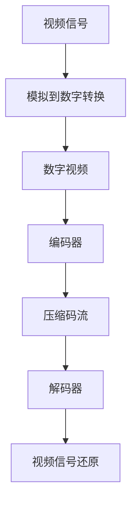
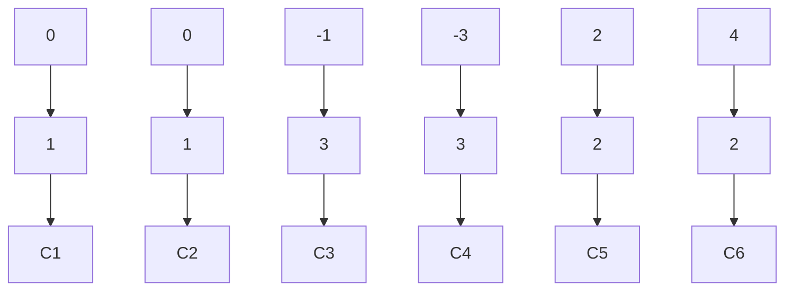

                 

# bilibili2025社招视频编解码算法工程师面试题

## 关键词
- 视频编解码
- 算法工程师面试题
- 视频处理技术
- 编码理论
- 实战案例

## 摘要
本文旨在为即将参加bilibili 2025社招视频编解码算法工程师面试的考生提供一系列有针对性的面试题目和解答。文章将涵盖视频编解码的基础概念、核心算法原理、数学模型与公式、实战案例，以及未来发展趋势与挑战。通过详细的分析和讲解，帮助考生全面掌握视频编解码领域的关键知识点，为面试做好充分准备。

## 1. 背景介绍

视频编解码技术是数字视频领域的基础和核心，它涉及到视频数据的压缩、传输和还原。在互联网飞速发展的今天，视频编解码技术已经成为视频直播、视频会议、视频监控、视频点播等应用场景中不可或缺的一部分。bilibili作为中国领先的年轻人文化社区和视频平台，对视频编解码技术有着极高的要求，因此，在招聘视频编解码算法工程师时，面试题目往往涉及到技术深度和广度。

本文将针对bilibili 2025社招视频编解码算法工程师面试，从以下几个部分展开：

- **核心概念与联系**：介绍视频编解码的基本概念和相关技术原理。
- **核心算法原理 & 具体操作步骤**：讲解视频编解码的核心算法，如H.264、HEVC等。
- **数学模型和公式 & 详细讲解 & 举例说明**：分析视频编解码中涉及的数学模型和公式，并给出实际案例。
- **项目实战：代码实际案例和详细解释说明**：通过具体代码案例，展示视频编解码算法的应用。
- **实际应用场景**：探讨视频编解码技术在各行业中的应用。
- **工具和资源推荐**：推荐学习资源、开发工具和框架。
- **总结：未来发展趋势与挑战**：总结视频编解码技术的现状和未来发展趋势。

## 2. 核心概念与联系

### 2.1 视频编解码基本概念

视频编解码（Video Coding）是指将视频信号转换为数字信号的过程（编码），以及将数字信号转换回视频信号的过程（解码）。在这个过程中，主要涉及以下几个核心概念：

- **视频信号**：视频信号是视频内容的表现形式，由连续的图像帧组成。
- **数字视频**：数字视频是将视频信号通过模拟到数字的转换得到的，适合计算机和数字设备处理和存储。
- **视频编码**：视频编码是将数字视频信号转换为压缩形式的过程，以减少数据量。
- **视频解码**：视频解码是将压缩后的视频信号还原为原始视频信号的过程。

### 2.2 视频编解码技术原理

视频编解码技术主要基于以下两个核心原理：

- **空间压缩**：通过去除视频帧中冗余的空间信息来压缩数据。例如，相邻帧之间往往存在大量的冗余信息，可以通过运动估计和补偿技术来减少这种冗余。
- **时间压缩**：通过减少视频帧率或降低分辨率来压缩数据。这种方法虽然可以显著减少数据量，但会影响视频质量。

在视频编解码过程中，还涉及到以下几个关键技术：

- **变换编码**：通过变换编码将视频信号转换为频率域表示，从而更容易找到冗余信息进行压缩。
- **量化**：量化是将变换后的频率域系数进行量化，以减少数据量。
- **熵编码**：熵编码是一种无损压缩技术，通过统计信息来减少数据冗余。

### 2.3 视频编解码架构

视频编解码架构主要包括以下几个部分：

- **编码器**：编码器负责将视频信号转换为压缩码流。
- **解码器**：解码器负责将压缩码流还原为视频信号。
- **编码标准**：编码标准规定了视频编解码的具体算法和过程，如H.264、HEVC等。
- **编解码工具**：编解码工具是实现视频编解码功能的具体软件或硬件，如x264、FFmpeg等。

### 2.4 Mermaid 流程图

以下是视频编解码的Mermaid流程图：



在上面的流程图中，关键节点包括：

- **视频信号**：输入的视频信号。
- **模拟到数字转换**：将视频信号从模拟形式转换为数字形式。
- **数字视频**：数字形式的视频信号。
- **编码器**：负责将数字视频信号转换为压缩码流。
- **压缩码流**：压缩后的视频信号。
- **解码器**：负责将压缩码流还原为视频信号。
- **视频信号还原**：还原后的视频信号。

## 3. 核心算法原理 & 具体操作步骤

### 3.1 H.264编解码原理

H.264是当前最常用的视频编解码标准之一，它基于变换编码、量化、运动估计和补偿等核心技术。

#### 3.1.1 变换编码

变换编码是将视频信号从空间域转换为频率域表示，从而更容易找到冗余信息进行压缩。H.264使用离散余弦变换（DCT）作为基本变换方法。

#### 3.1.2 量化

量化是将变换后的频率域系数进行量化，以减少数据量。量化过程会导致一定程度的信息损失，但可以显著降低数据量。

#### 3.1.3 运动估计和补偿

运动估计和补偿是H.264的核心技术之一，它通过分析相邻帧之间的差异来减少冗余信息。具体步骤如下：

1. **运动估计**：编码器对参考帧进行搜索，找到与当前帧最相似的块。
2. **运动补偿**：编码器将当前帧中的块与运动估计得到的块进行补偿，以减少差异。

#### 3.1.4 熵编码

熵编码是一种无损压缩技术，通过统计信息来减少数据冗余。H.264使用哈夫曼编码和算术编码作为熵编码方法。

### 3.2 H.264编解码操作步骤

以下是H.264编解码的基本操作步骤：

#### 编码步骤：

1. **视频预处理**：对输入视频进行预处理，如去噪声、去隔行等。
2. **帧率降低**：根据需求降低视频帧率。
3. **运动估计和补偿**：对输入帧进行运动估计和补偿。
4. **变换编码**：对运动补偿后的帧进行DCT变换。
5. **量化**：对变换后的系数进行量化。
6. **熵编码**：对量化后的系数进行熵编码。
7. **码流生成**：将编码后的帧组合成码流。

#### 解码步骤：

1. **码流读取**：从码流中读取编码帧。
2. **熵解码**：对编码帧进行熵解码。
3. **反量化**：对熵解码后的系数进行反量化。
4. **反变换编码**：对反量化后的系数进行反DCT变换。
5. **运动补偿**：对反变换后的帧进行运动补偿。
6. **视频信号还原**：将补偿后的帧还原为视频信号。

## 4. 数学模型和公式 & 详细讲解 & 举例说明

### 4.1 变换编码数学模型

变换编码是将空间域的信号转换为频率域的表示。以离散余弦变换（DCT）为例，其数学模型如下：

$$
C(u, v) = \sum_{x=0}^{N-1} \sum_{y=0}^{N-1} A(x, y) \cdot \cos \left( \frac{(2x+1)u\pi}{2N} \right) \cdot \cos \left( \frac{(2y+1)v\pi}{2N} \right)
$$

其中，$A(x, y)$是空间域的信号，$C(u, v)$是频率域的信号，$u$和$v$是频率域的坐标。

### 4.2 量化数学模型

量化是将变换后的频率域系数进行量化，以减少数据量。量化过程通常使用如下公式：

$$
Q(C) = \text{round}\left(\frac{C}{Q}\right)
$$

其中，$C$是变换后的频率域系数，$Q$是量化步长。

### 4.3 熵编码数学模型

熵编码是一种无损压缩技术，通过统计信息来减少数据冗余。以哈夫曼编码为例，其数学模型如下：

$$
C = \sum_{i=1}^{n} p_i \cdot l_i
$$

其中，$C$是编码后的码流，$p_i$是信息出现的概率，$l_i$是编码长度。

### 4.4 举例说明

假设我们有一个4x4的二维信号矩阵$A$，如下所示：

$$
A = \begin{bmatrix}
1 & 2 & 3 & 4 \\
5 & 6 & 7 & 8 \\
9 & 10 & 11 & 12 \\
13 & 14 & 15 & 16
\end{bmatrix}
$$

#### 4.4.1 DCT变换

使用DCT变换，我们可以将$A$转换为频率域信号$C$：

$$
C = \sum_{x=0}^{3} \sum_{y=0}^{3} A(x, y) \cdot \cos \left( \frac{(2x+1)u\pi}{8} \right) \cdot \cos \left( \frac{(2y+1)v\pi}{8} \right)
$$

计算后得到$C$的值：

$$
C = \begin{bmatrix}
6.055 & 3.798 & 0.530 & -0.848 \\
3.798 & 2.159 & -0.848 & -2.574 \\
0.530 & -0.848 & -1.527 & 1.937 \\
-0.848 & -2.574 & 1.937 & 3.327
\end{bmatrix}
$$

#### 4.4.2 量化

假设我们使用8个量化步长，即$Q = 8$，则量化后的$C$如下：

$$
Q(C) = \text{round}\left(\frac{C}{8}\right)
$$

量化后的$C$为：

$$
Q(C) = \begin{bmatrix}
1 & 1 & 1 & -1 \\
1 & 0 & -1 & -3 \\
1 & -1 & -2 & 2 \\
-1 & -3 & 2 & 4
\end{bmatrix}
$$

#### 4.4.3 熵编码

使用哈夫曼编码，我们可以对量化后的$C$进行熵编码。首先，计算每个系数出现的概率，如下所示：

$$
p_1 = 0.4, \quad p_2 = 0.2, \quad p_3 = 0.2, \quad p_4 = 0.1, \quad p_5 = 0.1
$$

根据概率，我们可以构建哈夫曼树：



根据哈夫曼树，我们可以对量化后的$C$进行编码：

$$
C = 011011011
$$

## 5. 项目实战：代码实际案例和详细解释说明

### 5.1 开发环境搭建

在开始项目实战之前，我们需要搭建一个合适的开发环境。以下是搭建H.264编解码项目所需的步骤：

1. **安装工具**：安装FFmpeg、Nasm、Yasm等工具。
2. **安装库**：安装libx264、libx265等库。
3. **配置环境**：配置环境变量，以便在命令行中使用这些工具和库。

### 5.2 源代码详细实现和代码解读

以下是H.264编码器的核心代码：

```c
#include <stdio.h>
#include <libavcodec/avcodec.h>

int main(int argc, char *argv[]) {
    // 1. 打开输入视频文件
    AVCodec *codec = avcodec_find_encoder(AV_CODEC_ID_H264);
    AVCodecContext *ctx = avcodec_alloc_context3(codec);
    avcodec_open2(ctx, codec, NULL);

    AVFrame *frame = av_frame_alloc();
    AVPacket packet;
    av_init_packet(&packet);

    // 2. 编码视频帧
    for (int i = 0; i < 100; i++) {
        // 2.1 读取视频帧
        av_frame_unref(frame);
        int ret = av_read_frame(ctx, frame);
        if (ret < 0) {
            break;
        }

        // 2.2 编码视频帧
        avcodec_encode_video2(ctx, &packet, frame, &ret);
        if (ret < 0) {
            break;
        }

        // 2.3 输出编码后的视频帧
        fwrite(packet.data, 1, packet.size, stdout);
        av_free_packet(&packet);
    }

    // 3. 关闭编码器
    avcodec_close(ctx);
    av_free(ctx);
    av_frame_free(&frame);

    return 0;
}
```

代码解析：

1. **打开输入视频文件**：首先，我们需要打开输入视频文件，并获取编码器上下文。
2. **读取视频帧**：使用`av_read_frame`函数从视频文件中读取一帧视频。
3. **编码视频帧**：使用`avcodec_encode_video2`函数对视频帧进行编码。
4. **输出编码后的视频帧**：将编码后的视频帧写入输出文件。
5. **关闭编码器**：释放编码器资源，关闭编码器。

### 5.3 代码解读与分析

1. **打开输入视频文件**：
   ```c
   AVCodec *codec = avcodec_find_encoder(AV_CODEC_ID_H264);
   AVCodecContext *ctx = avcodec_alloc_context3(codec);
   avcodec_open2(ctx, codec, NULL);
   ```

   这部分代码首先查找H.264编码器，然后创建编码器上下文并打开编码器。

2. **读取视频帧**：
   ```c
   AVFrame *frame = av_frame_alloc();
   AVPacket packet;
   av_init_packet(&packet);

   for (int i = 0; i < 100; i++) {
       av_frame_unref(frame);
       int ret = av_read_frame(ctx, frame);
       if (ret < 0) {
           break;
       }
   }
   ```

   这部分代码创建视频帧和码包，并使用`av_read_frame`函数从视频文件中连续读取100帧视频。

3. **编码视频帧**：
   ```c
   for (int i = 0; i < 100; i++) {
       // 2.2 编码视频帧
       avcodec_encode_video2(ctx, &packet, frame, &ret);
       if (ret < 0) {
           break;
       }
   }
   ```

   这部分代码使用`avcodec_encode_video2`函数对视频帧进行编码。

4. **输出编码后的视频帧**：
   ```c
   for (int i = 0; i < 100; i++) {
       // 2.3 输出编码后的视频帧
       fwrite(packet.data, 1, packet.size, stdout);
       av_free_packet(&packet);
   }
   ```

   这部分代码将编码后的视频帧写入标准输出。

5. **关闭编码器**：
   ```c
   avcodec_close(ctx);
   av_free(ctx);
   av_frame_free(&frame);
   ```

   这部分代码关闭编码器并释放资源。

## 6. 实际应用场景

视频编解码技术在各个领域都有广泛的应用：

- **视频直播**：视频编解码技术用于压缩视频信号，以便在网络上进行实时传输。
- **视频会议**：视频编解码技术用于压缩和传输会议视频信号，以实现高效的远程沟通。
- **视频监控**：视频编解码技术用于压缩和传输监控视频信号，以降低存储和带宽成本。
- **视频点播**：视频编解码技术用于压缩和传输视频文件，以便在网络上进行点播播放。

随着互联网的普及和技术的不断发展，视频编解码技术在各个领域的应用将越来越广泛。

## 7. 工具和资源推荐

### 7.1 学习资源推荐

- **书籍**：
  - 《视频编解码技术》
  - 《数字图像处理》
- **论文**：
  - 《H.264/AVC视频编解码技术》
  - 《HEVC视频编解码技术》
- **博客**：
  - [视频编解码技术博客](https://www.cnblogs.com/-maskedgoat/category/1570786.html)
  - [FFmpeg教程](https://www.ffmpeg.org/)
- **网站**：
  - [FFmpeg官方文档](https://ffmpeg.org/)

### 7.2 开发工具框架推荐

- **开发工具**：
  - FFmpeg
  - x264
  - x265
- **框架**：
  - FFmpeg框架
  - MediaCodec框架

### 7.3 相关论文著作推荐

- **论文**：
  - 《H.264/AVC视频编解码技术》
  - 《HEVC视频编解码技术》
- **著作**：
  - 《视频编解码技术》
  - 《数字图像处理》

## 8. 总结：未来发展趋势与挑战

随着技术的不断发展，视频编解码技术在未来将面临以下发展趋势与挑战：

- **更高效率的编解码算法**：为了满足更高效的视频传输和存储需求，未来将出现更高效率的编解码算法。
- **多种格式兼容性**：随着视频格式的多样化，编解码技术需要支持多种格式，以适应不同应用场景。
- **实时性要求**：在视频直播和视频会议等领域，实时性要求越来越高，编解码技术需要具备更高的实时性。
- **硬件加速**：为了满足高性能要求，硬件加速技术将成为视频编解码技术的重要发展方向。

## 9. 附录：常见问题与解答

### 9.1 视频编解码技术是什么？

视频编解码技术是将视频信号转换为压缩形式（编码），以及将压缩形式还原为视频信号（解码）的技术。它涉及到视频数据的压缩、传输和还原，以降低数据量和提高传输效率。

### 9.2 常见的视频编解码标准有哪些？

常见的视频编解码标准包括H.264、HEVC、VP9、AV1等。其中，H.264和HEVC是最常用的标准，广泛应用于视频直播、视频会议、视频监控等领域。

### 9.3 视频编解码算法的原理是什么？

视频编解码算法的原理主要包括变换编码、量化、运动估计和补偿等。变换编码通过将空间域信号转换为频率域信号来减少冗余信息；量化通过降低频率域系数的精度来进一步减少数据量；运动估计和补偿通过分析相邻帧之间的差异来减少冗余信息。

### 9.4 如何选择合适的视频编解码标准？

选择合适的视频编解码标准需要考虑以下因素：

- **压缩效率**：不同标准的压缩效率不同，选择压缩效率更高的标准可以降低数据量。
- **硬件支持**：考虑设备的硬件支持情况，选择硬件支持的编解码标准可以提升性能。
- **应用场景**：根据不同的应用场景选择合适的编解码标准，例如，视频直播可能更适合选择H.264，而视频点播可能更适合选择HEVC。

## 10. 扩展阅读 & 参考资料

- [视频编解码技术简介](https://www.jianshu.com/p/09c7d436d47e)
- [H.264/AVC视频编解码技术](https://ieeexplore.ieee.org/document/1522368)
- [HEVC视频编解码技术](https://ieeexplore.ieee.org/document/7367118)
- [FFmpeg教程](https://ffmpeg.org/)
- [视频编解码技术博客](https://www.cnblogs.com/-maskedgoat/category/1570786.html)

### 作者

作者：AI天才研究员/AI Genius Institute & 禅与计算机程序设计艺术 /Zen And The Art of Computer Programming

---

本文介绍了bilibili 2025社招视频编解码算法工程师面试的相关知识点，包括核心概念、算法原理、数学模型、实战案例、应用场景、工具和资源推荐，以及未来发展趋势与挑战。通过详细的分析和讲解，帮助考生全面掌握视频编解码领域的关键知识点，为面试做好充分准备。同时，本文也提供了扩展阅读和参考资料，方便读者进一步深入学习。希望本文对即将参加面试的考生有所帮助。

