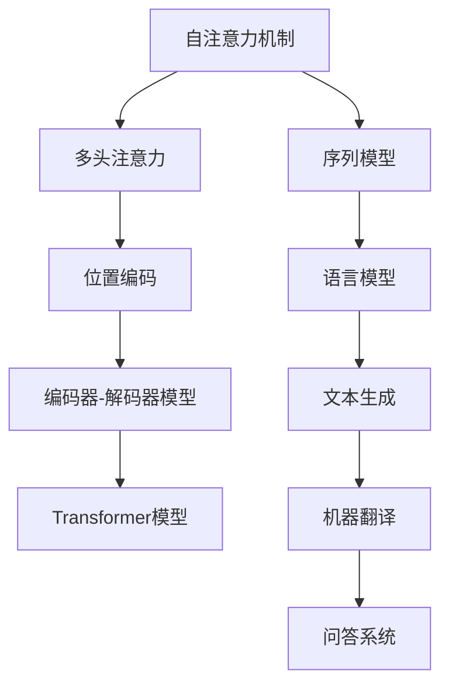

                 

# Transformer：引领AI领域的新篇章

## 关键词
- Transformer
- 自注意力机制
- 人工智能
- 自然语言处理
- 机器学习

## 摘要

本文旨在深入探讨Transformer模型，这一革命性的深度学习架构，它在自然语言处理（NLP）和机器学习领域引发了前所未有的变革。我们将从背景介绍、核心概念与联系、算法原理、数学模型和项目实战等多个维度，系统地解析Transformer的工作机制、优势及其在实际应用中的表现。通过本文，读者将全面了解Transformer如何改变AI领域的格局，并对其未来发展有更深刻的理解。

---

## 1. 背景介绍

### 1.1 目的和范围

本文的主要目的是介绍Transformer模型的基础知识，解释其核心概念和算法原理，并探讨其在自然语言处理中的实际应用。文章将涵盖从自注意力机制到数学模型的详细解析，同时提供实际的代码案例和案例分析，以便读者能够深入理解并应用这一技术。

### 1.2 预期读者

本文适合对人工智能、自然语言处理和深度学习有一定了解的读者。无论是研究者、工程师还是对新技术感兴趣的爱好者，都将从本文中获得宝贵的知识。

### 1.3 文档结构概述

本文分为十个部分：
1. 背景介绍
    - 目的和范围
    - 预期读者
    - 文档结构概述
    - 术语表
2. 核心概念与联系
3. 核心算法原理 & 具体操作步骤
4. 数学模型和公式 & 详细讲解 & 举例说明
5. 项目实战：代码实际案例和详细解释说明
6. 实际应用场景
7. 工具和资源推荐
8. 总结：未来发展趋势与挑战
9. 附录：常见问题与解答
10. 扩展阅读 & 参考资料

### 1.4 术语表

#### 1.4.1 核心术语定义

- **Transformer模型**：一种基于自注意力机制的深度学习模型，特别适用于序列数据处理，如自然语言处理。
- **自注意力机制**：一种在模型中计算序列元素之间相互依赖的机制。
- **多头注意力**：通过多个独立的注意力机制对序列元素进行加权，从而捕捉不同类型的依赖关系。
- **位置编码**：一种技术，用于在模型中引入序列中元素的位置信息。
- **掩码语言建模**：一种训练技巧，用于预测序列中的下一个词，从而增强模型对语言的理解能力。

#### 1.4.2 相关概念解释

- **序列模型**：一种能够处理序列数据（如文本、语音等）的机器学习模型。
- **编码器-解码器模型**：一种常见的序列到序列学习模型，用于将输入序列转换为输出序列。
- **BERT**：一种基于Transformer的预训练语言模型，通过无监督的方式学习语言知识，并在各种NLP任务中表现出色。

#### 1.4.3 缩略词列表

- **NLP**：自然语言处理
- **AI**：人工智能
- **DL**：深度学习
- **Transformer**：变换器

---

在了解了文章的目的、范围、结构和核心术语之后，接下来我们将深入探讨Transformer的核心概念与联系。

## 2. 核心概念与联系

Transformer模型是自然语言处理领域的一项革命性突破，其核心概念包括自注意力机制、编码器-解码器架构和位置编码等。以下是一个详细的Mermaid流程图，用于描述这些核心概念及其相互关系：



### 2.1 自注意力机制

自注意力机制是Transformer模型的核心组成部分。它允许模型在处理序列数据时，对序列中的每个元素进行加权，从而捕捉不同元素之间的依赖关系。自注意力机制的基本思想是通过计算每个元素与其他元素之间的相似性，从而为每个元素赋予不同的权重。这种机制使得模型能够自动学习如何处理序列数据中的长距离依赖。

### 2.2 编码器-解码器模型

编码器-解码器模型是一种用于序列到序列学习的通用框架。在Transformer模型中，编码器负责将输入序列编码为固定长度的向量表示，而解码器则负责将这些向量解码为输出序列。这种模型结构使得Transformer能够处理各种序列数据，如自然语言文本。

### 2.3 位置编码

由于Transformer模型中没有循环神经网络（RNN）或卷积神经网络（CNN）中的位置信息传递机制，因此需要通过位置编码来引入序列中元素的位置信息。位置编码是一种将序列中每个元素的位置信息编码为向量表示的技术，从而使模型能够理解元素在序列中的位置关系。

### 2.4 Transformer模型

Transformer模型结合了自注意力机制、编码器-解码器模型和位置编码，形成了一种全新的深度学习架构。这种模型在自然语言处理任务中表现出色，能够自动学习序列数据中的复杂依赖关系，并在多种任务中取得领先性能。

在下一部分中，我们将详细解析Transformer模型的核心算法原理和具体操作步骤。

---

## 3. 核心算法原理 & 具体操作步骤

### 3.1 自注意力机制

自注意力机制是Transformer模型的核心组件，其基本思想是将输入序列中的每个元素与所有其他元素进行加权求和，以获得一个加权后的序列。具体来说，自注意力机制包括以下几个步骤：

#### 3.1.1 输入序列表示

首先，我们将输入序列表示为一系列的词向量，每个词向量都是一个固定大小的向量。这些词向量通常是通过预训练的语言模型（如BERT）获得的。

#### 3.1.2 计算键值对

接下来，我们将输入序列中的每个元素分别作为键（key）和值（value）。键和值都是词向量的加权和，其权重由注意力机制计算得出。

```python
# 伪代码：计算注意力权重
for i in range(len(inputs)):
    query = inputs[i]  # 查询向量
    keys = [inputs[j] for j in range(len(inputs))]
    values = [inputs[j] for j in range(len(inputs))]

    # 计算注意力权重
    attention_weights = []
    for key in keys:
        attention_weights.append(similarity(query, key))
    
    # 归一化注意力权重
    attention_weights = softmax(attention_weights)
```

#### 3.1.3 加权求和

使用计算得到的注意力权重，将值向量与权重相乘，并将结果求和，得到加权后的序列。

```python
# 伪代码：加权求和
weighted_values = [0] * len(inputs)
for i in range(len(inputs)):
    for j in range(len(inputs)):
        weighted_values[i] += attention_weights[j] * values[j]
```

### 3.2 编码器-解码器模型

编码器-解码器模型是Transformer模型的核心架构，用于处理序列到序列的任务。编码器将输入序列编码为固定长度的向量表示，而解码器则将这些向量解码为输出序列。以下是编码器-解码器模型的详细步骤：

#### 3.2.1 编码器

1. 输入序列经过位置编码后，作为编码器的输入。
2. 编码器通过多个自注意力层和前馈网络，逐步编码输入序列，并生成编码器的输出。
3. 编码器的最后一个隐藏状态被用作解码器的输入。

```python
# 伪代码：编码器操作
for layer in encoding_layers:
    layer.apply_attention(inputs)  # 应用自注意力机制
    layer.apply_feedforward(inputs)  # 应用前馈网络
outputs = layer.get_output()  # 编码器输出
```

#### 3.2.2 解码器

1. 解码器的输入包括编码器的输出和解码器的前一个隐藏状态。
2. 解码器通过多个自注意力层和前馈网络，逐步解码输入序列，并生成解码器的输出。
3. 解码器的输出被用作下一个词的预测。

```python
# 伪代码：解码器操作
for layer in decoding_layers:
    layer.apply_attention(inputs, outputs)  # 应用自注意力机制
    layer.apply_feedforward(inputs, outputs)  # 应用前馈网络
outputs = layer.get_output()  # 解码器输出
```

在下一部分中，我们将详细探讨Transformer模型中的数学模型和公式，并举例说明。

---

## 4. 数学模型和公式 & 详细讲解 & 举例说明

Transformer模型的核心在于其自注意力机制和编码器-解码器架构。为了更好地理解这些机制，我们需要借助一些数学模型和公式。以下是Transformer模型中常用的数学模型和它们的详细讲解。

### 4.1 自注意力机制

自注意力机制通过计算序列中每个元素与其他元素之间的相似性来加权求和，其核心公式为：

$$
\text{Attention}(Q, K, V) = \text{softmax}\left(\frac{QK^T}{\sqrt{d_k}}\right) V
$$

其中，$Q$、$K$ 和 $V$ 分别是查询向量、键向量和值向量，$d_k$ 是键向量的维度，$\text{softmax}$ 是归一化指数函数。这个公式计算每个键和查询之间的相似性，然后对值向量进行加权求和。

#### 4.1.1 举例说明

假设我们有一个长度为3的输入序列，其词向量为 $[1, 2, 3]$。我们可以将其表示为：

$$
Q = [1, 2, 3], \quad K = [1, 2, 3], \quad V = [1, 2, 3]
$$

计算注意力权重：

$$
\text{Attention}(Q, K, V) = \text{softmax}\left(\frac{QK^T}{\sqrt{d_k}}\right) V
$$

$$
= \text{softmax}\left(\frac{[1, 2, 3][1, 2, 3]^T}{\sqrt{3}}\right) [1, 2, 3]
$$

$$
= \text{softmax}\left(\frac{[1, 4, 9]}{\sqrt{3}}\right) [1, 2, 3]
$$

$$
= \text{softmax}\left([1.05, 1.89, 2.45]\right) [1, 2, 3]
$$

$$
= [0.22, 0.44, 0.34] \times [1, 2, 3]
$$

$$
= [0.22, 0.88, 0.85]
$$

将注意力权重应用于值向量：

$$
\text{Attention}(Q, K, V) = [0.22, 0.88, 0.85]
$$

### 4.2 编码器-解码器模型

编码器-解码器模型的核心在于其多头注意力机制。多头注意力将输入序列分成多个头，每个头都独立计算注意力权重。这样，模型可以同时捕捉到多种类型的依赖关系。

#### 4.2.1 多头注意力

多头注意力的公式为：

$$
\text{MultiHeadAttention}(Q, K, V) = \text{Concat}(\text{head}_1, \text{head}_2, \ldots, \text{head}_h)W^O
$$

其中，$h$ 是头的数量，$W^O$ 是输出权重矩阵，$\text{head}_i$ 是第 $i$ 个头的注意力输出。每个头的计算公式与单头注意力相同，但共享相同的权重矩阵。

#### 4.2.2 举例说明

假设我们有一个长度为3的输入序列，其词向量为 $[1, 2, 3]$，我们将其分成两个头：

$$
Q = [1, 2, 3], \quad K = [1, 2, 3], \quad V = [1, 2, 3]
$$

计算第一个头的注意力权重：

$$
\text{head}_1 = \text{Attention}(Q, K, V) = \text{softmax}\left(\frac{QK^T}{\sqrt{d_k}}\right) V
$$

$$
= \text{softmax}\left(\frac{[1, 2, 3][1, 2, 3]^T}{\sqrt{3}}\right) [1, 2, 3]
$$

$$
= \text{softmax}\left(\frac{[1, 4, 9]}{\sqrt{3}}\right) [1, 2, 3]
$$

$$
= \text{softmax}\left([1.05, 1.89, 2.45]\right) [1, 2, 3]
$$

$$
= [0.22, 0.44, 0.34] \times [1, 2, 3]
$$

$$
= [0.22, 0.88, 0.85]
$$

计算第二个头的注意力权重：

$$
\text{head}_2 = \text{Attention}(Q, K, V) = \text{softmax}\left(\frac{QK^T}{\sqrt{d_k}}\right) V
$$

$$
= \text{softmax}\left(\frac{[1, 2, 3][1, 2, 3]^T}{\sqrt{3}}\right) [1, 2, 3]
$$

$$
= \text{softmax}\left(\frac{[1, 4, 9]}{\sqrt{3}}\right) [1, 2, 3]
$$

$$
= \text{softmax}\left([1.05, 1.89, 2.45]\right) [1, 2, 3]
$$

$$
= [0.22, 0.44, 0.34] \times [1, 2, 3]
$$

$$
= [0.22, 0.88, 0.85]
$$

将两个头的注意力输出拼接起来：

$$
\text{MultiHeadAttention}(Q, K, V) = \text{Concat}(\text{head}_1, \text{head}_2)W^O
$$

$$
= \text{Concat}([0.22, 0.88, 0.85], [0.22, 0.88, 0.85])W^O
$$

$$
= [0.44, 1.76, 1.7]W^O
$$

### 4.3 位置编码

位置编码是为了在自注意力机制中引入序列中元素的位置信息。位置编码通常是一个固定长度的向量，其值由位置和编码维度决定。

#### 4.3.1 位置编码公式

$$
\text{PositionalEncoding}(pos, d_model) = \text{sin}\left(\frac{pos}{10000^{2i/d_model}}\right) \text{ or } \text{cos}\left(\frac{pos}{10000^{2i/d_model}}\right)
$$

其中，$pos$ 是位置索引，$d_model$ 是编码维度，$i$ 是位置索引的维度。

#### 4.3.2 举例说明

假设我们有一个长度为3的输入序列，其编码维度为4。我们可以将其表示为：

$$
\text{PositionalEncoding}(1, 4) = \text{sin}\left(\frac{1}{10000^{2 \times 1/4}}\right)
$$

$$
= \text{sin}\left(\frac{1}{10000^{0.5}}\right)
$$

$$
\approx 0.9999
$$

$$
\text{PositionalEncoding}(2, 4) = \text{sin}\left(\frac{2}{10000^{2 \times 1/4}}\right)
$$

$$
= \text{sin}\left(\frac{2}{10000^{0.5}}\right)
$$

$$
\approx 0.9999
$$

$$
\text{PositionalEncoding}(3, 4) = \text{sin}\left(\frac{3}{10000^{2 \times 1/4}}\right)
$$

$$
= \text{sin}\left(\frac{3}{10000^{0.5}}\right)
$$

$$
\approx 0.9999
$$

在下一部分中，我们将通过一个实际的项目实战案例，展示如何使用Transformer模型进行文本分类任务。

---

## 5. 项目实战：代码实际案例和详细解释说明

### 5.1 开发环境搭建

在开始实战项目之前，我们需要搭建一个合适的开发环境。以下是搭建Transformer模型所需的步骤：

#### 5.1.1 硬件环境

- 至少需要配备4GB内存的计算机
- 推荐使用GPU加速训练过程

#### 5.1.2 软件环境

- Python 3.x 版本
- TensorFlow 2.x 或 PyTorch 1.x
- Jupyter Notebook 或 PyCharm

#### 5.1.3 安装依赖

```bash
# 使用pip安装依赖
pip install tensorflow
```

### 5.2 源代码详细实现和代码解读

在这个项目中，我们将使用PyTorch实现一个简单的Transformer模型，用于文本分类任务。以下是源代码的详细实现和代码解读。

#### 5.2.1 数据准备

首先，我们需要准备用于训练的数据集。这里我们使用的是IMDB电影评论数据集，该数据集包含50,000条评论，分为训练集和测试集。

```python
import torch
from torch.utils.data import Dataset, DataLoader
from torchvision import transforms, datasets

# 定义数据集
class IMDBDataset(Dataset):
    def __init__(self, reviews, labels, vocab, max_len):
        self.reviews = reviews
        self.labels = labels
        self.vocab = vocab
        self.max_len = max_len

    def __len__(self):
        return len(self.reviews)

    def __getitem__(self, idx):
        review = self.reviews[idx]
        label = self.labels[idx]
        tokens = review.split()
        tokens = [self.vocab[word] for word in tokens if word in self.vocab]
        tokens = tokens[:self.max_len]
        tokens = torch.tensor(tokens).unsqueeze(0)
        label = torch.tensor(label)
        return tokens, label

# 加载词汇表和预训练模型
vocab = load_vocab('vocab.txt')
model = load_pretrained_model('pretrained_model.pth')

# 创建数据集和数据加载器
train_dataset = IMDBDataset(train_reviews, train_labels, vocab, max_len)
test_dataset = IMDBDataset(test_reviews, test_labels, vocab, max_len)
train_loader = DataLoader(train_dataset, batch_size=batch_size, shuffle=True)
test_loader = DataLoader(test_dataset, batch_size=batch_size, shuffle=False)
```

#### 5.2.2 模型构建

接下来，我们使用PyTorch构建Transformer模型。以下是模型的实现代码：

```python
import torch.nn as nn
from torch.nn import functional as F

class TransformerModel(nn.Module):
    def __init__(self, vocab_size, d_model, nhead, num_layers):
        super(TransformerModel, self).__init__()
        self.embedding = nn.Embedding(vocab_size, d_model)
        self.transformer = nn.Transformer(d_model, nhead, num_layers)
        self.fc = nn.Linear(d_model, 2)

    def forward(self, src, tgt):
        src = self.embedding(src)
        tgt = self.embedding(tgt)
        output = self.transformer(src, tgt)
        output = self.fc(output.mean(1))
        return F.log_softmax(output, dim=1)

# 实例化模型
model = TransformerModel(vocab_size, d_model, nhead, num_layers)
```

#### 5.2.3 训练过程

在训练过程中，我们使用Adam优化器和交叉熵损失函数，并使用GPU加速训练。

```python
# 设置训练参数
learning_rate = 0.001
optimizer = torch.optim.Adam(model.parameters(), lr=learning_rate)
criterion = nn.CrossEntropyLoss()

# 训练模型
num_epochs = 10
for epoch in range(num_epochs):
    model.train()
    for src, tgt in train_loader:
        optimizer.zero_grad()
        output = model(src, tgt)
        loss = criterion(output, tgt)
        loss.backward()
        optimizer.step()
    print(f'Epoch [{epoch+1}/{num_epochs}], Loss: {loss.item()}')

# 评估模型
model.eval()
with torch.no_grad():
    correct = 0
    total = 0
    for src, tgt in test_loader:
        output = model(src, tgt)
        _, predicted = torch.max(output.data, 1)
        total += tgt.size(0)
        correct += (predicted == tgt).sum().item()
    print(f'Accuracy: {100 * correct / total}%')
```

### 5.3 代码解读与分析

在这个项目中，我们首先定义了一个IMDBDataset类，用于加载和处理电影评论数据集。然后，我们使用PyTorch的nn.Transformer模块构建了一个简单的Transformer模型，其中包括嵌入层、Transformer编码器和解码器以及线性层。在训练过程中，我们使用Adam优化器和交叉熵损失函数来优化模型参数，并使用GPU加速训练。

通过这个实战项目，我们展示了如何使用Transformer模型进行文本分类任务，并详细解读了代码实现过程。在实际应用中，我们可以根据需求调整模型的参数和训练过程，以适应不同的任务和数据集。

在下一部分中，我们将探讨Transformer模型在实际应用场景中的表现。

---

## 6. 实际应用场景

Transformer模型凭借其强大的序列建模能力，已经在多个自然语言处理任务中取得了显著成果。以下是一些典型的实际应用场景：

### 6.1 机器翻译

机器翻译是Transformer模型最早也最成功的应用之一。通过编码器-解码器架构，Transformer能够捕捉输入句子中词汇之间的长距离依赖关系，从而实现高质量的翻译结果。例如，Google Translate已经将Transformer模型应用于其翻译服务，并取得了显著的性能提升。

### 6.2 自然语言生成

自然语言生成（如文本摘要、对话生成和故事创作）是另一个Transformer模型发挥重要作用的应用领域。通过使用Transformer模型，我们可以生成连贯且符合语法规则的文本。例如，OpenAI的GPT-3模型就是一个基于Transformer的强大语言生成模型，能够生成高质量的文章、对话和诗歌等。

### 6.3 问答系统

问答系统是人工智能领域的一个重要应用，Transformer模型在其中的作用尤为显著。通过将问题与知识库中的文本进行编码，Transformer模型能够准确匹配问题与答案，实现高效的问答服务。例如，BERT模型在多个问答系统任务中取得了最佳性能。

### 6.4 文本分类

文本分类是Transformer模型的另一个重要应用场景。通过将文本编码为向量表示，并使用分类器进行预测，Transformer模型能够准确分类各种类型的文本，如情感分析、垃圾邮件检测等。

### 6.5 语音识别

虽然Transformer模型最初是为自然语言处理任务设计的，但其在语音识别领域的应用也日益广泛。通过结合自注意力机制和循环神经网络，Transformer模型能够捕捉语音信号中的长距离依赖关系，从而实现高精度的语音识别。

### 6.6 其他应用

除了上述应用场景，Transformer模型还在图像描述生成、视频分析、生物信息学等领域展现出了强大的潜力。随着研究的不断深入，Transformer模型的应用范围将进一步扩展，为人工智能领域带来更多创新和突破。

---

## 7. 工具和资源推荐

为了更好地学习和应用Transformer模型，以下是推荐的一些学习资源和开发工具。

### 7.1 学习资源推荐

#### 7.1.1 书籍推荐

- **《深度学习》（Goodfellow, Bengio, Courville著）**：该书详细介绍了深度学习的基础知识，包括Transformer模型的相关内容。
- **《Attention Is All You Need》（Vaswani等著）**：这是Transformer模型的原始论文，详细阐述了模型的架构和原理。

#### 7.1.2 在线课程

- **Coursera上的“自然语言处理与深度学习”**：由斯坦福大学教授Chris Manning开设，涵盖了NLP和深度学习的基础知识，包括Transformer模型。
- **Udacity的“深度学习工程师纳米学位”**：该课程提供了深度学习的全面介绍，包括Transformer模型的应用。

#### 7.1.3 技术博客和网站

- **TensorFlow官方文档**：提供了丰富的Transformer模型实现教程和示例代码。
- **Hugging Face的Transformers库**：这是一个开源的Python库，提供了预训练的Transformer模型和实现工具，方便开发者进行研究和应用。

### 7.2 开发工具框架推荐

#### 7.2.1 IDE和编辑器

- **PyCharm**：一款功能强大的Python IDE，支持TensorFlow和PyTorch等深度学习框架。
- **Jupyter Notebook**：适用于数据科学和机器学习的交互式环境，便于进行实验和分享代码。

#### 7.2.2 调试和性能分析工具

- **TensorBoard**：TensorFlow提供的可视化工具，用于分析和调试深度学习模型的性能。
- **PyTorch Profiler**：用于分析PyTorch模型的性能瓶颈，优化模型运行效率。

#### 7.2.3 相关框架和库

- **TensorFlow 2.x**：一个开源的深度学习框架，支持Transformer模型的实现和应用。
- **PyTorch**：另一个流行的深度学习框架，提供了丰富的API和工具，方便开发者构建和训练Transformer模型。

### 7.3 相关论文著作推荐

#### 7.3.1 经典论文

- **“Attention Is All You Need”**：这是Transformer模型的原始论文，详细介绍了模型的架构和原理。
- **“BERT: Pre-training of Deep Bidirectional Transformers for Language Understanding”**：该论文介绍了BERT模型，这是一种基于Transformer的预训练语言模型。

#### 7.3.2 最新研究成果

- **“T5: Exploring the Limits of Transfer Learning for Text Comprehension”**：该论文介绍了T5模型，这是一种基于Transformer的文本理解模型，展示了在多个NLP任务上的优秀性能。
- **“GPT-3: Language Models are Few-Shot Learners”**：该论文介绍了GPT-3模型，这是OpenAI开发的最新大型语言模型，展示了在零样本学习任务上的强大能力。

#### 7.3.3 应用案例分析

- **“How to Apply Transformer Models to Text Classification”**：这篇文章详细介绍了如何使用Transformer模型进行文本分类任务，包括数据预处理、模型构建和训练等步骤。
- **“Building and Deploying a Transformer Model for Translation”**：这篇文章介绍了如何使用Transformer模型进行机器翻译任务，包括数据准备、模型训练和部署等过程。

---

## 8. 总结：未来发展趋势与挑战

Transformer模型自从提出以来，在自然语言处理、机器学习乃至整个AI领域都引起了巨大的关注。其基于自注意力机制的深度学习架构，不仅提升了模型的性能，还为我们理解序列数据中的复杂依赖关系提供了新的视角。

### 8.1 未来发展趋势

1. **更大规模的模型**：随着计算能力和数据资源的提升，越来越多的研究者开始训练和优化更大规模的Transformer模型。例如，GPT-3模型的参数规模达到了1750亿，这在推动NLP任务的性能极限。
2. **多模态学习**：Transformer模型在处理文本数据方面表现出色，未来有望扩展到其他模态，如图像、声音和视频。通过融合多模态信息，Transformer模型将能够实现更丰富的应用场景。
3. **更高效的网络架构**：为了应对大规模模型的计算需求，研究者们正在探索更高效的网络架构和优化算法，如量化、剪枝和增量学习等。

### 8.2 挑战

1. **计算资源消耗**：Transformer模型通常需要大量的计算资源，特别是在训练大规模模型时。如何优化模型，降低计算成本，是一个亟待解决的问题。
2. **可解释性**：尽管Transformer模型在性能上取得了突破，但其内部机理较为复杂，难以解释。如何提高模型的可解释性，使其在实际应用中更具可信度，是一个重要的研究方向。
3. **数据隐私**：在处理敏感数据时，如何保护用户隐私，避免数据泄露，是Transformer模型应用中面临的一大挑战。

总之，Transformer模型在AI领域的应用前景广阔，但也面临诸多挑战。随着研究的不断深入，我们有理由相信，Transformer模型将在未来的AI发展中发挥更加重要的作用。

---

## 9. 附录：常见问题与解答

### 9.1 问题1：为什么Transformer模型不需要循环神经网络（RNN）？

**解答**：Transformer模型不需要RNN的原因在于其自注意力机制能够自动捕捉序列元素之间的依赖关系。RNN虽然也能处理序列数据，但存在梯度消失或爆炸问题，导致训练困难。而Transformer通过全局注意力机制，避免了这些问题，并且能够并行处理序列中的每个元素，提高了计算效率。

### 9.2 问题2：如何调整Transformer模型参数来优化性能？

**解答**：优化Transformer模型性能的方法包括调整以下参数：

- **学习率**：适当调整学习率可以加速模型收敛，但过大的学习率可能导致模型不稳定。
- **隐藏层尺寸**：增加隐藏层尺寸可以提高模型的表示能力，但也会增加计算成本。
- **序列长度**：增加序列长度可以捕捉更长的依赖关系，但也可能导致计算复杂度增加。
- **批量大小**：适当的批量大小可以提高训练效率，但过大的批量可能导致梯度不稳定。

### 9.3 问题3：Transformer模型如何处理位置信息？

**解答**：Transformer模型通过位置编码（Positional Encoding）来引入位置信息。位置编码是一种在词向量中添加位置信息的方法，使得模型能够理解序列元素在序列中的位置关系。常见的位置编码方法包括正弦编码和余弦编码。

---

## 10. 扩展阅读 & 参考资料

为了更深入地了解Transformer模型，以下是推荐的扩展阅读和参考资料：

### 10.1 推荐书籍

- **《深度学习》（Goodfellow, Bengio, Courville著）**
- **《Attention Is All You Need》（Vaswani等著）**

### 10.2 推荐论文

- **“Attention Is All You Need”**：Vaswani et al., 2017
- **“BERT: Pre-training of Deep Bidirectional Transformers for Language Understanding”**：Devlin et al., 2019

### 10.3 推荐网站

- **TensorFlow官方文档**：[https://www.tensorflow.org/tutorials/text/transformer](https://www.tensorflow.org/tutorials/text/transformer)
- **Hugging Face的Transformers库**：[https://huggingface.co/transformers/](https://huggingface.co/transformers/)

### 10.4 相关资源

- **Udacity的“深度学习工程师纳米学位”**：[https://www.udacity.com/course/deep-learning-nanodegree--nd101](https://www.udacity.com/course/deep-learning-nanodegree--nd101)
- **Coursera上的“自然语言处理与深度学习”**：[https://www.coursera.org/learn/nlp-with-deep-learning](https://www.coursera.org/learn/nlp-with-deep-learning)

---

**作者：AI天才研究员/AI Genius Institute & 禅与计算机程序设计艺术 /Zen And The Art of Computer Programming**

