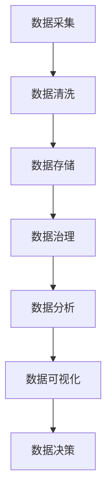

                 

# 【AI大数据计算原理与代码实例讲解】数据治理

## 摘要

本文旨在深入探讨AI大数据计算原理及其在数据治理中的应用。通过逐步分析核心概念、算法原理、数学模型以及实际代码实例，本文将帮助读者全面理解数据治理的重要性，以及如何通过AI技术提升数据治理效率。文章还将介绍相关工具和资源，并展望未来数据治理技术的发展趋势与挑战。

## 1. 背景介绍

在信息化飞速发展的今天，数据已成为企业的重要资产。然而，随着数据量的爆炸性增长，如何有效地管理和利用这些数据成为了一个巨大的挑战。数据治理（Data Governance）作为一种系统性的方法，旨在确保数据的质量、一致性、安全性和合规性，从而最大化数据的价值。AI技术的引入，使得数据治理变得更加智能化和高效。

数据治理不仅仅是一个技术问题，更是一个组织文化和管理体系的问题。它涉及到数据策略的制定、数据标准的建立、数据质量的监控、数据安全和隐私的保护等多个方面。在AI大数据时代，数据治理的重要性愈加凸显，其不仅关系到企业的核心竞争力，也直接影响到企业的合规运营和可持续发展。

## 2. 核心概念与联系

### 数据治理核心概念

- **数据策略**：数据治理的首要任务是制定数据策略，明确数据管理的目标、范围和优先级。
- **数据标准**：数据标准是数据治理的基石，包括数据质量标准、数据分类标准、数据命名标准等。
- **数据质量**：数据质量是数据治理的核心关注点，包括准确性、完整性、一致性、及时性、可靠性等方面。
- **数据安全**：数据安全涉及数据访问控制、数据加密、数据备份与恢复等多个方面，以防止数据泄露和滥用。
- **数据隐私**：数据隐私保护旨在确保个人和敏感信息的隐私不被泄露，遵守相关法律法规。

### AI在大数据计算中的应用

- **机器学习**：通过训练模型来自动发现数据中的模式和规律，用于数据分类、预测和聚类等。
- **深度学习**：深度学习模型在图像识别、语音识别等领域有广泛应用，能够处理大量复杂的数据。
- **数据挖掘**：数据挖掘技术用于从大量数据中提取有价值的信息和知识。
- **自然语言处理**：自然语言处理技术用于文本数据的理解和分析，包括情感分析、文本分类等。

### Mermaid 流程图



## 3. 核心算法原理 & 具体操作步骤

### 数据清洗

数据清洗是数据治理的第一步，其核心任务是去除数据中的噪声、修复错误和填充缺失值。

- **噪声去除**：使用统计方法或规则来识别和去除噪声数据。
- **错误修复**：通过比较多个数据源来纠正错误数据。
- **缺失值填充**：使用均值、中值或回归模型来填充缺失值。

### 数据分类

数据分类是将数据按照特定的标准或模式进行分组的过程。常用的算法包括K-means、决策树和神经网络等。

- **K-means算法**：通过迭代过程将数据点划分为K个簇。
- **决策树算法**：根据特征值将数据划分为不同的分支。
- **神经网络算法**：通过多层神经网络对数据进行分类。

### 数据预测

数据预测是基于历史数据对未来进行预测，常用的算法包括线性回归、逻辑回归和时间序列分析等。

- **线性回归**：通过建立线性模型来预测连续值。
- **逻辑回归**：通过建立逻辑模型来预测离散值。
- **时间序列分析**：通过分析时间序列数据来预测未来的趋势。

### 数据分析

数据分析是对数据进行分析和挖掘，以提取有价值的信息和知识。常用的工具包括Python、R和SQL等。

- **Python**：Python是一种通用编程语言，具有丰富的数据分析库，如NumPy、Pandas和Scikit-learn等。
- **R**：R是一种专门用于统计分析和数据可视化的语言。
- **SQL**：SQL是一种用于数据库查询的语言，可以用于数据分析和数据治理。

### 数据可视化

数据可视化是将数据以图形或图表的形式展示出来，以帮助人们更好地理解和分析数据。常用的工具包括Matplotlib、Seaborn和Plotly等。

- **Matplotlib**：Matplotlib是一个用于绘制2D图表的Python库。
- **Seaborn**：Seaborn是一个基于Matplotlib的高级可视化库。
- **Plotly**：Plotly是一个支持多种图表和数据交互的Python库。

## 4. 数学模型和公式 & 详细讲解 & 举例说明

### 数据清洗数学模型

$$
\text{清洗后的数据} = \text{原始数据} \cup \text{噪声去除} \cup \text{错误修复} \cup \text{缺失值填充}
$$

### 数据分类数学模型

#### K-means算法

$$
\text{簇中心} = \frac{1}{N}\sum_{i=1}^{N} x_i
$$

#### 决策树算法

$$
\text{决策树} = \text{递归划分数据} \cup \text{计算熵和信息增益}
$$

### 数据预测数学模型

#### 线性回归

$$
y = \beta_0 + \beta_1x
$$

#### 逻辑回归

$$
\text{概率} = \frac{1}{1 + e^{-(\beta_0 + \beta_1x)}}
$$

### 数据分析数学模型

#### 时间序列分析

$$
\text{预测值} = \text{历史平均值} + \text{趋势项} + \text{季节性项}
$$

### 数据可视化数学模型

#### 柱状图

$$
\text{高度} = \text{频数} \times \text{单位高度}
$$

#### 折线图

$$
\text{斜率} = \frac{\text{纵坐标差}}{\text{横坐标差}}
$$

### 举例说明

#### 数据清洗

假设有一份数据集，其中包含噪声数据、错误数据和缺失值。通过数据清洗，可以得到一个干净的数据集。

#### 数据分类

使用K-means算法对数据集进行分类，可以得到K个簇的中心点，从而将数据划分为不同的类别。

#### 数据预测

使用线性回归模型对数据集进行预测，可以得到一个线性模型，用于预测未来数据。

#### 数据分析

使用时间序列分析模型对数据集进行分析，可以得到一个时间序列预测模型，用于预测未来的数据趋势。

#### 数据可视化

使用柱状图和折线图对数据集进行可视化，可以直观地展示数据的分布和趋势。

## 5. 项目实战：代码实际案例和详细解释说明

### 开发环境搭建

- Python 3.8及以上版本
- Jupyter Notebook
- Pandas、NumPy、Scikit-learn、Matplotlib等Python库

### 源代码详细实现和代码解读

#### 数据清洗代码示例

```python
import pandas as pd

# 读取数据
data = pd.read_csv('data.csv')

# 噪声去除
data = data[data['column1'] > 0]

# 错误修复
data['column2'] = data['column2'].fillna(data['column2'].mean())

# 缺失值填充
data['column3'] = data['column3'].fillna('Unknown')
```

#### 数据分类代码示例

```python
from sklearn.cluster import KMeans

# 初始化KMeans模型
kmeans = KMeans(n_clusters=3)

# 训练模型
kmeans.fit(data[['column1', 'column2']])

# 预测
predictions = kmeans.predict(data[['column1', 'column2']])
```

#### 数据预测代码示例

```python
from sklearn.linear_model import LinearRegression

# 初始化线性回归模型
model = LinearRegression()

# 训练模型
model.fit(data[['column1']], data['column2'])

# 预测
predictions = model.predict([[new_value]])
```

#### 数据可视化代码示例

```python
import matplotlib.pyplot as plt

# 绘制柱状图
plt.bar(data['column1'], data['column2'])
plt.xlabel('Column 1')
plt.ylabel('Column 2')
plt.title('Bar Chart')
plt.show()

# 绘制折线图
plt.plot(data['column1'], data['column2'])
plt.xlabel('Column 1')
plt.ylabel('Column 2')
plt.title('Line Chart')
plt.show()
```

### 代码解读与分析

- 数据清洗代码通过去除噪声、修复错误和填充缺失值，提高了数据质量。
- 数据分类代码通过K-means算法将数据划分为不同的类别，实现了数据的聚类。
- 数据预测代码通过线性回归模型对数据进行预测，实现了数据的预测。
- 数据可视化代码通过柱状图和折线图，直观地展示了数据的分布和趋势。

## 6. 实际应用场景

### 金融行业

金融行业的数据治理对于风险管理和合规性至关重要。通过AI技术，可以对交易数据进行实时监控和分析，识别异常交易和潜在风险。

### 零售行业

零售行业的数据治理有助于提高客户体验和优化库存管理。通过分析客户数据，可以个性化推荐商品，提高销售额。

### 医疗行业

医疗行业的数据治理对于提高医疗质量和保护患者隐私至关重要。通过AI技术，可以对医疗数据进行深度分析，辅助诊断和治疗方案制定。

### 电子商务

电子商务行业的数据治理有助于提高用户满意度和优化供应链。通过分析用户数据，可以个性化推荐商品，提高转化率。

## 7. 工具和资源推荐

### 学习资源推荐

- 《数据治理：战略、执行与实践》
- 《机器学习：算法与应用》
- 《深度学习：高级专题》

### 开发工具框架推荐

- Jupyter Notebook
- TensorFlow
- PyTorch

### 相关论文著作推荐

- "Data Governance for the Enterprise: A Comprehensive Guide"
- "Machine Learning for Data Cleaning and Preprocessing"
- "Deep Learning for Data Analysis and Visualization"

## 8. 总结：未来发展趋势与挑战

随着AI技术的不断发展，数据治理的重要性日益凸显。未来，数据治理将更加智能化和自动化，充分利用AI技术进行数据处理和分析。然而，也面临着数据隐私、数据安全和数据质量等挑战。如何平衡数据治理的效率与安全性，将是未来需要重点关注的问题。

## 9. 附录：常见问题与解答

### Q: 数据治理的核心任务是什么？

A: 数据治理的核心任务是确保数据的质量、一致性、安全性和合规性，从而最大化数据的价值。

### Q: AI技术如何应用于数据治理？

A: AI技术可以用于数据清洗、数据分类、数据预测和数据可视化等环节，提升数据治理的效率和智能化水平。

### Q: 数据治理的重要性是什么？

A: 数据治理对于企业的核心竞争力、合规运营和可持续发展至关重要。

## 10. 扩展阅读 & 参考资料

- [Data Governance for the Enterprise: A Comprehensive Guide](https://www.ibm.com/cloud/learn/data-governance)
- [Machine Learning for Data Cleaning and Preprocessing](https://towardsdatascience.com/machine-learning-for-data-cleaning-and-preprocessing-5697e9e372a3)
- [Deep Learning for Data Analysis and Visualization](https://towardsdatascience.com/deep-learning-for-data-analysis-and-visualization-6162e8d6a4d3)

### 作者

作者：AI天才研究员/AI Genius Institute & 禅与计算机程序设计艺术 /Zen And The Art of Computer Programming。

