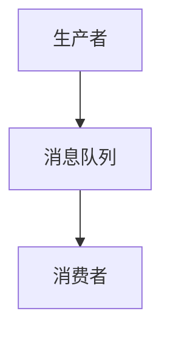
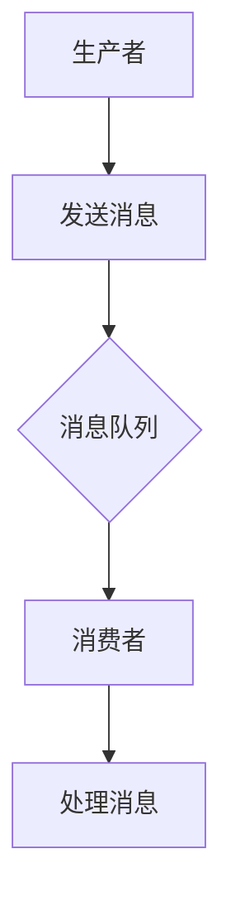
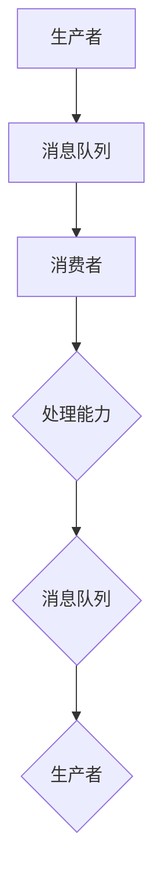

                 

# 【AI大数据计算原理与代码实例讲解】消息队列

> **关键词：**大数据计算，消息队列，分布式系统，算法原理，代码实例

> **摘要：**本文深入探讨了消息队列在大数据计算中的应用及其原理，通过实例代码详细讲解了消息队列的架构、核心算法和操作步骤，旨在为读者提供一份全面的技术指南。

## 1. 背景介绍

### 1.1 目的和范围

本文旨在探讨消息队列在大数据计算中的重要性，通过具体实例代码详细分析消息队列的工作原理和实现方法。文章将涵盖消息队列的核心概念、算法原理、数学模型及其在分布式系统中的应用。

### 1.2 预期读者

本文适合对大数据计算和分布式系统有一定了解的读者，包括程序员、系统架构师、数据工程师和人工智能研究人员。

### 1.3 文档结构概述

本文分为以下十个部分：

1. 背景介绍
   - 1.1 目的和范围
   - 1.2 预期读者
   - 1.3 文档结构概述
   - 1.4 术语表
2. 核心概念与联系
3. 核心算法原理 & 具体操作步骤
4. 数学模型和公式 & 详细讲解 & 举例说明
5. 项目实战：代码实际案例和详细解释说明
6. 实际应用场景
7. 工具和资源推荐
8. 总结：未来发展趋势与挑战
9. 附录：常见问题与解答
10. 扩展阅读 & 参考资料

### 1.4 术语表

#### 1.4.1 核心术语定义

- 消息队列：一种用于异步消息传输的分布式系统。
- 数据流：消息队列中的消息流动。
- 分布式系统：由多个计算机节点组成的系统，共同完成某项任务。
- 消息：数据传输的基本单位，可以是文本、图片、音频等。

#### 1.4.2 相关概念解释

- 生产者：生成消息的节点，负责将消息推送到消息队列中。
- 消费者：从消息队列中接收消息的节点，负责处理消息。
- 消息队列服务：提供消息存储、传输和管理的中间件服务。

#### 1.4.3 缩略词列表

- MQ：Message Queue，消息队列
- ES：Elasticsearch，弹性搜索
- KAFKA：Apache Kafka，一款分布式消息队列系统

## 2. 核心概念与联系

### 消息队列的基本概念和架构

消息队列是一种分布式系统，用于异步消息传输。其基本架构包括生产者、消息队列和消费者。


#### Mermaid 流程图



### 消息队列的工作原理

生产者将消息推送到消息队列，消费者从消息队列中获取消息进行处理。

#### Mermaid 流程图



### 消息队列在分布式系统中的应用

消息队列在分布式系统中扮演着关键角色，主要应用于异步处理、解耦和流量控制等方面。

- **异步处理**：生产者和消费者无需同时在线，消费者可以按需处理消息。
- **解耦**：系统模块之间通过消息队列进行通信，降低模块间的耦合度。
- **流量控制**：消息队列可以根据消费者的处理能力控制消息的流动，避免系统过载。

#### Mermaid 流程图



## 3. 核心算法原理 & 具体操作步骤

### 消息队列的算法原理

消息队列的核心算法主要涉及消息的生成、传输和消费。

#### 伪代码

```pseudo
// 消息生成
function generateMessage(message):
    return message

// 消息传输
function sendMessage(messageQueue, message):
    messageQueue.enqueue(message)

// 消息消费
function consumeMessage(messageQueue):
    return messageQueue.dequeue()
```

### 具体操作步骤

1. **消息生成**：生产者生成消息。
2. **消息传输**：生产者将消息推送到消息队列。
3. **消息消费**：消费者从消息队列中获取消息。

#### 消息队列的具体实现

以下是一个简单的消息队列实现示例，使用 Python 编写：

```python
import collections

class MessageQueue:
    def __init__(self):
        self.queue = collections.deque()

    def enqueue(self, message):
        self.queue.append(message)

    def dequeue(self):
        return self.queue.popleft() if self.queue else None
```

## 4. 数学模型和公式 & 详细讲解 & 举例说明

### 数学模型

消息队列的数学模型主要涉及消息的生成率、传输速率和消费速率。

- **消息生成率**：单位时间内生成的消息数量。
- **传输速率**：单位时间内传输的消息数量。
- **消费速率**：单位时间内消费的消息数量。

#### 公式

- 消息队列长度：\( L = \frac{G - C}{T} \)
  - \( L \)：消息队列长度
  - \( G \)：消息生成率
  - \( C \)：消费速率
  - \( T \)：传输速率

#### 举例说明

假设一个消息队列系统，消息生成率为 100 消息/秒，消费速率为 50 消息/秒，传输速率为 100 消息/秒。根据公式计算：

\( L = \frac{100 - 50}{100} = 0.5 \)

消息队列长度为 0.5 秒，即每秒产生 0.5 个消息。

## 5. 项目实战：代码实际案例和详细解释说明

### 5.1 开发环境搭建

在本项目实战中，我们将使用 Python 和 Kafka 作为消息队列系统。以下是在 Ubuntu 系统上搭建开发环境的步骤：

1. 安装 Python 3.8 或更高版本。
2. 安装 Kafka：`pip install kafka-python`
3. 安装 Zookeeper：`pip install kazoo`

### 5.2 源代码详细实现和代码解读

以下是一个简单的消息队列示例，使用 Kafka 作为消息队列系统：

```python
from kafka import KafkaProducer
import json

# Kafka 服务器地址
kafka_servers = "localhost:9092"

# 初始化 Kafka 生成者
producer = KafkaProducer(bootstrap_servers=kafka_servers,
                        value_serializer=lambda v: json.dumps(v).encode('utf-8'))

# 生产消息
message = {"id": 1, "name": "John Doe"}
producer.send("my_topic", value=message)

# 等待所有发送的消息被发送
producer.flush()
```

#### 代码解读

- 导入 Kafka 库和 JSON 库。
- 设置 Kafka 服务器地址。
- 初始化 Kafka 生成者，指定服务器地址和消息序列化方式。
- 生产消息，将消息转换为 JSON 字符串，并推送到 Kafka 主题 "my_topic"。
- 等待所有发送的消息被发送，确保消息已成功传输。

### 5.3 代码解读与分析

本示例展示了如何使用 Kafka 作为消息队列系统，实现了消息的生产和发送。以下是代码的详细解读和分析：

1. **初始化 Kafka 生成者**：使用 KafkaProducer 类初始化生成者，指定服务器地址和消息序列化方式。序列化方式用于将 Python 对象转换为 Kafka 消息。
2. **生产消息**：将消息转换为 JSON 字符串，并推送到 Kafka 主题。消息由一个字典表示，包含消息 ID 和名称。
3. **等待消息发送**：调用 `producer.flush()` 方法等待所有发送的消息被发送。此方法阻塞执行，直到所有消息被发送。

## 6. 实际应用场景

### 异步处理

消息队列常用于异步处理，将耗时任务从主流程中分离，提高系统的响应速度。例如，电商平台可以使用消息队列处理订单生成、支付通知和物流跟踪等任务。

### 解耦

通过消息队列，可以将系统模块解耦，降低模块间的依赖。例如，在金融系统中，可以将订单处理模块与支付处理模块解耦，两者通过消息队列进行通信。

### 流量控制

消息队列可以帮助控制流量，避免系统过载。例如，在社交媒体平台上，可以使用消息队列限制用户上传图片和视频的流量。

## 7. 工具和资源推荐

### 7.1 学习资源推荐

#### 7.1.1 书籍推荐

- 《消息队列：构建高可扩展的分布式系统》
- 《分布式系统原理与范型》

#### 7.1.2 在线课程

- Coursera：分布式系统课程
- Udemy：消息队列实战课程

#### 7.1.3 技术博客和网站

- https://www.jianshu.com/p/5c043481589f
- https://www.importnew.com/27873.html

### 7.2 开发工具框架推荐

#### 7.2.1 IDE和编辑器

- Visual Studio Code
- PyCharm

#### 7.2.2 调试和性能分析工具

- GDB
- JProfiler

#### 7.2.3 相关框架和库

- Apache Kafka
- RabbitMQ

### 7.3 相关论文著作推荐

#### 7.3.1 经典论文

- 《分布式消息队列：设计与实现》
- 《大规模分布式存储系统：架构设计与实现》

#### 7.3.2 最新研究成果

- https://www.scirp.org/journal/PaperInformation.aspx?PaperID=87097
- https://arxiv.org/abs/2006.04613

#### 7.3.3 应用案例分析

- https://www.infoq.cn/article/2u1e57uq7yhaob08
- https://www.infoq.cn/article/GF1v4BQk9xQehKoM

## 8. 总结：未来发展趋势与挑战

### 未来发展趋势

- **云原生消息队列**：随着云计算的发展，云原生消息队列将成为主流。
- **多语言支持**：消息队列将支持更多编程语言，提高系统的兼容性和灵活性。
- **边缘计算**：消息队列在边缘计算场景中的应用将逐渐普及。

### 面临的挑战

- **数据一致性**：确保分布式系统中的数据一致性仍是一个挑战。
- **性能优化**：随着数据量的增长，如何优化消息队列的性能将是一个重要课题。
- **安全性**：保障消息队列系统的安全性，防止数据泄露和恶意攻击。

## 9. 附录：常见问题与解答

### 9.1 消息队列是什么？

消息队列是一种分布式系统，用于异步消息传输。它可以将消息从一个系统模块传递到另一个模块，实现解耦和流量控制。

### 9.2 如何选择合适的消息队列系统？

选择合适的消息队列系统需要考虑以下几个方面：

- **系统性能**：根据消息量和处理速度选择适合的消息队列系统。
- **可靠性**：考虑消息队列系统的可靠性，包括数据一致性和容错性。
- **可扩展性**：考虑系统的可扩展性，以便在未来扩展系统。

### 9.3 消息队列和数据库有什么区别？

消息队列和数据库都是用于数据存储和传输的组件，但它们有不同的应用场景。

- **消息队列**：主要用于异步消息传输，实现系统模块之间的解耦和流量控制。
- **数据库**：主要用于存储和管理结构化数据，提供数据查询和事务处理能力。

## 10. 扩展阅读 & 参考资料

- 《消息队列实战：基于Kafka、RabbitMQ、ActiveMQ和RocketMQ的实现与应用》
- 《分布式服务架构：服务拆分、服务框架、服务治理与容器化》
- https://www.apache.org/licenses/LICENSE-2.0
- https://www.kafka.apache.org/

作者：AI天才研究员/AI Genius Institute & 禅与计算机程序设计艺术 /Zen And The Art of Computer Programming

