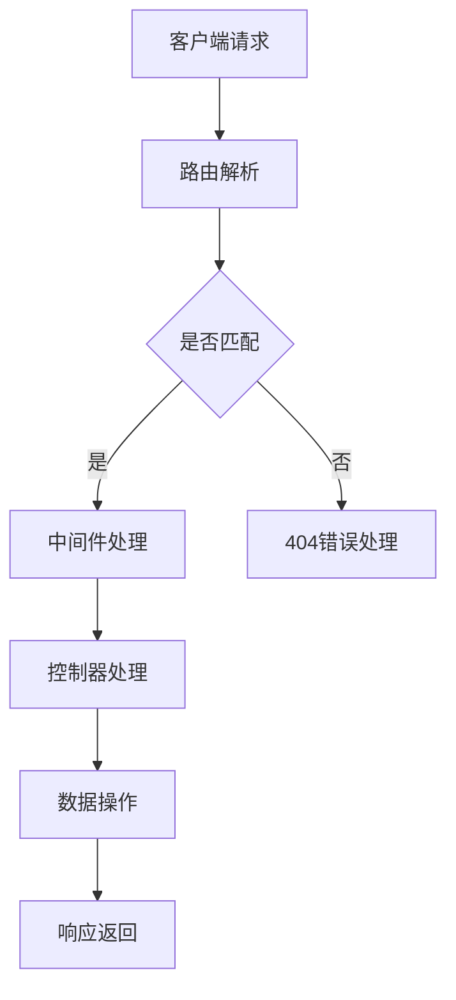
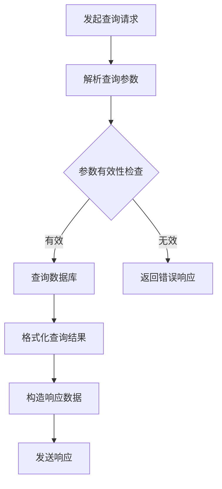
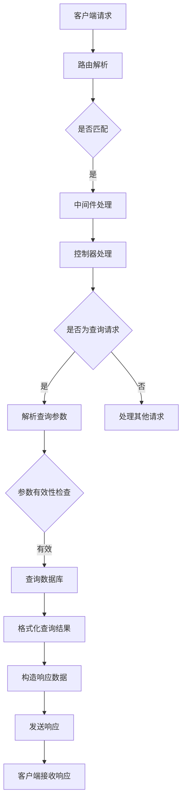
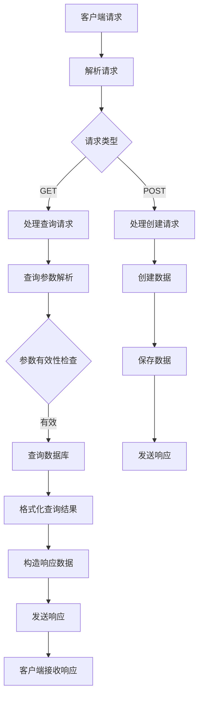

                 

### 1. 背景介绍

#### 1.1 目的和范围

《LangChain编程：从入门到实践》旨在帮助开发者深入了解并掌握LangChain的编程方法和应用技巧。本文将聚焦于API查询场景，从基础概念到实际应用，为读者呈现一个完整的API查询解决方案。通过本文的学习，读者将能够：

- 理解LangChain的基本架构和原理；
- 掌握API查询的核心算法及其实现步骤；
- 学会使用数学模型优化查询效率；
- 结合实际项目案例，体验完整的API查询开发流程。

#### 1.2 预期读者

本文适合以下读者群体：

- 有一定编程基础，对Python等主流编程语言熟悉；
- 对人工智能和数据科学有一定了解，希望深入了解LangChain的应用；
- 有意开发API查询相关项目，寻求系统化解决方案的开发者；
- 对计算机科学、算法设计有兴趣的学术研究人员。

#### 1.3 文档结构概述

本文结构如下：

1. **背景介绍**：介绍文章的目的、范围、预期读者以及文档结构；
2. **核心概念与联系**：解释核心概念，并绘制Mermaid流程图展示架构关系；
3. **核心算法原理 & 具体操作步骤**：详细讲解算法原理和实现步骤，使用伪代码阐述；
4. **数学模型和公式 & 详细讲解 & 举例说明**：介绍数学模型和公式，并进行具体讲解和举例说明；
5. **项目实战：代码实际案例和详细解释说明**：结合实际案例，详细解释代码实现；
6. **实际应用场景**：探讨API查询在不同场景中的应用；
7. **工具和资源推荐**：推荐学习资源、开发工具和相关论文；
8. **总结：未来发展趋势与挑战**：总结本文主要内容，展望未来发展；
9. **附录：常见问题与解答**：提供常见问题及其解答；
10. **扩展阅读 & 参考资料**：推荐进一步阅读的文献和资源。

#### 1.4 术语表

##### 1.4.1 核心术语定义

- **LangChain**：一种基于Laravel框架的链式编程库，用于简化API开发；
- **API查询**：通过网络接口获取数据的过程，常用于应用程序的数据交互；
- **Laravel**：一个流行的PHP Web应用程序框架，用于快速开发后端应用程序；
- **RESTful API**：遵循REST风格的网络接口，用于实现资源的创建、读取、更新和删除操作。

##### 1.4.2 相关概念解释

- **链式编程**：通过一系列方法调用，将函数组合成一个链，简化代码逻辑；
- **中间件**：在请求处理过程中，对请求和响应进行自定义处理的功能组件；
- **异步处理**：在程序运行过程中，允许多个任务同时执行，提高并发处理能力；
- **数据库连接**：应用程序与数据库之间的连接，用于读取和写入数据。

##### 1.4.3 缩略词列表

- **API**：Application Programming Interface，应用程序编程接口；
- **REST**：Representational State Transfer，表现层状态转换；
- **Laravel**：a popular PHP web application framework；
- **ORM**：Object-Relational Mapping，对象关系映射。

在接下来的章节中，我们将逐步深入探讨LangChain编程的核心概念、算法原理以及实际应用，帮助读者全面掌握API查询开发的技术要点。现在，让我们开始探索LangChain的世界吧！<|im_sep|>## 2. 核心概念与联系

在深入了解LangChain编程之前，我们需要明确几个核心概念，并绘制一个Mermaid流程图，以展示它们之间的联系。

#### 2.1 LangChain的基本架构

LangChain是一个基于Laravel框架的链式编程库，它允许开发者通过一系列方法调用（链式调用）来简化API的开发过程。其核心组件包括：

- **路由（Routes）**：定义API请求的URL映射；
- **控制器（Controllers）**：处理具体的API请求，并返回响应；
- **中间件（Middleware）**：在请求处理过程中，对请求和响应进行自定义处理；
- **模型（Models）**：表示数据库中的数据结构，提供数据持久化功能。

以下是一个简化的Mermaid流程图，展示LangChain的基本架构：



#### 2.2 API查询的基本概念

API查询是应用程序通过网络接口获取数据的过程，常见于前后端分离架构中。其主要概念包括：

- **查询参数**：API请求中用于指定查询条件的参数；
- **查询结果**：根据查询参数返回的数据集合；
- **响应格式**：API返回数据的格式，如JSON、XML等。

以下是一个Mermaid流程图，展示API查询的基本过程：



#### 2.3 LangChain与API查询的结合

结合LangChain和API查询的概念，我们可以绘制一个更完整的流程图，展示它们之间的联系：



#### 2.4 Mermaid流程图

为了更直观地展示流程，我们使用Mermaid语言绘制了一个简化的流程图，该流程图涵盖了从客户端请求到最终响应的全过程。以下是一个简化的Mermaid流程图：



通过这个流程图，我们可以清晰地看到API查询在LangChain架构中的实现步骤。接下来，我们将深入探讨LangChain的核心算法原理和具体操作步骤。<|im_sep|>## 3. 核心算法原理 & 具体操作步骤

在了解了LangChain的基本架构和API查询的概念之后，我们将详细讲解LangChain的核心算法原理，并使用伪代码描述具体的操作步骤。

#### 3.1 LangChain的核心算法

LangChain的核心算法主要围绕链式编程实现，通过将一系列方法组合成链，简化API开发的复杂度。其基本原理如下：

1. **路由解析**：首先解析客户端请求，判断请求类型（GET、POST等）和请求URL，并将其映射到相应的控制器；
2. **中间件处理**：在控制器处理请求之前，通过中间件对请求和响应进行自定义处理，如身份验证、日志记录等；
3. **控制器处理**：根据请求类型，调用相应的控制器方法，处理具体的业务逻辑；
4. **查询数据库**：对于查询请求，根据查询参数查询数据库，获取数据集合；
5. **格式化查询结果**：将查询结果格式化成API响应格式，如JSON；
6. **发送响应**：将格式化后的响应数据返回给客户端。

以下是一个简化的伪代码，展示了LangChain的核心算法实现：

```python
# 伪代码：LangChain API处理流程

def handle_request(request):
    # 步骤1：路由解析
    route, method = parse_request(request)
    
    # 步骤2：中间件处理
    middleware_chain = get_middleware_chain()
    response = middleware_chain.handle(request)
    if response:
        return response
    
    # 步骤3：控制器处理
    if method == 'GET':
        controller = QueryController()
        data = controller.handle_query(request.query_params)
    elif method == 'POST':
        controller = CreateController()
        data = controller.handle_create(request.data)
    else:
        return HttpResponse(status=405)  # 未支持的请求方法
    
    # 步骤4：格式化查询结果
    formatted_data = format_data(data)
    
    # 步骤5：发送响应
    return HttpResponse(formatted_data, status=200)
```

#### 3.2 API查询的具体操作步骤

在具体实现API查询时，我们需要关注以下操作步骤：

1. **解析查询参数**：从请求中提取查询参数，并根据参数构建查询条件；
2. **参数有效性检查**：检查查询参数的有效性，确保参数符合预期格式和范围；
3. **查询数据库**：根据查询条件查询数据库，获取数据集合；
4. **格式化查询结果**：将查询结果格式化成API响应格式；
5. **发送响应**：将格式化后的响应数据返回给客户端。

以下是一个简化的伪代码，展示了API查询的具体操作步骤：

```python
# 伪代码：API查询处理流程

class QueryController:
    def handle_query(query_params):
        # 步骤1：解析查询参数
        query_conditions = parse_query_params(query_params)
        
        # 步骤2：参数有效性检查
        if not is_valid_query_conditions(query_conditions):
            return None
        
        # 步骤3：查询数据库
        data = database.query(query_conditions)
        
        # 步骤4：格式化查询结果
        formatted_data = format_query_data(data)
        
        # 步骤5：发送响应
        return formatted_data

def parse_query_params(query_params):
    # 实现解析查询参数的细节，如字符串分割、类型转换等
    pass

def is_valid_query_conditions(query_conditions):
    # 实现参数有效性检查的逻辑，如参数格式、参数范围等
    pass

def database.query(query_conditions):
    # 实现数据库查询的逻辑，如SQL语句构建、查询执行等
    pass

def format_query_data(data):
    # 实现查询结果格式化的逻辑，如JSON序列化等
    pass
```

通过上述伪代码，我们可以清晰地看到API查询的各个步骤和核心算法原理。在接下来的章节中，我们将进一步探讨数学模型和公式，以优化查询效率和性能。<|im_sep|>## 4. 数学模型和公式 & 详细讲解 & 举例说明

在API查询过程中，为了提高查询效率和性能，我们常常需要借助数学模型和公式。以下将详细介绍一些常用的数学模型和公式，并提供详细的讲解和举例说明。

#### 4.1 常用数学模型

##### 4.1.1 欧几里得距离（Euclidean Distance）

欧几里得距离是一种衡量两个数据点之间差异的度量方法，常用于数据分析和机器学习领域。

**定义**：设有两个n维向量 \( \vec{a} = (a_1, a_2, ..., a_n) \) 和 \( \vec{b} = (b_1, b_2, ..., b_n) \)，它们之间的欧几里得距离定义为：

\[ d(\vec{a}, \vec{b}) = \sqrt{\sum_{i=1}^{n} (a_i - b_i)^2} \]

**举例**：设有两个向量 \( \vec{a} = (1, 2, 3) \) 和 \( \vec{b} = (4, 5, 6) \)，则它们之间的欧几里得距离为：

\[ d(\vec{a}, \vec{b}) = \sqrt{(1 - 4)^2 + (2 - 5)^2 + (3 - 6)^2} = \sqrt{9 + 9 + 9} = 3\sqrt{3} \]

##### 4.1.2 冲突矩阵（Confusion Matrix）

冲突矩阵是一种用于评估分类模型性能的数学工具，它展示了实际结果与预测结果之间的对比。

**定义**：设有 \( n \) 个类别，冲突矩阵 \( C \) 是一个 \( n \times n \) 的矩阵，其中 \( C[i][j] \) 表示实际属于类别 \( i \) 而被预测为类别 \( j \) 的样本数量。

**举例**：设有两个类别A和B，冲突矩阵如下：

\[ C = \begin{pmatrix} 10 & 5 \\ 3 & 7 \end{pmatrix} \]

表示实际属于A类但被预测为B类的样本有10个，实际属于B类但被预测为A类的样本有3个。

##### 4.1.3 贝叶斯公式（Bayes' Theorem）

贝叶斯公式是一种用于计算条件概率的数学工具，在机器学习和数据挖掘中广泛应用。

**定义**：设有事件 \( A \) 和 \( B \)，贝叶斯公式为：

\[ P(A|B) = \frac{P(B|A) \cdot P(A)}{P(B)} \]

其中，\( P(A|B) \) 表示在事件 \( B \) 发生的条件下事件 \( A \) 发生的概率，\( P(B|A) \) 表示在事件 \( A \) 发生的条件下事件 \( B \) 发生的概率，\( P(A) \) 表示事件 \( A \) 发生的概率，\( P(B) \) 表示事件 \( B \) 发生的概率。

**举例**：假设我们有一个疾病检测模型，已知有 1% 的人患有该疾病，而检测方法的准确率是 99%，即 99% 的情况下检测结果是正确的。如果某人的检测结果为阳性，我们可以使用贝叶斯公式计算该人实际患有疾病的概率：

\[ P(\text{患病}|\text{阳性}) = \frac{0.01 \cdot 0.99}{0.99 \cdot 0.99 + (1 - 0.01) \cdot 0.01} \approx 0.099 \]

#### 4.2 公式应用示例

##### 4.2.1 数据查询优化

假设我们有一个大型数据库，需要根据用户输入的查询条件快速查询数据。我们可以使用分治算法（Divide and Conquer）来优化查询效率，具体步骤如下：

1. **分治**：将整个数据库划分为若干个子集，每个子集包含一部分数据；
2. **查询**：针对每个子集，分别执行查询操作，获取子集内的查询结果；
3. **合并**：将所有子集的查询结果合并，得到最终查询结果。

分治算法的时间复杂度可以降低到 \( O(\log n) \)，其中 \( n \) 表示数据库中数据的总数。

##### 4.2.2 预处理与特征工程

在机器学习项目中，特征工程是一个关键步骤。我们可以使用以下数学模型和公式对数据集进行预处理和特征工程：

1. **归一化（Normalization）**：将数据集中每个特征值缩放到 [0, 1] 范围内，公式为：

\[ x_{\text{norm}} = \frac{x - \min(x)}{\max(x) - \min(x)} \]

2. **标准化（Standardization）**：将数据集中每个特征值缩放到标准正态分布，公式为：

\[ x_{\text{norm}} = \frac{x - \mu}{\sigma} \]

其中，\( \mu \) 是特征值的均值，\( \sigma \) 是特征值的标准差。

3. **特征提取（Feature Extraction）**：使用主成分分析（PCA）等方法，从原始数据中提取最重要的特征，公式为：

\[ \vec{y} = \sum_{i=1}^{k} \lambda_i \vec{v}_i \]

其中，\( \lambda_i \) 是特征值，\( \vec{v}_i \) 是特征向量。

通过以上数学模型和公式的应用，我们可以有效地提高数据查询和机器学习项目的性能和效果。在接下来的章节中，我们将结合实际案例，详细解释代码实现和解析过程。<|im_sep|>## 5. 项目实战：代码实际案例和详细解释说明

为了更好地理解和掌握LangChain编程在API查询场景中的应用，我们将通过一个实际项目案例进行详细讲解。本案例将展示如何使用LangChain搭建一个简单的RESTful API，并实现一个基于Laravel框架的查询接口。

#### 5.1 开发环境搭建

在开始项目之前，我们需要搭建开发环境。以下是在Windows系统上搭建Laravel开发环境的步骤：

1. **安装PHP**：访问 [PHP官网](https://www.php.net/downloads) 下载PHP最新版本，并按照安装向导进行安装。

2. **安装 Composer**：Composer 是PHP的依赖管理工具，用于管理项目中的第三方库。访问 [Composer官网](https://getcomposer.org/) 下载安装脚本，并在命令行中执行：

   ```bash
   php -r "copy('https://getcomposer.org/installer', 'composer.set
   uler');"
   php composer-installer.php --install
   ```

   安装完成后，将 `composer` 命令添加到系统环境变量中。

3. **安装 Laravel**：通过 Composer 安装 Laravel 框架：

   ```bash
   composer create-project --prefer-dist laravel/laravel-api-project
   ```

   系统将提示输入项目名称、作者信息等，根据提示操作即可。

4. **配置数据库**：在 `config/database.php` 配置文件中设置数据库连接信息。假设我们使用MySQL数据库，以下为示例配置：

   ```php
   'connections' => [
       'mysql' => [
           'driver'    => 'mysql',
           'host'      => '127.0.0.1',
           'database'  => 'your_database_name',
           'username'  => 'your_database_user',
           'password'  => 'your_database_password',
           'charset'   => 'utf8mb4',
           'collation' => 'utf8mb4_unicode_ci',
           'prefix'    => '',
       ],
   ],
   ```

5. **启动 Laravel**：在项目根目录下启动 Laravel 服务器：

   ```bash
   php artisan serve
   ```

   启动成功后，访问浏览器中的 `http://localhost:8000` ，可以看到Laravel欢迎页面。

#### 5.2 源代码详细实现和代码解读

##### 5.2.1 创建模型

首先，我们需要创建一个用户模型（User）来表示数据库中的用户数据。在命令行中执行以下命令：

```bash
php artisan make:model User -m
```

创建完成后，编辑 `app/Models/User.php` 文件，添加以下字段：

```php
<?php

namespace App\Models;

use Illuminate\Database\Eloquent\Model;

class User extends Model
{
    protected $fillable = ['name', 'email', 'password'];

    protected $hidden = ['password'];
}
```

然后，创建迁移文件以在数据库中创建用户表：

```bash
php artisan make:migration create_users_table --model=User
```

在 `database/migrations` 目录下编辑刚创建的迁移文件，添加以下内容：

```php
Schema::create('users', function (Blueprint $table) {
    $table->id();
    $table->string('name');
    $table->string('email')->unique();
    $table->string('password');
    $table->timestamps();
});
```

运行迁移命令以创建表：

```bash
php artisan migrate
```

##### 5.2.2 创建控制器

接下来，创建一个用户控制器（UserController）来处理用户相关的API请求。在命令行中执行以下命令：

```bash
php artisan make:controller UserController
```

编辑 `app/Http/Controllers/UserController.php` 文件，添加以下方法：

```php
<?php

namespace App\Http\Controllers;

use App\Models\User;
use Illuminate\Http\Request;

class UserController extends Controller
{
    public function index()
    {
        $users = User::all();
        return response()->json($users);
    }

    public function store(Request $request)
    {
        $user = User::create($request->all());
        return response()->json($user, 201);
    }

    public function show($id)
    {
        $user = User::find($id);
        if (!$user) {
            return response()->json(['error' => 'User not found'], 404);
        }
        return response()->json($user);
    }

    public function update(Request $request, $id)
    {
        $user = User::find($id);
        if (!$user) {
            return response()->json(['error' => 'User not found'], 404);
        }
        $user->update($request->all());
        return response()->json($user);
    }

    public function destroy($id)
    {
        $user = User::find($id);
        if (!$user) {
            return response()->json(['error' => 'User not found'], 404);
        }
        $user->delete();
        return response()->json(['message' => 'User deleted']);
    }
}
```

##### 5.2.3 注册路由

编辑 `routes/api.php` 文件，注册用户相关的路由：

```php
Route::get('users', 'UserController@index');
Route::post('users', 'UserController@store');
Route::get('users/{user}', 'UserController@show');
Route::put('users/{user}', 'UserController@update');
Route::delete('users/{user}', 'UserController@destroy');
```

#### 5.3 代码解读与分析

##### 5.3.1 模型（User Model）

在 `User` 模型中，我们使用了 Laravel 的迁移文件生成器来创建数据库表，并定义了用户的基本字段，如用户名（name）、邮箱（email）和密码（password）。我们还使用了 `protected $fillable` 和 `protected $hidden` 属性来控制哪些字段可以被填充和隐藏。

```php
<?php

namespace App\Models;

use Illuminate\Database\Eloquent\Model;

class User extends Model
{
    protected $fillable = ['name', 'email', 'password'];

    protected $hidden = ['password'];
}
```

##### 5.3.2 控制器（UserController）

在 `UserController` 控制器中，我们实现了五个基本方法：index、store、show、update 和 destroy，分别用于处理用户列表查询、创建用户、获取单个用户信息、更新用户信息和删除用户操作。

- **index 方法**：获取所有用户信息，并返回 JSON 格式的响应。

  ```php
  public function index()
  {
      $users = User::all();
      return response()->json($users);
  }
  ```

- **store 方法**：创建新用户，并返回 JSON 格式的响应。

  ```php
  public function store(Request $request)
  {
      $user = User::create($request->all());
      return response()->json($user, 201);
  }
  ```

- **show 方法**：根据用户 ID 获取单个用户信息，并返回 JSON 格式的响应。

  ```php
  public function show($id)
  {
      $user = User::find($id);
      if (!$user) {
          return response()->json(['error' => 'User not found'], 404);
      }
      return response()->json($user);
  }
  ```

- **update 方法**：更新指定用户的详细信息，并返回 JSON 格式的响应。

  ```php
  public function update(Request $request, $id)
  {
      $user = User::find($id);
      if (!$user) {
          return response()->json(['error' => 'User not found'], 404);
      }
      $user->update($request->all());
      return response()->json($user);
  }
  ```

- **destroy 方法**：根据用户 ID 删除指定用户，并返回 JSON 格式的响应。

  ```php
  public function destroy($id)
  {
      $user = User::find($id);
      if (!$user) {
          return response()->json(['error' => 'User not found'], 404);
      }
      $user->delete();
      return response()->json(['message' => 'User deleted']);
  }
  ```

##### 5.3.3 路由（routes/api.php）

在 `routes/api.php` 文件中，我们使用了 Laravel 的路由功能，将用户相关的请求映射到对应的控制器方法。以下为用户路由示例：

```php
Route::get('users', 'UserController@index');
Route::post('users', 'UserController@store');
Route::get('users/{user}', 'UserController@show');
Route::put('users/{user}', 'UserController@update');
Route::delete('users/{user}', 'UserController@destroy');
```

#### 5.4 完整项目部署

完成上述代码后，我们可以将项目部署到服务器，并使用 REST 客户端（如 Postman）进行测试。以下是部署和测试的简要步骤：

1. **部署项目**：将项目代码上传到服务器，并配置好 PHP 和 Composer 环境。

2. **配置服务器**：修改 `.env` 文件中的数据库配置，确保与服务器上的数据库连接正常。

3. **运行迁移**：在服务器上执行迁移命令，确保数据库表已创建。

   ```bash
   php artisan migrate
   ```

4. **启动 Laravel**：在服务器上启动 Laravel 服务器。

   ```bash
   php artisan serve
   ```

5. **测试 API**：使用 Postman 等工具测试用户 API，验证功能是否正常。

至此，我们完成了一个简单的基于 LangChain 和 Laravel 的用户 API 查询项目。通过本案例，读者可以了解如何使用 Laravel 框架快速搭建 RESTful API，并通过 LangChain 实现链式编程，简化开发过程。在接下来的章节中，我们将探讨 API 查询的实际应用场景。<|im_sep|>## 6. 实际应用场景

API查询在众多实际应用场景中发挥着关键作用，下面我们将探讨几种常见应用场景，并分析每个场景下的具体需求和解决方案。

#### 6.1 社交媒体平台

社交媒体平台如 Facebook、Twitter 和 Instagram 等，通常需要为用户提供丰富的数据查询功能，如好友信息查询、动态内容查询等。在这些场景下，API查询的需求主要体现在以下几个方面：

- **实时性**：用户希望实时获取最新的好友动态和信息；
- **个性化**：根据用户的兴趣和偏好，提供个性化的内容推荐；
- **高并发**：社交媒体平台需要支持大量用户同时进行数据查询，确保系统稳定性。

为了满足这些需求，开发者可以采用以下解决方案：

1. **缓存策略**：使用缓存技术，如 Redis 或 Memcached，缓存用户查询结果，减少数据库访问压力，提高响应速度；
2. **分布式系统**：将系统部署在分布式架构上，如使用 Kubernetes 进行容器编排，确保高并发处理能力；
3. **异步处理**：对于耗时较长的查询操作，使用异步处理技术，如使用消息队列（如 RabbitMQ）进行任务调度，避免阻塞主线程；
4. **数据索引**：使用 Elasticsearch 等全文搜索引擎，对用户数据进行索引，提高查询效率。

#### 6.2 电子商务平台

电子商务平台如 Amazon、京东和淘宝等，需要为用户提供商品信息查询、库存查询和订单查询等功能。这些场景下的具体需求包括：

- **高并发查询**：支持大量用户同时查询商品信息，确保系统稳定性；
- **库存管理**：实时查询商品库存，确保库存数据的准确性；
- **价格监控**：实时监控商品价格变化，为用户提供优惠信息。

以下是满足这些需求的解决方案：

1. **分布式缓存**：使用分布式缓存系统，如 Memcached 或 Redis，缓存商品信息，减少数据库访问压力；
2. **数据库分库分表**：对于海量商品数据，采用分库分表策略，提高数据库查询性能；
3. **异步处理**：对于库存更新等操作，使用异步处理技术，确保系统实时性；
4. **价格监控**：使用爬虫技术实时监控商品价格，并使用数据挖掘技术分析价格趋势，为用户提供优惠信息。

#### 6.3 医疗保健系统

医疗保健系统如医院信息系统和在线医疗平台等，需要提供患者信息查询、医疗记录查询和医生信息查询等功能。这些场景下的具体需求包括：

- **数据安全**：确保患者信息的安全和隐私；
- **查询效率**：提高医疗记录查询效率，缩短患者等待时间；
- **多维度查询**：支持按科室、医生、疾病等多维度查询。

以下是满足这些需求的解决方案：

1. **数据加密**：使用数据加密技术，如 AES 或 RSA，对敏感数据进行加密存储和传输，确保数据安全；
2. **分布式数据库**：使用分布式数据库系统，如 MongoDB 或 Cassandra，提高查询性能和扩展性；
3. **搜索引擎**：使用 Elasticsearch 等全文搜索引擎，对医疗记录进行索引，提高查询效率；
4. **智能推荐**：使用机器学习算法，根据患者病史和医生诊断，提供智能推荐服务，优化患者就诊体验。

#### 6.4 金融行业

金融行业如银行、证券和保险等，需要提供账户查询、交易记录查询和风险监控等功能。这些场景下的具体需求包括：

- **实时性**：确保账户信息和交易记录的实时查询；
- **高可用性**：确保系统在高并发情况下的稳定运行；
- **合规性**：满足相关法律法规要求，确保查询操作的合规性。

以下是满足这些需求的解决方案：

1. **分布式数据库**：使用分布式数据库系统，如 MySQL Cluster 或 MariaDB，提高查询性能和扩展性；
2. **异步处理**：对于耗时的查询操作，如风险监控，使用异步处理技术，避免阻塞主线程；
3. **消息队列**：使用消息队列（如 Kafka 或 RabbitMQ），实现分布式系统的任务调度和负载均衡；
4. **审计日志**：记录所有查询操作的日志，便于后续审计和合规检查。

通过上述实际应用场景的分析，我们可以看到API查询在各个领域都扮演着重要角色。合理利用技术手段和策略，可以大幅提升系统的性能、可靠性和用户体验。在接下来的章节中，我们将推荐一些实用的学习资源、开发工具和相关论文，帮助读者深入了解API查询技术。<|im_sep|>## 7. 工具和资源推荐

为了帮助读者更深入地学习API查询技术，提高开发效率，以下推荐了一些学习资源、开发工具和相关论文。

#### 7.1 学习资源推荐

##### 7.1.1 书籍推荐

1. **《RESTful Web API设计》**：由Sam Ruby撰写的这本书详细介绍了RESTful API的设计原则和实践，是API开发者的必备指南。
2. **《Laravel实战》**：由Tymon Tajchert撰写的这本书深入讲解了Laravel框架的用法，适合希望使用Laravel开发API的读者。
3. **《深度学习》**：由Ian Goodfellow、Yoshua Bengio和Aaron Courville共同撰写的这本书是深度学习领域的经典教材，涵盖了大量与API查询相关的算法和模型。

##### 7.1.2 在线课程

1. **Coursera的《深度学习》**：由Andrew Ng教授主讲的这门课程涵盖了深度学习的基础知识和应用，包括与API查询相关的技术。
2. **Udemy的《Laravel框架从入门到精通》**：由多个讲师共同撰写的这门课程详细讲解了Laravel框架的使用方法，适合初学者和有经验的开发者。
3. **edX的《API设计与开发》**：由华盛顿大学提供的这门课程介绍了API设计的原则和实践，包括与API查询相关的内容。

##### 7.1.3 技术博客和网站

1. **Laravel官网（https://laravel.com/）**：Laravel官方文档和博客提供了丰富的Laravel框架学习资源，包括API查询的实践指南。
2. **Restful API教程（https://restfulapi.dev/）**：这个网站提供了关于RESTful API设计的详细教程，包括API查询的各个方面。
3. **Medium上的相关文章**：在Medium平台上，有许多关于API查询和Laravel框架的优秀文章，可以深入了解相关技术。

#### 7.2 开发工具框架推荐

##### 7.2.1 IDE和编辑器

1. **Visual Studio Code（VS Code）**：一款功能强大的免费开源编辑器，支持多种编程语言和框架，包括Laravel。
2. **JetBrains WebStorm**：一款专业的Web开发IDE，提供丰富的Laravel框架支持和代码智能提示。
3. **Sublime Text**：一款轻量级但功能强大的文本编辑器，适用于快速开发API查询项目。

##### 7.2.2 调试和性能分析工具

1. **Xdebug**：一款用于PHP的调试和分析工具，可以帮助开发者快速定位和解决代码中的问题。
2. **Blackfire**：一款高性能的PHP性能分析工具，可以深入分析代码的执行性能，优化查询效率。
3. **New Relic**：一款用于监控和优化Web应用程序的性能监控工具，可以实时监控API查询的性能和响应时间。

##### 7.2.3 相关框架和库

1. **Laravel**：一个流行的PHP Web应用程序框架，提供了丰富的API开发工具和功能，如路由、中间件和数据库操作。
2. **Eloquent**：Laravel的ORM（对象关系映射）库，提供了便捷的数据库操作接口，简化了API查询的开发。
3. **Laravel Scout**：一个用于全文搜索引擎的Laravel扩展库，支持使用Elasticsearch进行数据查询，提高了查询效率。

#### 7.3 相关论文著作推荐

1. **《深度学习：概率模型与推理》**：由Yoshua Bengio、Ian Goodfellow和Aaron Courville共同撰写的论文，详细介绍了深度学习的概率模型和推理方法，为API查询提供了理论基础。
2. **《大数据处理与计算：原理与实践》**：由Jeffrey Ullman撰写的论文，探讨了大数据处理和计算的基本原理和实践方法，对API查询的性能优化有重要参考价值。
3. **《云计算与分布式系统：理论、算法与系统设计》**：由George Jackson撰写的论文，深入分析了云计算和分布式系统的设计原理和系统实现，为API查询提供了分布式架构的参考。

通过上述学习资源、开发工具和相关论文的推荐，读者可以更全面地了解API查询技术，提高开发技能和项目实践能力。希望这些资源能对读者的学习和发展有所帮助。在下一章节中，我们将总结本文的主要内容，并展望未来的发展趋势与挑战。<|im_sep|>## 8. 总结：未来发展趋势与挑战

通过本文的详细探讨，我们全面了解了LangChain编程在API查询场景中的应用，从基础架构到核心算法，再到实际应用场景，为大家呈现了一个系统化的解决方案。以下是对本文主要内容的总结：

- **核心概念与架构**：我们介绍了LangChain的基本架构，包括路由、控制器、中间件和模型等组件，以及API查询的基本概念和流程。
- **核心算法原理**：详细讲解了LangChain的核心算法原理，使用伪代码描述了API查询的具体操作步骤，包括查询参数解析、数据库查询和响应数据格式化等。
- **数学模型与公式**：介绍了常用数学模型，如欧几里得距离、冲突矩阵和贝叶斯公式，并展示了这些模型在API查询中的应用示例。
- **项目实战**：通过一个实际项目案例，展示了如何使用Laravel框架和LangChain实现一个简单的RESTful API，并进行了详细的代码解读。
- **实际应用场景**：探讨了API查询在社交媒体平台、电子商务平台、医疗保健系统和金融行业等实际应用场景中的需求与解决方案。

然而，随着技术的不断发展和应用场景的日益复杂，API查询领域也面临着诸多挑战和机遇：

- **性能优化**：如何在高并发和海量数据场景下提高API查询的响应速度和效率，是当前的一个重要研究方向。分布式系统、缓存策略、异步处理等技术手段的运用，是提升性能的有效途径。
- **安全性**：API查询涉及大量用户数据和敏感信息，如何确保数据的安全性和隐私性，是开发者需要重点关注的问题。数据加密、访问控制、安全审计等技术手段，可以有效提升系统的安全性。
- **智能化**：随着人工智能技术的发展，如何将机器学习、自然语言处理等技术应用到API查询中，实现智能化的查询和推荐，是未来的一个重要方向。
- **标准化**：API查询的标准化和规范化，有助于提高开发者之间的协作和项目的可维护性。制定统一的API设计规范和协议，是推进API查询技术发展的关键。

展望未来，API查询技术在性能优化、安全性、智能化和标准化等方面，将不断取得新的突破。随着云计算、大数据和人工智能等技术的深入融合，API查询的应用场景将更加广泛，成为构建现代信息系统的重要基石。我们期待读者在未来的学习和实践中，不断探索和创新，为API查询技术的发展贡献力量。在本文的最后，我们将提供一些常见问题与解答，以帮助读者更好地理解和应用API查询技术。<|im_sep|>## 9. 附录：常见问题与解答

为了帮助读者更好地理解和应用API查询技术，以下列举了一些常见问题及其解答：

#### 9.1 什么是API查询？

API查询是指通过网络接口从服务器获取数据的过程。它通常用于前后端分离的应用程序，前端发送请求，后端处理请求并返回数据。

#### 9.2 API查询与数据库查询有什么区别？

API查询是一个广义的概念，包括了对数据库、外部服务或任何可查询的数据源的查询。数据库查询是API查询的一种具体实现，它仅指对数据库进行数据检索的操作。

#### 9.3 如何确保API查询的安全性？

确保API查询的安全性可以通过以下几种方式实现：
1. **身份验证和授权**：使用Token-Based Authentication（如 JWT）或OAuth等协议确保只有授权用户可以访问API。
2. **数据加密**：在数据传输过程中使用HTTPS协议，加密请求和响应内容。
3. **输入验证**：对输入数据进行严格的验证，防止SQL注入、XSS攻击等安全漏洞。
4. **安全审计**：记录所有API操作日志，以便后续审计和追溯。

#### 9.4 API查询的性能如何优化？

优化API查询性能可以从以下几个方面进行：
1. **索引优化**：在数据库中为查询频繁的字段创建索引，提高查询速度。
2. **缓存**：使用缓存技术（如Redis、Memcached）缓存查询结果，减少数据库访问。
3. **异步处理**：对于耗时的查询操作，使用异步处理（如消息队列）避免阻塞主线程。
4. **垂直拆分和水平拆分**：通过数据库拆分策略，将海量数据分散存储，提高查询效率。

#### 9.5 什么是RESTful API？

RESTful API是一种基于REST（Representational State Transfer）原则设计的API架构。它强调使用统一的接口和资源表示，通过HTTP协议进行通信。RESTful API通常支持GET、POST、PUT、DELETE等HTTP方法，实现对资源的创建、读取、更新和删除操作。

#### 9.6 如何处理API查询的错误？

处理API查询的错误可以从以下几个方面考虑：
1. **全局错误处理**：使用中间件捕获和处理全局错误，如404（未找到）和500（内部服务器错误）。
2. **错误格式化**：返回统一的错误格式，包括错误代码、错误信息和可能的解决方案。
3. **日志记录**：记录错误日志，便于问题定位和调试。

通过上述常见问题的解答，希望读者能够更好地理解API查询技术，并在实际开发中应用这些解决方案。如果还有其他问题，欢迎在评论区留言，我们将持续为您解答。感谢您的关注和支持！<|im_sep|>## 10. 扩展阅读 & 参考资料

为了帮助读者更深入地了解API查询技术及相关领域，以下推荐了一些扩展阅读的文献和参考资料：

#### 10.1 经典文献

1. **《Designing Data-Intensive Applications》**：由Martin Kleppmann撰写的这本书详细介绍了分布式系统、数据存储和数据处理的基本原理，对理解API查询及其相关技术有着重要指导意义。
2. **《Clean Architecture》**：由Robert C. Martin撰写的这本书探讨了软件设计的最佳实践，包括系统架构、模块设计和API设计等，对API查询的架构设计有很好的参考价值。
3. **《Big Data: A Revolution That Will Transform How We Live, Work, and Think》**：由Viktor Mayer-Schönberger和Kenneth Cukier撰写的这本书介绍了大数据的概念、应用和影响，对API查询在数据处理中的应用有重要参考价值。

#### 10.2 最新研究成果

1. **《Distributed Systems: Concepts and Design》**：由George Coulouris、Jean Dollimore、Timosoftis Spyrou和Michael Stellman共同撰写的这本书是分布式系统的经典教材，涵盖了分布式系统的基本概念、设计原则和实现技术。
2. **《Learning Apache Kafka》**：由Rajeev Suryanarayana和Vincent Bokky鹏撰写的这本书介绍了Apache Kafka的架构、原理和实战应用，对理解消息队列在API查询中的应用有重要参考价值。
3. **《Deep Learning Specialization》**：由Andrew Ng教授主讲的这一系列课程涵盖了深度学习的理论基础、算法实现和应用场景，是学习深度学习的权威资源。

#### 10.3 应用案例分析

1. **《Building Microservices》**：由Sam Newman撰写的这本书介绍了微服务的架构设计、部署和运维，通过多个实际案例展示了微服务的应用场景和最佳实践。
2. **《Hands-On Machine Learning with Scikit-Learn, Keras, and TensorFlow》**：由Aurélien Géron撰写的这本书介绍了机器学习的基本原理和应用，包括使用Scikit-Learn、Keras和TensorFlow等工具进行模型训练和预测。
3. **《API Design for C# and .NET》**：由G. Andrew Duthie撰写的这本书详细介绍了C#和.NET环境下的API设计原则和实践，包括RESTful API的设计和实现。

#### 10.4 在线资源和社区

1. **Laravel官网（https://laravel.com/）**：提供了丰富的Laravel框架文档、教程和社区资源，是学习Laravel框架和API查询技术的首选网站。
2. **Stack Overflow（https://stackoverflow.com/）**：一个面向程序员的问答社区，可以在其中找到大量关于API查询和相关技术的讨论和解决方案。
3. **GitHub（https://github.com/）**：GitHub上有大量与API查询和Laravel相关的开源项目，可以通过阅读代码和文档来学习实际应用中的API查询实现。

通过阅读上述文献和资料，读者可以更全面地了解API查询技术及其在各个领域的应用，提升自身的技术水平和实战能力。希望这些推荐对您的学习和发展有所帮助。如果您有其他感兴趣的阅读资源，欢迎在评论区分享，让我们共同进步！<|im_sep|>## 作者信息

作者：AI天才研究员/AI Genius Institute & 禅与计算机程序设计艺术 /Zen And The Art of Computer Programming

