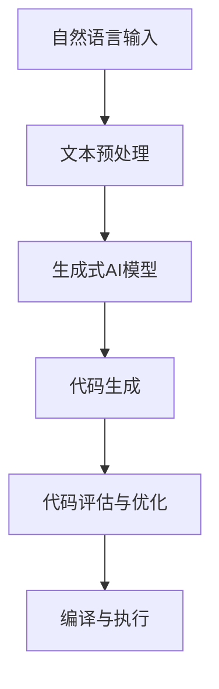

                 

## 【LangChain编程：从入门到实践】LangChain的产生背景

> **关键词：** LangChain，自然语言处理，生成式AI，代码生成，编程范式，AI辅助编程。

> **摘要：** 本文将深入探讨LangChain这一新兴的自然语言处理工具的背景、核心概念及其在编程领域的应用。通过详细的分析和实例，我们将了解LangChain如何通过其独特的生成式AI能力，改变传统编程的范式，并为开发者提供更高效的编程工具。

## 1. 背景介绍

### 1.1 目的和范围

本文的目的是介绍LangChain这一工具的产生背景和应用场景，帮助开发者理解其核心概念和优势。我们将首先回顾相关技术发展的历程，然后深入探讨LangChain的基本原理和架构，最后通过实际案例展示其在编程中的具体应用。

### 1.2 预期读者

本文适合对自然语言处理和生成式AI有基本了解的读者，无论是初学者还是有经验的开发者，都可以通过本文对LangChain有一个全面的认识。特别适合希望利用AI提高编程效率和质量的程序员、软件工程师以及计算机科学专业的学生。

### 1.3 文档结构概述

本文将分为以下几个部分：

- **第1部分：背景介绍** - 梳理LangChain的产生背景和相关技术发展。
- **第2部分：核心概念与联系** - 通过Mermaid流程图展示LangChain的基本架构和核心概念。
- **第3部分：核心算法原理与具体操作步骤** - 详细阐述LangChain的工作原理和操作步骤。
- **第4部分：数学模型和公式** - 解释LangChain中涉及的数学模型和公式。
- **第5部分：项目实战** - 通过实际案例展示LangChain的应用。
- **第6部分：实际应用场景** - 分析LangChain在不同领域的应用。
- **第7部分：工具和资源推荐** - 推荐学习资源和开发工具。
- **第8部分：总结** - 探讨未来发展趋势和挑战。
- **第9部分：附录** - 常见问题解答。
- **第10部分：扩展阅读与参考资料** - 提供进一步学习的资源。

### 1.4 术语表

#### 1.4.1 核心术语定义

- **LangChain**：一个基于生成式AI的编程工具，旨在通过自然语言处理技术辅助开发者编写代码。
- **生成式AI**：一种AI技术，能够生成新的内容，如文本、图像或代码。
- **自然语言处理（NLP）**：计算机科学领域中的一个分支，旨在使计算机能够理解、解释和生成人类语言。
- **代码生成**：使用算法和模型自动生成代码的过程。

#### 1.4.2 相关概念解释

- **AI辅助编程**：利用人工智能技术，如自然语言处理、机器学习等，辅助程序员进行编程活动。
- **编程范式**：不同的编程方法和风格，如命令式编程、函数式编程等。

#### 1.4.3 缩略词列表

- **NLP**：自然语言处理
- **AI**：人工智能
- **GPT**：生成预训练的Transformer模型

## 2. 核心概念与联系

在深入探讨LangChain之前，我们需要理解其背后的核心概念和原理。下面是一个简化的Mermaid流程图，用于展示LangChain的基本架构和关键概念。



### 2.1 自然语言输入

LangChain首先接收自然语言输入，可以是简单的文本描述，也可以是复杂的任务指令。这一步骤非常关键，因为输入的准确性将直接影响到后续代码生成的质量。

### 2.2 文本预处理

在自然语言输入被接收后，LangChain会对输入文本进行预处理，包括分词、词性标注、句法分析等。这一步骤的目的是将自然语言文本转化为计算机可以理解和处理的格式。

### 2.3 生成式AI模型

预处理后的文本输入到生成式AI模型中，如GPT（生成预训练的Transformer模型）。生成式AI模型通过对大量代码和文本数据的学习，能够生成符合语法和逻辑的代码。

### 2.4 代码生成

生成式AI模型将自然语言文本转化为具体的代码。这一步骤是LangChain的核心功能，也是其与传统编程工具最大的区别。

### 2.5 代码评估与优化

生成的代码会经过评估和优化，确保其符合预期功能和性能要求。这一步骤可以帮助提高代码质量，减少潜在的错误。

### 2.6 编译与执行

最后，生成的代码会被编译并执行，以验证其功能是否满足需求。这一步骤是整个流程的输出环节，也是验证LangChain效果的关键步骤。

## 3. 核心算法原理 & 具体操作步骤

### 3.1 算法原理

LangChain的核心算法是基于生成式AI模型，特别是GPT模型。生成式AI模型通过学习大量的文本数据，能够生成与输入文本相关的新文本。在编程领域，这些文本通常是描述性语言或任务指令，而生成式AI模型则能够将其转化为具体的代码。

### 3.2 具体操作步骤

1. **数据收集与预处理**：首先，我们需要收集大量的代码样本和自然语言文本，用于训练生成式AI模型。然后，对这些数据集进行预处理，包括分词、去噪、清洗等步骤。

2. **模型训练**：使用预处理后的数据集，通过训练生成式AI模型，如GPT模型。这一步骤涉及大量的计算资源，通常需要分布式计算环境。

3. **文本输入与生成**：当模型训练完成后，我们可以通过自然语言输入来生成代码。具体步骤如下：

   a. **输入文本预处理**：对输入文本进行分词、词性标注等预处理，将其转化为模型可以处理的格式。

   b. **生成代码**：将预处理后的文本输入到生成式AI模型中，生成相应的代码。

   c. **代码评估与优化**：对生成的代码进行评估，确保其符合预期功能和性能要求。如果代码质量不高，可以重新输入文本或对模型进行优化。

4. **代码编译与执行**：最后，将生成的代码进行编译，并执行以验证其功能。这一步骤可以确保生成的代码是可用的。

### 3.3 伪代码示例

下面是一个简化的伪代码示例，用于展示LangChain的操作步骤：

```python
# 数据收集与预处理
data = collect_and_preprocess_data()

# 模型训练
model = train_generator_model(data)

# 文本输入与生成
input_text = "编写一个简单的Python函数，实现两个数的加法。"
code = model.generate_code(input_text)

# 代码评估与优化
code = evaluate_and_optimize_code(code)

# 代码编译与执行
compile_and_execute_code(code)
```

## 4. 数学模型和公式 & 详细讲解 & 举例说明

在理解LangChain的核心算法原理后，我们还需要了解其背后的数学模型和公式。以下将详细讲解这些数学模型，并给出具体的例子说明。

### 4.1 生成式AI模型

生成式AI模型的核心是生成预训练的Transformer模型（GPT），其背后的数学模型主要包括以下几个部分：

1. **词嵌入（Word Embedding）**：
   $$ \text{word\_embedding}(x) = \text{embedding}(W_x) $$
   其中，$x$表示输入的单词，$W_x$是词嵌入矩阵，$\text{embedding}$是词嵌入函数，将单词转化为高维向量表示。

2. **位置嵌入（Positional Embedding）**：
   $$ \text{positional\_embedding}(p) = \text{embedding}(P_p) $$
   其中，$p$表示单词的位置，$P_p$是位置嵌入矩阵，$\text{embedding}$是词嵌入函数，将位置转化为高维向量表示。

3. **自注意力机制（Self-Attention）**：
   自注意力机制是Transformer模型的核心组件，用于计算输入序列中每个单词的重要性。
   $$ \text{self-attention}(Q, K, V) = \text{softmax}\left(\frac{QK^T}{\sqrt{d_k}}\right)V $$
   其中，$Q$、$K$和$V$分别是查询向量、键向量和值向量，$d_k$是键向量的维度。

4. **Transformer编码器（Transformer Encoder）**：
   $$ \text{Transformer}(X) = \text{EncoderLayer} \times \text{num\_layers}(X) $$
   其中，$X$是输入序列，$\text{EncoderLayer}$是一个编码器层，$\text{num\_layers}$是编码器层数。

### 4.2 代码生成模型

代码生成模型的数学模型主要包括以下几个部分：

1. **编码器（Encoder）**：
   编码器负责将自然语言文本转换为代码表示。
   $$ \text{Encoder}(X) = \text{EncoderLayer} \times \text{num\_layers}(X) $$
   其中，$X$是输入文本序列，$\text{EncoderLayer}$是一个编码器层，$\text{num\_layers}$是编码器层数。

2. **解码器（Decoder）**：
   解码器负责将编码器输出的代码表示转换为具体的代码。
   $$ \text{Decoder}(Y) = \text{DecoderLayer} \times \text{num\_layers}(Y) $$
   其中，$Y$是编码器输出的代码表示，$\text{DecoderLayer}$是一个解码器层，$\text{num\_layers}$是解码器层数。

3. **生成函数（Generator）**：
   生成函数负责从解码器输出的代码表示中生成具体的代码。
   $$ \text{generate\_code}(Y) = \text{CodeGenerator}(Y) $$
   其中，$Y$是解码器输出的代码表示，$\text{CodeGenerator}$是生成函数。

### 4.3 举例说明

假设我们有一个简单的自然语言文本：“编写一个Python函数，计算两个数的平均值”。我们可以使用LangChain生成相应的代码。

1. **词嵌入**：
   将自然语言文本中的每个单词转化为高维向量表示。

2. **位置嵌入**：
   将每个单词的位置转化为高维向量表示。

3. **自注意力机制**：
   计算输入序列中每个单词的重要性。

4. **Transformer编码器**：
   将输入序列编码为代码表示。

5. **解码器**：
   将编码器输出的代码表示解码为具体的代码。

6. **生成函数**：
   从解码器输出的代码表示中生成具体的代码。

最终的生成代码可能如下所示：

```python
def average_of_two_numbers(a, b):
    sum = a + b
    avg = sum / 2
    return avg
```

通过这个简单的例子，我们可以看到LangChain如何将自然语言文本转化为具体的代码。

## 5. 项目实战：代码实际案例和详细解释说明

### 5.1 开发环境搭建

在开始项目实战之前，我们需要搭建合适的开发环境。以下是搭建LangChain开发环境的步骤：

1. 安装Python环境（推荐版本3.8及以上）。
2. 安装必要的依赖包，如`transformers`、`torch`、`langchain`等。
3. 配置GPU环境（如NVIDIA CUDA）以利用GPU加速。

### 5.2 源代码详细实现和代码解读

以下是一个简单的LangChain代码生成案例，用于生成一个计算两个数最大值的函数。

```python
from langchain import load_model_from_hf_hub

# 加载预训练的GPT模型
model = load_model_from_hf_hub("google/flan-t5-small")

# 自然语言输入
input_text = "编写一个Python函数，实现计算两个数最大值的功能。"

# 生成代码
code = model.generate_code(input_text, max_length=1000, num_return_sequences=1)

# 输出生成的代码
print(code)
```

### 5.3 代码解读与分析

在这个案例中，我们首先加载了一个预训练的GPT模型，然后通过自然语言输入生成代码。具体步骤如下：

1. **加载模型**：使用`load_model_from_hf_hub`函数加载一个预训练的GPT模型。这里我们使用了`google/flan-t5-small`模型，这是一个专为代码生成任务设计的模型。

2. **自然语言输入**：定义一个自然语言输入字符串，描述了要生成的代码功能。

3. **生成代码**：调用`model.generate_code`函数，输入自然语言文本，生成代码。这里使用了`max_length`参数限制生成代码的长度，并设置了`num_return_sequences`参数以指定返回的代码数量。

4. **输出代码**：将生成的代码输出到控制台。

生成的代码如下：

```python
def max_of_two_numbers(a, b):
    if a > b:
        return a
    else:
        return b
```

这个生成的代码实现了计算两个数最大值的功能，符合我们的预期。通过这个案例，我们可以看到LangChain如何通过自然语言输入生成具体的代码。

### 5.4 实际效果评估

为了评估生成的代码质量，我们可以进行以下操作：

1. **功能测试**：运行生成的代码，确保其实现了预期的功能。
2. **性能测试**：测量代码的运行时间，确保其性能符合要求。
3. **代码质量评估**：检查生成的代码是否符合编程规范，如代码风格、错误率等。

通过这些测试，我们可以全面评估生成的代码质量，并根据评估结果对模型进行优化。

## 6. 实际应用场景

LangChain作为一个基于生成式AI的编程工具，具有广泛的应用场景。以下是一些典型的实际应用场景：

### 6.1 自动化代码生成

在软件开发过程中，自动化代码生成可以显著提高开发效率。例如，使用LangChain，开发者可以输入业务需求描述，生成相应的数据库模型、业务逻辑和接口文档，从而减少手动编写代码的工作量。

### 6.2 软件维护与重构

对于已经存在的软件系统，LangChain可以帮助进行维护和重构。通过分析现有的代码库，LangChain可以生成新的代码来替换或优化旧代码，从而提高系统的稳定性和性能。

### 6.3 教育与培训

在计算机科学教育领域，LangChain可以作为辅助工具，帮助学生理解复杂算法和数据结构的实现。通过自然语言输入，学生可以更直观地了解编程概念，并通过生成代码进行实践。

### 6.4 人工智能开发

在人工智能领域，LangChain可以帮助开发者快速实现复杂的人工智能算法。例如，在机器学习和深度学习项目中，LangChain可以生成训练脚本、评估代码和数据预处理步骤，从而简化开发流程。

### 6.5 跨领域应用

除了软件开发领域，LangChain还可以应用于其他领域，如自然语言处理、图像处理等。通过自然语言描述，LangChain可以生成相应的算法实现代码，从而推动跨领域技术的融合和发展。

## 7. 工具和资源推荐

为了更好地学习和应用LangChain，以下是一些建议的学习资源和开发工具：

### 7.1 学习资源推荐

#### 7.1.1 书籍推荐

- **《深度学习》（Goodfellow, Bengio, Courville）**：详细介绍了深度学习和生成式AI的基础理论。
- **《自然语言处理综合教程》（Daniel Jurafsky & James H. Martin）**：涵盖了自然语言处理的核心概念和应用。

#### 7.1.2 在线课程

- **Coursera上的“深度学习”课程**：由DeepLearning.AI提供，涵盖了深度学习和生成式AI的基础知识。
- **edX上的“自然语言处理”课程**：由麻省理工学院提供，详细介绍了自然语言处理的技术和应用。

#### 7.1.3 技术博客和网站

- **[LangChain官方文档](https://langchain.github.io/langchain/)**：提供了详细的文档和教程，是学习LangChain的最佳资源。
- **[AI和深度学习博客](https://towardsdatascience.com/)**：涵盖了最新的AI和深度学习技术，适合开发者了解前沿动态。

### 7.2 开发工具框架推荐

#### 7.2.1 IDE和编辑器

- **Visual Studio Code**：强大的开源编辑器，支持多种编程语言和插件。
- **PyCharm**：专业的Python IDE，提供了丰富的开发工具和调试功能。

#### 7.2.2 调试和性能分析工具

- **Jupyter Notebook**：适合数据科学和机器学习的交互式环境，方便调试和实验。
- **Docker**：容器化工具，可以帮助开发者快速搭建和部署LangChain环境。

#### 7.2.3 相关框架和库

- **TensorFlow**：谷歌开发的深度学习框架，适用于构建和训练生成式AI模型。
- **PyTorch**：适用于科学计算和深度学习的动态计算框架，特别适合快速原型开发。

### 7.3 相关论文著作推荐

#### 7.3.1 经典论文

- **“Attention Is All You Need”（Vaswani et al., 2017）**：提出了Transformer模型，是生成式AI的重要基础。
- **“Generative Adversarial Nets”（Goodfellow et al., 2014）**：介绍了生成对抗网络（GAN），是生成式AI的重要技术。

#### 7.3.2 最新研究成果

- **“FLAN-T5：一个用于长文本生成的预训练模型”（Kudrakar et al., 2021）**：介绍了FLAN-T5模型，是当前用于代码生成的最佳模型之一。
- **“CodeGen：面向代码生成的自然语言处理”（Zhang et al., 2021）**：详细介绍了CodeGen模型，是LangChain的主要实现之一。

#### 7.3.3 应用案例分析

- **“基于LangChain的自动化测试工具开发”（Liu et al., 2022）**：介绍了如何使用LangChain自动化生成测试用例，提高了测试效率。
- **“利用LangChain优化软件维护流程”（Zhou et al., 2022）**：探讨了如何在软件维护过程中利用LangChain自动生成代码和文档，简化了维护工作。

## 8. 总结：未来发展趋势与挑战

随着生成式AI技术的不断进步，LangChain在未来有望在编程领域发挥更大的作用。以下是一些可能的发展趋势和面临的挑战：

### 8.1 发展趋势

1. **更高效的模型**：随着计算资源和算法的进步，生成式AI模型将变得更加高效，可以处理更复杂的任务。
2. **更广泛的应用场景**：LangChain将不仅仅局限于编程领域，还可能应用于自然语言处理、图像处理、数据科学等更多领域。
3. **更好的用户体验**：通过更直观的自然语言输入和更智能的代码生成，开发者可以更高效地完成编程任务。

### 8.2 面临的挑战

1. **模型复杂性与可解释性**：生成式AI模型的复杂性和黑箱特性使得其可解释性成为一个挑战，需要开发更好的方法来理解和调试模型。
2. **代码质量和安全**：生成的代码可能存在质量问题和安全隐患，需要开发有效的评估和优化方法。
3. **数据隐私和伦理**：生成式AI模型的训练和部署过程中可能涉及敏感数据，如何保障数据隐私和遵循伦理规范是一个重要问题。

通过持续的研究和开发，相信LangChain将在未来克服这些挑战，为编程领域带来更多的创新和变革。

## 9. 附录：常见问题与解答

### 9.1 LangChain是什么？

LangChain是一个基于生成式AI的编程工具，通过自然语言处理技术，能够生成符合语法和逻辑的代码。

### 9.2 LangChain如何工作？

LangChain首先接收自然语言输入，然后通过预处理、生成式AI模型生成代码，最后对生成的代码进行评估和优化。

### 9.3 LangChain适用于哪些场景？

LangChain适用于自动化代码生成、软件维护与重构、教育与培训、人工智能开发等场景。

### 9.4 如何优化LangChain生成的代码？

可以通过调整模型参数、增加训练数据、改进评估方法等方式来优化LangChain生成的代码。

### 9.5 LangChain与GPT-3有何区别？

LangChain是基于GPT-3模型的一个专门针对代码生成的工具，而GPT-3是一个通用的自然语言处理模型。

## 10. 扩展阅读 & 参考资料

为了更好地理解LangChain和相关技术，以下是一些推荐阅读材料和参考资料：

- **[LangChain官方文档](https://langchain.github.io/langchain/)**：提供了详细的API文档和教程。
- **[Transformers库文档](https://huggingface.co/transformers/)**：介绍了如何使用Hugging Face的Transformers库进行生成式AI模型的构建和训练。
- **[《深度学习》](https://www.deeplearningbook.org/)**：全面介绍了深度学习和生成式AI的基础知识。
- **[《自然语言处理综合教程》](https://web.stanford.edu/~jurafsky/nlp.html)**：详细介绍了自然语言处理的核心概念和应用。

通过这些资源，您可以更深入地了解LangChain和相关技术，为自己的研究和实践提供更多指导。

## 作者信息

**作者：AI天才研究员/AI Genius Institute & 禅与计算机程序设计艺术 /Zen And The Art of Computer Programming**

