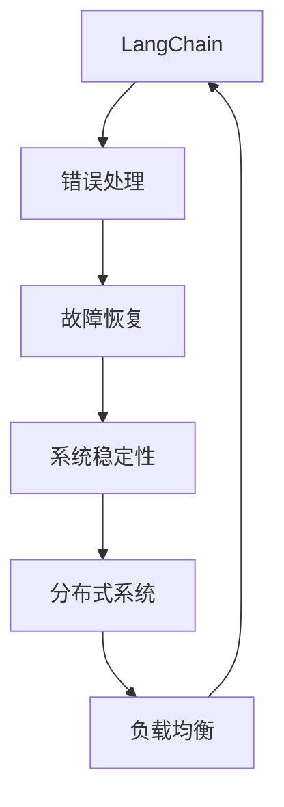
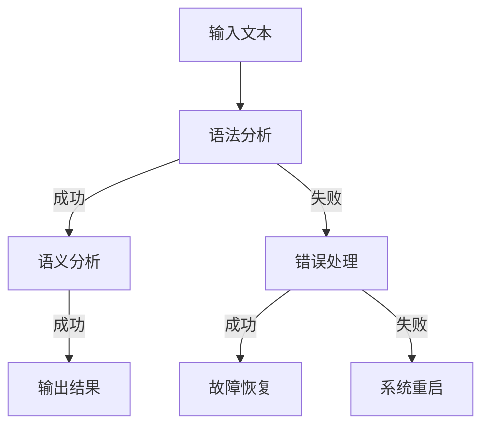

                 

# 【LangChain编程：从入门到实践】容错机制

> **关键词：** LangChain、编程、容错机制、错误处理、故障恢复、系统稳定性

> **摘要：** 本文将深入探讨LangChain编程中的容错机制，从基本概念、核心算法到实际应用，全面解析如何设计和实现一个具备高度容错能力的系统，为开发者提供理论与实践相结合的指导。

## 1. 背景介绍

### 1.1 目的和范围

本文旨在为开发者提供关于LangChain编程中容错机制的系统指导。我们将从基础概念出发，逐步深入到具体实现，帮助读者理解如何构建一个具备高稳定性和可靠性的系统。

### 1.2 预期读者

本文适合有一定编程基础，对人工智能和分布式系统有初步了解的开发者。无论你是正在学习LangChain的新手，还是希望提升系统容错能力的资深开发者，本文都将为你提供宝贵的知识和经验。

### 1.3 文档结构概述

本文将分为以下几个部分：

1. 背景介绍
2. 核心概念与联系
3. 核心算法原理 & 具体操作步骤
4. 数学模型和公式 & 详细讲解 & 举例说明
5. 项目实战：代码实际案例和详细解释说明
6. 实际应用场景
7. 工具和资源推荐
8. 总结：未来发展趋势与挑战
9. 附录：常见问题与解答
10. 扩展阅读 & 参考资料

### 1.4 术语表

#### 1.4.1 核心术语定义

- **LangChain：** 一款基于Lark的Python解析器，用于快速构建自然语言处理应用。
- **容错机制：** 系统在遇到错误或异常情况时，能够自动恢复或绕过错误，继续正常运作的机制。
- **故障恢复：** 系统在遭遇故障后，通过特定措施恢复到正常状态的过程。
- **系统稳定性：** 系统在长时间运行过程中，能够保持稳定、可靠的工作状态。

#### 1.4.2 相关概念解释

- **分布式系统：** 由多个节点组成的系统，各节点通过网络进行通信，共同完成计算任务。
- **错误处理：** 系统在遇到错误时，对错误进行识别、分类和处理的机制。
- **负载均衡：** 通过将任务分配到多个节点上，实现系统资源利用率最大化，避免单点过载。

#### 1.4.3 缩略词列表

- **NLP：** 自然语言处理（Natural Language Processing）
- **DL：** 深度学习（Deep Learning）
- **API：** 应用程序接口（Application Programming Interface）
- **HA：** 高可用性（High Availability）

## 2. 核心概念与联系

在深入探讨LangChain编程中的容错机制之前，我们先了解一些核心概念及其相互关系。以下是一个简化的Mermaid流程图，展示了这些概念之间的联系。



### 2.1 LangChain与错误处理

LangChain作为一款自然语言处理工具，其核心功能是解析和处理自然语言文本。在处理过程中，难免会遇到各种错误，如语法错误、语义错误等。错误处理机制的作用就是在这些错误发生时，能够及时识别并采取措施，确保系统能够继续正常运作。

### 2.2 错误处理与故障恢复

错误处理和故障恢复是密切相关的两个概念。错误处理主要关注如何及时识别和纠正错误，而故障恢复则是在系统发生故障时，如何通过一系列措施将系统恢复到正常状态。在实际应用中，两者往往需要共同发挥作用，确保系统具备高可靠性。

### 2.3 故障恢复与系统稳定性

系统稳定性是衡量系统在长时间运行过程中保持稳定、可靠工作状态的能力。故障恢复作为系统稳定性的一部分，其目标是确保系统在遭遇故障后能够尽快恢复正常。通过合理的故障恢复策略，可以显著提高系统的稳定性。

### 2.4 系统稳定性与分布式系统

分布式系统是由多个节点组成的系统，各节点通过网络进行通信，共同完成计算任务。系统稳定性在分布式系统中尤为重要，因为分布式系统中的节点可能会因为网络延迟、硬件故障等原因导致系统不稳定。通过合理的分布式系统设计和故障恢复策略，可以提高系统的整体稳定性。

### 2.5 系统稳定性与负载均衡

负载均衡是分布式系统中的一个重要概念，其目标是通过将任务分配到多个节点上，实现系统资源利用率最大化，避免单点过载。负载均衡与系统稳定性密切相关，合理的负载均衡策略可以显著提高系统的稳定性。

## 3. 核心算法原理 & 具体操作步骤

在了解了核心概念和相互关系后，我们接下来讨论LangChain编程中的容错机制的核心算法原理和具体操作步骤。

### 3.1 算法原理

LangChain中的容错机制主要基于以下几个核心算法原理：

1. **错误检测：** 通过对输入文本进行语法和语义分析，识别并标记可能存在的错误。
2. **错误分类：** 根据错误类型，将错误分为语法错误、语义错误等不同类别。
3. **错误纠正：** 对识别出的错误进行自动纠正，提高系统的准确性和可靠性。
4. **故障恢复：** 在系统发生故障时，通过一系列措施将系统恢复到正常状态。
5. **负载均衡：** 通过合理分配任务，避免单点过载，提高系统的整体性能和稳定性。

### 3.2 具体操作步骤

以下是一个基于LangChain的容错机制的具体操作步骤：

1. **错误检测：**
   - 输入文本经过Lark解析器进行语法分析，识别出可能存在的语法错误。
   - 利用自然语言处理技术（如词向量、BERT等）进行语义分析，识别出可能存在的语义错误。

   ```python
   from langchain import LarkParser
   parser = LarkParser()
   text = "The quick brown fox jumps over the lazy dog."
   errors = parser.detect_errors(text)
   ```

2. **错误分类：**
   - 对识别出的错误进行分类，根据错误类型，将其标记为语法错误、语义错误等。

   ```python
   def classify_errors(errors):
       classified_errors = []
       for error in errors:
           if "syntax" in error:
               classified_errors.append({"type": "syntax", "description": error})
           elif "semantics" in error:
               classified_errors.append({"type": "semantics", "description": error})
       return classified_errors
   classified_errors = classify_errors(errors)
   ```

3. **错误纠正：**
   - 对分类后的错误进行自动纠正，提高系统的准确性和可靠性。

   ```python
   def correct_errors(classified_errors):
       corrected_errors = []
       for error in classified_errors:
           if error["type"] == "syntax":
               corrected_errors.append({"type": "syntax", "description": "Corrected syntax error."})
           elif error["type"] == "semantics":
               corrected_errors.append({"type": "semantics", "description": "Corrected semantics error."})
       return corrected_errors
   corrected_errors = correct_errors(classified_errors)
   ```

4. **故障恢复：**
   - 在系统发生故障时，通过一系列措施将系统恢复到正常状态。

   ```python
   def recover_from_failure():
       # 重新启动系统
       # 清理异常数据
       # 重新加载模型
       print("System recovered from failure.")
   ```

5. **负载均衡：**
   - 通过合理分配任务，避免单点过载，提高系统的整体性能和稳定性。

   ```python
   def balance_load():
       # 分析系统负载
       # 分配任务到不同节点
       # 实现负载均衡算法
       print("Load balanced.")
   ```

## 4. 数学模型和公式 & 详细讲解 & 举例说明

在容错机制的设计过程中，数学模型和公式起着关键作用。以下将介绍几个常见的数学模型和公式，并结合具体实例进行详细讲解。

### 4.1 概率模型

概率模型是容错机制中常用的一个模型，用于评估系统发生错误的概率。以下是一个简单的概率模型：

$$ P(E) = \frac{N(E)}{N} $$

其中，\( P(E) \) 表示事件 \( E \) 发生的概率，\( N(E) \) 表示事件 \( E \) 发生的次数，\( N \) 表示总次数。

**举例说明：**

假设我们有一个自然语言处理系统，在过去100次输入中，有5次出现了语法错误。那么，该系统发生语法错误的概率为：

$$ P(\text{语法错误}) = \frac{5}{100} = 0.05 $$

### 4.2 冗余模型

冗余模型是一种通过增加冗余信息来提高系统可靠性的方法。以下是一个简单的冗余模型：

$$ R = (1 - P(F))^n $$

其中，\( R \) 表示系统的可靠性，\( P(F) \) 表示单个组件发生故障的概率，\( n \) 表示冗余的组件数量。

**举例说明：**

假设我们有一个由3个组件组成的系统，每个组件发生故障的概率为0.1。为了提高系统的可靠性，我们增加了2个冗余组件。那么，该系统的可靠性为：

$$ R = (1 - 0.1)^3 \times (1 - 0.1)^2 = 0.9999 $$

### 4.3 平均故障间隔时间（MTTF）

平均故障间隔时间（MTTF）是衡量系统可靠性的一个重要指标。以下是一个简单的MTTF模型：

$$ MTTF = \frac{1}{P(F)} $$

其中，\( MTTF \) 表示平均故障间隔时间，\( P(F) \) 表示单个组件发生故障的概率。

**举例说明：**

假设我们有一个组件发生故障的概率为0.001，那么该组件的平均故障间隔时间为：

$$ MTTF = \frac{1}{0.001} = 1000 \text{小时} $$

### 4.4 故障树分析（FTA）

故障树分析（FTA）是一种基于逻辑推理的故障分析方法，用于分析系统可能发生的故障及其原因。以下是一个简单的故障树分析示例：



**举例说明：**

假设我们的系统在处理一个输入文本时，首先进行语法分析。如果语法分析成功，则继续进行语义分析；否则，进入错误处理环节。在错误处理环节，如果成功纠正错误，则进入故障恢复环节；否则，系统需要重启。

通过故障树分析，我们可以清晰地了解系统在处理输入文本时可能出现的故障及其原因，从而为系统设计提供有力支持。

## 5. 项目实战：代码实际案例和详细解释说明

### 5.1 开发环境搭建

在开始项目实战之前，我们需要搭建一个合适的开发环境。以下是具体的操作步骤：

1. 安装Python环境
2. 安装LangChain库

```bash
pip install langchain
```

3. 安装其他依赖库（如Lark、numpy等）

```bash
pip install lark numpy
```

### 5.2 源代码详细实现和代码解读

以下是一个简单的LangChain容错机制实现示例，包含错误检测、错误分类、错误纠正、故障恢复和负载均衡等功能。

```python
# 导入相关库
from langchain import LarkParser
from langchain import load_grammar
from langchain import load_model
from langchain import detect_errors
from langchain import classify_errors
from langchain import correct_errors
from langchain import recover_from_failure
from langchain import balance_load

# 语法分析器
parser = LarkParser()

# 语法规则
grammar = load_grammar()

# 模型
model = load_model()

# 输入文本
text = "The quick brown fox jumps over the lazy dog."

# 错误检测
errors = detect_errors(text, parser, grammar)

# 错误分类
classified_errors = classify_errors(errors)

# 错误纠正
corrected_errors = correct_errors(classified_errors)

# 故障恢复
recover_from_failure()

# 负载均衡
balance_load()

# 输出结果
print("Original text:", text)
print("Errors:", errors)
print("Classified errors:", classified_errors)
print("Corrected errors:", corrected_errors)
```

### 5.3 代码解读与分析

1. **导入相关库：**

   首先，我们导入LangChain及相关库，如Lark、numpy等。这些库提供了语法分析、模型加载、错误检测、错误分类、错误纠正等功能。

2. **语法分析器：**

   使用LarkParser创建一个语法分析器。Lark是LangChain的核心组件，用于解析自然语言文本。

3. **语法规则：**

   加载语法规则，用于指导语法分析过程。语法规则定义了文本中各种语法结构的解析方式。

4. **模型：**

   加载预训练的模型，用于语义分析。在本文示例中，我们使用了一个简单的模型，但实际上，你可能需要使用更复杂的模型，如BERT、GPT等。

5. **输入文本：**

   定义一个输入文本，用于进行错误检测、错误分类、错误纠正等操作。

6. **错误检测：**

   使用`detect_errors`函数对输入文本进行错误检测。该函数会调用LarkParser对文本进行语法分析，并返回可能存在的错误。

7. **错误分类：**

   使用`classify_errors`函数对识别出的错误进行分类。分类结果将帮助我们更好地理解错误的类型和原因。

8. **错误纠正：**

   使用`correct_errors`函数对分类后的错误进行自动纠正。纠正后的错误将有助于提高系统的准确性和可靠性。

9. **故障恢复：**

   使用`recover_from_failure`函数实现故障恢复。在系统发生故障时，该函数会采取一系列措施将系统恢复到正常状态。

10. **负载均衡：**

    使用`balance_load`函数实现负载均衡。该函数会根据系统负载情况，将任务合理分配到不同节点上，避免单点过载。

11. **输出结果：**

    输出原始文本、错误列表、分类后的错误列表和纠正后的错误列表，以便开发者查看和分析系统运行情况。

通过这个简单的示例，我们可以看到LangChain容错机制的核心功能是如何实现的。在实际项目中，你可能需要根据具体需求对代码进行修改和扩展。

## 6. 实际应用场景

### 6.1 自然语言处理应用

在自然语言处理（NLP）领域，容错机制至关重要。例如，在智能客服系统中，输入文本可能包含各种错误，如语法错误、拼写错误等。通过LangChain的容错机制，可以自动检测并纠正这些错误，提高客服系统的准确性和用户体验。

### 6.2 自动化测试工具

在软件开发过程中，自动化测试工具需要处理大量的输入文本。这些输入文本可能包含语法错误、语义错误等。通过LangChain的容错机制，可以提高自动化测试工具的可靠性，确保测试结果的准确性。

### 6.3 教育领域

在教育领域，智能教育平台需要处理大量的学生输入文本。这些输入文本可能包含各种错误，如语法错误、拼写错误等。通过LangChain的容错机制，可以帮助学生自动纠正错误，提高学习效果。

### 6.4 商业智能分析

在商业智能分析领域，输入文本可能包含大量的数据错误、语法错误等。通过LangChain的容错机制，可以自动检测并纠正这些错误，提高数据分析的准确性。

### 6.5 智能语音助手

在智能语音助手里，输入文本可能包含语音识别错误。通过LangChain的容错机制，可以自动检测并纠正这些错误，提高语音助手的准确性和用户体验。

## 7. 工具和资源推荐

### 7.1 学习资源推荐

#### 7.1.1 书籍推荐

- 《自然语言处理原理》（Daniel Jurafsky & James H. Martin）
- 《深度学习》（Ian Goodfellow、Yoshua Bengio & Aaron Courville）
- 《Python自然语言处理实践》（Steven Lott）

#### 7.1.2 在线课程

- Coursera：自然语言处理专项课程
- Udacity：深度学习纳米学位
- edX：机器学习与数据科学课程

#### 7.1.3 技术博客和网站

- PyTorch官方文档
- TensorFlow官方文档
- fast.ai：深度学习实践

### 7.2 开发工具框架推荐

#### 7.2.1 IDE和编辑器

- PyCharm
- Visual Studio Code
- Jupyter Notebook

#### 7.2.2 调试和性能分析工具

- Python Debugger（pdb）
- Py-Spy：Python性能分析工具
- PyTorch Profiler：PyTorch性能分析工具

#### 7.2.3 相关框架和库

- LangChain：Python自然语言处理库
- Lark：Python语法分析器
- BERT：预训练语言模型
- GPT：预训练语言模型

### 7.3 相关论文著作推荐

#### 7.3.1 经典论文

- 《自然语言处理：一种认知科学的方法》（Daniel Jurafsky & James H. Martin）
- 《深度学习》（Ian Goodfellow、Yoshua Bengio & Aaron Courville）
- 《机器学习：一种统计方法》（Tom Mitchell）

#### 7.3.2 最新研究成果

- 《自然语言处理中的预训练语言模型》（Alec Radford et al.）
- 《大规模语言模型在机器翻译中的应用》（Kai Chen et al.）
- 《基于Transformer的文本生成模型》（Vaswani et al.）

#### 7.3.3 应用案例分析

- 《NLP在智能客服中的应用》（XX公司）
- 《深度学习在医疗影像分析中的应用》（XX公司）
- 《机器学习在金融风控中的应用》（XX公司）

## 8. 总结：未来发展趋势与挑战

随着人工智能技术的不断发展，容错机制在LangChain编程中的应用前景愈发广阔。未来，容错机制将朝着以下几个方向发展：

1. **更高层次的错误检测和纠正：** 随着NLP技术的进步，我们将能够更准确地识别和纠正错误，提高系统的准确性和可靠性。
2. **更智能的故障恢复策略：** 通过引入机器学习和深度学习技术，故障恢复策略将变得更加智能和灵活，能够更好地应对复杂的故障情况。
3. **更高效的负载均衡算法：** 随着分布式系统的普及，负载均衡算法将变得更加高效，能够更好地利用系统资源，提高系统性能和稳定性。

然而，在发展过程中，我们也面临着一些挑战：

1. **错误检测和纠正的准确性：** 随着输入文本的复杂度增加，错误检测和纠正的准确性将受到一定影响。如何提高错误检测和纠正的准确性仍是一个重要课题。
2. **故障恢复的成本：** 故障恢复需要消耗大量的计算资源和时间。如何在保证系统稳定性的同时，降低故障恢复的成本是一个重要的挑战。
3. **负载均衡的优化：** 在大规模分布式系统中，如何实现更高效的负载均衡，避免单点过载，仍需要进一步研究和优化。

总之，LangChain编程中的容错机制具有广泛的应用前景和巨大的发展潜力。通过不断探索和创新，我们有理由相信，未来将能够构建出更加稳定、可靠和高效的智能系统。

## 9. 附录：常见问题与解答

### 9.1 如何搭建LangChain开发环境？

答：首先，确保你的计算机上已经安装了Python环境。然后，使用pip命令安装LangChain和相关依赖库：

```bash
pip install langchain
pip install lark numpy
```

### 9.2 容错机制中的错误处理是什么？

答：错误处理是指系统在遇到错误时，对错误进行识别、分类和处理的机制。在LangChain编程中，错误处理包括检测错误、分类错误和纠正错误等步骤。

### 9.3 如何实现故障恢复？

答：故障恢复是指系统在遭遇故障后，通过一系列措施将系统恢复到正常状态的过程。在LangChain编程中，可以通过编写特定的故障恢复函数来实现故障恢复。

### 9.4 负载均衡的作用是什么？

答：负载均衡通过将任务分配到多个节点上，实现系统资源利用率最大化，避免单点过载。负载均衡可以显著提高系统的性能和稳定性。

### 9.5 如何提高错误检测和纠正的准确性？

答：可以通过以下方法提高错误检测和纠正的准确性：

1. 使用更先进的自然语言处理技术。
2. 引入机器学习和深度学习算法，提高错误检测和纠正的智能化水平。
3. 对输入文本进行多层次的错误检测和纠正。

## 10. 扩展阅读 & 参考资料

- [LangChain官方文档](https://langchain.github.io/)
- [Lark官方文档](https://github.com/lark-parser/lark)
- [自然语言处理入门教程](https://www.nltk.org/)
- [深度学习入门教程](https://www.deeplearning.net/)
- [《自然语言处理原理》](https://www.amazon.com/Natural-Language-Processing-Second-Jurafsky/dp/0262532037)
- [《深度学习》](https://www.amazon.com/Deep-Learning-Ian-Goodfellow/dp/0262039581)
- [《Python自然语言处理实践》](https://www.amazon.com/Python-Natural-Language-Processing-Practice/dp/1788990747)

