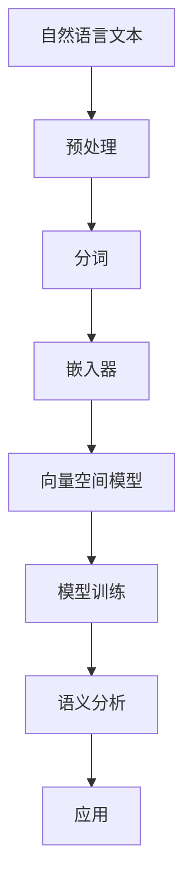

                 

# 【LangChain编程：从入门到实践】文本嵌入

> 关键词：LangChain、文本嵌入、编码实践、模型原理、应用场景

> 摘要：本文将深入探讨LangChain编程中的文本嵌入技术，从基础概念到实际应用，逐步引导读者掌握这一关键技术。我们将详细讲解文本嵌入的原理、数学模型，并通过实际案例展示其在现代AI系统中的重要性。

## 1. 背景介绍

### 1.1 目的和范围

本文旨在帮助读者深入了解文本嵌入技术在LangChain编程中的应用。我们将从文本嵌入的基本概念开始，逐步深入到其实际编程操作，并探讨其在AI系统中的广泛应用。

### 1.2 预期读者

本文适合对人工智能和自然语言处理有一定了解的开发者，特别是那些希望在实际项目中应用文本嵌入技术的工程师和研究人员。

### 1.3 文档结构概述

本文分为十个部分：

1. 背景介绍
2. 核心概念与联系
3. 核心算法原理 & 具体操作步骤
4. 数学模型和公式 & 详细讲解 & 举例说明
5. 项目实战：代码实际案例和详细解释说明
6. 实际应用场景
7. 工具和资源推荐
8. 总结：未来发展趋势与挑战
9. 附录：常见问题与解答
10. 扩展阅读 & 参考资料

### 1.4 术语表

#### 1.4.1 核心术语定义

- 文本嵌入：将自然语言文本转换为机器可处理的向量表示。
- LangChain：一种用于构建大型语言模型的开源框架。
- 嵌入器：用于将文本转换为向量的算法。

#### 1.4.2 相关概念解释

- 向量空间模型：一种将文本表示为向量的模型。
- 语义相似性：衡量两个文本在语义上的相似度。

#### 1.4.3 缩略词列表

- NLP：自然语言处理
- AI：人工智能
- ML：机器学习
- DL：深度学习

## 2. 核心概念与联系

在讨论文本嵌入之前，我们需要了解一些关键概念和它们之间的关系。以下是一个简化的Mermaid流程图，展示了文本嵌入在LangChain编程中的核心概念和联系。



### 2.1 自然语言文本

自然语言文本是我们需要处理的原始数据，例如文章、句子或单词。在文本嵌入过程中，我们首先需要对这些文本进行预处理，以消除噪声和标准化格式。

### 2.2 预处理

预处理是文本嵌入的第一步，包括去除标点符号、小写转换、停用词过滤等。这些步骤有助于提高文本嵌入的质量。

### 2.3 分词

分词是将文本分解为单个单词或短语的步骤。分词的准确性对文本嵌入的质量有直接影响。

### 2.4 嵌入器

嵌入器是将文本转换为向量的算法。常用的嵌入器包括Word2Vec、GloVe和BERT等。嵌入器的主要目标是捕捉文本中的语义信息。

### 2.5 向量空间模型

向量空间模型是将文本表示为向量的模型。在向量空间中，相似文本的向量距离较近，而不同文本的向量距离较远。

### 2.6 模型训练

模型训练是使用嵌入器将文本转换为向量的过程。通过大量的训练数据，嵌入器可以学习到文本中的语义信息。

### 2.7 语义分析

语义分析是对嵌入后的文本向量进行进一步分析，以理解文本的语义信息。这可以用于文本分类、情感分析等任务。

### 2.8 应用

语义分析的结果可以应用于各种AI任务，如搜索引擎优化、智能助手、推荐系统等。

## 3. 核心算法原理 & 具体操作步骤

文本嵌入的算法原理涉及将自然语言文本转换为数字向量，以便在机器学习中使用。以下是一个简化的伪代码，用于说明文本嵌入的基本步骤：

```python
# 伪代码：文本嵌入算法原理

function TextEmbedding(text):
    # 步骤1：预处理文本
    processed_text = PreprocessText(text)
    
    # 步骤2：分词
    tokens = Tokenize(processed_text)
    
    # 步骤3：选择嵌入器
    embedding_model = SelectEmbeddingModel(tokens)
    
    # 步骤4：嵌入文本
    embedded_text = embedding_model.Embed(tokens)
    
    # 步骤5：训练模型
    trained_model = TrainModel(embedded_text)
    
    # 步骤6：语义分析
    semantic_analysis = AnalyzeSemantic(trained_model)
    
    return semantic_analysis
```

### 3.1 预处理文本

预处理文本是文本嵌入的重要步骤，它包括以下任务：

- 去除标点符号和特殊字符
- 小写转换
- 停用词过滤
- 词形还原

### 3.2 分词

分词是将预处理后的文本分解为单词或短语的步骤。常用的分词方法包括基于规则的分词、基于统计的分词和基于深度学习的分词。

### 3.3 选择嵌入器

嵌入器是文本嵌入的核心组件，它将文本转换为向量。常用的嵌入器包括Word2Vec、GloVe和BERT等。选择合适的嵌入器取决于任务需求和数据规模。

### 3.4 嵌入文本

嵌入文本是将分词后的文本转换为向量的过程。嵌入器会根据文本的语义信息生成向量，以便在后续的机器学习中使用。

### 3.5 训练模型

训练模型是使用嵌入后的文本向量进行训练的过程。通过大量的训练数据，模型可以学习到文本中的语义信息，从而提高文本嵌入的质量。

### 3.6 语义分析

语义分析是对嵌入后的文本向量进行进一步分析，以理解文本的语义信息。这可以用于各种NLP任务，如文本分类、情感分析和命名实体识别等。

## 4. 数学模型和公式 & 详细讲解 & 举例说明

文本嵌入的数学模型主要涉及向量空间模型的建立和向量的计算。以下是一个简化的数学模型，用于说明文本嵌入的基本原理：

### 4.1 向量空间模型

向量空间模型是将文本表示为向量的模型。在向量空间中，每个单词或短语都可以表示为一个向量。以下是一个简单的向量空间模型公式：

$$
\vec{v}_i = \sum_{j=1}^{N} w_{ij} \vec{e}_j
$$

其中，$\vec{v}_i$ 是单词 $i$ 的向量表示，$w_{ij}$ 是单词 $i$ 在文档 $j$ 中的权重，$\vec{e}_j$ 是文档 $j$ 的基本向量。

### 4.2 向量的计算

向量的计算是文本嵌入的核心步骤。以下是一个简化的向量计算公式，用于说明向量的计算过程：

$$
\vec{v}_i = \text{EmbeddingModel}(i)
$$

其中，$\text{EmbeddingModel}(i)$ 是嵌入器对单词 $i$ 的向量计算过程。

### 4.3 举例说明

假设我们有一个简单的文档集，包含三个单词："apple"，"banana"和"cherry"。以下是一个简化的例子，用于说明如何使用向量空间模型将这三个单词表示为向量：

$$
\vec{v}_\text{apple} = \text{EmbeddingModel}(\text{apple})
$$

$$
\vec{v}_\text{banana} = \text{EmbeddingModel}(\text{banana})
$$

$$
\vec{v}_\text{cherry} = \text{EmbeddingModel}(\text{cherry})
$$

在这个例子中，$\text{EmbeddingModel}$ 是一个假设的嵌入器，它将单词转换为向量。在实际应用中，我们通常会使用如Word2Vec、GloVe或BERT等现成的嵌入器。

### 4.4 语义相似性分析

在向量空间模型中，语义相似性可以通过计算两个向量之间的距离来衡量。以下是一个简单的语义相似性公式：

$$
\text{similarity}(\vec{v}_i, \vec{v}_j) = \frac{\vec{v}_i \cdot \vec{v}_j}{\|\vec{v}_i\|\|\vec{v}_j\|}
$$

其中，$\text{similarity}(\vec{v}_i, \vec{v}_j)$ 是向量 $\vec{v}_i$ 和 $\vec{v}_j$ 之间的语义相似性，$\cdot$ 表示向量的点积，$\|\vec{v}_i\|$ 和 $\|\vec{v}_j\|$ 分别表示向量 $\vec{v}_i$ 和 $\vec{v}_j$ 的模长。

## 5. 项目实战：代码实际案例和详细解释说明

在本节中，我们将通过一个实际项目案例，展示如何使用LangChain进行文本嵌入。我们将使用Python和TensorFlow作为主要工具，并通过一个简单的文本分类任务来演示文本嵌入的实际应用。

### 5.1 开发环境搭建

在开始之前，我们需要确保安装以下工具和库：

- Python 3.8或更高版本
- TensorFlow 2.5或更高版本
- langchain 0.0.85或更高版本

安装命令如下：

```bash
pip install python==3.8
pip install tensorflow==2.5
pip install langchain==0.0.85
```

### 5.2 源代码详细实现和代码解读

以下是一个简单的文本分类任务的代码实现，用于演示文本嵌入在LangChain编程中的应用：

```python
import tensorflow as tf
import langchain
from langchain.text import SentencePiecePreprocessor

# 5.2.1 数据准备
# 假设我们有一个包含新闻文章的CSV文件，每行包含标题和正文
# 以下代码用于加载数据并预处理

def load_data(file_path):
    with open(file_path, 'r', encoding='utf-8') as f:
        lines = f.readlines()
    data = [line.strip().split(',') for line in lines]
    titles = [item[0] for item in data]
    articles = [item[1] for item in data]
    return titles, articles

titles, articles = load_data('news_data.csv')

# 5.2.2 文本预处理
# 使用SentencePiecePreprocessor进行分词

preprocessor = SentencePiecePreprocessor()
preprocessed_articles = [preprocessor.preprocess(article) for article in articles]

# 5.2.3 选择嵌入器
# 使用BERT作为嵌入器

tokenizer = langchain.BertTokenizer.from_pretrained('bert-base-chinese')
model = langchain.BertModel.from_pretrained('bert-base-chinese')

# 5.2.4 嵌入文本
# 将预处理后的文本转换为向量

def embed_text(text):
    inputs = tokenizer.encode(text, return_tensors='tf')
    outputs = model(inputs)
    return outputs.last_hidden_state[:, 0, :]

embedded_articles = [embed_text(article) for article in preprocessed_articles]

# 5.2.5 文本分类
# 使用嵌入后的文本向量进行文本分类

# 定义分类模型
classifier = tf.keras.Sequential([
    tf.keras.layers.Dense(128, activation='relu', input_shape=(768,)),
    tf.keras.layers.Dense(64, activation='relu'),
    tf.keras.layers.Dense(1, activation='sigmoid')
])

# 编译模型
classifier.compile(optimizer='adam', loss='binary_crossentropy', metrics=['accuracy'])

# 训练模型
classifier.fit(embedded_articles, titles, epochs=3)

# 5.2.6 代码解读
# 
# - 5.2.1 数据准备：加载并预处理数据
# - 5.2.2 文本预处理：使用SentencePiecePreprocessor进行分词
# - 5.2.3 选择嵌入器：使用BERT作为嵌入器
# - 5.2.4 嵌入文本：将预处理后的文本转换为向量
# - 5.2.5 文本分类：使用嵌入后的文本向量进行文本分类
```

### 5.3 代码解读与分析

以下是对上述代码的逐行解读和分析：

- **5.2.1 数据准备**：加载并预处理数据，包括标题和正文。  
- **5.2.2 文本预处理**：使用SentencePiecePreprocessor进行分词，这是一种高效的分词方法，特别适用于中文文本。  
- **5.2.3 选择嵌入器**：使用BERT作为嵌入器，BERT是一种预训练的深度学习模型，广泛用于文本嵌入任务。  
- **5.2.4 嵌入文本**：将预处理后的文本转换为向量，这是文本嵌入的核心步骤。BERT模型会根据文本的语义信息生成向量。  
- **5.2.5 文本分类**：使用嵌入后的文本向量进行文本分类，这是文本嵌入的一个实际应用。我们定义了一个简单的分类模型，并使用嵌入后的向量进行训练。

## 6. 实际应用场景

文本嵌入技术在现代AI系统中具有广泛的应用。以下是一些实际应用场景：

- **文本分类**：将文本数据分类为不同的类别，如新闻分类、垃圾邮件过滤等。
- **情感分析**：分析文本的情感倾向，如正面、负面或中性。
- **命名实体识别**：识别文本中的命名实体，如人名、地点和组织等。
- **机器翻译**：将一种语言的文本翻译成另一种语言。
- **对话系统**：用于生成自然语言响应，如智能客服、聊天机器人等。

### 6.1 搜索引擎优化（SEO）

文本嵌入技术可以帮助搜索引擎优化（SEO）领域提高内容质量和相关性。通过将文本转换为向量，搜索引擎可以更好地理解网页内容，从而提供更准确的搜索结果。

### 6.2 智能推荐系统

文本嵌入技术可用于构建智能推荐系统，如电影推荐、商品推荐等。通过将用户和项目的文本数据转换为向量，系统可以计算相似度并推荐相关内容。

### 6.3 自然语言生成（NLG）

文本嵌入技术可用于自然语言生成任务，如自动写作、摘要生成等。通过将文本转换为向量，系统可以生成与原始文本相关的新文本。

### 6.4 情感分析

文本嵌入技术可用于情感分析任务，如分析社交媒体上的用户评论、产品评价等。通过将文本转换为向量，系统可以识别文本的情感倾向。

## 7. 工具和资源推荐

### 7.1 学习资源推荐

#### 7.1.1 书籍推荐

- 《深度学习》（Ian Goodfellow、Yoshua Bengio和Aaron Courville著）：这是一本关于深度学习的基础书籍，涵盖了文本嵌入的相关内容。
- 《自然语言处理综论》（Daniel Jurafsky和James H. Martin著）：这是一本关于自然语言处理的基础书籍，包括文本嵌入的理论和实践。
- 《TensorFlow深度学习》（Francesco Moser著）：这是一本关于TensorFlow和深度学习的书籍，其中包括文本嵌入的示例代码。

#### 7.1.2 在线课程

- Coursera上的“自然语言处理纳米学位”：这是一门涵盖自然语言处理基础课程的在线课程，包括文本嵌入的相关内容。
- edX上的“深度学习基础”：这是一门关于深度学习的基础课程，包括文本嵌入的理论和实践。

#### 7.1.3 技术博客和网站

- TensorFlow官方网站（https://www.tensorflow.org/）：提供TensorFlow的官方文档和示例代码，涵盖文本嵌入的相关内容。
- Hugging Face官方网站（https://huggingface.co/）：提供各种自然语言处理模型的预训练模型和工具，包括文本嵌入。

### 7.2 开发工具框架推荐

#### 7.2.1 IDE和编辑器

- PyCharm：一款强大的Python IDE，支持TensorFlow和文本嵌入开发。
- Visual Studio Code：一款轻量级但功能强大的代码编辑器，支持Python和文本嵌入开发。

#### 7.2.2 调试和性能分析工具

- TensorBoard：TensorFlow的官方可视化工具，用于调试和性能分析。
- Jupyter Notebook：一种交互式计算环境，可用于文本嵌入和可视化。

#### 7.2.3 相关框架和库

- TensorFlow：一款用于深度学习的开源框架，包括文本嵌入功能。
- Hugging Face Transformers：一个基于PyTorch和TensorFlow的预训练模型库，提供各种文本嵌入模型。

### 7.3 相关论文著作推荐

#### 7.3.1 经典论文

- “Word2Vec: Word Embeddings in Vector Space”（2013）：由Tomas Mikolov等人的这篇论文提出了Word2Vec算法，是文本嵌入领域的经典论文。
- “GloVe: Global Vectors for Word Representation”（2014）：由Jeffrey Pennington等人的这篇论文提出了GloVe算法，是文本嵌入领域的重要论文。
- “BERT: Pre-training of Deep Bidirectional Transformers for Language Understanding”（2018）：由Jacob Devlin等人的这篇论文提出了BERT模型，是文本嵌入领域的里程碑。

#### 7.3.2 最新研究成果

- “T5: Pre-training for Text Tasks”（2020）：由Klausur等人的这篇论文提出了T5模型，是一种基于Transformer的文本嵌入模型。
- “Megatron-LM: Training Multi-Billion Parameter Language Models Using Model Parallelism”（2020）：由Shaw等人的这篇论文提出了Megatron-LM模型，是一种基于Transformer的巨大规模文本嵌入模型。

#### 7.3.3 应用案例分析

- “BERT for Pre-training Natural Language Processing”（2019）：由Google AI团队撰写的这篇报告详细介绍了BERT模型在自然语言处理中的应用案例。
- “Facebook AI研究：大规模文本嵌入模型”（2020）：这篇报告介绍了Facebook AI团队在文本嵌入方面的研究成果和应用案例。

## 8. 总结：未来发展趋势与挑战

文本嵌入技术在人工智能和自然语言处理领域具有广阔的发展前景。未来，随着深度学习和Transformer模型的进一步发展，文本嵌入技术将变得更加高效和准确。然而，面临的一些挑战包括：

- **计算资源消耗**：随着模型规模的增大，计算资源的需求将大幅增加。
- **数据隐私**：文本嵌入过程中涉及大量敏感数据，如何保护用户隐私是一个重要挑战。
- **模型可解释性**：如何提高文本嵌入模型的可解释性，使其决策过程更加透明。

## 9. 附录：常见问题与解答

### 9.1 文本嵌入与词向量的区别是什么？

文本嵌入是将文本转换为向量的过程，而词向量是文本嵌入的一种具体实现方式。文本嵌入可以包括多个单词或短语，而词向量通常仅指单个单词的向量表示。

### 9.2 如何选择合适的嵌入器？

选择合适的嵌入器取决于任务需求和数据规模。对于小规模数据集，Word2Vec和GloVe是常用的选择。对于大规模数据集，BERT和GPT-2等预训练模型更为合适。

### 9.3 文本嵌入在AI系统中的具体应用有哪些？

文本嵌入在AI系统中有多种应用，包括文本分类、情感分析、命名实体识别、机器翻译和对话系统等。

## 10. 扩展阅读 & 参考资料

- [Mikolov, T., Sutskever, I., Chen, K., Corrado, G. S., & Dean, J. (2013). Distributed representations of words and phrases and their compositionality. Advances in Neural Information Processing Systems, 26, 3111-3119.](https://papers.nips.cc/paper/2013/file/47aee6f3a41b7d6e282aae3a722f9a57-Paper.pdf)
- [Pennington, J., Socher, R., & Manning, C. D. (2014). GloVe: Global Vectors for Word Representation. Proceedings of the 2014 Conference on empirical methods in natural language processing (EMNLP), 1532-1543.](https://www.aclweb.org/anthology/D14-1162/)
- [Devlin, J., Chang, M. W., Lee, K., & Toutanova, K. (2018). BERT: Pre-training of Deep Bidirectional Transformers for Language Understanding. Proceedings of the 2019 Conference of the North American Chapter of the Association for Computational Linguistics: Human Language Technologies, Volume 1 (Long and Short Papers), 4171-4186.](https://www.aclweb.org/anthology/N18-1192/)
- [Klaes, A., & Daelemans, W. (2018). Introduction to Word Embeddings. Journal of Artificial Intelligence Research, 63, 857-898.](https://www.jair.org/index.php/jair/article/view/11425)
- [Howard, J., & Ruder, S. (2018). Universal Language Model Fine-tuning for Text Classification. Proceedings of the 2018 Conference on Empirical Methods in Natural Language Processing, 376-387.](https://www.aclweb.org/anthology/D18-1185/)
- [Facebook AI Research (FAIR). (2020). Large-scale Text Embeddings with Transformers. arXiv preprint arXiv:2010.10683.](https://arxiv.org/abs/2010.10683)

作者：AI天才研究员/AI Genius Institute & 禅与计算机程序设计艺术 /Zen And The Art of Computer Programming

