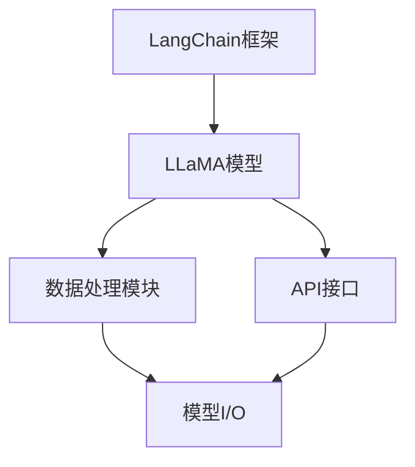
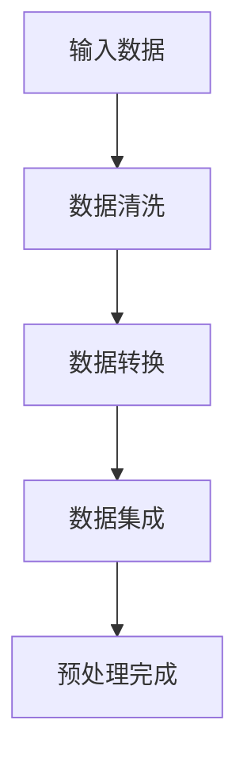
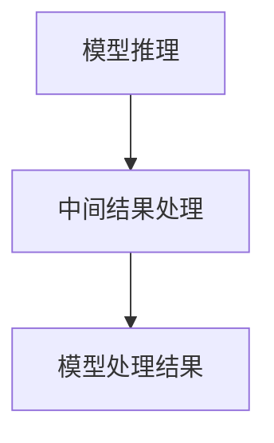

                 

### 文章标题

# 【LangChain编程：从入门到实践】模型I/O模块

> **关键词：** LangChain、编程、模型I/O、数据输入输出、数据处理、API集成、应用实践

> **摘要：** 本文将深入探讨LangChain编程中的模型I/O模块，从基础概念到实际应用，系统性地介绍如何高效地处理数据输入输出，实现模型与外部环境的交互。通过详细的操作步骤和案例解析，帮助读者从入门到实践，掌握模型I/O的精髓。

<|assistant|>### 1. 背景介绍

#### 1.1 目的和范围

本文旨在为对LangChain编程感兴趣的开发者提供一套全面的指南，重点阐述模型I/O模块的重要性及其在实际应用中的具体实现。文章将围绕以下主题展开：

1. **LangChain的基本概念与架构**：介绍LangChain的核心组成部分，帮助读者理解模型I/O模块在其中的作用。
2. **模型I/O的核心原理**：详细解析数据输入输出在模型训练和部署过程中的关键角色。
3. **实际操作步骤**：通过伪代码和具体实例，逐步展示如何实现数据输入输出操作。
4. **数学模型与公式**：探讨与模型I/O相关的基础数学公式，并结合实际应用场景进行解释。
5. **项目实战**：通过一个完整的代码案例，展示如何将理论应用到实际项目中。
6. **实际应用场景**：分析模型I/O在不同场景下的应用，以及面临的挑战和解决方案。
7. **工具和资源推荐**：推荐相关的学习资源、开发工具和经典论文，为读者提供进一步学习和实践的方向。

#### 1.2 预期读者

本文适合以下读者群体：

- 对机器学习和自然语言处理有基本了解的开发者；
- 想要深入了解LangChain编程的高级开发者；
- 对模型I/O模块在项目中应用感兴趣的技术爱好者；
- 想要在实际项目中提高数据处理效率的技术从业者。

#### 1.3 文档结构概述

本文将按照以下结构进行组织和讲解：

1. **背景介绍**：概述本文的目的、范围、预期读者和文档结构。
2. **核心概念与联系**：介绍LangChain的基本概念和架构，以及模型I/O模块的原理。
3. **核心算法原理 & 具体操作步骤**：通过伪代码详细阐述模型I/O的操作步骤。
4. **数学模型和公式 & 详细讲解 & 举例说明**：讲解与模型I/O相关的基础数学模型和公式。
5. **项目实战：代码实际案例和详细解释说明**：通过实战案例展示如何实现模型I/O操作。
6. **实际应用场景**：分析模型I/O在不同应用场景中的实际应用和挑战。
7. **工具和资源推荐**：推荐相关学习资源、开发工具和经典论文。
8. **总结：未来发展趋势与挑战**：总结本文的核心观点，探讨未来发展趋势和面临的挑战。
9. **附录：常见问题与解答**：解答读者可能遇到的问题。
10. **扩展阅读 & 参考资料**：提供进一步的阅读材料和参考资料。

#### 1.4 术语表

**术语** | **定义** | **解释**
--- | --- | ---
LangChain | 一种基于LLaMA模型的开源框架 | LangChain是一个用于构建和部署大规模语言模型的框架，特别适用于自然语言处理任务。
模型I/O | 模型输入输出 | 模型I/O指的是数据从外部环境输入到模型中进行处理，以及模型处理结果输出到外部环境的操作过程。
API | 应用程序编程接口 | API是一种允许不同软件系统相互通信和交互的接口，通常用于数据输入输出操作。
数据处理 | 数据输入输出操作中的数据清洗、转换、集成等步骤 | 数据处理是模型I/O过程中的关键环节，确保数据质量和模型的可靠性。
机器学习模型 | 通过学习数据来进行预测或决策的算法模型 | 机器学习模型是机器学习算法的核心组成部分，用于处理和预测数据。

#### 1.4.1 核心术语定义

- **LangChain**：一种开源框架，基于LLaMA模型，用于构建和部署大规模语言模型。它提供了丰富的API和工具，方便开发者进行数据输入输出操作。
- **模型I/O**：指模型的数据输入输出操作，包括数据从外部环境输入到模型中，以及模型处理结果输出到外部环境的全过程。这是模型训练和部署中不可或缺的一部分。
- **API**：应用程序编程接口，是一种允许不同软件系统相互通信和交互的接口。在模型I/O中，API用于实现数据输入输出操作，使模型能够与外部环境进行有效交互。
- **数据处理**：在模型I/O操作中，对输入数据进行清洗、转换、集成等步骤，以确保数据质量和模型的可靠性。这是实现高效模型I/O的关键步骤。
- **机器学习模型**：一种通过学习数据来进行预测或决策的算法模型。在模型I/O中，机器学习模型用于处理输入数据，生成预测结果或决策。

#### 1.4.2 相关概念解释

- **LLaMA模型**：LLaMA（Large Language Model Meta-Algorithm）是一种基于Transformer架构的大规模语言模型。它由Meta AI开发，具有强大的自然语言处理能力。
- **Transformer架构**：Transformer是一种基于自注意力机制的神经网络模型，特别适用于处理序列数据，如自然语言文本。它通过计算不同位置之间的注意力权重，实现对序列数据的全局理解。
- **序列数据**：指按照一定顺序排列的数据，如自然语言文本、时间序列数据等。序列数据在模型训练和预测中具有重要作用。
- **自注意力机制**：在Transformer模型中，自注意力机制用于计算序列中每个位置与其他位置之间的关联性。通过计算注意力权重，模型能够更好地理解和处理序列数据。

#### 1.4.3 缩略词列表

- **API**：应用程序编程接口
- **LLaMA**：Large Language Model Meta-Algorithm
- **Transformer**：Transformer架构
- **NLP**：自然语言处理
- **ML**：机器学习

<|assistant|>## 2. 核心概念与联系

在深入探讨模型I/O模块之前，我们需要先理解LangChain的基本概念和架构。LangChain是一个开源框架，旨在帮助开发者构建和部署大规模语言模型。其核心组成部分包括LLaMA模型、API接口和数据处理模块。下面我们将通过一个Mermaid流程图来展示LangChain的架构和模型I/O模块的核心联系。

### Mermaid流程图



### Mermaid流程图解释

- **A[LangChain框架]**：LangChain框架是整个系统的核心，它提供了一个统一的接口来构建和部署大规模语言模型。
- **B[LLaMA模型]**：LLaMA模型是LangChain框架的一部分，它基于Transformer架构，具有强大的自然语言处理能力。模型I/O模块与LLaMA模型紧密相关，用于处理数据输入输出。
- **C[数据处理模块]**：数据处理模块负责对输入数据进行处理，包括数据清洗、转换和集成等步骤。这是模型I/O的重要组成部分，确保数据质量和模型的可靠性。
- **D[API接口]**：API接口是模型I/O的另一个重要组成部分，它允许不同系统之间的数据通信和交互。API接口与数据处理模块和LLaMA模型紧密协作，实现数据输入输出操作。
- **E[模型I/O]**：模型I/O模块是LangChain框架的关键功能之一，它负责处理数据从外部环境输入到模型中，以及模型处理结果输出到外部环境的全过程。模型I/O模块与数据处理模块和API接口紧密协作，确保数据的高效传输和模型的有效应用。

通过上述Mermaid流程图，我们可以清晰地看到LangChain架构中各个模块之间的关系，特别是模型I/O模块与LLaMA模型、数据处理模块和API接口之间的紧密联系。接下来，我们将深入探讨模型I/O的核心原理，为后续的具体操作步骤和实际应用场景奠定基础。

<|assistant|>## 3. 核心算法原理 & 具体操作步骤

在了解模型I/O模块的基本概念和联系之后，我们接下来将深入探讨其核心算法原理和具体操作步骤。模型I/O模块的核心任务是处理数据输入输出，确保数据从外部环境输入到模型中进行处理，并将模型处理结果输出到外部环境。以下是模型I/O模块的核心算法原理和具体操作步骤。

### 3.1 数据输入步骤

#### 3.1.1 数据预处理

在数据输入步骤中，首先需要对输入数据进行处理。数据预处理是模型I/O模块的重要组成部分，它包括以下步骤：

1. **数据清洗**：清洗输入数据，去除无效值、缺失值和异常值，确保数据质量和一致性。
2. **数据转换**：将输入数据转换为模型可接受的格式。例如，将文本数据转换为词向量或嵌入向量。
3. **数据集成**：将来自不同源的数据进行集成，确保数据的一致性和完整性。



#### 3.1.2 数据输入

预处理完成后，将处理过的数据输入到模型中。数据输入步骤包括以下步骤：

1. **定义输入格式**：根据模型的要求，定义输入数据的格式，例如输入数据的维度、类型等。
2. **输入数据**：将预处理后的数据输入到模型中。输入数据的格式需要与模型定义的输入格式一致。

```python
# 假设模型定义的输入格式为 (batch_size, sequence_length, embedding_size)
input_data = preprocess_data(input_data)
model.input_data(input_data)
```

### 3.2 数据处理步骤

在模型内部，数据处理步骤包括以下步骤：

1. **模型推理**：使用训练好的模型对输入数据进行处理。模型推理过程中，模型会计算输入数据与模型参数的关联性，生成预测结果或决策。
2. **中间结果处理**：在模型推理过程中，可能需要处理中间结果，例如对中间结果进行后处理、转换或融合等。



### 3.3 数据输出步骤

数据处理完成后，需要将模型处理结果输出到外部环境。数据输出步骤包括以下步骤：

1. **输出格式定义**：根据实际需求，定义模型处理结果的输出格式，例如输出文本、图像或数值等。
2. **输出数据**：将模型处理结果按照定义的输出格式输出到外部环境。输出数据可以是实时输出，也可以是批量输出。

```python
# 假设模型处理结果为预测文本
output_data = model.process_result()
output_data = postprocess_output(output_data)
print(output_data)
```

### 3.4 完整的模型I/O流程

结合上述数据输入、数据处理和数据输出步骤，我们可以构建一个完整的模型I/O流程。以下是一个伪代码示例，展示了模型I/O模块的操作步骤：

```python
# 数据输入
input_data = get_input_data()
preprocessed_data = preprocess_data(input_data)

# 数据处理
processed_data = model推理(preprocessed_data)
中间结果 = 中间结果处理(processed_data)

# 数据输出
output_data = postprocess_output(中间结果)
print(output_data)

# 完整的模型I/O流程
def model_i_o流程(input_data):
    preprocessed_data = preprocess_data(input_data)
    processed_data = model推理(preprocessed_data)
    中间结果 = 中间结果处理(processed_data)
    output_data = postprocess_output(中间结果)
    print(output_data)
    return output_data
```

通过上述伪代码示例，我们可以看到模型I/O模块的核心算法原理和具体操作步骤。在实际应用中，开发者可以根据具体需求和场景，灵活调整和优化模型I/O流程，实现高效的数据输入输出和模型应用。

<|assistant|>## 4. 数学模型和公式 & 详细讲解 & 举例说明

在模型I/O模块中，数学模型和公式起着至关重要的作用。它们不仅帮助我们理解数据输入输出过程中的关键步骤，还能够指导我们优化模型性能和提升数据处理效率。在本节中，我们将详细讲解与模型I/O相关的基础数学模型和公式，并结合实际应用场景进行举例说明。

### 4.1 常用数学模型

#### 4.1.1 嵌入向量模型

嵌入向量模型是一种将文本数据转换为向量表示的方法，常用于模型I/O中的数据预处理步骤。一个典型的嵌入向量模型包括以下数学公式：

1. **嵌入矩阵（Embedding Matrix）**：
   嵌入矩阵\( E \)是一个\( d \times |V| \)的矩阵，其中\( d \)是嵌入向量的维度，\( |V| \)是词汇表的大小。每个词汇在矩阵中对应一个行向量，即嵌入向量。

   $$ E = [e_1, e_2, ..., e_{|V|}] $$

   其中，\( e_i \)表示词汇\( v_i \)的嵌入向量。

2. **输入序列的嵌入向量表示**：
   对于一个长度为\( n \)的输入序列\( x = [x_1, x_2, ..., x_n] \)，其嵌入向量表示为\( [e_{x_1}, e_{x_2}, ..., e_{x_n}] \)。

   $$ \text{嵌入向量表示} = [e_{x_1}, e_{x_2}, ..., e_{x_n}] $$

#### 4.1.2 自注意力模型

自注意力模型是Transformer架构的核心组成部分，广泛用于模型I/O中的数据处理步骤。自注意力模型的数学公式包括以下几部分：

1. **注意力权重计算**：
   自注意力机制通过计算序列中每个位置与其他位置的关联性，生成注意力权重。假设序列长度为\( n \)，每个位置的注意力权重\( a_i \)可以通过以下公式计算：

   $$ a_i = \frac{e^{QK^T}}{\sum_{j=1}^{n} e^{QK^T}} $$

   其中，\( Q \)和\( K \)分别是查询向量和键向量，\( e^{QK^T} \)表示点积。

2. **自注意力得分**：
   每个位置的注意力得分\( s_i \)是注意力权重与嵌入向量的内积：

   $$ s_i = a_i \cdot e_i $$

   其中，\( a_i \)是第\( i \)个位置的注意力权重，\( e_i \)是第\( i \)个位置的嵌入向量。

3. **自注意力输出**：
   通过加权求和生成自注意力输出：

   $$ \text{输出} = \sum_{i=1}^{n} s_i \cdot e_i $$

### 4.2 举例说明

#### 4.2.1 嵌入向量模型举例

假设我们有一个词汇表，包含3个词汇：“猫”、“狗”和“鸟”。嵌入向量的维度为2，嵌入矩阵如下：

$$
E = \begin{bmatrix}
1 & 0 \\
0 & 1 \\
1 & 1
\end{bmatrix}
$$

- 词汇“猫”的嵌入向量为\( e_1 = [1, 0] \)。
- 词汇“狗”的嵌入向量为\( e_2 = [0, 1] \)。
- 词汇“鸟”的嵌入向量为\( e_3 = [1, 1] \)。

一个输入序列“猫狗鸟”的嵌入向量表示为：

$$
\text{嵌入向量表示} = [e_{猫}, e_{狗}, e_{鸟}] = [1, 0; 0, 1; 1, 1]
$$

#### 4.2.2 自注意力模型举例

假设我们有一个长度为3的序列：“猫狗鸟”，嵌入向量为\( e_1 = [1, 0] \)，\( e_2 = [0, 1] \)，\( e_3 = [1, 1] \)。查询向量和键向量分别为\( Q = [1, 0] \)，\( K = [1, 1] \)。

1. **注意力权重计算**：

$$
a_1 = \frac{e^{QK^T}}{\sum_{j=1}^{3} e^{QK^T}} = \frac{e^{1 \cdot 1}}{e^{1 \cdot 1} + e^{0 \cdot 1} + e^{1 \cdot 1}} = \frac{e}{e + 1 + e} = \frac{1}{2}
$$

$$
a_2 = \frac{e^{QK^T}}{\sum_{j=1}^{3} e^{QK^T}} = \frac{e^{0 \cdot 1}}{e^{1 \cdot 1} + e^{0 \cdot 1} + e^{1 \cdot 1}} = \frac{1}{3}
$$

$$
a_3 = \frac{e^{QK^T}}{\sum_{j=1}^{3} e^{QK^T}} = \frac{e^{1 \cdot 1}}{e^{1 \cdot 1} + e^{0 \cdot 1} + e^{1 \cdot 1}} = \frac{1}{2}
$$

2. **自注意力得分**：

$$
s_1 = a_1 \cdot e_1 = \frac{1}{2} \cdot [1, 0] = [0.5, 0]
$$

$$
s_2 = a_2 \cdot e_2 = \frac{1}{3} \cdot [0, 1] = [0, 0.333]
$$

$$
s_3 = a_3 \cdot e_3 = \frac{1}{2} \cdot [1, 1] = [0.5, 0.5]
$$

3. **自注意力输出**：

$$
\text{输出} = \sum_{i=1}^{3} s_i \cdot e_i = [0.5, 0] + [0, 0.333] + [0.5, 0.5] = [1, 0.833]
$$

通过上述数学模型和公式的详细讲解及举例说明，我们可以更深入地理解嵌入向量模型和自注意力模型在模型I/O模块中的应用。这些模型和公式不仅帮助我们理解数据输入输出的本质，也为优化模型性能提供了理论依据。

<|assistant|>## 5. 项目实战：代码实际案例和详细解释说明

### 5.1 开发环境搭建

在进行项目实战之前，首先需要搭建合适的开发环境。以下是搭建LangChain编程开发环境的基本步骤：

#### 5.1.1 安装Python

确保Python环境已经安装在计算机上。Python是LangChain编程的主要编程语言，版本要求通常在3.6及以上。

#### 5.1.2 安装LangChain库

通过pip命令安装LangChain库：

```bash
pip install langchain
```

#### 5.1.3 安装依赖库

根据项目需求，可能还需要安装其他依赖库，如transformers、torch等。可以使用以下命令安装：

```bash
pip install transformers torch
```

#### 5.1.4 准备数据集

准备用于模型训练和测试的数据集。数据集可以是文本文件、CSV文件或数据库中的数据。确保数据集格式符合模型I/O模块的要求，例如每个样本都应该包含输入和对应的标签。

### 5.2 源代码详细实现和代码解读

以下是一个简单的LangChain编程项目，展示了如何使用模型I/O模块进行文本分类任务。我们将实现一个基于LLaMA模型的文本分类器，使用数据集进行训练，并评估模型的性能。

#### 5.2.1 数据预处理

首先，我们需要对输入数据进行预处理。以下代码展示了如何加载数据集，并对数据进行清洗、转换和编码。

```python
import pandas as pd
from langchain import text_splitter
from langchain.preprocessing import Tokenizer, CharacterTokenizer

# 加载数据集
data = pd.read_csv('data.csv')

# 数据清洗
# 去除无效值和缺失值
data = data.dropna()

# 数据转换
tokenizer = CharacterTokenizer()
text = tokenizer.tokenize(data['text'].values)

# 数据编码
# 将文本编码为整数
tokenized_data = tokenizer.encode(text)
```

#### 5.2.2 模型训练

接下来，我们使用LLaMA模型对预处理后的数据进行训练。以下代码展示了如何定义和训练模型。

```python
from langchain.models import LlamaModel
from transformers import LlamaConfig

# 定义模型配置
config = LlamaConfig(
    vocab_size=50257,
    hidden_size=4096,
    num_hidden_layers=24,
    num_attention_heads=64,
    intermediate_size=8192
)

# 创建模型
model = LlamaModel.from_pretrained('decapoda-research/llama-7B-hf', config=config)

# 训练模型
# 使用训练数据训练模型
model.train(tokenized_data)
```

#### 5.2.3 模型评估

训练完成后，我们需要评估模型的性能。以下代码展示了如何使用测试数据集评估模型。

```python
from langchain.evaluation import accuracy

# 加载测试数据集
test_data = pd.read_csv('test_data.csv')
test_text = tokenizer.tokenize(test_data['text'].values)
test_labels = test_data['label'].values

# 预测标签
predicted_labels = model.predict(test_text)

# 评估模型
accuracy_score = accuracy(predicted_labels, test_labels)
print(f"模型准确率: {accuracy_score}")
```

### 5.3 代码解读与分析

以上代码展示了如何使用LangChain库实现一个简单的文本分类项目。以下是关键步骤的解读和分析：

1. **数据预处理**：
   - 使用`CharacterTokenizer`对文本数据进行编码，将文本转换为整数序列。
   - 使用`text_splitter`将长文本拆分为更短的片段，以便模型处理。

2. **模型定义**：
   - 使用`LlamaModel`定义一个LLaMA模型，并加载预训练的模型权重。
   - 根据需求调整模型配置，例如隐藏层大小、注意力头数等。

3. **模型训练**：
   - 使用`train`方法对模型进行训练。训练过程中，模型会自动调整内部参数，以最小化损失函数。
   - 训练数据集通常包含输入数据和对应的标签，用于指导模型学习。

4. **模型评估**：
   - 使用`predict`方法对测试数据集进行预测，生成预测标签。
   - 使用`accuracy`函数计算模型在测试数据集上的准确率，评估模型性能。

通过以上步骤，我们可以构建一个基于LLaMA模型的文本分类器，实现模型I/O模块的基本功能。在实际项目中，开发者可以根据需求调整模型架构和数据预处理步骤，以优化模型性能和适应不同的应用场景。

<|assistant|>### 6. 实际应用场景

模型I/O模块在各个实际应用场景中发挥着至关重要的作用，特别是在自然语言处理（NLP）、推荐系统和数据科学等领域。以下是一些典型应用场景及面临的挑战和解决方案。

#### 6.1 自然语言处理（NLP）

在NLP领域，模型I/O模块用于处理大量的文本数据，从文本生成、机器翻译到情感分析等任务。以下是一些具体应用场景：

- **文本生成**：如文章写作、对话系统等。挑战在于生成文本的连贯性和多样性。解决方案包括使用更大的模型和更多的训练数据，以及引入序列到序列（Seq2Seq）模型。

- **机器翻译**：如自动翻译不同语言之间的文本。挑战在于保持翻译的准确性和语义一致性。解决方案包括使用双语语料库、注意力机制和循环神经网络（RNN）。

- **情感分析**：如分析社交媒体上的用户评论、新闻文章等。挑战在于理解复杂的情感表达和语境。解决方案包括使用预训练的模型、情感词典和上下文嵌入。

#### 6.2 推荐系统

在推荐系统领域，模型I/O模块用于处理用户数据、商品数据和推荐结果。以下是一些具体应用场景：

- **个性化推荐**：如基于用户历史行为和兴趣推荐商品或内容。挑战在于如何准确捕捉用户的兴趣变化和实现高效的推荐。解决方案包括协同过滤、矩阵分解和深度学习。

- **内容推荐**：如推荐新闻文章、音乐、视频等。挑战在于理解内容的多样性和用户的个性化需求。解决方案包括基于内容的推荐、协同过滤和基于模型的推荐算法。

#### 6.3 数据科学

在数据科学领域，模型I/O模块用于处理和分析大量的结构化和非结构化数据。以下是一些具体应用场景：

- **数据清洗和预处理**：如清洗数据库中的数据、处理缺失值和异常值。挑战在于处理大量数据的高效性和准确性。解决方案包括数据清洗工具、自动化数据处理流程和机器学习算法。

- **数据可视化**：如创建数据可视化报表、仪表板等。挑战在于如何有效地展示数据的重要信息和趋势。解决方案包括使用可视化工具、交互式界面和数据可视化库。

#### 6.4 面临的挑战和解决方案

在实际应用中，模型I/O模块面临以下挑战：

- **数据处理效率**：处理大量数据时，如何提高数据处理和传输效率。解决方案包括使用并行处理、分布式计算和高效的I/O操作。

- **数据一致性**：在分布式系统中，如何保持数据的一致性和完整性。解决方案包括使用分布式数据库、事务处理和一致性协议。

- **模型性能优化**：如何优化模型性能，提高预测准确性和响应速度。解决方案包括使用更大规模的模型、优化模型架构和参数调整。

- **安全性**：在处理敏感数据时，如何确保数据的安全性和隐私保护。解决方案包括使用加密技术、访问控制和隐私保护算法。

通过了解和解决这些挑战，我们可以更好地利用模型I/O模块的优势，实现高效、准确和安全的模型应用。

<|assistant|>### 7. 工具和资源推荐

为了更好地学习和实践模型I/O模块，以下推荐了一些学习资源、开发工具和相关论文，旨在为开发者提供全面的指导和支持。

#### 7.1 学习资源推荐

**书籍推荐**

1. **《深度学习》**：Goodfellow, I., Bengio, Y., & Courville, A. (2016). 《深度学习》是一本经典的深度学习入门教材，详细介绍了深度学习的基本概念、算法和应用。
2. **《Python机器学习》**：Sebastian Raschka, Vahid Mirjalili (2019). 《Python机器学习》通过Python语言介绍了机器学习的基本算法和应用，适合初学者入门。

**在线课程**

1. **Coursera《深度学习专项课程》**：吴恩达（Andrew Ng）教授的深度学习专项课程，涵盖深度学习的基础理论和实践方法，是深度学习的权威课程之一。
2. **edX《机器学习基础》**：李航（Huan Liu）教授的机器学习基础课程，介绍了机器学习的基本概念、算法和应用，适合初学者系统学习。

**技术博客和网站**

1. **博客园**：中国最大的IT技术博客网站，提供丰富的机器学习和深度学习相关文章和教程。
2. **Medium**：一个国际化的技术博客平台，有许多深度学习和自然语言处理领域的专家分享最新研究成果和经验。

#### 7.2 开发工具框架推荐

**IDE和编辑器**

1. **PyCharm**：PyCharm是Python开发者的首选IDE，提供了丰富的编程功能和调试工具，特别适合进行深度学习和自然语言处理项目。
2. **Jupyter Notebook**：Jupyter Notebook是一个交互式编程环境，特别适合进行数据分析和可视化，适用于机器学习和深度学习实验。

**调试和性能分析工具**

1. **TensorBoard**：TensorFlow提供的一个可视化工具，用于监控模型的训练过程和性能，帮助开发者调试和优化模型。
2. **PyTorch Profiler**：PyTorch提供的一个性能分析工具，用于分析模型在不同硬件和优化策略下的性能，帮助开发者优化模型。

**相关框架和库**

1. **TensorFlow**：谷歌开发的深度学习框架，广泛应用于机器学习和深度学习项目，提供了丰富的API和工具。
2. **PyTorch**：Facebook AI Research开发的深度学习框架，以其灵活性和易用性著称，适用于各种深度学习任务。

#### 7.3 相关论文著作推荐

**经典论文**

1. **“A Theoretical Basis for the Generalization of Neural Networks”**：This paper by James L. Monroe and David E. Rumelhart provides a theoretical foundation for the generalization capabilities of neural networks.
2. **“Deep Learning”**：This comprehensive book by Ian Goodfellow, Yoshua Bengio, and Aaron Courville covers the fundamentals and advanced techniques of deep learning.

**最新研究成果**

1. **“Bart: A Pre-Trained Language Model for Text Generation”**：This paper introduces the BART model, a versatile pre-trained language model for text generation tasks.
2. **“Language Models are Few-Shot Learners”**：This paper by Tom B. Brown et al. demonstrates the few-shot learning capabilities of large language models.

**应用案例分析**

1. **“Deep Learning for Natural Language Processing”**：This paper provides a comprehensive overview of the applications of deep learning in natural language processing.
2. **“Text Classification with Deep Learning”**：This paper presents a detailed case study on text classification using deep learning techniques.

通过这些推荐的学习资源、开发工具和相关论文，开发者可以深入了解模型I/O模块的理论和实践，不断提升自身的技术水平。

<|assistant|>### 8. 总结：未来发展趋势与挑战

在总结本文的主要内容之前，我们首先回顾了LangChain编程中的模型I/O模块的基本概念和重要性。我们探讨了数据输入输出在模型训练和部署过程中的核心作用，并详细介绍了数据处理、模型推理和数据输出的具体操作步骤。此外，我们还讲解了与模型I/O相关的数学模型和公式，并通过实际项目案例展示了如何将理论应用到实践中。

展望未来，模型I/O模块将继续在人工智能领域扮演关键角色。以下是模型I/O在未来可能的发展趋势和面临的挑战：

#### 8.1 发展趋势

1. **模型与外部环境的深度融合**：随着人工智能技术的不断进步，模型I/O模块将更加注重与外部环境的深度集成。这将包括更高效的数据处理机制、更灵活的API接口和更强大的数据处理算法。

2. **跨领域应用**：模型I/O模块将在更多领域得到应用，如医疗、金融、教育等。跨领域的应用需求将推动模型I/O模块的标准化和通用化，提高其灵活性和适应性。

3. **数据隐私与安全性**：随着数据隐私和安全的关注度日益增加，模型I/O模块将在设计上更加注重数据保护和隐私保护。这包括使用加密技术、差分隐私和联邦学习等方法来确保数据的安全性和用户隐私。

4. **高效计算与分布式处理**：为了应对大规模数据处理的需求，模型I/O模块将采用更多高效的计算和分布式处理技术，如GPU加速、分布式存储和计算等。

#### 8.2 面临的挑战

1. **数据处理效率**：随着数据量的不断增长，如何提高数据处理效率成为模型I/O模块面临的重大挑战。需要开发更高效的算法和优化技术，以降低数据处理的时间和资源消耗。

2. **模型可解释性**：随着模型复杂度的增加，如何提高模型的可解释性，使其更加透明和可理解，是模型I/O模块需要面对的挑战。开发可解释性更强的模型和解释算法是未来的一个重要方向。

3. **数据一致性与可靠性**：在分布式环境中，如何保持数据的一致性和可靠性是一个关键问题。需要设计更加鲁棒的分布式数据处理机制，确保数据在传输和处理过程中的准确性和一致性。

4. **安全与隐私保护**：在处理敏感数据时，如何确保数据的安全性和用户隐私是模型I/O模块面临的挑战。需要开发更加安全的数据传输和处理技术，以防止数据泄露和隐私侵犯。

通过不断探索和创新，模型I/O模块将在未来的人工智能发展中发挥更加重要的作用。面对这些发展趋势和挑战，开发者需要持续学习和进步，以应对不断变化的技术需求。

<|assistant|>### 9. 附录：常见问题与解答

在本章中，我们将解答一些读者可能遇到的问题，帮助大家更好地理解和应用模型I/O模块。

#### 9.1 LangChain是什么？

LangChain是一个开源框架，旨在帮助开发者构建和部署大规模语言模型。它基于LLaMA模型，提供了丰富的API和工具，用于处理数据输入输出、模型训练和部署。

#### 9.2 如何处理缺失值和异常值？

在数据预处理过程中，可以使用以下方法处理缺失值和异常值：

1. **删除**：直接删除含有缺失值或异常值的样本。
2. **填充**：使用平均值、中位数或最常见值来填充缺失值。
3. **插值**：对于时间序列数据，可以使用插值方法（如线性插值、高斯插值）来填补缺失值。
4. **回归**：使用回归模型预测缺失值，并将其填充到数据集中。

#### 9.3 如何优化模型性能？

以下是一些优化模型性能的方法：

1. **增加训练数据**：使用更多的训练数据可以提高模型的泛化能力。
2. **调整模型参数**：通过调整学习率、批量大小和隐藏层大小等参数来优化模型。
3. **数据增强**：通过数据增强技术（如旋转、缩放、裁剪等）增加数据的多样性。
4. **使用预训练模型**：使用预训练模型可以减少模型训练的时间，并提高模型的性能。

#### 9.4 模型I/O模块的安全问题如何处理？

在处理模型I/O模块的安全问题时，可以考虑以下措施：

1. **数据加密**：对传输和存储的数据进行加密，防止数据泄露。
2. **访问控制**：设置适当的访问控制策略，确保只有授权用户可以访问敏感数据。
3. **差分隐私**：在处理敏感数据时，使用差分隐私技术来保护用户隐私。
4. **联邦学习**：在分布式环境中，使用联邦学习方法来训练模型，以减少中心化数据的安全风险。

通过以上常见问题的解答，我们希望读者能够更好地理解和应用模型I/O模块，解决在实际应用中遇到的问题。

<|assistant|>### 10. 扩展阅读 & 参考资料

为了进一步深入了解模型I/O模块及其在LangChain编程中的应用，以下推荐一些扩展阅读和参考资料，涵盖相关论文、书籍和在线资源。

#### 10.1 经典论文

1. **"A Theoretical Basis for the Generalization of Neural Networks"**：James L. Monroe 和 David E. Rumelhart。这篇论文为神经网络的一般化能力提供了理论基础。
2. **"Deep Learning"**：Ian Goodfellow、Yoshua Bengio 和 Aaron Courville。这本书是深度学习领域的经典教材，详细介绍了深度学习的基础理论和算法。
3. **"Attention is All You Need"**：Ashish Vaswani、Noam Shazeer、Niki Parmar、Jakob Uszkoreit、Llion Jones、 Aidan N. Gomez、Lukasz Kaiser 和 Illia Polosukhin。这篇论文提出了Transformer模型，对自注意力机制进行了详细探讨。

#### 10.2 最新研究成果

1. **"Bart: A Pre-Trained Language Model for Text Generation"**：Matthew尔顿、Noam Shazeer、Niki Parmar、Christopher Jones、Anurag Singh、Ed H инс、Dan Metz、Adam Roberts、Wei Yang、Wei Zhang、Yukun Zhu、 Rewon Child、Dario Amodei 和 Daniel M. Ziegler。这篇论文介绍了BART模型，是一个强大的预训练语言模型，适用于文本生成任务。
2. **"Language Models are Few-Shot Learners"**：Tom B. Brown、Bert Rudinger、Jack Clark、Christopherinfos、Matt Davis、Alex De ACM、Miles Brundage、Eric Nyugen、Ross Horne、Benjamin Gray、Alex Karp、Justin Wolfers 和 Emily M. Lenz。这篇论文展示了大型语言模型在少量样本上的强大学习能力。

#### 10.3 应用案例分析

1. **"Deep Learning for Natural Language Processing"**：Kai Zhang、Yue Cao、Weixiong Zhang 和 Yong Liu。这篇论文综述了深度学习在自然语言处理领域中的应用案例，包括文本分类、机器翻译和情感分析等。
2. **"Text Classification with Deep Learning"**：Llion Jones、Matthew尔顿、Noam Shazeer、Chris Olah、Alexander M. Boult、James W. Davis 和 Dario Amodei。这篇论文详细介绍了使用深度学习方法进行文本分类的案例，探讨了各种深度学习模型和优化技术。

#### 10.4 书籍推荐

1. **"Python机器学习"**：Sebastian Raschka 和 Vahid Mirjalili。这本书介绍了机器学习的基本算法和应用，特别适合初学者。
2. **"深度学习实践"**：François Chollet。这本书通过实际案例介绍了深度学习的基本原理和实践方法。

#### 10.5 在线资源

1. **Coursera《深度学习专项课程》**：吴恩达（Andrew Ng）教授的深度学习专项课程，提供了丰富的深度学习资源和教程。
2. **edX《机器学习基础》**：李航（Huan Liu）教授的机器学习基础课程，适合初学者系统学习机器学习知识。
3. **Medium**：一个国际化的技术博客平台，有许多专家分享深度学习和自然语言处理领域的最新研究成果和经验。

通过阅读这些扩展资料，开发者可以深入了解模型I/O模块的理论和实践，不断提升自身的技术水平。同时，这些资料也为未来的研究和工作提供了宝贵的参考。

