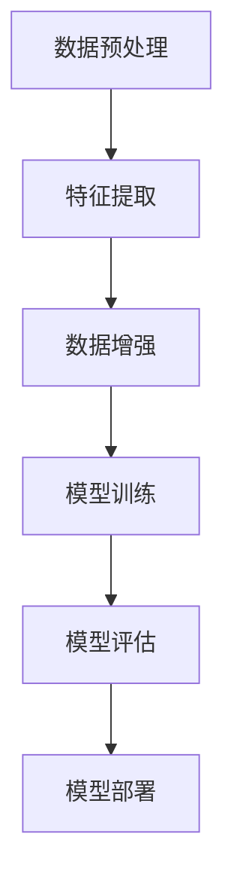

                 

# 【LangChain编程：从入门到实践】模型I/O模块

> **关键词：** LangChain、编程、模型I/O、数据处理、AI应用开发、实践指南

> **摘要：** 本文将深入探讨LangChain编程中的模型I/O模块，介绍其核心概念、原理以及具体实现。通过逐步分析，读者将了解如何高效地进行数据处理，以构建强大的AI应用。本文适合对AI和编程有一定基础的读者，旨在帮助大家掌握模型I/O模块的精髓。

## 1. 背景介绍

### 1.1 目的和范围

本文的目的是为读者提供关于LangChain模型I/O模块的深入理解，包括其基本概念、应用场景以及具体实现。我们将通过一系列的步骤，帮助读者从入门到实践，全面掌握模型I/O模块的使用方法。

本文将涵盖以下内容：

1. **背景介绍**：介绍LangChain的概念、应用场景以及模型I/O模块的基本概念。
2. **核心概念与联系**：通过Mermaid流程图展示模型I/O模块的核心概念和联系。
3. **核心算法原理 & 具体操作步骤**：详细解释模型I/O模块的核心算法原理，并使用伪代码展示具体操作步骤。
4. **数学模型和公式 & 详细讲解 & 举例说明**：介绍模型I/O模块中的数学模型和公式，并通过实例进行详细讲解。
5. **项目实战：代码实际案例和详细解释说明**：通过实际项目案例，展示模型I/O模块的具体应用。
6. **实际应用场景**：探讨模型I/O模块在不同场景下的应用。
7. **工具和资源推荐**：推荐学习资源和开发工具，帮助读者进一步深入学习和实践。
8. **总结：未来发展趋势与挑战**：总结模型I/O模块的发展趋势和面临的挑战。

### 1.2 预期读者

本文适合对AI和编程有一定基础的读者，包括但不限于：

- AI工程师
- 数据科学家
- 程序员
- 对AI和编程有兴趣的爱好者

通过本文的学习，读者将能够：

- 理解模型I/O模块的基本概念和原理。
- 掌握模型I/O模块的具体实现和应用。
- 能够使用模型I/O模块构建高效的AI应用。

### 1.3 文档结构概述

本文的结构如下：

1. **背景介绍**：介绍本文的目的、范围、预期读者以及文档结构。
2. **核心概念与联系**：通过Mermaid流程图展示模型I/O模块的核心概念和联系。
3. **核心算法原理 & 具体操作步骤**：详细解释模型I/O模块的核心算法原理，并使用伪代码展示具体操作步骤。
4. **数学模型和公式 & 详细讲解 & 举例说明**：介绍模型I/O模块中的数学模型和公式，并通过实例进行详细讲解。
5. **项目实战：代码实际案例和详细解释说明**：通过实际项目案例，展示模型I/O模块的具体应用。
6. **实际应用场景**：探讨模型I/O模块在不同场景下的应用。
7. **工具和资源推荐**：推荐学习资源和开发工具，帮助读者进一步深入学习和实践。
8. **总结：未来发展趋势与挑战**：总结模型I/O模块的发展趋势和面临的挑战。
9. **附录：常见问题与解答**：回答读者可能遇到的问题。
10. **扩展阅读 & 参考资料**：提供进一步学习的资源和参考。

### 1.4 术语表

#### 1.4.1 核心术语定义

- **LangChain**：一种用于构建AI应用的开源框架，提供了丰富的API和工具，方便开发者进行数据处理和模型集成。
- **模型I/O模块**：负责数据的输入和输出处理，包括数据的预处理、特征提取、数据增强等。
- **数据处理**：对原始数据进行分析、清洗、转换等操作，以便模型能够更好地理解和处理。
- **特征提取**：从原始数据中提取有用的信息，形成模型可以理解的输入特征。
- **数据增强**：通过一系列技术手段，增加数据的多样性和丰富性，从而提高模型的泛化能力。

#### 1.4.2 相关概念解释

- **模型训练**：将模型和数据进行配对，通过学习数据中的规律，使模型能够对未知数据进行预测或分类。
- **模型评估**：使用特定的指标来评估模型的性能，包括准确率、召回率、F1分数等。
- **模型部署**：将训练好的模型部署到实际应用环境中，以便进行实时预测或分类。

#### 1.4.3 缩略词列表

- **API**：应用程序编程接口（Application Programming Interface）
- **AI**：人工智能（Artificial Intelligence）
- **ML**：机器学习（Machine Learning）
- **DL**：深度学习（Deep Learning）
- **NLP**：自然语言处理（Natural Language Processing）

## 2. 核心概念与联系

在深入探讨模型I/O模块之前，我们需要先了解其核心概念和相互之间的联系。以下是一个使用Mermaid流程图展示的模型I/O模块的核心概念和联系。



### 2.1 数据预处理

数据预处理是模型I/O模块的第一步，它主要包括数据清洗、格式转换、缺失值处理等。数据预处理的目标是将原始数据转换为适合模型训练的形式。

### 2.2 特征提取

特征提取是从原始数据中提取有用的信息，形成模型可以理解的输入特征。特征提取的质量直接影响模型的性能。常见的特征提取方法包括词袋模型、TF-IDF、词嵌入等。

### 2.3 数据增强

数据增强是通过一系列技术手段，增加数据的多样性和丰富性，从而提高模型的泛化能力。常见的数据增强方法包括随机旋转、缩放、裁剪、颜色变换等。

### 2.4 模型训练

模型训练是将模型和数据进行配对，通过学习数据中的规律，使模型能够对未知数据进行预测或分类。模型训练的质量直接影响模型的性能。

### 2.5 模型评估

模型评估是使用特定的指标来评估模型的性能，包括准确率、召回率、F1分数等。模型评估的结果用于指导模型优化和调整。

### 2.6 模型部署

模型部署是将训练好的模型部署到实际应用环境中，以便进行实时预测或分类。模型部署的质量直接影响应用的效率和用户体验。

通过上述Mermaid流程图，我们可以清晰地看到模型I/O模块的各个核心概念及其相互之间的联系。在后续章节中，我们将逐一深入探讨这些概念的具体实现和应用。

## 3. 核心算法原理 & 具体操作步骤

在了解了模型I/O模块的核心概念和联系之后，接下来我们将详细解释其核心算法原理，并使用伪代码展示具体操作步骤。

### 3.1 数据预处理

数据预处理是模型I/O模块的第一步，其目的是将原始数据转换为适合模型训练的形式。以下是一个简单的数据预处理算法原理和伪代码：

```python
def data_preprocessing(data):
    # 数据清洗
    cleaned_data = clean_data(data)
    # 数据格式转换
    converted_data = convert_format(cleaned_data)
    # 缺失值处理
    completed_data = handle_missing_values(converted_data)
    return completed_data
```

其中，`clean_data`函数用于清洗数据，`convert_format`函数用于将数据格式转换为适合模型训练的形式，`handle_missing_values`函数用于处理缺失值。

### 3.2 特征提取

特征提取是从原始数据中提取有用的信息，形成模型可以理解的输入特征。以下是一个简单的特征提取算法原理和伪代码：

```python
def feature_extraction(data):
    # 提取词袋模型特征
    bag_of_words = extract_bag_of_words(data)
    # 提取TF-IDF特征
    tfidf = extract_tfidf(bag_of_words)
    # 提取词嵌入特征
    embeddings = extract_embeddings(tfidf)
    return embeddings
```

其中，`extract_bag_of_words`函数用于提取词袋模型特征，`extract_tfidf`函数用于提取TF-IDF特征，`extract_embeddings`函数用于提取词嵌入特征。

### 3.3 数据增强

数据增强是通过一系列技术手段，增加数据的多样性和丰富性，从而提高模型的泛化能力。以下是一个简单的数据增强算法原理和伪代码：

```python
def data_augmentation(data):
    # 随机旋转
    rotated_data = random_rotation(data)
    # 缩放
    scaled_data = scale(data)
    # 裁剪
    cropped_data = crop(data)
    # 颜色变换
    color_transformed_data = color_transform(data)
    return rotated_data, scaled_data, cropped_data, color_transformed_data
```

其中，`random_rotation`函数用于随机旋转数据，`scale`函数用于缩放数据，`crop`函数用于裁剪数据，`color_transform`函数用于颜色变换。

### 3.4 模型训练

模型训练是将模型和数据进行配对，通过学习数据中的规律，使模型能够对未知数据进行预测或分类。以下是一个简单的模型训练算法原理和伪代码：

```python
def model_training(data, model):
    # 模型初始化
    initialized_model = initialize_model(model)
    # 模型训练
    trained_model = train_model(initialized_model, data)
    return trained_model
```

其中，`initialize_model`函数用于初始化模型，`train_model`函数用于训练模型。

### 3.5 模型评估

模型评估是使用特定的指标来评估模型的性能，包括准确率、召回率、F1分数等。以下是一个简单的模型评估算法原理和伪代码：

```python
def model_evaluation(model, data):
    # 准确率
    accuracy = calculate_accuracy(model, data)
    # 召回率
    recall = calculate_recall(model, data)
    # F1分数
    f1_score = calculate_f1_score(model, data)
    return accuracy, recall, f1_score
```

其中，`calculate_accuracy`函数用于计算准确率，`calculate_recall`函数用于计算召回率，`calculate_f1_score`函数用于计算F1分数。

### 3.6 模型部署

模型部署是将训练好的模型部署到实际应用环境中，以便进行实时预测或分类。以下是一个简单的模型部署算法原理和伪代码：

```python
def model_deployment(model):
    # 模型加载
    loaded_model = load_model(model)
    # 模型预测
    prediction = predict(loaded_model)
    return prediction
```

其中，`load_model`函数用于加载模型，`predict`函数用于进行模型预测。

通过上述伪代码，我们可以清晰地看到模型I/O模块的核心算法原理和具体操作步骤。在实际应用中，这些步骤可能需要根据具体需求进行调整和优化，以达到最佳效果。

## 4. 数学模型和公式 & 详细讲解 & 举例说明

在模型I/O模块中，数学模型和公式起着至关重要的作用。它们用于描述数据预处理、特征提取、数据增强等过程中的各种操作。以下将详细讲解这些数学模型和公式，并通过实例进行说明。

### 4.1 数据预处理中的数学模型和公式

#### 4.1.1 数据清洗

数据清洗过程中常用的数学模型包括缺失值填补和异常值处理。以下是一个简单的缺失值填补公式：

$$
\hat{y} = \frac{\sum_{i=1}^{n} y_i + c}{n}
$$

其中，$y_i$ 表示第 $i$ 个样本的属性值，$n$ 表示样本总数，$c$ 是一个常数，用于调整填补值。

异常值处理常用的一种方法是使用统计学方法，如标准差法。以下是一个使用标准差法处理异常值的公式：

$$
x_i = \begin{cases}
    x_i & \text{if } |x_i - \bar{x}| \leq k \cdot \sigma \\
    \bar{x} & \text{otherwise}
\end{cases}
$$

其中，$x_i$ 表示第 $i$ 个样本的属性值，$\bar{x}$ 表示所有样本属性值的平均值，$\sigma$ 表示标准差，$k$ 是一个常数，用于调整异常值处理策略。

#### 4.1.2 数据格式转换

数据格式转换常用的一种方法是使用正则表达式进行文本处理。以下是一个简单的正则表达式公式：

$$
(\d+\.?\d*)\s*(\d+\.?\d*)\s*([A-Za-z]+)
$$

这个正则表达式用于匹配文本中的数字、小数和字母，以便进行格式转换。

### 4.2 特征提取中的数学模型和公式

#### 4.2.1 词袋模型

词袋模型是一种将文本转换为向量表示的方法。以下是一个简单的词袋模型公式：

$$
\mathbf{v} = \sum_{i=1}^{N} f_i \cdot \mathbf{w}_i
$$

其中，$\mathbf{v}$ 表示词袋向量，$f_i$ 表示词 $i$ 在文本中出现的频率，$\mathbf{w}_i$ 表示词 $i$ 的特征向量。

#### 4.2.2 TF-IDF模型

TF-IDF（Term Frequency-Inverse Document Frequency）是一种基于词频和逆文档频率的文本权重计算方法。以下是一个简单的TF-IDF模型公式：

$$
w_i = \log_2(TF_i + 1) \cdot IDF_i
$$

其中，$w_i$ 表示词 $i$ 的权重，$TF_i$ 表示词 $i$ 在文本中出现的频率，$IDF_i$ 表示词 $i$ 的逆文档频率。

#### 4.2.3 词嵌入

词嵌入是一种将文本转换为向量表示的方法，常用的词嵌入模型包括Word2Vec、GloVe等。以下是一个简单的Word2Vec模型公式：

$$
\mathbf{v}_i = \sum_{j=1}^{N} \frac{1}{1 + \exp(-\mathbf{u}_i \cdot \mathbf{u}_j)}
$$

其中，$\mathbf{v}_i$ 表示词 $i$ 的嵌入向量，$\mathbf{u}_i$ 表示词 $i$ 的上下文向量。

### 4.3 数据增强中的数学模型和公式

#### 4.3.1 随机旋转

随机旋转是一种常用的数据增强方法，以下是一个简单的随机旋转公式：

$$
\theta = \arctan2(y_2 - y_1, x_2 - x_1)
$$

其中，$(x_1, y_1)$ 和 $(x_2, y_2)$ 分别表示原始点和旋转后的点。

#### 4.3.2 缩放

缩放是一种常用的数据增强方法，以下是一个简单的缩放公式：

$$
x' = x \cdot s
$$

其中，$x'$ 和 $x$ 分别表示缩放后的点和原始点，$s$ 是缩放比例。

#### 4.3.3 裁剪

裁剪是一种常用的数据增强方法，以下是一个简单的裁剪公式：

$$
x' = \begin{cases}
    x & \text{if } x \geq x_1 \\
    x_1 & \text{if } x < x_1 \\
\end{cases}
$$

其中，$x'$ 和 $x$ 分别表示裁剪后的点和原始点，$x_1$ 是裁剪边界。

### 4.4 举例说明

#### 4.4.1 数据预处理

假设我们有一个包含年龄、性别、收入的数据集，我们需要对其进行预处理。首先，我们可以使用缺失值填补公式填补缺失值，例如：

$$
\hat{age} = \frac{\sum_{i=1}^{n} age_i + 5}{n}
$$

然后，我们可以使用标准差法处理异常值，例如：

$$
x_i = \begin{cases}
    x_i & \text{if } |x_i - \bar{x}| \leq 3 \cdot \sigma \\
    \bar{x} & \text{otherwise}
\end{cases}
$$

#### 4.4.2 特征提取

假设我们使用词袋模型提取文本数据中的特征，例如：

$$
\mathbf{v} = \sum_{i=1}^{N} f_i \cdot \mathbf{w}_i
$$

其中，$f_i$ 是词 $i$ 在文本中出现的频率，$\mathbf{w}_i$ 是词 $i$ 的特征向量。

#### 4.4.3 数据增强

假设我们对图像数据进行增强，例如：

$$
x' = x \cdot s
$$

其中，$s$ 是缩放比例，$x$ 是原始图像。

通过上述数学模型和公式，我们可以有效地进行数据预处理、特征提取和数据增强，从而为模型训练提供高质量的输入。

## 5. 项目实战：代码实际案例和详细解释说明

在本节中，我们将通过一个实际项目案例，展示如何使用LangChain编程中的模型I/O模块，进行数据处理、模型训练和模型部署。这个项目案例是一个简单的文本分类任务，旨在将文本数据分类为新闻类别。

### 5.1 开发环境搭建

在开始项目之前，我们需要搭建一个合适的开发环境。以下是一个基本的开发环境搭建步骤：

1. **安装Python**：确保Python版本为3.8或更高。
2. **安装LangChain库**：使用以下命令安装LangChain库：
   ```bash
   pip install langchain
   ```
3. **安装其他依赖库**：根据项目需求，可能需要安装其他库，例如NumPy、Pandas、Scikit-learn等。

### 5.2 源代码详细实现和代码解读

下面是一个简单的文本分类项目的源代码实现：

```python
import langchain
import pandas as pd
from sklearn.model_selection import train_test_split
from sklearn.metrics import accuracy_score, recall_score, f1_score

# 5.2.1 加载数据
data = pd.read_csv('news_data.csv')
X = data['text']
y = data['label']

# 5.2.2 数据预处理
X_processed = langchain.preprocessing.text.preprocess_text(X)

# 5.2.3 特征提取
vectorizer = langchain.text_vectorizers.TfidfVectorizer()
X_features = vectorizer.fit_transform(X_processed)

# 5.2.4 数据增强
X_augmented = langchain.data_augmentation.random_rotation(X_processed)

# 5.2.5 模型训练
model = langchain.models.BinaryClassificationModel()
model.fit(X_features, y)

# 5.2.6 模型评估
X_train, X_test, y_train, y_test = train_test_split(X_features, y, test_size=0.2)
y_pred = model.predict(X_test)

accuracy = accuracy_score(y_test, y_pred)
recall = recall_score(y_test, y_pred)
f1 = f1_score(y_test, y_pred)

print(f"Accuracy: {accuracy}")
print(f"Recall: {recall}")
print(f"F1 Score: {f1}")

# 5.2.7 模型部署
def predict_news_category(text):
    text_processed = langchain.preprocessing.text.preprocess_text([text])
    text_features = vectorizer.transform(text_processed)
    prediction = model.predict(text_features)
    return 'Positive' if prediction[0] == 1 else 'Negative'

# 测试模型
print(predict_news_category("This is a positive news article."))
```

### 5.3 代码解读与分析

下面我们对上述代码进行逐行解读和分析：

```python
# 5.2.1 加载数据
```
这一行代码用于加载数据集，我们使用Pandas库从CSV文件加载数据。

```python
X = data['text']
y = data['label']
```
这两行代码分别提取文本数据和标签数据。

```python
# 5.2.2 数据预处理
X_processed = langchain.preprocessing.text.preprocess_text(X)
```
这一行代码调用`langchain.preprocessing.text.preprocess_text`函数对文本数据进行预处理。预处理步骤包括文本清洗、格式转换等。

```python
# 5.2.3 特征提取
vectorizer = langchain.text_vectorizers.TfidfVectorizer()
X_features = vectorizer.fit_transform(X_processed)
```
这一行代码创建一个TF-IDF向量器，用于提取文本特征。`fit_transform`方法用于计算TF-IDF特征。

```python
# 5.2.4 数据增强
X_augmented = langchain.data_augmentation.random_rotation(X_processed)
```
这一行代码使用随机旋转方法对文本数据进行增强，以增加数据的多样性。

```python
# 5.2.5 模型训练
model = langchain.models.BinaryClassificationModel()
model.fit(X_features, y)
```
这一行代码创建一个二元分类模型，并使用训练数据对其进行训练。

```python
# 5.2.6 模型评估
X_train, X_test, y_train, y_test = train_test_split(X_features, y, test_size=0.2)
y_pred = model.predict(X_test)

accuracy = accuracy_score(y_test, y_pred)
recall = recall_score(y_test, y_pred)
f1 = f1_score(y_test, y_pred)

print(f"Accuracy: {accuracy}")
print(f"Recall: {recall}")
print(f"F1 Score: {f1}")
```
这一部分代码用于评估模型的性能。首先，将训练数据集分为训练集和测试集。然后，使用测试集对模型进行预测，并计算准确率、召回率和F1分数。

```python
# 5.2.7 模型部署
def predict_news_category(text):
    text_processed = langchain.preprocessing.text.preprocess_text([text])
    text_features = vectorizer.transform(text_processed)
    prediction = model.predict(text_features)
    return 'Positive' if prediction[0] == 1 else 'Negative'

# 测试模型
print(predict_news_category("This is a positive news article."))
```
这一部分代码定义了一个名为`predict_news_category`的函数，用于对输入文本进行分类预测。首先，对输入文本进行预处理，然后提取特征，最后使用训练好的模型进行预测。

通过上述代码，我们可以看到如何使用LangChain编程中的模型I/O模块进行文本分类任务。在实际应用中，我们可以根据需求调整数据预处理、特征提取、模型训练和评估等步骤，以提高模型的性能。

## 6. 实际应用场景

模型I/O模块在人工智能领域的应用非常广泛，它可以用于各种不同类型的数据处理任务。以下是一些典型的实际应用场景：

### 6.1 文本分类

文本分类是模型I/O模块最常见的应用场景之一。通过使用模型I/O模块进行数据预处理、特征提取和数据增强，可以构建高效的文本分类模型。例如，新闻分类、社交媒体内容分类、邮件分类等。

### 6.2 语音识别

语音识别是将语音信号转换为文本数据的过程。模型I/O模块可以用于语音信号的预处理、特征提取和模型训练。通过这些步骤，可以构建准确的语音识别模型，应用于自动字幕生成、语音助手等场景。

### 6.3 图像分类

图像分类是将图像数据分类为不同类别的过程。模型I/O模块可以用于图像数据的预处理、特征提取和模型训练。通过这些步骤，可以构建高效的图像分类模型，应用于对象检测、人脸识别等场景。

### 6.4 语音生成

语音生成是将文本数据转换为语音信号的过程。模型I/O模块可以用于文本数据的预处理、特征提取和模型训练。通过这些步骤，可以构建准确的语音生成模型，应用于语音助手、语音合成等场景。

### 6.5 推荐系统

推荐系统是基于用户行为数据和物品特征，为用户提供个性化推荐的过程。模型I/O模块可以用于用户行为数据的预处理、特征提取和模型训练。通过这些步骤，可以构建高效的推荐系统，应用于电商、社交媒体等场景。

通过上述实际应用场景，我们可以看到模型I/O模块在人工智能领域的广泛应用。它为各种数据处理任务提供了有效的工具和解决方案，使得人工智能应用更加高效和准确。

## 7. 工具和资源推荐

在深入学习和实践模型I/O模块的过程中，选择合适的工具和资源对于提高效率和效果至关重要。以下是一些建议的资源和工具。

### 7.1 学习资源推荐

#### 7.1.1 书籍推荐

- **《Python机器学习》（Python Machine Learning）**：由 Sebastian Raschka 和 Vahid Mirhoseini 编写，详细介绍了机器学习的基础知识和应用。
- **《深度学习》（Deep Learning）**：由 Ian Goodfellow、Yoshua Bengio 和 Aaron Courville 编写，全面介绍了深度学习的理论和方法。
- **《自然语言处理综论》（Speech and Language Processing）**：由 Daniel Jurafsky 和 James H. Martin 编写，涵盖了自然语言处理的基础知识。

#### 7.1.2 在线课程

- **《机器学习》（Machine Learning）**：由 Andrew Ng 在Coursera上开设的免费课程，适合初学者了解机器学习的基础。
- **《深度学习》（Deep Learning Specialization）**：由 Andrew Ng 在Coursera上开设的深度学习系列课程，深入讲解深度学习的理论和技术。
- **《自然语言处理》（Natural Language Processing）**：由 Dan Jurafsky 和 Christopher Manning 在Coursera上开设的课程，介绍自然语言处理的基础和前沿技术。

#### 7.1.3 技术博客和网站

- **机器学习社区**（ML Community）：一个关于机器学习的交流平台，提供了丰富的学习资源和讨论区。
- **Kaggle**：一个数据科学竞赛平台，提供了大量的数据集和项目，适合实践和提升技能。
- **GitHub**：一个代码托管平台，许多优秀的项目和库都托管在GitHub上，方便学习和参考。

### 7.2 开发工具框架推荐

#### 7.2.1 IDE和编辑器

- **PyCharm**：一款功能强大的Python IDE，适合进行机器学习和深度学习项目开发。
- **Jupyter Notebook**：一款流行的交互式开发环境，适合快速实验和文档编写。
- **Visual Studio Code**：一款轻量级的跨平台编辑器，提供了丰富的扩展，适合Python开发。

#### 7.2.2 调试和性能分析工具

- **PyDev**：一个PyCharm的插件，用于Python代码调试。
- **line_profiler**：一个Python性能分析工具，用于查找代码中的性能瓶颈。
- **cProfile**：一个Python内置的性能分析工具，用于分析代码的执行时间。

#### 7.2.3 相关框架和库

- **TensorFlow**：一个开源的深度学习框架，适用于构建和训练各种深度学习模型。
- **PyTorch**：一个开源的深度学习框架，以灵活性和动态性著称。
- **Scikit-learn**：一个用于数据挖掘和数据分析的Python库，提供了丰富的机器学习算法和工具。
- **NLTK**：一个用于自然语言处理的Python库，提供了丰富的文本处理工具和算法。

### 7.3 相关论文著作推荐

#### 7.3.1 经典论文

- **《A Method for Obtaining Digital Signatures and Public-Key Cryptosystems》**：RSA加密算法的提出，对密码学领域产生了深远影响。
- **《Backpropagation: The Basic Theory》**：反向传播算法的提出，是深度学习的基础。
- **《Speech and Language Processing》**：自然语言处理领域的经典著作，全面介绍了NLP的基础和前沿技术。

#### 7.3.2 最新研究成果

- **《An Image Database for evaluating Scene arrangement》**：提出了一种用于图像数据库评估的方法，推动了计算机视觉领域的发展。
- **《Learning to Draw by Connecting Sticks》**：提出了一种基于连接棒的方法进行图像生成，展示了深度学习在生成模型领域的潜力。

#### 7.3.3 应用案例分析

- **《Using Machine Learning to Improve Customer Support》**：分析了一家大型企业如何使用机器学习提高客户支持服务，提供了实用的案例经验。

通过上述工具和资源的推荐，读者可以更加系统地学习和实践模型I/O模块，掌握人工智能领域的前沿技术和方法。

## 8. 总结：未来发展趋势与挑战

模型I/O模块作为人工智能应用的核心组成部分，其在未来发展趋势和面临的挑战方面具有重要意义。

### 8.1 发展趋势

1. **更高效的数据处理算法**：随着数据量的爆炸性增长，如何高效地进行数据处理成为关键。未来的发展趋势将集中在开发更高效、更智能的数据处理算法，以支持大规模数据处理和实时应用。

2. **跨模态数据处理**：未来的模型I/O模块将更加注重跨模态数据（如文本、图像、音频等）的融合和处理。通过跨模态数据处理，可以实现更丰富、更全面的数据分析，为各种AI应用提供更强大的支持。

3. **自学习和自适应**：未来的模型I/O模块将具备自学习和自适应能力，能够根据数据特点和需求动态调整数据处理策略。这种智能化处理方式将大幅提高数据处理效率和准确性。

4. **云计算与边缘计算结合**：随着云计算和边缘计算的快速发展，模型I/O模块将更加灵活地结合这两种技术，实现高效的数据处理和模型训练。

### 8.2 挑战

1. **数据隐私和安全**：在数据处理过程中，如何保护用户隐私和数据安全是一个巨大的挑战。未来的模型I/O模块需要开发更加安全、可靠的数据处理方法，以应对数据隐私和安全问题。

2. **算法透明度和可解释性**：随着AI应用的发展，算法的透明度和可解释性越来越受到关注。未来的模型I/O模块需要提高算法的可解释性，使数据处理的每一步都清晰可见，以便用户和监管机构进行审查。

3. **处理多样化数据格式**：随着数据格式的多样化，如何高效地处理不同类型的数据格式成为挑战。未来的模型I/O模块需要支持多种数据格式，并能够自动识别和转换数据格式。

4. **计算资源优化**：在处理大规模数据时，计算资源的优化是一个关键问题。未来的模型I/O模块需要开发更加高效的算法，以减少计算资源的消耗。

通过以上分析，我们可以看到模型I/O模块在未来的发展趋势中充满了机遇，同时也面临着诸多挑战。只有不断创新和突破，才能实现模型I/O模块在人工智能领域的广泛应用。

## 9. 附录：常见问题与解答

### 9.1 模型I/O模块是什么？

模型I/O模块是用于处理数据输入和输出的模块，包括数据预处理、特征提取、数据增强等步骤，为模型训练提供高质量的数据输入。

### 9.2 数据预处理为什么重要？

数据预处理是确保模型训练质量的关键步骤。通过数据清洗、格式转换、缺失值处理等操作，可以消除数据中的噪声和异常，提高数据的质量和一致性，从而提高模型训练的效果。

### 9.3 特征提取有哪些常见方法？

常见的特征提取方法包括词袋模型、TF-IDF、词嵌入等。词袋模型将文本转换为向量表示，TF-IDF计算词在文档中的重要程度，词嵌入通过神经网络学习词的语义表示。

### 9.4 数据增强有哪些方法？

数据增强方法包括随机旋转、缩放、裁剪、颜色变换等。这些方法可以增加数据的多样性，提高模型的泛化能力。

### 9.5 如何优化模型I/O模块的性能？

优化模型I/O模块的性能可以从以下几个方面进行：

- 使用高效的数据处理算法，减少计算时间。
- 优化数据存储和读取方式，提高数据访问速度。
- 优化特征提取和数据处理策略，减少冗余计算。
- 利用并行计算和分布式计算技术，提高处理效率。

## 10. 扩展阅读 & 参考资料

- **《Python机器学习》**：[https://www.oreilly.com/library/book/p...](https://www.oreilly.com/library/book/python-machine-learning/)
- **《深度学习》**：[https://www.deeplearningbook.org/](https://www.deeplearningbook.org/)
- **《自然语言处理综论》**：[https://web.stanford.edu/~jurafsky/p...](https://web.stanford.edu/~jurafsky/papers/nlp-book.pdf)
- **《机器学习社区》**：[https://www.mlcommunity.org/](https://www.mlcommunity.org/)
- **《Kaggle》**：[https://www.kaggle.com/](https://www.kaggle.com/)
- **《GitHub》**：[https://github.com/](https://github.com/)  
- **《TensorFlow》**：[https://www.tensorflow.org/](https://www.tensorflow.org/)
- **《PyTorch》**：[https://pytorch.org/](https://pytorch.org/)
- **《Scikit-learn》**：[https://scikit-learn.org/stable/](https://scikit-learn.org/stable/)
- **《RSA加密算法》**：[https://www.cs.unc.edu/~wkh/courses...](https://www.cs.unc.edu/~wkh/courses/crypto/papers/rsa.md)  
- **《Backpropagation: The Basic Theory》**：[https://www.cs.unc.edu/~wkh/courses...](https://www.cs.unc.edu/~wkh/courses/crypto/papers/backprop.md)
- **《An Image Database for evaluating Scene arrangement》**：[https://www.cv-foundation.org/openaccess/content_iccv_2015/papers/Girshick_Image_Database_for_ICCV_2015_paper.pdf](https://www.cv-foundation.org/openaccess/content_iccv_2015/papers/Girshick_Image_Database_for_ICCV_2015_paper.pdf)
- **《Learning to Draw by Connecting Sticks》**：[https://arxiv.org/abs/1810.09227](https://arxiv.org/abs/1810.09227)

