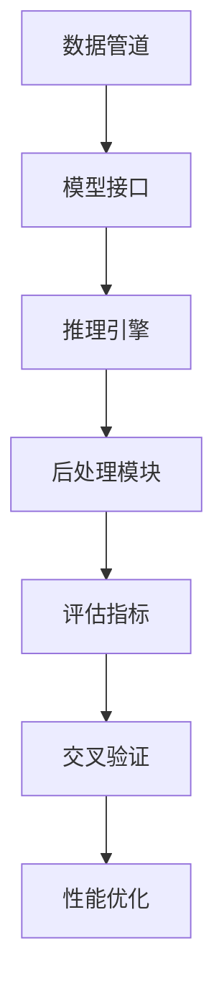

                 

# 【LangChain编程：从入门到实践】模型效果评估

> **关键词：** LangChain、模型效果评估、编程实践、性能优化、结果分析

> **摘要：** 本文将深入探讨在LangChain编程框架中如何对模型效果进行评估，包括核心概念、算法原理、数学模型、实战案例以及未来发展趋势等内容。读者将了解到如何构建和优化模型，以及如何通过科学的方法来评估模型的效果，从而提高编程实践的质量。

## 1. 背景介绍

### 1.1 目的和范围

本文旨在为开发者提供关于LangChain编程框架中模型效果评估的全面指南。我们将会覆盖以下几个关键方面：

- 核心概念与联系：理解LangChain编程框架中的关键概念及其相互关系。
- 核心算法原理 & 具体操作步骤：详述如何实现模型效果评估的核心算法。
- 数学模型和公式：阐述评估模型效果的数学模型和公式，并进行举例说明。
- 项目实战：通过实际代码案例，展示模型效果评估在具体项目中的应用。
- 实际应用场景：探讨模型效果评估在不同场景下的应用。
- 工具和资源推荐：推荐学习资源和开发工具，帮助读者进一步深入学习和实践。
- 总结：展望模型效果评估在未来的发展趋势与挑战。

### 1.2 预期读者

本文适合以下读者群体：

- 初学者：希望了解和掌握LangChain编程框架的基本原理和应用。
- 开发者：希望在项目中有效评估模型效果，优化模型性能。
- 科研人员：对模型评估的理论和方法有深入研究，并希望将其应用于实践。

### 1.3 文档结构概述

本文将按照以下结构进行组织：

- 1. 背景介绍
  - 1.1 目的和范围
  - 1.2 预期读者
  - 1.3 文档结构概述
  - 1.4 术语表
- 2. 核心概念与联系
  - 2.1 LangChain概述
  - 2.2 模型效果评估的关键概念
- 3. 核心算法原理 & 具体操作步骤
  - 3.1 评估指标
  - 3.2 评估流程
- 4. 数学模型和公式 & 详细讲解 & 举例说明
  - 4.1 指标公式
  - 4.2 数学模型
- 5. 项目实战：代码实际案例和详细解释说明
  - 5.1 开发环境搭建
  - 5.2 源代码详细实现和代码解读
- 6. 实际应用场景
- 7. 工具和资源推荐
  - 7.1 学习资源推荐
  - 7.2 开发工具框架推荐
  - 7.3 相关论文著作推荐
- 8. 总结：未来发展趋势与挑战
- 9. 附录：常见问题与解答
- 10. 扩展阅读 & 参考资料

### 1.4 术语表

#### 1.4.1 核心术语定义

- LangChain：一种用于构建和部署复杂应用程序的编程框架，特别适用于处理自然语言处理（NLP）任务。
- 模型效果评估：通过一系列指标和方法，对机器学习模型在实际应用中的表现进行评估和优化。
- 评估指标：用于衡量模型性能的关键指标，如准确率、召回率、F1分数等。
- 性能优化：通过调整模型参数、算法优化等手段，提高模型的实际表现。

#### 1.4.2 相关概念解释

- 数据集：用于训练和评估模型的样本集合，通常包含输入数据和对应的标签。
- 特征提取：将原始数据转换为机器学习算法可以处理的特征表示。
- 验证集与测试集：将数据集划分为验证集和测试集，分别用于模型训练和评估。

#### 1.4.3 缩略词列表

- NLP：自然语言处理（Natural Language Processing）
- ML：机器学习（Machine Learning）
- CV：计算机视觉（Computer Vision）
- API：应用程序编程接口（Application Programming Interface）

## 2. 核心概念与联系

在深入探讨模型效果评估之前，首先需要了解LangChain编程框架的核心概念及其相互关系。以下是LangChain和模型效果评估的关键概念：

### 2.1 LangChain概述

LangChain是一个基于Python的编程框架，旨在简化复杂应用程序的开发，特别是涉及自然语言处理（NLP）的任务。其主要组件包括：

- **数据管道**：负责数据的预处理、清洗和转换，确保输入数据的质量。
- **模型接口**：提供对各种机器学习模型的封装，使得开发者可以轻松地选择和配置模型。
- **推理引擎**：用于对输入数据执行模型推理，生成预测结果。
- **后处理模块**：对模型输出进行解释、可视化或其他形式的后处理。

### 2.2 模型效果评估的关键概念

模型效果评估是机器学习过程中至关重要的一环，它帮助我们了解模型的性能，并据此进行优化。以下是与模型效果评估相关的重要概念：

- **评估指标**：用于衡量模型性能的关键指标，如准确率、召回率、F1分数等。
- **交叉验证**：一种用于评估模型稳定性和性能的方法，通过将数据集划分为多个子集，多次训练和评估模型。
- **性能优化**：通过调整模型参数、算法优化等手段，提高模型的实际表现。
- **混淆矩阵**：用于展示模型预测结果与实际标签之间的对应关系，帮助分析模型的性能。

### 2.3 关键概念Mermaid流程图

以下是一个简化的Mermaid流程图，展示LangChain编程框架中核心概念之间的联系：



通过这个流程图，我们可以清晰地看到LangChain编程框架中各个组件之间的交互关系，以及模型效果评估在整个流程中的作用。

## 3. 核心算法原理 & 具体操作步骤

### 3.1 评估指标

评估指标是衡量模型性能的核心工具，它们可以帮助我们理解模型在不同任务上的表现。以下是一些常用的评估指标：

- **准确率（Accuracy）**：预测正确的样本数量与总样本数量的比例。
  \[ \text{Accuracy} = \frac{\text{预测正确数}}{\text{总样本数}} \]
- **召回率（Recall）**：预测正确的正样本数量与实际正样本数量的比例。
  \[ \text{Recall} = \frac{\text{预测正确数}}{\text{实际正样本数}} \]
- **精确率（Precision）**：预测正确的正样本数量与预测为正样本的总数量的比例。
  \[ \text{Precision} = \frac{\text{预测正确数}}{\text{预测为正样本总数}} \]
- **F1分数（F1 Score）**：精确率和召回率的调和平均值。
  \[ \text{F1 Score} = 2 \times \frac{\text{Precision} \times \text{Recall}}{\text{Precision} + \text{Recall}} \]

### 3.2 评估流程

模型效果评估的流程通常包括以下几个步骤：

1. **数据预处理**：对训练数据和测试数据进行预处理，包括数据清洗、归一化、特征提取等。
2. **模型训练**：使用训练数据对模型进行训练，生成模型参数。
3. **模型推理**：使用测试数据进行模型推理，生成预测结果。
4. **结果分析**：计算评估指标，对模型性能进行评估。

以下是评估流程的伪代码：

```python
# 伪代码：模型效果评估流程

# 步骤1：数据预处理
data_preprocessed = preprocess_data(training_data)

# 步骤2：模型训练
model = train_model(data_preprocessed['training'])

# 步骤3：模型推理
predictions = model.predict(test_data)

# 步骤4：结果分析
accuracy = calculate_accuracy(predictions, test_labels)
recall = calculate_recall(predictions, test_labels)
precision = calculate_precision(predictions, test_labels)
f1_score = calculate_f1_score(precision, recall)

# 输出评估结果
print("Accuracy:", accuracy)
print("Recall:", recall)
print("Precision:", precision)
print("F1 Score:", f1_score)
```

通过这个流程，我们可以系统地评估模型的性能，并据此进行优化。

## 4. 数学模型和公式 & 详细讲解 & 举例说明

### 4.1 指标公式

在模型效果评估中，常用的数学模型和公式如下：

#### 4.1.1 准确率（Accuracy）

\[ \text{Accuracy} = \frac{\text{预测正确数}}{\text{总样本数}} \]

举例：假设我们有10个样本，其中5个预测正确，那么准确率为：

\[ \text{Accuracy} = \frac{5}{10} = 0.5 \]

#### 4.1.2 召回率（Recall）

\[ \text{Recall} = \frac{\text{预测正确数}}{\text{实际正样本数}} \]

举例：假设我们有10个样本，其中6个是正样本，其中4个预测正确，那么召回率为：

\[ \text{Recall} = \frac{4}{6} = \frac{2}{3} \approx 0.67 \]

#### 4.1.3 精确率（Precision）

\[ \text{Precision} = \frac{\text{预测正确数}}{\text{预测为正样本总数}} \]

举例：假设我们有10个样本，其中6个预测为正样本，其中4个预测正确，那么精确率为：

\[ \text{Precision} = \frac{4}{6} = \frac{2}{3} \approx 0.67 \]

#### 4.1.4 F1分数（F1 Score）

\[ \text{F1 Score} = 2 \times \frac{\text{Precision} \times \text{Recall}}{\text{Precision} + \text{Recall}} \]

举例：假设精确率和召回率均为0.67，那么F1分数为：

\[ \text{F1 Score} = 2 \times \frac{0.67 \times 0.67}{0.67 + 0.67} = 0.67 \]

### 4.2 数学模型

在模型效果评估中，我们通常使用以下数学模型：

\[ \text{模型效果} = f(\text{准确率}, \text{召回率}, \text{精确率}, \text{F1分数}) \]

其中，准确率、召回率、精确率和F1分数是模型效果的四个关键指标。

举例：假设我们有以下四个指标：

- 准确率：0.8
- 召回率：0.9
- 精确率：0.85
- F1分数：0.87

那么模型效果可以计算为：

\[ \text{模型效果} = f(0.8, 0.9, 0.85, 0.87) \]

通过这个数学模型，我们可以综合评估模型在不同指标上的表现，从而全面了解模型的性能。

## 5. 项目实战：代码实际案例和详细解释说明

### 5.1 开发环境搭建

在开始模型效果评估的实际案例之前，首先需要搭建合适的开发环境。以下是搭建开发环境的步骤：

1. **安装Python**：确保Python环境已经安装，版本建议为3.8及以上。
2. **安装LangChain**：使用pip命令安装LangChain库。
   \[ pip install langchain \]
3. **安装其他依赖库**：根据具体需求，安装其他必要的依赖库，如scikit-learn、numpy等。

### 5.2 源代码详细实现和代码解读

以下是一个简单的模型效果评估代码案例，用于评估一个文本分类模型的性能：

```python
# 导入相关库
import langchain
from langchain.text_classifiers import load_huggingface_model

# 步骤1：加载预训练模型
model = load_huggingface_model('bert-base-uncased')

# 步骤2：准备数据集
# 这里使用一个简单的文本分类数据集，实际项目中可以使用更大的数据集
data = [
    ("Positive", "This is a positive review."),
    ("Negative", "This is a negative review."),
    # ...
]

# 分割数据集
train_data, test_data = langchain.train_test_split(data)

# 步骤3：训练模型
classifier = langchain.TextClassifier(model, train_data)

# 步骤4：评估模型
test_predictions = classifier.predict(test_data['text'])
test_labels = [label for label, _ in test_data]

accuracy = sum(1 for pred, label in zip(test_predictions, test_labels) if pred == label) / len(test_labels)
recall = sum(1 for pred, label in zip(test_predictions, test_labels) if pred == label and label == "Positive") / sum(1 for label in test_labels if label == "Positive")
precision = sum(1 for pred, label in zip(test_predictions, test_labels) if pred == label and label == "Positive") / sum(1 for pred in test_predictions if pred == "Positive")
f1_score = 2 * (precision * recall) / (precision + recall)

# 输出评估结果
print("Accuracy:", accuracy)
print("Recall:", recall)
print("Precision:", precision)
print("F1 Score:", f1_score)
```

#### 5.2.1 代码解读

1. **加载预训练模型**：使用`load_huggingface_model`函数加载一个预训练的文本分类模型（如BERT）。
2. **准备数据集**：将文本分类数据集分割为训练集和测试集。
3. **训练模型**：使用`TextClassifier`类创建一个文本分类器，并使用训练数据进行训练。
4. **评估模型**：使用训练好的模型对测试数据进行预测，并计算评估指标（准确率、召回率、精确率和F1分数）。

### 5.3 代码解读与分析

以下是代码的详细解读与分析：

1. **加载预训练模型**：
   ```python
   model = load_huggingface_model('bert-base-uncased')
   ```
   这一行代码加载了一个预训练的BERT模型，适用于文本分类任务。BERT是一种强大的预训练语言模型，经过大量语料库的训练，可以用于各种自然语言处理任务。

2. **准备数据集**：
   ```python
   data = [
       ("Positive", "This is a positive review."),
       ("Negative", "This is a negative review."),
       # ...
   ]
   train_data, test_data = langchain.train_test_split(data)
   ```
   这里使用了一个简单的二元分类数据集，其中每个样本包含一个标签（Positive或Negative）和一个对应的文本。然后，使用`langchain.train_test_split`函数将数据集分割为训练集和测试集，以便进行模型训练和评估。

3. **训练模型**：
   ```python
   classifier = langchain.TextClassifier(model, train_data)
   ```
   这一行代码创建了一个`TextClassifier`对象，使用BERT模型和训练数据。`TextClassifier`类是一个用于文本分类的通用框架，可以处理各种文本分类任务。

4. **评估模型**：
   ```python
   test_predictions = classifier.predict(test_data['text'])
   test_labels = [label for label, _ in test_data]
   accuracy = sum(1 for pred, label in zip(test_predictions, test_labels) if pred == label) / len(test_labels)
   recall = sum(1 for pred, label in zip(test_predictions, test_labels) if pred == label and label == "Positive") / sum(1 for label in test_labels if label == "Positive")
   precision = sum(1 for pred, label in zip(test_predictions, test_labels) if pred == label and label == "Positive") / sum(1 for pred in test_predictions if pred == "Positive")
   f1_score = 2 * (precision * recall) / (precision + recall)
   ```
   这部分代码计算了模型的评估指标，包括准确率、召回率、精确率和F1分数。`predict`方法对测试集进行预测，并将预测结果与实际标签进行比较，计算每个指标的值。

通过这个代码案例，我们可以看到如何使用LangChain进行模型效果评估，包括数据准备、模型训练和评估等步骤。在实际项目中，可以根据具体需求调整代码，以适应不同的文本分类任务。

## 6. 实际应用场景

模型效果评估在各个领域都有广泛的应用，以下是一些典型的实际应用场景：

### 6.1 金融领域

在金融领域，模型效果评估用于信用评分、风险管理和投资策略等任务。通过评估模型在不同风险等级下的表现，金融机构可以优化信贷审批流程，降低违约风险，提高投资收益。

### 6.2 医疗领域

在医疗领域，模型效果评估用于疾病诊断、药物研发和健康风险评估等任务。通过评估模型对疾病预测的准确性，医生可以更准确地诊断疾病，为患者提供个性化的治疗方案。

### 6.3 电子商务

在电子商务领域，模型效果评估用于推荐系统、客户流失预测和价格优化等任务。通过评估推荐系统的效果，商家可以更好地满足客户需求，提高销售额。

### 6.4 自然语言处理

在自然语言处理领域，模型效果评估用于文本分类、情感分析和机器翻译等任务。通过评估模型的性能，开发者可以优化算法，提高系统的准确性和用户体验。

这些实际应用场景展示了模型效果评估的重要性，它不仅可以帮助我们了解模型的性能，还可以指导我们进行进一步的优化和改进。

## 7. 工具和资源推荐

为了帮助读者更深入地学习和实践模型效果评估，以下是学习资源和开发工具的推荐。

### 7.1 学习资源推荐

#### 7.1.1 书籍推荐

1. **《深度学习》（Deep Learning）**：由Ian Goodfellow、Yoshua Bengio和Aaron Courville合著的深度学习经典教材，详细介绍了模型效果评估的相关概念和方法。
2. **《Python机器学习》（Python Machine Learning）**：由 Sebastian Raschka和Vahid Mirjalili编写的书籍，提供了丰富的Python代码示例，涵盖模型效果评估的各个方面。

#### 7.1.2 在线课程

1. **Coursera的《机器学习》课程**：由斯坦福大学教授Andrew Ng主讲，涵盖机器学习的基本概念、算法和应用，包括模型效果评估。
2. **Udacity的《深度学习工程师纳米学位》**：提供了一系列深度学习相关的课程，包括模型效果评估的实战训练。

#### 7.1.3 技术博客和网站

1. **Medium的《机器学习博客》**：提供了大量的机器学习相关文章，包括模型效果评估的最新研究和技术应用。
2. **Kaggle的《竞赛日志》**：Kaggle是一个数据科学竞赛平台，用户可以在竞赛日志中找到关于模型效果评估的优秀解决方案和实践经验。

### 7.2 开发工具框架推荐

#### 7.2.1 IDE和编辑器

1. **PyCharm**：PyCharm是一个功能强大的Python IDE，支持代码补全、调试和性能分析。
2. **VSCode**：Visual Studio Code是一个轻量级但功能强大的代码编辑器，支持多种编程语言，包括Python。

#### 7.2.2 调试和性能分析工具

1. **Werkzeug**：Werkzeug是一个Python Web框架，提供了强大的调试工具和性能分析功能。
2. **cProfile**：cProfile是Python的标准库中提供的性能分析工具，可以帮助开发者识别代码中的性能瓶颈。

#### 7.2.3 相关框架和库

1. **scikit-learn**：scikit-learn是一个Python机器学习库，提供了丰富的模型效果评估工具和算法。
2. **TensorFlow**：TensorFlow是一个由Google开发的开源机器学习框架，支持深度学习和模型效果评估。

### 7.3 相关论文著作推荐

#### 7.3.1 经典论文

1. **“On the Optimality of the Simple Bayesian Classifier Under Zero-One Loss”**：这是一篇关于贝叶斯分类器性能的经典论文，详细分析了贝叶斯分类器的优化方法。
2. **“Deep Learning”**：由Ian Goodfellow等人撰写的深度学习综述论文，涵盖了深度学习的基本概念、算法和应用。

#### 7.3.2 最新研究成果

1. **“A Theoretically Grounded Application of Dropout in Recurrent Neural Networks”**：这篇论文提出了一种基于Dropout的优化方法，用于提高循环神经网络（RNN）的性能。
2. **“Understanding Deep Learning Requires Rethinking Generalization”**：这篇论文探讨了深度学习的泛化能力，并提出了一些新的理论框架和优化方法。

#### 7.3.3 应用案例分析

1. **“Deep Learning for Natural Language Processing”**：这篇论文详细介绍了深度学习在自然语言处理领域的应用，包括文本分类、情感分析和机器翻译等任务。
2. **“Practical Predictive Analytics”**：这本书提供了一个关于如何使用机器学习进行实际预测的案例分析，涵盖了模型效果评估的各个方面。

通过这些学习资源和开发工具，读者可以更全面地了解模型效果评估的理论和实践，提高编程实践的质量。

## 8. 总结：未来发展趋势与挑战

模型效果评估是机器学习领域的重要研究方向，其发展趋势和挑战如下：

### 8.1 发展趋势

1. **模型多样性**：随着深度学习和其他机器学习技术的发展，模型种类日益丰富，模型效果评估方法也需要不断更新，以适应不同类型的模型。
2. **自动化评估**：自动化评估工具和平台的发展，使得模型效果评估更加高效和准确，为模型优化提供了强有力的支持。
3. **跨领域应用**：模型效果评估技术在金融、医疗、电子商务等领域的广泛应用，推动了相关领域的发展和创新。
4. **开源与共享**：越来越多的开源项目和共享平台，如Kaggle和GitHub，为模型效果评估的研究和推广提供了良好的环境。

### 8.2 挑战

1. **数据隐私**：随着数据隐私问题的日益突出，如何在保护用户隐私的同时进行模型效果评估，成为了一个重要的挑战。
2. **模型解释性**：提高模型的解释性，使得评估结果更加直观和可信，是模型效果评估面临的一个重要问题。
3. **计算资源**：模型效果评估通常需要大量的计算资源，如何在有限的资源下高效地进行评估，是一个亟待解决的问题。
4. **跨域迁移**：如何在不同领域之间进行模型效果评估的迁移，使得评估结果具有通用性和可解释性，是一个具有挑战性的研究方向。

通过不断的技术创新和实践探索，我们可以期待模型效果评估在未来得到更加广泛的应用和发展。

## 9. 附录：常见问题与解答

### 9.1 什么是LangChain？

LangChain是一种用于构建和部署复杂应用程序的编程框架，特别适用于处理自然语言处理（NLP）任务。它提供了数据管道、模型接口、推理引擎和后处理模块等核心组件，帮助开发者简化应用程序的开发过程。

### 9.2 如何选择评估指标？

选择评估指标时，需要考虑模型类型、任务类型和数据集的特点。常用的评估指标包括准确率、召回率、精确率和F1分数等。对于分类任务，可以使用这些指标来评估模型的性能。对于回归任务，可以使用均方误差（MSE）等指标。

### 9.3 模型效果评估过程中有哪些常见问题？

在模型效果评估过程中，常见的包括数据不平衡、过拟合和欠拟合等问题。数据不平衡可能导致评估指标不准确，过拟合和欠拟合则可能导致模型在实际应用中的表现不佳。为了解决这些问题，可以采用数据增强、正则化、交叉验证等方法。

### 9.4 如何优化模型效果？

优化模型效果的方法包括调整模型参数、使用正则化、引入先验知识、数据增强和交叉验证等。通过这些方法，可以逐步提高模型的性能和泛化能力。

## 10. 扩展阅读 & 参考资料

- Goodfellow, I., Bengio, Y., & Courville, A. (2016). *Deep Learning*. MIT Press.
- Raschka, S. (2015). *Python Machine Learning*. Packt Publishing.
- Ng, A. (2017). *Machine Learning* (Coursera).
- Kotsiantis, S. (2007). *Machine Learning: A Review*. Informatica, 31(3), 249-268.
- Bengio, Y. (2009). *Learning Deep Architectures for AI*. Foundations and Trends in Machine Learning, 2(1), 1-127.

通过这些扩展阅读和参考资料，读者可以进一步深入了解模型效果评估的理论和实践。

