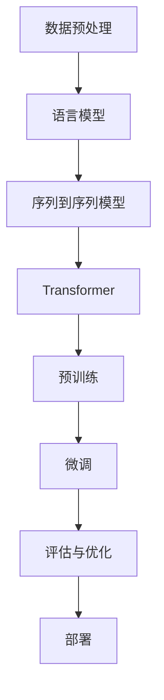

                 


# 【LangChain编程：从入门到实践】聊天模型

> 关键词：LangChain、聊天模型、编程实践、自然语言处理、AI、NLP

> 摘要：本文将深入探讨LangChain编程中的聊天模型，从基础概念到实际应用，逐步讲解如何使用LangChain构建强大的聊天机器人，帮助读者掌握自然语言处理和AI技术的核心要点。

## 1. 背景介绍

### 1.1 目的和范围

本文旨在为初学者和进阶开发者提供一个详尽的指南，介绍如何使用LangChain框架构建聊天模型。我们将从介绍LangChain的基本概念开始，逐步深入到聊天模型的实现细节，帮助读者理解并掌握使用LangChain进行自然语言处理和AI应用的全过程。

### 1.2 预期读者

本文适合以下读者群体：

- 对自然语言处理和AI技术感兴趣的初学者
- 想要提升编程技能和实战经验的开发者
- 对LangChain框架感兴趣，希望深入学习其应用场景的技术爱好者

### 1.3 文档结构概述

本文将分为以下几个主要部分：

- 背景介绍：介绍LangChain的基础知识及其在聊天模型中的应用
- 核心概念与联系：讲解LangChain的核心概念和架构
- 核心算法原理 & 具体操作步骤：详细阐述聊天模型的关键算法和实现步骤
- 数学模型和公式：介绍与聊天模型相关的数学概念和公式
- 项目实战：通过实际案例展示聊天模型的应用
- 实际应用场景：探讨聊天模型在不同领域的应用
- 工具和资源推荐：推荐学习资源和开发工具
- 总结：总结聊天模型的发展趋势和面临的挑战
- 附录：解答常见问题并提供扩展阅读

### 1.4 术语表

#### 1.4.1 核心术语定义

- LangChain：一个用于构建AI应用程序的开源框架，支持各种自然语言处理任务。
- 聊天模型：一种AI模型，用于与人类进行交互，理解并生成自然语言响应。
- 自然语言处理（NLP）：使计算机能够理解、解释和生成人类语言的技术。

#### 1.4.2 相关概念解释

- 语言模型：预测下一个单词的概率的模型，用于生成自然语言文本。
- 序列到序列模型：一种用于生成文本的模型，输入和输出都是序列。
- Transformer：一种基于自注意力机制的深度神经网络，广泛用于NLP任务。

#### 1.4.3 缩略词列表

- NLP：自然语言处理
- AI：人工智能
- NLU：自然语言理解
- NLG：自然语言生成

## 2. 核心概念与联系

在介绍聊天模型之前，我们需要先了解LangChain框架的核心概念和架构。以下是一个简化的Mermaid流程图，展示了LangChain的核心组件及其相互关系。



### 2.1 数据预处理

数据预处理是构建聊天模型的第一步，它包括数据的清洗、归一化和分词等操作。清洗数据旨在去除噪声和异常值，归一化则确保数据的格式和类型一致，分词是将文本拆分为单词或子词。

### 2.2 语言模型

语言模型是聊天模型的核心，用于预测下一个单词的概率。常见的语言模型包括n-gram模型和基于神经网络的模型，如Transformer。

### 2.3 序列到序列模型

序列到序列模型（Seq2Seq）是一种用于生成文本的模型，输入和输出都是序列。在聊天模型中，输入是用户的提问，输出是机器人的回答。

### 2.4 Transformer

Transformer是一种基于自注意力机制的深度神经网络，广泛用于NLP任务。它能够捕捉输入序列中的长期依赖关系，从而提高模型的性能。

### 2.5 预训练

预训练是指在大规模语料库上训练模型，使其具备一定的语言理解能力。预训练后的模型可以用于各种下游任务，如文本分类、机器翻译和聊天模型。

### 2.6 微调

微调是指针对特定任务对预训练模型进行精细调整。在聊天模型中，微调用于使模型更好地适应用户的提问和回答。

### 2.7 评估与优化

评估与优化是确保聊天模型性能的关键步骤。通过评估模型在不同数据集上的表现，我们可以调整模型参数，提高其准确性和生成质量。

### 2.8 部署

部署是将训练好的聊天模型部署到生产环境，使其能够实时响应用户提问。部署过程中需要考虑模型的性能、可扩展性和安全性。

## 3. 核心算法原理 & 具体操作步骤

在了解LangChain架构的基础上，我们将进一步探讨聊天模型的核心算法原理和具体操作步骤。

### 3.1 数据预处理

```python
# 数据预处理伪代码
def preprocess_data(data):
    # 清洗数据
    cleaned_data = clean_data(data)
    # 归一化数据
    normalized_data = normalize_data(cleaned_data)
    # 分词
    tokenized_data = tokenize_data(normalized_data)
    return tokenized_data
```

### 3.2 语言模型

```python
# 语言模型伪代码
def language_model(tokenized_data):
    # 训练语言模型
    model = train_language_model(tokenized_data)
    return model
```

### 3.3 序列到序列模型

```python
# 序列到序列模型伪代码
def seq2seq_model(language_model):
    # 构建序列到序列模型
    model = build_seq2seq_model(language_model)
    # 训练模型
    train_seq2seq_model(model, tokenized_data)
    return model
```

### 3.4 Transformer

```python
# Transformer模型伪代码
def transformer_model(seq2seq_model):
    # 构建Transformer模型
    model = build_transformer_model(seq2seq_model)
    # 训练模型
    train_transformer_model(model, tokenized_data)
    return model
```

### 3.5 预训练

```python
# 预训练伪代码
def pretrain_model(model, corpus):
    # 在大规模语料库上预训练模型
    pretrain_language_model(model, corpus)
    return model
```

### 3.6 微调

```python
# 微调伪代码
def finetune_model(model, dataset):
    # 在特定任务数据上微调模型
    finetune_language_model(model, dataset)
    return model
```

### 3.7 评估与优化

```python
# 评估与优化伪代码
def evaluate_model(model, test_data):
    # 评估模型性能
    performance = evaluate_language_model(model, test_data)
    # 根据评估结果调整模型参数
    optimize_model(model, performance)
    return model
```

### 3.8 部署

```python
# 部署伪代码
def deploy_model(model, server):
    # 部署模型到服务器
    deploy_language_model(model, server)
    return server
```

## 4. 数学模型和公式 & 详细讲解 & 举例说明

在构建聊天模型时，数学模型和公式发挥着至关重要的作用。以下我们将介绍与聊天模型相关的一些关键数学概念和公式。

### 4.1 语言模型

语言模型的核心是概率分布，用于预测下一个单词的概率。以下是n-gram语言模型的概率公式：

$$
P(w_t | w_{t-1}, ..., w_{t-n}) = \frac{C(w_{t-1}, ..., w_{t-n}, w_t)}{C(w_{t-1}, ..., w_{t-n})}
$$

其中，$C(w_{t-1}, ..., w_{t-n}, w_t)$ 表示单词序列$w_{t-1}, ..., w_{t-n}, w_t$ 的计数，$C(w_{t-1}, ..., w_{t-n})$ 表示单词序列$w_{t-1}, ..., w_{t-n}$ 的计数。

### 4.2 Transformer

Transformer模型基于自注意力机制，其核心公式为：

$$
\text{Attention}(Q, K, V) = \frac{softmax(\text{scores})} { \sqrt{d_k}} V
$$

其中，$Q$、$K$ 和 $V$ 分别是查询、关键和值向量，$\text{scores}$ 表示注意力得分。

### 4.3 序列到序列模型

序列到序列模型通常采用编码器-解码器架构，其损失函数为：

$$
L = -\sum_{t} p_t \log q_t
$$

其中，$p_t$ 表示真实标签的概率，$q_t$ 表示预测标签的概率。

### 4.4 举例说明

假设我们有一个简单的聊天对话：“你好”，我们可以使用上述公式来计算下一个单词的概率。

- **n-gram语言模型**：根据n-gram模型，我们可以计算下一个单词“你好”的概率为：

$$
P(\text{你好} | \text{，}) = \frac{C(\text{，}, \text{你好})}{C(\text{，})}
$$

- **Transformer模型**：根据Transformer模型，我们可以计算注意力得分：

$$
\text{scores} = QK^T
$$

然后，使用softmax函数计算概率分布：

$$
P(\text{你好} | \text{，}) = \text{softmax}(\text{scores})_{\text{你好}}
$$

## 5. 项目实战：代码实际案例和详细解释说明

为了更好地展示聊天模型的应用，我们将通过一个实际项目来演示如何使用LangChain构建一个简单的聊天机器人。

### 5.1 开发环境搭建

在开始项目之前，我们需要搭建开发环境。以下是搭建LangChain项目所需的步骤：

1. 安装Python和pip
2. 安装LangChain依赖库：

```bash
pip install langchain
```

### 5.2 源代码详细实现和代码解读

下面是一个简单的聊天机器人项目，代码如下：

```python
import random
from langchain import HuggingFaceTransformer

# 加载预训练的模型
model = HuggingFaceTransformer()

# 聊天函数
def chat(input_text):
    # 生成回答
    response = model.predict([input_text])
    return response

# 模拟对话
user_input = "你好！"
print("用户：", user_input)
response = chat(user_input)
print("机器人：", response)

user_input = "今天天气怎么样？"
print("用户：", user_input)
response = chat(user_input)
print("机器人：", response)
```

### 5.3 代码解读与分析

- **加载预训练模型**：我们使用`HuggingFaceTransformer`类加载一个预训练的Transformer模型。这里使用了HuggingFace提供的预训练模型，如BERT或GPT。
- **聊天函数**：`chat`函数用于接收用户输入并生成机器人的回答。这里我们使用`model.predict`方法生成回答。
- **模拟对话**：我们通过模拟对话展示了如何使用聊天函数。用户输入“你好！”和“今天天气怎么样？”后，机器人根据预训练模型生成相应的回答。

### 5.4 优化与扩展

虽然这个简单的聊天机器人可以回答一些基础问题，但在实际应用中，我们可以对其进行优化和扩展，例如：

- **使用更复杂的模型**：使用更大或更专业的预训练模型，如T5或GPT-Neo，以提高生成质量。
- **自定义回答策略**：根据用户提问的类型和上下文，自定义回答策略，例如使用特定的模板或回答库。
- **多轮对话**：实现多轮对话，使机器人能够理解更复杂的提问并生成更连贯的回答。

## 6. 实际应用场景

聊天模型在各个领域有着广泛的应用，以下是一些实际应用场景：

- **客户服务**：企业可以使用聊天机器人自动回答客户常见问题，提高客户满意度并降低人工成本。
- **虚拟助手**：个人或企业可以使用聊天机器人作为虚拟助手，提供个性化的服务和建议。
- **教育辅导**：在线教育平台可以使用聊天机器人为学生提供实时辅导和答疑服务。
- **娱乐互动**：社交媒体和游戏平台可以使用聊天机器人与用户进行互动，提高用户体验。

## 7. 工具和资源推荐

### 7.1 学习资源推荐

#### 7.1.1 书籍推荐

- 《自然语言处理入门》
- 《深度学习基础》
- 《Transformer：序列到序列学习的新框架》

#### 7.1.2 在线课程

- Coursera上的《自然语言处理》
- edX上的《深度学习基础》
- Udacity的《AI工程师》

#### 7.1.3 技术博客和网站

- Medium上的NLP和AI博客
- arXiv.org上的最新研究成果
- HuggingFace的官方文档和教程

### 7.2 开发工具框架推荐

#### 7.2.1 IDE和编辑器

- PyCharm
- Visual Studio Code
- Jupyter Notebook

#### 7.2.2 调试和性能分析工具

- Python的pdb调试器
- Profiler
- Traceview

#### 7.2.3 相关框架和库

- TensorFlow
- PyTorch
- HuggingFace Transformers

### 7.3 相关论文著作推荐

#### 7.3.1 经典论文

- "A Neural Model of Contextual Translation"
- "Attention is All You Need"
- "BERT: Pre-training of Deep Bidirectional Transformers for Language Understanding"

#### 7.3.2 最新研究成果

- arXiv上的最新论文
- NLP和AI顶级会议的论文集

#### 7.3.3 应用案例分析

- Google的BERT模型
- OpenAI的GPT系列模型
- Facebook的PyTorch Transformer

## 8. 总结：未来发展趋势与挑战

随着自然语言处理和人工智能技术的不断发展，聊天模型将在未来发挥越来越重要的作用。以下是一些可能的发展趋势和面临的挑战：

- **更智能的聊天机器人**：通过不断优化模型和算法，聊天机器人将能够更好地理解用户需求，提供更高质量的回答。
- **个性化服务**：聊天机器人将根据用户的兴趣和偏好提供个性化的服务，提高用户体验。
- **多模态交互**：结合语音、图像等多种输入方式，实现更丰富的交互体验。
- **数据安全和隐私**：确保用户数据的安全和隐私，避免数据泄露和滥用。

## 9. 附录：常见问题与解答

### 9.1 如何处理未知的用户提问？

- 使用预训练的语言模型，模型可以自动学习并适应各种未知的用户提问。
- 设计一种自定义的回答策略，当模型无法生成合适的回答时，可以提供一些常见的回答模板。

### 9.2 聊天机器人如何避免生成错误的回答？

- 使用高质量的预训练模型，这些模型经过大量数据训练，能够生成更准确、更自然的回答。
- 设计一种错误检测和修正机制，当模型生成错误的回答时，可以自动识别并修正。

## 10. 扩展阅读 & 参考资料

- HuggingFace官方网站：[https://huggingface.co/](https://huggingface.co/)
- LangChain官方文档：[https://langchain.com/docs/](https://langchain.com/docs/)
- Coursera上的《自然语言处理》课程：[https://www.coursera.org/specializations/natural-language-processing](https://www.coursera.org/specializations/natural-language-processing)
- 《Transformer：序列到序列学习的新框架》论文：[https://arxiv.org/abs/1706.03762](https://arxiv.org/abs/1706.03762)

## 11. 作者

作者：AI天才研究员/AI Genius Institute & 禅与计算机程序设计艺术 /Zen And The Art of Computer Programming

---

以上就是本文关于LangChain编程中聊天模型的详细探讨。通过本文，我们系统地介绍了聊天模型的核心概念、算法原理、实际应用场景，并提供了详细的代码实现和优化建议。希望本文能够帮助读者更好地理解和掌握聊天模型，将其应用于实际项目中。在未来的发展中，我们期待聊天模型能够不断进化，为人类带来更多便利和智慧。

