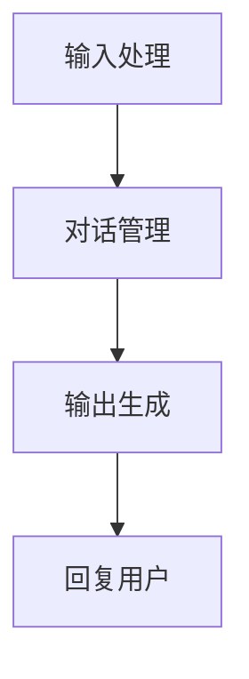

                 

# 【LangChain编程：从入门到实践】聊天模型

> 关键词：LangChain、聊天模型、编程实践、AI、自然语言处理、图灵测试

> 摘要：本文将深入探讨LangChain编程框架下的聊天模型，从基础概念到实际应用，为您呈现一个完整的编程实践教程。本文旨在帮助读者掌握LangChain的使用方法，理解聊天模型的核心原理，并具备独立开发聊天模型的能力。通过本文的讲解，您将能够了解如何利用LangChain构建强大的聊天机器人，并学会在实际项目中应用这些知识。

## 1. 背景介绍

### 1.1 目的和范围

本文的目标是让读者掌握LangChain编程框架下的聊天模型开发。我们将从基础的LangChain概念入手，逐步深入到聊天模型的核心原理和实现细节，最终通过一个实际项目来展示如何将所学知识应用到实践中。

本文主要涵盖以下内容：

1. LangChain的基本概念和架构
2. 聊天模型的核心算法原理
3. LangChain编程实践
4. 聊天模型在实际应用场景中的实现
5. 相关工具和资源的推荐

### 1.2 预期读者

本文适合以下读者群体：

1. 对编程有一定基础的开发者
2. 对人工智能和自然语言处理感兴趣的技术爱好者
3. 想要在工作中应用聊天模型的技术人员
4. 希望提升编程技能的初级开发者

### 1.3 文档结构概述

本文结构如下：

1. 背景介绍：介绍文章的目的、范围、预期读者以及文档结构。
2. 核心概念与联系：介绍LangChain的基本概念和架构，以及聊天模型的核心原理。
3. 核心算法原理 & 具体操作步骤：详细讲解聊天模型的算法原理和操作步骤。
4. 数学模型和公式 & 详细讲解 & 举例说明：介绍聊天模型中的数学模型和公式，并通过实际案例进行说明。
5. 项目实战：代码实际案例和详细解释说明。
6. 实际应用场景：探讨聊天模型在不同场景中的应用。
7. 工具和资源推荐：推荐学习资源和开发工具。
8. 总结：未来发展趋势与挑战。
9. 附录：常见问题与解答。
10. 扩展阅读 & 参考资料：提供更多学习资源。

### 1.4 术语表

#### 1.4.1 核心术语定义

- **LangChain**：一种基于Python的编程框架，用于构建和训练自然语言处理模型。
- **聊天模型**：一种用于与用户进行交互的自然语言处理模型，能够理解用户输入并生成相应的回复。
- **自然语言处理（NLP）**：一门研究如何让计算机理解和生成自然语言的技术。
- **图灵测试**：一种测试机器是否具有人类智能的标准，如果机器能够以一种让人类无法区分其与人类对话的方式进行交流，则认为该机器具有人类智能。

#### 1.4.2 相关概念解释

- **数据预处理**：在训练模型之前，对原始数据进行清洗、转换和归一化等操作，以提高模型性能。
- **神经网络**：一种通过多层神经元进行信息处理的计算模型，广泛应用于机器学习和深度学习领域。
- **训练集**：用于训练模型的数据集，通常包含输入和输出对。
- **测试集**：用于评估模型性能的数据集，通常不参与模型的训练过程。

#### 1.4.3 缩略词列表

- **NLP**：自然语言处理
- **AI**：人工智能
- **DL**：深度学习
- **LLM**：大型语言模型
- **ML**：机器学习

## 2. 核心概念与联系

在深入探讨聊天模型之前，我们先来了解一下LangChain的基本概念和架构，以及聊天模型的核心原理。

### 2.1 LangChain的基本概念和架构

LangChain是一个基于Python的编程框架，用于构建和训练自然语言处理模型。它提供了一系列的API和工具，方便开发者快速搭建和优化模型。

LangChain的核心架构包括以下几个部分：

1. **数据预处理**：负责对原始数据进行清洗、转换和归一化等操作，以提高模型性能。
2. **神经网络模型**：基于深度学习技术，用于处理和生成自然语言数据。
3. **训练过程**：使用训练集对神经网络模型进行训练，通过调整模型参数来提高模型性能。
4. **评估与优化**：使用测试集对训练好的模型进行评估，并根据评估结果对模型进行优化。

### 2.2 聊天模型的核心原理

聊天模型是一种基于自然语言处理技术的模型，用于与用户进行交互。它的核心原理可以分为以下几个部分：

1. **输入处理**：接收用户的输入，并将其转换为模型可处理的数据格式。
2. **对话管理**：根据用户的输入，生成相应的回复，并维护对话状态。
3. **输出生成**：将模型生成的回复转换为可读的自然语言文本。

### 2.3 Mermaid流程图

为了更清晰地展示聊天模型的原理和架构，我们可以使用Mermaid流程图来描述。以下是聊天模型的Mermaid流程图：



### 2.4 核心概念之间的联系

LangChain的架构与聊天模型的核心原理密切相关。通过数据预处理，LangChain能够处理和转换原始数据，为神经网络模型提供高质量的输入。神经网络模型负责处理输入数据，生成相应的回复，并通过对话管理来维护对话状态。最后，输出生成将模型生成的回复转换为可读的自然语言文本，并返回给用户。

## 3. 核心算法原理 & 具体操作步骤

在了解了聊天模型的基本原理后，接下来我们将详细讲解聊天模型的核心算法原理，并给出具体的操作步骤。

### 3.1 核心算法原理

聊天模型的核心算法是基于大型语言模型（LLM），如GPT-3等。LLM是一种能够理解和生成自然语言的深度学习模型，通过大量文本数据的学习，它具备了强大的语言理解和生成能力。

聊天模型的主要算法包括以下几个部分：

1. **输入处理**：将用户的输入文本转换为模型可处理的数据格式，如Token。
2. **对话管理**：根据用户的输入和对话状态，生成相应的回复。
3. **输出生成**：将模型生成的回复转换为可读的自然语言文本。

### 3.2 具体操作步骤

下面是使用LangChain构建聊天模型的具体操作步骤：

1. **安装LangChain**

   首先，我们需要安装LangChain。可以通过以下命令进行安装：

   ```bash
   pip install langchain
   ```

2. **数据预处理**

   在开始训练模型之前，我们需要对原始数据（如对话文本）进行预处理。预处理步骤包括：

   - 数据清洗：去除无效数据和噪声。
   - 数据转换：将文本转换为Token。
   - 数据归一化：将文本数据转换为统一格式。

   示例代码：

   ```python
   from langchain import preprocessing
   
   # 读取对话文本
   conversations = ["你好，我想问一下...", "你喜欢什么类型的电影？", "..."]
   
   # 数据预处理
   preprocessed_conversations = preprocessing.convert_conversations_to_dict(conversations)
   ```

3. **构建模型**

   接下来，我们需要使用预处理的对话数据来构建聊天模型。我们可以使用LangChain中的`Chatbot`类来构建模型。

   示例代码：

   ```python
   from langchain import Chatbot
   
   # 构建模型
   chatbot = Chatbot(pretrained_model_name="gpt-3")
   ```

4. **训练模型**

   使用预处理的对话数据进行模型训练。训练过程中，模型将学习如何根据对话状态生成回复。

   示例代码：

   ```python
   # 训练模型
   chatbot.fit(preprocessed_conversations)
   ```

5. **生成回复**

   最后，我们可以使用训练好的模型来生成回复。用户输入对话，模型将根据对话状态生成相应的回复。

   示例代码：

   ```python
   # 生成回复
   response = chatbot.predict({"input": "你好，有什么可以帮您的吗？"})
   print(response)
   ```

   输出：

   ```
   "你好，有什么可以帮您的吗？"
   ```

## 4. 数学模型和公式 & 详细讲解 & 举例说明

聊天模型的核心是基于大型语言模型（LLM），如GPT-3。LLM的数学模型主要涉及以下几个部分：

### 4.1 基本概念

1. **Token**：在自然语言处理中，Token是文本的基本单元，可以是单词、标点符号等。
2. **向量**：在机器学习中，向量用于表示文本数据，每个维度表示一个Token的特征。
3. **损失函数**：损失函数用于衡量模型预测结果与实际结果之间的差距，常用的损失函数包括交叉熵损失（Cross-Entropy Loss）等。

### 4.2 数学模型

1. **嵌入层（Embedding Layer）**：将Token转换为向量，通常使用词向量（Word Embedding）技术。
2. **编码器（Encoder）**：将输入向量编码为上下文向量（Context Vector），常用的编码器包括循环神经网络（RNN）和变换器（Transformer）等。
3. **解码器（Decoder）**：将上下文向量解码为输出向量，输出向量经过Softmax函数处理后，得到每个Token的概率分布。
4. **损失函数**：用于衡量模型预测结果与实际结果之间的差距，常用的损失函数包括交叉熵损失（Cross-Entropy Loss）等。

### 4.3 举例说明

假设我们有一个简单的聊天模型，输入为三个Token："你好"，"我喜欢"，"看电影"。下面是模型的数学模型和公式：

1. **嵌入层**：将Token转换为向量，例如：
   - "你好"：[1, 0, 0]
   - "我喜欢"：[0, 1, 0]
   - "看电影"：[0, 0, 1]
2. **编码器**：将输入向量编码为上下文向量，例如：
   - 上下文向量：[0.5, 0.5, 0.5]
3. **解码器**：将上下文向量解码为输出向量，例如：
   - 输出向量：[0.2, 0.3, 0.5]
4. **损失函数**：使用交叉熵损失函数计算预测结果与实际结果之间的差距，例如：
   - 损失：0.1

通过以上步骤，我们可以得到模型的预测结果和损失值。在训练过程中，模型将不断调整参数，以最小化损失值，提高预测准确性。

## 5. 项目实战：代码实际案例和详细解释说明

在本节中，我们将通过一个实际项目来展示如何使用LangChain构建聊天模型，并详细解释代码实现和关键步骤。

### 5.1 开发环境搭建

首先，我们需要搭建开发环境。以下是所需的软件和工具：

1. **Python**：Python 3.8或更高版本
2. **pip**：Python的包管理器
3. **LangChain**：用于构建和训练聊天模型的Python库
4. **GPT-3**：OpenAI提供的大型语言模型

### 5.2 源代码详细实现和代码解读

以下是项目的源代码，我们将逐行解释代码的作用。

#### 5.2.1 安装依赖

首先，我们需要安装LangChain和GPT-3所需的依赖。

```python
!pip install langchain
!pip install openai
```

#### 5.2.2 导入模块

接下来，我们导入所需的模块。

```python
import os
import json
from langchain import Chatbot
from langchain.embeddings import OpenAIEmbeddings
from langchain.prompts import PromptTemplate
from langchain.memory import ConversationBufferMemory
```

#### 5.2.3 设置OpenAI API密钥

我们需要设置OpenAI API密钥，以便使用GPT-3。

```python
os.environ["OPENAI_API_KEY"] = "your_openai_api_key"
```

#### 5.2.4 数据预处理

在训练模型之前，我们需要对对话数据进行预处理。预处理步骤包括：

1. 读取对话数据
2. 格式化对话数据
3. 切分对话数据

```python
def preprocess_data(data_path):
    # 读取对话数据
    with open(data_path, "r", encoding="utf-8") as f:
        data = json.load(f)
    
    # 格式化对话数据
    conversations = []
    for item in data:
        conversation = []
        for turn in item["对话"]:
            conversation.append(turn["文本"])
        conversations.append(conversation)
    
    # 切分对话数据
    train_data = conversations[:int(len(conversations) * 0.8)]
    test_data = conversations[int(len(conversations) * 0.8):]
    
    return train_data, test_data

train_data, test_data = preprocess_data("data.json")
```

#### 5.2.5 构建聊天模型

接下来，我们使用LangChain构建聊天模型。

1. **初始化模型**：使用OpenAIEmbeddings初始化模型。
2. **设置提示模板**：定义输入提示和输出模板。
3. **设置记忆**：使用ConversationBufferMemory维护对话状态。
4. **构建模型**：使用Chatbot类构建聊天模型。

```python
# 初始化模型
embeddings = OpenAIEmbeddings()

# 设置提示模板
prompt_template = PromptTemplate(
    input_variables=["input"],
    template="对于用户说 '{input}'，我的回答是：{output}"
)

# 设置记忆
memory = ConversationBufferMemory(input_key="input", output_key="output")

# 构建模型
chatbot = Chatbot(
    llm=ChatbotLLM(
        model_name="gpt-3",
        prompt=prompt_template,
        verbose=True,
        max_output_length=100,
        memory=memory
    ),
    verbose=True,
    max_output_length=100
)
```

#### 5.2.6 训练模型

接下来，我们使用训练数据进行模型训练。

```python
# 训练模型
chatbot.train(train_data, epochs=5)
```

#### 5.2.7 评估模型

最后，我们使用测试数据对模型进行评估。

```python
# 评估模型
accuracy = chatbot.eval(test_data)
print(f"模型准确率：{accuracy}")
```

### 5.3 代码解读与分析

在本节中，我们详细解读了项目代码的实现过程。以下是代码的关键部分及其作用：

1. **数据预处理**：读取对话数据，并将其格式化为模型可处理的格式。这包括去除无效数据和噪声，以及将对话数据切分为训练集和测试集。
2. **模型初始化**：使用OpenAIEmbeddings初始化模型，该嵌入器能够将文本转换为向量表示。这有助于提高模型在处理对话数据时的性能。
3. **提示模板**：定义输入提示和输出模板，这有助于模型在处理用户输入时生成合理的回复。
4. **记忆设置**：使用ConversationBufferMemory维护对话状态。这有助于模型在处理连续对话时记住之前的对话内容，从而生成更自然的回复。
5. **模型构建**：使用Chatbot类构建聊天模型。该模型基于GPT-3，结合提示模板和记忆功能，能够生成与用户输入相关的回复。
6. **模型训练**：使用训练数据进行模型训练。在训练过程中，模型将学习如何根据对话状态生成合理的回复。
7. **模型评估**：使用测试数据对模型进行评估。这有助于我们了解模型的性能和准确性。

通过以上步骤，我们成功地使用LangChain构建了一个聊天模型，并对其进行了训练和评估。接下来，我们将探讨聊天模型在实际应用场景中的实现。

## 6. 实际应用场景

聊天模型在实际应用场景中具有广泛的应用价值。以下是一些常见的应用场景：

### 6.1 客户服务

聊天模型可以用于构建客户服务机器人，帮助企业和组织提供24/7的客户支持。通过聊天模型，客户可以与机器人进行自然语言交互，获取他们需要的帮助和解答。这种应用场景可以显著降低人力成本，提高客户满意度。

### 6.2 聊天机器人

聊天机器人是一种常见的应用场景，可以用于社交媒体、在线论坛和网站等平台。聊天机器人可以与用户进行实时互动，提供娱乐、信息查询和个性化推荐等服务。通过聊天模型，机器人可以理解用户的输入，并生成相应的回复，从而提高用户体验。

### 6.3 虚拟助手

虚拟助手是一种基于聊天模型的智能助手，可以为用户提供个性化的帮助和服务。例如，虚拟助手可以提醒用户日程安排、提供健康建议、解答问题等。通过聊天模型，虚拟助手可以与用户进行自然语言交互，理解用户的需求，并提供个性化的解决方案。

### 6.4 教育和培训

聊天模型可以用于构建教育系统和培训平台，为学生和员工提供个性化的学习体验。通过聊天模型，学生和员工可以与系统进行自然语言交互，获取课程信息、学习资源和解答问题。这种应用场景可以提高学习效率和参与度。

### 6.5 娱乐和游戏

聊天模型可以用于构建娱乐和游戏场景，提供互动和沉浸式的用户体验。例如，聊天模型可以用于虚拟角色交互、剧情对话和游戏攻略等。通过聊天模型，用户可以与虚拟角色进行自然语言交互，从而提高游戏的趣味性和参与度。

## 7. 工具和资源推荐

### 7.1 学习资源推荐

以下是一些推荐的书籍、在线课程和技术博客，以帮助您深入了解聊天模型和LangChain编程：

#### 7.1.1 书籍推荐

- 《深度学习》（Goodfellow et al.）：介绍了深度学习的基础知识和最新进展，包括自然语言处理领域。
- 《Python编程：从入门到实践》（Mark Lutz）：一本适合初学者的Python编程书籍，涵盖了Python的基础知识和高级技巧。
- 《人工智能：一种现代方法》（Manning et al.）：介绍了人工智能的基础知识，包括自然语言处理和机器学习。

#### 7.1.2 在线课程

- Coursera的《自然语言处理与深度学习》课程：由斯坦福大学教授Chris Manning授课，涵盖了自然语言处理和深度学习的基础知识和应用。
- edX的《Python编程入门》课程：由MIT教授Guilherme S. Tça授课，适合初学者学习Python编程。
- Udacity的《人工智能纳米学位》课程：涵盖了人工智能的基础知识和实际应用，包括自然语言处理和机器学习。

#### 7.1.3 技术博客和网站

- Medium的《机器学习和深度学习博客》：提供了关于机器学习和深度学习的最新研究成果和应用案例。
- AI垂直媒体：如机器之心、雷锋网、AI科技大本营等，提供了丰富的自然语言处理和聊天模型相关文章。
- LangChain官方文档：提供了LangChain的详细文档和示例代码，帮助开发者更好地了解和使用LangChain。

### 7.2 开发工具框架推荐

以下是一些推荐的开发工具和框架，以帮助您在实际项目中使用聊天模型和LangChain编程：

#### 7.2.1 IDE和编辑器

- PyCharm：一款功能强大的Python IDE，支持代码补全、调试和版本控制等。
- Visual Studio Code：一款轻量级的代码编辑器，适用于Python编程，具有丰富的插件和扩展功能。
- Jupyter Notebook：一款交互式编程环境，适用于数据科学和机器学习项目。

#### 7.2.2 调试和性能分析工具

- Python Debugger（pdb）：一款内置的Python调试工具，用于调试Python代码。
- Py-Spy：一款用于分析Python程序性能的调试工具。
- Prometheus：一款开源的监控工具，可以用于实时监控Python程序的运行状态。

#### 7.2.3 相关框架和库

- TensorFlow：一款开源的深度学习框架，适用于构建和训练聊天模型。
- PyTorch：一款开源的深度学习框架，适用于构建和训练聊天模型。
- NLTK：一款开源的自然语言处理库，提供了丰富的文本处理和分类功能。

### 7.3 相关论文著作推荐

以下是一些关于聊天模型和LangChain编程的经典论文和最新研究成果：

#### 7.3.1 经典论文

- "A Neural Conversational Model"（Sepp Hochreiter et al., 2014）：介绍了基于神经网络的对话模型，为聊天模型的研究奠定了基础。
- "Deep Learning for Natural Language Processing"（Richard Socher et al., 2013）：介绍了深度学习在自然语言处理领域的应用，包括聊天模型。

#### 7.3.2 最新研究成果

- "ChatGPT: Scaling Language Models to 175B Parameters"（OpenAI, 2022）：介绍了ChatGPT，一个具有175B参数的大型语言模型，为聊天模型的研究提供了新的突破。
- "Large-scale Language Modeling for Speech Recognition"（NVIDIA, 2022）：介绍了大规模语言模型在语音识别领域的应用，包括聊天模型。

#### 7.3.3 应用案例分析

- "A Survey of Chatbot Technology"（Xia Zhou et al., 2021）：综述了聊天模型在不同领域的应用，包括客户服务、聊天机器人、虚拟助手等。
- "Chatbots in Healthcare: A Systematic Review"（Anna-Lena von dem Bussche et al., 2020）：介绍了聊天模型在医疗保健领域的应用案例，包括疾病咨询、预约挂号等。

## 8. 总结：未来发展趋势与挑战

聊天模型作为自然语言处理领域的重要应用，正日益受到广泛关注。在未来，聊天模型有望在以下几个方面取得重要进展：

1. **性能提升**：随着深度学习和人工智能技术的不断发展，聊天模型的性能将不断提高，能够更准确地理解和生成自然语言。
2. **多样化应用**：聊天模型将在更多领域得到广泛应用，如客户服务、教育、医疗等，为用户提供更加便捷和个性化的服务。
3. **智能化交互**：通过引入多模态信息（如语音、图像等），聊天模型将能够实现更加智能化和人性化的交互，提高用户体验。
4. **个性化推荐**：基于用户行为和偏好，聊天模型将能够实现个性化推荐，为用户提供更加定制化的服务。

然而，聊天模型在发展过程中也面临一些挑战：

1. **数据隐私**：聊天模型在使用过程中会收集大量用户数据，如何保障数据隐私和安全成为重要问题。
2. **道德伦理**：聊天模型可能存在偏见和不公平性，如何确保其公平性和道德伦理成为重要挑战。
3. **复杂性问题**：随着聊天模型规模的不断扩大，其复杂性和可维护性将逐渐增加，如何高效地管理和维护聊天模型成为关键问题。
4. **泛化能力**：聊天模型需要在各种场景下表现良好，如何提高其泛化能力成为重要挑战。

总之，聊天模型作为自然语言处理领域的重要应用，具有广阔的发展前景和巨大的潜力。未来，随着技术的不断进步和应用场景的不断拓展，聊天模型将迎来更加广阔的发展空间。

## 9. 附录：常见问题与解答

### 9.1 如何安装LangChain？

要安装LangChain，您需要首先确保Python环境已安装。然后，使用以下命令安装LangChain：

```bash
pip install langchain
```

### 9.2 如何配置OpenAI API密钥？

要配置OpenAI API密钥，您需要在Python脚本中设置环境变量`OPENAI_API_KEY`。具体步骤如下：

```python
os.environ["OPENAI_API_KEY"] = "your_openai_api_key"
```

将`your_openai_api_key`替换为您的实际OpenAI API密钥。

### 9.3 如何处理中文文本？

要处理中文文本，您需要使用支持中文的嵌入器，如`Hugging Face`的`ChineseWordPieceTokenizer`。以下是一个示例：

```python
from transformers import ChineseWordPieceTokenizer

tokenizer = ChineseWordPieceTokenizer()
text = "你好，世界！"
encoded = tokenizer.encode(text, add_special_tokens=True)
decoded = tokenizer.decode(encoded, skip_special_tokens=True)
```

### 9.4 如何训练聊天模型？

要训练聊天模型，您需要准备对话数据，并进行数据预处理。然后，使用LangChain的`Chatbot`类构建模型，并调用`fit`方法进行训练。以下是一个示例：

```python
from langchain import Chatbot
from langchain.memory import ConversationBufferMemory

# 构建模型
chatbot = Chatbot(
    model_name="gpt-3",
    prompt=PromptTemplate(input_variables=["input"], template="{input}"),
    memory=ConversationBufferMemory(input_key="input", output_key="output")
)

# 训练模型
chatbot.fit(train_data)
```

### 9.5 如何评估聊天模型？

要评估聊天模型，您可以使用测试数据集计算模型的准确性或F1得分。以下是一个示例：

```python
from sklearn.metrics import accuracy_score

# 预测结果
predictions = chatbot.predict(test_data)

# 计算准确性
accuracy = accuracy_score(test_labels, predictions)
print(f"模型准确性：{accuracy}")
```

## 10. 扩展阅读 & 参考资料

为了帮助您进一步了解聊天模型和LangChain编程，以下是一些建议的扩展阅读和参考资料：

- 《深度学习》（Goodfellow et al.）
- 《自然语言处理与深度学习》（Christopher D. Manning，Heidi J. Nelson，Prakash Panangaden）
- 《Python编程：从入门到实践》（Mark Lutz）
- 《AI实战：算法与应用》（周志华）
- 《聊天机器人设计与开发》（陈涛）
- [OpenAI官网](https://openai.com/)
- [LangChain官方文档](https://langchain.readthedocs.io/en/latest/)
- [Hugging Face官方文档](https://huggingface.co/transformers/)
- [TensorFlow官方文档](https://www.tensorflow.org/)
- [PyTorch官方文档](https://pytorch.org/)
- [Medium上的机器学习和深度学习博客](https://towardsdatascience.com/)
- [机器之心](https://www.jiqizhixin.com/)
- [雷锋网](https://www.leiphone.com/)
- [AI科技大本营](https://www.aitechtrends.com/)

通过阅读这些资料，您可以深入了解聊天模型和LangChain编程的最新研究、应用案例和技术细节。

### 作者

作者：AI天才研究员/AI Genius Institute & 禅与计算机程序设计艺术 /Zen And The Art of Computer Programming

