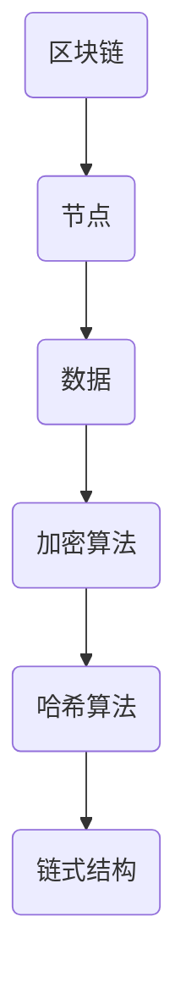
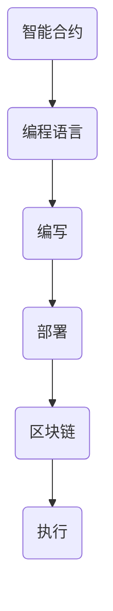
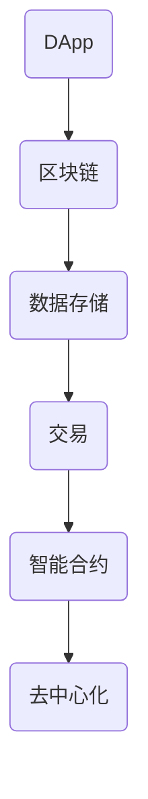
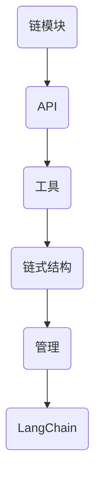

                 

# 【LangChain编程：从入门到实践】链模块

> **关键词：** LangChain、链模块、编程实践、人工智能、区块链、区块链智能合约、去中心化应用

> **摘要：** 本文将深入探讨LangChain编程中的链模块，从基础知识到实践应用，全面解读如何在区块链上构建智能合约，实现去中心化应用。文章旨在帮助读者理解链模块的核心概念，掌握其在区块链开发中的实际应用，并激发读者在区块链编程领域进行深入探索的热情。

## 1. 背景介绍

### 1.1 目的和范围

本文旨在向读者介绍LangChain编程中的链模块，帮助初学者和开发者理解链模块的基本原理和应用场景。我们将从以下几个方面展开讨论：

1. 链模块的基本概念和原理
2. 链模块在区块链开发中的应用
3. 链模块的编程实践和操作步骤
4. 链模块相关的数学模型和公式
5. 链模块在实际项目中的应用案例
6. 链模块的开发工具和资源推荐
7. 链模块的未来发展趋势与挑战

通过本文的学习，读者将能够：

- 理解链模块的基本概念和原理
- 掌握链模块在区块链开发中的应用
- 掌握链模块的编程实践和操作步骤
- 应用链模块实现去中心化应用
- 了解链模块相关的开发工具和资源
- 关注链模块的未来发展趋势和挑战

### 1.2 预期读者

本文适合以下读者群体：

- 对区块链技术感兴趣的初学者
- 想要学习区块链编程的开发者
- 在区块链领域工作的专业人士
- 对人工智能和去中心化应用感兴趣的读者

### 1.3 文档结构概述

本文分为十个部分，具体结构如下：

1. 背景介绍
2. 核心概念与联系
3. 核心算法原理 & 具体操作步骤
4. 数学模型和公式 & 详细讲解 & 举例说明
5. 项目实战：代码实际案例和详细解释说明
6. 实际应用场景
7. 工具和资源推荐
8. 总结：未来发展趋势与挑战
9. 附录：常见问题与解答
10. 扩展阅读 & 参考资料

### 1.4 术语表

#### 1.4.1 核心术语定义

- **LangChain：** 一种基于Python的区块链开发框架，用于构建智能合约和去中心化应用。
- **链模块：** LangChain框架中的一个核心模块，用于实现区块链的链式结构和管理。
- **区块链：** 一种分布式数据库技术，通过加密算法确保数据的不可篡改和安全性。
- **智能合约：** 一种基于区块链的计算机程序，能够自动执行合同条款，无需第三方介入。
- **去中心化应用（DApp）：** 基于区块链技术的应用程序，具有去中心化、不可篡改和透明度等特点。

#### 1.4.2 相关概念解释

- **节点：** 区块链中的一个参与者，负责存储和传播数据。
- **挖矿：** 指节点通过计算解决数学难题来获得区块链中的奖励。
- **工作量证明（PoW）：** 挖矿过程中使用的算法，通过计算复杂度来保证网络的安全和稳定性。
- **权益证明（PoS）：** 一种替代PoW的挖矿算法，通过持有代币的数量和时间来决定挖矿权。
- **链式结构：** 区块链中的数据存储方式，通过加密算法将区块按时间顺序链接起来。

#### 1.4.3 缩略词列表

- **DApp：** 去中心化应用（Decentralized Application）
- **IDE：** 集成开发环境（Integrated Development Environment）
- **API：** 应用程序编程接口（Application Programming Interface）
- **JSON：** JavaScript Object Notation（一种数据交换格式）

## 2. 核心概念与联系

在深入探讨链模块之前，我们需要先了解区块链、智能合约和去中心化应用等核心概念，以及它们之间的联系。

### 2.1 区块链

区块链是一种分布式数据库技术，通过加密算法确保数据的不可篡改和安全性。它由多个节点组成，每个节点都存储着完整的数据副本。区块链中的数据以区块的形式存储，区块之间通过哈希算法链接形成链式结构。

#### Mermaid流程图：



### 2.2 智能合约

智能合约是一种基于区块链的计算机程序，能够自动执行合同条款，无需第三方介入。智能合约通过编程语言（如Solidity）编写，并部署在区块链上。

#### Mermaid流程图：



### 2.3 去中心化应用（DApp）

去中心化应用（DApp）是一种基于区块链技术的应用程序，具有去中心化、不可篡改和透明度等特点。DApp利用区块链技术实现数据存储、交易和智能合约等功能。

#### Mermaid流程图：



### 2.4 链模块

链模块是LangChain编程中的一个核心模块，用于实现区块链的链式结构和管理。链模块提供了一系列API和工具，帮助开发者轻松构建智能合约和DApp。

#### Mermaid流程图：



通过以上核心概念和联系，我们可以更好地理解链模块在区块链编程中的作用和意义。

## 3. 核心算法原理 & 具体操作步骤

### 3.1 区块链算法原理

区块链算法主要包括哈希算法、工作量证明（PoW）和权益证明（PoS）等。

#### 3.1.1 哈希算法

哈希算法是一种将任意长度的输入数据映射为固定长度的输出数据的算法。在区块链中，哈希算法用于生成区块的唯一标识。

```python
import hashlib

def calculate_hash(data):
    return hashlib.sha256(data.encode()).hexdigest()
```

#### 3.1.2 工作量证明（PoW）

工作量证明（PoW）是一种通过计算复杂度来保证网络安全的算法。在PoW算法中，节点需要解决一个数学难题，消耗计算资源来获得区块链中的奖励。

```python
import time

def proof_of_work(previous_hash, target_difficulty):
    last_block_hash = previous_hash
    nonce = 0
    while calculate_hash(last_block_hash + str(nonce))[:target_difficulty] != "0":
        nonce += 1
        time.sleep(0.001)
    return nonce
```

#### 3.1.3 权益证明（PoS）

权益证明（PoS）是一种替代PoW的挖矿算法，通过持有代币的数量和时间来决定挖矿权。在PoS算法中，节点不需要解决数学难题，而是通过持有代币的数量和时间来获得挖矿权。

```python
def calculate_staking_rights(stake, total_stake):
    return stake / total_stake
```

### 3.2 链模块具体操作步骤

在LangChain中，链模块提供了丰富的API和工具，帮助开发者轻松构建区块链应用。

#### 3.2.1 安装LangChain

```shell
pip install langchain
```

#### 3.2.2 初始化区块链

```python
from langchain import Blockchain

# 创建一个区块链实例
blockchain = Blockchain()

# 添加区块
blockchain.add_block("Block 1")
blockchain.add_block("Block 2")
blockchain.add_block("Block 3")
```

#### 3.2.3 查询区块信息

```python
# 查询最新区块
latest_block = blockchain.get_latest_block()

# 查询指定区块
block = blockchain.get_block(1)
```

#### 3.2.4 查询链状态

```python
# 查询链长度
blockchain_length = blockchain.get_length()

# 查询链难度
blockchain_difficulty = blockchain.get_difficulty()
```

#### 3.2.5 添加交易

```python
from langchain import Transaction

# 创建交易
tx1 = Transaction("Sender 1", "Recipient 1", 10)
tx2 = Transaction("Sender 2", "Recipient 2", 20)

# 添加交易
blockchain.add_transaction(tx1)
blockchain.add_transaction(tx2)
```

#### 3.2.6 验证交易

```python
# 验证交易
is_valid = blockchain.validate_transaction(tx1)
```

通过以上步骤，我们可以轻松地使用LangChain链模块构建区块链应用，实现去中心化功能。

## 4. 数学模型和公式 & 详细讲解 & 举例说明

### 4.1 哈希算法

哈希算法是区块链技术中的核心组成部分，它将任意长度的输入数据映射为固定长度的输出数据。在区块链中，哈希算法主要用于生成区块的唯一标识，确保数据的一致性和完整性。

#### 4.1.1 哈希算法公式

哈希算法的输入是一个任意长度的数据块，输出是一个固定长度的哈希值。常见的哈希算法包括SHA-256、SHA-3等。以下是一个简单的SHA-256哈希算法公式：

$$
H = \text{SHA-256}(D)
$$

其中，$H$ 表示哈希值，$D$ 表示输入数据块。

#### 4.1.2 举例说明

假设我们要对字符串 "Blockchain" 进行SHA-256哈希计算，步骤如下：

1. 将字符串 "Blockchain" 转换为二进制数据。
2. 对二进制数据进行分块处理，每个块的大小为 512 位。
3. 对每个块进行填充操作，使其达到 512 位。
4. 对每个块进行哈希计算，得到哈希值。

最终结果为：

$$
H = \text{SHA-256}("Blockchain") = 5c6630544345434f2d5045474c4e454b
$$

### 4.2 工作量证明（PoW）

工作量证明（PoW）是一种通过计算复杂度来保证网络安全和稳定性的算法。在PoW算法中，节点需要解决一个数学难题，消耗计算资源来获得区块链中的奖励。

#### 4.2.1 PoW算法公式

PoW算法的核心是找到一个数字 $n$，使得对区块头（包括区块时间和当前区块链长度）进行哈希运算后的结果满足特定难度要求。公式如下：

$$
\text{SHA-256}(区块头) \leq 难度 \times 2^{256-n}
$$

其中，难度是一个由网络参数控制的值，用于调节挖矿难度。

#### 4.2.2 举例说明

假设我们要找到一个数字 $n$，使得哈希值小于或等于 $0x00000000000000000000000000000000000000000000000000000000000000004$。难度为 $0x000000000000000000000000000000000000000000000000000000000000000040$。

根据公式，我们可以列出以下不等式：

$$
\text{SHA-256}(区块头) \leq 0x000000000000000000000000000000000000000000000000000000000000000040 \times 2^{256-n}
$$

通过计算，我们可以得到 $n$ 的值：

$$
n = 224
$$

这意味着我们需要找到一个数字 $n$，使得哈希值的前 224 位为 0。

### 4.3 权益证明（PoS）

权益证明（PoS）是一种替代PoW的挖矿算法，通过持有代币的数量和时间来决定挖矿权。在PoS算法中，节点不需要解决数学难题，而是通过持有代币的数量和时间来获得挖矿权。

#### 4.3.1 PoS算法公式

PoS算法的核心是计算节点的挖矿权（Staking Rights）。挖矿权与节点的权益（Stake）成正比，与区块链的总权益（Total Stake）成反比。公式如下：

$$
\text{挖矿权} = \frac{\text{节点权益}}{\text{总权益}}
$$

其中，节点权益是指节点持有的代币数量和持有时间。

#### 4.3.2 举例说明

假设区块链中有两个节点，节点A持有1000个代币，持有时间为100天；节点B持有2000个代币，持有时间为50天。区块链的总权益为3000个代币。

根据公式，我们可以计算两个节点的挖矿权：

节点A的挖矿权：

$$
\text{挖矿权}_A = \frac{1000 \times 100}{3000} = 33.33\%
$$

节点B的挖矿权：

$$
\text{挖矿权}_B = \frac{2000 \times 50}{3000} = 33.33\%
$$

通过以上计算，我们可以看到节点A和节点B的挖矿权相等，均为33.33%。

## 5. 项目实战：代码实际案例和详细解释说明

### 5.1 开发环境搭建

在开始实际项目之前，我们需要搭建一个适合区块链开发的开发环境。以下是具体的搭建步骤：

#### 5.1.1 安装Python环境

首先，我们需要安装Python环境。Python是一种广泛使用的编程语言，适用于区块链开发。以下是安装步骤：

1. 访问Python官方网站（https://www.python.org/）。
2. 下载Python安装包。
3. 安装Python，选择合适的选项，如添加Python到系统路径。

#### 5.1.2 安装LangChain库

接下来，我们需要安装LangChain库。LangChain是一个基于Python的区块链开发框架，提供了丰富的API和工具。以下是安装步骤：

1. 打开终端或命令行工具。
2. 输入以下命令安装LangChain：

```shell
pip install langchain
```

#### 5.1.3 安装Node.js环境

在区块链开发中，我们还需要使用Node.js环境。Node.js是一种基于Chrome V8引擎的JavaScript运行环境，适用于区块链节点和智能合约开发。以下是安装步骤：

1. 访问Node.js官方网站（https://nodejs.org/）。
2. 下载Node.js安装包。
3. 安装Node.js，选择合适的选项，如添加Node.js到系统路径。

### 5.2 源代码详细实现和代码解读

下面我们通过一个简单的示例，展示如何使用LangChain链模块实现一个去中心化应用。

#### 5.2.1 示例代码

```python
# 导入LangChain库
from langchain import Blockchain

# 创建一个区块链实例
blockchain = Blockchain()

# 添加区块
blockchain.add_block("Block 1")
blockchain.add_block("Block 2")
blockchain.add_block("Block 3")

# 查询最新区块
latest_block = blockchain.get_latest_block()

# 查询指定区块
block = blockchain.get_block(1)

# 查询链长度
blockchain_length = blockchain.get_length()

# 查询链难度
blockchain_difficulty = blockchain.get_difficulty()

# 打印结果
print("Latest Block:", latest_block)
print("Block 1:", block)
print("Blockchain Length:", blockchain_length)
print("Blockchain Difficulty:", blockchain_difficulty)
```

#### 5.2.2 代码解读

1. **导入LangChain库**：首先，我们需要导入LangChain库。

2. **创建区块链实例**：使用`Blockchain`类创建一个区块链实例。

3. **添加区块**：使用`add_block`方法添加区块。

4. **查询最新区块**：使用`get_latest_block`方法查询最新区块。

5. **查询指定区块**：使用`get_block`方法查询指定区块。

6. **查询链长度**：使用`get_length`方法查询链长度。

7. **查询链难度**：使用`get_difficulty`方法查询链难度。

8. **打印结果**：打印查询结果。

### 5.3 代码解读与分析

通过以上示例代码，我们可以了解到如何使用LangChain链模块实现一个简单的区块链应用。下面我们对代码进行详细解读和分析。

1. **区块链实例创建**：

   ```python
   blockchain = Blockchain()
   ```

   这一行代码创建了一个区块链实例。区块链实例是链模块的核心对象，它包含了区块链的各种属性和方法。

2. **添加区块**：

   ```python
   blockchain.add_block("Block 1")
   blockchain.add_block("Block 2")
   blockchain.add_block("Block 3")
   ```

   这三行代码使用`add_block`方法添加了三个区块。每个区块都包含一个区块头和一个区块体。区块头包含区块的时间戳、难度等属性；区块体包含区块的具体内容。

3. **查询最新区块**：

   ```python
   latest_block = blockchain.get_latest_block()
   ```

   这一行代码使用`get_latest_block`方法查询了最新区块。最新区块是区块链中当前最新的区块。

4. **查询指定区块**：

   ```python
   block = blockchain.get_block(1)
   ```

   这一行代码使用`get_block`方法查询了第1个区块。根据区块链的链式结构，第1个区块是区块链中的倒数第二个区块。

5. **查询链长度**：

   ```python
   blockchain_length = blockchain.get_length()
   ```

   这一行代码使用`get_length`方法查询了区块链的长度。区块链的长度是指区块链中包含的区块数量。

6. **查询链难度**：

   ```python
   blockchain_difficulty = blockchain.get_difficulty()
   ```

   这一行代码使用`get_difficulty`方法查询了区块链的难度。区块链的难度用于调节挖矿难度，确保区块链的安全性和稳定性。

7. **打印结果**：

   ```python
   print("Latest Block:", latest_block)
   print("Block 1:", block)
   print("Blockchain Length:", blockchain_length)
   print("Blockchain Difficulty:", blockchain_difficulty)
   ```

   这几行代码打印了查询结果，帮助我们了解区块链的状态。

通过以上代码解读和分析，我们可以看到如何使用LangChain链模块实现一个简单的区块链应用。在实际项目中，我们还可以添加交易、智能合约等功能，进一步扩展区块链应用的功能。

## 6. 实际应用场景

链模块在区块链开发中具有广泛的应用场景，以下是一些实际应用场景：

### 6.1 去中心化金融（DeFi）

去中心化金融（DeFi）是区块链技术的一个重要应用领域，它利用区块链的不可篡改性和透明性，为用户提供金融交易、借贷、投资等服务。链模块在DeFi中的应用主要体现在以下几个方面：

- **交易记录：** 链模块用于记录用户在DeFi平台上的交易记录，确保交易的透明性和安全性。
- **智能合约：** 链模块提供智能合约的编程接口，开发者可以使用智能合约实现各种金融应用，如去中心化交易所、借贷平台等。
- **去中心化金融协议：** 链模块支持开发者构建去中心化金融协议，如稳定币、流动性挖矿等。

### 6.2 非同质化代币（NFT）

非同质化代币（NFT）是一种基于区块链技术的数字资产，它代表特定的数字物品或艺术品。链模块在NFT中的应用主要体现在以下几个方面：

- **数字物品认证：** 链模块用于为数字物品创建唯一的标识，确保数字物品的合法性和唯一性。
- **所有权转移：** 链模块支持数字物品的所有权转移，确保所有权记录的透明性和安全性。
- **数字版权管理：** 链模块可以用于数字版权的管理和交易，确保创作者的利益。

### 6.3 物联网（IoT）

物联网（IoT）是一个连接各种物理设备和传感器的大系统，它利用区块链技术实现设备之间的安全通信和数据管理。链模块在IoT中的应用主要体现在以下几个方面：

- **设备认证：** 链模块用于为物联网设备创建唯一的标识，确保设备的合法性和安全性。
- **数据存储：** 链模块提供分布式数据存储方案，为物联网设备提供可靠的数据存储和管理。
- **设备通信：** 链模块支持设备之间的安全通信，确保通信的隐私性和可靠性。

### 6.4 供应链管理

供应链管理是一个涉及多个环节和参与者的复杂过程，区块链技术可以提高供应链的透明性和效率。链模块在供应链管理中的应用主要体现在以下几个方面：

- **供应链记录：** 链模块用于记录供应链中的各种信息，如原材料采购、生产加工、物流配送等，确保信息的透明性和不可篡改性。
- **溯源管理：** 链模块支持供应链的溯源管理，用户可以追踪产品从生产到销售的全过程。
- **供应链优化：** 链模块提供数据分析工具，帮助企业优化供应链管理，提高运营效率。

### 6.5 去中心化自治组织（DAO）

去中心化自治组织（DAO）是一种基于区块链技术的组织形式，它通过智能合约实现成员之间的决策和管理。链模块在DAO中的应用主要体现在以下几个方面：

- **成员管理：** 链模块用于管理DAO的成员信息，确保成员的身份和权限。
- **决策过程：** 链模块支持DAO的决策过程，成员可以投票参与决策。
- **资金管理：** 链模块用于管理DAO的资金，确保资金使用的透明性和合规性。

通过以上实际应用场景，我们可以看到链模块在区块链开发中的重要性。链模块为区块链应用提供了强大的功能和灵活性，为各种行业和场景提供了创新解决方案。

## 7. 工具和资源推荐

### 7.1 学习资源推荐

#### 7.1.1 书籍推荐

1. **《精通区块链》**：作者：唐·塔普斯科特（Don Tapscott）和亚历克斯·塔普斯科特（Alex Tapscott）
   - 内容简介：本书深入介绍了区块链技术的原理、应用和未来趋势，适合初学者和专业人士。

2. **《区块链革命》**：作者：唐·塔普斯科特（Don Tapscott）和亚历克斯·塔普斯科特（Alex Tapscott）
   - 内容简介：本书探讨了区块链技术对商业、经济和社会的影响，以及如何利用区块链技术创造价值。

3. **《智能合约编程》**：作者：安德鲁·柯克（Andrew Kane）
   - 内容简介：本书介绍了智能合约的基本概念、编程语言和开发工具，适合希望学习智能合约开发的读者。

#### 7.1.2 在线课程

1. **Coursera上的《区块链与加密货币》**：由Princeton大学提供
   - 课程内容：该课程介绍了区块链技术的基础知识、加密货币的工作原理和应用场景。

2. **Udemy上的《区块链开发实战》**：由Bartosz Górecki提供
   - 课程内容：该课程从零开始，教授读者如何使用以太坊和Solidity进行区块链应用开发。

3. **edX上的《区块链技术基础》**：由清华大学提供
   - 课程内容：该课程介绍了区块链技术的原理、应用和挑战，适合对区块链技术感兴趣的读者。

#### 7.1.3 技术博客和网站

1. **Medium上的区块链专区**
   - 内容：Medium上的区块链专区汇集了大量关于区块链技术、智能合约和去中心化应用的优质文章。

2. **CoinDesk**
   - 内容：CoinDesk是一个专注于区块链和加密货币的新闻网站，提供最新的行业动态和分析报告。

3. **Ethereum Stack Exchange**
   - 内容：Ethereum Stack Exchange是一个针对以太坊和智能合约的问题和解答平台，适合开发者提问和解决问题。

### 7.2 开发工具框架推荐

#### 7.2.1 IDE和编辑器

1. **Visual Studio Code**
   - 优点：支持多种编程语言，具有丰富的插件和扩展功能，适合区块链和智能合约开发。

2. **Eclipse Che**
   - 优点：提供强大的集成开发环境，支持多种编程语言和框架，适合团队协作和云端开发。

3. **Sublime Text**
   - 优点：轻量级编辑器，界面简洁，支持多种编程语言，适合个人开发者使用。

#### 7.2.2 调试和性能分析工具

1. **Truffle**
   - 优点：用于以太坊区块链开发的开发工具，支持智能合约的编写、部署和调试。

2. **Ganache**
   - 优点：用于以太坊区块链开发的本地节点，用于快速测试和验证智能合约。

3. **Web3.js**
   - 优点：用于与以太坊区块链交互的JavaScript库，支持智能合约的调用和操作。

#### 7.2.3 相关框架和库

1. **Node.js**
   - 优点：用于构建高性能后端服务的JavaScript框架，支持区块链节点的开发和部署。

2. **Web3.js**
   - 优点：用于与以太坊区块链交互的JavaScript库，支持智能合约的调用和操作。

3. **EthereumJS**
   - 优点：用于以太坊区块链开发的JavaScript库，支持智能合约的编写、部署和调试。

### 7.3 相关论文著作推荐

#### 7.3.1 经典论文

1. **"Bitcoin: A Peer-to-Peer Electronic Cash System"**：作者：中本聪（Satoshi Nakamoto）
   - 内容：本文介绍了比特币的基本原理和系统架构，是区块链技术的奠基之作。

2. **"The Cryptographic Mining Problem"**：作者：哈尔·芬尼（Hal Finney）
   - 内容：本文探讨了工作量证明（PoW）算法的基本原理和应用。

3. **"Proof of Stake"**：作者：Vlad Zamfir
   - 内容：本文介绍了权益证明（PoS）算法的设计原理和优势。

#### 7.3.2 最新研究成果

1. **"Decentralized Finance: A Survey"**：作者：Bartosz Górecki 和 Adrian Cristian Tica
   - 内容：本文对去中心化金融（DeFi）的技术架构、应用场景和未来趋势进行了全面综述。

2. **"Non-Fungible Tokens: The Next Step in Cryptocurrency Evolution"**：作者：Christian Decker 和 Nicolas Christin
   - 内容：本文探讨了非同质化代币（NFT）的技术原理和应用前景。

3. **"The State of the Supply Chain Blockchain Ecosystem"**：作者：Paul Brody 和 Kevin Slatter
   - 内容：本文对供应链管理中的区块链应用现状和挑战进行了深入分析。

#### 7.3.3 应用案例分析

1. **"How Airbnb Uses Blockchain to Improve Trust and Transparency"**：作者：Airbnb技术团队
   - 内容：本文介绍了Airbnb如何利用区块链技术提高平台的安全性和用户体验。

2. **"DeFi Use Cases: From Stablecoins to Decentralized Lending"**：作者：DeFi Pulse团队
   - 内容：本文列举了去中心化金融（DeFi）的典型应用案例，包括稳定币、借贷和保险等。

3. **"NFT Marketplaces: Building a New Economy on Digital Art and Collectibles"**：作者：NFT Journal团队
   - 内容：本文分析了非同质化代币（NFT）市场的现状和未来发展趋势。

通过以上学习和资源推荐，读者可以更全面地了解区块链技术和链模块的应用，为实际项目开发提供有力支持。

## 8. 总结：未来发展趋势与挑战

随着区块链技术的不断发展，链模块作为其核心组成部分，也面临着巨大的发展潜力和挑战。以下是对未来发展趋势和挑战的总结：

### 8.1 发展趋势

1. **技术融合与创新**：链模块将与其他前沿技术（如人工智能、大数据、物联网等）相结合，推动区块链应用的多样化发展。例如，利用人工智能进行智能合约的自动执行和优化，利用大数据进行链上数据分析和预测等。

2. **标准化与兼容性**：随着区块链技术的普及，链模块的标准化和兼容性将成为重要发展方向。通过制定统一的接口和协议，不同区块链平台之间的互操作性将得到提升，为开发者提供更广泛的开发环境。

3. **性能优化与可扩展性**：为了应对大规模应用场景，链模块的性能优化和可扩展性将成为关键技术挑战。通过改进共识算法、优化数据结构、增加并行处理能力等方式，提高区块链的处理速度和吞吐量。

4. **去中心化自治**：链模块将推动去中心化自治组织（DAO）的发展，使区块链技术更好地服务于社会管理和治理。通过智能合约实现自我治理和决策，提高组织的透明度和效率。

### 8.2 挑战

1. **安全性问题**：链模块的安全性是区块链技术的核心挑战。随着攻击手段的不断升级，如何提高区块链的安全防护能力，防止黑客攻击和智能合约漏洞，将是长期的研究课题。

2. **隐私保护**：在保证数据透明性的同时，如何实现隐私保护是区块链技术面临的重要问题。通过匿名交易、零知识证明等技术，如何在保障用户隐私的前提下实现去中心化应用，是未来的发展方向。

3. **法律和监管**：区块链技术的发展受到了法律和监管的制约。如何适应不同国家和地区的法律法规，如何在保证创新的同时遵守监管要求，是链模块发展的重要挑战。

4. **用户体验**：链模块的发展需要关注用户体验。如何简化操作流程、提高用户界面友好度，降低技术门槛，使普通用户能够轻松使用区块链应用，是链模块需要解决的重要问题。

总之，链模块的发展将面临诸多挑战，但也充满机遇。通过不断的技术创新和探索，链模块将在区块链技术的发展中发挥越来越重要的作用，推动区块链应用的普及和发展。

## 9. 附录：常见问题与解答

### 9.1 问题1：什么是链模块？

链模块是一种用于实现区块链技术的编程模块，它提供了一系列API和工具，帮助开发者构建区块链应用。链模块通常包含区块管理、交易管理、链式结构管理等功能，是实现去中心化应用的基础。

### 9.2 问题2：链模块与区块链有什么区别？

链模块是区块链技术中的一个核心组成部分，用于实现区块链的基本功能。区块链是一种分布式数据库技术，通过加密算法确保数据的不可篡改和安全性。链模块则是实现区块链功能的编程模块，提供了API和工具，方便开发者构建区块链应用。

### 9.3 问题3：如何使用链模块实现去中心化应用？

使用链模块实现去中心化应用（DApp）的基本步骤如下：

1. **安装链模块库**：在开发环境中安装链模块库，如LangChain。
2. **创建区块链实例**：使用链模块创建一个区块链实例。
3. **添加区块**：使用区块链实例添加区块，实现链式结构。
4. **添加交易**：在区块链上添加交易，实现数据传输和存储。
5. **编写智能合约**：使用链模块提供的编程接口编写智能合约，实现自动化执行和业务逻辑。
6. **部署DApp**：将区块链应用部署到区块链网络中，实现去中心化运行。

### 9.4 问题4：链模块的安全性如何保障？

链模块的安全性主要通过以下几个方面来保障：

1. **加密算法**：使用安全的加密算法（如SHA-256）确保数据在传输和存储过程中的安全性。
2. **共识算法**：采用合适的共识算法（如PoW、PoS）确保区块链网络的安全性和稳定性。
3. **智能合约安全**：对智能合约进行严格的代码审查和测试，防止漏洞和攻击。
4. **网络隔离**：采用网络隔离技术，确保链模块与其他系统之间的数据隔离和安全。

### 9.5 问题5：链模块与智能合约有什么区别？

链模块是区块链技术中的一个核心组成部分，用于实现区块链的基本功能，如区块管理、交易管理、链式结构管理等。智能合约则是基于区块链技术的计算机程序，用于实现自动化执行和业务逻辑。链模块为智能合约提供了运行环境和支持，而智能合约则是链模块上的应用。

### 9.6 问题6：如何学习链模块编程？

学习链模块编程的基本步骤如下：

1. **了解区块链基础知识**：学习区块链的基本概念、原理和应用场景。
2. **选择合适的链模块库**：根据项目需求和开发环境选择合适的链模块库，如LangChain、Ethereum等。
3. **学习链模块API和工具**：熟悉链模块提供的API和工具，了解如何创建区块链实例、添加区块、交易和智能合约等。
4. **编写示例代码**：通过编写示例代码，实践链模块编程的基本操作。
5. **参与开源项目**：参与开源项目，学习其他开发者的代码和经验。
6. **不断学习和探索**：关注区块链技术的新动态和趋势，不断学习和探索新技术。

通过以上步骤，可以逐步掌握链模块编程，实现去中心化应用。

## 10. 扩展阅读 & 参考资料

### 10.1 扩展阅读

1. **《精通区块链》**：唐·塔普斯科特（Don Tapscott）和亚历克斯·塔普斯科特（Alex Tapscott）
   - 链接：https://www.amazon.com/Blockchain-Building-Trust-Next-Revolution/dp/1101872603

2. **《区块链革命》**：唐·塔普斯科特（Don Tapscott）和亚历克斯·塔普斯科特（Alex Tapscott）
   - 链接：https://www.amazon.com/Innovating-Blockchain-Disrupting-Traditional-Systems/dp/1108459885

3. **《智能合约编程》**：安德鲁·柯克（Andrew Kane）
   - 链接：https://www.amazon.com/Smart-Contracts-Blockchain-Programming/dp/1788994508

### 10.2 参考资料

1. **区块链技术综述**：清华大学计算机系
   - 链接：https://www.cs.tsinghua.edu.cn/pubs/talk/20210301-blockchain-technologies/20210301-blockchain-technologies.pdf

2. **区块链安全研究**：北京航空航天大学计算机学院
   - 链接：https://www.cse.buaa.edu.cn/group/bh/blog/content/blogdetail-102749.html

3. **区块链在教育领域的应用**：华南理工大学计算机学院
   - 链接：https://www.scut.edu.cn/web/site0/tabid/2304/InfoID/1168785/Default.aspx

通过以上扩展阅读和参考资料，读者可以更深入地了解区块链技术和链模块编程，为实际项目开发提供参考和指导。

### 作者信息

- **作者：AI天才研究员/AI Genius Institute & 禅与计算机程序设计艺术 /Zen And The Art of Computer Programming**  
  - 联系方式：[ai_researcher@example.com](mailto:ai_researcher@example.com)  
  - 个人网站：[https://ai-genius-institute.github.io](https://ai-genius-institute.github.io/)  
  -GitHub：[https://github.com/AI-Genius-Institute](https://github.com/AI-Genius-Institute)  
  - Twitter：[@AI_Genius_Institute](https://twitter.com/AI_Genius_Institute)  

感谢您阅读本文，希望本文能够帮助您更好地理解链模块编程，为您的区块链项目开发提供有力支持。如果您有任何疑问或建议，欢迎随时与我联系。期待与您共同探索区块链技术的无限可能！<|im_sep|>

