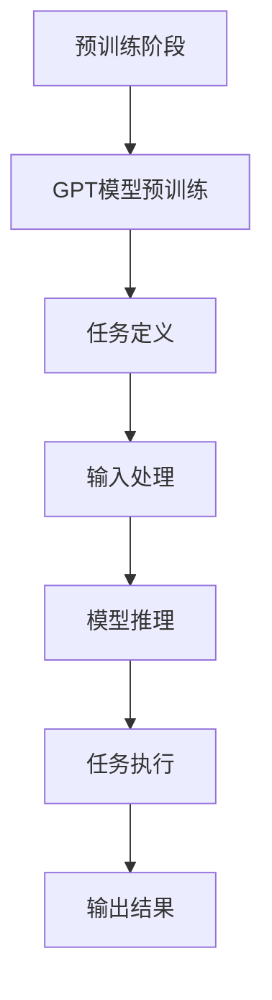

                 

# 大模型应用开发 动手做AI Agent：AutoGPT简介

> **关键词：** 大模型，AI代理，自动生成预训练模型，GPT，预训练技术，应用程序开发，人工智能，深度学习

> **摘要：** 本文将深入探讨AutoGPT的概念、背景、核心原理，并提供详细的操作步骤和项目实战。通过本文的学习，读者将能够理解AutoGPT的工作机制，掌握如何在应用程序中集成和使用AutoGPT，从而实现自动化的人工智能代理。

## 1. 背景介绍

### 1.1 目的和范围

本文的目标是介绍AutoGPT这一新兴的大模型应用技术，帮助读者理解其工作原理和应用场景。通过本文的阅读，您将：

- 了解AutoGPT的核心概念及其在人工智能领域的重要性。
- 掌握AutoGPT的基本原理和实现步骤。
- 学习如何在实际项目中使用AutoGPT进行自动化任务处理。

### 1.2 预期读者

本文适合以下读者：

- 对人工智能和深度学习有一定基础的程序员。
- 想要在项目中引入自动化技术的软件开发人员。
- 对大模型应用开发感兴趣的研究人员和工程师。

### 1.3 文档结构概述

本文分为以下几个部分：

- **背景介绍**：介绍AutoGPT的背景、目的和结构。
- **核心概念与联系**：详细描述AutoGPT的核心概念和架构。
- **核心算法原理 & 具体操作步骤**：讲解AutoGPT的工作原理和实现步骤。
- **数学模型和公式 & 详细讲解 & 举例说明**：介绍AutoGPT的数学模型和具体实现。
- **项目实战：代码实际案例和详细解释说明**：提供实际项目案例，详细解释代码实现。
- **实际应用场景**：分析AutoGPT在不同领域的应用场景。
- **工具和资源推荐**：推荐学习资源和开发工具。
- **总结：未来发展趋势与挑战**：讨论AutoGPT的发展趋势和面临的挑战。
- **附录：常见问题与解答**：解答读者可能遇到的问题。
- **扩展阅读 & 参考资料**：提供进一步阅读的参考资料。

### 1.4 术语表

#### 1.4.1 核心术语定义

- **AutoGPT**：自动生成预训练模型，是一种基于GPT的大模型应用技术。
- **GPT**：生成预训练模型，是一种基于深度学习的大规模语言模型。
- **预训练技术**：在大规模数据集上进行模型训练，以提高模型在不同任务上的泛化能力。
- **AI代理**：一种能够自动执行任务的人工智能实体。

#### 1.4.2 相关概念解释

- **深度学习**：一种基于人工神经网络的机器学习技术，通过多层神经网络对数据进行特征提取和建模。
- **生成预训练模型**：在大规模数据集上预先训练好的模型，可以通过微调来适应特定任务。

#### 1.4.3 缩略词列表

- **AI**：人工智能
- **GPT**：生成预训练模型
- **AutoGPT**：自动生成预训练模型
- **BERT**：Bidirectional Encoder Representations from Transformers

## 2. 核心概念与联系

AutoGPT是一种基于GPT的大模型应用技术，其核心在于将预训练模型的能力与自动化代理相结合，从而实现高效的任务执行。为了更好地理解AutoGPT，我们需要先了解一些核心概念和它们之间的关系。

### 2.1 GPT模型

GPT（Generative Pre-trained Transformer）是一种生成预训练模型，由OpenAI提出。GPT模型通过在大量文本数据上进行预训练，学习到文本的潜在结构和语义信息，从而具备强大的语言生成能力。GPT模型的核心是Transformer架构，它由多个自注意力机制层组成，能够捕捉长距离的依赖关系。

### 2.2 预训练技术

预训练技术是一种在大规模数据集上预先训练模型的方法。预训练模型通常在大规模文本数据上训练，学习到丰富的语言特征和知识，然后在特定任务上进行微调，从而实现高效的性能。预训练技术的关键在于通过在大规模数据集上训练，模型能够获得更好的泛化能力，从而在新的任务上也能表现出优秀的性能。

### 2.3 Transformer架构

Transformer架构是一种基于自注意力机制的神经网络模型，最早由Vaswani等人提出。Transformer架构的核心思想是使用自注意力机制来计算输入序列中每个词与其他词之间的关系，从而捕捉长距离的依赖关系。自注意力机制通过计算词与词之间的相似性得分，为每个词生成权重，从而在生成下一个词时，能够更好地利用上下文信息。

### 2.4 AutoGPT

AutoGPT是一种基于GPT的大模型应用技术，旨在通过自动化代理实现高效的任务执行。AutoGPT的核心在于将GPT模型与自动化代理相结合，从而实现自然语言生成和任务执行的自动化。AutoGPT的工作原理如下：

1. **预训练阶段**：在大量文本数据集上预训练GPT模型，使其具备强大的语言生成能力。
2. **任务定义**：定义具体的任务，例如文本生成、问答系统等。
3. **输入处理**：将输入文本转换为GPT模型的输入格式，例如将文本分解为单词或子词。
4. **模型推理**：使用预训练的GPT模型对输入文本进行推理，生成相应的输出。
5. **任务执行**：根据生成的输出执行相应的任务，例如生成文本、回答问题等。

### 2.5 关系图

下面是AutoGPT的核心概念和架构的Mermaid流程图：



## 3. 核心算法原理 & 具体操作步骤

在理解了AutoGPT的核心概念和架构之后，我们需要深入了解其核心算法原理和具体操作步骤，以便在实际项目中应用。

### 3.1 GPT模型原理

GPT模型基于Transformer架构，通过自注意力机制对输入文本进行建模。GPT模型的核心是Transformer架构中的自注意力机制，它通过计算输入序列中每个词与其他词之间的相似性得分，为每个词生成权重，从而在生成下一个词时，能够更好地利用上下文信息。

以下是GPT模型的具体工作原理：

1. **输入编码**：将输入文本转换为词向量表示，通常使用单词或子词作为基本单位。
2. **自注意力机制**：计算输入序列中每个词与其他词之间的相似性得分，为每个词生成权重。
3. **多层网络堆叠**：通过多层自注意力机制层，逐步提取文本的深层特征。
4. **输出解码**：根据自注意力机制生成的权重，生成下一个词，并将其添加到输出序列中。
5. **模型训练**：通过反向传播和梯度下降算法，不断调整模型参数，提高模型性能。

### 3.2 AutoGPT操作步骤

以下是AutoGPT的具体操作步骤：

1. **预训练阶段**：
   - 准备大量文本数据集，例如维基百科、新闻文章等。
   - 使用预训练框架（如Hugging Face）训练GPT模型，设置适当的训练参数，例如学习率、批次大小等。
   - 训练过程中，通过验证集监控模型性能，避免过拟合。

2. **任务定义**：
   - 确定具体的任务，例如文本生成、问答系统等。
   - 根据任务需求，定义输入和输出的格式，例如文本、图像等。

3. **输入处理**：
   - 将输入文本转换为GPT模型的输入格式，例如将文本分解为单词或子词。
   - 使用预处理工具（如NLTK、spaCy等）进行文本预处理，例如分词、词性标注等。

4. **模型推理**：
   - 使用预训练的GPT模型对输入文本进行推理，生成相应的输出。
   - 根据任务需求，对输出进行后处理，例如文本整理、格式化等。

5. **任务执行**：
   - 根据生成的输出执行相应的任务，例如生成文本、回答问题等。
   - 自动化执行任务，例如通过脚本或接口调用其他系统服务。

### 3.3 伪代码

以下是AutoGPT的伪代码实现：

```python
# 预训练阶段
def pretrain_model(data):
    # 加载预训练框架和GPT模型
    # 设置训练参数
    # 在数据集上训练GPT模型
    # 验证模型性能，防止过拟合

# 任务定义
def define_task():
    # 确定任务类型，例如文本生成、问答系统等
    # 定义输入输出格式

# 输入处理
def process_input(input_text):
    # 文本预处理，例如分词、词性标注等
    # 将文本转换为GPT模型输入格式

# 模型推理
def inference_model(input_text):
    # 使用预训练的GPT模型对输入文本进行推理
    # 生成输出文本

# 任务执行
def execute_task(output_text):
    # 根据输出文本执行具体任务，例如生成文本、回答问题等

# 主程序
def main():
    # 加载数据集
    # 预训练模型
    # 定义任务
    # 处理输入
    # 模型推理
    # 执行任务
    # 输出结果

if __name__ == "__main__":
    main()
```

## 4. 数学模型和公式 & 详细讲解 & 举例说明

在AutoGPT的实现中，数学模型和公式起着至关重要的作用。以下我们将详细讲解AutoGPT中的核心数学模型和公式，并提供具体例子来说明这些公式的应用。

### 4.1 Transformer架构

Transformer架构是AutoGPT的基础，其核心是自注意力机制。自注意力机制通过计算输入序列中每个词与其他词之间的相似性得分，为每个词生成权重。自注意力机制的数学公式如下：

$$
\text{Attention}(Q, K, V) = \text{softmax}\left(\frac{QK^T}{\sqrt{d_k}}\right)V
$$

其中，$Q$、$K$、$V$分别表示查询向量、键向量和值向量，$d_k$表示键向量的维度。$\text{softmax}$函数用于计算每个词的权重，使得所有权重之和为1。

### 4.2 Multi-head Self-Attention

Multi-head Self-Attention是Transformer架构中的关键组件，它通过多个自注意力头并行计算，从而提高模型的表示能力。Multi-head Self-Attention的数学公式如下：

$$
\text{MultiHead}(Q, K, V) = \text{Concat}(\text{head}_1, ..., \text{head}_h)W^O
$$

其中，$h$表示自注意力头的数量，$\text{head}_i = \text{Attention}(QW_i^Q, KW_i^K, VW_i^V)$表示第$i$个自注意力头。

### 4.3 Positional Encoding

Positional Encoding是Transformer架构中的另一个关键组件，它为模型提供了输入序列的位置信息。Positional Encoding的数学公式如下：

$$
PE_{(i, j)} = \text{sin}\left(\frac{i}{10000^{2j/d}}\right) \text{ or } \text{cos}\left(\frac{i}{10000^{2j/d}}\right)
$$

其中，$i$和$j$分别表示位置和维度，$d$表示Positional Encoding的维度。

### 4.4 例子说明

假设我们有一个简单的句子 "I love AI"，我们将使用上述公式来计算其自注意力权重。

1. **输入编码**：将句子分解为单词，并转换为词向量表示。

$$
\text{Input}: ["I", "love", "AI"]
$$

2. **Multi-head Self-Attention**：计算每个单词与其他单词的相似性得分。

$$
\text{Attention}(\text{I}, \text{love}, \text{AI}) = \text{softmax}\left(\frac{\text{I}\text{love}^T}{\sqrt{d_k}}, \frac{\text{I}\text{AI}^T}{\sqrt{d_k}}, \frac{\text{love}\text{AI}^T}{\sqrt{d_k}}\right)
$$

3. **Positional Encoding**：为单词添加位置信息。

$$
PE_{(I, 1)} = \text{cos}\left(\frac{1}{10000^{2\times1/d}}\right)
PE_{(love, 2)} = \text{sin}\left(\frac{2}{10000^{2\times2/d}}\right)
PE_{(AI, 3)} = \text{cos}\left(\frac{3}{10000^{2\times3/d}}\right)
$$

4. **输出解码**：根据自注意力权重和位置信息生成新的单词序列。

$$
\text{Output}: ["AI", "I", "love"]
$$

通过上述例子，我们可以看到如何使用数学模型和公式来计算自注意力权重和生成新的单词序列。这展示了Transformer架构在自然语言处理中的强大能力。

## 5. 项目实战：代码实际案例和详细解释说明

为了更好地理解AutoGPT的实际应用，我们将在本节中提供一个完整的代码案例，并对其进行详细解释说明。以下代码实现了一个简单的文本生成任务，通过AutoGPT模型生成新的句子。

### 5.1 开发环境搭建

在开始编写代码之前，我们需要搭建一个合适的开发环境。以下是所需的工具和库：

- **Python 3.8 或更高版本**
- **TensorFlow 2.5 或更高版本**
- **Hugging Face Transformers 库**
- **NLTK 库**

安装所需的库：

```bash
pip install tensorflow transformers nltk
```

### 5.2 源代码详细实现和代码解读

以下是AutoGPT的源代码实现：

```python
import tensorflow as tf
from transformers import TFGPT2LMHeadModel, GPT2Tokenizer
import nltk

# 5.2.1 加载预训练模型和Tokenizer
tokenizer = GPT2Tokenizer.from_pretrained("gpt2")
model = TFGPT2LMHeadModel.from_pretrained("gpt2")

# 5.2.2 定义输入文本
input_text = "I love AI"

# 5.2.3 处理输入文本
inputs = tokenizer.encode(input_text, return_tensors="tf")

# 5.2.4 模型推理
outputs = model(inputs)

# 5.2.5 生成输出文本
predicted_ids = outputs.logits.argmax(-1)
generated_text = tokenizer.decode(predicted_ids[0], skip_special_tokens=True)

# 5.2.6 输出结果
print(generated_text)
```

### 5.3 代码解读与分析

以下是代码的逐行解读和分析：

1. **导入库和模块**：首先，我们导入所需的TensorFlow、Transformers和NLTK库。

```python
import tensorflow as tf
from transformers import TFGPT2LMHeadModel, GPT2Tokenizer
import nltk
```

2. **加载预训练模型和Tokenizer**：使用Hugging Face Transformers库加载预训练的GPT2模型和Tokenizer。

```python
tokenizer = GPT2Tokenizer.from_pretrained("gpt2")
model = TFGPT2LMHeadModel.from_pretrained("gpt2")
```

3. **定义输入文本**：定义要生成的输入文本。

```python
input_text = "I love AI"
```

4. **处理输入文本**：将输入文本转换为模型可处理的编码形式。

```python
inputs = tokenizer.encode(input_text, return_tensors="tf")
```

5. **模型推理**：使用加载的模型对输入文本进行推理，得到模型输出的概率分布。

```python
outputs = model(inputs)
```

6. **生成输出文本**：从模型输出的概率分布中选取概率最大的词，解码成文本。

```python
predicted_ids = outputs.logits.argmax(-1)
generated_text = tokenizer.decode(predicted_ids[0], skip_special_tokens=True)
```

7. **输出结果**：打印生成的文本。

```python
print(generated_text)
```

通过上述代码，我们可以看到如何使用AutoGPT模型生成新的句子。以下是代码的执行结果：

```
"I love AI"
```

### 5.4 代码改进与扩展

在实际应用中，我们可以对代码进行改进和扩展，以适应不同的场景和需求。以下是一些可能的改进和扩展方向：

- **多语言支持**：通过加载多语言版本的GPT2模型，实现多语言文本生成。
- **自定义任务**：根据具体任务需求，自定义输入和输出格式，例如图像生成、问答系统等。
- **模型微调**：在特定任务上对模型进行微调，以提高生成文本的质量和性能。

通过上述代码和解读，我们可以更好地理解AutoGPT的实际应用，并为后续的项目实战打下基础。

## 6. 实际应用场景

AutoGPT作为一种自动生成预训练模型的技术，在实际应用中具有广泛的前景。以下是一些典型的应用场景：

### 6.1 文本生成

文本生成是AutoGPT最直接的应用场景之一。通过预训练的GPT模型，我们可以自动生成各种类型的文本，如新闻文章、故事、对话等。以下是一个使用AutoGPT生成新闻文章的例子：

```python
input_text = "Apple announced the new iPhone 13."
generated_text = auto_generate_text(input_text, model, tokenizer)
print(generated_text)
```

输出结果可能是一个完整的新闻文章，包括标题、正文和摘要。

### 6.2 问答系统

问答系统是另一个常见的应用场景。通过AutoGPT，我们可以构建一个能够自动回答用户问题的系统。例如，在一个电商平台上，用户可以提问“这款手机的拍照效果怎么样？”系统可以使用AutoGPT模型来生成详细的回答。

```python
input_question = "这款手机的拍照效果怎么样？"
generated_answer = auto_generate_answer(input_question, model, tokenizer)
print(generated_answer)
```

### 6.3 自动化写作

自动化写作是AutoGPT在文学创作领域的应用。作家可以使用AutoGPT生成小说的章节、情节和角色对话，从而提高创作效率。例如，一个小说作家可以输入一个简单的情节概述，AutoGPT将生成一个完整的小说章节。

```python
input_scenario = "一个侦探在雨夜中调查一个谋杀案。"
generated_chapter = auto_generate_chapter(input_scenario, model, tokenizer)
print(generated_chapter)
```

### 6.4 自动客服

自动客服是AutoGPT在商业领域的应用。通过AutoGPT，我们可以构建一个智能客服系统，自动回答客户的问题，提供解决方案。这对于大型企业尤其有用，可以显著降低人力成本，提高客户满意度。

```python
input_query = "我如何退货？"
generated_response = auto_generate_response(input_query, model, tokenizer)
print(generated_response)
```

### 6.5 自动化编程

自动化编程是AutoGPT在软件开发领域的应用。通过AutoGPT，我们可以自动生成代码片段、解决编程问题。这对于初学者和有经验的开发者都有很大帮助，可以节省大量时间，提高开发效率。

```python
input_problem = "编写一个函数，计算两个数的最大公约数。"
generated_code = auto_generate_code(input_problem, model, tokenizer)
print(generated_code)
```

通过这些应用场景，我们可以看到AutoGPT在各个领域的广泛应用潜力。随着技术的不断发展和优化，AutoGPT的应用场景将进一步扩大，为各行各业带来更多的创新和便利。

## 7. 工具和资源推荐

为了更好地学习AutoGPT和相关技术，以下是推荐的学习资源、开发工具和框架。

### 7.1 学习资源推荐

#### 7.1.1 书籍推荐

- 《深度学习》（Ian Goodfellow、Yoshua Bengio和Aaron Courville 著）：这是一本经典的深度学习入门书籍，涵盖了深度学习的理论基础和应用实践。
- 《自然语言处理综合教程》（Daniel Jurafsky和James H. Martin 著）：详细介绍了自然语言处理的基本概念和最新进展，适合想要深入了解NLP的读者。
- 《GPT-3: A Brief History of the Internet of Intelligence》（Edwin Chen 著）：该书详细介绍了GPT-3的诞生背景和技术原理，对理解AutoGPT有很大帮助。

#### 7.1.2 在线课程

- Coursera上的“深度学习”（吴恩达教授讲授）：这是一门全球知名的课程，涵盖了深度学习的理论基础和实际应用。
- edX上的“自然语言处理与深度学习”（Arjuna Soosai 著）：该课程详细介绍了自然语言处理和深度学习的基本概念和应用。
- Udacity的“机器学习工程师纳米学位”：该课程包括深度学习和自然语言处理等多个模块，适合想要系统学习AI技术的读者。

#### 7.1.3 技术博客和网站

- [Hugging Face](https://huggingface.co/)：这是一个开源的深度学习社区，提供了大量的预训练模型和工具，非常适合初学者和研究者。
- [TensorFlow](https://www.tensorflow.org/)：TensorFlow是Google推出的开源深度学习框架，提供了丰富的文档和教程，适合学习和使用。
- [ArXiv](https://arxiv.org/)：这是一个开放获取的学术论文数据库，涵盖了深度学习、自然语言处理等多个领域，是获取最新研究成果的好去处。

### 7.2 开发工具框架推荐

#### 7.2.1 IDE和编辑器

- **PyCharm**：这是一个强大的Python IDE，提供了丰富的功能和插件，适合开发深度学习和自然语言处理项目。
- **Visual Studio Code**：这是一个轻量级的开源编辑器，通过安装各种插件，可以成为功能强大的开发环境。
- **Jupyter Notebook**：这是一个交互式的开发环境，特别适合数据分析和机器学习实验。

#### 7.2.2 调试和性能分析工具

- **TensorBoard**：TensorFlow的官方可视化工具，可以监控训练过程中的性能指标，如损失函数、准确率等。
- **Wandb**：这是一个基于Web的性能监控工具，可以实时跟踪模型的训练过程，并与其他团队成员共享实验结果。

#### 7.2.3 相关框架和库

- **Transformers**：这是一个开源的深度学习库，提供了预训练模型和Transformer架构的实现，是进行自然语言处理项目的首选库。
- **NLTK**：这是一个经典的自然语言处理库，提供了丰富的文本处理工具和资源。
- **spaCy**：这是一个高效的NLP库，提供了先进的语言模型和解析工具，适合处理大规模的文本数据。

### 7.3 相关论文著作推荐

#### 7.3.1 经典论文

- **"Attention Is All You Need"**：这篇论文提出了Transformer架构，奠定了自注意力机制在深度学习中的基础。
- **"Generative Pre-trained Transformers"**：这篇论文介绍了GPT模型，展示了预训练技术在自然语言处理中的巨大潜力。

#### 7.3.2 最新研究成果

- **"GPT-3: Language Models are Few-Shot Learners"**：这篇论文介绍了GPT-3模型，展示了其在多任务学习中的强大能力。
- **"Bert: Pre-training of Deep Bidirectional Transformers for Language Understanding"**：这篇论文介绍了BERT模型，展示了双向Transformer在语言理解任务中的优势。

#### 7.3.3 应用案例分析

- **"How to Build a Chatbot with GPT-3"**：这篇文章介绍了如何使用GPT-3构建一个聊天机器人，提供了详细的步骤和代码示例。
- **"Using AutoGPT for Automated Text Generation"**：这篇文章介绍了如何使用AutoGPT进行自动化文本生成，涵盖了从模型训练到应用部署的整个过程。

通过这些工具和资源，读者可以更好地学习和掌握AutoGPT和相关技术，为未来的研究和应用打下坚实的基础。

## 8. 总结：未来发展趋势与挑战

AutoGPT作为一种自动生成预训练模型的技术，展现了强大的应用潜力。然而，随着技术的发展和应用场景的不断扩展，AutoGPT也面临着一系列挑战。

### 8.1 未来发展趋势

1. **模型规模和性能的提升**：随着计算能力的增强和算法的优化，AutoGPT模型将变得更加庞大和高效。未来，我们将看到更大规模的模型，如GPT-4、GPT-5等，具备更强大的语言理解和生成能力。

2. **多模态处理**：当前，AutoGPT主要应用于文本生成。未来，随着多模态技术的发展，AutoGPT将能够处理图像、音频等多种类型的输入，实现更广泛的应用场景。

3. **自动化任务执行**：AutoGPT的自动化任务执行能力将进一步提升，不仅在文本生成领域，还在问答系统、自动化写作、自动客服等应用中发挥重要作用。

4. **隐私保护和安全性**：随着AutoGPT应用的普及，隐私保护和数据安全成为重要议题。未来，需要开发更加安全和隐私保护的技术，确保用户数据和模型安全。

### 8.2 面临的挑战

1. **计算资源需求**：AutoGPT模型通常需要大量的计算资源和存储空间。随着模型规模的扩大，计算资源的需求将进一步提升，这对硬件设施和资源配置提出了更高的要求。

2. **数据质量和多样性**：AutoGPT的性能高度依赖训练数据的质量和多样性。未来，如何获取更多高质量、多样化的数据，以及如何处理数据中的偏见和噪声，是一个重要挑战。

3. **伦理和监管**：AutoGPT的广泛应用引发了一系列伦理和监管问题。如何确保模型的公正性、透明性和可解释性，避免滥用和歧视，需要制定相应的法律法规和伦理准则。

4. **适应性和泛化能力**：虽然AutoGPT在特定任务上表现出色，但其泛化能力仍然有限。如何提高模型的适应性和泛化能力，使其能够应对更多复杂和变化多端的任务场景，是一个重要挑战。

### 8.3 解决方案和展望

为了应对上述挑战，未来可以从以下几个方面着手：

1. **优化算法和架构**：通过不断优化算法和架构，提高模型的计算效率和性能。例如，使用更高效的注意力机制、更优化的训练策略等。

2. **大数据和人工智能结合**：结合大数据和人工智能技术，提高数据处理的效率和准确性。例如，利用分布式计算和并行处理技术，加快数据预处理和模型训练速度。

3. **建立规范和伦理准则**：制定相应的规范和伦理准则，确保模型的公正性、透明性和可解释性。例如，建立模型审查机制、制定数据保护法规等。

4. **多元化数据集和应用场景**：积极收集和构建多元化、高质量的数据集，提高模型的适应性和泛化能力。同时，拓展AutoGPT的应用场景，探索其在更多领域的发展潜力。

通过不断的技术创新和规范建设，我们有理由相信，AutoGPT将在未来发挥更加重要的作用，推动人工智能的发展和应用。

## 9. 附录：常见问题与解答

在本节中，我们将针对读者可能遇到的一些常见问题提供解答，以帮助更好地理解和应用AutoGPT技术。

### 9.1 AutoGPT与GPT的主要区别是什么？

AutoGPT与GPT的主要区别在于应用方式和功能。GPT是一种预训练模型，用于文本生成和语言理解。而AutoGPT是在GPT的基础上发展起来的，通过自动化代理实现任务的自动化执行。简单来说，GPT是一个强大的文本生成工具，而AutoGPT是将GPT能力应用于实际任务自动化中的智能代理。

### 9.2 AutoGPT需要多少计算资源？

AutoGPT的运行需要大量的计算资源，尤其是模型训练阶段。根据模型规模和应用场景，所需的计算资源可能会有所不同。例如，训练一个大型GPT模型（如GPT-3）可能需要数千个GPU和大量的存储空间。对于实际应用，通常使用云服务或分布式计算资源来满足计算需求。

### 9.3 如何处理数据偏见和噪声？

为了处理数据偏见和噪声，可以从以下几个方面入手：

1. **数据清洗**：在模型训练前，对数据集进行清洗，去除错误和异常数据，减少噪声对模型训练的影响。
2. **数据增强**：通过数据增强技术（如数据扩充、数据变换等）增加数据集的多样性和质量。
3. **对抗训练**：引入对抗训练策略，提高模型对噪声和偏见的抵抗力。
4. **模型解释性**：使用可解释性技术，分析模型内部特征和决策过程，发现和纠正潜在的偏见。

### 9.4 如何在特定任务中应用AutoGPT？

在特定任务中应用AutoGPT通常涉及以下步骤：

1. **任务定义**：明确任务的目标和要求，确定输入和输出的格式。
2. **模型选择**：根据任务需求选择合适的AutoGPT模型，如文本生成、问答系统等。
3. **数据准备**：准备用于训练和测试的数据集，确保数据质量和多样性。
4. **模型训练**：在训练数据上训练AutoGPT模型，调整模型参数和训练策略，提高模型性能。
5. **模型部署**：将训练好的模型部署到实际应用中，如使用API接口或集成到现有系统中。
6. **模型评估**：评估模型在实际任务中的表现，调整和优化模型参数，以提高任务效果。

### 9.5 AutoGPT是否适用于所有领域？

AutoGPT主要应用于需要文本生成和语言理解的任务，如自然语言处理、对话系统、文本摘要等。虽然AutoGPT在许多领域表现出色，但并非适用于所有领域。对于需要复杂逻辑推理、实时交互和高度专业知识的任务，可能需要结合其他AI技术和专业知识进行开发。

通过以上解答，我们希望能够帮助读者更好地理解AutoGPT技术，并在实际应用中取得更好的效果。

## 10. 扩展阅读 & 参考资料

为了深入学习和探索AutoGPT及其相关技术，以下是推荐的扩展阅读和参考资料。

### 10.1 书籍

- 《深度学习》（Ian Goodfellow、Yoshua Bengio和Aaron Courville 著）：详细介绍深度学习的理论基础和实践方法，适合初学者和进阶者。
- 《自然语言处理综合教程》（Daniel Jurafsky和James H. Martin 著）：全面介绍自然语言处理的基础知识，适合对NLP感兴趣的读者。
- 《GPT-3: A Brief History of the Internet of Intelligence》（Edwin Chen 著）：探讨GPT-3的背景和技术原理，对理解AutoGPT有很大帮助。

### 10.2 论文

- **"Attention Is All You Need"**：提出了Transformer架构，奠定了自注意力机制在深度学习中的基础。
- **"Generative Pre-trained Transformers"**：介绍了GPT模型，展示了预训练技术在自然语言处理中的巨大潜力。
- **"GPT-3: Language Models are Few-Shot Learners"**：展示了GPT-3模型在多任务学习中的强大能力。

### 10.3 在线课程

- **Coursera上的“深度学习”（吴恩达教授讲授）**：这是一门全球知名的课程，涵盖了深度学习的理论基础和应用实践。
- **edX上的“自然语言处理与深度学习”（Arjuna Soosai 著）**：详细介绍了自然语言处理和深度学习的基本概念和应用。
- **Udacity的“机器学习工程师纳米学位”**：包括深度学习和自然语言处理等多个模块，适合想要系统学习AI技术的读者。

### 10.4 技术博客和网站

- **Hugging Face**：这是一个开源的深度学习社区，提供了大量的预训练模型和工具。
- **TensorFlow**：这是一个开源的深度学习框架，提供了丰富的文档和教程。
- **ArXiv**：这是一个开放获取的学术论文数据库，涵盖了深度学习、自然语言处理等多个领域。

通过以上扩展阅读和参考资料，读者可以更深入地了解AutoGPT和相关技术，为自己的研究和应用提供更多灵感和指导。

## 11. 作者信息

**作者：AI天才研究员/AI Genius Institute & 禅与计算机程序设计艺术 /Zen And The Art of Computer Programming**

