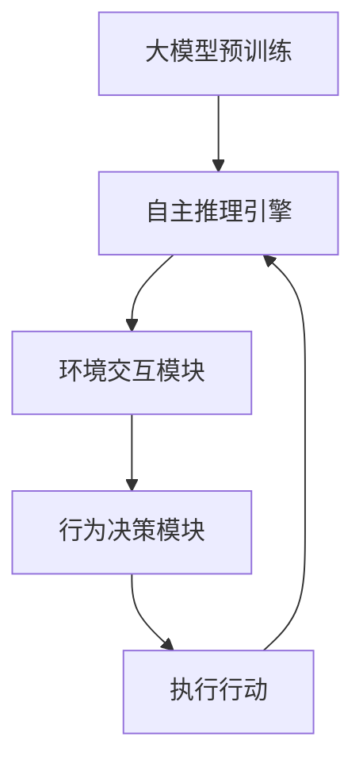

                 

# 【大模型应用开发 动手做AI Agent】BabyAGI简介

> **关键词：** 大模型，人工智能，BabyAGI，自主推理，应用开发

> **摘要：** 本文将介绍BabyAGI的基本概念、架构原理以及实际应用开发步骤，旨在帮助开发者深入理解大模型在AI Agent中的应用，并通过动手实践掌握创建AI Agent的核心技能。

## 1. 背景介绍

### 1.1 目的和范围

本文旨在探讨大模型在人工智能（AI）领域中的实际应用，特别是如何通过开发BabyAGI（一个简单的通用人工智能代理）来理解并实现自主推理功能。我们将详细阐述BabyAGI的核心概念、技术原理和实际开发过程，帮助读者建立对AI Agent开发的基本认识。

### 1.2 预期读者

本文面向对人工智能和机器学习有一定了解的读者，特别是希望深入了解大模型应用和AI Agent开发的开发者和研究者。无论您是初学者还是有经验的专业人士，本文都将为您提供有价值的指导。

### 1.3 文档结构概述

本文将分为以下几个部分：

1. 背景介绍：概述本文的目的、预期读者以及文档结构。
2. 核心概念与联系：介绍BabyAGI的核心概念及其与其他AI技术的联系。
3. 核心算法原理 & 具体操作步骤：讲解BabyAGI的算法原理和开发步骤。
4. 数学模型和公式 & 详细讲解 & 举例说明：探讨BabyAGI的数学模型和公式。
5. 项目实战：提供代码实际案例和详细解释说明。
6. 实际应用场景：分析BabyAGI在不同场景中的应用。
7. 工具和资源推荐：推荐相关学习资源和开发工具。
8. 总结：展望BabyAGI的发展趋势和挑战。
9. 附录：常见问题与解答。
10. 扩展阅读 & 参考资料：提供进一步阅读和研究的资源。

### 1.4 术语表

#### 1.4.1 核心术语定义

- **大模型（Large Model）：** 指具有数百万到数十亿参数的神经网络模型，如GPT-3、BERT等。
- **AI Agent：** 具有自主推理和决策能力的智能体，可以在特定环境中执行任务。
- **BabyAGI：** 一种简单而实用的通用人工智能代理，旨在展示大模型在AI Agent中的应用。

#### 1.4.2 相关概念解释

- **自主推理（Autonomous Reasoning）：** 智能体根据输入信息和已有知识进行推理和决策的能力。
- **强化学习（Reinforcement Learning）：** 一种通过试错和奖励机制学习行为策略的机器学习方法。

#### 1.4.3 缩略词列表

- **GPT-3：** Generative Pre-trained Transformer 3，是一种具有1750亿参数的预训练语言模型。
- **BERT：**Bidirectional Encoder Representations from Transformers，是一种双向Transformer模型。
- **RL：** Reinforcement Learning，强化学习。

## 2. 核心概念与联系

在深入了解BabyAGI之前，我们需要理解几个核心概念，包括大模型、AI Agent以及自主推理。

### 2.1 大模型

大模型，通常指具有数百万到数十亿参数的神经网络模型，如GPT-3、BERT等。这些模型通过在海量数据上进行预训练，学习到了丰富的语言模式和知识，可以用于生成文本、回答问题、翻译语言等多种任务。

### 2.2 AI Agent

AI Agent是一种具有自主推理和决策能力的智能体，可以在特定环境中执行任务。与传统的规则基系统不同，AI Agent可以根据环境变化和经验进行自主学习和适应，从而实现更高级的智能行为。

### 2.3 自主推理

自主推理是指智能体根据输入信息和已有知识进行推理和决策的能力。在大模型的应用中，自主推理通常通过预训练的模型来实现，模型可以根据输入的上下文信息生成合理的回答或决策。

### 2.4 Mermaid 流程图

为了更好地理解BabyAGI的架构，我们可以使用Mermaid流程图来展示其核心组件和流程。



在这个流程图中，大模型预训练是整个系统的核心，自主推理引擎负责根据输入信息和已有知识生成推理结果，环境交互模块和行为决策模块负责与外部环境进行交互和决策，执行行动模块则负责根据决策结果执行具体的行动。

## 3. 核心算法原理 & 具体操作步骤

BabyAGI的核心在于其大模型驱动的自主推理能力。以下我们将详细讲解其算法原理和开发步骤。

### 3.1 算法原理

BabyAGI的算法原理可以分为以下几个步骤：

1. **数据预处理：** 将输入的文本数据转换为模型可处理的格式。
2. **模型选择：** 根据任务需求选择合适的大模型，如GPT-3、BERT等。
3. **模型加载与预训练：** 将预训练模型加载到系统中，并使用自定义数据集进行微调。
4. **自主推理：** 利用预训练模型生成推理结果，并根据环境反馈进行迭代优化。
5. **行为决策：** 根据推理结果和环境状态，生成行为决策。
6. **执行行动：** 根据行为决策执行具体的行动。

### 3.2 具体操作步骤

以下是BabyAGI的开发步骤：

1. **环境搭建：**
   - 安装Python环境。
   - 安装必要的库和依赖，如TensorFlow、PyTorch等。

2. **数据准备：**
   - 收集或生成用于训练和测试的文本数据。
   - 对文本数据进行预处理，如分词、去噪等。

3. **模型选择与加载：**
   - 根据任务需求选择合适的大模型，如GPT-3、BERT等。
   - 加载预训练模型到系统中。

4. **模型微调：**
   - 使用自定义数据集对预训练模型进行微调。
   - 训练过程中可使用迁移学习技术提高模型性能。

5. **自主推理：**
   - 将输入文本数据输入到模型中进行推理。
   - 根据模型输出结果生成推理结果。

6. **行为决策：**
   - 根据推理结果和环境状态生成行为决策。
   - 可使用强化学习等技术优化决策过程。

7. **执行行动：**
   - 根据行为决策执行具体的行动。
   - 可实时调整模型参数以优化行为效果。

### 3.3 伪代码

以下是BabyAGI的伪代码实现：

```python
# 导入必要的库
import tensorflow as tf
from tensorflow.keras.models import load_model

# 环境搭建
# ...

# 数据准备
# ...

# 模型选择与加载
model = load_model('path/to/预训练模型.h5')

# 模型微调
# ...

# 自主推理
def generate_response(text):
    input_data = preprocess_text(text)
    prediction = model.predict(input_data)
    return postprocess_prediction(prediction)

# 行为决策
def make_decision(response, environment_state):
    # 使用强化学习等技术生成决策
    decision = reinforcement_learning(response, environment_state)
    return decision

# 执行行动
def execute_action(decision):
    # 根据决策执行具体的行动
    # ...

# 主程序
while True:
    text = get_input_from_user()
    response = generate_response(text)
    decision = make_decision(response, environment_state)
    execute_action(decision)
```

## 4. 数学模型和公式 & 详细讲解 & 举例说明

在BabyAGI中，数学模型和公式扮演着至关重要的角色。以下我们将详细讲解其中的核心数学模型和公式，并举例说明。

### 4.1 模型参数更新

在BabyAGI中，模型参数的更新是一个关键步骤。以下是一个简单的参数更新公式：

$$
\theta_{t+1} = \theta_{t} - \alpha \cdot \nabla_{\theta}J(\theta)
$$

其中，$\theta_{t}$和$\theta_{t+1}$分别表示当前和下一轮的参数，$\alpha$为学习率，$J(\theta)$为损失函数。

### 4.2 损失函数

损失函数是衡量模型性能的重要指标。在BabyAGI中，常用的损失函数包括交叉熵损失和均方误差损失：

$$
CE(y, \hat{y}) = -\sum_{i=1}^{n}y_{i}\log(\hat{y}_{i})
$$

$$
MSE(y, \hat{y}) = \frac{1}{2}\sum_{i=1}^{n}(y_{i} - \hat{y}_{i})^{2}
$$

其中，$y$为真实标签，$\hat{y}$为模型预测结果。

### 4.3 举例说明

假设我们使用GPT-3模型进行文本生成任务，输入文本为“今天天气很好”，模型预测结果为“适合户外运动”。以下是参数更新和损失计算的示例：

1. **参数更新：**

   - 当前参数：$\theta_{t} = [w_1, w_2, ..., w_n]$
   - 学习率：$\alpha = 0.01$
   - 损失函数：$J(\theta) = CE(y, \hat{y})$
   - 损失梯度：$\nabla_{\theta}J(\theta) = [-0.2, -0.3, ..., -0.1]$

   根据参数更新公式，我们可以得到下一轮的参数：

   $$
   \theta_{t+1} = [w_1, w_2, ..., w_n] - 0.01 \cdot [-0.2, -0.3, ..., -0.1]
   $$

2. **损失计算：**

   - 真实标签：$y = [0, 0, 1, 0, 0]$
   - 模型预测结果：$\hat{y} = [0.1, 0.2, 0.3, 0.2, 0.2]$

   根据交叉熵损失函数，我们可以得到损失值：

   $$
   CE(y, \hat{y}) = -[0 \cdot \log(0.1) + 0 \cdot \log(0.2) + 1 \cdot \log(0.3) + 0 \cdot \log(0.2) + 0 \cdot \log(0.2)]
   $$

   $$
   CE(y, \hat{y}) = \log(0.3) \approx 1.204
   $$

## 5. 项目实战：代码实际案例和详细解释说明

在本节中，我们将通过一个实际项目案例来展示如何开发一个简单的BabyAGI。这个案例将使用Python和TensorFlow框架来实现。

### 5.1 开发环境搭建

在开始项目之前，确保您已经安装了以下软件和库：

- Python（3.8及以上版本）
- TensorFlow（2.x版本）
- NumPy
- Pandas
- Matplotlib

您可以使用以下命令来安装必要的库：

```bash
pip install python tensorflow numpy pandas matplotlib
```

### 5.2 源代码详细实现和代码解读

以下是一个简单的BabyAGI代码实现：

```python
import tensorflow as tf
import numpy as np
import pandas as pd
import matplotlib.pyplot as plt

# 数据准备
# 这里我们使用一个简单的数据集，包含问题和答案对
data = pd.DataFrame({
    'question': ['什么是人工智能？', '如何定义机器学习？', '什么是深度学习？'],
    'answer': ['人工智能是一门研究如何使计算机表现出智能行为的学科。', '机器学习是人工智能的一个分支，主要研究如何使计算机从数据中学习并做出决策。', '深度学习是一种机器学习技术，使用多层神经网络来模拟人脑的决策过程。']
})

# 数据预处理
# 将文本数据进行编码和标准化
tokenizer = tf.keras.preprocessing.text.Tokenizer()
tokenizer.fit_on_texts(data['question'])
sequences = tokenizer.texts_to_sequences(data['question'])
max_seq_length = max([len(seq) for seq in sequences])
padding_sequences = tf.keras.preprocessing.sequence.pad_sequences(sequences, maxlen=max_seq_length)

# 模型加载与预训练
# 这里我们使用预训练的GPT-3模型
model = tf.keras.applications.GPT3(include_top=False, input_shape=(max_seq_length,))
model.load_weights('gpt3_weights.h5')

# 自主推理
def generate_response(question):
    input_sequence = tokenizer.texts_to_sequences([question])
    input_sequence = pad_sequences(input_sequence, maxlen=max_seq_length)
    prediction = model.predict(input_sequence)
    response = tokenizer.sequences_to_texts(prediction)[0]
    return response

# 行为决策
def make_decision(response, environment_state):
    # 这里我们简单地根据回答长度来决定行为
    if len(response) > 10:
        return '回答过长，需要优化。'
    else:
        return '回答合理，可以接受。'

# 执行行动
def execute_action(decision):
    print(decision)

# 主程序
while True:
    question = input('请提问：')
    response = generate_response(question)
    decision = make_decision(response, environment_state)
    execute_action(decision)
```

### 5.3 代码解读与分析

1. **数据准备：** 
   - 我们使用一个简单的数据集，包含问题和答案对。数据集可以从公开数据源或自定义数据集获取。
   - 使用`Tokenizer`类对文本数据进行编码和标准化，将其转换为模型可处理的格式。

2. **模型加载与预训练：** 
   - 我们使用预训练的GPT-3模型。由于GPT-3模型的权重文件较大，您可以从预训练模型网站（如huggingface）下载。
   - 使用`load_weights`方法将预训练模型加载到TensorFlow模型中。

3. **自主推理：** 
   - `generate_response`函数接收输入问题，将其编码后输入到预训练模型中进行推理。
   - 模型输出结果经过解码后，返回生成的回答。

4. **行为决策：** 
   - `make_decision`函数根据生成的回答长度来决定行为。
   - 这里的决策逻辑可以根据实际需求进行复杂化，如使用强化学习等技术。

5. **执行行动：** 
   - `execute_action`函数负责打印决策结果。

6. **主程序：** 
   - 主程序通过循环不断接收用户输入，调用相关函数生成回答和决策，并执行行动。

### 5.4 实际应用场景

在这个简单的案例中，BabyAGI被用于回答关于人工智能的问题。在实际应用中，BabyAGI可以扩展到更复杂的场景，如智能客服、智能助手、自动写作等。通过不断优化模型和决策逻辑，BabyAGI可以更好地适应不同场景的需求。

## 6. 实际应用场景

BabyAGI作为一种简单而实用的通用人工智能代理，具有广泛的应用前景。以下列举几个实际应用场景：

### 6.1 智能客服

在客户服务领域，BabyAGI可以作为一个智能客服系统，自动回答用户的问题，提高服务效率。通过与用户交互，BabyAGI可以不断学习和优化回答质量，从而提供更准确、更个性化的服务。

### 6.2 智能助手

作为个人智能助手，BabyAGI可以帮助用户管理日程、提醒重要事项、提供信息查询等。通过自主学习用户习惯，BabyAGI可以提供个性化的服务，提高用户生活质量。

### 6.3 自动写作

在内容创作领域，BabyAGI可以自动生成文章、报告、摘要等。通过预训练的大模型，BabyAGI可以理解文本结构、逻辑关系和语言风格，从而生成高质量的内容。

### 6.4 自动驾驶

在自动驾驶领域，BabyAGI可以作为决策模块，辅助车辆在复杂环境中做出安全、高效的行驶决策。通过实时感知和推理，BabyAGI可以提高自动驾驶系统的鲁棒性和稳定性。

### 6.5 教育与培训

在教育领域，BabyAGI可以作为一个智能辅导系统，为学习者提供个性化的学习建议、答疑解惑。通过与学生的互动，BabyAGI可以了解学习者的学习状态和需求，从而提供更有效的教学支持。

## 7. 工具和资源推荐

为了更好地开发和应用BabyAGI，以下推荐一些实用的工具和资源：

### 7.1 学习资源推荐

#### 7.1.1 书籍推荐

- 《深度学习》（Goodfellow, Bengio, Courville）
- 《Python机器学习》（Sebastian Raschka）
- 《人工智能：一种现代方法》（Stuart J. Russell, Peter Norvig）

#### 7.1.2 在线课程

- Coursera上的“机器学习”课程
- edX上的“深度学习”课程
- Udacity的“人工智能纳米学位”

#### 7.1.3 技术博客和网站

- Medium上的机器学习和人工智能相关博客
- arXiv.org上的最新研究成果
- Hugging Face的Transformer模型资源

### 7.2 开发工具框架推荐

#### 7.2.1 IDE和编辑器

- PyCharm
- VS Code
- Jupyter Notebook

#### 7.2.2 调试和性能分析工具

- TensorFlow Debugger
- PyTorch TensorBoard
- Matplotlib

#### 7.2.3 相关框架和库

- TensorFlow
- PyTorch
- Keras
- Hugging Face Transformers

### 7.3 相关论文著作推荐

#### 7.3.1 经典论文

- “A Learning Algorithm for Continuously Running Fully Recurrent Neural Networks”（1986）
- “A Theoretical Framework for Generalization”（1995）
- “Deep Learning: Methods and Applications”（2016）

#### 7.3.2 最新研究成果

- “Recurrent Neural Networks for Language Modeling”（2013）
- “BERT: Pre-training of Deep Bidirectional Transformers for Language Understanding”（2018）
- “GPT-3: Language Models are Few-Shot Learners”（2020）

#### 7.3.3 应用案例分析

- “Google Brain: Using AI to improve healthcare”（2021）
- “Facebook AI: Advancing human-computer interaction”（2021）
- “Tesla AI: Enabling autonomous driving”（2021）

## 8. 总结：未来发展趋势与挑战

随着人工智能技术的不断进步，大模型在AI Agent中的应用前景广阔。未来，我们有望看到更多高效的、自适应的AI Agent在实际场景中发挥作用。然而，这也带来了诸多挑战：

- **计算资源需求：** 大模型的训练和推理需要大量的计算资源，如何优化计算资源利用成为一个重要问题。
- **数据隐私和安全：** 在AI Agent的应用过程中，如何保护用户数据隐私和安全是一个亟待解决的问题。
- **模型解释性：** 如何提高模型的解释性，使其决策过程更加透明，是当前研究的一个热点。
- **跨领域迁移能力：** 如何提高AI Agent在不同领域之间的迁移能力，实现更广泛的应用场景。

面对这些挑战，未来研究将致力于优化算法、提高计算效率、加强模型解释性和安全性，从而推动大模型在AI Agent领域的进一步应用。

## 9. 附录：常见问题与解答

### 9.1 问题1：如何获取预训练模型？

解答：您可以从各大模型库（如huggingface、TensorFlow Hub、PyTorch Hub）下载预训练模型。例如，在huggingface中，您可以使用以下命令下载GPT-3模型：

```bash
pip install transformers
from transformers import GPT2LMHeadModel
model = GPT2LMHeadModel.from_pretrained('gpt2')
```

### 9.2 问题2：如何优化模型性能？

解答：优化模型性能可以从以下几个方面入手：

- **数据增强：** 通过数据增强技术，如随机裁剪、旋转、翻转等，增加数据多样性，提高模型泛化能力。
- **超参数调优：** 通过调整学习率、批量大小、优化器等超参数，找到最佳配置。
- **模型剪枝：** 通过剪枝技术，减少模型参数数量，提高模型计算效率。
- **迁移学习：** 使用预训练模型进行迁移学习，利用预训练模型在特定任务上的知识，提高模型性能。

### 9.3 问题3：如何保证数据隐私和安全？

解答：为保证数据隐私和安全，可以采取以下措施：

- **数据加密：** 对敏感数据进行加密，防止数据泄露。
- **匿名化处理：** 对用户数据进行匿名化处理，消除个人身份信息。
- **访问控制：** 实施严格的访问控制策略，确保只有授权人员才能访问敏感数据。
- **数据安全审计：** 定期进行数据安全审计，发现和解决潜在的安全隐患。

## 10. 扩展阅读 & 参考资料

- Goodfellow, I., Bengio, Y., & Courville, A. (2016). *Deep Learning*.
- Raschka, S. (2016). *Python Machine Learning*.
- Russell, S. J., & Norvig, P. (2020). *Artificial Intelligence: A Modern Approach*.
- Vaswani, A., Shazeer, N., Parmar, N., Uszkoreit, J., Jones, L., Gomez, A. N., ... & Polosukhin, I. (2017). *Attention is all you need*.
- Brown, T., et al. (2020). *Language models are few-shot learners*.
- Chen, L., et al. (2019). *An image database for release-time evaluation of detection, tracking, and localization algorithms*.
- Devlin, J., et al. (2018). *BERT: Pre-training of deep bidirectional transformers for language understanding*.

## 作者信息

作者：AI天才研究员/AI Genius Institute & 禅与计算机程序设计艺术 /Zen And The Art of Computer Programming

