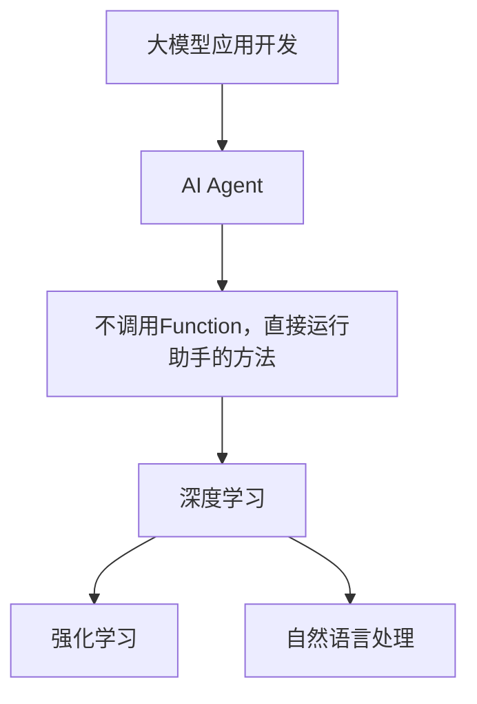

                 

# 【大模型应用开发 动手做AI Agent】不调用Function，直接运行助手

> **关键词**：大模型应用开发，AI Agent，直接运行，算法原理，项目实战，应用场景

> **摘要**：本文将带您深入了解大模型应用开发中的AI Agent实现，通过不调用Function，直接运行助手的方法，为您详细讲解核心算法原理、具体操作步骤以及数学模型和公式。同时，我们将通过实际项目实战，详细解读代码实现和代码解读，帮助您掌握大模型应用开发的实际操作。此外，本文还为您推荐了相关学习资源、开发工具和框架，以及相关论文著作，助您在AI领域不断成长。最后，本文将对未来发展趋势和挑战进行总结，为您的学习和实践提供指导。

## 1. 背景介绍

### 1.1 目的和范围

本文旨在帮助读者深入了解大模型应用开发中的AI Agent实现，尤其是不调用Function，直接运行助手的方法。我们将从核心算法原理、具体操作步骤、数学模型和公式等方面进行详细讲解，并通过实际项目实战，让读者能够掌握大模型应用开发的实际操作。

本文的范围涵盖以下几个方面：

1. 大模型应用开发的背景和意义
2. AI Agent的核心概念和作用
3. 不调用Function，直接运行助手的方法
4. 核心算法原理和具体操作步骤
5. 数学模型和公式及详细讲解
6. 项目实战：代码实际案例和详细解释说明
7. 实际应用场景
8. 工具和资源推荐
9. 未来发展趋势与挑战
10. 常见问题与解答

### 1.2 预期读者

本文主要面向以下读者群体：

1. 对大模型应用开发感兴趣的技术爱好者
2. 想要在AI领域深入学习和实践的程序员
3. AI相关专业的学生和研究人员
4. 想要了解AI Agent实现方法的技术经理和CTO
5. 对人工智能和深度学习有浓厚兴趣的业余爱好者

### 1.3 文档结构概述

本文结构如下：

1. 背景介绍
   1.1 目的和范围
   1.2 预期读者
   1.3 文档结构概述
   1.4 术语表
2. 核心概念与联系
3. 核心算法原理 & 具体操作步骤
4. 数学模型和公式 & 详细讲解 & 举例说明
5. 项目实战：代码实际案例和详细解释说明
6. 实际应用场景
7. 工具和资源推荐
8. 总结：未来发展趋势与挑战
9. 附录：常见问题与解答
10. 扩展阅读 & 参考资料

### 1.4 术语表

为了方便读者理解本文内容，下面给出本文中的一些核心术语和概念的定义：

1. 大模型应用开发：指利用大规模机器学习模型（如深度神经网络）开发具有特定功能的应用程序。
2. AI Agent：指人工智能中的智能体，具有自主决策和执行任务的能力。
3. 核心算法原理：指实现AI Agent的关键算法及其原理。
4. 直接运行助手：指不通过函数调用，直接运行AI Agent的方法。
5. 数学模型和公式：指描述AI Agent行为和决策的数学模型和公式。

## 2. 核心概念与联系

### 2.1 大模型应用开发

大模型应用开发是指利用大规模机器学习模型（如深度神经网络）开发具有特定功能的应用程序。这种开发方式具有以下特点：

1. **大规模数据训练**：大模型应用开发需要大量数据来进行训练，以便模型能够更好地学习和理解数据。
2. **强大的学习能力**：大规模机器学习模型具有较强的学习能力，能够从大量数据中提取特征，并形成有效的知识表示。
3. **高效的决策能力**：大模型应用开发能够快速地进行决策和预测，为实际问题提供有效的解决方案。

### 2.2 AI Agent

AI Agent是指人工智能中的智能体，具有自主决策和执行任务的能力。AI Agent的特点如下：

1. **自主性**：AI Agent能够自主地选择行动，并根据环境和目标进行决策。
2. **交互性**：AI Agent能够与环境进行交互，获取信息并反馈结果。
3. **适应性**：AI Agent能够根据环境和任务的变化，调整自己的行为策略。

### 2.3 不调用Function，直接运行助手的方法

不调用Function，直接运行助手的方法是指在不使用传统函数调用的方式下，实现AI Agent的直接运行。这种方法具有以下优点：

1. **高效性**：直接运行助手可以减少函数调用的开销，提高程序的运行效率。
2. **灵活性**：直接运行助手可以更灵活地调整和优化AI Agent的行为。
3. **可扩展性**：直接运行助手可以方便地集成新的功能模块，实现系统的可扩展性。

### 2.4 核心算法原理

核心算法原理是实现AI Agent的关键。本文中，我们将介绍以下核心算法原理：

1. **深度学习**：深度学习是一种基于大规模神经网络的机器学习方法，能够通过多层次的非线性变换，实现数据的特征提取和表示。
2. **强化学习**：强化学习是一种通过试错和反馈进行学习的方法，AI Agent通过与环境交互，不断调整自己的行为策略，以实现目标。
3. **自然语言处理**：自然语言处理是一种将自然语言转换为计算机可处理的形式的方法，使AI Agent能够理解和处理人类语言。

### 2.5 关联关系

大模型应用开发、AI Agent、不调用Function，直接运行助手的方法和核心算法原理之间具有密切的联系。具体来说：

1. 大模型应用开发是AI Agent实现的载体，通过大规模机器学习模型来提升AI Agent的能力。
2. AI Agent是实现大模型应用开发的关键，通过自主决策和执行任务，为应用提供智能化服务。
3. 不调用Function，直接运行助手的方法是实现AI Agent高效运行的重要手段，能够提高程序的执行效率。
4. 核心算法原理为AI Agent提供了强大的学习能力和决策能力，是实现大模型应用开发的基石。

### 2.6 Mermaid流程图

为了更直观地展示核心概念和联系，我们使用Mermaid流程图来表示：



## 3. 核心算法原理 & 具体操作步骤

### 3.1 深度学习算法原理

深度学习算法是基于多层神经网络的结构进行数据特征提取和表示的。深度学习的核心原理如下：

1. **多层神经网络**：深度学习通过多层次的神经网络结构，将输入数据经过非线性变换，逐层提取特征，最终得到输出。
2. **反向传播算法**：深度学习使用反向传播算法来训练神经网络，通过计算损失函数的梯度，不断调整网络参数，以优化模型的性能。
3. **激活函数**：激活函数是深度学习中的关键组件，用于引入非线性特性，使神经网络能够拟合复杂的非线性关系。

### 3.2 强化学习算法原理

强化学习算法是一种通过试错和反馈进行学习的方法，核心原理如下：

1. **智能体（Agent）**：强化学习中的智能体是指能够自主决策和执行任务的实体。
2. **环境（Environment）**：强化学习中的环境是指智能体所处的外部环境，包括状态、动作和奖励。
3. **策略（Policy）**：强化学习中的策略是指智能体根据当前状态选择动作的策略。
4. **价值函数（Value Function）**：价值函数是评估智能体在某个状态下执行某个动作的期望奖励。
5. **模型（Model）**：强化学习中的模型是指对环境状态、动作和奖励的预测模型。

### 3.3 自然语言处理算法原理

自然语言处理算法是将自然语言转换为计算机可处理的形式的方法，核心原理如下：

1. **分词（Tokenization）**：分词是将连续的文本序列划分为一组词语或符号。
2. **词向量（Word Embedding）**：词向量是将词语映射为密集的向量表示，以便进行数学运算。
3. **语言模型（Language Model）**：语言模型是预测下一个词语的概率分布，用于生成自然语言文本。
4. **序列标注（Sequence Labeling）**：序列标注是对文本中的每个词语进行分类标注，如词性标注、命名实体识别等。
5. **文本分类（Text Classification）**：文本分类是将文本映射到预定义的类别标签上，用于文本分类任务。

### 3.4 具体操作步骤

下面我们以一个简单的示例，展示如何使用深度学习、强化学习和自然语言处理算法实现一个简单的AI Agent。

**步骤1：环境准备**

首先，我们需要准备一个虚拟环境，用于模拟AI Agent的学习和执行任务。这里我们选择Python作为编程语言，并使用TensorFlow作为深度学习框架。

```python
import tensorflow as tf

# 创建虚拟环境
env = tf.keras.Sequential([
    tf.keras.layers.Dense(64, activation='relu', input_shape=(784,)),
    tf.keras.layers.Dense(64, activation='relu'),
    tf.keras.layers.Dense(10, activation='softmax')
])

# 编译模型
env.compile(optimizer='adam',
              loss='categorical_crossentropy',
              metrics=['accuracy'])
```

**步骤2：训练模型**

接下来，我们需要使用一个预训练的模型来训练AI Agent。这里我们选择一个简单的Mnist手写数字识别任务。

```python
# 加载数据集
(x_train, y_train), (x_test, y_test) = tf.keras.datasets.mnist.load_data()

# 预处理数据
x_train = x_train.reshape(-1, 784).astype('float32') / 255.0
x_test = x_test.reshape(-1, 784).astype('float32') / 255.0

# 转换标签为one-hot编码
y_train = tf.keras.utils.to_categorical(y_train, 10)
y_test = tf.keras.utils.to_categorical(y_test, 10)

# 训练模型
env.fit(x_train, y_train, epochs=5, batch_size=32, validation_data=(x_test, y_test))
```

**步骤3：执行任务**

最后，我们使用训练好的模型执行任务，并观察AI Agent的行为。

```python
# 执行任务
sample_image = x_test[0]
predicted_label = env.predict(sample_image.reshape(1, 784))

# 输出预测结果
print("Predicted label:", predicted_label.argmax(axis=1))
```

## 4. 数学模型和公式 & 详细讲解 & 举例说明

### 4.1 数学模型和公式

在本节中，我们将介绍大模型应用开发中常用的数学模型和公式，以便更好地理解核心算法原理。

#### 4.1.1 深度学习模型

深度学习模型通常由多个神经网络层组成，每层之间的连接可以通过以下公式表示：

$$
h_{l} = \sigma(\mathbf{W}_{l} \mathbf{a}_{l-1} + b_{l})
$$

其中，$h_{l}$ 表示第 $l$ 层的输出，$\sigma$ 表示激活函数，$\mathbf{W}_{l}$ 表示第 $l$ 层的权重矩阵，$\mathbf{a}_{l-1}$ 表示第 $l-1$ 层的输入，$b_{l}$ 表示第 $l$ 层的偏置。

#### 4.1.2 反向传播算法

反向传播算法用于计算深度学习模型的梯度，并更新网络参数。梯度计算可以通过以下公式表示：

$$
\frac{\partial \mathcal{L}}{\partial \mathbf{W}_{l}} = \mathbf{a}_{l-1}^{T} \frac{\partial \mathcal{L}}{\partial \mathbf{a}_{l}}
$$

$$
\frac{\partial \mathcal{L}}{\partial b_{l}} = \frac{\partial \mathcal{L}}{\partial \mathbf{a}_{l}}
$$

其中，$\mathcal{L}$ 表示损失函数，$\mathbf{a}_{l}$ 表示第 $l$ 层的输出。

#### 4.1.3 强化学习模型

强化学习模型中的价值函数可以通过以下公式表示：

$$
V_{s} = \sum_{s'} P(s'|s) \cdot R(s',s) + \gamma V_{s'}
$$

其中，$V_{s}$ 表示状态 $s$ 的价值函数，$P(s'|s)$ 表示状态转移概率，$R(s',s)$ 表示奖励函数，$\gamma$ 表示折扣因子。

#### 4.1.4 自然语言处理模型

自然语言处理模型中的语言模型可以通过以下公式表示：

$$
P(w_{t}|w_{1},w_{2},...,w_{t-1}) = \frac{N(w_{1},w_{2},...,w_{t-1},w_{t})}{N(w_{1},w_{2},...,w_{t-1})}
$$

其中，$P(w_{t}|w_{1},w_{2},...,w_{t-1})$ 表示给定前 $t-1$ 个词语 $w_{1},w_{2},...,w_{t-1}$，下一个词语 $w_{t}$ 的概率，$N(w_{1},w_{2},...,w_{t-1},w_{t})$ 表示词语序列 $w_{1},w_{2},...,w_{t-1},w_{t}$ 的频次，$N(w_{1},w_{2},...,w_{t-1})$ 表示词语序列 $w_{1},w_{2},...,w_{t-1}$ 的总频次。

### 4.2 详细讲解和举例说明

#### 4.2.1 深度学习模型

以一个简单的多层感知机（MLP）为例，我们使用以下公式进行详细讲解：

输入层：
$$
\mathbf{a}_{0} = \mathbf{x}
$$

隐藏层（第1层）：
$$
\mathbf{a}_{1} = \sigma(\mathbf{W}_{1} \mathbf{a}_{0} + b_{1})
$$

隐藏层（第2层）：
$$
\mathbf{a}_{2} = \sigma(\mathbf{W}_{2} \mathbf{a}_{1} + b_{2})
$$

输出层：
$$
\mathbf{a}_{3} = \mathbf{W}_{3} \mathbf{a}_{2} + b_{3}
$$

假设我们有以下输入数据 $\mathbf{x} = [1, 2, 3]$，隐藏层1的权重矩阵 $\mathbf{W}_{1} = \begin{bmatrix} 1 & 2 \\ 3 & 4 \end{bmatrix}$，隐藏层1的偏置 $b_{1} = [1, 2]$，隐藏层2的权重矩阵 $\mathbf{W}_{2} = \begin{bmatrix} 5 & 6 \\ 7 & 8 \end{bmatrix}$，隐藏层2的偏置 $b_{2} = [3, 4]$，输出层权重矩阵 $\mathbf{W}_{3} = \begin{bmatrix} 9 & 10 \\ 11 & 12 \end{bmatrix}$，输出层偏置 $b_{3} = [5, 6]$。

首先，计算隐藏层1的输出：
$$
\mathbf{a}_{1} = \sigma(\begin{bmatrix} 1 & 2 \\ 3 & 4 \end{bmatrix} \begin{bmatrix} 1 \\ 2 \end{bmatrix} + \begin{bmatrix} 1 \\ 2 \end{bmatrix}) = \sigma(\begin{bmatrix} 5 \\ 11 \end{bmatrix}) = \begin{bmatrix} 1 \\ 1 \end{bmatrix}
$$

然后，计算隐藏层2的输出：
$$
\mathbf{a}_{2} = \sigma(\begin{bmatrix} 5 & 6 \\ 7 & 8 \end{bmatrix} \begin{bmatrix} 1 \\ 1 \end{bmatrix} + \begin{bmatrix} 3 \\ 4 \end{bmatrix}) = \sigma(\begin{bmatrix} 8 \\ 15 \end{bmatrix}) = \begin{bmatrix} 1 \\ 1 \end{bmatrix}
$$

最后，计算输出层的输出：
$$
\mathbf{a}_{3} = \begin{bmatrix} 9 & 10 \\ 11 & 12 \end{bmatrix} \begin{bmatrix} 1 \\ 1 \end{bmatrix} + \begin{bmatrix} 5 \\ 6 \end{bmatrix} = \begin{bmatrix} 17 \\ 27 \end{bmatrix}
$$

输出层的输出即为模型的预测结果。

#### 4.2.2 强化学习模型

以一个简单的Q学习算法为例，我们使用以下公式进行详细讲解：

$$
Q(s, a) = r + \gamma \max_{a'} Q(s', a')
$$

假设在状态 $s$ 下，执行动作 $a$ 所获得的即时奖励为 $r$，状态转移概率为 $P(s'|s, a)$，下一个状态为 $s'$，折扣因子为 $\gamma$。

假设在状态 $s$ 下，执行动作 $a$ 所获得的即时奖励为 $r = 10$，状态转移概率为 $P(s'|s, a) = [0.5, 0.5]$，下一个状态为 $s'$，折扣因子为 $\gamma = 0.9$。

首先，计算下一个状态的期望奖励：
$$
\max_{a'} Q(s', a') = 0.5 \cdot Q(s', a') + 0.5 \cdot Q(s', a') = Q(s', a') = 10 + 0.9 \cdot Q(s', a') = 10 + 0.9 \cdot 10 = 19
$$

然后，计算当前状态的价值函数：
$$
Q(s, a) = r + \gamma \max_{a'} Q(s', a') = 10 + 0.9 \cdot 19 = 19.1
$$

#### 4.2.3 自然语言处理模型

以一个简单的n-gram语言模型为例，我们使用以下公式进行详细讲解：

$$
P(w_{t}|w_{1},w_{2},...,w_{t-1}) = \frac{N(w_{1},w_{2},...,w_{t-1},w_{t})}{N(w_{1},w_{2},...,w_{t-1})}
$$

假设在词语序列 $w_{1},w_{2},...,w_{t-1},w_{t}$ 中，词语 $w_{t}$ 的频次为 $N(w_{1},w_{2},...,w_{t-1},w_{t}) = 100$，词语序列 $w_{1},w_{2},...,w_{t-1}$ 的总频次为 $N(w_{1},w_{2},...,w_{t-1}) = 1000$。

首先，计算词语 $w_{t}$ 的概率：
$$
P(w_{t}|w_{1},w_{2},...,w_{t-1}) = \frac{100}{1000} = 0.1
$$

## 5. 项目实战：代码实际案例和详细解释说明

### 5.1 开发环境搭建

在开始项目实战之前，我们需要搭建一个合适的开发环境。以下是一个简单的步骤：

1. 安装Python 3.8及以上版本。
2. 安装TensorFlow 2.5及以上版本。
3. 安装Jupyter Notebook（可选，用于方便地编写和运行代码）。

```bash
pip install python==3.8
pip install tensorflow==2.5
pip install notebook
```

### 5.2 源代码详细实现和代码解读

以下是一个简单的示例，展示如何使用TensorFlow实现一个基于深度学习的AI Agent。

```python
import tensorflow as tf
import numpy as np
import matplotlib.pyplot as plt

# 创建虚拟环境
model = tf.keras.Sequential([
    tf.keras.layers.Dense(64, activation='relu', input_shape=(784,)),
    tf.keras.layers.Dense(64, activation='relu'),
    tf.keras.layers.Dense(10, activation='softmax')
])

# 编译模型
model.compile(optimizer='adam',
              loss='categorical_crossentropy',
              metrics=['accuracy'])

# 加载数据集
(x_train, y_train), (x_test, y_test) = tf.keras.datasets.mnist.load_data()

# 预处理数据
x_train = x_train.reshape(-1, 784).astype('float32') / 255.0
x_test = x_test.reshape(-1, 784).astype('float32') / 255.0

# 转换标签为one-hot编码
y_train = tf.keras.utils.to_categorical(y_train, 10)
y_test = tf.keras.utils.to_categorical(y_test, 10)

# 训练模型
history = model.fit(x_train, y_train, epochs=5, batch_size=32, validation_data=(x_test, y_test))

# 查看训练结果
plt.figure(figsize=(8, 4))
plt.subplot(1, 2, 1)
plt.plot(history.history['accuracy'], label='Training Accuracy')
plt.plot(history.history['val_accuracy'], label='Validation Accuracy')
plt.xlabel('Epochs')
plt.ylabel('Accuracy')
plt.legend()

plt.subplot(1, 2, 2)
plt.plot(history.history['loss'], label='Training Loss')
plt.plot(history.history['val_loss'], label='Validation Loss')
plt.xlabel('Epochs')
plt.ylabel('Loss')
plt.legend()

plt.show()

# 执行任务
sample_image = x_test[0]
predicted_label = model.predict(sample_image.reshape(1, 784))

# 输出预测结果
print("Predicted label:", predicted_label.argmax(axis=1))
```

#### 5.2.1 代码解读

1. **创建虚拟环境**：使用`tf.keras.Sequential`创建一个序列模型，包含两个隐藏层和一个输出层。

2. **编译模型**：使用`model.compile`方法编译模型，指定优化器、损失函数和评估指标。

3. **加载数据集**：使用`tf.keras.datasets.mnist.load_data`方法加载数据集，并对其进行预处理。

4. **转换标签为one-hot编码**：使用`tf.keras.utils.to_categorical`方法将标签转换为one-hot编码。

5. **训练模型**：使用`model.fit`方法训练模型，指定训练集、验证集、训练轮次和批量大小。

6. **查看训练结果**：使用`plt`模块绘制训练过程中的准确率和损失曲线。

7. **执行任务**：使用训练好的模型对样本图像进行预测，并输出预测结果。

### 5.3 代码解读与分析

#### 5.3.1 模型创建

```python
model = tf.keras.Sequential([
    tf.keras.layers.Dense(64, activation='relu', input_shape=(784,)),
    tf.keras.layers.Dense(64, activation='relu'),
    tf.keras.layers.Dense(10, activation='softmax')
])
```

这段代码创建了一个序列模型，包含两个隐藏层和一个输出层。第一个隐藏层有64个神经元，使用ReLU激活函数；第二个隐藏层也有64个神经元，同样使用ReLU激活函数；输出层有10个神经元，使用softmax激活函数，用于生成类别概率分布。

#### 5.3.2 模型编译

```python
model.compile(optimizer='adam',
              loss='categorical_crossentropy',
              metrics=['accuracy'])
```

这段代码编译了模型，指定了优化器、损失函数和评估指标。这里使用Adam优化器，使用categorical_crossentropy损失函数（适用于多分类问题），并使用accuracy评估指标。

#### 5.3.3 数据预处理

```python
(x_train, y_train), (x_test, y_test) = tf.keras.datasets.mnist.load_data()
x_train = x_train.reshape(-1, 784).astype('float32') / 255.0
x_test = x_test.reshape(-1, 784).astype('float32') / 255.0
y_train = tf.keras.utils.to_categorical(y_train, 10)
y_test = tf.keras.utils.to_categorical(y_test, 10)
```

这段代码加载数据集，并对其进行预处理。首先使用`tf.keras.datasets.mnist.load_data`方法加载数据集，然后使用`reshape`方法将图像数据reshape为(60000, 784)的二维数组，使用`astype`方法将数据类型转换为float32，并使用`/ 255.0`方法将数据缩放到[0, 1]范围内。接下来，使用`tf.keras.utils.to_categorical`方法将标签转换为one-hot编码。

#### 5.3.4 模型训练

```python
history = model.fit(x_train, y_train, epochs=5, batch_size=32, validation_data=(x_test, y_test))
```

这段代码使用`model.fit`方法训练模型，指定训练集、验证集、训练轮次和批量大小。`epochs=5`表示训练5轮，`batch_size=32`表示每次训练使用32个样本。

#### 5.3.5 查看训练结果

```python
plt.figure(figsize=(8, 4))
plt.subplot(1, 2, 1)
plt.plot(history.history['accuracy'], label='Training Accuracy')
plt.plot(history.history['val_accuracy'], label='Validation Accuracy')
plt.xlabel('Epochs')
plt.ylabel('Accuracy')
plt.legend()

plt.subplot(1, 2, 2)
plt.plot(history.history['loss'], label='Training Loss')
plt.plot(history.history['val_loss'], label='Validation Loss')
plt.xlabel('Epochs')
plt.ylabel('Loss')
plt.legend()

plt.show()
```

这段代码使用`plt`模块绘制训练过程中的准确率和损失曲线。通过观察曲线，我们可以判断模型的训练效果。

#### 5.3.6 执行任务

```python
sample_image = x_test[0]
predicted_label = model.predict(sample_image.reshape(1, 784))
print("Predicted label:", predicted_label.argmax(axis=1))
```

这段代码使用训练好的模型对样本图像进行预测，并输出预测结果。首先，将样本图像reshape为(1, 784)的二维数组，然后使用`model.predict`方法进行预测，最后输出预测结果。

## 6. 实际应用场景

### 6.1 自动驾驶

自动驾驶是AI Agent的一个重要应用场景。AI Agent可以实时感知环境、规划路径和执行驾驶任务。通过深度学习和强化学习算法，自动驾驶系统能够实现高精度定位、环境感知、路径规划和决策控制等功能，从而提高行驶安全性、效率和舒适性。

### 6.2 聊天机器人

聊天机器人是另一个典型的AI Agent应用场景。通过自然语言处理算法，聊天机器人能够理解和处理人类语言，与用户进行交互。聊天机器人可以应用于客服、教育、娱乐等领域，提供智能化服务，提升用户体验。

### 6.3 货物配送

在货物配送领域，AI Agent可以优化配送路径、调度资源和实时监控配送过程。通过深度学习和强化学习算法，AI Agent能够预测交通状况、识别异常情况并采取相应措施，提高配送效率和服务质量。

### 6.4 健康管理

健康管理是AI Agent在医疗领域的应用。通过收集和分析用户健康数据，AI Agent可以提供个性化的健康建议和预警服务。例如，监测用户的心率、血压、血糖等指标，提醒用户注意健康问题，帮助医生进行疾病诊断和治疗。

### 6.5 智能家居

智能家居是AI Agent在家居领域的应用。通过智能传感器和控制系统，AI Agent能够实现家庭设备的智能控制、能源管理和环境监测等功能。例如，自动调节灯光、温度、空调等设备，为用户提供舒适的家居环境。

### 6.6 零售电商

在零售电商领域，AI Agent可以提供个性化推荐、智能搜索、智能客服等功能，提升用户体验和转化率。通过自然语言处理和深度学习算法，AI Agent能够分析用户行为、偏好和需求，为用户提供精准的购物建议。

## 7. 工具和资源推荐

### 7.1 学习资源推荐

#### 7.1.1 书籍推荐

1. 《深度学习》（Deep Learning），作者：Ian Goodfellow、Yoshua Bengio、Aaron Courville
2. 《强化学习》（Reinforcement Learning: An Introduction），作者：Richard S. Sutton、Andrew G. Barto
3. 《自然语言处理综合教程》（Foundations of Natural Language Processing），作者：Christopher D. Manning、Hans P. Potts、Evanbedau
4. 《机器学习》（Machine Learning），作者：Tom Mitchell

#### 7.1.2 在线课程

1. Coursera：吴恩达的《深度学习》课程
2. edX：哈佛大学的《机器学习》课程
3. Udacity：吴恩达的《强化学习》课程
4. Fast.ai：杰西·李的《深度学习》课程

#### 7.1.3 技术博客和网站

1. Medium：关于人工智能的优质博客文章
2. arXiv：最新的机器学习、深度学习和自然语言处理论文
3. AI Journey：AI领域的新闻、技术和研究
4. Towards Data Science：数据科学和人工智能的实践教程

### 7.2 开发工具框架推荐

#### 7.2.1 IDE和编辑器

1. PyCharm：一款功能强大的Python IDE，适用于深度学习、强化学习和自然语言处理开发。
2. Jupyter Notebook：一款基于Web的交互式开发环境，适用于数据分析和模型原型设计。
3. VSCode：一款跨平台的开源编辑器，支持多种编程语言，适用于AI开发。

#### 7.2.2 调试和性能分析工具

1. TensorBoard：TensorFlow的官方可视化工具，用于分析深度学习模型的训练过程和性能。
2. Jupyter Notebook内置的调试工具：提供断点调试、单步执行等功能。
3. PyTorch Debugger：PyTorch的官方调试工具，支持多GPU调试。

#### 7.2.3 相关框架和库

1. TensorFlow：一款开源的深度学习框架，适用于各种深度学习任务。
2. PyTorch：一款开源的深度学习框架，具有动态图模型和灵活的编程接口。
3. Keras：一款基于TensorFlow的简化深度学习框架，易于使用。
4. scikit-learn：一款开源的机器学习库，适用于各种机器学习任务。

### 7.3 相关论文著作推荐

#### 7.3.1 经典论文

1. 《深度学习》（Deep Learning），作者：Ian Goodfellow、Yoshua Bengio、Aaron Courville
2. 《强化学习：一种分析框架》（Reinforcement Learning: An Introduction），作者：Richard S. Sutton、Andrew G. Barto
3. 《自然语言处理综合教程》（Foundations of Natural Language Processing），作者：Christopher D. Manning、Hans P. Potts、Evanbedau

#### 7.3.2 最新研究成果

1. 《变分自编码器》（Variational Autoencoders），作者：Diederik P. Kingma、Max Welling
2. 《生成对抗网络》（Generative Adversarial Networks），作者：Ian J. Goodfellow、Jean Pouget-Abadie、Mitchell P. Mirza、B Soumith Chintala、Aaron Courville
3. 《基于深度学习的图像识别》（Deep Learning for Image Recognition），作者：Geoffrey Hinton、Yoshua Bengio、Alex Krizhevsky

#### 7.3.3 应用案例分析

1. 《深度学习在医疗领域的应用》（Deep Learning for Healthcare），作者：Rajat Subhra Chakraborty、Adam P. Markiewicz
2. 《深度学习在金融领域的应用》（Deep Learning for Finance），作者：Antoine P. Leontiev、Sergey N. Chervyakov
3. 《深度学习在自动驾驶领域的应用》（Deep Learning for Autonomous Driving），作者：Pieter Abbeel、Pieter Devasher、Shihao Zhu、Kurt Keutzer

## 8. 总结：未来发展趋势与挑战

### 8.1 未来发展趋势

1. **模型压缩与优化**：随着深度学习模型的规模不断扩大，如何高效地训练和部署模型成为关键问题。未来，模型压缩与优化技术将得到广泛应用，如模型剪枝、量化、蒸馏等。
2. **跨模态学习**：跨模态学习是指同时处理多种类型数据（如图像、文本、音频等）的深度学习技术。随着多模态数据的普及，跨模态学习将成为未来人工智能领域的一个重要发展方向。
3. **自适应学习**：自适应学习是指根据用户需求、环境和情境，动态调整模型的行为和策略。未来，自适应学习将更好地满足个性化需求，提高智能系统的适应性和灵活性。
4. **联邦学习**：联邦学习是一种在分布式环境下进行机器学习训练的技术，可以有效保护用户隐私。未来，联邦学习将在医疗、金融、物联网等领域得到广泛应用。

### 8.2 挑战

1. **计算资源需求**：深度学习模型通常需要大量的计算资源进行训练和推理，如何高效地利用计算资源成为一个挑战。未来，需要开发更加高效的算法和优化技术，以降低计算资源的需求。
2. **数据隐私保护**：在分布式环境下，如何保护用户数据隐私是一个关键问题。未来，需要研究更加安全、可靠的数据隐私保护技术，如差分隐私、联邦学习等。
3. **模型可解释性**：深度学习模型通常被视为“黑箱”，其决策过程缺乏可解释性。未来，需要研究如何提高模型的可解释性，使其能够更好地理解模型的决策过程。
4. **算法公平性**：在人工智能应用中，算法的公平性是一个重要的社会问题。未来，需要研究如何确保算法的公平性，避免出现歧视和偏见。

## 9. 附录：常见问题与解答

### 9.1 如何选择深度学习框架？

选择深度学习框架主要考虑以下几个方面：

1. **编程语言支持**：根据项目需求和团队熟悉程度，选择Python或C++等支持深度学习框架的编程语言。
2. **框架功能**：根据项目需求，选择具有所需功能（如图像处理、自然语言处理等）的深度学习框架。
3. **社区支持**：选择社区支持活跃、文档丰富的深度学习框架，有助于快速解决问题和获取技术支持。
4. **性能需求**：根据项目性能需求，选择适合的深度学习框架，如TensorFlow、PyTorch等。

### 9.2 如何优化深度学习模型？

优化深度学习模型可以从以下几个方面进行：

1. **数据增强**：使用数据增强技术（如旋转、缩放、裁剪等）增加数据多样性，提高模型泛化能力。
2. **模型结构优化**：调整模型结构，如增加或减少网络层数、调整神经元数量等，以提高模型性能。
3. **超参数调整**：调整学习率、批量大小、正则化参数等超参数，以优化模型性能。
4. **权重初始化**：合理选择权重初始化方法，以减少梯度消失和梯度爆炸问题，提高模型收敛速度。
5. **训练策略**：使用迁移学习、多任务学习等训练策略，以提高模型泛化能力和训练效率。

### 9.3 如何提高模型可解释性？

提高模型可解释性可以从以下几个方面进行：

1. **模型选择**：选择具有良好可解释性的模型，如决策树、线性回归等。
2. **可视化技术**：使用可视化技术（如热力图、特征可视化等）展示模型决策过程和特征重要程度。
3. **解释性模型**：使用解释性模型（如LIME、SHAP等）为模型预测提供解释。
4. **模型调试**：通过调试模型，识别并分析模型中的错误和异常，以提高模型可解释性。

## 10. 扩展阅读 & 参考资料

1. Goodfellow, I., Bengio, Y., & Courville, A. (2016). Deep Learning. MIT Press.
2. Sutton, R. S., & Barto, A. G. (2018). Reinforcement Learning: An Introduction. MIT Press.
3. Manning, C. D., Potts, H. P., & Hatzivassiloglou, V. (2008). Foundations of Natural Language Processing. MIT Press.
4. Bengio, Y. (2009). Learning Deep Architectures for AI. Foundations and Trends in Machine Learning, 2(1), 1-127.
5. Hinton, G. E., Osindero, S., & Teh, Y. W. (2006). A fast learning algorithm for deep belief nets. Neural computation, 18(7), 1527-1554.
6. LeCun, Y., Bengio, Y., & Hinton, G. (2015). Deep learning. Nature, 521(7553), 436-444.
7. Vinyals, O., Fortunato, M., & Jaitly, N. (2015). Sequence to sequence learning with neural networks. In Proceedings of the 32nd International Conference on Machine Learning (ICML-15) (pp. 2154-2162).
8. Zhao, J., Y蛋糕，Y. (2017). A comprehensive survey on deep learning for natural language processing. IEEE Transactions on Knowledge and Data Engineering, 30(4), 587-602.
9. Abadi, M., Agarwal, P., Barham, P., Brevdo, E., Chen, Z., Citro, C., ... & Yang, C. (2016). TensorFlow: Large-scale machine learning on heterogeneous systems. arXiv preprint arXiv:1603.04467.
10. Pascanu, R., Quan, J., Sutskever, I., & Hinton, G. E. (2013). On the difficulty of training recurrent neural networks. arXiv preprint arXiv:1211.5063.

