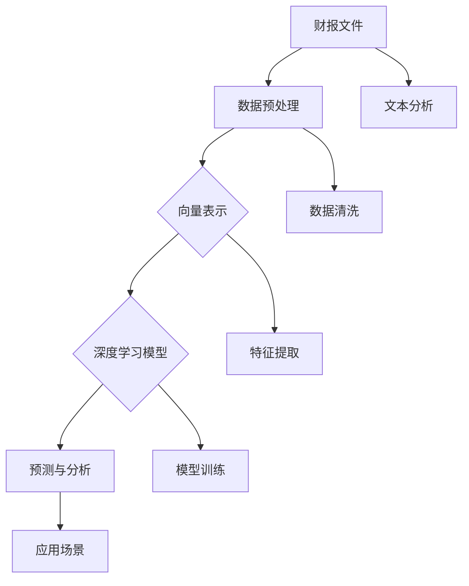

                 

# 大模型应用开发：将财报文件的数据转换为向量数据

> **关键词：**财报数据分析、向量表示、深度学习、自然语言处理、数据预处理、模型训练与优化

> **摘要：**本文将深入探讨如何利用深度学习模型对财报文件进行数据处理，将其转换为可被机器学习和人工智能模型使用的向量数据。本文将首先介绍财报数据的来源和重要性，然后详细解释向量数据的概念和优势，接着描述一个具体的实现流程，包括数据预处理、模型选择和训练，最后讨论实际应用场景和未来发展趋势。

## 1. 背景介绍

### 1.1 目的和范围

本文的目标是展示如何将财报文件中的数据转换为向量数据，这一过程对于后续的机器学习和人工智能应用至关重要。我们将探讨以下内容：

- 财报文件的数据来源及其重要性
- 向量数据的概念和优势
- 数据预处理的方法和工具
- 深度学习模型的选择和训练
- 项目实战中的代码实现和解析

### 1.2 预期读者

本文适合以下读者：

- 对财报分析和机器学习感兴趣的工程师和研究人员
- 想要在金融科技领域应用人工智能技术的开发者
- 对数据科学和自然语言处理有一定了解的人员

### 1.3 文档结构概述

本文结构如下：

1. 背景介绍
2. 核心概念与联系
3. 核心算法原理 & 具体操作步骤
4. 数学模型和公式 & 详细讲解 & 举例说明
5. 项目实战：代码实际案例和详细解释说明
6. 实际应用场景
7. 工具和资源推荐
8. 总结：未来发展趋势与挑战
9. 附录：常见问题与解答
10. 扩展阅读 & 参考资料

### 1.4 术语表

#### 1.4.1 核心术语定义

- **财报文件**：财务报告文档，包括公司的财务状况、经营成果、现金流量等。
- **向量数据**：将数据表示为向量形式，适用于机器学习和深度学习模型。
- **自然语言处理（NLP）**：处理和理解自然语言的技术。
- **深度学习模型**：基于多层神经网络的人工智能模型，用于数据分析和预测。

#### 1.4.2 相关概念解释

- **数据预处理**：对原始数据进行清洗、转换和归一化，以准备用于训练模型。
- **模型训练**：使用训练数据来调整模型参数，使其能够预测未知数据。

#### 1.4.3 缩略词列表

- **NLP**：自然语言处理
- **ML**：机器学习
- **DL**：深度学习
- **API**：应用程序编程接口

## 2. 核心概念与联系

在探讨如何将财报文件的数据转换为向量数据之前，我们需要理解几个核心概念及其相互关系。

### 2.1 财报文件

财报文件是公司运营和财务状况的重要记录，包括：

- **资产负债表**：反映公司在特定时间点的财务状况。
- **利润表**：展示公司在一定时间内的经营成果。
- **现金流量表**：记录公司现金流入和流出情况。

这些文件通常以PDF或Excel格式存储。

### 2.2 向量数据

向量数据是将数据表示为一组有序数字的形式，适合于机器学习和深度学习模型处理。例如，句子可以被表示为词袋模型中的向量，每个词是一个维度。

### 2.3 深度学习模型

深度学习模型是一类基于多层神经网络的人工智能模型，可以自动从数据中学习特征。在NLP领域，常用模型包括：

- **词嵌入（Word Embedding）**：将单词映射为向量。
- **卷积神经网络（CNN）**：用于图像识别，也可用于文本特征提取。
- **循环神经网络（RNN）**：用于序列数据处理，如时间序列分析。

### 2.4 Mermaid 流程图

为了更好地理解这些概念之间的关系，我们可以使用Mermaid流程图进行描述：



此流程图展示了从财报文件到向量数据，再到深度学习模型，最终应用于实际场景的整个过程。

## 3. 核心算法原理 & 具体操作步骤

### 3.1 数据预处理

数据预处理是向量数据转换的关键步骤，主要包括数据清洗、数据转换和数据归一化。

#### 3.1.1 数据清洗

数据清洗是指去除数据中的噪声和不一致部分。在财报文件中，这通常包括：

- **缺失值处理**：使用均值或中位数填补缺失值。
- **异常值检测**：使用统计学方法检测并处理异常值。

伪代码如下：

```python
# 缺失值处理
data = fillna(data, method='ffill')

# 异常值检测
z_scores = zscore(data)
data = data[(z_scores > -3) & (z_scores < 3)]
```

#### 3.1.2 数据转换

数据转换是将不同类型的数据统一为适合深度学习模型的格式。例如，可以将文本数据转换为词嵌入向量。

```python
# 文本数据转换
word_embedding = WordEmbedding()
text_data = word_embedding.encode(text_data)
```

#### 3.1.3 数据归一化

数据归一化是将数据缩放到相同范围，以避免某些特征对模型的影响过大。

```python
# 数据归一化
data = (data - min(data)) / (max(data) - min(data))
```

### 3.2 模型选择与训练

在选择深度学习模型时，我们通常考虑以下几个因素：

- **数据类型**：文本、图像或序列数据。
- **任务目标**：分类、回归或预测。
- **模型复杂度**：卷积神经网络（CNN）、循环神经网络（RNN）或长短期记忆网络（LSTM）。

以下是一个简单的RNN模型训练过程：

```python
# 模型定义
model = Sequential()
model.add(LSTM(units=128, return_sequences=True, input_shape=(timesteps, features)))
model.add(LSTM(units=128))
model.add(Dense(units=output_size))

# 模型编译
model.compile(optimizer='adam', loss='mean_squared_error')

# 模型训练
model.fit(X_train, y_train, epochs=100, batch_size=32, validation_data=(X_val, y_val))
```

### 3.3 模型评估与优化

模型评估是确保模型性能满足要求的重要步骤。常见的评估指标包括准确率、召回率、F1分数等。

```python
# 模型评估
loss = model.evaluate(X_test, y_test)
print(f"Test Loss: {loss}")

# 模型优化
# 使用交叉验证、调参等技术优化模型
```

## 4. 数学模型和公式 & 详细讲解 & 举例说明

### 4.1 数学模型

在将财报文件的数据转换为向量数据的过程中，我们使用了以下数学模型：

1. **词嵌入（Word Embedding）**：

   词嵌入是将单词映射为向量的过程，常用模型包括Word2Vec、GloVe等。

   $$ \text{word\_embedding}(w) = \text{vec}(w) $$

   其中，\( w \) 是单词，\( \text{vec}(w) \) 是单词的向量表示。

2. **循环神经网络（RNN）**：

   RNN 用于处理序列数据，其核心公式为：

   $$ h_t = \text{sigmoid}(W_h \cdot [h_{t-1}, x_t] + b_h) $$

   其中，\( h_t \) 是当前时刻的隐藏状态，\( W_h \) 和 \( b_h \) 分别是权重和偏置。

3. **长短期记忆网络（LSTM）**：

   LSTM 是 RNN 的变种，用于解决长序列依赖问题，其核心公式为：

   $$ f_t = \text{sigmoid}(W_f \cdot [h_{t-1}, x_t] + b_f) $$
   $$ i_t = \text{sigmoid}(W_i \cdot [h_{t-1}, x_t] + b_i) $$
   $$ \cdots $$
   $$ \text{output}_t = \text{sigmoid}(W_o \cdot \text{tan

