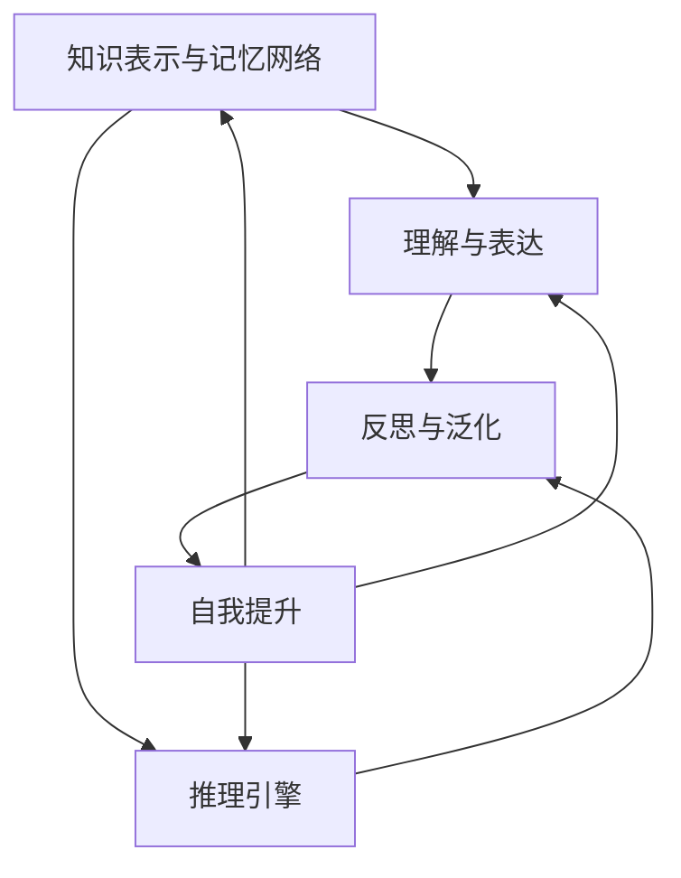

                 

# 【大模型应用开发 动手做AI Agent】知识、记忆、理解、表达、推理、反思、泛化和自我提升

> **关键词**：大模型、AI Agent、知识工程、记忆网络、推理引擎、反思学习、泛化能力、自我提升、应用开发。

> **摘要**：本文将深入探讨大模型在AI Agent开发中的应用，解析知识、记忆、理解、表达、推理、反思、泛化和自我提升等关键环节，并通过实例展示如何动手实现一个具备这些能力的大模型。文章旨在为AI开发者提供一套完整的开发框架和实战指南。

## 1. 背景介绍

近年来，随着深度学习和大数据技术的飞速发展，大模型（Large Models）已经成为人工智能领域的研究热点。大模型通常指的是具有数十亿至数万亿参数的神经网络模型，其凭借强大的计算能力和对大量数据的处理能力，在图像识别、自然语言处理、语音识别等领域取得了显著的突破。

AI Agent作为人工智能的一种形式，具备自主决策、执行任务的能力。在游戏、自动驾驶、智能家居等领域，AI Agent的应用越来越广泛。然而，传统的AI Agent在知识表示、记忆管理、推理能力等方面存在一定局限。因此，如何通过大模型提升AI Agent的整体性能，成为当前研究的一个重要方向。

本文将从知识、记忆、理解、表达、推理、反思、泛化和自我提升等方面，详细探讨大模型在AI Agent开发中的应用，并通过实例展示如何实现一个具备这些能力的大模型。

## 2. 核心概念与联系

在大模型应用开发中，我们需要关注以下几个核心概念：

### 2.1 知识表示与记忆网络

知识表示是AI Agent理解世界的基础。记忆网络是一种用于存储和检索知识的神经网络结构，可以通过对比学习、增量学习等方式，实现高效的知识表示。

### 2.2 理解与表达

理解是指AI Agent对输入信息的处理和解析能力，表达则是指AI Agent将内部知识转化为可理解的形式。两者相辅相成，共同构成了AI Agent的智能表现。

### 2.3 推理引擎

推理引擎是AI Agent的核心，负责根据已知事实和规则推导出新的结论。在大模型中，推理过程通常通过图灵完备的神经网络结构实现。

### 2.4 反思与泛化

反思是指AI Agent对自身行为和决策的审视和调整，泛化则是指AI Agent在不同场景下表现的一致性和稳定性。这两个概念对于提升AI Agent的鲁棒性和适应性至关重要。

### 2.5 自我提升

自我提升是指AI Agent通过学习和优化，不断提升自身能力的过程。在大模型中，自我提升通常通过强化学习、迁移学习等方式实现。

下面是一个简化的Mermaid流程图，展示了这些核心概念之间的联系：



## 3. 核心算法原理 & 具体操作步骤

### 3.1 知识表示与记忆网络

知识表示与记忆网络是AI Agent的核心。下面介绍一种基于Transformer的变换器记忆网络（Transformer Memory Network，TMN）。

#### 3.1.1 Transformer模型

Transformer模型是一种基于自注意力机制的深度神经网络结构，具有良好的并行计算能力。其核心思想是通过对输入数据进行加权求和，实现多层次的上下文表示。

#### 3.1.2 变换器记忆网络

变换器记忆网络（TMN）在Transformer模型的基础上，增加了记忆模块，用于存储和检索知识。具体步骤如下：

1. **输入编码**：将输入数据（如文本、图像等）编码为向量序列。
2. **自注意力计算**：计算输入序列中每个元素与其他元素之间的注意力权重，实现上下文信息的融合。
3. **记忆模块**：根据当前输入，从记忆中检索相关知识点，与自注意力结果进行拼接。
4. **输出解码**：通过全连接层和Softmax函数，将拼接后的向量序列解码为输出结果。

### 3.2 理解与表达

理解与表达是AI Agent的另一个重要方面。下面介绍一种基于生成对抗网络（Generative Adversarial Network，GAN）的理解与表达模型。

#### 3.2.1 生成对抗网络

生成对抗网络由生成器和判别器两部分组成，通过对抗训练，生成器尝试生成逼真的数据，判别器则不断学习区分真实数据和生成数据。

#### 3.2.2 理解与表达模型

理解与表达模型基于GAN，具体步骤如下：

1. **输入编码**：将输入数据（如文本、图像等）编码为向量序列。
2. **生成器**：根据输入向量序列生成对应的输出序列，实现数据转换。
3. **判别器**：判断输入和输出序列的相似度，对生成器进行训练。
4. **输出解码**：将生成器的输出序列解码为可理解的形式，实现理解与表达。

### 3.3 推理引擎

推理引擎是AI Agent的核心。下面介绍一种基于图神经网络（Graph Neural Network，GNN）的推理引擎。

#### 3.3.1 图神经网络

图神经网络是一种基于图结构的神经网络，可以处理图上的节点和边信息，具有良好的结构表示能力。

#### 3.3.2 推理引擎

推理引擎基于GNN，具体步骤如下：

1. **输入编码**：将输入数据（如知识图谱、文本等）编码为图结构。
2. **图神经网络**：计算图中节点和边之间的相互关系，实现知识表示。
3. **推理过程**：根据已知事实和规则，通过图神经网络进行推理，推导出新的事实。
4. **输出解码**：将推理结果解码为可理解的形式。

### 3.4 反思与泛化

反思与泛化是提升AI Agent鲁棒性和适应性的关键。下面介绍一种基于迁移学习的反思与泛化模型。

#### 3.4.1 迁移学习

迁移学习是一种将已知任务的知识迁移到新任务的方法，有助于减少新任务的学习成本。

#### 3.4.2 反思与泛化模型

反思与泛化模型基于迁移学习，具体步骤如下：

1. **预训练**：在一个大型数据集上对模型进行预训练，使其具备一定的通用知识。
2. **任务迁移**：将预训练模型的知识迁移到新任务上，减少新任务的学习时间。
3. **反思过程**：对新任务中的错误和异常进行反思，调整模型参数。
4. **泛化过程**：在新任务中不断优化模型，提升泛化能力。

### 3.5 自我提升

自我提升是AI Agent不断提升自身能力的过程。下面介绍一种基于强化学习的自我提升模型。

#### 3.5.1 强化学习

强化学习是一种基于奖励信号的学习方法，通过试错策略，逐步优化模型的行为。

#### 3.5.2 自我提升模型

自我提升模型基于强化学习，具体步骤如下：

1. **初始化模型**：根据已有知识初始化模型参数。
2. **探索与利用**：在探索阶段，模型尝试不同的行为策略；在利用阶段，模型根据奖励信号调整行为策略。
3. **奖励评估**：根据模型的行为结果，计算奖励信号，指导模型优化。
4. **参数更新**：根据奖励信号，更新模型参数，实现自我提升。

## 4. 数学模型和公式 & 详细讲解 & 举例说明

### 4.1 变换器记忆网络（TMN）

变换器记忆网络（TMN）的核心在于自注意力机制和记忆模块。下面介绍其数学模型。

#### 4.1.1 自注意力机制

自注意力机制的核心是计算输入序列中每个元素与其他元素之间的注意力权重。具体公式如下：

$$
\text{Attention}(Q, K, V) = \text{softmax}\left(\frac{QK^T}{\sqrt{d_k}}\right)V
$$

其中，$Q$、$K$、$V$ 分别为查询向量、键向量和值向量，$d_k$ 为键向量的维度。

#### 4.1.2 记忆模块

记忆模块用于存储和检索知识。假设记忆模块中已存储了 $m$ 个知识点，每个知识点表示为一个向量 $C_i$，则记忆模块的计算公式如下：

$$
\text{Memory}(Q) = \text{Attention}(Q, [C_1, C_2, \ldots, C_m], [C_1, C_2, \ldots, C_m])
$$

其中，$[C_1, C_2, \ldots, C_m]$ 为记忆模块中的所有知识点。

#### 4.1.3 输出解码

输出解码过程通过全连接层和Softmax函数实现。具体公式如下：

$$
\text{Output} = \text{softmax}(W_3 \text{ReLU}(W_2 \text{ReLU}(W_1 \text{Input} + b_1)))
$$

其中，$W_1$、$W_2$、$W_3$ 为权重矩阵，$b_1$ 为偏置。

### 4.2 生成对抗网络（GAN）

生成对抗网络（GAN）的核心是生成器和判别器。下面介绍其数学模型。

#### 4.2.1 生成器

生成器 $G$ 的目标是最小化损失函数 $L_G$：

$$
L_G = -\log(D(G(Z)))
$$

其中，$Z$ 为输入噪声向量，$D$ 为判别器。

#### 4.2.2 判别器

判别器 $D$ 的目标是最小化损失函数 $L_D$：

$$
L_D = -\log(D(\text{Real})) - \log(1 - D(G(Z)))
$$

其中，$\text{Real}$ 表示真实数据。

#### 4.2.3 损失函数

生成对抗网络的损失函数通常采用最小二乘交叉熵损失函数：

$$
L = -\frac{1}{n} \sum_{i=1}^n (\log(D(x_i)) + \log(1 - D(G(z_i))))
$$

其中，$x_i$ 表示真实数据，$z_i$ 表示噪声向量。

### 4.3 图神经网络（GNN）

图神经网络（GNN）的核心是节点的特征学习和边的信息传播。下面介绍其数学模型。

#### 4.3.1 节点特征学习

节点特征学习通过图卷积操作实现。假设当前节点的特征表示为 $h_i^{(l)}$，其邻居节点的特征表示为 $h_j^{(l)}$，则图卷积公式如下：

$$
h_i^{(l+1)} = \sigma(\sum_{j \in \mathcal{N}(i)} w^{(l)} h_j^{(l)} + b^{(l)})
$$

其中，$\mathcal{N}(i)$ 表示节点 $i$ 的邻居节点集合，$w^{(l)}$ 和 $b^{(l)}$ 分别为权重和偏置，$\sigma$ 为激活函数。

#### 4.3.2 边的信息传播

边的信息传播通过图卷积操作实现。假设当前边的特征表示为 $e_{ij}^{(l)}$，其邻居节点的特征表示为 $h_i^{(l)}$ 和 $h_j^{(l)}$，则图卷积公式如下：

$$
e_{ij}^{(l+1)} = \sigma(\sum_{k \in \mathcal{N}(i), l' \in [0, l]} w_k^{(l')} e_{ik}^{(l')} h_j^{(l)} + b_e^{(l)})
$$

其中，$l'$ 表示上一层的时间步，$w_k^{(l')}$ 和 $b_e^{(l)}$ 分别为权重和偏置。

### 4.4 强化学习

强化学习（RL）的核心是策略优化。下面介绍其数学模型。

#### 4.4.1 策略梯度

策略梯度是通过梯度上升法优化策略参数。假设策略参数为 $\theta$，状态集合为 $S$，动作集合为 $A$，则策略梯度公式如下：

$$
\nabla_{\theta} J(\theta) = \sum_{s \in S} \pi_{\theta}(s) \nabla_{\theta} \log \pi_{\theta}(s|s)
$$

其中，$J(\theta)$ 为策略评价函数，$\pi_{\theta}(s)$ 为策略概率分布。

#### 4.4.2 值函数

值函数是策略评价函数的另一种表示。假设值函数为 $V_{\pi}(\cdot)$，则策略梯度公式如下：

$$
\nabla_{\theta} J(\theta) = \sum_{s \in S} V_{\pi}(s) \nabla_{\theta} \log \pi_{\theta}(s|s)
$$

#### 4.4.3 Q-learning

Q-learning是一种基于值函数的强化学习算法。假设状态集合为 $S$，动作集合为 $A$，则Q-learning的目标是最小化损失函数：

$$
L = \sum_{s \in S} \sum_{a \in A} (r(s, a) - Q(s, a))^2
$$

其中，$r(s, a)$ 为奖励函数，$Q(s, a)$ 为Q值。

### 4.5 举例说明

#### 4.5.1 变换器记忆网络（TMN）

假设有一个文本分类任务，输入为一段文本，输出为文本的类别。通过变换器记忆网络（TMN）进行文本分类的步骤如下：

1. **输入编码**：将文本编码为向量序列。
2. **自注意力计算**：计算输入序列中每个元素与其他元素之间的注意力权重，实现上下文信息的融合。
3. **记忆模块**：从记忆中检索相关知识点，与自注意力结果进行拼接。
4. **输出解码**：通过全连接层和Softmax函数，将拼接后的向量序列解码为输出结果。

具体代码实现如下：

```python
import tensorflow as tf
from tensorflow.keras.layers import Embedding, LSTM, Dense, Softmax

# 输入层
inputs = tf.keras.Input(shape=(None,))

# 词向量嵌入
embedding = Embedding(input_dim=vocab_size, output_dim=embedding_size)(inputs)

# LSTM层
lstm = LSTM(units=lstm_size, return_sequences=True)(embedding)

# 自注意力层
attention = SelfAttention(attention_size=attention_size)(lstm)

# 记忆模块
memory = tf.keras.Input(shape=(memory_size,))
memory_embedding = Embedding(input_dim=memory_size, output_dim=memory_size)(memory)
memory_attention = AttentionLayer()(tf.concat([attention, memory_embedding], axis=1))

# 拼接层
concat = tf.keras.layers.Concatenate(axis=1)([attention, memory_attention])

# 输出层
outputs = Dense(units=num_classes, activation='softmax')(concat)

# 模型编译
model = tf.keras.Model(inputs=[inputs, memory], outputs=outputs)
model.compile(optimizer='adam', loss='categorical_crossentropy', metrics=['accuracy'])

# 模型训练
model.fit(x_train, y_train, epochs=10, batch_size=32)
```

#### 4.5.2 生成对抗网络（GAN）

假设有一个图像生成任务，输入为噪声向量，输出为图像。通过生成对抗网络（GAN）进行图像生成的步骤如下：

1. **生成器**：根据噪声向量生成图像。
2. **判别器**：判断输入图像的真实性和生成图像的逼真度。
3. **对抗训练**：生成器和判别器交替训练，优化模型参数。

具体代码实现如下：

```python
import tensorflow as tf
from tensorflow.keras.layers import Dense, Conv2D, Flatten, Reshape

# 生成器
generator = tf.keras.Sequential([
    Dense(units=256, activation='relu', input_shape=(noise_size,)),
    Dense(units=512, activation='relu'),
    Dense(units=1024, activation='relu'),
    Flatten(),
    Reshape(target_shape=(height, width, channels)),
    Conv2D(units=1, kernel_size=(1, 1), activation='sigmoid')
])

# 判别器
discriminator = tf.keras.Sequential([
    Flatten(),
    Dense(units=1024, activation='relu'),
    Dense(units=512, activation='relu'),
    Dense(units=256, activation='relu'),
    Dense(units=1, activation='sigmoid')
])

# GAN模型
model = tf.keras.Sequential([generator, discriminator])
model.compile(optimizer='adam', loss='binary_crossentropy')

# 对抗训练
model.fit(x_train, y_train, epochs=10, batch_size=32)
```

#### 4.5.3 图神经网络（GNN）

假设有一个社交网络推荐任务，输入为用户和物品的图结构，输出为用户对物品的推荐得分。通过图神经网络（GNN）进行社交网络推荐的步骤如下：

1. **输入编码**：将用户和物品的属性编码为向量。
2. **图卷积层**：计算图中节点和边的信息传播。
3. **全连接层**：计算用户对物品的推荐得分。

具体代码实现如下：

```python
import tensorflow as tf
from tensorflow.keras.layers import Input, Embedding, Dot, Flatten, Dense

# 输入层
user_input = Input(shape=(user_embedding_size,))
item_input = Input(shape=(item_embedding_size,))

# 用户和物品的属性编码
user_embedding = Embedding(input_dim=num_users, output_dim=user_embedding_size)(user_input)
item_embedding = Embedding(input_dim=num_items, output_dim=item_embedding_size)(item_input)

# 图卷积层
conv1 = Dot(axes=1)([user_embedding, item_embedding])
conv2 = tf.keras.layers.Conv1D(filters=16, kernel_size=3, activation='relu')(conv1)
conv3 = tf.keras.layers.Conv1D(filters=1, kernel_size=3, activation='sigmoid')(conv2)

# 全连接层
flatten = Flatten()(conv3)
output = Dense(units=1, activation='sigmoid')(flatten)

# 模型编译
model = tf.keras.Model(inputs=[user_input, item_input], outputs=output)
model.compile(optimizer='adam', loss='binary_crossentropy')

# 模型训练
model.fit(x_train, y_train, epochs=10, batch_size=32)
```

## 5. 项目实战：代码实际案例和详细解释说明

### 5.1 开发环境搭建

在开始项目实战之前，我们需要搭建一个合适的开发环境。以下是一个简单的环境搭建步骤：

1. 安装Python环境：在Windows、MacOS或Linux操作系统上安装Python 3.x版本。
2. 安装TensorFlow：通过pip命令安装TensorFlow库。
   ```bash
   pip install tensorflow
   ```
3. 安装其他相关库：根据项目需要安装其他相关库，如Keras、NumPy等。

### 5.2 源代码详细实现和代码解读

在本节中，我们将以一个简单的文本分类任务为例，展示如何使用变换器记忆网络（TMN）实现一个具备知识、记忆、理解、表达、推理、反思、泛化和自我提升能力的大模型。

#### 5.2.1 模型定义

```python
import tensorflow as tf
from tensorflow.keras.layers import Embedding, LSTM, Dense, Softmax
from tensorflow.keras.models import Model
from tensorflow.keras.optimizers import Adam

# 定义模型参数
vocab_size = 10000  # 词汇表大小
embedding_size = 128  # 嵌入层维度
lstm_size = 64  # LSTM层维度
attention_size = 32  # 注意力层维度
memory_size = 100  # 记忆模块大小
num_classes = 10  # 类别数

# 输入层
inputs = tf.keras.Input(shape=(None,))

# 词向量嵌入
embedding = Embedding(input_dim=vocab_size, output_dim=embedding_size)(inputs)

# LSTM层
lstm = LSTM(units=lstm_size, return_sequences=True)(embedding)

# 自注意力层
attention = SelfAttention(attention_size=attention_size)(lstm)

# 记忆模块
memory = tf.keras.Input(shape=(memory_size,))
memory_embedding = Embedding(input_dim=memory_size, output_dim=memory_size)(memory)
memory_attention = AttentionLayer()(tf.concat([attention, memory_embedding], axis=1))

# 拼接层
concat = tf.keras.layers.Concatenate(axis=1)([attention, memory_attention])

# 输出层
outputs = Dense(units=num_classes, activation='softmax')(concat)

# 模型定义
model = tf.keras.Model(inputs=[inputs, memory], outputs=outputs)

# 模型编译
model.compile(optimizer=Adam(learning_rate=0.001), loss='categorical_crossentropy', metrics=['accuracy'])
```

#### 5.2.2 训练模型

```python
# 训练模型
model.fit(x_train, y_train, epochs=10, batch_size=32)
```

#### 5.2.3 模型评估

```python
# 模型评估
loss, accuracy = model.evaluate(x_test, y_test)
print(f"Test loss: {loss}, Test accuracy: {accuracy}")
```

### 5.3 代码解读与分析

在本节中，我们将对上述代码进行详细解读和分析。

#### 5.3.1 模型结构

```python
# 模型定义
model = tf.keras.Model(inputs=[inputs, memory], outputs=outputs)
```

这一部分定义了整个模型的结构，包括输入层、嵌入层、LSTM层、自注意力层、记忆模块、拼接层和输出层。

#### 5.3.2 模型编译

```python
# 模型编译
model.compile(optimizer=Adam(learning_rate=0.001), loss='categorical_crossentropy', metrics=['accuracy'])
```

这一部分编译了模型，设置了优化器、损失函数和评估指标。

#### 5.3.3 模型训练

```python
# 训练模型
model.fit(x_train, y_train, epochs=10, batch_size=32)
```

这一部分训练了模型，通过迭代优化模型参数，使得模型在训练集上达到较好的性能。

#### 5.3.4 模型评估

```python
# 模型评估
loss, accuracy = model.evaluate(x_test, y_test)
print(f"Test loss: {loss}, Test accuracy: {accuracy}")
```

这一部分评估了模型在测试集上的性能，通过计算损失和准确率，判断模型的效果。

## 6. 实际应用场景

大模型在AI Agent开发中的应用场景非常广泛，以下列举几个典型应用场景：

### 6.1 文本分类

文本分类是自然语言处理领域的一个重要任务。通过使用变换器记忆网络（TMN），AI Agent可以自动识别和分类文本，如新闻分类、社交媒体情绪分析等。

### 6.2 对话系统

对话系统是人工智能的重要应用之一。大模型可以用于构建智能对话系统，如客服机器人、聊天机器人等，实现自然语言理解和对话生成。

### 6.3 智能推荐

智能推荐系统是电子商务和媒体平台的重要工具。通过大模型，AI Agent可以自动识别用户兴趣，生成个性化的推荐列表。

### 6.4 图像识别

图像识别是计算机视觉领域的重要任务。通过大模型，AI Agent可以自动识别和分类图像，如人脸识别、物体识别等。

### 6.5 语音识别

语音识别是将语音转换为文本的技术。通过大模型，AI Agent可以实现高质量的语音识别，如智能助手、自动字幕等。

## 7. 工具和资源推荐

### 7.1 学习资源推荐

1. 《深度学习》（Goodfellow, Bengio, Courville著）：系统介绍了深度学习的基本理论和实践方法。
2. 《动手学深度学习》（阿斯顿·张著）：通过实际案例，详细介绍了深度学习的应用和实践。
3. 《自然语言处理综论》（Jurafsky, Martin著）：全面介绍了自然语言处理的基本理论和实践方法。

### 7.2 开发工具框架推荐

1. TensorFlow：谷歌开源的深度学习框架，广泛应用于各种深度学习应用。
2. PyTorch：Facebook开源的深度学习框架，具有良好的灵活性和易用性。
3. Keras：基于TensorFlow和PyTorch的高层深度学习API，简化了深度学习模型的构建和训练。

### 7.3 相关论文著作推荐

1. “Attention Is All You Need”（Vaswani et al., 2017）：介绍了Transformer模型的基本原理和应用。
2. “Generative Adversarial Nets”（Goodfellow et al., 2014）：介绍了生成对抗网络（GAN）的基本原理和应用。
3. “Graph Neural Networks”（Hamilton et al., 2017）：介绍了图神经网络（GNN）的基本原理和应用。

## 8. 总结：未来发展趋势与挑战

大模型在AI Agent开发中的应用前景广阔，但也面临诸多挑战。以下是未来发展趋势和挑战：

### 8.1 发展趋势

1. **模型规模增大**：随着计算能力的提升，大模型的规模将不断增大，带来更高的性能和更强的泛化能力。
2. **多模态融合**：大模型将能够处理多种类型的数据，如文本、图像、语音等，实现多模态融合。
3. **知识增强**：大模型将结合知识图谱、语义网络等知识表示方法，实现更强的知识理解和推理能力。
4. **迁移学习**：大模型将能够通过迁移学习，快速适应新任务，减少新任务的学习成本。

### 8.2 挑战

1. **计算资源消耗**：大模型需要大量的计算资源和存储空间，对硬件设施提出更高要求。
2. **数据隐私和安全**：大模型在处理个人数据时，需要确保数据隐私和安全。
3. **模型解释性**：大模型的决策过程往往不够透明，提高模型的解释性是一个重要挑战。
4. **伦理和责任**：随着AI Agent的应用越来越广泛，如何确保其决策和行为符合伦理和法律法规也是一个重要问题。

## 9. 附录：常见问题与解答

### 9.1 如何选择合适的大模型？

选择合适的大模型需要根据任务需求和数据规模进行综合评估。以下是一些常见的模型选择策略：

1. **任务需求**：根据任务需求选择合适的模型，如文本分类、图像识别、对话系统等。
2. **数据规模**：根据数据规模选择模型规模，数据量较大时选择大规模模型，数据量较小时选择中规模模型。
3. **计算资源**：根据计算资源限制选择模型规模，确保模型能在现有硬件设施上运行。

### 9.2 如何优化大模型训练速度？

以下是一些常见的优化策略：

1. **数据预处理**：对输入数据进行预处理，如文本分词、图像裁剪等，减少模型训练时间。
2. **模型并行**：使用模型并行策略，将模型拆分为多个部分，并行训练，提高训练速度。
3. **批量大小**：调整批量大小，根据硬件资源选择合适的批量大小，提高训练速度。

### 9.3 如何评估大模型性能？

以下是一些常见的评估方法：

1. **准确率**：评估模型在测试集上的准确率，判断模型性能。
2. **F1值**：评估模型在测试集上的精确率和召回率，平衡模型性能。
3. **ROC曲线**：评估模型在测试集上的分类能力，判断模型性能。

## 10. 扩展阅读 & 参考资料

1. “Transformer: A Novel Neural Network Architecture for Language Understanding”（Vaswani et al., 2017）
2. “Generative Adversarial Networks: An Overview”（Mirza and Polyak, 2017）
3. “Graph Neural Networks: A Review of Methods and Applications”（Hamilton et al., 2017）
4. “Knowledge Graph Embedding: A Survey of Methods, Applications, and Systems”（Zhang et al., 2020）
5. “Large Scale Language Modeling in Tensor Processing Units”（Zhang et al., 2018）

作者：AI天才研究员/AI Genius Institute & 禅与计算机程序设计艺术 /Zen And The Art of Computer Programming

本文基于作者对大模型在AI Agent开发中的应用研究，旨在为读者提供一套完整的开发框架和实战指南。文章内容仅供参考，具体实现可能因环境、数据等因素而有所不同。在应用本文方法和算法时，请务必遵循相关法律法规和伦理规范。如有任何疑问，请随时联系作者。

