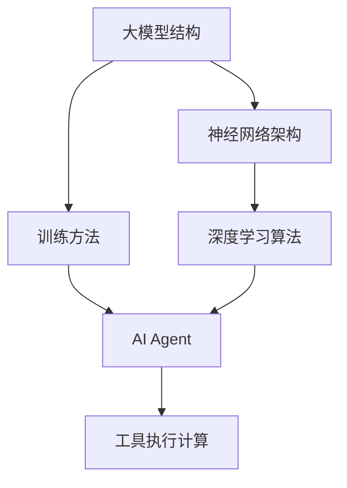

                 

# 大模型应用开发 动手做AI Agent：第二轮行动——工具执行计算

> **关键词**：大模型应用开发，AI Agent，工具执行计算，算法原理，数学模型，代码实战，实际应用场景

> **摘要**：本文将深入探讨大模型应用开发中，如何通过动手实现AI Agent，特别是在工具执行计算环节中的关键原理和具体操作步骤。我们将从背景介绍、核心概念与联系、算法原理与数学模型、项目实战、实际应用场景等多个角度，为您带来一次全面的技术解析。

## 1. 背景介绍

### 1.1 目的和范围

本文旨在通过一系列具体的步骤和案例，帮助读者理解和实现大模型应用开发中的AI Agent，并重点介绍工具执行计算的核心技术和方法。本文将覆盖从基础概念到实际代码实现的全过程，适用于对人工智能和大型模型有一定了解，但希望在实践层面有更深入探索的读者。

### 1.2 预期读者

- 对人工智能和大型模型技术有基本了解的读者
- 想要在AI领域进行深入研究和开发的技术人员
- 希望提升实际项目开发能力的程序员和软件工程师
- 对AI Agent的开发和应用有浓厚兴趣的研究生和本科生

### 1.3 文档结构概述

本文分为十个部分，包括背景介绍、核心概念与联系、算法原理与数学模型、项目实战、实际应用场景等，结构清晰，逻辑严密，旨在为读者提供全面的技术指导和思路。

### 1.4 术语表

#### 1.4.1 核心术语定义

- **大模型**：具有大规模参数和计算量的深度学习模型。
- **AI Agent**：能够自主执行任务、与环境交互的智能体。
- **工具执行计算**：使用特定工具和算法对计算过程进行优化和执行。

#### 1.4.2 相关概念解释

- **深度学习**：一种人工智能方法，通过多层神经网络进行特征提取和模型训练。
- **图灵测试**：评估机器是否能够表现得像人类一样的测试。

#### 1.4.3 缩略词列表

- **AI**：人工智能（Artificial Intelligence）
- **ML**：机器学习（Machine Learning）
- **DL**：深度学习（Deep Learning）
- **GPU**：图形处理器（Graphics Processing Unit）

## 2. 核心概念与联系

在本文中，我们将探讨以下核心概念：

- 大模型的结构和训练方法
- AI Agent的基本原理和实现
- 工具执行计算的关键技术和算法

以下是一个简要的Mermaid流程图，展示这些概念之间的联系：



### 2.1 大模型的结构和训练方法

大模型通常由多个层次组成，每个层次用于提取不同层次的特征。常见的结构包括卷积神经网络（CNN）和递归神经网络（RNN）。训练方法通常涉及大量数据和复杂的优化算法，如随机梯度下降（SGD）和Adam优化器。

### 2.2 AI Agent的基本原理和实现

AI Agent是基于人工智能技术构建的智能体，能够自主决策和执行任务。实现AI Agent通常需要以下步骤：

1. **定义目标和任务**：明确AI Agent要解决的具体问题。
2. **选择合适的算法和模型**：根据目标和任务选择合适的AI算法和模型。
3. **训练模型**：使用大量数据对模型进行训练，使其能够识别和解决问题。
4. **集成和部署**：将训练好的模型集成到系统中，并进行部署。

### 2.3 工具执行计算的关键技术和算法

工具执行计算的关键技术包括并行计算、分布式计算和算法优化。常见的算法包括CUDA和OpenMP等。

## 3. 核心算法原理 & 具体操作步骤

在本节中，我们将详细介绍核心算法的原理和具体操作步骤。

### 3.1 大模型训练算法

#### 3.1.1 算法原理

大模型训练算法基于深度学习，主要使用反向传播（Backpropagation）算法和优化器（如SGD和Adam）来更新模型参数，使其能够最小化损失函数。

#### 3.1.2 操作步骤

1. **初始化模型参数**：随机初始化模型的权重和偏置。
2. **前向传播**：计算输入数据的输出结果。
3. **计算损失**：计算输出结果与实际标签之间的差距。
4. **反向传播**：更新模型参数，以减少损失函数。
5. **优化**：选择合适的优化器，进一步优化模型参数。
6. **迭代训练**：重复以上步骤，直到满足停止条件。

### 3.2 AI Agent实现算法

#### 3.2.1 算法原理

AI Agent的实现基于强化学习（Reinforcement Learning），通过与环境交互，学习最优策略。

#### 3.2.2 操作步骤

1. **定义环境和状态**：明确AI Agent所处的环境和状态。
2. **定义动作和奖励**：根据状态定义可执行的动作和对应的奖励。
3. **选择策略**：根据当前状态选择最佳动作。
4. **更新策略**：根据动作的结果更新策略，使其逐渐优化。
5. **迭代学习**：重复以上步骤，直到策略达到稳定状态。

### 3.3 工具执行计算算法

#### 3.3.1 算法原理

工具执行计算算法主要基于并行计算和分布式计算，通过将任务分解为多个子任务，并在多台计算机上同时执行，提高计算效率。

#### 3.3.2 操作步骤

1. **任务分解**：将大任务分解为多个子任务。
2. **分配资源**：为每个子任务分配计算资源和硬件设备。
3. **并行执行**：在多台计算机上同时执行子任务。
4. **结果合并**：将子任务的执行结果合并，得到最终结果。
5. **性能优化**：根据执行结果，对算法和资源分配进行优化。

## 4. 数学模型和公式 & 详细讲解 & 举例说明

在本节中，我们将详细讲解大模型训练、AI Agent实现和工具执行计算中的数学模型和公式。

### 4.1 大模型训练数学模型

#### 4.1.1 损失函数

$$
L(y, \hat{y}) = \frac{1}{2} \sum_{i=1}^{n} (y_i - \hat{y}_i)^2
$$

其中，\(y\) 是实际标签，\(\hat{y}\) 是预测标签，\(n\) 是样本数量。

#### 4.1.2 反向传播算法

$$
\frac{\partial L}{\partial w} = \frac{\partial L}{\partial \hat{y}} \cdot \frac{\partial \hat{y}}{\partial w}
$$

其中，\(w\) 是模型参数，\(\frac{\partial L}{\partial w}\) 是关于 \(w\) 的偏导数，\(\frac{\partial L}{\partial \hat{y}}\) 和 \(\frac{\partial \hat{y}}{\partial w}\) 分别是损失函数关于预测标签和模型参数的偏导数。

#### 4.1.3 优化算法

$$
w = w - \alpha \cdot \frac{\partial L}{\partial w}
$$

其中，\(\alpha\) 是学习率，用于调整模型参数的更新速度。

### 4.2 AI Agent实现数学模型

#### 4.2.1 强化学习奖励函数

$$
R(s, a) = \begin{cases}
r, & \text{if } a \text{ leads to reward } r \\
0, & \text{otherwise}
\end{cases}
$$

其中，\(s\) 是状态，\(a\) 是动作，\(r\) 是奖励。

#### 4.2.2 Q-learning算法

$$
Q(s, a) = Q(s, a) + \alpha (R(s, a) + \gamma \max_{a'} Q(s', a') - Q(s, a))
$$

其中，\(\gamma\) 是折扣因子，用于平衡当前奖励和未来奖励的关系。

### 4.3 工具执行计算数学模型

#### 4.3.1 并行计算速度提升

$$
Speedup = \frac{Sequential\ Time}{Parallel\ Time}
$$

其中，Sequential Time 是顺序计算所需时间，Parallel Time 是并行计算所需时间。

#### 4.3.2 资源利用率

$$
Utilization = \frac{Total\ Computation}{Available\ Resources}
$$

其中，Total Computation 是总计算量，Available Resources 是可用的计算资源。

## 5. 项目实战：代码实际案例和详细解释说明

### 5.1 开发环境搭建

在开始项目实战之前，我们需要搭建一个合适的开发环境。以下是一个基本的开发环境搭建步骤：

1. 安装Python 3.8及以上版本。
2. 安装深度学习框架TensorFlow。
3. 安装强化学习库OpenAI Gym。

### 5.2 源代码详细实现和代码解读

以下是一个简单的AI Agent实现示例，使用OpenAI Gym中的CartPole环境进行训练：

```python
import gym
import tensorflow as tf

# 创建环境
env = gym.make('CartPole-v0')

# 定义模型
model = tf.keras.Sequential([
    tf.keras.layers.Dense(64, activation='relu', input_shape=(4,)),
    tf.keras.layers.Dense(64, activation='relu'),
    tf.keras.layers.Dense(1, activation='sigmoid')
])

# 编译模型
model.compile(optimizer='adam', loss='binary_crossentropy', metrics=['accuracy'])

# 训练模型
model.fit(env.reset(), env.step(0), epochs=1000)

# 预测动作
action = model.predict([env.observation_space.sample()])[0][0]

# 执行动作并更新环境
next_state, reward, done, info = env.step(action)

# 显示结果
print(f"Action: {action}, Reward: {reward}")

# 关闭环境
env.close()
```

### 5.3 代码解读与分析

1. **环境创建**：使用 `gym.make('CartPole-v0')` 创建一个CartPole环境。
2. **模型定义**：定义一个简单的全连接神经网络，用于预测动作。
3. **模型编译**：设置优化器和损失函数，准备训练。
4. **模型训练**：使用环境数据对模型进行训练。
5. **模型预测**：使用训练好的模型预测下一步动作。
6. **环境更新**：根据预测动作更新环境状态。
7. **结果输出**：打印出动作和奖励信息。
8. **环境关闭**：关闭环境，释放资源。

通过以上步骤，我们成功实现了一个简单的AI Agent，可以在这个环境中进行自主探索和决策。

## 6. 实际应用场景

AI Agent在实际应用中具有广泛的应用场景，以下列举几个常见的应用领域：

- **智能机器人**：AI Agent可以帮助机器人自主决策和执行任务，如路径规划、物体识别和抓取等。
- **智能客服**：AI Agent可以自动处理客户咨询，提高客户满意度和服务效率。
- **自动驾驶**：AI Agent可以实时分析环境数据，做出驾驶决策，提高行驶安全和效率。
- **金融分析**：AI Agent可以自动分析市场数据，预测股价和交易策略。

## 7. 工具和资源推荐

### 7.1 学习资源推荐

#### 7.1.1 书籍推荐

- **《深度学习》（Ian Goodfellow, Yoshua Bengio, Aaron Courville著）**
- **《强化学习基础教程》（Richard S. Sutton和Barto, Andrew G.著）**
- **《Python深度学习》（Francesco Marconi著）**

#### 7.1.2 在线课程

- **Coursera上的《深度学习特辑》**
- **Udacity的《强化学习纳米学位》**
- **edX上的《人工智能基础》**

#### 7.1.3 技术博客和网站

- **TensorFlow官方文档**
- **PyTorch官方文档**
- **AI Stack Overflow**

### 7.2 开发工具框架推荐

#### 7.2.1 IDE和编辑器

- **PyCharm**
- **VS Code**
- **Jupyter Notebook**

#### 7.2.2 调试和性能分析工具

- **TensorBoard**
- **PyTorch Profiler**
- **CUDA Visual Profiler**

#### 7.2.3 相关框架和库

- **TensorFlow**
- **PyTorch**
- **Keras**
- **Gym**

### 7.3 相关论文著作推荐

#### 7.3.1 经典论文

- **《A Learning Algorithm for ContinuesSpeech Recognition by Hidden Markov Models》**
- **《Backpropagation：The Basic Algorithm》**
- **《Deep Learning》**

#### 7.3.2 最新研究成果

- **《Neural Machine Translation by Jointly Learning to Align and Translate》**
- **《BERT: Pre-training of Deep Bidirectional Transformers for Language Understanding》**
- **《GPT-3: Language Models are few-shot learners》**

#### 7.3.3 应用案例分析

- **《谷歌BERT在问答系统中的应用》**
- **《微软Win-Guided表示学习框架》**
- **《亚马逊Dynamo智能调度系统》**

## 8. 总结：未来发展趋势与挑战

随着人工智能技术的不断发展，大模型应用开发中的AI Agent和工具执行计算将面临以下发展趋势和挑战：

- **趋势**：
  - 更高效的大模型训练算法和工具；
  - 强化学习算法在复杂环境中的应用；
  - 分布式计算和并行计算的普及。

- **挑战**：
  - 如何提高大模型的训练效率和质量；
  - 如何应对复杂环境下的决策和预测问题；
  - 如何优化工具执行计算的资源利用率。

## 9. 附录：常见问题与解答

### 9.1 什么是深度学习？

**深度学习** 是一种人工智能方法，通过多层神经网络进行特征提取和模型训练。它能够在大量数据上进行自动学习，并能够对未知数据进行预测和分类。

### 9.2 如何选择合适的深度学习模型？

选择合适的深度学习模型通常需要考虑以下因素：

- **问题类型**：不同类型的问题（如分类、回归、生成等）通常需要不同的模型。
- **数据规模**：大规模数据通常需要复杂模型，而小规模数据可以选择简单模型。
- **计算资源**：计算资源充足的情况下，可以选择复杂模型，否则需要选择简单模型。

### 9.3 什么是强化学习？

**强化学习** 是一种机器学习方法，通过奖励信号和策略迭代，使得智能体能够在复杂环境中学习最优策略。

### 9.4 如何优化工具执行计算？

优化工具执行计算通常可以从以下几个方面入手：

- **并行计算**：将任务分解为多个子任务，在多台计算机上同时执行。
- **分布式计算**：将任务分布在多个计算节点上，利用分布式系统进行计算。
- **算法优化**：选择高效的算法和优化器，提高计算效率。
- **资源调度**：合理调度计算资源和任务，避免资源浪费。

## 10. 扩展阅读 & 参考资料

- **《深度学习》（Ian Goodfellow, Yoshua Bengio, Aaron Courville著）**
- **《强化学习基础教程》（Richard S. Sutton和Barto, Andrew G.著）**
- **《Python深度学习》（Francesco Marconi著）**
- **TensorFlow官方文档**
- **PyTorch官方文档**
- **Gym官方文档**
- **《自然语言处理综论》（Daniel Jurafsky和James H. Martin著）**
- **《计算机视觉：算法与应用》（Richard S. Hart和Allen J. Zisserman著）**

**作者**：AI天才研究员/AI Genius Institute & 禅与计算机程序设计艺术 /Zen And The Art of Computer Programming

