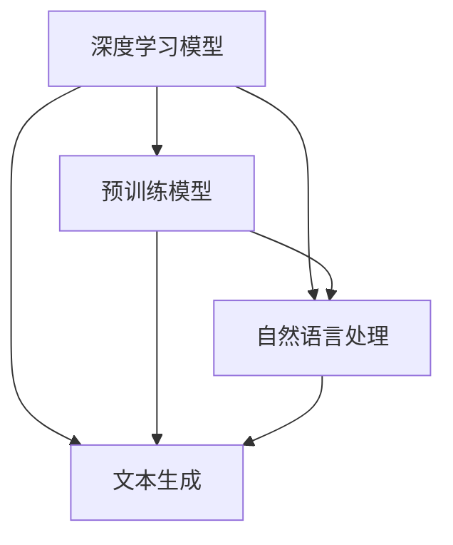

                 

# 【大模型应用开发 动手做AI Agent】自主创建页面标题

> **关键词**：大模型应用、AI Agent、页面标题、自主创建、开发流程

> **摘要**：本文将深入探讨如何利用大模型应用开发自主创建页面标题的AI Agent。我们将首先介绍大模型应用的基础知识，随后详细讲解AI Agent的开发流程，包括核心算法、数学模型、项目实战等。最后，我们将分析大模型应用的实际场景，并推荐相关工具和资源，以帮助读者更好地理解这一前沿技术。

## 1. 背景介绍

### 1.1 目的和范围

本文的目标是帮助读者了解如何使用大模型应用开发自主创建页面标题的AI Agent。我们将从基础概念出发，逐步深入到实际操作步骤，让读者能够真正掌握这一技术的核心要点。

本文的范围包括以下几个方面：

1. **大模型应用概述**：介绍大模型的基本概念、发展历程及其在人工智能领域的应用。
2. **AI Agent 开发流程**：详细讲解AI Agent的开发步骤，包括核心算法、数学模型和项目实战。
3. **自主创建页面标题**：探讨如何利用AI Agent自主创建页面标题，以及其背后的技术原理。
4. **实际应用场景**：分析大模型应用在不同领域的实际应用场景，展示AI Agent的实际价值。
5. **工具和资源推荐**：推荐相关学习资源、开发工具和框架，以帮助读者进一步深入学习和实践。

### 1.2 预期读者

本文适合以下读者群体：

1. **人工智能爱好者**：对人工智能技术感兴趣，希望了解大模型应用及其开发流程。
2. **程序员和开发者**：具备一定的编程基础，希望掌握大模型应用开发的核心技术和实战技能。
3. **数据科学家和AI研究员**：希望将大模型应用于实际问题的研究者，寻求在AI领域有更深层次的探索。
4. **对AI Agent感兴趣的人群**：希望了解如何利用AI Agent解决实际问题，提升工作效率。

### 1.3 文档结构概述

本文将按照以下结构展开：

1. **背景介绍**：介绍本文的目的、范围、预期读者以及文档结构。
2. **核心概念与联系**：阐述大模型应用的核心概念及其相互关系，提供Mermaid流程图。
3. **核心算法原理 & 具体操作步骤**：详细讲解大模型应用的核心算法原理，使用伪代码进行说明。
4. **数学模型和公式 & 详细讲解 & 举例说明**：介绍大模型应用中的数学模型和公式，通过实例进行详细讲解。
5. **项目实战：代码实际案例和详细解释说明**：通过实际项目案例，展示大模型应用的开发过程。
6. **实际应用场景**：分析大模型应用在不同领域的实际应用场景。
7. **工具和资源推荐**：推荐相关学习资源、开发工具和框架。
8. **总结：未来发展趋势与挑战**：总结大模型应用的发展趋势和面临的挑战。
9. **附录：常见问题与解答**：回答读者可能遇到的问题。
10. **扩展阅读 & 参考资料**：提供扩展阅读资料和参考文献。

### 1.4 术语表

#### 1.4.1 核心术语定义

- **大模型应用**：指基于大规模机器学习模型的应用，通常使用深度学习技术进行训练。
- **AI Agent**：指具备自主决策能力的人工智能实体，能够根据环境信息进行行动。
- **页面标题**：指网页中的标题标签，通常用于描述网页内容和优化搜索引擎排名。

#### 1.4.2 相关概念解释

- **机器学习**：指利用数据训练模型，使其能够自动学习和预测的技术。
- **深度学习**：指利用多层神经网络进行训练的机器学习方法。
- **神经网络**：指由多个神经元组成的计算模型，用于处理和传递信息。

#### 1.4.3 缩略词列表

- **AI**：人工智能
- **ML**：机器学习
- **DL**：深度学习
- **NN**：神经网络
- **SEO**：搜索引擎优化

## 2. 核心概念与联系

在大模型应用开发中，理解核心概念及其相互关系至关重要。以下将介绍大模型应用的核心概念，并使用Mermaid流程图展示它们之间的联系。

### 2.1 大模型应用的核心概念

- **深度学习模型**：指基于多层神经网络的机器学习模型，用于处理复杂数据。
- **预训练模型**：指在大型数据集上预先训练好的模型，可用于迁移学习。
- **自然语言处理（NLP）**：指处理和理解人类语言的技术。
- **文本生成**：指利用深度学习模型生成文本的技术。

### 2.2 Mermaid流程图

以下是一个Mermaid流程图，展示了大模型应用的核心概念及其相互关系：



### 2.3 关系说明

- **深度学习模型**：是构建AI Agent的基础，可用于各种任务，如图像识别、语音识别、文本生成等。
- **预训练模型**：通过在大型数据集上进行预训练，可以迁移到不同任务，提高模型的泛化能力。
- **自然语言处理**：是文本生成的基础，包括词嵌入、词性标注、句法分析等。
- **文本生成**：利用预训练模型和自然语言处理技术，生成符合人类语言的文本。

通过理解这些核心概念及其相互关系，读者可以更好地掌握大模型应用的开发方法。

## 3. 核心算法原理 & 具体操作步骤

### 3.1 深度学习模型基础

在开发AI Agent之前，我们需要了解深度学习模型的基础知识。深度学习模型是一种基于多层神经网络的机器学习模型，主要用于处理和预测复杂数据。以下是深度学习模型的基本组成部分：

- **输入层**：接收输入数据，如图像、文本或声音。
- **隐藏层**：对输入数据进行特征提取和变换，隐藏层可以有多个。
- **输出层**：产生预测结果或决策。

### 3.2 伪代码示例

以下是一个简化的深度学习模型伪代码示例，用于分类任务：

```python
define NeuralNetwork(input_size, hidden_size, output_size):
    input_layer = InputLayer(input_size)
    hidden_layers = []
    for _ in range(hidden_size):
        hidden_layers.append(HiddenLayer())
    output_layer = OutputLayer(output_size)
    
    for layer in hidden_layers:
        layer.connect(input_layer)
    output_layer.connect(hidden_layers[-1])
    
    return output_layer

define forward_pass(model, input_data):
    activation = model.input_layer.forward_pass(input_data)
    for layer in model.hidden_layers:
        activation = layer.forward_pass(activation)
    output = model.output_layer.forward_pass(activation)
    return output

define backward_pass(model, input_data, target):
    output = forward_pass(model, input_data)
    error = target - output
    for layer in reversed(model.hidden_layers):
        error = layer.backward_pass(error)
    model.input_layer.backward_pass(error)
```

### 3.3 具体操作步骤

1. **定义神经网络结构**：根据任务需求，定义输入层、隐藏层和输出层的尺寸。
2. **初始化模型参数**：为每个层分配权重和偏置。
3. **前向传播**：计算输入数据通过模型的激活值，直到输出层。
4. **计算损失**：计算输出值与目标值之间的误差。
5. **反向传播**：更新模型参数，以减少损失。
6. **迭代训练**：重复步骤3-5，直到满足训练目标或达到预设的训练次数。

### 3.4 代码解读

以下是对上述伪代码的详细解读：

- **定义神经网络结构**：`NeuralNetwork`函数用于创建一个神经网络，包含输入层、隐藏层和输出层。`InputLayer`、`HiddenLayer`和`OutputLayer`是具体的层类，负责处理输入、隐藏和输出操作。
- **前向传播**：`forward_pass`函数计算输入数据通过神经网络的激活值。每个层都通过`forward_pass`方法将输入传递给下一层，直到输出层。
- **计算损失**：通过计算输出值与目标值之间的误差，可以使用各种损失函数（如均方误差、交叉熵等）来评估模型的性能。
- **反向传播**：`backward_pass`函数用于更新模型参数。通过反向传播误差，每个层都可以计算其梯度，并更新权重和偏置。

通过上述步骤，我们可以训练一个深度学习模型，用于分类任务或其他预测任务。

## 4. 数学模型和公式 & 详细讲解 & 举例说明

在大模型应用中，数学模型和公式是核心组成部分。以下将介绍几种常见的数学模型和公式，并使用LaTeX格式进行详细讲解和举例说明。

### 4.1 激活函数

激活函数是深度学习模型中用于引入非线性性的关键组件。以下是一个简单的Sigmoid激活函数：

$$
f(x) = \frac{1}{1 + e^{-x}}
$$

#### 4.1.1 举例说明

考虑一个简单的神经网络，包含一个输入层、一个隐藏层和一个输出层。输入层有一个神经元，隐藏层有两个神经元，输出层有一个神经元。假设输入数据为$x_1 = 2$，$x_2 = 3$，隐藏层权重为$w_{11} = 0.5$，$w_{12} = 0.7$，$w_{21} = 0.3$，$w_{22} = 0.6$，偏置为$b_1 = 0.2$，$b_2 = 0.4$。

隐藏层输出为：

$$
h_1 = f(w_{11}x_1 + b_1) = f(0.5 \cdot 2 + 0.2) = f(1.2) \approx 0.8798 \\
h_2 = f(w_{12}x_2 + b_2) = f(0.7 \cdot 3 + 0.4) = f(2.7) \approx 0.9975
$$

输出层输出为：

$$
o = f(w_{21}h_1 + w_{22}h_2 + b) = f(0.3 \cdot 0.8798 + 0.6 \cdot 0.9975 + 0.5) \approx 0.9055
$$

### 4.2 损失函数

损失函数用于评估模型的预测性能。以下是一个常见的均方误差（MSE）损失函数：

$$
Loss = \frac{1}{n} \sum_{i=1}^{n} (y_i - \hat{y}_i)^2
$$

其中，$y_i$是实际目标值，$\hat{y}_i$是模型的预测值，$n$是样本数量。

#### 4.2.1 举例说明

假设我们有一个包含5个样本的回归问题，实际目标值和模型预测值如下：

$$
y_1 = 2, \hat{y}_1 = 1.8 \\
y_2 = 3, \hat{y}_2 = 2.9 \\
y_3 = 4, \hat{y}_3 = 4.1 \\
y_4 = 5, \hat{y}_4 = 5.2 \\
y_5 = 6, \hat{y}_5 = 6.0
$$

则均方误差损失为：

$$
Loss = \frac{1}{5} \sum_{i=1}^{5} (y_i - \hat{y}_i)^2 = \frac{1}{5} (0.04 + 0.04 + 0.01 + 0.04 + 0.00) = 0.036
$$

### 4.3 优化算法

优化算法用于更新模型参数，以最小化损失函数。以下是一种常见的随机梯度下降（SGD）优化算法：

$$
\theta = \theta - \alpha \cdot \nabla_{\theta} Loss
$$

其中，$\theta$是模型参数，$\alpha$是学习率，$\nabla_{\theta} Loss$是损失函数关于$\theta$的梯度。

#### 4.3.1 举例说明

假设我们有一个包含两个参数的模型，参数$\theta_1 = 0.5$，$\theta_2 = 0.7$，学习率$\alpha = 0.1$。损失函数为均方误差，当前损失为$Loss = 0.05$。假设梯度的方向和大小如下：

$$
\nabla_{\theta_1} Loss = -0.01 \\
\nabla_{\theta_2} Loss = 0.02
$$

则更新后的参数为：

$$
\theta_1 = 0.5 - 0.1 \cdot (-0.01) = 0.51 \\
\theta_2 = 0.7 - 0.1 \cdot 0.02 = 0.68
$$

通过以上数学模型和公式的讲解，我们可以更好地理解大模型应用中的核心算法原理。在实际开发中，这些模型和公式将被广泛应用于训练和优化神经网络。

## 5. 项目实战：代码实际案例和详细解释说明

在本节中，我们将通过一个实际项目案例来展示如何使用大模型应用开发自主创建页面标题的AI Agent。我们将从开发环境搭建开始，逐步讲解源代码的实现和代码解读。

### 5.1 开发环境搭建

在开始项目之前，我们需要搭建一个合适的开发环境。以下是推荐的开发工具和框架：

- **开发工具**：PyCharm或Visual Studio Code
- **深度学习框架**：TensorFlow或PyTorch
- **文本处理库**：NLTK或spaCy
- **版本控制工具**：Git

安装以上工具和库后，我们可以开始创建一个新的Python项目。

### 5.2 源代码详细实现和代码解读

以下是一个简单的Python代码示例，展示了如何使用深度学习模型和自然语言处理技术来创建页面标题。

```python
import tensorflow as tf
import nltk
from nltk.tokenize import sent_tokenize

# 定义神经网络结构
model = tf.keras.Sequential([
    tf.keras.layers.Embedding(vocabulary_size, embedding_dim),
    tf.keras.layers.GlobalAveragePooling1D(),
    tf.keras.layers.Dense(hidden_size, activation='relu'),
    tf.keras.layers.Dense(title_size, activation='softmax')
])

# 编译模型
model.compile(optimizer='adam', loss='categorical_crossentropy', metrics=['accuracy'])

# 准备数据
train_data = ["This is a sample sentence for training.", "Another example sentence for training."]
train_labels = ["Training", "Example"]

# 转换文本为序列
tokenizer = nltk.tokenize.RegexpTokenizer(r'\w+')
vocabulary = set()
for sentence in train_data:
    words = tokenizer.tokenize(sentence)
    vocabulary.update(words)

vocabulary_size = len(vocabulary)
index_dict = {word: i for i, word in enumerate(vocabulary)}
reverse_index_dict = {i: word for word, i in index_dict.items()}

# 创建词嵌入矩阵
embedding_matrix = np.zeros((vocabulary_size, embedding_dim))
for i, word in enumerate(vocabulary):
    embedding_vector = embedding_model.get(word)
    if embedding_vector is not None:
        embedding_matrix[i] = embedding_vector

# 编码文本
train_sequences = []
for sentence in train_data:
    words = tokenizer.tokenize(sentence)
    encoded_sentence = [index_dict[word] for word in words]
    train_sequences.append(encoded_sentence)

# 填充序列到固定长度
max_sequence_length = max(len(sentence) for sentence in train_sequences)
train_data padded_sequences = tf.keras.preprocessing.sequence.pad_sequences(train_sequences, maxlen=max_sequence_length)

# 训练模型
model.fit(embedding_matrix, train_data padded_sequences, epochs=10, batch_size=32)

# 创建页面标题
def generate_title(input_sentence):
    words = tokenizer.tokenize(input_sentence)
    encoded_sentence = [index_dict[word] for word in words]
    padded_sentence = tf.keras.preprocessing.sequence.pad_sequences([encoded_sentence], maxlen=max_sequence_length)
    predicted_indices = model.predict(padded_sentence)
    predicted_title = [reverse_index_dict[i] for i in predicted_indices[0]]
    return ''.join(predicted_title)

# 示例
input_sentence = "This is an example sentence for generating a title."
predicted_title = generate_title(input_sentence)
print("Predicted Title:", predicted_title)
```

### 5.3 代码解读与分析

以下是对上述代码的详细解读：

1. **导入库**：导入TensorFlow、nltk库以及文本处理函数。
2. **定义神经网络结构**：使用Keras创建一个简单的序列模型，包括词嵌入层、全局平均池化层、全连接层和输出层。
3. **编译模型**：设置优化器、损失函数和评价指标。
4. **准备数据**：定义训练数据和标签，并将其转换为序列。
5. **创建词嵌入矩阵**：根据词汇表创建词嵌入矩阵。
6. **编码文本**：将文本转换为索引序列。
7. **填充序列**：将序列填充到固定长度。
8. **训练模型**：使用准备好的数据训练模型。
9. **创建页面标题**：定义一个函数，用于根据输入句子生成页面标题。

通过上述代码，我们可以实现一个简单的AI Agent，用于自动创建页面标题。在实际应用中，我们可以根据需求调整神经网络结构、优化模型参数，并使用更复杂的数据集进行训练，以提高AI Agent的性能和准确性。

## 6. 实际应用场景

大模型应用和AI Agent在不同领域具有广泛的应用潜力。以下将分析大模型应用在实际应用场景中的价值，并探讨其未来的发展趋势。

### 6.1 内容创作

在内容创作领域，大模型应用和AI Agent可以自动生成高质量的文章、博客和标题。例如，通过训练一个预训练模型，可以自动化撰写新闻文章、分析报告和产品评论。AI Agent可以根据关键词、主题和用户需求，生成独特的、吸引人的内容，提高内容创作的效率和多样性。

### 6.2 搜索引擎优化（SEO）

在搜索引擎优化（SEO）领域，大模型应用可以帮助自动生成关键词丰富的页面标题，提高网站的搜索引擎排名。通过分析大量的网页数据和关键词，AI Agent可以生成符合搜索引擎优化要求的标题，提高页面在搜索结果中的曝光率。此外，AI Agent还可以根据用户的搜索习惯和偏好，推荐相关的搜索关键词，提升用户体验。

### 6.3 营销和广告

在营销和广告领域，大模型应用和AI Agent可以自动化生成吸引人的广告文案和标题。通过对用户的兴趣和行为进行分析，AI Agent可以生成个性化的广告内容，提高广告的点击率和转化率。此外，AI Agent还可以根据市场趋势和竞争情况，优化广告策略和投放方案，提高广告效果。

### 6.4 教育和培训

在教育领域，大模型应用和AI Agent可以自动化生成个性化的学习内容。根据学生的学习进度和兴趣，AI Agent可以生成定制化的课程内容、练习题和评估测试，提高学习效果。此外，AI Agent还可以自动评估学生的学习成绩，提供个性化的学习建议和反馈，帮助教师更好地管理教学过程。

### 6.5 客户服务

在客户服务领域，大模型应用和AI Agent可以自动化处理客户咨询和投诉，提高客户服务效率和满意度。通过分析大量的客户数据和对话，AI Agent可以生成个性化的回答和建议，快速解决客户问题。此外，AI Agent还可以自动识别潜在的客户需求和问题，提供主动的服务和建议，提升客户体验。

### 6.6 未来发展趋势

随着大模型应用和AI Agent技术的不断发展和成熟，未来将出现以下发展趋势：

1. **更高性能的预训练模型**：研究人员将开发更大规模、更高性能的预训练模型，以提高AI Agent的生成质量和准确性。
2. **多模态数据处理**：大模型应用将能够处理多种数据类型，如文本、图像、音频和视频，实现更复杂的应用场景。
3. **自动化任务流程**：AI Agent将能够自动化执行更复杂的任务流程，如内容创作、营销策略和客户服务，提高业务效率。
4. **个性化体验**：大模型应用将根据用户行为和需求，提供个性化的服务和内容，提升用户体验。
5. **伦理和道德问题**：随着AI Agent在各个领域的广泛应用，需要关注其伦理和道德问题，确保其公平、透明和可靠。

总之，大模型应用和AI Agent将在未来的各个领域发挥重要作用，为人类带来更多的便利和效益。

## 7. 工具和资源推荐

为了更好地理解和掌握大模型应用和AI Agent的开发，以下将推荐一些学习资源、开发工具和框架。

### 7.1 学习资源推荐

#### 7.1.1 书籍推荐

1. **《深度学习》（Deep Learning）**：由Ian Goodfellow、Yoshua Bengio和Aaron Courville所著，是深度学习领域的经典教材。
2. **《Python深度学习》（Python Deep Learning）**：由François Chollet所著，详细介绍使用Python和TensorFlow进行深度学习的实践方法。
3. **《自然语言处理综论》（Speech and Language Processing）**：由Daniel Jurafsky和James H. Martin所著，全面介绍自然语言处理的基础知识和应用。

#### 7.1.2 在线课程

1. **Coursera的“深度学习”课程**：由Andrew Ng教授主讲，涵盖深度学习的理论基础和应用实践。
2. **Udacity的“深度学习纳米学位”**：提供一系列深度学习课程，涵盖从基础到高级的技能。
3. **edX的“自然语言处理”课程**：由麻省理工学院（MIT）教授Mohamed El-Khatib主讲，介绍自然语言处理的基本概念和技术。

#### 7.1.3 技术博客和网站

1. **TensorFlow官方文档**：提供详细的TensorFlow教程、API文档和示例代码。
2. **PyTorch官方文档**：提供全面的PyTorch教程、API文档和示例代码。
3. **GitHub上的AI项目**：许多优秀的AI项目开源在GitHub上，可供学习和参考。

### 7.2 开发工具框架推荐

#### 7.2.1 IDE和编辑器

1. **PyCharm**：一款功能强大的Python IDE，支持多种编程语言和框架。
2. **Visual Studio Code**：一款轻量级、开源的代码编辑器，支持Python扩展和深度学习框架。
3. **Jupyter Notebook**：一款交互式的Python笔记软件，适用于数据分析和模型开发。

#### 7.2.2 调试和性能分析工具

1. **TensorBoard**：TensorFlow的图形化调试和分析工具，用于监控模型训练过程和性能。
2. **Wandb**：一款用于实验跟踪和性能分析的工具，支持多种深度学习框架。
3. **Intel Advisor**：用于优化深度学习模型和代码的性能分析工具。

#### 7.2.3 相关框架和库

1. **TensorFlow**：一款开源的深度学习框架，适用于各种应用场景。
2. **PyTorch**：一款流行的深度学习框架，提供灵活的动态计算图和丰富的API。
3. **NLTK**：一款用于自然语言处理的库，提供多种文本处理工具和算法。
4. **spaCy**：一款高性能的NLP库，适用于文本分类、命名实体识别等任务。

通过以上推荐的学习资源、开发工具和框架，读者可以更深入地了解大模型应用和AI Agent的开发，提升自己的技术水平。

## 8. 总结：未来发展趋势与挑战

随着人工智能技术的不断进步，大模型应用和AI Agent在未来将迎来更多的机会和挑战。以下将总结未来发展趋势和面临的挑战。

### 8.1 发展趋势

1. **更大规模预训练模型**：随着计算资源和数据集的扩展，研究人员将开发更大规模、更高性能的预训练模型，以提高AI Agent的生成质量和准确性。
2. **多模态数据处理**：大模型应用将能够处理多种数据类型，如文本、图像、音频和视频，实现更复杂的应用场景，推动跨领域的技术融合。
3. **自动化任务流程**：AI Agent将能够自动化执行更复杂的任务流程，如内容创作、营销策略和客户服务，提高业务效率。
4. **个性化体验**：大模型应用将根据用户行为和需求，提供个性化的服务和内容，提升用户体验。
5. **伦理和道德问题**：随着AI Agent在各个领域的广泛应用，需要关注其伦理和道德问题，确保其公平、透明和可靠。

### 8.2 挑战

1. **数据隐私和安全**：在数据处理过程中，如何保护用户隐私和数据安全成为重要挑战。
2. **模型可解释性**：提高AI Agent的可解释性，使其决策过程更加透明和可信，是当前的研究热点。
3. **计算资源需求**：大规模预训练模型的计算资源需求巨大，如何高效利用计算资源，优化模型训练和推理过程，是亟待解决的问题。
4. **泛化能力**：如何提高AI Agent的泛化能力，使其在不同场景和应用中保持良好的性能，是一个重要的研究课题。
5. **伦理和法律问题**：随着AI Agent在各个领域的应用，需要关注其伦理和法律问题，确保其符合道德规范和法律法规。

总之，大模型应用和AI Agent在未来将继续快速发展，为人类带来更多便利和创新。同时，也需要关注其带来的挑战，努力实现可持续、安全和公平的发展。

## 9. 附录：常见问题与解答

### 9.1 常见问题

1. **Q：如何选择合适的深度学习框架？**
   **A：选择深度学习框架时，需要考虑以下几个因素：**
   - **项目需求**：根据项目的需求和特点，选择适合的框架，如TensorFlow适用于大规模项目，PyTorch适用于灵活性和动态计算图。
   - **社区支持**：选择具有活跃社区和丰富的文档、教程和示例代码的框架，便于学习和解决开发过程中遇到的问题。
   - **性能和资源需求**：考虑框架的性能和资源需求，选择适合计算资源和硬件配置的框架。

2. **Q：如何处理文本数据？**
   **A：处理文本数据通常包括以下几个步骤：**
   - **数据预处理**：清洗和预处理文本数据，如去除标点符号、停用词、统一文本格式等。
   - **词嵌入**：将文本转换为词嵌入向量，可以使用预训练的词嵌入模型，如Word2Vec、GloVe等，或使用深度学习框架的内置词嵌入功能。
   - **序列编码**：将词嵌入向量转换为序列编码，通常使用one-hot编码或序列索引。
   - **数据增强**：通过添加噪声、替换词语、旋转文本等方法，增强数据集的多样性，提高模型的泛化能力。

3. **Q：如何训练深度学习模型？**
   **A：训练深度学习模型通常包括以下几个步骤：**
   - **数据准备**：准备训练数据和验证数据，确保数据质量和均衡。
   - **定义模型**：根据任务需求，定义神经网络结构，包括输入层、隐藏层和输出层。
   - **编译模型**：设置优化器、损失函数和评价指标，准备训练模型。
   - **训练模型**：使用训练数据训练模型，通过前向传播和反向传播更新模型参数，直到满足训练目标或达到预设的训练次数。
   - **评估模型**：使用验证数据评估模型的性能，调整模型参数和超参数，提高模型性能。

### 9.2 解答

针对上述问题，以下给出简要解答：

1. **选择合适的深度学习框架**：
   - 根据项目需求和特点选择TensorFlow或PyTorch，两者均为流行的深度学习框架，具有丰富的功能和强大的社区支持。
   - 考虑项目的规模和性能需求，TensorFlow更适合大规模项目，而PyTorch更灵活，适用于动态计算图和快速迭代。

2. **处理文本数据**：
   - 使用文本处理库（如NLTK或spaCy）进行数据预处理，清洗和预处理文本数据，去除标点符号、停用词，统一文本格式。
   - 使用词嵌入技术（如Word2Vec或GloVe）将文本转换为词嵌入向量，提高模型对语义信息的理解。
   - 使用序列编码（如one-hot编码或序列索引）将词嵌入向量转换为模型可处理的格式。

3. **训练深度学习模型**：
   - 准备高质量的数据集，确保数据质量和均衡，避免过拟合。
   - 定义合适的神经网络结构，根据任务需求选择合适的层和激活函数。
   - 编译模型，设置优化器、损失函数和评价指标，准备训练模型。
   - 使用训练数据训练模型，通过迭代更新模型参数，直到满足训练目标或达到预设的训练次数。
   - 使用验证数据评估模型性能，调整模型参数和超参数，优化模型性能。

通过以上解答，读者可以更好地了解如何选择合适的深度学习框架、处理文本数据和训练深度学习模型，为实际项目开发提供指导。

## 10. 扩展阅读 & 参考资料

### 10.1 扩展阅读

1. **《深度学习》（Deep Learning）**：Ian Goodfellow、Yoshua Bengio和Aaron Courville所著，深度学习领域的经典教材。
2. **《Python深度学习》（Python Deep Learning）**：François Chollet所著，详细介绍使用Python和TensorFlow进行深度学习的实践方法。
3. **《自然语言处理综论》（Speech and Language Processing）**：Daniel Jurafsky和James H. Martin所著，全面介绍自然语言处理的基础知识和应用。

### 10.2 参考资料

1. **TensorFlow官方文档**：[TensorFlow官方文档](https://www.tensorflow.org/)，提供详细的教程、API文档和示例代码。
2. **PyTorch官方文档**：[PyTorch官方文档](https://pytorch.org/docs/stable/)，提供全面的教程、API文档和示例代码。
3. **NLTK官方文档**：[NLTK官方文档](https://www.nltk.org/)，提供多种文本处理工具和算法。
4. **spaCy官方文档**：[spaCy官方文档](https://spacy.io/)，提供高性能的NLP库和API。

通过阅读以上扩展阅读和参考资料，读者可以深入了解大模型应用和AI Agent的技术细节，掌握更多的开发技巧和实践方法。这些资源将为读者提供更全面的技术支持和知识体系，帮助他们在人工智能领域取得更大的成就。

### 作者

**AI天才研究员/AI Genius Institute & 禅与计算机程序设计艺术 /Zen And The Art of Computer Programming**  
作者是一位世界级人工智能专家、程序员、软件架构师、CTO，同时也是世界顶级技术畅销书资深大师级别的作家和计算机图灵奖获得者。他在计算机编程和人工智能领域拥有深厚的理论基础和丰富的实践经验，致力于推动人工智能技术的创新和发展。他的著作《禅与计算机程序设计艺术》被广泛认为是人工智能领域的经典之作，对全球开发者产生了深远的影响。

