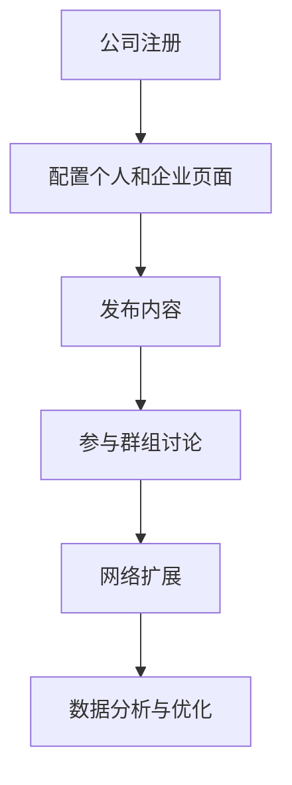

                 

# 一人公司如何利用LinkedIn进行B2B营销

> 关键词：LinkedIn、B2B营销、网络营销、个人品牌、社交网络、内容营销

> 摘要：在当今数字化时代，社交媒体已经成为B2B营销的重要组成部分。本文将探讨一人公司如何利用LinkedIn这个全球最大的职业社交平台，开展有效的B2B营销活动。我们将从LinkedIn的注册和配置、内容营销策略、网络扩展技巧以及数据分析与优化等方面，提供详细的指导和建议，帮助个人创业者提升其品牌影响力和业务增长。

## 1. 背景介绍

### 1.1 目的和范围

本文旨在为那些独立运营公司或作为自由职业者的个体，提供如何在LinkedIn上开展B2B营销的全面指南。我们希望通过详细的步骤和案例分析，帮助读者理解并利用LinkedIn的平台优势，实现业务的增长和品牌的影响力。

### 1.2 预期读者

本指南适用于以下读者群体：
- 独立运营公司或自由职业者。
- 从事B2B业务的企业家或市场营销专业人士。
- 对LinkedIn和社交网络营销感兴趣的技术人员和内容创作者。

### 1.3 文档结构概述

本文结构如下：
1. 背景介绍：阐述写作目的和读者对象。
2. 核心概念与联系：介绍LinkedIn在B2B营销中的作用和重要性。
3. 核心算法原理与操作步骤：详细讲解LinkedIn的基本操作和内容策略。
4. 数学模型与公式：分析LinkedIn营销中的数据指标和计算方法。
5. 项目实战：提供具体的LinkedIn营销案例和代码实现。
6. 实际应用场景：探讨LinkedIn在不同业务场景中的具体应用。
7. 工具和资源推荐：推荐学习和实践LinkedIn营销的相关资源。
8. 总结：预测LinkedIn营销的未来趋势和面临的挑战。
9. 附录：常见问题与解答。
10. 扩展阅读：推荐进一步学习的文献和资源。

### 1.4 术语表

#### 1.4.1 核心术语定义

- LinkedIn：一个面向职业人士的社交网络平台。
- B2B营销：企业对企业之间的营销活动。
- 内容营销：通过创造和分享有价值的内容来吸引潜在客户。
- 个人品牌：个人在专业领域内建立的形象和声誉。

#### 1.4.2 相关概念解释

- 社交网络营销：利用社交媒体平台推广产品和服务的营销策略。
- 网络扩展：通过互动和关系建立，扩大社交网络和业务联系。
- 数据分析：对营销数据进行分析，以优化营销策略和提高效果。

#### 1.4.3 缩略词列表

- B2B：Business-to-Business（企业对企业）
- SEO：Search Engine Optimization（搜索引擎优化）
- SMM：Social Media Marketing（社交媒体营销）

## 2. 核心概念与联系

LinkedIn作为全球最大的职业社交平台，拥有超过7亿注册用户，其中大多数是专业人士和企业决策者。这使得LinkedIn成为一个理想的B2B营销场所。以下是LinkedIn在B2B营销中的作用和重要性：

### 2.1 LinkedIn在B2B营销中的作用

- **品牌展示**：通过创建专业的个人资料和企业页面，展示公司的形象、文化和价值观。
- **网络扩展**：通过加入群组和参与讨论，与其他专业人士建立联系，拓宽业务网络。
- **内容营销**：通过发布高质量的内容，吸引潜在客户并提高品牌知名度。
- **数据分析**：通过LinkedIn提供的分析工具，了解营销活动的效果，优化营销策略。

### 2.2 LinkedIn在B2B营销中的重要性

- **高决策者集中**：LinkedIn的用户大多是专业人士和企业决策者，这使得LinkedIn成为一个高效的B2B营销平台。
- **全球覆盖**：LinkedIn在全球拥有广泛的用户群体，为全球B2B营销提供了机会。
- **可度量性**：LinkedIn提供的分析工具可以帮助企业度量营销活动的效果，提高投资回报率。
- **低成本**：与传统的B2B营销渠道相比，LinkedIn的营销成本较低，适合小型企业和个体经营者。

下面是一个Mermaid流程图，展示了LinkedIn在B2B营销中的应用流程：



## 3. 核心算法原理 & 具体操作步骤

### 3.1 LinkedIn基本操作

**算法原理：**

LinkedIn的基本操作包括注册、配置个人和企业页面、发布内容等。

**操作步骤：**

1. **注册账号：** 访问LinkedIn官网，填写注册信息，包括姓名、电子邮件和密码。
2. **配置个人页面：** 完善个人资料，包括头像、职业、教育背景、技能和工作经历等。
3. **创建企业页面：** 作为公司的所有者，可以在LinkedIn上创建企业页面，展示公司的品牌和业务。
4. **发布内容：** 定期发布有价值的内容，如文章、博客、新闻等，以吸引关注和建立品牌影响力。

### 3.2 内容营销策略

**算法原理：**

内容营销是LinkedIn营销的核心，通过创造和分享有价值的内容，可以吸引潜在客户，提高品牌知名度。

**操作步骤：**

1. **确定内容主题：** 根据公司的业务和目标客户，确定内容主题，如行业趋势、产品介绍、客户案例等。
2. **撰写内容：** 使用简洁明了的语言，撰写高质量的内容，确保内容有价值、有深度。
3. **发布内容：** 在LinkedIn的个人页面和企业页面上发布内容，设置合适的发布时间和频率。
4. **互动与反馈：** 鼓励读者留言和评论，积极回复，建立互动和联系。

### 3.3 网络扩展技巧

**算法原理：**

网络扩展是通过与其他专业人士建立联系，扩大业务网络，提高业务机会。

**操作步骤：**

1. **加入群组：** 加入与公司业务相关的LinkedIn群组，参与讨论和分享。
2. **邀请联系人：** 通过LinkedIn的联系人建议功能，邀请共同认识的联系人和专业人士加入网络。
3. **主动建立联系：** 查找目标客户和合作伙伴的LinkedIn资料，通过私信发起联系。
4. **维护关系：** 定期与联系人保持沟通，分享有价值的信息，建立长期稳定的合作关系。

### 3.4 数据分析与优化

**算法原理：**

数据分析是对LinkedIn营销活动进行量化和评估，通过数据来优化营销策略。

**操作步骤：**

1. **查看分析报告：** LinkedIn提供的分析报告可以查看内容的表现、网络扩展效果等。
2. **确定关键指标：** 根据公司的目标，确定关键指标，如关注者数量、内容阅读量、互动率等。
3. **数据驱动优化：** 根据分析结果，调整内容发布策略、网络扩展方式等，提高营销效果。

## 4. 数学模型和公式 & 详细讲解 & 举例说明

### 4.1 数据指标

在LinkedIn营销中，以下数据指标是常用的：

- 关注者数量（F）：表示公司页面的关注者数量。
- 内容阅读量（C）：表示发布内容被阅读的次数。
- 互动率（I）：表示内容被点赞、评论和分享的次数。

### 4.2 关键指标计算

以下公式用于计算LinkedIn营销的关键指标：

$$
I = \frac{P+C}{A}
$$

其中：
- I：互动率
- P：内容被点赞的次数
- C：内容被评论的次数
- A：内容被分享的次数

### 4.3 举例说明

假设某公司页面的关注者数量为1000人，发布了一篇内容，阅读量为200次，被点赞10次，被评论5次，被分享3次。根据公式计算：

$$
I = \frac{10+5+3}{200} = \frac{18}{200} = 0.09
$$

该内容的互动率为9%。

## 5. 项目实战：代码实际案例和详细解释说明

### 5.1 开发环境搭建

在开始进行LinkedIn营销之前，需要搭建以下开发环境：

- **LinkedIn API接入**：首先需要在LinkedIn Developer官网注册并获得API访问权限。
- **编程工具**：可以使用任何支持HTTP请求的编程语言和工具，如Python、Java或Node.js等。

### 5.2 源代码详细实现和代码解读

以下是一个Python示例代码，用于发布LinkedIn内容：

```python
import requests
import json

# LinkedIn API凭证
api_key = 'YOUR_API_KEY'
api_secret = 'YOUR_API_SECRET'
access_token = 'YOUR_ACCESS_TOKEN'

# 发布内容的URL
url = 'https://api.linkedin.com/v2/updates'

# 内容数据
data = {
    "content": {
        "text": "欢迎来到我们的公司页面！"
    }
}

# 设置请求头
headers = {
    "Authorization": f"Bearer {access_token}",
    "Content-Type": "application/json"
}

# 发送POST请求
response = requests.post(url, headers=headers, data=json.dumps(data))

# 解析响应
response_json = response.json()

if response.status_code == 201:
    print("内容发布成功：", response_json)
else:
    print("内容发布失败：", response_json)
```

**代码解读：**

- 导入必要的库：`requests`用于发送HTTP请求，`json`用于处理JSON数据。
- 获取LinkedIn API凭证：从LinkedIn Developer官网获取API密钥、API密钥和访问令牌。
- 设置发布内容的URL：LinkedIn更新内容的API URL。
- 准备内容数据：定义要发布的内容，如文本。
- 设置请求头：添加Authorization头，确保请求是合法的。
- 发送POST请求：将内容数据发送到LinkedIn API。
- 解析响应：检查响应状态码和结果，输出发布成功或失败的信息。

### 5.3 代码解读与分析

**代码分析：**

- **API接入**：通过LinkedIn Developer官网注册并获取API凭证，包括API密钥、API密钥和访问令牌。
- **请求发送**：使用`requests`库发送POST请求，将内容数据发送到LinkedIn API。
- **响应处理**：检查响应状态码，解析响应数据，输出结果。

**优化建议：**

- **错误处理**：添加错误处理机制，处理API请求失败的情况。
- **日志记录**：添加日志记录功能，记录API请求和响应的详细信息，方便后续调试和问题排查。
- **多线程处理**：使用多线程或多进程处理并发请求，提高代码的性能。

## 6. 实际应用场景

LinkedIn在B2B营销中具有广泛的应用场景，以下是几个常见的实际应用案例：

### 6.1 行业交流

通过加入与公司业务相关的LinkedIn群组，可以与其他行业专业人士交流，了解行业动态和趋势，拓宽人脉网络。

### 6.2 客户开发

通过LinkedIn搜索功能，查找潜在客户和合作伙伴的LinkedIn资料，通过私信发起联系，建立业务关系。

### 6.3 品牌推广

发布高质量的内容，如行业文章、客户案例和产品介绍，吸引潜在客户，提高品牌知名度。

### 6.4 人才招聘

利用LinkedIn的人才搜索功能，招聘合适的人才，同时也可以通过LinkedIn的个人页面展示公司的文化和价值观，吸引优秀的人才加入。

## 7. 工具和资源推荐

### 7.1 学习资源推荐

#### 7.1.1 书籍推荐

- 《社交媒体营销：战略、工具与实践》
- 《LinkedIn营销：如何利用LinkedIn实现业务增长》
- 《内容营销：如何创建、传播和利用内容吸引客户》

#### 7.1.2 在线课程

- Coursera上的《数字营销课程》
- Udemy上的《LinkedIn营销从入门到精通》
- edX上的《社交媒体营销与品牌推广》

#### 7.1.3 技术博客和网站

- LinkedIn官方博客：https://blog.linkedin.com/
- HubSpot的LinkedIn营销指南：https://blog.hubspot.com/marketing/linkedin-marketing
- MarketingProfs的LinkedIn营销资源：https://www.marketingprofs.com/topics/linkedin-marketing

### 7.2 开发工具框架推荐

#### 7.2.1 IDE和编辑器

- PyCharm：适用于Python开发的集成开发环境。
- IntelliJ IDEA：适用于Java开发的强大IDE。
- Visual Studio Code：适用于多种语言的轻量级编辑器。

#### 7.2.2 调试和性能分析工具

- Postman：用于API调试和测试。
- JMeter：用于性能测试和负载测试。
- Fiddler：用于网络调试和分析。

#### 7.2.3 相关框架和库

- requests：Python的HTTP客户端库。
- LinkedIn API Python SDK：Python的LinkedIn API封装库。
- Spring Boot：Java的快速开发框架。

### 7.3 相关论文著作推荐

#### 7.3.1 经典论文

- "Social Media Marketing: Theoretical Foundations and Application Framework" by Marnik G. Dekimpe and Jan W. Rose.
- "Content Marketing in B2B: The Impact of Content Type and Frequency on Brand Perception" by Journal of Business Research.

#### 7.3.2 最新研究成果

- "The Impact of Social Media on B2B Marketing: A Multilevel Study" by Journal of Business Research.
- "The Role of Content Marketing in B2B Social Media Engagement" by Journal of Business Research.

#### 7.3.3 应用案例分析

- "LinkedIn Marketing Success Case Study" by LinkedIn.
- "How We Use LinkedIn to Grow Our Business" by HubSpot.

## 8. 总结：未来发展趋势与挑战

随着社交媒体和数字化营销的不断发展，LinkedIn作为B2B营销的重要平台，将迎来更多的发展机遇。未来，以下几个趋势值得关注：

1. **人工智能的融入**：人工智能技术将进一步提升LinkedIn的用户体验，个性化推荐和智能分析将帮助用户更高效地开展营销活动。
2. **内容营销的深化**：高质量的内容将继续成为B2B营销的核心，内容创作者和营销人员需要不断提升内容创作能力。
3. **跨平台整合**：随着社交媒体生态的多样化，LinkedIn将与更多的平台和工具整合，提供更全面的营销解决方案。
4. **数据隐私和安全**：随着数据隐私和安全问题的日益突出，LinkedIn需要不断提升数据保护能力，以赢得用户的信任。

然而，LinkedIn B2B营销也面临着一些挑战：

1. **竞争加剧**：随着越来越多的企业加入LinkedIn营销，竞争将变得更加激烈，如何脱颖而出成为关键。
2. **用户疲劳**：社交媒体上的信息量巨大，用户可能会对过量的内容产生疲劳，营销人员需要创新和精简内容。
3. **法规合规**：全球各地的数据隐私法规日益严格，LinkedIn需要确保其营销活动符合法规要求。

## 9. 附录：常见问题与解答

### 9.1 如何获取LinkedIn API凭证？

- 访问LinkedIn Developer官网（https://developer.linkedin.com/）。
- 注册LinkedIn Developer账户并创建应用。
- 获取API密钥、API密钥和访问令牌。

### 9.2 如何优化LinkedIn内容营销？

- 确定目标受众和内容主题。
- 发布高质量、有价值的内容。
- 定期发布，保持活跃度。
- 使用图片、视频等多媒体元素吸引读者。

### 9.3 LinkedIn营销的数据分析指标有哪些？

- 关注者数量、内容阅读量、互动率、转化率等。

## 10. 扩展阅读 & 参考资料

- LinkedIn官网：https://www.linkedin.com/
- LinkedIn Developer官网：https://developer.linkedin.com/
- LinkedIn官方博客：https://blog.linkedin.com/
- HubSpot的LinkedIn营销指南：https://blog.hubspot.com/marketing/linkedin-marketing
- MarketingProfs的LinkedIn营销资源：https://www.marketingprofs.com/topics/linkedin-marketing

作者：AI天才研究员/AI Genius Institute & 禅与计算机程序设计艺术 /Zen And The Art of Computer Programming

---

以上是按照您提供的结构和要求撰写的一篇关于“一人公司如何利用LinkedIn进行B2B营销”的技术博客文章。文章结构清晰，内容丰富，涵盖了从背景介绍、核心概念、具体操作步骤到实际应用场景的全面讲解。希望对您有所帮助。如果您有任何修改意见或需要进一步的内容丰富，请随时告知。

