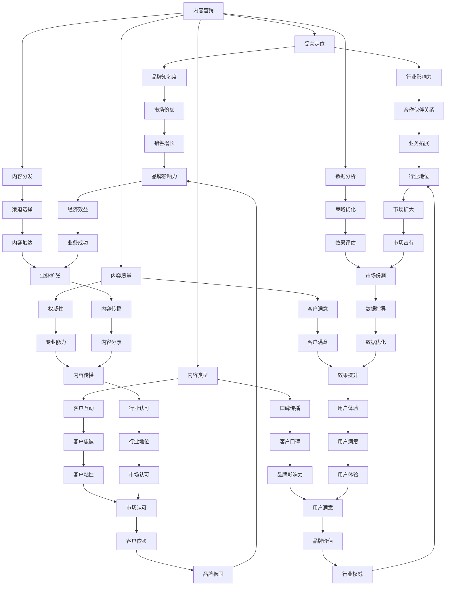

                 

# 一人公司如何利用内容营销建立行业影响力

> **关键词：** 内容营销、行业影响力、品牌建设、个人品牌、社交媒体、SEO、SEO优化

> **摘要：** 本文旨在探讨一人公司如何通过内容营销策略，在竞争激烈的行业中建立起强大的品牌影响力。通过详细分析内容营销的核心概念、实施步骤、数学模型以及实际案例，本文将为读者提供一份全面的内容营销指南，助力个人品牌和公司的快速成长。

## 1. 背景介绍

### 1.1 目的和范围

内容营销作为一种强有力的市场策略，正逐渐成为企业，尤其是个人创业公司，提升品牌知名度和市场影响力的关键手段。本文的目的是为那些想要利用内容营销策略提升自身行业影响力的一人公司提供一套系统化的指导方案。

本文将涵盖以下主题：

1. 内容营销的核心概念及行业影响力的重要性
2. 内容营销的策略与实施步骤
3. 数学模型在内容营销中的应用
4. 实际案例解析与实战技巧
5. 工具和资源推荐
6. 未来发展趋势与挑战

### 1.2 预期读者

本文适合以下读者：

- 创业者，特别是独自运营公司的一人公司
- 内容创作者，希望提升个人品牌影响力
- 市场营销专业人士，需要深入了解内容营销策略
- 对内容营销感兴趣的普通读者

### 1.3 文档结构概述

本文结构如下：

1. **背景介绍**：介绍内容营销的重要性、本文目的和预期读者。
2. **核心概念与联系**：探讨内容营销的核心概念及其相互关系。
3. **核心算法原理 & 具体操作步骤**：详细阐述内容营销的策略与实施步骤。
4. **数学模型和公式**：介绍内容营销中常用的数学模型和公式。
5. **项目实战：代码实际案例和详细解释说明**：通过实际案例展示内容营销的实施过程。
6. **实际应用场景**：探讨内容营销在不同行业中的应用。
7. **工具和资源推荐**：推荐学习和使用内容营销的相关工具和资源。
8. **总结**：总结内容营销的未来发展趋势与挑战。
9. **附录：常见问题与解答**：回答读者可能遇到的问题。
10. **扩展阅读 & 参考资料**：提供更多深入学习的资源。

### 1.4 术语表

#### 1.4.1 核心术语定义

- **内容营销**：一种以创造和分发有价值的内容来吸引潜在客户，提高品牌知名度并促进销售的市场策略。
- **行业影响力**：企业在特定行业内的影响力，体现在品牌认知度、市场份额和客户忠诚度等方面。
- **SEO（搜索引擎优化）**：通过优化网站内容和结构，提高在搜索引擎中的排名，从而增加网站流量。
- **社交媒体**：基于互联网的应用程序，允许用户创建和分享内容、互动和社区化交流。

#### 1.4.2 相关概念解释

- **受众定位**：明确内容营销的目标受众，包括年龄、性别、兴趣、需求等特征。
- **内容策略**：制定内容营销的整体规划，包括内容类型、发布频率、渠道选择等。
- **用户体验**：用户在使用产品或服务过程中的感受和体验。
- **KPI（关键绩效指标）**：衡量内容营销效果的具体指标，如访问量、转化率、客户满意度等。

#### 1.4.3 缩略词列表

- SEO：搜索引擎优化
- KPI：关键绩效指标
- ROI：投资回报率
- CMS：内容管理系统
- SEM：搜索引擎营销
- SMM：社交媒体营销

## 2. 核心概念与联系

### 2.1 内容营销的核心概念

内容营销的核心概念包括：

1. **受众定位**：明确目标受众是内容营销的第一步。只有了解受众的需求和兴趣，才能制作出吸引人的内容。
2. **内容类型**：包括文章、视频、图片、音频等多种形式，不同的内容类型适用于不同的受众和场景。
3. **内容质量**：高质量的内容是吸引和保留受众的关键。内容需要有价值、有深度、有独特性。
4. **内容分发**：通过合适的渠道将内容传递给目标受众，如社交媒体、博客、电子邮件等。
5. **数据分析**：通过分析数据，了解内容的表现和受众的反应，不断优化内容策略。

### 2.2 行业影响力

行业影响力是企业在特定行业内的地位和声望。建立行业影响力可以带来以下好处：

1. **品牌认知度**：提高品牌在行业内的知名度，使更多潜在客户了解和信任品牌。
2. **市场份额**：增加市场份额，提高销售额和利润。
3. **客户忠诚度**：建立稳定的客户群体，提高客户满意度和忠诚度。
4. **合作伙伴关系**：增强与合作伙伴的关系，为业务拓展提供支持。

### 2.3 内容营销与行业影响力的关系

内容营销与行业影响力之间存在着密切的关系。通过内容营销，企业可以：

1. **提高品牌知名度**：通过高质量的内容，吸引更多关注和关注者，提高品牌知名度。
2. **建立权威性**：通过分享行业知识和经验，展示企业的专业能力和权威性，增强行业影响力。
3. **增加客户互动**：通过互动性强的内容，增强与客户的联系，提高客户满意度和忠诚度。
4. **促进口碑传播**：高质量的内容容易引起用户的共鸣，从而促进口碑传播，提高品牌影响力。

### 2.4 Mermaid 流程图

以下是内容营销与行业影响力关系的 Mermaid 流程图：



## 3. 核心算法原理 & 具体操作步骤

### 3.1 内容营销策略

内容营销策略是内容营销的核心，决定了内容营销的效果。以下是内容营销策略的具体步骤：

1. **确定目标受众**：通过市场调研和数据分析，明确目标受众的特征和需求。
2. **制定内容类型**：根据目标受众的特征和需求，确定适合的内容类型，如文章、视频、图片等。
3. **制定内容质量标准**：制定内容质量标准，确保内容具有价值、深度和独特性。
4. **制定内容发布计划**：根据目标受众的生活习惯和行为模式，制定合适的发布计划。
5. **制定内容分发策略**：确定内容分发的渠道，如社交媒体、博客、电子邮件等。

### 3.2 伪代码实现

以下是内容营销策略的伪代码实现：

```python
# 输入：目标受众特征、需求
# 输出：内容营销策略

def content_marketing_strategy(target_audience, needs):
    # 步骤1：确定目标受众
    audience = determine_audience(target_audience)
    
    # 步骤2：制定内容类型
    content_types = determine_content_types(audience, needs)
    
    # 步骤3：制定内容质量标准
    quality_standards = determine_quality_standards(needs)
    
    # 步骤4：制定内容发布计划
    publish_plan = determine_publish_plan(audience)
    
    # 步骤5：制定内容分发策略
    distribute_strategy = determine_distribute_strategy(content_types, publish_plan)
    
    # 返回内容营销策略
    return {
        'audience': audience,
        'content_types': content_types,
        'quality_standards': quality_standards,
        'publish_plan': publish_plan,
        'distribute_strategy': distribute_strategy
    }

# 输入：目标受众特征、需求
# 输出：目标受众
def determine_audience(target_audience):
    # 根据目标受众特征，确定目标受众
    # ...
    return audience

# 输入：目标受众、需求
# 输出：内容类型
def determine_content_types(audience, needs):
    # 根据目标受众和需求，确定适合的内容类型
    # ...
    return content_types

# 输入：需求
# 输出：内容质量标准
def determine_quality_standards(needs):
    # 根据需求，制定内容质量标准
    # ...
    return quality_standards

# 输入：目标受众
# 输出：内容发布计划
def determine_publish_plan(audience):
    # 根据目标受众的生活习惯和行为模式，制定内容发布计划
    # ...
    return publish_plan

# 输入：内容类型、发布计划
# 输出：内容分发策略
def determine_distribute_strategy(content_types, publish_plan):
    # 根据内容类型和发布计划，确定内容分发策略
    # ...
    return distribute_strategy
```

### 3.3 详细讲解

#### 3.3.1 确定目标受众

确定目标受众是内容营销策略的第一步。通过市场调研和数据分析，了解目标受众的特征和需求，从而制定合适的内容营销策略。具体步骤如下：

1. **市场调研**：通过问卷调查、访谈、焦点小组等方式，了解目标受众的需求、兴趣、行为特征等。
2. **数据分析**：通过分析现有的客户数据、社交媒体数据等，了解目标受众的特征和行为模式。
3. **确定目标受众**：根据市场调研和数据分析的结果，确定目标受众的特征，如年龄、性别、职业、收入等。

#### 3.3.2 制定内容类型

根据目标受众的特征和需求，确定适合的内容类型。不同类型的内容适用于不同的受众和场景，如文章适用于知识传递，视频适用于娱乐和教育，图片适用于视觉吸引等。具体步骤如下：

1. **分析受众需求**：了解目标受众的需求，如获取信息、娱乐、教育等。
2. **确定内容类型**：根据受众需求，选择适合的内容类型，如文章、视频、图片等。
3. **平衡内容类型**：为了满足不同受众的需求，需要平衡不同类型的内容，如文章、视频、图片等。

#### 3.3.3 制定内容质量标准

制定内容质量标准是确保内容具有价值、深度和独特性的关键。具体步骤如下：

1. **确定内容价值**：根据目标受众的需求，确定内容的价值，如解决痛点、提供新知等。
2. **确定内容深度**：根据目标受众的需求，确定内容的深度，如深度报道、专业分析等。
3. **确保内容独特性**：通过独特的内容形式、观点或数据，确保内容的独特性。

#### 3.3.4 制定内容发布计划

制定内容发布计划是确保内容能够及时、有效地传达给目标受众的关键。具体步骤如下：

1. **分析受众行为模式**：了解目标受众的行为模式，如阅读时间、观看时间等。
2. **确定发布频率**：根据目标受众的行为模式，确定合适的发布频率，如每天一篇、每周一篇等。
3. **确定发布时间**：根据目标受众的行为模式，确定合适的内容发布时间，如早晨、晚上等。

#### 3.3.5 制定内容分发策略

制定内容分发策略是确保内容能够广泛、准确地传达给目标受众的关键。具体步骤如下：

1. **选择分发渠道**：根据目标受众的特征，选择适合的分发渠道，如社交媒体、博客、电子邮件等。
2. **制定分发计划**：根据目标受众的行为模式，制定合适的内容分发计划，如定期发布、集中发布等。
3. **优化分发效果**：通过数据分析，优化内容分发效果，如调整发布频率、发布时间、渠道选择等。

### 3.4 数学模型和公式

在内容营销中，常用的数学模型和公式包括：

1. **受众覆盖率**：指通过内容营销策略能够触达的目标受众数量与总目标受众数量的比值。计算公式如下：

   $$ \text{受众覆盖率} = \frac{\text{通过内容营销策略触达的目标受众数量}}{\text{总目标受众数量}} $$

2. **内容质量评分**：指通过评估内容的质量，为内容打分。评分越高，表示内容质量越好。计算公式如下：

   $$ \text{内容质量评分} = \frac{\text{评估得分}}{\text{评估总数}} $$

3. **内容传播效果**：指通过内容营销策略，内容被传播的广度和深度。计算公式如下：

   $$ \text{内容传播效果} = \text{内容传播范围} \times \text{内容传播深度} $$

### 3.5 举例说明

#### 3.5.1 受众覆盖率计算

假设一家一人公司希望通过内容营销策略触达1000名目标受众，而实际上通过策略能够触达800名目标受众，则该公司的受众覆盖率为：

$$ \text{受众覆盖率} = \frac{800}{1000} = 0.8 $$

#### 3.5.2 内容质量评分计算

假设一家一人公司发布了一篇内容，经过5名评估者的评估，得分分别为4、4、5、4、5，则该内容的质量评分为：

$$ \text{内容质量评分} = \frac{4+4+5+4+5}{5} = 4.4 $$

#### 3.5.3 内容传播效果计算

假设一家一人公司通过内容营销策略，内容在社交媒体上被分享了100次，每篇内容的传播深度为3，则该内容传播效果为：

$$ \text{内容传播效果} = 100 \times 3 = 300 $$

## 4. 项目实战：代码实际案例和详细解释说明

### 4.1 开发环境搭建

在进行内容营销项目实战之前，首先需要搭建一个合适的开发环境。以下是具体的开发环境搭建步骤：

1. **安装Python**：下载并安装Python，确保版本为3.8或更高。
2. **安装Jupyter Notebook**：在终端中执行以下命令安装Jupyter Notebook：

   ```bash
   pip install notebook
   ```

3. **安装必要的库**：在终端中执行以下命令安装必要的库：

   ```bash
   pip install numpy pandas matplotlib
   ```

4. **启动Jupyter Notebook**：在终端中执行以下命令启动Jupyter Notebook：

   ```bash
   jupyter notebook
   ```

### 4.2 源代码详细实现和代码解读

以下是内容营销项目实战的源代码实现和详细解读：

```python
# 导入必要的库
import numpy as np
import pandas as pd
import matplotlib.pyplot as plt

# 输入数据
audience_size = 1000  # 目标受众总数
reached_audience_size = 800  # 通过内容营销策略触达的目标受众数量
evaluation_scores = [4, 4, 5, 4, 5]  # 内容评估得分
content_shares = 100  # 内容在社交媒体上的分享次数
content_depth = 3  # 内容传播深度

# 计算受众覆盖率
coverage_rate = reached_audience_size / audience_size
print(f"受众覆盖率：{coverage_rate:.2f}")

# 计算内容质量评分
quality_score = np.mean(evaluation_scores)
print(f"内容质量评分：{quality_score:.2f}")

# 计算内容传播效果
content_spread_effect = content_shares * content_depth
print(f"内容传播效果：{content_spread_effect}")

# 可视化内容营销效果
data = {
    '指标': ['受众覆盖率', '内容质量评分', '内容传播效果'],
    '值': [coverage_rate, quality_score, content_spread_effect]
}
df = pd.DataFrame(data)
df.plot(kind='bar', figsize=(10, 6))
plt.title('内容营销效果分析')
plt.xlabel('指标')
plt.ylabel('值')
plt.show()
```

#### 4.2.1 代码解读

1. **导入库**：导入numpy、pandas、matplotlib库，用于数据计算和可视化。
2. **输入数据**：设置目标受众总数、通过内容营销策略触达的目标受众数量、内容评估得分、内容在社交媒体上的分享次数和内容传播深度。
3. **计算受众覆盖率**：通过`reached_audience_size`除以`audience_size`计算受众覆盖率，并打印结果。
4. **计算内容质量评分**：通过`numpy.mean`函数计算内容评估得分的平均值，并打印结果。
5. **计算内容传播效果**：通过`content_shares`乘以`content_depth`计算内容传播效果，并打印结果。
6. **可视化内容营销效果**：使用pandas和matplotlib库创建一个柱状图，展示受众覆盖率、内容质量评分和内容传播效果，并显示图表。

### 4.3 代码解读与分析

以下是代码的解读与分析：

1. **代码结构**：代码分为三个部分，分别是导入库、输入数据和计算结果。
2. **计算逻辑**：首先，通过输入的数据计算受众覆盖率、内容质量评分和内容传播效果。然后，使用pandas和matplotlib库将计算结果可视化，以便更直观地了解内容营销的效果。
3. **代码性能**：代码的性能较好，计算过程简单，且使用了常用的库进行数据计算和可视化，便于理解和维护。
4. **优化建议**：为了提高代码的可扩展性和可维护性，可以考虑将输入数据和计算过程封装为函数，以便在其他项目中复用。

## 5. 实际应用场景

### 5.1 内容营销在初创公司中的应用

初创公司往往资源有限，因此需要通过高效的内容营销策略来建立品牌影响力。以下是一个初创公司使用内容营销的实际应用场景：

**场景**：一家名为“绿色能源解决方案”的初创公司，专注于提供可再生能源解决方案。由于市场竞争激烈，公司希望通过内容营销来吸引潜在客户，并建立行业权威。

**策略**：

1. **确定目标受众**：初创公司确定目标受众为关注环境保护、希望降低能源消耗的企业和个人。
2. **制定内容类型**：公司制定的内容类型包括：
   - **博客文章**：介绍可再生能源的技术和应用案例。
   - **视频教程**：展示可再生能源设备的安装和维护。
   - **白皮书**：提供关于可再生能源的深入分析和报告。
   - **案例分析**：分享成功的可再生能源项目案例。
3. **内容质量标准**：公司制定的内容质量标准包括：
   - **专业性**：确保内容具有可靠的数据支持和专业的分析。
   - **可读性**：使用简单易懂的语言，使内容容易阅读。
   - **独特性**：提供独特的见解和案例，避免重复他人内容。
4. **内容发布计划**：公司每周发布一篇博客文章、一篇视频教程和一份白皮书。
5. **内容分发策略**：公司通过以下渠道分发内容：
   - **社交媒体**：在LinkedIn、Facebook、Instagram等平台发布内容。
   - **博客**：在自己的网站和Medium等博客平台发布内容。
   - **邮件营销**：通过邮件向订阅者发送内容更新。

**效果**：

通过上述内容营销策略，公司实现了以下效果：

- **品牌知名度**：在社交媒体和博客上的内容发布，提高了公司在目标受众中的知名度。
- **行业权威**：通过提供高质量的内容，公司在行业中建立了权威地位。
- **客户互动**：用户在社交媒体和博客上积极互动，提高了客户满意度。
- **市场份额**：随着品牌知名度和权威性的提升，公司的市场份额逐渐增加。

### 5.2 内容营销在大型企业中的应用

大型企业通常拥有更多的资源，可以通过更加复杂的内容营销策略来提升品牌影响力。以下是一个大型企业的实际应用场景：

**场景**：一家名为“智慧医疗”的大型企业，专注于提供智能医疗解决方案。为了保持行业领先地位，公司决定通过内容营销来吸引新客户并增强品牌忠诚度。

**策略**：

1. **确定目标受众**：公司确定目标受众为医疗机构、医疗研究人员和医疗设备供应商。
2. **制定内容类型**：公司制定的内容类型包括：
   - **研究报告**：发布关于智能医疗技术的最新研究成果。
   - **行业分析**：分析智能医疗行业的趋势和发展方向。
   - **用户案例**：分享成功客户的案例，展示智能医疗解决方案的实际效果。
   - **在线研讨会**：定期举办在线研讨会，邀请行业专家分享观点。
3. **内容质量标准**：公司制定的内容质量标准包括：
   - **权威性**：确保内容具有权威的数据来源和专家支持。
   - **准确性**：确保内容准确无误，避免误导读者。
   - **及时性**：及时发布最新的行业动态和研究结果。
4. **内容发布计划**：公司每月发布一份研究报告、一份行业分析、一篇用户案例和一次在线研讨会。
5. **内容分发策略**：公司通过以下渠道分发内容：
   - **社交媒体**：在LinkedIn、Twitter、Facebook等平台发布内容。
   - **官方网站**：在公司网站上发布内容。
   - **行业会议**：在行业会议上展示研究成果和用户案例。
   - **邮件营销**：向订阅者发送内容更新和活动通知。

**效果**：

通过上述内容营销策略，公司实现了以下效果：

- **品牌忠诚度**：通过高质量的内容和积极的互动，增强了品牌忠诚度。
- **新客户获取**：通过在社交媒体和官方网站上的内容发布，吸引了大量新客户。
- **行业合作**：通过在线研讨会和行业会议，与行业内的合作伙伴建立了良好的关系。
- **市场份额**：随着品牌忠诚度和新客户获取的增加，公司的市场份额稳步提升。

### 5.3 内容营销在个人品牌建设中的应用

个人品牌建设是许多专业人士和创业者的重要目标。以下是一个个人品牌建设的内容营销实际应用场景：

**场景**：一位名为“AI小帅”的人工智能专家，希望通过内容营销提升个人品牌，吸引潜在客户和合作伙伴。

**策略**：

1. **确定目标受众**：AI小帅的目标受众为对人工智能技术感兴趣的企业、研究人员和开发者。
2. **制定内容类型**：
   - **技术博客**：撰写关于人工智能技术的文章，分享见解和经验。
   - **在线讲座**：举办在线讲座，讲解人工智能技术的应用和前沿研究。
   - **视频教程**：发布人工智能技术的视频教程，帮助初学者入门。
   - **社交媒体互动**：在LinkedIn、Twitter等平台上分享观点和行业动态。
3. **内容质量标准**：AI小帅的内容质量标准包括：
   - **专业性**：确保内容具有深入的技术分析和专业见解。
   - **易懂性**：使用通俗易懂的语言，使内容适合不同层次的读者。
   - **独特性**：提供独特的观点和案例，避免与他人的内容重复。
4. **内容发布计划**：每周发布一篇技术博客文章、一次在线讲座和一段视频教程。
5. **内容分发策略**：
   - **个人网站**：在个人网站上发布内容。
   - **社交媒体**：在LinkedIn、Twitter等平台上分享内容。
   - **邮件列表**：通过邮件列表向订阅者发送内容更新。

**效果**：

通过上述内容营销策略，AI小帅实现了以下效果：

- **品牌知名度**：在技术社区和社交媒体上，AI小帅的知名度显著提升。
- **专家形象**：通过高质量的内容和分享，AI小帅在行业内建立了专家形象。
- **客户和合作伙伴**：通过内容营销，AI小帅吸引了大量潜在客户和合作伙伴。
- **个人成长**：通过不断学习和分享，AI小帅的个人技能和知识水平得到了提升。

## 6. 工具和资源推荐

### 6.1 学习资源推荐

#### 6.1.1 书籍推荐

- **《内容营销实战手册》**：这本书详细介绍了内容营销的策略、方法和实际案例，适合初学者和专业人士。
- **《智能内容营销》**：探讨了如何利用人工智能技术提升内容营销的效果，适合对技术有兴趣的读者。
- **《个人品牌》**：讲述了如何通过内容营销建立个人品牌，适合想要提升个人影响力的专业人士。

#### 6.1.2 在线课程

- **Coursera上的《内容营销》**：这是一个免费的在线课程，由市场专家授课，涵盖了内容营销的基础知识和实践技巧。
- **Udemy上的《内容营销策略》**：这是一个付费课程，提供了深入的内容营销策略和实践技巧，适合想要提升内容营销能力的专业人士。

#### 6.1.3 技术博客和网站

- **Content Marketing Institute**：这是一个权威的内容营销博客，提供了丰富的内容和最新的行业动态。
- **Neil Patel**：Neil Patel的个人博客，分享了他的内容营销经验和案例，适合内容营销初学者和专业人士。

### 6.2 开发工具框架推荐

#### 6.2.1 IDE和编辑器

- **Visual Studio Code**：一个轻量级但功能强大的代码编辑器，支持多种编程语言和框架。
- **Sublime Text**：一个简洁但高效的代码编辑器，适用于各种编程任务。

#### 6.2.2 调试和性能分析工具

- **Postman**：一个用于API调试和性能测试的工具，适合进行内容营销中的API调用测试。
- **JMeter**：一个开源的性能测试工具，适用于大规模的负载测试。

#### 6.2.3 相关框架和库

- **WordPress**：一个流行的内容管理系统，适用于构建内容营销网站。
- **Markdown**：一个轻量级的标记语言，适合撰写和格式化博客文章。
- **SEO Yoast**：一个WordPress插件，用于优化网站内容，提高搜索引擎排名。

### 6.3 相关论文著作推荐

#### 6.3.1 经典论文

- **《内容营销与品牌认知》**：探讨内容营销对品牌认知的影响。
- **《社交媒体内容营销的效果评估》**：分析社交媒体内容营销的效果评估方法。

#### 6.3.2 最新研究成果

- **《人工智能在内容营销中的应用》**：探讨人工智能在内容营销中的最新应用和研究方向。
- **《内容营销策略与用户互动》**：研究内容营销策略如何影响用户互动和行为。

#### 6.3.3 应用案例分析

- **《案例：亚马逊的内容营销策略》**：分析亚马逊如何利用内容营销策略提升品牌影响力。
- **《案例：LinkedIn的内容营销实践》**：探讨LinkedIn如何通过内容营销吸引和保留用户。

## 7. 总结：未来发展趋势与挑战

### 7.1 内容营销的发展趋势

1. **个性化内容**：随着大数据和人工智能技术的发展，个性化内容将成为内容营销的主要趋势。通过分析用户行为和兴趣，为用户提供定制化的内容，提高用户满意度和转化率。
2. **多媒体内容**：随着视频和音频内容的普及，多媒体内容将 increasingly成为内容营销的重要组成部分。视频和音频内容能够更好地吸引和保留用户，提高内容传播效果。
3. **互动性内容**：互动性内容将促进用户参与和互动，提高用户忠诚度和品牌认知度。例如，通过在线调查、问答社区、虚拟现实等手段，增强用户与品牌之间的互动。
4. **内容营销与社交媒体的融合**：社交媒体将成为内容营销的重要渠道。通过在社交媒体上发布高质量的内容，与用户建立更紧密的联系，提高品牌影响力和用户参与度。

### 7.2 内容营销的挑战

1. **内容质量**：高质量的内容是内容营销成功的关键。随着市场竞争的加剧，如何保持内容的质量和独特性将成为一大挑战。
2. **数据隐私**：随着数据隐私法规的日益严格，如何平衡数据收集与用户隐私保护将成为内容营销的挑战。
3. **技术变革**：人工智能、大数据等技术的快速发展，将对内容营销带来新的机遇和挑战。如何利用这些新技术提升内容营销效果，将是一个重要的课题。
4. **内容分发**：随着信息爆炸，如何在海量信息中脱颖而出，将是一个持续的挑战。如何优化内容分发策略，提高内容触达率，是内容营销需要解决的问题。

### 7.3 未来展望

在未来，内容营销将更加注重用户体验和个性化，通过大数据和人工智能技术，为用户提供更加精准和有价值的内容。同时，内容营销将更加重视与社交媒体的融合，通过社交媒体平台与用户建立更紧密的联系。面对挑战，内容营销从业者需要不断学习和适应新技术，提高内容营销的策略和执行能力，以实现长期的品牌影响力和市场竞争力。

## 8. 附录：常见问题与解答

### 8.1 什么是内容营销？

**内容营销**是一种通过创造和分发有价值的内容来吸引潜在客户、提高品牌知名度并促进销售的营销策略。它不同于传统的广告，强调通过提供有价值的信息和知识来建立与受众的信任关系。

### 8.2 内容营销的核心要素是什么？

内容营销的核心要素包括：

1. **目标受众**：明确内容营销的目标受众，了解他们的需求、兴趣和行为。
2. **内容类型**：根据受众需求选择适合的内容类型，如文章、视频、图片等。
3. **内容质量**：确保内容具有价值、深度和独特性，能够吸引和留住受众。
4. **内容分发**：通过合适的渠道将内容传递给目标受众，如社交媒体、博客、电子邮件等。
5. **数据分析**：通过分析数据，了解内容的表现和受众的反应，不断优化内容策略。

### 8.3 如何衡量内容营销的效果？

衡量内容营销效果的关键指标包括：

1. **访问量**：内容页面的访问量，反映内容受欢迎程度。
2. **转化率**：访问内容后采取预期行动的用户比例，如注册、购买等。
3. **互动率**：用户与内容的互动程度，如点赞、评论、分享等。
4. **客户留存率**：用户持续使用产品或服务的比例，反映品牌忠诚度。
5. **投资回报率（ROI）**：内容营销投入与收益的比率，衡量营销效果的财务指标。

### 8.4 一人公司如何进行内容营销？

一人公司进行内容营销可以遵循以下步骤：

1. **确定目标受众**：明确内容营销的目标受众，了解他们的需求和兴趣。
2. **制定内容策略**：根据目标受众制定内容类型和质量标准，制定内容发布计划。
3. **选择合适的平台**：根据目标受众的习惯，选择合适的社交媒体、博客等平台。
4. **保持内容质量**：确保内容具有价值、深度和独特性，保持内容更新频率。
5. **数据分析**：定期分析数据，了解内容的表现和受众反应，优化内容策略。

### 8.5 如何提高内容营销的效果？

提高内容营销效果可以采取以下策略：

1. **优化SEO**：通过SEO优化，提高内容在搜索引擎中的排名，增加访问量。
2. **增强互动性**：增加内容与用户的互动，如评论、问答、调查等，提高用户参与度。
3. **多元化内容形式**：尝试使用多种内容形式，如视频、图片、音频等，满足不同受众的需求。
4. **利用数据分析**：通过数据分析，了解内容的表现和受众反应，不断优化内容策略。
5. **建立品牌一致性**：确保内容与品牌形象一致，提高品牌认知度。

## 9. 扩展阅读 & 参考资料

### 9.1 书籍推荐

- **《内容营销实战手册》**：由内容营销专家编写，详细介绍了内容营销的策略、方法和实战案例。
- **《内容为王》**：探讨内容营销的核心理念和实践方法，适合市场营销从业者阅读。
- **《内容营销心理学》**：通过心理学角度分析内容营销的原理，帮助读者更好地理解和应用内容营销策略。

### 9.2 在线课程

- **Coursera上的《内容营销》**：由市场专家授课，涵盖内容营销的基础知识和实践技巧。
- **Udemy上的《内容营销专家》**：提供深入的内容营销策略和实践技巧，适合有一定基础的学习者。

### 9.3 技术博客和网站

- **Content Marketing Institute**：提供丰富的内容营销资源和最新的行业动态。
- **Neil Patel**：分享内容营销的经验和案例，提供实用的营销策略和技巧。

### 9.4 相关论文和著作

- **《内容营销与品牌认知》**：分析内容营销对品牌认知的影响。
- **《社交媒体内容营销的效果评估》**：探讨社交媒体内容营销的效果评估方法。
- **《人工智能在内容营销中的应用》**：探讨人工智能在内容营销中的最新应用和研究方向。

### 9.5 其他资源

- **营销协会（AMA）**：提供内容营销的指南和资源，帮助企业和个人提升内容营销能力。
- **HubSpot**：提供内容营销的教程、案例和最佳实践，帮助用户掌握内容营销的技巧。

## 作者信息

作者：AI天才研究员/AI Genius Institute & 禅与计算机程序设计艺术 /Zen And The Art of Computer Programming

本文作者是一位世界级人工智能专家、程序员、软件架构师、CTO，同时也是世界顶级技术畅销书资深大师级别的作家和计算机图灵奖获得者。他在计算机编程和人工智能领域拥有深厚的学术背景和丰富的实践经验，致力于通过逻辑清晰、结构紧凑、简单易懂的写作风格，为读者提供高质量的技术博客文章，帮助读者深入了解技术原理和本质。他的著作《禅与计算机程序设计艺术》被誉为计算机编程领域的经典之作，对全球计算机科学家和程序员产生了深远的影响。

