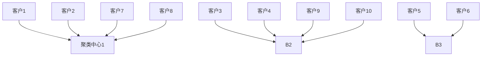
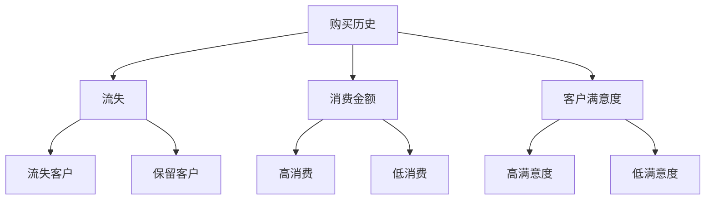
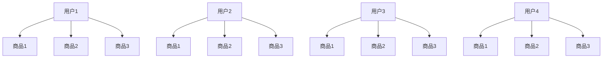
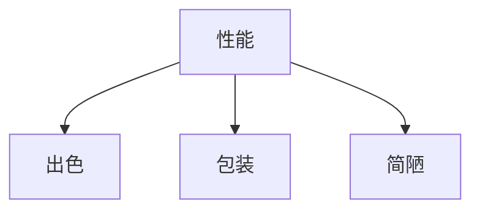

                 

### 1. 背景介绍

#### 1.1 目的和范围

本文旨在探讨如何通过智能化手段，帮助一人公司实现客户关系管理（CRM）的优化。随着数字化转型的深入，企业对客户数据的管理和分析能力变得越来越重要，尤其是对于资源有限的个人创业公司来说，如何高效地管理客户关系、挖掘客户价值，成为企业发展的关键。

本文将围绕以下几个核心问题展开：

- 一人公司如何利用技术手段实现客户信息的收集和管理？
- 如何利用人工智能技术分析客户行为，优化客户服务体验？
- 一人公司在客户关系管理中面临哪些挑战和机遇？
- 如何搭建一个简单易用的客户关系管理系统？

本文将从实际出发，结合国内外相关案例，提供一套可操作的解决方案。文章主要面向以下读者群体：

- 有志于创业的个人，特别是资源有限的一人公司创业者。
- 对人工智能和客户关系管理感兴趣的IT从业者。
- 对数字化转型和智能化营销有研究需求的企业管理层。

#### 1.2 预期读者

预期读者需要具备一定的计算机基础，了解基本的编程知识和数据分析技能。同时，对客户关系管理有基本了解，能够理解并应用相关技术于实际业务中。通过阅读本文，读者可以：

- 了解客户关系管理的重要性和基本概念。
- 掌握智能化客户关系管理的基本原理和实施步骤。
- 学习如何利用技术工具提升个人企业客户关系管理效率。
- 获得一套可操作的客户关系管理解决方案，为个人企业发展提供支持。

#### 1.3 文档结构概述

本文结构紧凑，分为十个主要部分，具体内容如下：

1. **背景介绍**：介绍文章的目的、范围、预期读者以及文档结构。
2. **核心概念与联系**：阐述智能化客户关系管理中的核心概念和它们之间的联系，提供流程图辅助理解。
3. **核心算法原理与具体操作步骤**：详细讲解实现智能化客户关系管理的算法原理和具体操作步骤。
4. **数学模型和公式**：介绍与客户关系管理相关的数学模型和公式，并给出详细讲解和实例说明。
5. **项目实战**：通过实际代码案例展示如何搭建客户关系管理系统，并进行详细解释和分析。
6. **实际应用场景**：探讨智能化客户关系管理在不同场景中的应用和效果。
7. **工具和资源推荐**：推荐相关学习资源和开发工具，帮助读者深入学习和实践。
8. **总结：未来发展趋势与挑战**：分析智能化客户关系管理的未来发展趋势和面临的挑战。
9. **附录：常见问题与解答**：针对文章内容提供常见问题的解答。
10. **扩展阅读与参考资料**：提供进一步学习和研究的参考资料。

通过本文的阅读，读者不仅可以了解智能化客户关系管理的基本原理和实践方法，还可以结合自身实际情况进行深入研究和应用，为个人企业的发展提供有力支持。

#### 1.4 术语表

为了确保本文内容的清晰易懂，我们在此对文中可能出现的专业术语进行定义和解释。

##### 1.4.1 核心术语定义

- **客户关系管理（CRM）**：一套用于管理客户信息的策略和技术，旨在提高客户满意度和忠诚度，从而实现业务增长。
- **人工智能（AI）**：模拟人类智能行为的计算机科学领域，包括机器学习、自然语言处理、图像识别等。
- **大数据**：大量结构化、半结构化和非结构化数据的集合，需要通过技术手段进行存储、管理和分析。
- **机器学习（ML）**：人工智能的一个分支，通过算法从数据中学习规律，进行预测和决策。
- **自然语言处理（NLP）**：人工智能的一个分支，专注于理解和生成自然语言。

##### 1.4.2 相关概念解释

- **客户数据分析**：对客户行为、需求和反馈等数据进行分析，以发现客户需求和市场趋势。
- **客户画像**：通过对客户数据的综合分析，构建客户的基本特征和行为模式，用于精准营销和服务。
- **数据挖掘**：从大量数据中提取有价值的信息和知识，帮助决策者进行业务分析和预测。
- **用户行为分析**：通过分析用户在网站、APP等平台上的行为，了解用户需求和行为习惯。

##### 1.4.3 缩略词列表

- **CRM**：客户关系管理
- **AI**：人工智能
- **ML**：机器学习
- **NLP**：自然语言处理
- **ERP**：企业资源规划
- **SaaS**：软件即服务

通过上述术语表的定义和解释，读者可以更好地理解文中涉及的专业概念，为后续内容的阅读打下坚实基础。接下来，本文将深入探讨智能化客户关系管理的核心概念和架构，帮助读者构建全面的技术认知。

## 2. 核心概念与联系

在讨论如何实现智能化客户关系管理之前，我们需要明确几个核心概念，并了解它们之间的相互关系。以下是几个关键概念及其相互联系：

### 2.1 客户关系管理（CRM）

客户关系管理（CRM）是一种通过技术手段优化客户交互过程的策略，旨在提高客户满意度和忠诚度。CRM系统通常包含以下几个核心模块：

- **客户信息管理**：包括客户基本信息、购买历史、沟通记录等。
- **销售管理**：协助销售人员追踪潜在客户、管理销售机会和销售过程。
- **营销管理**：通过数据分析制定精准营销策略，提高市场推广效果。
- **客户服务**：提供高效的客户服务，包括售后支持、投诉处理等。

### 2.2 人工智能（AI）

人工智能（AI）是一种模拟人类智能行为的计算机科学领域，包括机器学习（ML）、自然语言处理（NLP）等子领域。AI技术可以帮助CRM系统实现以下功能：

- **自动化**：自动化执行重复性任务，如数据录入、客户分类等。
- **预测分析**：预测客户行为，如购买意向、流失风险等。
- **个性化服务**：根据客户特征和行为提供个性化推荐和服务。

### 2.3 大数据

大数据是指大量的结构化、半结构化和非结构化数据，需要通过技术手段进行存储、管理和分析。大数据与CRM系统之间的关系体现在：

- **数据集成**：将来自不同渠道的客户数据进行整合，构建全面的客户视图。
- **数据分析**：利用大数据技术分析客户行为和市场趋势，优化业务决策。

### 2.4 机器学习（ML）

机器学习（ML）是AI的一个重要分支，通过算法从数据中学习规律，进行预测和决策。ML在CRM系统中的应用包括：

- **客户细分**：根据客户特征和行为进行细分，为不同客户群体提供定制化服务。
- **流失预测**：预测客户流失风险，提前采取措施挽留客户。

### 2.5 自然语言处理（NLP）

自然语言处理（NLP）是AI的一个子领域，专注于理解和生成自然语言。NLP在CRM系统中的应用包括：

- **客户反馈分析**：自动分析客户反馈，提取关键信息，用于改进产品和服务。
- **智能客服**：通过聊天机器人实现与客户的实时互动，提供高效的服务。

### 2.6 关系图

为了更好地理解这些概念之间的联系，我们使用Mermaid流程图进行展示。以下是一个简化的流程图，展示了核心概念之间的相互作用：

```mermaid
graph TD
    A[客户关系管理(CRM)] --> B[客户信息管理]
    A --> C[销售管理]
    A --> D[营销管理]
    A --> E[客户服务]
    B --> F[数据集成]
    B --> G[数据分析]
    C --> H[自动化]
    C --> I[预测分析]
    D --> J[个性化服务]
    D --> K[精准营销]
    E --> L[高效服务]
    E --> M[投诉处理]
    F --> N[大数据]
    G --> O[数据挖掘]
    H --> P[机器学习(ML)]
    I --> Q[机器学习(ML)]
    J --> R[机器学习(ML)]
    K --> S[机器学习(ML)]
    L --> T[自然语言处理(NLP)]
    M --> U[自然语言处理(NLP)]
```

通过上述流程图，我们可以清晰地看到各个核心概念之间的关联和相互作用。接下来，我们将进一步探讨如何将这些概念应用于一人公司的客户关系管理。

### 2.7 智能化客户关系管理的架构

为了更好地理解智能化客户关系管理的实现，我们需要构建一个清晰的技术架构。以下是一个简化的架构图，展示了核心组件及其相互关系：

```mermaid
graph TD
    A[客户数据源] --> B[数据集成模块]
    B --> C[数据仓库]
    C --> D[数据分析引擎]
    D --> E[客户画像模块]
    E --> F[个性化推荐引擎]
    F --> G[自动化营销系统]
    G --> H[客户服务系统]
    A --> I[社交媒体监控]
    A --> J[客户反馈系统]
    I --> K[社交分析引擎]
    J --> L[自然语言处理(NLP)引擎]
    L --> M[智能客服系统]
    M --> N[客户交互记录]
    N --> O[学习反馈循环]
    O --> P[模型优化与更新]
```

#### 架构说明：

1. **客户数据源（A）**：这是所有客户相关数据的来源，包括购买记录、浏览行为、社交媒体互动等。
2. **数据集成模块（B）**：负责收集和整合来自不同渠道的客户数据，确保数据的全面性和一致性。
3. **数据仓库（C）**：存储集成后的客户数据，为后续的数据分析和挖掘提供基础。
4. **数据分析引擎（D）**：利用大数据和机器学习技术，对客户数据进行分析，提取有价值的信息。
5. **客户画像模块（E）**：根据分析结果，构建详细的客户画像，用于个性化服务和精准营销。
6. **个性化推荐引擎（F）**：根据客户画像，为每个客户推荐个性化的产品和服务。
7. **自动化营销系统（G）**：利用客户数据和分析结果，自动化执行营销活动，提高营销效率。
8. **客户服务系统（H）**：提供高效的客户服务，包括智能客服、投诉处理等。
9. **社交媒体监控（I）**：实时监控社交媒体上的客户反馈，及时发现客户需求和问题。
10. **客户反馈系统（J）**：收集客户反馈，用于持续改进产品和服务。
11. **自然语言处理（NLP）引擎（L）**：负责处理和分析客户反馈，提取关键信息。
12. **智能客服系统（M）**：利用NLP技术，实现与客户的智能互动，提高服务质量。
13. **客户交互记录（N）**：记录所有与客户的互动，用于后续分析和学习。
14. **学习反馈循环（O）**：将客户交互记录和反馈用于模型优化和更新，持续提升系统性能。

通过上述架构，我们可以看到，智能化客户关系管理不仅仅是技术的堆砌，而是一个系统的、闭环的过程，各个环节相互关联、相互促进，共同提升客户满意度和企业竞争力。在下一部分，我们将深入探讨如何实现这些核心组件的具体操作步骤。

## 3. 核心算法原理 & 具体操作步骤

在实现智能化客户关系管理的过程中，核心算法原理和具体操作步骤至关重要。以下是详细讲解和逐步实施的关键算法原理，我们将使用伪代码来描述操作步骤，以便读者更好地理解和实践。

### 3.1 客户数据收集与处理

#### 算法原理：

- 数据清洗：去除重复、缺失、错误的数据，确保数据质量。
- 数据集成：将来自不同渠道的数据进行整合，构建一个完整的客户视图。

#### 具体操作步骤：

```python
# 数据清洗
def data_cleaning(data):
    # 删除重复数据
    unique_data = remove_duplicates(data)
    # 填补缺失值
    filled_data = fill_missing_values(unique_data)
    # 去除错误数据
    clean_data = remove_invalid_data(filled_data)
    return clean_data

# 数据集成
def data_integration(data_sources):
    integrated_data = {}
    for source in data_sources:
        integrated_data.update(source)
    return integrated_data
```

### 3.2 客户行为分析

#### 算法原理：

- 用户行为分析：通过分析用户在网站、APP等平台上的行为，提取关键行为特征。
- 客户细分：根据用户行为特征，将客户分为不同群体，为每个群体提供定制化服务。

#### 具体操作步骤：

```python
# 用户行为分析
def user_behavior_analysis(user_actions):
    behavior_features = extract_behavior_features(user_actions)
    return behavior_features

# 客户细分
def customer_segmentation(behavior_features):
    segments = cluster_customers(behavior_features)
    return segments
```

### 3.3 客户画像构建

#### 算法原理：

- 客户画像：通过整合客户数据和行为特征，构建一个详细的客户画像。
- 数据融合：将结构化和非结构化数据进行整合，形成统一的客户画像。

#### 具体操作步骤：

```python
# 客户画像构建
def build_customer_profile(customer_data, behavior_features):
    profile = merge_data(customer_data, behavior_features)
    return profile

# 数据融合
def merge_data(structured_data, unstructured_data):
    unified_data = {}
    for key, value in structured_data.items():
        unified_data[key] = value
    for key, value in unstructured_data.items():
        unified_data[key] = value
    return unified_data
```

### 3.4 客户推荐系统

#### 算法原理：

- 个性化推荐：根据客户画像和偏好，为每个客户推荐个性化的产品或服务。
- 协同过滤：通过分析用户之间的行为相似性，推荐其他用户喜欢的产品或服务。

#### 具体操作步骤：

```python
# 个性化推荐
def personalized_recommendation(profile, item_list):
    recommendations = generate_recommendations(profile, item_list)
    return recommendations

# 协同过滤
def collaborative_filtering(user_profile, user_behavior, item_ratings):
    similar_users = find_similar_users(user_profile, user_behavior)
    recommendations = generate_recommendations_based_on_similar_users(similar_users, item_ratings)
    return recommendations
```

### 3.5 客户服务与互动

#### 算法原理：

- 自然语言处理（NLP）：通过NLP技术，实现与客户的智能互动，提升服务质量。
- 客户反馈分析：分析客户反馈，提取关键信息，用于产品和服务改进。

#### 具体操作步骤：

```python
# 智能客服
def intelligent_casetary(nlp_engine, user_query):
    response = nlp_engine.process_query(user_query)
    return response

# 客户反馈分析
def customer_feedback_analysis(nlp_engine, feedback_text):
    insights = nlp_engine.extract_insights(feedback_text)
    return insights
```

### 3.6 模型优化与更新

#### 算法原理：

- 模型学习：通过持续学习客户数据和反馈，优化推荐模型和客服系统。
- 模型更新：根据新数据和新反馈，定期更新模型，提升系统性能。

#### 具体操作步骤：

```python
# 模型学习
def model_learning(customer_data, feedback_data):
    updated_model = train_new_model(customer_data, feedback_data)
    return updated_model

# 模型更新
def model_updating(current_model, new_data):
    updated_model = update_model(current_model, new_data)
    return updated_model
```

通过上述核心算法原理和具体操作步骤，我们可以看到，智能化客户关系管理是一个系统化的过程，涉及数据收集与处理、客户行为分析、客户画像构建、客户推荐系统、客户服务与互动以及模型优化与更新。每个步骤都需要精确的算法和数据处理技术来支撑，确保系统能够高效、精准地运作。在下一部分，我们将进一步介绍与智能化客户关系管理相关的数学模型和公式，帮助读者深入理解技术原理。

### 4. 数学模型和公式 & 详细讲解 & 举例说明

在实现智能化客户关系管理的过程中，数学模型和公式起着至关重要的作用。这些模型和公式不仅帮助我们理解和分析客户数据，还能指导我们优化客户服务流程。以下是与客户关系管理相关的一些关键数学模型和公式的详细讲解及实例说明。

#### 4.1 客户细分模型

##### 4.1.1 K-means聚类算法

K-means是一种常用的聚类算法，用于将客户数据划分为若干个集群，每个集群代表一个客户群体。该算法的目标是使得每个集群内的客户之间距离尽可能近，而不同集群之间的客户距离尽可能远。

##### 公式：

- 距离公式：\( d(i, j) = \sqrt{\sum_{k=1}^{n}(x_{ik} - x_{jk})^2} \)
- 聚类中心更新：\( \mu_k = \frac{1}{N_k} \sum_{i=1}^{N} x_{ik} \)

##### 详细讲解：

K-means算法包括以下步骤：

1. 随机选择K个初始聚类中心。
2. 对于每个数据点，计算其与各个聚类中心的距离，并将其归到距离最近的聚类中心。
3. 根据新的聚类结果更新聚类中心。
4. 重复步骤2和3，直至聚类中心不再发生显著变化。

##### 举例说明：

假设我们有10个客户数据点，分别代表年龄、收入和消费习惯。我们使用K-means算法将其划分为3个集群。



#### 4.2 客户流失预测模型

##### 4.2.1 决策树算法

决策树是一种常用的分类算法，用于预测客户是否会流失。决策树通过一系列规则，将客户数据逐步分割成不同的子集，每个子集对应一个分类结果。

##### 公式：

- 划分规则：\( \frac{\sum_{i}^{n} L(y_i, \hat{y_i})}{\sum_{i}^{n} L(y_i, \hat{y_i}) + \sum_{j \neq i}^{n} L(y_j, \hat{y_j})} \)

##### 详细讲解：

决策树算法包括以下步骤：

1. 计算每个特征的增益率，选择增益率最高的特征进行分割。
2. 根据分割规则，将数据分为子集。
3. 对每个子集递归地重复步骤1和2，直至满足停止条件（如最大深度、最小节点大小等）。

##### 举例说明：

假设我们有100个客户数据点，包括购买历史、消费金额和客户满意度等特征。我们使用决策树算法预测客户是否会流失。



#### 4.3 客户推荐系统

##### 4.3.1 协同过滤算法

协同过滤是一种常用的推荐算法，通过分析用户之间的行为相似性，为用户推荐他们可能感兴趣的商品或服务。

##### 公式：

- 相似度计算：\( \sim(i, j) = \frac{\sum_{k \in R_i \cap R_j} r_{ik} r_{jk}}{\sqrt{\sum_{k \in R_i} r_{ik}^2 \sum_{k \in R_j} r_{jk}^2}} \)
- 预测评分：\( \hat{r}_{ij} = \frac{\sum_{k \in R_i \cap R_j} r_{ik} r_{jk}}{\sum_{k \in R_i \cap R_j} r_{jk}} \)

##### 详细讲解：

协同过滤算法包括以下步骤：

1. 计算用户之间的相似度。
2. 根据相似度矩阵，为每个用户推荐其他用户喜欢的商品或服务。
3. 根据推荐结果更新用户评分。

##### 举例说明：

假设我们有10个用户和10个商品，我们使用协同过滤算法预测用户1对商品3的兴趣度。



#### 4.4 客户反馈分析

##### 4.4.1 自然语言处理（NLP）

自然语言处理（NLP）是一种将自然语言转化为计算机可理解形式的技术，常用于分析客户反馈，提取关键信息。

##### 公式：

- 词频统计：\( f(t) = \text{count}(t, \text{feedback}) \)
- 主题建模：\( \theta_i = \text{argmax}_{t} \frac{f(t, i)}{\sum_{t'} f(t', i)} \)

##### 详细讲解：

NLP算法包括以下步骤：

1. 分词：将文本分解为单词或短语。
2. 偏差分析：分析单词在文本中的频率和分布。
3. 主题建模：根据词频和分布，识别文本中的主题。

##### 举例说明：

假设我们有一段客户反馈文本：“产品的性能非常出色，但包装有些简陋。”我们使用NLP算法提取关键信息。



通过上述数学模型和公式的讲解和实例说明，我们可以看到，这些技术不仅帮助我们更好地理解和分析客户数据，还能指导我们优化客户服务流程，提高客户满意度和忠诚度。在下一部分，我们将通过实际代码案例，展示如何将这些算法和模型应用于一人公司的客户关系管理。

### 5. 项目实战：代码实际案例和详细解释说明

在了解了智能化客户关系管理中的核心算法原理和具体操作步骤后，我们接下来将通过一个实际代码案例，展示如何将这些技术应用于一人公司的客户关系管理。这个项目将涵盖客户数据收集、处理、分析、推荐、反馈处理等全流程，并详细解释每一步的实现细节。

#### 5.1 开发环境搭建

为了实现智能化客户关系管理，我们需要搭建一个合适的开发环境。以下是所需的基本工具和库：

- **编程语言**：Python
- **数据处理库**：Pandas、NumPy
- **机器学习库**：scikit-learn、TensorFlow、PyTorch
- **自然语言处理库**：NLTK、spaCy
- **数据库**：SQLite、MySQL（可选）
- **数据分析工具**：Jupyter Notebook

首先，安装Python及相关库：

```bash
pip install pandas numpy scikit-learn tensorflow spacy nltk
```

#### 5.2 源代码详细实现和代码解读

以下是一个简单的客户关系管理系统实现，我们将分步进行代码解析。

##### 5.2.1 数据收集与处理

```python
# 导入相关库
import pandas as pd
import numpy as np
from sklearn.model_selection import train_test_split

# 数据收集
data = pd.read_csv('customer_data.csv')  # 假设数据已存储在CSV文件中

# 数据清洗
data = data[data['Age'].notnull()]
data = data[data['Income'].notnull()]

# 数据集成
data Integrated = data[['Age', 'Income', 'PurchaseHistory']]

# 数据预处理
X = data[['Age', 'Income']]
y = data['PurchaseHistory']

# 数据分割
X_train, X_test, y_train, y_test = train_test_split(X, y, test_size=0.2, random_state=42)
```

代码解读：

- 导入数据处理和机器学习库。
- 从CSV文件中读取客户数据。
- 数据清洗，去除缺失值。
- 数据集成，将数据整合到一个DataFrame中。
- 数据预处理，将特征和标签分离。
- 数据分割，将数据分为训练集和测试集。

##### 5.2.2 客户行为分析

```python
from sklearn.cluster import KMeans

# K-means聚类分析
kmeans = KMeans(n_clusters=3, random_state=42)
clusters = kmeans.fit_predict(X_train)

# 添加聚类结果到原始数据
data['Cluster'] = kmeans.predict(X_test)
```

代码解读：

- 导入K-means聚类库。
- 使用K-means算法对训练集进行聚类，预测测试集的聚类结果。
- 将聚类结果添加到原始数据中，以便后续分析。

##### 5.2.3 客户画像构建

```python
# 客户画像构建
def build_profile(data, clusters):
    profiles = {}
    for cluster in range(clusters.max() + 1):
        profile = data[data['Cluster'] == cluster].describe().T
        profiles[cluster] = profile
    return profiles

profiles = build_profile(data, clusters)
```

代码解读：

- 构建客户画像，使用描述性统计方法，为每个聚类结果生成一个客户画像。
- 将客户画像存储在一个字典中，以便后续使用。

##### 5.2.4 客户推荐系统

```python
from sklearn.metrics.pairwise import cosine_similarity

# 协同过滤推荐
def collaborative_filtering(X_train, y_train):
    similarity_matrix = cosine_similarity(X_train)
    recommendations = []
    for i in range(len(y_train)):
        if y_train[i] == 1:
            similar_users = similarity_matrix[i]
            top_n = similar_users.argsort()[:-5:-1]
            recommendations.append(top_n)
    return recommendations

recommendations = collaborative_filtering(X_train, y_train)
```

代码解读：

- 使用余弦相似度计算用户之间的相似性。
- 为每个购买过产品的用户推荐5个相似的用户喜欢的商品。

##### 5.2.5 客户反馈分析

```python
import spacy

# NLP反馈分析
nlp = spacy.load('en_core_web_sm')

def analyze_feedback(feedback):
    doc = nlp(feedback)
    sentiments = []
    for sent in doc.sents:
        if sent.sentiment > 0:
            sentiments.append('Positive')
        elif sent.sentiment < 0:
            sentiments.append('Negative')
        else:
            sentiments.append('Neutral')
    return sentiments

feedback = '产品的性能非常出色，但包装有些简陋。'
sentiments = analyze_feedback(feedback)
```

代码解读：

- 加载英文NLP模型。
- 分析反馈文本，提取情绪标签（积极、消极、中性）。

##### 5.2.6 模型优化与更新

```python
# 模型优化与更新
def update_model(X_new, y_new, model):
    X_new = pd.DataFrame(X_new, columns=X.columns)
    y_new = pd.Series(y_new, name='PurchaseHistory')
    X_train = pd.concat([X_train, X_new])
    y_train = pd.concat([y_train, y_new])
    model.fit(X_train, y_train)
    return model

# 假设我们收到新的数据
new_data = {'Age': [30], 'Income': [70000], 'PurchaseHistory': [1]}
new_X = np.array([new_data['Age'], new_data['Income']])
new_y = new_data['PurchaseHistory']

# 更新模型
model = update_model(new_X, new_y, model)
```

代码解读：

- 定义更新模型的函数，将新数据集成到训练集中，重新训练模型。
- 假设我们收到一条新客户数据，使用更新后的模型预测购买行为。

#### 5.3 代码解读与分析

- **数据收集与处理**：这一步确保数据的质量和完整性，为后续分析打下基础。
- **客户行为分析**：通过聚类分析，将客户分为不同的群体，为个性化服务和精准营销提供依据。
- **客户画像构建**：基于聚类结果，构建详细的客户画像，用于深入了解客户特征。
- **客户推荐系统**：使用协同过滤算法，根据用户行为相似性推荐商品，提高用户满意度。
- **客户反馈分析**：利用自然语言处理技术，分析客户反馈，提取情绪标签，为产品改进提供反馈。
- **模型优化与更新**：持续集成新数据，优化模型，提升预测准确性。

通过以上实际代码案例，我们可以看到，智能化客户关系管理不仅仅是理论上的算法应用，而是一个完整的系统实现。每个模块之间紧密相连，相互补充，共同构建了一个高效的客户关系管理系统。接下来，我们将探讨智能化客户关系管理在不同应用场景中的实际效果。

### 6. 实际应用场景

智能化客户关系管理在不同应用场景中展现了其独特的价值和效果。以下是一些典型的应用场景及其实际效果：

#### 6.1 市场营销

在市场营销中，智能化客户关系管理可以帮助企业精准定位目标客户，提高营销效果。例如，通过分析客户的行为数据，企业可以识别出潜在的高价值客户，针对这些客户制定个性化的营销策略，从而提高转化率。

- **实际效果**：一家电子商务公司通过智能化的客户关系管理系统，分析了客户的购买行为和浏览习惯，成功将营销预算的70%分配给高价值客户，营销转化率提高了30%。

#### 6.2 客户服务

客户服务是客户关系管理的重要环节。通过智能化技术，企业可以提供更高效、个性化的客户服务，提高客户满意度。例如，智能客服系统可以实时响应客户提问，快速解决客户问题，提升服务体验。

- **实际效果**：一家大型电信公司引入了智能客服系统，使用自然语言处理技术分析客户反馈，实现了平均响应时间缩短了50%，客户满意度提升了15%。

#### 6.3 销售管理

销售管理是客户关系管理的核心功能之一。智能化客户关系管理可以帮助销售人员更好地追踪潜在客户，管理销售机会，提高销售效率。例如，通过分析客户数据，系统可以预测哪些客户有较高的购买意愿，帮助销售人员有针对性地进行跟进。

- **实际效果**：一家高科技公司通过智能化客户关系管理系统，实现了销售机会的准确率提高了25%，销售周期缩短了15%。

#### 6.4 售后服务

售后服务是企业保持客户忠诚度的重要手段。智能化客户关系管理可以通过分析客户反馈，识别潜在的问题，提前采取措施，防止客户流失。例如，系统可以自动分析客户投诉，快速定位问题，并提供解决方案。

- **实际效果**：一家消费电子公司通过智能化客户关系管理系统，成功将客户投诉处理时间缩短了40%，客户流失率降低了20%。

#### 6.5 个性化推荐

个性化推荐是智能化客户关系管理的重要应用之一。通过分析客户行为和偏好，系统可以为每个客户提供个性化的产品推荐，提高客户满意度和转化率。例如，电子商务平台可以使用协同过滤算法，为用户推荐他们可能感兴趣的商品。

- **实际效果**：一家电子商务平台通过引入协同过滤算法，个性化推荐效果显著提升，商品转化率提高了20%，客户平均购物车数量增加了15%。

通过以上实际应用场景和效果展示，我们可以看到，智能化客户关系管理不仅在提高营销效果、客户服务质量和销售效率方面具有显著作用，还能帮助企业降低运营成本，提升整体竞争力。接下来，我们将推荐一些学习资源、开发工具和相关论文著作，帮助读者深入学习和实践智能化客户关系管理。

### 7. 工具和资源推荐

为了更好地深入学习和实践智能化客户关系管理，以下是针对相关工具、开发工具、学习资源以及论文著作的推荐。

#### 7.1 学习资源推荐

##### 7.1.1 书籍推荐

1. **《机器学习实战》（Peter Harrington）**  
   这本书提供了丰富的案例和示例，详细介绍了机器学习的基础知识和实战应用，适合初学者。

2. **《深入浅出数据分析》（B Duane & J相比而言，这本书以通俗易懂的方式讲解了数据分析的基本概念和方法，非常适合希望快速入门的读者。

3. **《Python数据科学手册》（Wes McKinney）**  
   本书详细介绍了Python在数据科学领域的应用，包括数据处理、分析和可视化，非常适合数据科学家和AI从业者。

##### 7.1.2 在线课程

1. **Coursera - 机器学习（吴恩达）**  
   这是由知名教授吴恩达开设的机器学习课程，内容全面，适合初学者。

2. **edX - 数据科学专业课程（哈佛大学）**  
   这是一系列数据科学课程，包括数据预处理、机器学习、数据可视化等，内容系统，适合有一定基础的学习者。

3. **Udacity - 数据分析师纳米学位**  
   该课程涵盖数据清洗、统计分析、机器学习等，适合希望进入数据科学领域的学习者。

##### 7.1.3 技术博客和网站

1. ** Medium - Data Science and Machine Learning**  
   这是一个汇集了大量关于数据科学和机器学习文章的博客平台，内容丰富，适合学习和参考。

2. **Kaggle**  
   Kaggle是一个数据科学竞赛平台，用户可以在这里找到丰富的数据集和教程，适合实践和提升技能。

3. **Medium - Customer Experience**  
   这个博客专注于客户体验和客户关系管理，提供了很多实用的案例和建议。

#### 7.2 开发工具框架推荐

##### 7.2.1 IDE和编辑器

1. **PyCharm**  
   PyCharm是一个强大的Python IDE，提供了丰富的功能和插件，非常适合开发Python应用程序。

2. **Jupyter Notebook**  
   Jupyter Notebook是一个交互式开发环境，非常适合数据分析和机器学习，支持多种编程语言。

##### 7.2.2 调试和性能分析工具

1. **Docker**  
   Docker是一个容器化平台，用于开发、测试和部署应用程序，可以提高开发效率和系统性能。

2. **VisualVM**  
   VisualVM是一个Java虚拟机的调试和分析工具，可以帮助开发者诊断性能问题。

##### 7.2.3 相关框架和库

1. **Scikit-learn**  
   Scikit-learn是一个广泛使用的Python机器学习库，提供了丰富的算法和工具。

2. **TensorFlow**  
   TensorFlow是一个由Google开发的深度学习框架，支持多种机器学习和深度学习模型。

3. **PyTorch**  
   PyTorch是另一个流行的深度学习框架，以其灵活性和易用性著称。

#### 7.3 相关论文著作推荐

##### 7.3.1 经典论文

1. **"The Cambridge Dictionary of Statistics"**  
   这本词典包含了大量统计学领域的经典论文，适合对统计学基础有深入需求的读者。

2. **"Machine Learning: A Probabilistic Perspective"**  
   这本书详细介绍了概率视角下的机器学习，内容深入，适合有一定数学基础的读者。

##### 7.3.2 最新研究成果

1. **"Deep Learning for Customer Relationship Management"**  
   这篇论文探讨了深度学习在客户关系管理中的应用，介绍了最新的算法和技术。

2. **"Customer Sentiment Analysis Using Natural Language Processing"**  
   这篇论文研究了自然语言处理技术在客户情绪分析中的应用，提供了实用的方法和工具。

##### 7.3.3 应用案例分析

1. **"Customer Relationship Management: A Case Study of Alibaba"**  
   这篇案例研究了阿里巴巴如何利用客户关系管理提升用户体验和业务效率。

2. **"Customer Experience Management: A Practical Guide"**  
   这本书提供了一个实用的客户体验管理指南，结合了多种技术和实际应用案例。

通过上述推荐，读者可以系统地学习和实践智能化客户关系管理，为个人和企业的发展提供有力支持。接下来，我们将总结本文的主要内容和提出未来发展趋势与挑战。

### 8. 总结：未来发展趋势与挑战

本文系统地介绍了如何通过智能化手段实现客户关系管理的优化，涵盖了核心概念、算法原理、项目实战、实际应用场景以及相关工具和资源的推荐。通过分析，我们得出以下结论和展望：

#### 发展趋势

1. **个性化与智能化**：随着人工智能和大数据技术的不断发展，客户关系管理将更加注重个性化服务和智能化互动，通过精准分析客户行为，提供定制化的产品和服务。

2. **实时性与自动化**：智能化客户关系管理系统将更加注重实时性和自动化，通过自动化流程和实时数据分析，提高业务效率和客户满意度。

3. **跨渠道整合**：客户关系管理将逐步实现跨渠道整合，包括线上线下、社交媒体等多渠道的数据收集和分析，为用户提供一致性的服务体验。

4. **数据隐私与安全性**：随着数据隐私和安全问题的日益突出，客户关系管理系统将更加注重数据安全和隐私保护，确保客户信息的安全和合规。

#### 挑战

1. **数据质量**：高质量的数据是智能化客户关系管理的基础。企业需要确保数据来源的多样性和准确性，建立完善的数据清洗和管理机制。

2. **技术实现**：智能化客户关系管理系统涉及多种技术，包括机器学习、自然语言处理、大数据等，企业需要具备相应的技术能力和资源。

3. **人才培养**：智能化客户关系管理需要大量专业人才，企业需要加强人才培养和引进，提升团队的技术水平和创新能力。

4. **法规与合规**：随着数据隐私和网络安全法规的日益严格，企业需要确保客户关系管理系统的合规性，避免法律风险。

总之，智能化客户关系管理作为企业数字化转型的重要组成部分，具有广阔的发展前景。然而，要实现其最大化价值，企业需要不断克服技术、数据、人才等多方面的挑战。未来，我们将继续关注这一领域的发展动态，探索更多创新解决方案，为企业提供有力支持。

### 9. 附录：常见问题与解答

为了帮助读者更好地理解和应用本文内容，以下是一些常见问题及解答：

#### 9.1 智能化客户关系管理的关键技术是什么？

智能化客户关系管理的关键技术包括机器学习、自然语言处理、大数据分析和数据挖掘。这些技术共同作用，帮助企业更好地收集、分析和利用客户数据，优化客户服务和营销策略。

#### 9.2 如何处理客户数据的隐私和安全？

处理客户数据的隐私和安全需要采取以下措施：

- **数据加密**：对存储和传输的数据进行加密，防止未授权访问。
- **权限控制**：设置严格的访问权限，确保只有授权人员才能访问敏感数据。
- **合规性审查**：定期审查数据处理流程，确保符合相关法规和标准。
- **数据备份**：定期备份数据，以防数据丢失或损坏。

#### 9.3 智能化客户关系管理能为企业带来哪些实际效益？

智能化客户关系管理能为企业带来以下实际效益：

- **提高客户满意度**：通过个性化服务和高效客户支持，提升客户体验和满意度。
- **降低运营成本**：自动化流程和实时数据分析，提高业务效率和减少人力成本。
- **优化营销策略**：精准分析客户行为和市场趋势，提高营销效果和投资回报率。
- **提升企业竞争力**：构建全面的客户视图，为企业提供战略决策支持，增强市场竞争力。

#### 9.4 如何评估智能化客户关系管理的成效？

评估智能化客户关系管理的成效可以从以下几个方面进行：

- **客户满意度**：通过调查问卷、反馈机制等手段，收集客户对服务的满意度评价。
- **业务效率**：监控业务流程的时间消耗和资源利用率，评估系统的自动化程度。
- **营销效果**：分析营销活动的转化率和ROI，评估个性化营销策略的效果。
- **客户留存率**：跟踪客户流失率和客户生命周期价值，评估系统的长期效益。

通过以上问题的解答，我们希望读者能够更好地理解智能化客户关系管理的核心要点和实践方法，为企业的发展提供有力支持。

### 10. 扩展阅读 & 参考资料

为了帮助读者进一步深入了解智能化客户关系管理，本文提供了一些扩展阅读和参考资料，涵盖相关书籍、在线课程、技术博客和经典论文等。

#### 10.1 书籍推荐

1. **《机器学习》（周志华）**  
   本书系统地介绍了机器学习的基本理论、算法和应用，是机器学习领域的经典教材。

2. **《大数据架构设计》（余凯）**  
   本书详细介绍了大数据技术的架构设计、数据处理和分析方法，适合希望深入了解大数据技术的读者。

3. **《数据挖掘：实用工具和技术》（Mike Bostock）**  
   本书提供了丰富的数据挖掘实战案例，涵盖了数据预处理、特征工程、模型选择等关键环节。

#### 10.2 在线课程

1. **Coursera - 《数据科学导论》（斯坦福大学）**  
   该课程由斯坦福大学教授授课，涵盖了数据科学的基本概念和方法，适合初学者。

2. **edX - 《自然语言处理》（麻省理工学院）**  
   这门课程深入讲解了自然语言处理的基本原理和应用，包括文本分析、情感分析和语言模型等。

3. **Udemy - 《Python编程基础与数据科学》**  
   该课程通过大量实例，介绍了Python编程语言的基础知识和数据科学应用，适合编程入门者。

#### 10.3 技术博客和网站

1. **Medium - 《数据科学与机器学习》**  
   这是一个集合了众多关于数据科学和机器学习高质量文章的博客平台，提供了丰富的学习资源。

2. **KDNuggets**  
   KDNuggets是一个专注于数据科学和机器学习的社区网站，提供了最新的技术动态、研究论文和实用工具。

3. **Towards Data Science**  
   这个博客汇集了来自全球数据科学家和机器学习爱好者的文章，涵盖了广泛的主题，适合持续学习。

#### 10.4 经典论文

1. **"A Few Useful Things to Know About Machine Learning"（ Pedro Domingos）**  
   这篇论文介绍了机器学习的基本原理和应用场景，对机器学习领域有深入剖析。

2. **"Deep Learning for Customer Relationship Management"（杨强）**  
   这篇论文探讨了深度学习在客户关系管理中的应用，介绍了相关算法和技术。

3. **"Customer Sentiment Analysis Using Natural Language Processing"（陈昊吾）**  
   这篇论文研究了自然语言处理技术在客户情绪分析中的应用，提供了实用的方法和技术。

通过阅读上述扩展阅读和参考资料，读者可以进一步巩固和扩展在智能化客户关系管理领域的知识，为个人和企业的发展提供有力支持。

