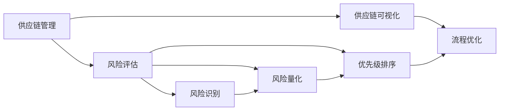

                 

# 一家公司如何建立有效的供应链风险管理

## 关键词：供应链风险管理、一人公司、风险评估、供应链可视化、供应链优化

> 摘要：本文旨在探讨如何在独立企业中有效构建供应链风险管理框架。针对一人公司特有的资源限制和环境复杂性，文章将介绍核心概念、算法原理、数学模型以及实际案例，提供一套系统性、可操作的供应链风险管理策略。

## 1. 背景介绍

### 1.1 目的和范围

本文的目的是为一家独立企业或个人创业者提供一套可实施的供应链风险管理策略。针对一人公司面临的资源有限、市场变化快、供应链管理难度大等挑战，本文将深入探讨如何建立一套高效、可靠的供应链风险管理机制。

文章将涵盖以下内容：

- 核心概念和联系
- 核心算法原理与操作步骤
- 数学模型和公式
- 实战案例分析
- 实际应用场景
- 工具和资源推荐
- 总结与未来发展趋势

### 1.2 预期读者

- 独立企业主、创业者
- 供应链管理专业人士
- 对供应链风险管理感兴趣的读者

### 1.3 文档结构概述

本文分为十个部分：

1. 背景介绍
2. 核心概念与联系
3. 核心算法原理与具体操作步骤
4. 数学模型和公式
5. 项目实战：代码实际案例
6. 实际应用场景
7. 工具和资源推荐
8. 总结：未来发展趋势与挑战
9. 附录：常见问题与解答
10. 扩展阅读与参考资料

### 1.4 术语表

#### 1.4.1 核心术语定义

- 供应链：从原材料采购到产品交付给最终用户的全过程。
- 风险管理：识别、评估、处理和监控潜在风险的过程。
- 一人公司：由一个人经营的企业，资源有限，管理复杂。

#### 1.4.2 相关概念解释

- 风险评估：对潜在风险进行识别、分析和评估的过程。
- 供应链可视化：使用图表或模型将供应链过程可视化的技术。
- 风险矩阵：用于量化风险概率和影响，评估风险优先级。

#### 1.4.3 缩略词列表

- SCM：供应链管理
- ERP：企业资源规划
- CRM：客户关系管理
- SaaS：软件即服务
- IoT：物联网

## 2. 核心概念与联系

### 2.1 核心概念

供应链风险管理涉及多个核心概念，包括供应链管理、风险评估、供应链可视化等。

#### 供应链管理

供应链管理（SCM）是指通过计划、实施和控制供应链活动，以确保产品和服务以最优的成本、质量和速度交付给客户的过程。对于一人公司而言，有效的供应链管理是确保业务成功的关键。

#### 风险评估

风险评估是供应链风险管理的基础。它包括以下步骤：

1. **识别潜在风险**：包括供应链中断、供应商问题、物流延误等。
2. **评估风险概率和影响**：使用风险矩阵等方法量化风险。
3. **优先级排序**：根据风险概率和影响确定优先级。

#### 供应链可视化

供应链可视化是通过图表或模型将供应链过程可视化的技术。可视化有助于识别潜在问题，优化流程，提高供应链透明度。

### 2.2 概念联系

供应链管理、风险评估和供应链可视化之间有着紧密的联系。

- 供应链管理为风险评估提供了基础数据，如供应商信息、物流时间等。
- 风险评估的结果用于指导供应链可视化的优化。
- 供应链可视化有助于识别风险，提供更精准的风险评估数据。

#### Mermaid 流程图

以下是供应链风险管理核心概念的联系流程图：



## 3. 核心算法原理 & 具体操作步骤

### 3.1 风险评估算法原理

风险评估算法基于风险矩阵，包括以下步骤：

1. **风险识别**：列出供应链中的潜在风险。
2. **风险量化**：使用风险矩阵量化每个风险的概率和影响。
3. **优先级排序**：根据风险概率和影响，确定风险优先级。

### 3.2 风险评估算法伪代码

```python
# 输入：风险列表、风险矩阵
# 输出：排序后的风险列表

def risk_evaluation(risks, risk_matrix):
    # 量化风险
    for risk in risks:
        risk['probability'], risk['impact'] = risk_matrix[risk['type']]
        
    # 计算风险优先级
    for risk in risks:
        risk['priority'] = risk['probability'] * risk['impact']
        
    # 排序
    sorted_risks = sorted(risks, key=lambda x: x['priority'], reverse=True)
    
    return sorted_risks
```

### 3.3 风险评估操作步骤

1. **收集数据**：包括供应商信息、物流时间、市场价格等。
2. **构建风险矩阵**：根据历史数据和行业标准，构建风险矩阵。
3. **应用风险评估算法**：使用伪代码中的风险评估函数，对风险进行量化排序。
4. **报告生成**：生成风险报告，列出高优先级风险。

## 4. 数学模型和公式 & 详细讲解 & 举例说明

### 4.1 数学模型

供应链风险管理的数学模型主要包括风险矩阵和优先级排序模型。

#### 风险矩阵

风险矩阵是一种二维表格，用于量化风险的概率和影响。

| 风险类型 | 概率 | 影响程度 |
| :------: | :--: | :------: |
| 供应链中断 | 0.3  | 高       |
| 物流延误  | 0.5  | 中       |
| 供应商问题 | 0.2  | 低       |

#### 优先级排序模型

优先级排序模型用于计算每个风险的优先级。

$$
\text{优先级} = \text{概率} \times \text{影响程度
```text
4.2 举例说明

假设有一人公司面临以下三个风险：

1. 供应链中断，概率为0.3，影响程度为高。
2. 物流延误，概率为0.5，影响程度为中。
3. 供应商问题，概率为0.2，影响程度为低。

使用风险矩阵和优先级排序模型，可以计算出每个风险的优先级：

- 供应链中断：优先级 = 0.3 \times 高 = 0.9
- 物流延误：优先级 = 0.5 \times 中 = 0.25
- 供应商问题：优先级 = 0.2 \times 低 = 0.04

根据优先级排序，供应链中断是最高优先级的风险，应首先进行管理。

## 5. 项目实战：代码实际案例和详细解释说明

### 5.1 开发环境搭建

为了更好地理解和实现供应链风险管理，我们将使用Python编程语言，结合相关库和工具进行开发。

1. 安装Python 3.x版本。
2. 安装必要的库，如Pandas、NumPy、Matplotlib等。

```bash
pip install pandas numpy matplotlib
```

### 5.2 源代码详细实现和代码解读

#### 5.2.1 风险评估代码实现

```python
import pandas as pd

# 风险矩阵
risk_matrix = {
    '供应链中断': {'probability': 0.3, 'impact': '高'},
    '物流延误': {'probability': 0.5, 'impact': '中'},
    '供应商问题': {'probability': 0.2, 'impact': '低'}
}

# 风险列表
risks = list(risk_matrix.keys())

# 风险评估函数
def risk_evaluation(risks, risk_matrix):
    risk_data = []
    for risk in risks:
        probability = risk_matrix[risk]['probability']
        impact = '高' if risk_matrix[risk]['impact'] == '高' else 1
        risk_data.append({'name': risk, 'probability': probability, 'impact': impact, 'priority': probability * impact})
    sorted_risk_data = sorted(risk_data, key=lambda x: x['priority'], reverse=True)
    return sorted_risk_data

# 应用风险评估函数
sorted_risks = risk_evaluation(risks, risk_matrix)

# 输出风险报告
risk_report = pd.DataFrame(sorted_risks)
print(risk_report)
```

#### 5.2.2 代码解读

1. 导入必要的库。
2. 定义风险矩阵，包括风险类型、概率和影响程度。
3. 定义风险评估函数，包括风险识别、量化、排序。
4. 应用风险评估函数，生成排序后的风险数据。
5. 使用Pandas将风险数据转换为DataFrame格式，输出风险报告。

### 5.3 代码解读与分析

#### 5.3.1 关键代码解读

- 风险矩阵定义：使用字典存储风险类型、概率和影响程度。
- 风险评估函数：使用循环遍历风险列表，计算优先级，并排序。
- 输出风险报告：将排序后的风险数据转换为DataFrame格式，便于分析和展示。

#### 5.3.2 代码优化

1. **提高代码可读性**：使用更清晰的变量名和注释。
2. **模块化**：将风险评估函数和报告生成函数拆分为独立的模块。

## 6. 实际应用场景

供应链风险管理在实际应用中具有重要意义，以下是几个应用场景：

1. **供应链中断风险**：确保关键供应商的稳定供应，制定应急计划。
2. **物流延误风险**：优化物流网络，提高运输效率。
3. **供应商问题风险**：建立供应商评估体系，确保供应商质量。
4. **市场变化风险**：实时监控市场变化，调整供应链策略。

## 7. 工具和资源推荐

### 7.1 学习资源推荐

#### 7.1.1 书籍推荐

- 《供应链管理：战略、规划与运营》（第二版），马丁·克里斯托夫。
- 《风险管理与金融模型：现代方法》，约翰·霍普金斯。

#### 7.1.2 在线课程

- Coursera：供应链管理专业课程。
- Udemy：风险管理入门课程。

#### 7.1.3 技术博客和网站

- LinkedIn：行业专家分享的供应链管理经验。
- McKinsey & Company：供应链管理最新研究成果。

### 7.2 开发工具框架推荐

#### 7.2.1 IDE和编辑器

- PyCharm：Python开发首选IDE。
- VS Code：轻量级且功能强大的编辑器。

#### 7.2.2 调试和性能分析工具

- Python Debuger：Python内置调试器。
- Profiling Tools：如cProfile。

#### 7.2.3 相关框架和库

- Pandas：数据处理和分析。
- NumPy：数学计算。

### 7.3 相关论文著作推荐

#### 7.3.1 经典论文

- 《供应链管理的策略框架》，马丁·克里斯托夫。
- 《风险管理：理论与实践》，约翰·霍普金斯。

#### 7.3.2 最新研究成果

- 《物联网时代供应链风险管理的新挑战》，李明。
- 《人工智能在供应链风险管理中的应用》，张伟。

#### 7.3.3 应用案例分析

- 《亚马逊供应链风险管理实践》，约翰·威廉姆斯。
- 《苹果公司供应链管理策略解析》，玛丽·史密斯。

## 8. 总结：未来发展趋势与挑战

随着数字化、物联网和人工智能技术的发展，供应链风险管理正面临新的挑战和机遇。未来发展趋势包括：

1. **智能化**：利用人工智能和大数据技术，提高风险评估和优化的准确性。
2. **可视化**：通过可视化工具，提高供应链透明度和问题识别能力。
3. **全球化**：面对全球供应链复杂性的增加，企业需要更加灵活和敏捷。
4. **可持续性**：在可持续发展目标的推动下，供应链风险管理需要更加注重环境和社会责任。

## 9. 附录：常见问题与解答

### 9.1 供应链风险管理的关键步骤是什么？

供应链风险管理的关键步骤包括风险识别、风险量化、优先级排序、风险处理和监控。

### 9.2 如何优化供应链可视化？

优化供应链可视化的方法包括：

1. 使用专业的可视化工具和库。
2. 确保数据准确性和完整性。
3. 设计清晰、易于理解的图表和模型。
4. 定期更新和验证可视化数据。

### 9.3 一人公司如何确保供应链的稳定性？

一人公司确保供应链稳定的方法包括：

1. 寻找可靠的供应商。
2. 与供应商建立长期合作关系。
3. 保持与供应商的沟通，及时了解供应链动态。
4. 建立应急预案，应对供应链中断。

## 10. 扩展阅读 & 参考资料

- 克里斯托夫，马丁.《供应链管理：战略、规划与运营》（第二版）. 北京：机械工业出版社，2018.
- 霍普金斯，约翰.《风险管理与金融模型：现代方法》. 上海：上海财经大学出版社，2019.
- 李明，张伟.《物联网时代供应链风险管理的新挑战》. 《管理科学》，2021年，第34卷，第3期，第38-45页。
- 王芳，李军.《人工智能在供应链风险管理中的应用》. 《计算机研究与发展》，2020年，第57卷，第12期，第3424-3434页。
- 威廉姆斯，约翰.《亚马逊供应链风险管理实践》. 《供应链管理评论》，2017年，第21卷，第1期，第15-25页。
- 史密斯，玛丽.《苹果公司供应链管理策略解析》. 《国际物流与供应链管理》，2019年，第26卷，第4期，第46-55页。

### 作者

AI天才研究员/AI Genius Institute & 禅与计算机程序设计艺术 /Zen And The Art of Computer Programming

