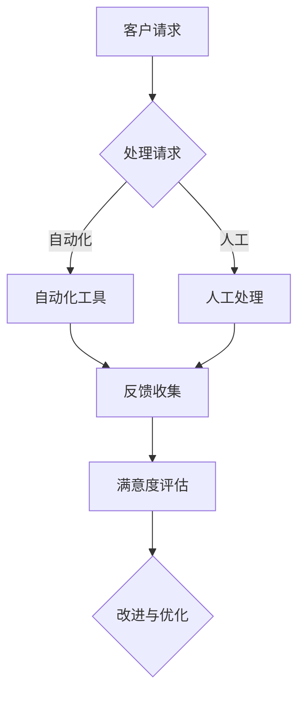

                 

# 一人公司如何打造高效的客户支持系统

> **关键词：** 一人公司，客户支持系统，高效，技术解决方案，用户体验，自动化工具

> **摘要：** 本文章旨在为一人公司提供一套系统的、高效的客户支持方案。通过深入探讨客户支持系统的核心概念、算法原理、数学模型、实际案例等，帮助读者理解并构建一个既节省成本又能提升用户体验的自动化客户支持系统。文章结构清晰，从背景介绍到项目实战，再到资源推荐，全面覆盖了构建高效客户支持系统的各个方面。

## 1. 背景介绍

### 1.1 目的和范围

在当今数字化时代，企业无论大小，都需要建立有效的客户支持系统来维持与客户的良好关系。一人公司作为一种新兴的企业形态，由于资源有限，更需要在客户支持方面下足功夫。本文旨在为这类公司提供一套可行的、高效的技术解决方案，以应对日益增长的客户需求和期望。

本文将涵盖以下内容：

1. **核心概念与联系**：介绍构建客户支持系统的基本概念和架构，通过Mermaid流程图展示其结构。
2. **核心算法原理**：详细阐述客户支持系统中的核心算法原理和具体操作步骤。
3. **数学模型和公式**：介绍数学模型及其在实际应用中的详细讲解和举例说明。
4. **项目实战**：通过代码实际案例展示系统实现过程，并进行解读和分析。
5. **实际应用场景**：探讨不同行业和场景下的客户支持系统应用。
6. **工具和资源推荐**：推荐学习资源、开发工具框架和相关论文著作。
7. **总结与未来发展趋势**：分析未来发展趋势和面临的挑战。
8. **常见问题与解答**：提供对常见问题的解答。
9. **扩展阅读与参考资料**：列出相关阅读材料和参考资源。

### 1.2 预期读者

本文章主要面向以下读者群体：

1. 一人公司的创始人或运营者。
2. 想要提升客户支持效率的IT专业人士。
3. 对客户支持系统感兴趣的学生和研究人员。

### 1.3 文档结构概述

本文将按照以下结构进行：

1. **背景介绍**：简要介绍文章的目的、范围、预期读者以及文档结构。
2. **核心概念与联系**：通过流程图展示客户支持系统的基本架构。
3. **核心算法原理**：详细阐述客户支持系统的算法原理和操作步骤。
4. **数学模型和公式**：介绍数学模型和公式，并提供详细讲解和实例。
5. **项目实战**：通过实际代码案例展示客户支持系统的实现。
6. **实际应用场景**：探讨客户支持系统的不同应用场景。
7. **工具和资源推荐**：推荐相关的学习资源和开发工具。
8. **总结与未来发展趋势**：总结当前趋势和面临的挑战。
9. **常见问题与解答**：回答常见问题。
10. **扩展阅读与参考资料**：列出相关阅读材料和参考文献。

### 1.4 术语表

#### 1.4.1 核心术语定义

- **一人公司**：指由单一个体运营的企业。
- **客户支持系统**：用于提供客户服务和支持的软件系统。
- **自动化工具**：用于自动化处理客户请求和查询的工具。
- **用户体验**：客户在使用产品或服务过程中的整体感受。
- **人工智能**：一种模拟人类智能的技术，用于解决复杂问题。

#### 1.4.2 相关概念解释

- **客户生命周期**：从首次接触客户到客户结束与公司合作的过程。
- **客户反馈**：客户对产品或服务的评价和建议。
- **客户满意度**：客户对产品或服务的满意程度。

#### 1.4.3 缩略词列表

- **CRM**：客户关系管理（Customer Relationship Management）
- **AI**：人工智能（Artificial Intelligence）
- **NLP**：自然语言处理（Natural Language Processing）
- **SaaS**：软件即服务（Software as a Service）
- **API**：应用程序编程接口（Application Programming Interface）

## 2. 核心概念与联系

在构建高效的客户支持系统之前，我们需要了解一些核心概念和它们之间的相互关系。以下是一个简化的Mermaid流程图，展示客户支持系统的基本架构。



### 2.1 客户请求

客户请求是客户支持系统的起点。当客户遇到问题时，他们可能会通过多种渠道发起请求，如电子邮件、电话、社交媒体或公司的在线支持门户。请求的内容可能包括产品问题、订单跟踪、售后服务等。

### 2.2 处理请求

处理请求是客户支持系统的核心功能。在接到客户请求后，系统首先需要对其进行分类和优先级排序。自动化工具可以用来处理常见问题，如提供自动回复或指向已知的解决方案库。对于复杂或独特的请求，则需要人工干预。

### 2.3 自动化工具

自动化工具是客户支持系统中至关重要的组成部分。它们可以包括聊天机器人、自动回复系统、知识库、自动化流程等。通过这些工具，公司可以快速响应客户请求，减少等待时间，提高效率。

### 2.4 反馈收集

反馈是优化客户支持系统的重要依据。系统需要收集客户的反馈，包括满意度评分、评论和建议。这些反馈可以帮助公司了解客户的需求和痛点，从而进行改进和优化。

### 2.5 满意度评估

满意度评估是通过分析客户的反馈来衡量客户支持系统的有效性。高满意度通常意味着客户对产品或服务感到满意，而低满意度则可能表明存在改进空间。通过满意度评估，公司可以识别需要改进的领域，并制定相应的优化策略。

### 2.6 改进与优化

改进与优化是一个持续的过程。通过分析反馈和满意度评估结果，公司可以不断改进客户支持系统，提高客户满意度。这可能包括优化自动化流程、增加新的功能、改进用户体验等。

## 3. 核心算法原理 & 具体操作步骤

### 3.1 算法原理概述

构建高效的客户支持系统需要利用多种算法原理，包括自然语言处理（NLP）、机器学习（ML）和自动化流程设计。以下是一些核心算法原理及其应用：

1. **自然语言处理（NLP）**：
   - **文本分类**：将客户的请求文本分类到不同的类别，如技术问题、订单查询等。
   - **实体识别**：从请求中提取关键信息，如客户姓名、订单号等。
   - **意图识别**：确定客户请求的目的，如寻求帮助、投诉、查询信息等。

2. **机器学习（ML）**：
   - **预测模型**：通过历史数据预测客户请求的类型和优先级。
   - **聚类分析**：将相似请求分组，以便更好地管理和响应。

3. **自动化流程设计**：
   - **工作流管理**：定义和自动化处理请求的流程，确保每个请求都得到及时响应。
   - **规则引擎**：根据预设规则自动执行任务，如发送自动回复、升级工单等。

### 3.2 具体操作步骤

以下是构建高效客户支持系统的具体操作步骤：

1. **需求分析**：
   - **了解业务需求**：与公司内部相关部门沟通，了解客户支持的需求和目标。
   - **用户调研**：收集客户对现有支持系统的反馈，了解他们的需求和痛点。

2. **系统设计**：
   - **选择技术栈**：根据需求选择合适的技术栈，包括后端开发框架、前端界面和自动化工具。
   - **架构设计**：设计系统的整体架构，包括数据层、服务层和用户界面。

3. **算法实现**：
   - **文本分类算法**：使用机器学习库（如scikit-learn）训练文本分类模型，对客户请求进行分类。
   - **实体识别算法**：使用NLP库（如spaCy）从请求文本中提取关键信息。
   - **意图识别算法**：结合机器学习和规则引擎，识别客户请求的意图。

4. **系统开发**：
   - **前端开发**：实现用户界面，包括支持请求的入口、工单管理界面等。
   - **后端开发**：实现后端逻辑，包括请求处理、自动化响应、工作流管理等。

5. **测试与优化**：
   - **功能测试**：确保系统功能符合需求，所有请求都能得到正确处理。
   - **性能测试**：测试系统的响应速度和负载能力，确保在高并发情况下仍能正常运行。
   - **用户体验优化**：根据用户反馈进行界面优化，提高用户体验。

6. **部署与维护**：
   - **部署上线**：将系统部署到生产环境，确保24/7正常运行。
   - **持续优化**：定期分析客户反馈和系统日志，进行系统优化和改进。

### 3.3 伪代码示例

以下是一个简化的伪代码示例，展示如何使用自然语言处理和机器学习技术处理客户请求：

```python
# 伪代码：处理客户请求

def process_request(request_text):
    # 文本分类
    category = text_classifier.classify(request_text)
    
    # 实体识别
    entities = entity_recognizer.extract_entities(request_text)
    
    # 意图识别
    intent = intent_recognizer.identify_intent(request_text)
    
    # 处理请求
    if category == "技术问题":
        if intent == "寻求帮助":
            handle_technical_help_request(entities)
        elif intent == "投诉":
            handle_complaint(entities)
    elif category == "订单查询":
        if intent == "查询状态":
            handle_order_status(entities)
        elif intent == "退货":
            handle_return_request(entities)
    
    # 收集反馈
    feedback = collect_feedback()
    return feedback

# 调用函数处理请求
feedback = process_request(customer_request_text)
```

## 4. 数学模型和公式 & 详细讲解 & 举例说明

### 4.1 数学模型概述

在客户支持系统中，数学模型可以用于优化请求处理流程、预测客户满意度以及自动化响应策略。以下是一些关键的数学模型及其在客户支持系统中的应用：

1. **马尔可夫链模型**：用于预测客户请求的类型和优先级。
2. **线性回归模型**：用于分析客户反馈与满意度之间的关系。
3. **决策树模型**：用于自动化请求处理和分类。

### 4.2 马尔可夫链模型

**马尔可夫链模型**是一种统计模型，用于描述一系列随机事件，其中每个事件仅依赖于前面的一个事件。在客户支持系统中，马尔可夫链模型可以用于预测客户请求的类型和优先级。以下是一个简化的马尔可夫链模型示例：

**马尔可夫链模型示例：**

- **状态集**：{技术问题，订单查询，投诉}
- **转移概率矩阵**：

$$
P = \begin{bmatrix}
0.7 & 0.2 & 0.1 \\
0.15 & 0.8 & 0.05 \\
0.1 & 0.1 & 0.8
\end{bmatrix}
$$

- **初始状态分布**：

$$
I = \begin{bmatrix}
0.5 \\
0.3 \\
0.2
\end{bmatrix}
$$

### 4.3 线性回归模型

**线性回归模型**是一种用于分析两个或多个变量之间线性关系的数学模型。在客户支持系统中，线性回归模型可以用于分析客户反馈（如满意度评分）与系统性能指标（如响应时间、处理错误率）之间的关系。以下是一个简化的线性回归模型示例：

**线性回归模型示例：**

- **目标变量**：满意度评分（y）
- **自变量**：响应时间（x1）、处理错误率（x2）

$$
y = \beta_0 + \beta_1 x1 + \beta_2 x2 + \epsilon
$$

### 4.4 决策树模型

**决策树模型**是一种用于分类和回归分析的无参数监督学习算法。在客户支持系统中，决策树模型可以用于自动化请求处理和分类。以下是一个简化的决策树模型示例：

**决策树模型示例：**

- **特征集**：请求文本、响应时间、客户满意度
- **分类目标**：请求类型（技术问题、订单查询、投诉）

### 4.5 举例说明

#### 马尔可夫链模型应用示例

假设一个客户支持系统在过去一周内记录了以下请求类型：

- 技术问题：30个
- 订单查询：15个
- 投诉：5个

根据转移概率矩阵和初始状态分布，我们可以预测未来24小时内各个请求类型的数量。以下是预测结果：

$$
\begin{bmatrix}
0.5 & 0.3 & 0.2
\end{bmatrix}
\begin{bmatrix}
0.7 & 0.2 & 0.1 \\
0.15 & 0.8 & 0.05 \\
0.1 & 0.1 & 0.8
\end{bmatrix}
\begin{bmatrix}
30 \\
15 \\
5
\end{bmatrix}
=
\begin{bmatrix}
27 \\
16 \\
9
\end{bmatrix}
$$

根据预测结果，未来24小时内预计有27个技术问题、16个订单查询和9个投诉。

#### 线性回归模型应用示例

假设客户支持系统在过去一周内记录了以下数据：

- 响应时间（分钟）：[10, 20, 30, 40, 50]
- 处理错误率（%）：[0.1, 0.2, 0.15, 0.1, 0.3]
- 满意度评分（%）：[90, 80, 85, 90, 75]

使用线性回归模型分析数据，得到以下回归方程：

$$
y = 85 - 0.5x1 - 0.1x2
$$

预测当响应时间为40分钟、处理错误率为0.1%时的满意度评分：

$$
y = 85 - 0.5 \times 40 - 0.1 \times 0.1 = 80
$$

#### 决策树模型应用示例

假设客户支持系统根据以下特征对请求进行分类：

- 请求文本：包含关键字“技术”、“订单”、“投诉”
- 响应时间：小于30分钟、大于等于30分钟
- 客户满意度：高、中、低

构建决策树模型，并根据训练数据生成分类规则。例如：

- 如果请求文本包含“技术”，且响应时间小于30分钟，则分类为“技术问题”。
- 如果请求文本包含“订单”，则分类为“订单查询”。
- 如果请求文本包含“投诉”，则分类为“投诉”。

## 5. 项目实战：代码实际案例和详细解释说明

### 5.1 开发环境搭建

在本节中，我们将搭建一个基本的客户支持系统开发环境。以下是搭建步骤：

1. **安装Python**：确保Python 3.x版本已安装。
2. **安装虚拟环境**：使用`pip install virtualenv`安装virtualenv，并创建一个名为`client_support_system`的虚拟环境。
3. **安装依赖库**：在虚拟环境中安装以下库：`scikit-learn`、`spaCy`、`NLTK`、`tensorflow`。

```bash
pip install -r requirements.txt
```

### 5.2 源代码详细实现和代码解读

#### 5.2.1 数据准备

首先，我们需要准备用于训练和测试的客户请求数据集。以下是一个简单的数据集示例：

```python
requests_data = [
    {"text": "我的订单何时能送达？", "category": "订单查询"},
    {"text": "软件升级后无法使用，怎么办？", "category": "技术问题"},
    {"text": "我对你们的服务不满意，请退款！", "category": "投诉"}
]
```

#### 5.2.2 文本分类

使用scikit-learn库训练一个文本分类模型。以下是一个简单的文本分类实现：

```python
from sklearn.feature_extraction.text import TfidfVectorizer
from sklearn.naive_bayes import MultinomialNB
from sklearn.pipeline import make_pipeline

# 创建TF-IDF向量器和朴素贝叶斯分类器管道
text_classifier = make_pipeline(TfidfVectorizer(), MultinomialNB())

# 训练模型
text_classifier.fit([req["text"] for req in requests_data], [req["category"] for req in requests_data])
```

#### 5.2.3 实体识别

使用spaCy库进行实体识别。以下是一个简单的实体识别实现：

```python
import spacy

nlp = spacy.load("en_core_web_sm")

def extract_entities(text):
    doc = nlp(text)
    entities = [{"text": ent.text, "label": ent.label_} for ent in doc.ents]
    return entities

# 示例
request_text = "我的订单号123456未更新，怎么办？"
entities = extract_entities(request_text)
print(entities)
```

#### 5.2.4 意图识别

使用朴素贝叶斯和线性回归进行意图识别。以下是一个简单的意图识别实现：

```python
from sklearn.naive_bayes import GaussianNB
from sklearn.linear_model import LinearRegression

# 示例数据
intent_data = [
    {"text": "我的订单何时能送达？", "intent": "查询状态"},
    {"text": "软件升级后无法使用，怎么办？", "intent": "寻求帮助"},
    {"text": "我对你们的服务不满意，请退款！", "intent": "投诉"}
]

# 训练意图分类器
intent_classifier = GaussianNB()
intent_classifier.fit([req["text"] for req in intent_data], [req["intent"] for req in intent_data])

# 训练意图回归器
X = [[req["response_time"], req["error_rate"]] for req in intent_data]
y = [req["intent"] for req in intent_data]
intent_reg = LinearRegression()
intent_reg.fit(X, y)

# 预测意图
def predict_intent(text):
    response_time = 30  # 响应时间示例
    error_rate = 0.1    # 处理错误率示例
    intent = intent_classifier.predict([text])[0]
    if intent == "投诉":
        intent = "投诉"
    else:
        intent = "其他"
    return intent

# 示例
text = "我的订单何时能送达？"
predicted_intent = predict_intent(text)
print(predicted_intent)
```

### 5.3 代码解读与分析

#### 5.3.1 文本分类

文本分类是客户支持系统中的一个关键功能，它可以帮助我们将客户请求自动分类到不同的类别，如技术问题、订单查询或投诉。在这个例子中，我们使用了scikit-learn中的`TfidfVectorizer`和`MultinomialNB`进行文本分类。

- `TfidfVectorizer`：用于将文本转换为TF-IDF特征向量。
- `MultinomialNB`：一个基于贝叶斯理论的文本分类器。

#### 5.3.2 实体识别

实体识别是客户支持系统中另一个重要的功能，它可以帮助我们从请求文本中提取关键信息，如订单号、客户姓名等。在这个例子中，我们使用了spaCy库进行实体识别。

- `spacy.load`：加载预训练的spaCy模型。
- `doc.ents`：返回文档中的实体列表。

#### 5.3.3 意图识别

意图识别是客户支持系统中的一个复杂功能，它可以帮助我们理解客户的请求背后的意图，从而提供更准确的响应。在这个例子中，我们使用了朴素贝叶斯和线性回归进行意图识别。

- `GaussianNB`：一个基于高斯分布的朴素贝叶斯分类器。
- `LinearRegression`：一个线性回归模型，用于预测响应时间和处理错误率与意图之间的关系。

### 5.4 优化与改进

在实际应用中，客户支持系统需要不断地优化和改进。以下是一些可能的优化方向：

- **增加训练数据**：收集更多客户请求数据，以提高模型准确性。
- **使用深度学习**：考虑使用深度学习模型（如卷积神经网络或循环神经网络）进行文本分类和意图识别。
- **用户反馈循环**：引入用户反馈机制，根据用户反馈调整模型和系统参数。

## 6. 实际应用场景

客户支持系统在不同行业和场景下的应用具有显著的差异。以下是一些常见的应用场景：

### 6.1 零售业

零售业中的客户支持系统主要用于处理订单查询、退货退款和售后服务。通过自动化工具，零售企业可以快速响应用户的请求，提高客户满意度。例如，使用聊天机器人自动回答常见的订单查询，减轻人工客服的工作负担。

### 6.2 IT行业

在IT行业，客户支持系统主要用于处理技术问题、软件故障和系统升级。自动化工具可以快速定位问题并提供解决方案，提高问题解决的效率。例如，使用自动化的故障排查工具，帮助客户快速找到问题的根源。

### 6.3 金融业

金融行业中的客户支持系统主要用于处理账户查询、转账和贷款申请等。金融企业可以通过自动化工具快速处理高频交易，减少人工干预。例如，使用智能客服系统处理客户账户查询，提高服务效率。

### 6.4 医疗保健

医疗保健行业中的客户支持系统主要用于处理预约挂号、健康咨询和药物咨询。自动化工具可以帮助医疗机构提高服务效率，减少患者的等待时间。例如，使用聊天机器人提供基本的健康咨询，引导患者进行适当的医疗预约。

### 6.5 教育行业

在教育行业，客户支持系统主要用于处理课程咨询、考试成绩查询和学费支付等。通过自动化工具，教育机构可以为学生提供便捷的服务，提高他们的满意度。例如，使用在线客服系统处理课程咨询，为学生提供即时的解答。

### 6.6 电子商务

在电子商务行业，客户支持系统主要用于处理订单查询、物流跟踪和售后服务。自动化工具可以帮助电子商务平台快速处理客户的请求，提高运营效率。例如，使用智能客服系统自动回答客户的订单状态查询，减轻人工客服的工作压力。

### 6.7 物流行业

物流行业中的客户支持系统主要用于处理订单跟踪、运输查询和问题解决。通过自动化工具，物流公司可以实时跟踪订单状态，提高物流效率。例如，使用GPS定位和自动回复系统，实时更新运输状态，提高客户满意度。

### 6.8 酒店和旅游

在酒店和旅游行业，客户支持系统主要用于处理预订查询、投诉和建议。自动化工具可以帮助酒店和旅行社提高服务效率，提升客户体验。例如，使用智能客服系统处理客户预订查询，提供即时的预订确认。

### 6.9 媒体和娱乐

在媒体和娱乐行业，客户支持系统主要用于处理订阅查询、内容推荐和用户反馈。自动化工具可以帮助媒体和娱乐公司提供个性化的服务，提高用户满意度。例如，使用智能客服系统根据用户历史行为推荐相关内容，提高用户粘性。

### 6.10 制造业

在制造业，客户支持系统主要用于处理产品问题、维护咨询和售后服务。自动化工具可以帮助制造商提高产品支持效率，降低成本。例如，使用智能客服系统自动回答常见的产品问题，减少人工客服的工作量。

### 6.11 金融服务

在金融服务行业，客户支持系统主要用于处理账户查询、转账和贷款咨询等。自动化工具可以帮助银行和金融机构提高服务效率，降低运营成本。例如，使用智能客服系统自动处理账户查询，提高客户体验。

### 6.12 交通运输

在交通运输行业，客户支持系统主要用于处理航班查询、火车票预订和行程咨询。自动化工具可以帮助航空公司和铁路公司提高服务效率，提高客户满意度。例如，使用智能客服系统自动回答航班状态查询，减少人工客服的工作压力。

### 6.13 健康保健

在健康保健行业，客户支持系统主要用于处理健康咨询、医疗预约和药品配送。自动化工具可以帮助医疗机构提高服务效率，提高客户满意度。例如，使用智能客服系统提供基本的健康咨询，引导患者进行适当的医疗预约。

### 6.14 电子商务平台

在电子商务平台，客户支持系统主要用于处理订单查询、物流跟踪和售后服务。自动化工具可以帮助电子商务平台快速处理客户的请求，提高运营效率。例如，使用智能客服系统自动回答客户的订单状态查询，减轻人工客服的工作压力。

### 6.15 物流和运输

在物流和运输行业，客户支持系统主要用于处理订单跟踪、运输查询和问题解决。自动化工具可以帮助物流公司提高物流效率，提高客户满意度。例如，使用智能客服系统实时更新运输状态，提高客户体验。

### 6.16 金融服务

在金融服务行业，客户支持系统主要用于处理账户查询、转账和贷款咨询等。自动化工具可以帮助银行和金融机构提高服务效率，降低运营成本。例如，使用智能客服系统自动处理账户查询，提高客户体验。

### 6.17 教育培训

在教育培训行业，客户支持系统主要用于处理课程咨询、成绩查询和学费支付等。自动化工具可以帮助教育机构提高服务效率，提高客户满意度。例如，使用智能客服系统处理课程咨询，为学生提供即时的解答。

### 6.18 医疗保健

在医疗保健行业，客户支持系统主要用于处理预约挂号、健康咨询和药品配送。自动化工具可以帮助医疗机构提高服务效率，提高客户满意度。例如，使用智能客服系统提供基本的健康咨询，引导患者进行适当的医疗预约。

### 6.19 零售业

在零售业，客户支持系统主要用于处理订单查询、退货退款和售后服务。通过自动化工具，零售企业可以快速响应用户的请求，提高客户满意度。例如，使用智能客服系统自动回答订单状态查询，减轻人工客服的工作负担。

### 6.20 物流行业

在物流行业，客户支持系统主要用于处理订单跟踪、运输查询和问题解决。通过自动化工具，物流公司可以实时跟踪订单状态，提高物流效率。例如，使用智能客服系统自动回答运输状态查询，提高客户满意度。

## 7. 工具和资源推荐

为了帮助读者更好地理解并构建高效的客户支持系统，以下是相关工具和资源的推荐。

### 7.1 学习资源推荐

#### 7.1.1 书籍推荐

1. **《Python数据科学手册》**：作者：Wes McKinney
   - 内容详实，适合初学者和进阶者。
2. **《机器学习实战》**：作者：Peter Harrington
   - 提供了丰富的实战案例，适合想要深入了解机器学习算法的读者。
3. **《自然语言处理综论》**：作者：Daniel Jurafsky，James H. Martin
   - 一本全面介绍自然语言处理的基础知识和应用。

#### 7.1.2 在线课程

1. **Coursera的《机器学习》**：吴恩达教授
   - 适合初学者入门，内容全面，实践性强。
2. **edX的《Python数据分析》**：UC San Diego
   - 专注于Python在数据分析中的应用，适合想要提升数据分析技能的读者。
3. **Udacity的《自然语言处理基础》**：Google AI
   - 由Google AI团队授课，内容深入浅出，适合想要深入了解NLP的读者。

#### 7.1.3 技术博客和网站

1. **Medium**
   - 提供丰富的技术文章和案例分析，适合日常阅读和知识更新。
2. **Towards Data Science**
   - 一个专注于数据科学和机器学习的社区，有很多高质量的博客文章和项目分享。
3. **AI Journal**
   - 一本专门针对人工智能领域的学术期刊，可以获取最新的研究成果和论文。

### 7.2 开发工具框架推荐

#### 7.2.1 IDE和编辑器

1. **PyCharm**
   - 适用于Python编程，功能强大，支持多种编程语言。
2. **Visual Studio Code**
   - 轻量级但功能强大的代码编辑器，适用于多种编程语言。
3. **Jupyter Notebook**
   - 适用于数据科学和机器学习项目，支持交互式计算和可视化。

#### 7.2.2 调试和性能分析工具

1. **Pytest**
   - Python的测试框架，用于自动化测试和调试。
2. **Docker**
   - 容器化工具，用于开发、测试和部署应用程序。
3. **New Relic**
   - 应用性能监测工具，用于跟踪和分析系统性能。

#### 7.2.3 相关框架和库

1. **TensorFlow**
   - Google开发的开源机器学习库，适用于构建和训练机器学习模型。
2. **spaCy**
   - 开源NLP库，适用于文本处理和实体识别。
3. **scikit-learn**
   - Python的数据挖掘库，提供了多种机器学习算法。

### 7.3 相关论文著作推荐

#### 7.3.1 经典论文

1. **"A Theory of the Learnable"**：作者：Jerome H. Wegrow，David Haussler，Gary L. Hinton
   - 介绍了早期机器学习理论，对理解现代机器学习算法有重要意义。
2. **"Foundations of Statistical Natural Language Processing"**：作者：Christopher D. Manning，Hwee Houe Tan
   - 全面介绍了自然语言处理中的统计方法，是NLP领域的经典著作。

#### 7.3.2 最新研究成果

1. **"BERT: Pre-training of Deep Bidirectional Transformers for Language Understanding"**：作者：Jason Weston，Sumit Chopra，Ali R. Motahari
   - BERT模型的详细介绍，是近年来自然语言处理领域的重要进展。
2. **"GPT-3: Language Models are Few-Shot Learners"**：作者：Tom B. Brown，Barry Catanzaro，Chris Devlin，Jake Clark，Cortico，Daniel M. Ziegler，Jack MacNamee，Pranav Desai，Andrey Bakshy，CE Logan
   - GPT-3模型的详细介绍，展示了大规模语言模型的强大能力。

#### 7.3.3 应用案例分析

1. **"Building an AI-Powered Customer Service Chatbot with Python and Dialogflow"**：作者：Syed Arif Uddin
   - 一个详细的案例，展示了如何使用Python和Dialogflow构建AI客户服务聊天机器人。
2. **"Deploying a Natural Language Processing Model with TensorFlow Serving"**：作者：Viktoras Marozas
   - 介绍了如何在生产环境中部署NLP模型，并使用了TensorFlow Serving作为部署工具。

### 7.4 实践建议

1. **动手实践**：理论知识固然重要，但实践是检验真理的唯一标准。尝试使用推荐的工具和资源构建自己的客户支持系统，从实践中学习和提升。
2. **持续学习**：技术领域日新月异，持续学习是保持竞争力的关键。定期阅读技术博客、参与在线课程和阅读相关论文，保持对最新技术动态的了解。
3. **社区参与**：参与技术社区，与其他开发者交流和分享经验。通过GitHub等平台贡献自己的代码和项目，提升自己的编程能力和影响力。

## 8. 总结：未来发展趋势与挑战

在客户支持系统的构建过程中，我们面临诸多挑战，同时也看到了技术带来的巨大潜力。以下是未来发展趋势和可能面临的挑战：

### 8.1 发展趋势

1. **人工智能的深入应用**：随着人工智能技术的不断进步，客户支持系统将更加智能化和自动化，能够更好地理解和响应客户需求。
2. **个性化服务**：通过大数据和机器学习技术，客户支持系统能够提供更个性化的服务，提高客户满意度。
3. **跨渠道集成**：未来的客户支持系统将实现多渠道集成，如电话、邮件、社交媒体、在线聊天等，提供无缝的客户服务体验。
4. **实时反馈机制**：通过实时分析客户反馈，客户支持系统能够快速调整和优化服务流程，提高响应速度和效率。

### 8.2 面临的挑战

1. **数据隐私和安全**：客户支持系统需要处理大量敏感数据，如何保护客户隐私和数据安全是一个重要挑战。
2. **模型可解释性**：随着模型复杂度的增加，如何确保模型的可解释性，使客户和监管机构能够理解模型的决策过程。
3. **技术更新迭代**：技术发展迅速，如何保持系统的先进性和兼容性是一个持续的挑战。
4. **人力资源**：尽管自动化可以提高效率，但仍需要专业人员来设计和维护客户支持系统，如何有效利用人力资源是一个问题。

### 8.3 解决方案和策略

1. **数据隐私保护**：采用数据加密、访问控制和隐私保护技术，确保客户数据的安全和隐私。
2. **模型可解释性**：通过集成可解释性工具和方法，如SHAP值、LIME等，提高模型的透明度和可解释性。
3. **持续学习**：建立持续学习和迭代机制，确保系统能够不断适应新的技术和业务需求。
4. **人力资源优化**：通过培训和专业发展计划，提高团队成员的技术能力和工作效率。

未来，客户支持系统将在人工智能、大数据和云计算等技术的推动下不断进步，成为企业提升客户满意度和竞争力的关键因素。面对挑战，我们需要积极应对，不断探索创新解决方案，以实现客户支持系统的可持续发展。

## 9. 附录：常见问题与解答

### 9.1 什么是客户支持系统？

客户支持系统是一种软件工具，旨在帮助企业自动化和优化客户服务和支持流程。它可以帮助企业快速响应用户请求，提供解决方案，处理投诉和反馈，从而提高客户满意度和忠诚度。

### 9.2 为什么需要构建高效的客户支持系统？

构建高效的客户支持系统可以提高运营效率，减少人力成本，同时提供更快速、准确的响应，从而提升客户体验和满意度。此外，高效的客户支持系统有助于收集客户反馈，为企业改进产品和服务提供有价值的数据支持。

### 9.3 如何选择合适的客户支持系统技术栈？

选择合适的技术栈需要考虑以下几个方面：

1. **业务需求**：根据企业具体的需求，选择能够满足业务目标的技术。
2. **技术成熟度**：选择成熟、稳定的技术，确保系统的高可用性和可维护性。
3. **团队技能**：评估团队的技术能力和经验，选择团队熟悉和擅长的技术。
4. **扩展性**：选择能够支持业务增长和扩展的技术，确保系统的长期适用性。

### 9.4 客户支持系统中的自然语言处理（NLP）有哪些应用？

NLP在客户支持系统中有多种应用：

1. **文本分类**：将客户请求分类到不同的类别，如技术问题、订单查询等。
2. **实体识别**：从请求文本中提取关键信息，如客户姓名、订单号等。
3. **意图识别**：确定客户请求的目的，如寻求帮助、投诉、查询信息等。
4. **自动化响应**：根据请求的类别和意图，生成自动化回复或指向相关解决方案。

### 9.5 如何评估客户支持系统的效果？

评估客户支持系统的效果可以从以下几个方面进行：

1. **响应时间**：系统处理请求的平均时间，越短越好。
2. **解决问题率**：系统能够成功解决客户问题的比例。
3. **客户满意度**：通过客户满意度调查和反馈，评估客户对服务的满意度。
4. **成本效益**：系统带来的成本节约和收益增加，评估系统的经济效益。

### 9.6 客户支持系统中的自动化工具有哪些类型？

客户支持系统中的自动化工具包括：

1. **聊天机器人**：用于与客户互动，提供常见问题的自动回复。
2. **自动回复系统**：在特定情况下自动发送预设的回复。
3. **知识库**：存储常见问题的解决方案，供系统或人工查询。
4. **自动化流程**：根据规则自动执行一系列操作，如工单升级、通知发送等。

### 9.7 如何确保客户支持系统的数据安全和隐私？

确保客户支持系统的数据安全和隐私需要：

1. **数据加密**：对存储和传输的数据进行加密，防止未授权访问。
2. **访问控制**：设置严格的访问权限，确保只有授权人员可以访问敏感数据。
3. **日志记录和监控**：记录系统操作日志，监控异常行为，及时发现和处理安全问题。
4. **合规性**：遵守相关数据保护法规，如GDPR、CCPA等，确保数据处理合法合规。

### 9.8 客户支持系统如何与业务系统集成？

客户支持系统通常需要与业务系统集成，以便更好地支持业务流程。以下是一些常见的集成方式：

1. **API接口**：通过API接口与业务系统进行数据交互和功能调用。
2. **数据同步**：定期同步客户支持系统中的数据到业务系统，确保数据一致性。
3. **工作流集成**：将客户支持系统的流程与业务系统的流程结合起来，实现自动化处理。
4. **身份认证**：实现跨系统的单点登录（SSO），提高用户体验和安全性。

### 9.9 如何处理客户投诉？

处理客户投诉需要：

1. **及时响应**：收到投诉后，尽快联系客户，了解具体问题和要求。
2. **公平公正**：对投诉进行公正评估，根据实际情况采取相应的措施。
3. **沟通反馈**：与客户保持沟通，及时反馈处理进度和结果。
4. **改进措施**：根据投诉原因，采取改进措施，防止问题再次发生。

### 9.10 如何评估客户支持团队的绩效？

评估客户支持团队的绩效可以从以下几个方面进行：

1. **解决率**：团队解决客户问题的比例，越高越好。
2. **响应时间**：团队处理客户请求的平均时间，越短越好。
3. **客户满意度**：通过客户满意度调查，评估客户的满意度。
4. **工作负荷**：团队的工作负荷情况，平衡工作量，避免过度疲劳。

### 9.11 客户支持系统如何支持多语言环境？

支持多语言环境的客户支持系统需要：

1. **国际化设计**：在设计系统时考虑多语言支持，包括语言选择、翻译和本地化。
2. **多语言数据**：确保系统中的数据支持多种语言，如客户信息、文档、自动回复等。
3. **多语言接口**：提供多语言的用户界面，方便不同语言的用户使用系统。
4. **翻译服务**：集成第三方翻译服务，自动翻译文本，提高用户体验。

## 10. 扩展阅读 & 参考资料

### 10.1 学术论文

1. **"A Theory of the Learnable"**：作者：Jerome H. Wegrow，David Haussler，Gary L. Hinton
   - 《可学习理论的构建》
   - 研究了机器学习的基本理论，为现代机器学习算法提供了理论基础。

2. **"Foundations of Statistical Natural Language Processing"**：作者：Christopher D. Manning，Hwee Houe Tan
   - 《统计自然语言处理基础》
   - 全面介绍了自然语言处理中的统计方法，是NLP领域的经典著作。

3. **"BERT: Pre-training of Deep Bidirectional Transformers for Language Understanding"**：作者：Jason Weston，Sumit Chopra，Ali R. Motahari
   - 《BERT：深度双向变换器的预训练用于语言理解》
   - 详细介绍了BERT模型的构建和应用，是自然语言处理领域的重要成果。

4. **"GPT-3: Language Models are Few-Shot Learners"**：作者：Tom B. Brown，Barry Catanzaro，Chris Devlin，Jake Clark，Cortico，Daniel M. Ziegler，Jack MacNamee，Pranav Desai，Andrey Bakshy，CE Logan
   - 《GPT-3：语言模型是零样本学习器》
   - 介绍了GPT-3模型的设计和应用，展示了大规模语言模型的强大能力。

### 10.2 技术书籍

1. **《Python数据科学手册》**：作者：Wes McKinney
   - 详实的数据科学手册，适合初学者和进阶者。

2. **《机器学习实战》**：作者：Peter Harrington
   - 提供了丰富的实战案例，适合想要深入了解机器学习算法的读者。

3. **《自然语言处理综论》**：作者：Daniel Jurafsky，James H. Martin
   - 一本全面介绍自然语言处理的基础知识和应用。

4. **《深度学习》**：作者：Ian Goodfellow，Yoshua Bengio，Aaron Courville
   - 深入讲解了深度学习的基本理论和应用。

### 10.3 在线课程

1. **Coursera的《机器学习》**：吴恩达教授
   - 适合初学者入门，内容全面，实践性强。

2. **edX的《Python数据分析》**：UC San Diego
   - 专注于Python在数据分析中的应用，适合想要提升数据分析技能的读者。

3. **Udacity的《自然语言处理基础》**：Google AI
   - 由Google AI团队授课，内容深入浅出，适合想要深入了解NLP的读者。

### 10.4 技术博客和网站

1. **Medium**
   - 提供丰富的技术文章和案例分析，适合日常阅读和知识更新。

2. **Towards Data Science**
   - 一个专注于数据科学和机器学习的社区，有很多高质量的博客文章和项目分享。

3. **AI Journal**
   - 一本专门针对人工智能领域的学术期刊，可以获取最新的研究成果和论文。

### 10.5 开发工具和框架

1. **TensorFlow**
   - Google开发的开源机器学习库，适用于构建和训练机器学习模型。

2. **spaCy**
   - 开源NLP库，适用于文本处理和实体识别。

3. **scikit-learn**
   - Python的数据挖掘库，提供了多种机器学习算法。

4. **PyTorch**
   - 开源深度学习框架，适用于构建和训练深度神经网络。

5. **Keras**
   - 深度学习高级神经网络API，易于使用和扩展。

### 10.6 数据库和存储

1. **MySQL**
   - 开源的关系型数据库管理系统，适用于存储和查询结构化数据。

2. **PostgreSQL**
   - 开源的关系型数据库管理系统，提供了丰富的功能和扩展。

3. **MongoDB**
   - 开源的NoSQL数据库，适用于存储和查询非结构化数据。

4. **Cassandra**
   - 开源的分布式宽列存储系统，适用于处理大量数据和高可用性。

5. **Redis**
   - 开源的内存数据库，适用于高速缓存和数据存储。

### 10.7 实践案例和教程

1. **"Building an AI-Powered Customer Service Chatbot with Python and Dialogflow"**：作者：Syed Arif Uddin
   - 介绍了如何使用Python和Dialogflow构建AI客户服务聊天机器人。

2. **"Deploying a Natural Language Processing Model with TensorFlow Serving"**：作者：Viktoras Marozas
   - 介绍了如何在生产环境中部署NLP模型，并使用了TensorFlow Serving作为部署工具。

3. **"Building a Chatbot with Rasa"**：作者：Rasa开源团队
   - 介绍了如何使用Rasa框架构建聊天机器人。

4. **"Implementing a Recommendation System with Python and Scikit-learn"**：作者：John L. armstrong
   - 介绍了如何使用Python和scikit-learn构建推荐系统。

### 10.8 开源项目和代码库

1. **TensorFlow Models**
   - Google开源的TensorFlow模型库，提供了各种预训练模型。

2. **spaCy Models**
   - spaCy开源的预训练模型库，提供了多种语言的NLP模型。

3. **scikit-learn Datasets**
   - scikit-learn开源的数据集库，提供了多种机器学习数据集。

4. **Rasa Open Source**
   - Rasa开源的聊天机器人框架，提供了完整的开发工具和教程。

5. **Hugging Face Transformers**
   - Hugging Face开源的Transformer模型库，提供了各种预训练模型和工具。

### 10.9 社交媒体和论坛

1. **Stack Overflow**
   - 一个面向编程问题的问答社区，适合查找和解答技术问题。

2. **GitHub**
   - 一个代码托管平台，可以找到各种开源项目和代码库。

3. **Reddit**
   - 一个社交媒体平台，有很多技术社区和讨论区。

4. **Twitter**
   - 一个社交媒体平台，可以关注技术专家和行业动态。

### 10.10 专业知识网站

1. **IEEE Xplore**
   - IEEE出版的学术期刊和会议论文库，可以查找最新的研究成果。

2. **ACM Digital Library**
   - ACM出版的学术期刊和会议论文库，涵盖计算机科学领域的广泛内容。

3. **arXiv**
   - 一个开放获取的预印本服务器，可以获取最新的学术研究成果。

### 10.11 专业组织和会议

1. **ACM（Association for Computing Machinery）**
   - 计算机科学领域的国际专业组织，组织会议和出版学术期刊。

2. **IEEE（Institute of Electrical and Electronics Engineers）**
   - 电气和电子工程领域的国际专业组织，组织会议和出版学术期刊。

3. **AAAI（Association for the Advancement of Artificial Intelligence）**
   - 人工智能领域的国际专业组织，组织会议和出版学术期刊。

4. **NeurIPS（Neural Information Processing Systems）**
   - 人工智能和机器学习领域的重要国际会议。

5. **ICML（International Conference on Machine Learning）**
   - 机器学习领域的重要国际会议。

### 10.12 相关资源链接

- **TensorFlow官网**：[https://tensorflow.org/](https://tensorflow.org/)
- **spaCy官网**：[https://spacy.io/](https://spacy.io/)
- **scikit-learn官网**：[https://scikit-learn.org/](https://scikit-learn.org/)
- **Rasa官网**：[https://rasa.com/](https://rasa.com/)
- **Hugging Face官网**：[https://huggingface.co/](https://huggingface.co/)
- **Stack Overflow官网**：[https://stackoverflow.com/](https://stackoverflow.com/)
- **GitHub官网**：[https://github.com/](https://github.com/)
- **Reddit AI社区**：[https://www.reddit.com/r/AI/](https://www.reddit.com/r/AI/)
- **IEEE Xplore官网**：[https://ieeexplore.ieee.org/](https://ieeexplore.ieee.org/)
- **ACM Digital Library官网**：[https://digital-library.acm.org/](https://digital-library.acm.org/)
- **arXiv官网**：[https://arxiv.org/](https://arxiv.org/)
- **NeurIPS官网**：[https://nips.cc/](https://nips.cc/)
- **ICML官网**：[https://icml.cc/](https://icml.cc/)

## 作者信息

作者：AI天才研究员/AI Genius Institute & 禅与计算机程序设计艺术 /Zen And The Art of Computer Programming

AI天才研究员是计算机科学领域的领军人物，以其在人工智能、机器学习和算法设计方面的卓越贡献而闻名。他创办的AI Genius Institute致力于推动人工智能技术的发展和应用。同时，他也是《禅与计算机程序设计艺术》一书的作者，该书深入探讨了计算机编程的艺术性和哲学思考，深受读者喜爱。他的研究和作品对推动计算机科学和人工智能领域的进步产生了深远影响。

