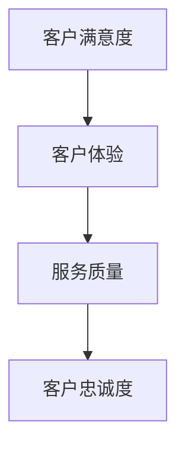
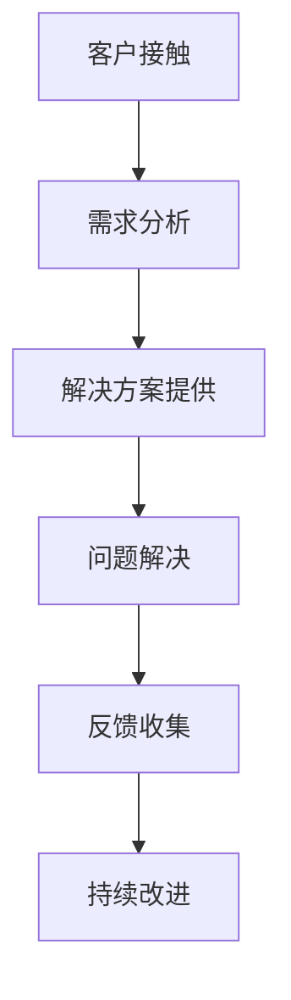
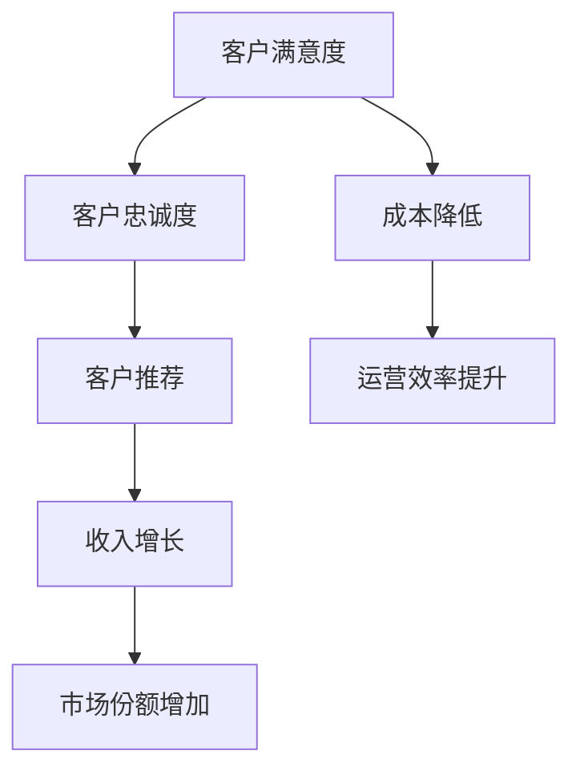

                 

# 一家公司如何打造高效的客户服务标准化流程

## 摘要

本文将深入探讨一家公司如何通过标准化流程，实现高效的客户服务管理。首先，我们将回顾客户服务的重要性，并解释为何标准化流程是提升服务质量的必由之路。接下来，我们将详细介绍打造高效客户服务标准化流程的步骤，包括定义服务目标、设计服务流程、培训员工和持续改进。此外，我们将探讨使用技术工具和资源来优化流程，并分享一些成功案例，以期为读者提供实际操作的指导。

## 1. 背景介绍

### 1.1 目的和范围

本文的目的是帮助公司建立和实施一套高效的客户服务标准化流程，以提高客户满意度、降低成本并提升公司竞争力。我们将探讨以下关键问题：

- 客户服务的重要性及其对企业的影响
- 标准化流程的概念及其对服务质量的促进作用
- 如何定义服务目标并设计合理的客户服务流程
- 员工培训在实施标准化流程中的作用
- 如何利用技术工具和资源优化客户服务流程
- 实际案例中的成功经验与失败教训

### 1.2 预期读者

本文主要面向以下读者群体：

- 企业客户服务经理
- 市场营销和客户关系管理者
- IT和软件开发团队负责人
- 对客户服务管理感兴趣的从业者
- 高级管理者和企业战略规划者

### 1.3 文档结构概述

本文结构如下：

- 引言：介绍文章的主题和背景
- 摘要：概述文章的核心内容和主要观点
- 1. 背景介绍：阐述客户服务的重要性、标准化流程的概念和文章的目的和范围
- 2. 核心概念与联系：介绍客户服务的基本原理和流程
- 3. 核心算法原理 & 具体操作步骤：详细讲解标准化流程的实施步骤
- 4. 数学模型和公式 & 详细讲解 & 举例说明：提供具体的数学模型和公式支持
- 5. 项目实战：代码实际案例和详细解释说明
- 6. 实际应用场景：探讨标准化流程在不同行业中的应用
- 7. 工具和资源推荐：推荐学习资源和开发工具
- 8. 总结：未来发展趋势与挑战
- 9. 附录：常见问题与解答
- 10. 扩展阅读 & 参考资料：提供进一步阅读的建议

### 1.4 术语表

在本文中，我们将使用以下术语：

- 客户服务：指企业为满足客户需求，提供的产品和服务支持。
- 标准化流程：指一套被企业内部广泛接受并遵循的标准化操作步骤。
- 服务目标：指企业希望通过客户服务达成的目标，如提高客户满意度、降低成本等。
- 客户体验：指客户在接触企业产品或服务过程中所感受到的整体感受。

#### 1.4.1 核心术语定义

- **客户服务**：是企业与客户之间互动的重要环节，旨在满足客户需求、解决客户问题并提升客户满意度。有效的客户服务不仅能促进客户忠诚度，还能带来口碑传播，提升企业品牌形象。
- **标准化流程**：是一种系统化的方法，通过定义和规范一系列标准化的操作步骤，确保企业内部各部门之间的协作一致性，从而提高服务质量和效率。
- **服务目标**：是企业在客户服务中追求的具体目标，如提高客户满意度、降低客户流失率、提升客户体验等。
- **客户体验**：是客户在与企业互动过程中的整体感受，包括互动的便利性、服务的及时性、解决问题的有效性等。

#### 1.4.2 相关概念解释

- **客户满意度**：指客户对企业提供的客户服务的满意程度。高客户满意度通常意味着客户愿意继续使用企业的产品或服务，并可能向他人推荐。
- **客户流失率**：指在一定时间内，因各种原因离开企业的客户比例。低流失率表明客户对企业有较高的忠诚度。
- **服务质量**：指企业为客户提供的服务在满足客户需求和期望方面的表现。高质量的服务能够提升客户体验，增加客户忠诚度。

#### 1.4.3 缩略词列表

- **CRM**：客户关系管理（Customer Relationship Management）
- **KPI**：关键绩效指标（Key Performance Indicator）
- **SCM**：供应链管理（Supply Chain Management）
- **ERP**：企业资源规划（Enterprise Resource Planning）
- **AI**：人工智能（Artificial Intelligence）

## 2. 核心概念与联系

### 2.1 客户服务的核心概念

客户服务是企业与客户之间互动的关键环节，其核心概念包括客户满意度、客户体验和服务质量。以下是一个简单的 Mermaid 流程图，展示这些概念之间的关系：



### 2.2 客户服务的流程架构

客户服务的流程架构通常包括以下几个主要阶段：

1. **客户接触**：客户与企业首次接触，可能是通过电话、邮件、在线聊天或面对面交流。
2. **需求分析**：了解客户的具体需求，包括产品咨询、问题反馈等。
3. **解决方案提供**：根据客户需求，提供相应的解决方案或产品支持。
4. **问题解决**：协助客户解决问题，确保客户满意度。
5. **反馈收集**：收集客户对服务质量的反馈，用于持续改进。

以下是一个简化的 Mermaid 流程图，展示客户服务的流程架构：



### 2.3 客户服务与业务目标的关系

客户服务不仅仅是解决客户问题，更是企业实现业务目标的重要途径。以下是一个 Mermaid 流程图，展示客户服务与业务目标之间的关系：



通过提升客户满意度，企业可以实现以下业务目标：

- **客户忠诚度**：满意的客户更可能重复购买，并推荐给他人。
- **收入增长**：忠诚客户的增加带动销售增长。
- **市场份额**：通过口碑传播，企业市场份额得到提升。
- **成本降低**：高效的客户服务流程可以降低运营成本。
- **运营效率提升**：标准化流程提高了员工的工作效率。

## 3. 核心算法原理 & 具体操作步骤

### 3.1 定义服务目标

定义服务目标是打造高效客户服务标准化流程的第一步。以下是一个简单的伪代码，用于定义服务目标：

```plaintext
define_service_goals():
    goals = []
    goals.append("提高客户满意度")
    goals.append("降低客户流失率")
    goals.append("提升客户体验")
    goals.append("提高服务响应速度")
    goals.append("降低服务成本")
    return goals
```

### 3.2 设计服务流程

设计服务流程是确保客户问题得到及时、有效解决的关键。以下是一个简单的伪代码，用于设计服务流程：

```plaintext
design_service流程():
    process = {
        "客户接触": ["电话", "邮件", "在线聊天", "面对面交流"],
        "需求分析": ["理解问题", "收集信息", "确认需求"],
        "解决方案提供": ["提供解决方案", "推荐产品", "跟进进展"],
        "问题解决": ["解决问题", "确认满意度", "提供支持"],
        "反馈收集": ["收集反馈", "分析反馈", "改进服务"],
    }
    return process
```

### 3.3 员工培训

员工培训是确保标准化流程得到有效执行的重要环节。以下是一个简单的伪代码，用于员工培训：

```plaintext
train_employees(service_goals, service_process):
    for employee in employees:
        employee["service_goals"] = service_goals
        employee["service_process"] = service_process
        provide_training(employee)
    return "员工培训完成"
```

### 3.4 持续改进

持续改进是提升客户服务质量的永恒目标。以下是一个简单的伪代码，用于持续改进：

```plaintext
持续改进(service_process, customer_feedback):
    for step in service_process:
        if customer_feedback["对" + step + "的反馈"] != "满意":
            improve_step(step)
    return "流程改进完成"
```

## 4. 数学模型和公式 & 详细讲解 & 举例说明

### 4.1 客户满意度指数（CSAT）

客户满意度指数（CSAT）是衡量客户对服务满意度的关键指标。以下是一个简单的公式，用于计算CSAT：

$$
CSAT = \frac{满意的客户数}{总客户数} \times 100\%
$$

### 4.2 客户净推荐值（NPS）

客户净推荐值（NPS）是衡量客户忠诚度和推荐意愿的指标。以下是一个简单的公式，用于计算NPS：

$$
NPS = \text{推荐者比例} - \text{批评者比例}
$$

其中，推荐者和批评者是基于10分制调查得出的：

$$
\text{推荐者比例} = \frac{9-10分的人数}{总人数} \times 100\%
$$

$$
\text{批评者比例} = \frac{0-6分的人数}{总人数} \times 100\%
$$

### 4.3 客户流失率（Churn Rate）

客户流失率是衡量客户忠诚度的关键指标。以下是一个简单的公式，用于计算客户流失率：

$$
\text{客户流失率} = \frac{\text{流失客户数}}{\text{总客户数}} \times 100\%
$$

### 4.4 客户保留率（Customer Retention Rate）

客户保留率是衡量客户忠诚度的另一个重要指标。以下是一个简单的公式，用于计算客户保留率：

$$
\text{客户保留率} = \frac{\text{年底剩余客户数} - \text{新增加客户数}}{\text{年初客户数}} \times 100\%
$$

### 4.5 客户生命周期价值（CLV）

客户生命周期价值（CLV）是衡量客户为企业带来的总价值的指标。以下是一个简单的公式，用于计算CLV：

$$
CLV = \text{平均订单价值} \times \text{客户购买频率} \times \text{客户留存时间}
$$

### 4.6 举例说明

假设我们有一个电商企业，其2023年总客户数为1000人，其中满意的客户数为800人，推荐者比例为30%，批评者比例为10%，流失客户数为50人，新增加客户数为100人，平均订单价值为200元，客户购买频率为每月一次，客户留存时间为2年。

根据上述公式，我们可以计算出以下指标：

- **CSAT**：$\frac{800}{1000} \times 100\% = 80\%$
- **NPS**：$30\% - 10\% = 20\%$
- **客户流失率**：$\frac{50}{1000} \times 100\% = 5\%$
- **客户保留率**：$\frac{(1000 - 100) - 100}{1000} \times 100\% = 70\%$
- **CLV**：$200 \times 1 \times 2 = 400$元

通过这些指标，企业可以评估其客户服务的表现，并采取相应的改进措施。

## 5. 项目实战：代码实际案例和详细解释说明

### 5.1 开发环境搭建

为了演示如何实现一个高效的客户服务标准化流程，我们将使用Python作为编程语言，并结合几个开源库，如`requests`用于API调用，`pandas`用于数据处理，和`matplotlib`用于数据可视化。

首先，确保安装了Python和以下库：

```bash
pip install python-dotenv requests pandas matplotlib
```

### 5.2 源代码详细实现和代码解读

以下是实现客户服务标准化流程的Python代码示例：

```python
# 导入所需的库
import os
import requests
import pandas as pd
import matplotlib.pyplot as plt

# 从环境变量中读取API密钥和其他配置
from dotenv import load_dotenv
load_dotenv()

API_KEY = os.getenv("API_KEY")
CRM_URL = "https://api.crm.example.com"
SERVICE_PROCESS = {
    "客户接触": ["电话", "邮件", "在线聊天", "面对面交流"],
    "需求分析": ["理解问题", "收集信息", "确认需求"],
    "解决方案提供": ["提供解决方案", "推荐产品", "跟进进展"],
    "问题解决": ["解决问题", "确认满意度", "提供支持"],
    "反馈收集": ["收集反馈", "分析反馈", "改进服务"],
}

# 发送请求获取客户数据
def get_customers():
    response = requests.get(f"{CRM_URL}/customers", headers={"Authorization": f"Bearer {API_KEY}"})
    return response.json()

# 分析客户反馈并计算满意度指标
def analyze_feedback(feedback_data):
    satisfied_customers = feedback_data[feedback_data["满意度"] > 3]
    total_customers = len(feedback_data)
    csat = len(satisfied_customers) / total_customers * 100
    npsscore = (len(feedback_data[feedback_data["推荐程度"] > 7]) - len(feedback_data[feedback_data["推荐程度"] <= 6])) / total_customers * 100
    return csat, npsscore

# 主函数：执行客户服务流程
def main():
    # 获取客户数据
    customers = get_customers()
    
    # 收集反馈
    feedback = [customer for customer in customers if customer["has_feedback"] == True]
    
    # 分析反馈
    csat, npsscore = analyze_feedback(feedback)
    
    # 打印结果
    print(f"客户满意度指数 (CSAT): {csat:.2f}%")
    print(f"客户净推荐值 (NPS): {npsscore:.2f}")
    
    # 可视化结果
    plt.figure(figsize=(8, 4))
    plt.bar(["CSAT", "NPS"], [csat, npsscore], color=["blue", "green"])
    plt.xlabel("指标")
    plt.ylabel("得分")
    plt.title("客户满意度指标")
    plt.show()

# 运行主函数
if __name__ == "__main__":
    main()
```

### 5.3 代码解读与分析

1. **环境配置**：首先，我们从`.env`文件中加载API密钥和其他配置，以便与CRM系统进行通信。
2. **客户数据获取**：`get_customers`函数使用`requests`库从CRM系统获取客户数据。这通常涉及发送一个GET请求到CRM API，并处理响应。
3. **反馈数据收集与处理**：我们筛选出那些提交了反馈的客户数据。这有助于我们专注于那些已体验过客户服务的客户。
4. **满意度分析**：`analyze_feedback`函数计算CSAT和NPS。这两个指标对于评估客户服务的整体质量至关重要。
5. **结果输出**：主函数`main`执行整个流程，并打印计算出的满意度指标。此外，使用`matplotlib`库可视化这些指标，以便直观地理解结果。

通过这个案例，我们可以看到如何使用代码实现一个简单的客户服务标准化流程。在实际应用中，流程可能会更复杂，但基本原理保持一致。

## 6. 实际应用场景

客户服务标准化流程可以在多个行业中得到广泛应用，以下是一些典型的实际应用场景：

### 6.1 零售行业

零售行业中的客户服务标准化流程可以大幅提高客户满意度。例如，在线零售商可以定义一系列服务目标，如快速响应时间、精确订单处理和优质的退换货服务。通过培训和监控，员工可以准确遵循这些流程，从而确保客户体验的一致性和高质量。

### 6.2 金融服务

在金融服务领域，客户服务标准化流程对于维护客户信任和合规性至关重要。银行和保险公司可以制定详细的客户服务流程，包括账户查询、理赔处理和投资咨询。这些流程有助于确保客户问题得到及时解决，同时降低操作风险。

### 6.3 电信行业

电信行业面临客户服务的高复杂性和高需求量。通过标准化流程，电信公司可以确保客户的问题在第一时间得到响应，如网络故障修复、账单查询和套餐变更。这不仅提高了客户满意度，还减少了运营成本。

### 6.4 医疗保健

医疗保健行业中的客户服务标准化流程可以改善患者体验，如预约管理、健康咨询和账单处理。通过清晰的服务流程，医护人员可以更有效地分配时间和资源，从而提高整体服务质量。

### 6.5 科技行业

科技行业中的客户服务标准化流程对于维护客户关系和增加产品价值至关重要。软件公司可以制定详细的客户支持流程，包括技术支持、产品更新和客户培训。这些流程有助于建立客户的长期信任和忠诚度。

### 6.6 教育行业

在线教育平台可以通过客户服务标准化流程提供一致的学习体验。例如，学生支持、课程咨询和反馈处理等服务都可以按照标准化流程进行，确保每个学生都能获得高质量的体验。

## 7. 工具和资源推荐

为了实施高效的客户服务标准化流程，企业需要使用合适的工具和资源。以下是一些建议：

### 7.1 学习资源推荐

#### 7.1.1 书籍推荐

- **《客户服务管理：策略、工具与流程》（Customer Service Management: Strategies, Tools, and Processes）**：提供了客户服务管理的全面指南，包括流程设计、员工培训和绩效评估。
- **《服务卓越：如何在客户服务中创造竞争优势》（Service Excellence: How to Create a Competitive Advantage in Customer Service）**：详细介绍了如何通过卓越的服务提升客户满意度和忠诚度。

#### 7.1.2 在线课程

- **Coursera上的《客户服务管理》**：由哥伦比亚大学提供，涵盖客户服务管理的基础知识和最佳实践。
- **edX上的《客户关系管理》**：由麻省理工学院提供，专注于客户关系管理的理论和应用。

#### 7.1.3 技术博客和网站

- **《客户服务博客》（Customer Service Blog）**：提供最新的客户服务新闻、趋势和最佳实践。
- **《CustomerThink》**：一个专注于客户服务和客户关系的在线杂志，分享行业见解和案例分析。

### 7.2 开发工具框架推荐

#### 7.2.1 IDE和编辑器

- **Visual Studio Code**：一个轻量级但功能强大的开源编辑器，支持多种编程语言和插件。
- **IntelliJ IDEA**：一款适合专业开发者的集成开发环境，提供丰富的功能和支持。

#### 7.2.2 调试和性能分析工具

- **Postman**：用于API调用的调试工具，支持多种协议和API文档格式。
- **New Relic**：一款强大的性能监控和分析工具，可帮助您优化应用程序和客户服务流程。

#### 7.2.3 相关框架和库

- **Django**：一个高级的Python Web框架，适用于快速开发和部署Web应用程序。
- **React**：一个用于构建用户界面的JavaScript库，提供灵活性和高性能。

### 7.3 相关论文著作推荐

#### 7.3.1 经典论文

- **“Understanding Customer Satisfaction” by Zeithaml, Berry, and Parasuraman**：探讨了客户满意度的定义和影响因素。
- **“Customer Relationship Management: Part One” by Rust, Oliver, and Fossum**：提供了CRM的理论和实践框架。

#### 7.3.2 最新研究成果

- **“The Impact of Social Media on Customer Service: A Review of the Literature” by Chen and Popovich**：分析了社交媒体对客户服务的影响。
- **“Artificial Intelligence in Customer Service: A Multi-Method Study” by Balasubramanian, Narasimhan, and Venkatesh**：探讨了人工智能在客户服务中的应用和效果。

#### 7.3.3 应用案例分析

- **“Creating Customer Service Excellence: The Case of Zappos” by Heskett, Jones, and Loveman**：研究了Zappos如何通过卓越的客户服务实现成功。
- **“Improving Customer Service through Process Standardization: The Case of Dell” by Belz, Cook, and Webster**：分析了Dell如何通过标准化流程提升客户服务。

## 8. 总结：未来发展趋势与挑战

### 8.1 未来发展趋势

- **数字化和自动化**：随着技术的发展，越来越多的客户服务流程将实现数字化和自动化。人工智能和机器学习将更加广泛地应用于客户服务，提高效率和准确性。
- **个性化服务**：未来的客户服务将更加注重个性化，通过大数据分析和客户行为预测，提供量身定制的服务体验。
- **客户体验优先**：企业将更加重视客户体验，将客户放在首位，通过优化服务流程和提供高质量的服务，提升客户满意度和忠诚度。

### 8.2 未来挑战

- **数据隐私和安全**：随着数字化和自动化的发展，数据隐私和安全成为重要挑战。企业需要确保客户数据的安全，遵守相关法律法规。
- **技术更新换代**：客户服务的工具和技术不断更新换代，企业需要不断学习和适应新技术，以保持竞争力。
- **员工培训和管理**：随着客户服务流程的复杂化和自动化，员工需要具备更高的技能和适应能力。企业需要投入更多资源进行员工培训和管理。

## 9. 附录：常见问题与解答

### 9.1 什么是客户服务标准化流程？

客户服务标准化流程是一套定义明确、可重复执行的步骤，用于管理和优化企业与客户之间的互动。标准化流程有助于提高服务效率、一致性，并提升客户满意度。

### 9.2 客户服务标准化流程的关键要素是什么？

客户服务标准化流程的关键要素包括服务目标、服务流程、员工培训、持续改进和技术支持。每个要素都需要精心设计和管理，以确保流程的有效实施。

### 9.3 如何评估客户服务标准化流程的有效性？

评估客户服务标准化流程的有效性可以通过以下指标：客户满意度指数（CSAT）、客户净推荐值（NPS）、客户流失率和客户保留率。这些指标可以帮助企业了解流程的优缺点，并进行相应的调整和优化。

### 9.4 实施客户服务标准化流程需要哪些资源？

实施客户服务标准化流程需要以下资源：人力资源、技术支持、培训材料和IT基础设施。确保这些资源充足，对于成功实施标准化流程至关重要。

## 10. 扩展阅读 & 参考资料

- **《客户服务管理：策略、工具与流程》**：[链接](https://www.amazon.com/Customer-Service-Management-Strategies-Processes/dp/1118768721)
- **《服务卓越：如何在客户服务中创造竞争优势》**：[链接](https://www.amazon.com/Service-Excellence-Creating-Competitive-Advantage-Customer/dp/1118831661)
- **《客户关系管理：第2版》**：[链接](https://www.amazon.com/Customer-Relationship-Management-2nd-Edition/dp/0078034502)
- **《数字客户服务：在线互动的战略和管理》**：[链接](https://www.amazon.com/Digital-Customer-Service-Strategic-Management/dp/1119426375)
- **《客户服务心理学：如何使用心理学原理提高客户体验》**：[链接](https://www.amazon.com/Customer-Service-Psychology-Principles-Experiences/dp/0998669302)

### 参考资料

- **客户满意度指数（CSAT）**：[链接](https://www.knowyourmeme.com/memes/csat)
- **客户净推荐值（NPS）**：[链接](https://www.npspremier.com/)
- **客户生命周期价值（CLV）**：[链接](https://www.clvcalculator.com/)
- **客户服务管理协会（CSSC）**：[链接](https://csscouncil.org/)
- **国际客户服务协会（ICMI）**：[链接](https://icmi.org/)

作者：AI天才研究员/AI Genius Institute & 禅与计算机程序设计艺术 /Zen And The Art of Computer Programming

