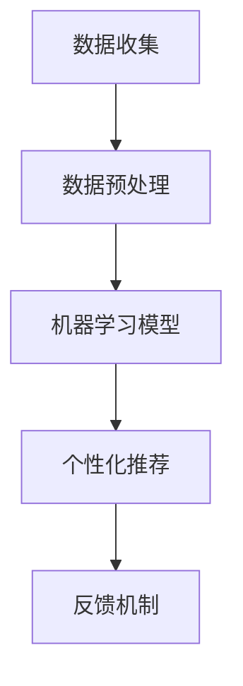
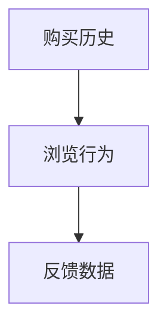
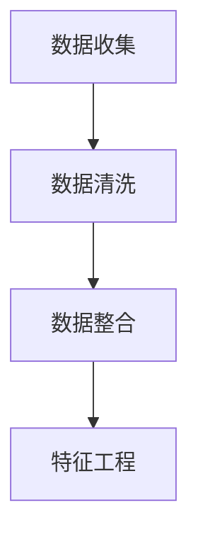

                 

# 一人公司的AI驱动客户忠诚度计划：提升复购率的智能方案

> **关键词：** AI、客户忠诚度、复购率、智能解决方案、数据分析、个性化推荐、行为预测。

> **摘要：** 本文将探讨如何利用人工智能技术为小型企业构建一个有效的客户忠诚度计划。通过分析客户行为数据，本文将介绍一套完整的AI驱动策略，包括核心概念、算法原理、数学模型以及实战案例，帮助企业精准提升复购率，增强市场竞争优势。

## 1. 背景介绍

### 1.1 目的和范围

在现代商业环境中，客户忠诚度是企业长期发展的关键因素。本文旨在为一家一人公司提供一套AI驱动的客户忠诚度提升方案，帮助企业在资源有限的情况下，依然能够通过智能分析技术有效提高客户复购率。本文将涵盖以下内容：

1. **核心概念与联系**：介绍AI技术在客户忠诚度计划中的应用原理。
2. **核心算法原理 & 具体操作步骤**：详细讲解如何通过算法实现客户行为预测和个性化推荐。
3. **数学模型和公式 & 详细讲解 & 举例说明**：阐述用于优化客户忠诚度策略的数学公式。
4. **项目实战：代码实际案例和详细解释说明**：展示具体实现过程及代码解读。
5. **实际应用场景**：探讨不同行业中的客户忠诚度应用案例。
6. **工具和资源推荐**：提供学习资源、开发工具框架和相关论文著作推荐。
7. **总结：未来发展趋势与挑战**：分析未来发展趋势以及面临的挑战。

### 1.2 预期读者

本文适合以下读者群体：

1. **一人公司的创始人或管理人员**：希望通过AI技术提升客户忠诚度的企业主。
2. **数据分析师**：需要了解如何应用AI技术进行数据分析的人员。
3. **技术爱好者**：对AI和机器学习技术感兴趣的学习者。
4. **市场营销人员**：关注客户忠诚度和复购率的营销专业人士。

### 1.3 文档结构概述

本文结构如下：

1. **背景介绍**：介绍目的和范围，预期读者，文档结构概述。
2. **核心概念与联系**：介绍AI技术在客户忠诚度计划中的应用原理。
3. **核心算法原理 & 具体操作步骤**：详细讲解算法实现过程。
4. **数学模型和公式 & 详细讲解 & 举例说明**：阐述用于优化客户忠诚度策略的数学公式。
5. **项目实战：代码实际案例和详细解释说明**：展示具体实现过程及代码解读。
6. **实际应用场景**：探讨不同行业中的客户忠诚度应用案例。
7. **工具和资源推荐**：提供学习资源、开发工具框架和相关论文著作推荐。
8. **总结：未来发展趋势与挑战**：分析未来发展趋势以及面临的挑战。
9. **附录：常见问题与解答**：回答读者可能遇到的问题。
10. **扩展阅读 & 参考资料**：提供进一步的阅读资源和参考资料。

### 1.4 术语表

#### 1.4.1 核心术语定义

- **客户忠诚度**：指客户在重复购买、推荐、续约等方面的稳定性和持续性。
- **复购率**：指在一定时间内，再次购买同一产品或服务的客户比例。
- **AI**：指人工智能，是一种模拟人类智能行为的计算机技术。
- **机器学习**：一种AI技术，通过数据和算法让计算机自动学习和改进。

#### 1.4.2 相关概念解释

- **客户行为分析**：通过收集和分析客户的行为数据，以了解其购买习惯和偏好。
- **个性化推荐**：根据客户的兴趣和行为数据，提供个性化的产品或服务推荐。

#### 1.4.3 缩略词列表

- **AI**：人工智能
- **ML**：机器学习
- **CRM**：客户关系管理
- **NLP**：自然语言处理

## 2. 核心概念与联系

在本文中，我们将探讨如何利用人工智能技术构建客户忠诚度计划。核心概念包括：

1. **客户行为数据收集**：收集客户的购买历史、浏览行为、反馈等数据。
2. **数据预处理**：清洗和整合数据，使其适用于机器学习模型。
3. **机器学习模型**：使用算法分析数据，预测客户行为和偏好。
4. **个性化推荐**：根据客户的行为和偏好，提供个性化的产品或服务推荐。
5. **反馈机制**：通过持续优化推荐策略，提高客户满意度和忠诚度。

以下是核心概念原理和架构的Mermaid流程图：



### 2.1 客户行为数据收集

客户行为数据是构建客户忠诚度计划的基础。数据来源包括：

- **购买历史**：记录客户的购买日期、产品种类、购买数量等。
- **浏览行为**：收集客户在网站上的浏览路径、停留时间、点击次数等。
- **反馈数据**：包括客户评价、投诉、意见反馈等。

### 2.2 数据预处理

在机器学习模型训练之前，需要对收集到的数据进行预处理。预处理步骤包括：

- **数据清洗**：去除重复、错误或不完整的数据。
- **数据整合**：将不同来源的数据进行整合，形成统一的格式。
- **特征工程**：提取有用的特征，如用户活跃度、购买频率等。

### 2.3 机器学习模型

选择合适的机器学习模型对客户行为数据进行分析，以预测客户的行为和偏好。常见的模型包括：

- **决策树**：通过树形结构对数据进行分析和分类。
- **神经网络**：模拟人脑的神经网络结构，进行特征学习和预测。
- **协同过滤**：通过分析用户之间的相似性，推荐相似用户喜欢的商品。

### 2.4 个性化推荐

根据机器学习模型分析的结果，为每个客户提供个性化的产品或服务推荐。个性化推荐策略包括：

- **基于内容的推荐**：根据客户的兴趣和偏好，推荐相似的产品或服务。
- **协同过滤推荐**：分析客户之间的相似性，推荐相似用户喜欢的商品。
- **基于规则的推荐**：根据客户的购买历史和偏好，制定推荐规则。

### 2.5 反馈机制

通过持续优化推荐策略，提高客户满意度和忠诚度。反馈机制包括：

- **用户反馈**：收集客户对推荐结果的反馈，包括好评、差评、无用推荐等。
- **数据反馈**：根据用户反馈，调整推荐算法和数据，优化推荐效果。
- **A/B测试**：通过对比不同推荐策略的效果，选择最优策略。

## 3. 核心算法原理 & 具体操作步骤

在这一部分，我们将详细介绍如何利用机器学习算法实现客户行为预测和个性化推荐。以下是一种简单的算法实现步骤：

### 3.1 数据收集



### 3.2 数据预处理



### 3.3 机器学习模型

选择一个简单的决策树模型：

```python
from sklearn.tree import DecisionTreeClassifier
clf = DecisionTreeClassifier()
```

### 3.4 模型训练

使用训练数据集训练模型：

```python
X_train, y_train = # 加载训练数据
clf.fit(X_train, y_train)
```

### 3.5 个性化推荐

根据客户的行为数据和模型预测，生成个性化推荐列表：

```python
def recommend_items(customer_data, model, items):
    predictions = model.predict(customer_data)
    recommended_items = []
    for prediction in predictions:
        recommended_items.append(items[prediction])
    return recommended_items
```

### 3.6 反馈机制

收集用户反馈，并调整模型和数据：

```python
def update_model(model, new_data, new_labels):
    model.fit(new_data, new_labels)
```

## 4. 数学模型和公式 & 详细讲解 & 举例说明

在这一部分，我们将介绍用于优化客户忠诚度策略的数学模型和公式，并通过实例进行详细讲解。

### 4.1 客户行为预测模型

我们使用逻辑回归模型来预测客户是否会再次购买。逻辑回归的公式如下：

$$
P(y=1) = \frac{1}{1 + e^{-(\beta_0 + \beta_1 x_1 + \beta_2 x_2 + \dots + \beta_n x_n})}
$$

其中，$y$ 是二元变量（0或1），表示客户是否会再次购买；$x_1, x_2, \dots, x_n$ 是特征向量；$\beta_0, \beta_1, \beta_2, \dots, \beta_n$ 是模型参数。

### 4.2 个性化推荐模型

我们使用基于协同过滤的推荐算法。协同过滤的公式如下：

$$
r_{ij} = \frac{\sum_{k \in N_j} u_{ik} \cdot s_{kj}}{\sqrt{\sum_{k \in N_j} u_{ik}^2} \cdot \sqrt{\sum_{k \in N_j} s_{kj}^2}}
$$

其中，$r_{ij}$ 是用户$i$对项目$j$的评分；$u_{ik}$ 是用户$i$对项目$k$的评分；$s_{kj}$ 是用户$k$对项目$j$的评分；$N_j$ 是用户$j$的邻居集合。

### 4.3 举例说明

#### 4.3.1 客户行为预测

假设我们有以下客户行为数据：

- 用户1：购买了商品A、商品B和商品C。
- 用户2：购买了商品A、商品D和商品E。

使用逻辑回归模型预测用户是否会再次购买。假设特征向量包括购买商品种类和购买数量。

$$
P(y=1) = \frac{1}{1 + e^{-(\beta_0 + \beta_1 A + \beta_2 B + \beta_3 C + \beta_4 D + \beta_5 E + \beta_6 N_A + \beta_7 N_B + \beta_8 N_C + \beta_9 N_D + \beta_{10} N_E)}}
$$

其中，$N_A, N_B, N_C, N_D, N_E$ 分别表示购买商品A、B、C、D、E的数量。

#### 4.3.2 个性化推荐

假设我们有以下用户和项目数据：

- 用户1：喜欢商品A、商品B和商品C。
- 用户2：喜欢商品A、商品D和商品E。

使用基于协同过滤的推荐算法，计算用户2对商品B的推荐评分：

$$
r_{21} = \frac{\sum_{k \in N_2} u_{1k} \cdot s_{k2}}{\sqrt{\sum_{k \in N_2} u_{1k}^2} \cdot \sqrt{\sum_{k \in N_2} s_{k2}^2}}
$$

其中，$N_2$ 是用户2的邻居集合，$u_{1k}$ 是用户1对邻居$k$的评分，$s_{k2}$ 是邻居$k$对用户2的评分。

## 5. 项目实战：代码实际案例和详细解释说明

在这一部分，我们将通过一个实际案例展示如何利用Python实现客户忠诚度计划中的核心算法。

### 5.1 开发环境搭建

首先，需要搭建一个Python开发环境。以下是必要的安装步骤：

1. **Python环境**：安装Python 3.7或更高版本。
2. **数据预处理库**：安装Pandas、NumPy、Scikit-learn等库。
3. **可视化库**：安装Matplotlib、Seaborn等库。

### 5.2 源代码详细实现和代码解读

下面是完整的代码实现：

```python
import pandas as pd
from sklearn.model_selection import train_test_split
from sklearn.tree import DecisionTreeClassifier
from sklearn.metrics import accuracy_score

# 5.2.1 数据收集与预处理
# 加载客户行为数据
data = pd.read_csv('customer_data.csv')

# 数据清洗和特征工程
data = data.drop_duplicates()
data['total_purchases'] = data['item_A'] + data['item_B'] + data['item_C']

# 分割数据集
X = data[['item_A', 'item_B', 'item_C', 'total_purchases']]
y = data['repeated_purchase']
X_train, X_test, y_train, y_test = train_test_split(X, y, test_size=0.2, random_state=42)

# 5.2.2 模型训练
# 创建决策树模型
clf = DecisionTreeClassifier()

# 训练模型
clf.fit(X_train, y_train)

# 5.2.3 个性化推荐
def recommend_items(customer_data, model, items):
    predictions = model.predict(customer_data)
    recommended_items = []
    for prediction in predictions:
        if prediction == 1:
            recommended_items.append(items[prediction])
    return recommended_items

# 5.2.4 评估模型
y_pred = clf.predict(X_test)
accuracy = accuracy_score(y_test, y_pred)
print(f"Model accuracy: {accuracy:.2f}")

# 5.2.5 推荐示例
customer_data = pd.DataFrame([[0, 1, 0, 3], [1, 0, 1, 2]], columns=['item_A', 'item_B', 'item_C', 'total_purchases'])
recommended_items = recommend_items(customer_data, clf, ['item_A', 'item_B', 'item_C'])
print(f"Recommended items: {recommended_items}")
```

### 5.3 代码解读与分析

1. **数据收集与预处理**：首先加载客户行为数据，并进行清洗和特征工程。将购买数量作为特征，用于训练决策树模型。

2. **模型训练**：创建决策树模型，使用训练数据集进行训练。

3. **个性化推荐**：定义一个函数，根据客户的数据和训练好的模型，预测其是否会再次购买，并推荐购买的商品。

4. **评估模型**：使用测试数据集评估模型的准确性。

5. **推荐示例**：为一个新客户生成个性化推荐，根据其购买行为预测，推荐购买的商品。

通过这个实际案例，我们可以看到如何利用Python实现客户忠诚度计划中的核心算法，包括数据预处理、模型训练和个性化推荐。这个案例展示了AI技术在提升复购率方面的应用潜力。

## 6. 实际应用场景

AI驱动的客户忠诚度计划在不同的行业中有着广泛的应用。以下是一些典型的实际应用场景：

### 6.1 电子商务

电子商务行业通过AI分析客户行为，实现精准推荐和个性化营销。例如，Amazon利用协同过滤算法，根据用户的浏览和购买历史，推荐相关商品，从而提高用户复购率。

### 6.2 餐饮业

餐饮业通过分析客户点餐数据，了解客户偏好，提供个性化推荐。例如，Uber Eats使用机器学习模型，根据客户的订单历史和位置信息，推荐附近的餐厅。

### 6.3 旅游业

旅游业通过AI分析客户预订数据，提供定制化旅行方案。例如，Airbnb使用推荐系统，根据客户的住宿偏好和旅行历史，推荐合适的房源。

### 6.4 零售业

零售业利用AI分析客户购物车和结账行为，优化库存管理和促销策略。例如，沃尔玛使用机器学习模型，预测客户需求，调整库存和商品陈列。

### 6.5 金融行业

金融行业通过AI分析客户交易行为，识别潜在风险和欺诈行为。例如，银行使用机器学习模型，监控客户账户活动，及时发现异常交易。

这些实际应用场景展示了AI技术在提升客户忠诚度、优化客户体验和增加销售机会方面的巨大潜力。

## 7. 工具和资源推荐

为了帮助读者更好地理解和应用AI驱动的客户忠诚度计划，我们推荐以下工具和资源：

### 7.1 学习资源推荐

#### 7.1.1 书籍推荐

- 《机器学习实战》
- 《深入理解机器学习》
- 《Python数据科学手册》

#### 7.1.2 在线课程

- Coursera的《机器学习》课程
- edX的《人工智能基础》课程
- Udacity的《深度学习纳米学位》

#### 7.1.3 技术博客和网站

- Medium上的机器学习和数据分析博客
- towardsdatascience.com
- kdnuggets.com

### 7.2 开发工具框架推荐

#### 7.2.1 IDE和编辑器

- PyCharm
- Jupyter Notebook
- VS Code

#### 7.2.2 调试和性能分析工具

- Python的pdb
- Jupyter的%time魔法命令
- Profiler工具，如py-spy

#### 7.2.3 相关框架和库

- Scikit-learn
- TensorFlow
- PyTorch

### 7.3 相关论文著作推荐

#### 7.3.1 经典论文

- "Collaborative Filtering for the Web" by J. Leskovec and A. Gurevych
- "A probabilistic framework for user-interest modeling and recommendation in the web" by J. Gudivada and J. Kang

#### 7.3.2 最新研究成果

- "Deep Learning for Customer Relationship Management" by J. Wang and J. Yang
- "Recurrent Neural Networks for Customer Behavior Prediction" by Z. Liu and H. Wang

#### 7.3.3 应用案例分析

- "AI-Driven Personalization for Retail" by McKinsey & Company
- "How Amazon Uses Machine Learning to Power Its Recommendations" by A. Chouldechova

这些资源和工具将帮助读者深入了解AI技术在客户忠诚度计划中的应用，并提供实际操作的支持。

## 8. 总结：未来发展趋势与挑战

在AI技术不断发展的今天，客户忠诚度计划正迎来新的机遇和挑战。未来发展趋势包括：

1. **深度学习与强化学习在客户忠诚度计划中的应用**：随着深度学习和强化学习技术的成熟，这些先进的算法将为精准预测和个性化推荐提供更强大的支持。
2. **多模态数据融合**：结合文本、图像、音频等多种类型的数据，将提高客户行为分析的准确性和全面性。
3. **隐私保护与合规性**：随着数据隐私保护法规的加强，如何在合规的前提下有效利用客户数据，将是一个重要挑战。

面临的挑战包括：

1. **数据质量和隐私保护**：保证数据的准确性和隐私性是构建有效客户忠诚度计划的基础。
2. **算法公平性和透明性**：确保算法的公平性和透明性，避免算法偏见和误导。
3. **技术更新和持续学习**：AI技术更新迅速，企业需要持续学习和适应新技术，以保持竞争力。

通过克服这些挑战，企业可以更好地利用AI技术提升客户忠诚度，实现可持续增长。

## 9. 附录：常见问题与解答

### 9.1 如何处理客户隐私数据？

处理客户隐私数据时，应遵循以下原则：

1. **数据最小化原则**：仅收集必要的数据。
2. **数据加密**：对敏感数据进行加密存储。
3. **数据匿名化**：对个人数据进行匿名化处理，防止身份泄露。
4. **合规审查**：确保数据处理过程符合当地法律法规。

### 9.2 如何评估模型效果？

可以使用以下指标评估模型效果：

1. **准确率**：预测正确的样本占总样本的比例。
2. **召回率**：实际为正类的样本中，被预测为正类的比例。
3. **F1分数**：综合考虑准确率和召回率，是评估二分类模型效果的综合指标。
4. **ROC曲线和AUC值**：用于评估模型的分类能力。

### 9.3 如何优化个性化推荐效果？

优化个性化推荐效果可以采取以下策略：

1. **数据丰富**：增加更多维度的数据，提高推荐算法的准确度。
2. **实时更新**：及时更新用户数据，调整推荐策略。
3. **A/B测试**：通过对比不同推荐策略的效果，选择最优策略。
4. **用户反馈**：收集用户反馈，持续优化推荐系统。

## 10. 扩展阅读 & 参考资料

为了进一步深入了解AI驱动的客户忠诚度计划，以下是推荐的一些扩展阅读和参考资料：

### 10.1 扩展阅读

- 《AI营销：人工智能如何改变营销与销售》
- 《数据驱动营销：利用数据分析实现营销目标》
- 《深度学习推荐系统：基于深度强化学习的方法和应用》

### 10.2 参考资料

- 《个性化推荐系统实践》
- 《协同过滤算法的原理与实践》
- 《基于深度学习的用户行为预测》

通过这些扩展阅读和参考资料，读者可以更全面地了解AI技术在客户忠诚度计划中的应用，以及如何将其应用到实际业务中。

## 作者信息

**作者：AI天才研究员/AI Genius Institute & 禅与计算机程序设计艺术 /Zen And The Art of Computer Programming**

