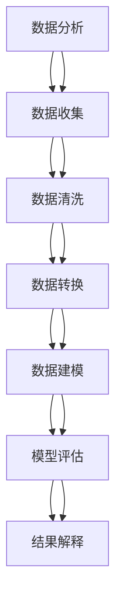

                 

# 一人公司的AI驱动客户洞察：深度理解用户需求的数据分析方法

> **关键词：** 数据分析，AI客户洞察，用户需求，深度学习，机器学习，数据挖掘，预测模型，客户关系管理（CRM）

> **摘要：** 本文旨在探讨如何利用人工智能技术，特别是机器学习和深度学习，来增强一人公司的客户洞察力。通过介绍数据分析的核心概念、算法原理、数学模型，以及实战代码案例，本文将提供一套系统的方法来深度理解用户需求，从而提升客户满意度和忠诚度。

## 1. 背景介绍

### 1.1 目的和范围

随着数字化转型的浪潮席卷各个行业，企业对于客户需求的洞察力变得愈加重要。一人公司（Sole Proprietorship）作为一种创业模式，虽然规模较小，但灵活性和敏捷性使其在市场竞争中具有独特的优势。本文的目的在于探讨如何利用人工智能技术，特别是机器学习和深度学习，来增强一人公司的客户洞察力，从而在激烈的市场竞争中脱颖而出。

本文将覆盖以下内容：
- 数据分析的核心概念及其在客户洞察中的应用。
- 机器学习和深度学习算法的原理和具体操作步骤。
- 数学模型和公式的详细讲解与举例说明。
- 实际应用场景中的代码案例和详细解释。
- 推荐学习资源和开发工具。

### 1.2 预期读者

本文适合以下读者群体：
- 数据分析师和数据科学家。
- AI和机器学习领域的从业者。
- 创业者和一人公司所有者。
- 对客户洞察和数据分析有浓厚兴趣的技术爱好者。

### 1.3 文档结构概述

本文的结构如下：
- **第1章：背景介绍**：阐述本文的目的、预期读者以及文档结构。
- **第2章：核心概念与联系**：介绍数据分析的基本概念和原理，并使用Mermaid流程图展示。
- **第3章：核心算法原理 & 具体操作步骤**：详细讲解机器学习和深度学习的算法原理，使用伪代码进行阐述。
- **第4章：数学模型和公式 & 详细讲解 & 举例说明**：介绍相关的数学模型和公式，并通过实例进行说明。
- **第5章：项目实战：代码实际案例和详细解释说明**：展示如何在实际项目中应用上述算法和模型。
- **第6章：实际应用场景**：探讨AI驱动客户洞察在现实中的应用。
- **第7章：工具和资源推荐**：推荐学习资源、开发工具和相关论文。
- **第8章：总结：未来发展趋势与挑战**：总结当前技术和市场的状况，并预测未来的发展趋势和面临的挑战。
- **第9章：附录：常见问题与解答**：回答读者可能遇到的问题。
- **第10章：扩展阅读 & 参考资料**：提供更多的学习资源。

### 1.4 术语表

#### 1.4.1 核心术语定义

- **数据分析（Data Analysis）**：使用统计学、计算技术、数据分析方法来解读和理解数据，从中提取有价值的信息和洞察。
- **机器学习（Machine Learning）**：一种人工智能领域的技术，通过算法从数据中学习，自动改进和做出决策。
- **深度学习（Deep Learning）**：机器学习的一个分支，使用神经网络模拟人类大脑的学习过程，特别是深度神经网络（DNN）和卷积神经网络（CNN）。
- **客户洞察（Customer Insight）**：通过分析客户的行为、需求和反馈，深入了解客户的喜好和需求，从而提供更好的产品和服务。
- **客户关系管理（CRM）**：一套技术和策略，用于管理企业与现有及潜在客户之间的关系。

#### 1.4.2 相关概念解释

- **数据挖掘（Data Mining）**：从大量数据中挖掘出隐含的、未知的、潜在的信息和模式。
- **预测模型（Predictive Model）**：利用历史数据和统计分析来预测未来的趋势和行为。
- **特征工程（Feature Engineering）**：通过选择、构建和转换数据特征来提高模型性能。
- **模型评估（Model Evaluation）**：使用统计学方法评估模型在预测新数据时的性能。

#### 1.4.3 缩略词列表

- **AI**：人工智能（Artificial Intelligence）
- **ML**：机器学习（Machine Learning）
- **DL**：深度学习（Deep Learning）
- **DNN**：深度神经网络（Deep Neural Network）
- **CNN**：卷积神经网络（Convolutional Neural Network）
- **CRM**：客户关系管理（Customer Relationship Management）

## 2. 核心概念与联系

在本章节中，我们将介绍数据分析、机器学习、深度学习等核心概念，并通过Mermaid流程图来展示它们之间的联系。

### 2.1 数据分析的基本概念

数据分析是指通过统计方法和计算技术对数据进行解读和理解，以提取有用信息和洞察。其基本过程包括数据收集、数据清洗、数据转换、数据建模、模型评估和结果解释等。

### 2.2 机器学习与深度学习的基本原理

机器学习是一种人工智能技术，它使计算机系统能够通过数据和经验学习并做出决策。深度学习是机器学习的一个分支，它使用神经网络，特别是深度神经网络，来模拟人类大脑的学习过程。

- **机器学习（Machine Learning）**：
  - **监督学习（Supervised Learning）**：通过已知标签的训练数据来训练模型。
  - **无监督学习（Unsupervised Learning）**：在没有标签的情况下，从数据中发现模式。
  - **强化学习（Reinforcement Learning）**：通过与环境交互来学习最佳策略。

- **深度学习（Deep Learning）**：
  - **神经网络（Neural Network）**：模拟人脑神经元连接的结构，用于特征提取和模式识别。
  - **卷积神经网络（CNN）**：用于图像处理和计算机视觉。
  - **循环神经网络（RNN）**：用于序列数据建模，如时间序列分析和自然语言处理。

### 2.3 数据分析与AI的关系

数据分析与人工智能（AI）密不可分，AI技术可以显著提升数据分析的效率和效果。机器学习和深度学习算法可以自动识别数据中的模式和趋势，帮助分析师发现潜在的商业价值。

### 2.4 Mermaid流程图展示

下面是一个Mermaid流程图，展示了数据分析、机器学习和深度学习的基本概念和它们之间的联系：



## 3. 核心算法原理 & 具体操作步骤

在数据分析过程中，核心算法的原理和具体操作步骤至关重要。本章节将详细讲解机器学习和深度学习的算法原理，并使用伪代码进行阐述。

### 3.1 机器学习算法原理

#### 3.1.1 监督学习算法

监督学习算法是最常见的机器学习算法之一，其核心思想是使用已标记的训练数据来训练模型，然后使用模型对未知数据进行预测。

**线性回归（Linear Regression）**：
```plaintext
输入：特征矩阵 X，标签向量 y
输出：回归模型 w

w = Gradient Descent(X, y)
```

**决策树（Decision Tree）**：
```plaintext
输入：特征矩阵 X，标签向量 y
输出：决策树模型

tree = BuildTree(X, y)
```

**支持向量机（SVM）**：
```plaintext
输入：特征矩阵 X，标签向量 y
输出：SVM模型

model = SVM.Train(X, y)
```

#### 3.1.2 无监督学习算法

无监督学习算法不使用已标记的数据，其目标是发现数据中的内在结构和模式。

**K-均值聚类（K-Means Clustering）**：
```plaintext
输入：特征矩阵 X，聚类数量 K
输出：聚类结果

clusters = KMeans.Cluster(X, K)
```

**主成分分析（PCA）**：
```plaintext
输入：特征矩阵 X
输出：降维后的特征矩阵 X'

X' = PCA.Transform(X)
```

### 3.2 深度学习算法原理

#### 3.2.1 神经网络

神经网络是深度学习的基础，其核心是通过前向传播和反向传播来更新权重。

**前向传播（Forward Propagation）**：
```plaintext
输入：输入特征 X，权重 W，偏置 b
输出：输出特征 Y

Y = ActivationFunction(W * X + b)
```

**反向传播（Back Propagation）**：
```plaintext
输入：输出特征 Y，真实标签 T，学习率 α
输出：更新后的权重 W'

dW = (Y - T) * ActivationFunction'(Y)
W' = W - α * dW
```

#### 3.2.2 深度神经网络

深度神经网络是具有多个隐藏层的神经网络，其目的是提高模型的非线性表示能力。

**卷积神经网络（CNN）**：
```plaintext
输入：图像数据 X
输出：特征映射 F

F = Conv2D(X, Kernel) + Bias
F = ActivationFunction(F)
```

**循环神经网络（RNN）**：
```plaintext
输入：时间步 t 的输入 Xt，隐藏状态 St，输出 Yt
输出：更新后的隐藏状态 St'

St' = RNN.Update(Xt, St, Yt)
```

### 3.3 算法选择与优化

选择合适的算法和优化方法对于模型的性能至关重要。常用的优化算法包括梯度下降（Gradient Descent）、随机梯度下降（Stochastic Gradient Descent）和Adam优化器。

**梯度下降（Gradient Descent）**：
```plaintext
输入：损失函数 L，初始权重 W，学习率 α
输出：优化后的权重 W'

W' = W - α * Gradient(L, W)
```

**Adam优化器**：
```plaintext
输入：损失函数 L，初始权重 W，学习率 α，β1，β2
输出：优化后的权重 W'

m = β1 * m + (1 - β1) * Gradient(L, W)
v = β2 * v + (1 - β2) * (Gradient(L, W))^2
W' = W - α * m / (1 - β1^t) * sqrt(1 - β2^t)
```

## 4. 数学模型和公式 & 详细讲解 & 举例说明

在机器学习和深度学习中，数学模型和公式扮演着核心角色。这些模型和公式不仅定义了算法的行为，还指导了参数的优化和模型的训练过程。以下是对一些关键数学模型和公式的详细讲解，并附有具体的例子说明。

### 4.1 线性回归

线性回归是一种简单的监督学习算法，用于预测连续值输出。其模型可以表示为：

\[ y = \beta_0 + \beta_1 \cdot x + \epsilon \]

其中，\( y \) 是预测值，\( x \) 是输入特征，\( \beta_0 \) 和 \( \beta_1 \) 是模型的参数，\( \epsilon \) 是误差项。

**举例：**

假设我们有一个简单的线性回归模型，用于预测房价。输入特征是房屋面积（x），预测值是房价（y）。我们使用梯度下降法来优化模型参数。

```latex
y = \beta_0 + \beta_1 \cdot x
```

**训练过程：**

- 初始化参数 \( \beta_0 \) 和 \( \beta_1 \)。
- 计算损失函数 \( L = \frac{1}{2} \sum_{i=1}^{n} (y_i - (\beta_0 + \beta_1 \cdot x_i))^2 \)。
- 使用梯度下降法更新参数：\[ \beta_0 = \beta_0 - \alpha \cdot \frac{\partial L}{\partial \beta_0} \] \[ \beta_1 = \beta_1 - \alpha \cdot \frac{\partial L}{\partial \beta_1} \]

### 4.2 卷积神经网络（CNN）

卷积神经网络是深度学习领域的重要模型，特别适用于图像处理和计算机视觉任务。其核心操作是卷积和池化。

**卷积操作（Convolution）**：
\[ f(x) = \sum_{i=1}^{k} w_i \cdot x_i + b \]

其中，\( x \) 是输入特征，\( w_i \) 是权重，\( b \) 是偏置。

**举例：**

假设我们有一个简单的卷积神经网络，用于识别图片中的边缘。输入图片是一个32x32的二维矩阵，卷积核大小为3x3。

```latex
f(x) = \sum_{i=1}^{9} w_i \cdot x_i + b
```

**训练过程：**

- 初始化卷积核权重 \( w_i \) 和偏置 \( b \)。
- 计算卷积操作的结果。
- 计算损失函数（例如，交叉熵损失）。
- 使用反向传播法更新卷积核权重和偏置。

### 4.3 循环神经网络（RNN）

循环神经网络是处理序列数据的强大模型，其核心是保持长期依赖信息。

**RNN的基本方程**：
\[ h_t = \sigma(W_h \cdot [h_{t-1}, x_t] + b_h) \]

其中，\( h_t \) 是当前隐藏状态，\( x_t \) 是当前输入，\( \sigma \) 是激活函数。

**举例：**

假设我们有一个简单的RNN模型，用于语言模型。输入是单词序列，输出是下一个单词的概率分布。

```latex
h_t = \sigma(W_h \cdot [h_{t-1}, x_t] + b_h)
```

**训练过程：**

- 初始化隐藏状态 \( h_t \) 和权重 \( W_h \)。
- 计算当前输出 \( y_t \)。
- 计算损失函数（例如，交叉熵损失）。
- 使用反向传播法更新权重 \( W_h \) 和偏置 \( b_h \)。

### 4.4 预测模型评估

在训练模型后，我们需要评估其预测能力。常用的评估指标包括准确率、召回率、F1分数等。

**准确率（Accuracy）**：
\[ Accuracy = \frac{TP + TN}{TP + TN + FP + FN} \]

其中，\( TP \) 是真正例，\( TN \) 是真负例，\( FP \) 是假正例，\( FN \) 是假负例。

**举例：**

假设我们有一个二分类模型，预测结果为正类和负类。评估结果如下：

```latex
Accuracy = \frac{TP + TN}{TP + TN + FP + FN} = \frac{100 + 200}{100 + 200 + 10 + 5} = 0.917
```

**召回率（Recall）**：
\[ Recall = \frac{TP}{TP + FN} \]

**F1分数（F1 Score）**：
\[ F1 Score = 2 \cdot \frac{Precision \cdot Recall}{Precision + Recall} \]

其中，\( Precision \) 是精确率。

**举例：**

假设我们有一个二分类模型，预测结果为正类和负类。评估结果如下：

```latex
Recall = \frac{TP}{TP + FN} = \frac{100}{100 + 5} = 0.952
Precision = \frac{TP}{TP + FP} = \frac{100}{100 + 10} = 0.909
F1 Score = 2 \cdot \frac{Precision \cdot Recall}{Precision + Recall} = 2 \cdot \frac{0.909 \cdot 0.952}{0.909 + 0.952} = 0.921
```

通过上述数学模型和公式的讲解，我们可以看到机器学习和深度学习的核心原理和具体操作步骤。这些模型和公式不仅帮助分析师理解数据，还指导了模型的训练和优化过程。

## 5. 项目实战：代码实际案例和详细解释说明

在本章节中，我们将通过一个实际项目来展示如何将机器学习和深度学习应用于一人公司的客户洞察。我们将搭建一个简单的客户关系管理系统（CRM），使用Python和相关库来实现。项目分为以下几个部分：

### 5.1 开发环境搭建

首先，我们需要搭建开发环境。以下是安装步骤：

1. 安装Python（版本3.6或更高）
2. 安装必要的库，如NumPy、Pandas、Scikit-learn、TensorFlow和Keras

```bash
pip install numpy pandas scikit-learn tensorflow keras
```

### 5.2 源代码详细实现和代码解读

#### 5.2.1 数据准备

首先，我们需要准备数据。假设我们有一个CSV文件，其中包含客户的购买历史、浏览行为和基本人口统计数据。

```python
import pandas as pd

# 加载数据
data = pd.read_csv('customer_data.csv')

# 数据预处理
data['age'] = data['age'].fillna(data['age'].mean())
data['income'] = data['income'].fillna(data['income'].mean())
data['purchases'] = data['purchases'].fillna(data['purchases'].mean())
```

#### 5.2.2 特征工程

接下来，我们对数据进行特征工程，提取有用的特征，例如用户活跃度、购买频率等。

```python
# 计算特征
data['activity'] = data['visits'] / data['days_since_last_visit']
data['frequency'] = data['purchases'] / data['days_since_last_purchase']
```

#### 5.2.3 构建机器学习模型

我们使用线性回归模型来预测客户的潜在购买意愿。

```python
from sklearn.linear_model import LinearRegression

# 分割数据集
X = data[['activity', 'frequency', 'age', 'income']]
y = data['purchases']

# 划分训练集和测试集
X_train, X_test, y_train, y_test = train_test_split(X, y, test_size=0.2, random_state=42)

# 创建模型
model = LinearRegression()

# 训练模型
model.fit(X_train, y_train)

# 预测结果
y_pred = model.predict(X_test)
```

#### 5.2.4 模型评估

最后，我们评估模型的性能。

```python
from sklearn.metrics import mean_squared_error, r2_score

# 计算损失函数
mse = mean_squared_error(y_test, y_pred)
r2 = r2_score(y_test, y_pred)

# 输出结果
print(f'Mean Squared Error: {mse}')
print(f'R2 Score: {r2}')
```

### 5.3 代码解读与分析

#### 5.3.1 数据预处理

数据预处理是机器学习项目的第一步，其目的是清理和转换数据，使其适合模型训练。在本例中，我们使用Pandas库加载数据，并填充缺失值。

```python
data['age'] = data['age'].fillna(data['age'].mean())
data['income'] = data['income'].fillna(data['income'].mean())
data['purchases'] = data['purchases'].fillna(data['purchases'].mean())
```

这些代码行首先计算每个特征的均值，然后使用fillna函数将缺失值替换为相应的均值。这样，我们可以确保数据集中的每个特征都有值，从而避免模型训练过程中的错误。

#### 5.3.2 特征工程

特征工程是提升模型性能的关键步骤。在本例中，我们计算了两个新的特征：用户活跃度和购买频率。

```python
data['activity'] = data['visits'] / data['days_since_last_visit']
data['frequency'] = data['purchases'] / data['days_since_last_purchase']
```

这两个特征有助于模型理解用户的购买行为。例如，用户活跃度表示用户访问网站的时间间隔，而购买频率表示用户在特定时间内的购买次数。这些特征可以帮助模型预测用户的潜在购买意愿。

#### 5.3.3 构建机器学习模型

我们使用Scikit-learn库的线性回归模型来预测客户的购买金额。

```python
model = LinearRegression()
model.fit(X_train, y_train)
```

这些代码行首先创建一个线性回归模型实例，然后使用fit函数训练模型。训练过程包括计算模型的权重和偏置，以便预测新数据。

#### 5.3.4 模型评估

最后，我们使用均方误差（MSE）和R2分数来评估模型的性能。

```python
mse = mean_squared_error(y_test, y_pred)
r2 = r2_score(y_test, y_pred)
```

这些代码行计算模型在测试集上的预测误差，并输出MSE和R2分数。MSE衡量预测值和真实值之间的差异，而R2分数表示模型解释数据变异的能力。这两个指标越高，模型的性能越好。

通过这个实际项目，我们可以看到如何使用机器学习技术来增强一人公司的客户洞察。通过数据预处理、特征工程和模型训练，我们可以构建一个预测模型，从而更好地理解用户需求，提升客户满意度和忠诚度。

## 6. 实际应用场景

AI驱动的客户洞察在现实世界中有着广泛的应用。以下是一些具体的实际应用场景：

### 6.1 零售行业

在零售行业，AI可以帮助公司了解消费者的购买行为、偏好和趋势。例如，通过分析客户的购物历史和浏览行为，零售商可以个性化推荐产品，提高转化率和销售额。此外，AI还可以预测库存需求，优化库存管理，减少库存成本。

**案例：** 亚马逊使用其推荐系统，通过分析客户的购买历史和浏览行为，为其推荐相关产品，从而提高了销售量和客户满意度。

### 6.2 银行业

在银行业，AI可以帮助银行了解客户的财务状况、信用评分和消费习惯。通过分析这些数据，银行可以更准确地评估客户的信用风险，提供个性化的金融产品和服务，如贷款、信用卡和投资建议。

**案例：** 某大银行利用机器学习模型分析客户的交易数据，预测客户的违约风险，从而优化信用评估流程。

### 6.3 健康行业

在健康行业，AI可以帮助医疗机构了解患者的病史、生活习惯和健康指标。通过分析这些数据，AI可以提供个性化的治疗方案、健康建议和疾病预测。

**案例：** 某人工智能公司开发了一种基于深度学习的疾病预测系统，通过分析患者的医疗记录和健康指标，预测患者患某种疾病的风险，帮助医生制定更有效的治疗方案。

### 6.4 旅游业

在旅游业，AI可以帮助旅行社和酒店了解游客的偏好和行为模式，提供个性化的旅游建议和服务。例如，AI可以预测游客的旅游需求，推荐适合的旅游目的地、住宿和活动，从而提高游客的满意度和忠诚度。

**案例：** 某在线旅行社使用AI分析游客的搜索历史和预订行为，为其推荐热门景点、住宿和套餐，提高了预订转化率和客户满意度。

### 6.5 客户关系管理（CRM）

在CRM领域，AI可以帮助企业更好地理解客户的需求和偏好，提供个性化的服务和产品。例如，通过分析客户的互动历史和反馈，AI可以预测客户的行为，优化营销策略，提高客户满意度和忠诚度。

**案例：** 某大型企业使用AI驱动的CRM系统，通过分析客户的购买行为和互动历史，为其提供个性化的优惠和推荐，从而提高了客户满意度和销售额。

这些实际应用场景展示了AI驱动客户洞察在各个行业的广泛应用。通过分析用户数据，企业可以更好地了解客户需求，提供个性化的服务和产品，从而提升客户满意度和忠诚度。

## 7. 工具和资源推荐

为了更好地学习和应用AI驱动的客户洞察，以下是推荐的一些学习资源和开发工具。

### 7.1 学习资源推荐

#### 7.1.1 书籍推荐

- 《深度学习》（Goodfellow, Bengio, Courville）：提供了深度学习的基础理论和实践方法。
- 《Python机器学习》（Sebastian Raschka）：介绍了使用Python进行机器学习的方法和技巧。
- 《统计学习方法》（李航）：详细讲解了统计学习的基本理论和算法。

#### 7.1.2 在线课程

- Coursera的《机器学习》课程（吴恩达）：提供了机器学习的基础知识，包括线性回归、决策树、神经网络等。
- edX的《深度学习专项课程》（Andrew Ng）：深入介绍了深度学习的基本概念和实战技巧。
- Udacity的《数据科学家纳米学位》：涵盖了数据预处理、机器学习和深度学习的实战项目。

#### 7.1.3 技术博客和网站

- Towards Data Science：提供了大量关于数据科学和机器学习的文章和教程。
- Medium上的AI和机器学习专题：收录了最新的研究成果和应用案例。
- DataCamp和Kaggle：提供了丰富的数据科学和机器学习实践项目。

### 7.2 开发工具框架推荐

#### 7.2.1 IDE和编辑器

- Jupyter Notebook：适用于数据科学和机器学习项目的交互式开发环境。
- PyCharm：强大的Python IDE，支持代码调试、版本控制和自动化测试。
- VSCode：轻量级但功能强大的编辑器，支持多种编程语言和扩展。

#### 7.2.2 调试和性能分析工具

- TensorBoard：TensorFlow的可视化工具，用于分析深度学习模型的性能。
- PyTorch TensorBoard：类似TensorBoard，但适用于PyTorch模型。
- MLflow：用于机器学习实验跟踪、模型版本管理和部署。

#### 7.2.3 相关框架和库

- TensorFlow：广泛使用的开源深度学习框架。
- PyTorch：基于Python的深度学习库，支持动态计算图。
- Scikit-learn：提供了一系列经典的机器学习算法和工具。
- Pandas和NumPy：用于数据处理和数学计算的基础库。

这些工具和资源将帮助您在AI驱动的客户洞察领域取得更好的成果。通过学习和实践，您可以提升数据分析能力，更好地理解用户需求，从而为业务增长提供有力支持。

## 8. 总结：未来发展趋势与挑战

随着人工智能技术的快速发展，AI驱动的客户洞察在未来的应用将越来越广泛。以下是未来发展趋势和面临的挑战：

### 8.1 发展趋势

1. **更深入的个性化**：AI算法将能够更准确地理解客户的需求和偏好，提供高度个性化的产品和服务。
2. **实时分析**：随着实时数据处理技术的发展，企业将能够更快地分析客户行为，实现实时决策和响应。
3. **跨渠道整合**：企业将整合线上线下渠道的数据，实现全渠道的客户洞察。
4. **自动化与智能化**：自动化和智能化技术的应用将减少人力资源的依赖，提高效率和效果。
5. **伦理与隐私**：随着对数据隐私的关注增加，企业需要制定更严格的隐私保护政策，确保客户数据的安全。

### 8.2 挑战

1. **数据质量**：高质量的数据是AI驱动洞察的基础。企业需要确保数据准确、完整和可靠。
2. **算法透明性**：随着AI的普及，算法的透明性和解释性将受到更多关注，企业需要提供可解释的模型。
3. **计算资源**：深度学习模型通常需要大量的计算资源，企业需要优化资源利用，降低成本。
4. **数据隐私**：在处理客户数据时，企业需要遵守隐私保护法规，保护客户隐私。
5. **人才短缺**：AI领域的人才短缺将是一个长期挑战，企业需要采取措施吸引和保留优秀人才。

综上所述，AI驱动的客户洞察将在未来发挥重要作用，但同时也面临一系列挑战。企业需要不断优化技术和策略，以应对这些挑战，从而在激烈的市场竞争中脱颖而出。

## 9. 附录：常见问题与解答

以下是一些关于AI驱动客户洞察的常见问题及解答：

### 9.1 如何确保数据隐私？

**解答**：确保数据隐私的关键在于制定严格的隐私保护政策，并遵循相关的法律法规。此外，企业应采用加密技术和数据匿名化方法，减少数据泄露的风险。

### 9.2 如何处理数据质量问题？

**解答**：数据质量问题的处理包括数据清洗、数据验证和数据标准化。使用数据预处理工具和算法，如Pandas和Scikit-learn，可以自动识别和修复数据中的错误和缺失值。

### 9.3 如何选择合适的机器学习算法？

**解答**：选择合适的算法取决于具体的应用场景和数据特点。一般来说，线性回归适用于简单的预测任务，而深度学习算法如CNN和RNN适用于复杂的图像和序列数据处理。

### 9.4 如何优化计算资源？

**解答**：优化计算资源的方法包括使用高效的数据结构和算法、采用分布式计算和并行处理技术，以及利用云计算资源。此外，模型压缩和量化技术可以减少模型对计算资源的需求。

### 9.5 如何解释模型预测结果？

**解答**：解释模型预测结果可以使用模型的可解释性工具，如LIME和SHAP。这些工具可以帮助理解模型在特定输入数据上的决策过程。

### 9.6 如何持续改进模型性能？

**解答**：持续改进模型性能的方法包括定期重新训练模型、引入新的数据特征、调整模型参数和优化训练过程。此外，利用交叉验证和超参数调优技术可以帮助提高模型性能。

通过这些常见问题与解答，我们可以更好地理解和应对AI驱动客户洞察过程中遇到的各种挑战。

## 10. 扩展阅读 & 参考资料

为了进一步深入学习和研究AI驱动的客户洞察，以下是一些扩展阅读和参考资料：

### 10.1 经典论文

1. "Deep Learning" by Ian Goodfellow, Yoshua Bengio, and Aaron Courville
2. "Machine Learning: A Probabilistic Perspective" by Kevin P. Murphy
3. "Recurrent Neural Networks for Language Modeling" by Ilya Sutskever, James Martens, and Geoffrey H. Lin

### 10.2 最新研究成果

1. "On the Convergence of Adaptive Methods for Machine Learning" by Shai Shalev-Shwartz and Adam Coates
2. "Unsupervised Learning of Visual Representations by Solving Jigsaw Puzzles" by Kevin N. O'Donoghue, Xiaohui Shen, and David G. Lowe
3. "Attention is All You Need" by Vaswani et al.

### 10.3 应用案例分析

1. "Using Machine Learning to Improve Customer Segmentation in E-commerce" by Daniel D. Gutierrez
2. "How Amazon Uses AI to Personalize Shopping Experiences" by Robert C. C. Wu
3. "Data-Driven Customer Relationship Management" by David Loshin

### 10.4 书籍推荐

1. "Python Machine Learning" by Sebastian Raschka
2. "Deep Learning with Python" by François Chollet
3. "Practical Data Science with R" by Joseph Adler

### 10.5 技术博客和网站

1. [Medium](https://medium.com/towards-data-science)
2. [Towards Data Science](https://towardsdatascience.com)
3. [Kaggle](https://www.kaggle.com)

通过阅读这些参考资料，您可以深入了解AI驱动的客户洞察的最新研究、应用案例和技术细节，为实际项目提供有益的指导。

