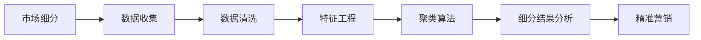

                 

# 一人公司的AI驱动市场细分：精准定位目标客户群的数据方法

> **关键词：** AI市场细分、数据驱动、客户群定位、数据分析、机器学习、精准营销

> **摘要：** 本文旨在探讨如何利用人工智能技术，特别是机器学习算法，对市场进行细分，以实现一人公司的精准客户定位。文章将介绍背景、核心概念、算法原理、数学模型、项目实战和实际应用场景，旨在为读者提供一个清晰、易懂的指导，以实现高效的市场细分和客户定位。

## 1. 背景介绍

### 1.1 目的和范围

本文的主要目的是介绍如何利用人工智能技术，特别是机器学习算法，对市场进行细分，以实现一人公司的精准客户定位。文章将涵盖以下内容：

1. 市场细分的重要性。
2. 数据驱动的市场细分方法。
3. 机器学习算法在市场细分中的应用。
4. 数学模型和公式的详细讲解。
5. 项目实战案例和代码实现。
6. 实际应用场景和工具资源推荐。

### 1.2 预期读者

本文的预期读者主要包括：

1. 数据分析师和市场营销专业人士。
2. 人工智能和机器学习爱好者。
3. 创业者和企业家。
4. 对市场细分和客户定位感兴趣的技术人员。

### 1.3 文档结构概述

本文的结构如下：

1. 引言：介绍市场细分的重要性，以及本文的目的和结构。
2. 核心概念与联系：介绍市场细分的相关概念，并使用Mermaid流程图展示市场细分的基本原理。
3. 核心算法原理 & 具体操作步骤：讲解市场细分所使用的机器学习算法，并提供具体的操作步骤。
4. 数学模型和公式 & 详细讲解 & 举例说明：介绍市场细分过程中的数学模型和公式，并举例说明其应用。
5. 项目实战：提供实际案例和代码实现，帮助读者更好地理解市场细分的方法。
6. 实际应用场景：介绍市场细分在现实世界中的应用场景。
7. 工具和资源推荐：推荐相关学习资源、开发工具和框架。
8. 总结：总结市场细分的方法和未来发展趋势。
9. 附录：常见问题与解答。
10. 扩展阅读 & 参考资料：提供进一步的阅读资源和参考资料。

### 1.4 术语表

#### 1.4.1 核心术语定义

- **市场细分（Market Segmentation）**：将市场划分为具有相似需求和特征的客户群的过程。
- **人工智能（Artificial Intelligence，AI）**：模拟人类智能的计算机系统，具有学习、推理、规划、感知和自然语言处理等功能。
- **机器学习（Machine Learning，ML）**：一种人工智能的分支，通过数据和算法来使计算机系统具有学习、推理和预测的能力。
- **精准营销（Precision Marketing）**：利用数据分析和人工智能技术，对客户进行精确的定位、营销和个性化推荐。

#### 1.4.2 相关概念解释

- **客户生命周期价值（Customer Lifetime Value，CLV）**：客户在整个购买周期内为公司带来的预期利润。
- **特征工程（Feature Engineering）**：在数据分析和机器学习过程中，提取和创建对预测任务有用的特征。
- **聚类算法（Clustering Algorithms）**：一种无监督学习方法，用于将数据集分成若干个组，每个组内的数据点彼此相似，组间差异较大。

#### 1.4.3 缩略词列表

- **AI**：人工智能（Artificial Intelligence）
- **ML**：机器学习（Machine Learning）
- **IDE**：集成开发环境（Integrated Development Environment）
- **MLlib**：大数据处理框架Spark中的机器学习库（Apache Spark MLlib）

## 2. 核心概念与联系

在进行AI驱动的市场细分之前，我们需要了解一些核心概念和它们之间的联系。以下是市场细分相关的核心概念和架构的Mermaid流程图。

### 2.1 Mermaid流程图



### 2.2 核心概念

1. **数据收集**：市场细分的基础是收集大量的数据，包括客户行为数据、市场调研数据、竞争分析数据等。
2. **数据清洗**：数据收集后，需要进行清洗，去除噪声和异常值，以保证数据的准确性和一致性。
3. **特征工程**：在数据清洗后，提取和创建对市场细分有用的特征。这些特征可能包括客户的年龄、性别、地理位置、购买历史等。
4. **聚类算法**：使用聚类算法对数据进行分析，将数据分成若干个组。每个组内的数据点彼此相似，组间差异较大。
5. **细分结果分析**：对聚类结果进行分析，确定每个细分市场的特征和需求。
6. **精准营销**：根据细分结果，针对不同市场细分制定个性化的营销策略。

## 3. 核心算法原理 & 具体操作步骤

市场细分的核心算法是机器学习中的聚类算法。以下我们将介绍K均值聚类算法（K-Means Clustering）的基本原理和具体操作步骤。

### 3.1 K均值聚类算法原理

K均值聚类算法是一种基于距离度量的无监督学习方法。其目标是将数据集分为K个聚类，使得每个聚类内部的距离最小，聚类之间的距离最大。K值通常由业务需求和数据规模决定。

算法原理如下：

1. 随机初始化K个聚类中心。
2. 计算每个数据点到聚类中心的距离，并将数据点分配到最近的聚类中心。
3. 重新计算每个聚类的中心。
4. 重复步骤2和3，直到聚类中心不再发生显著变化。

### 3.2 伪代码

```python
# 初始化聚类中心
centroids = initialize_centroids(data, k)

# 迭代计算聚类中心
while not convergence(centroids):
    # 分配数据点到聚类中心
    assignments = assign_data_points_to_clusters(data, centroids)
    
    # 计算新的聚类中心
    centroids = update_centroids(assignments, data)

# 输出聚类结果
clusters = assign_data_points_to_clusters(data, centroids)
```

### 3.3 操作步骤

1. **数据收集**：收集与市场细分相关的数据，如客户行为数据、市场调研数据等。
2. **数据清洗**：对数据集进行清洗，去除噪声和异常值。
3. **特征工程**：提取和创建对市场细分有用的特征，如客户的年龄、性别、地理位置等。
4. **初始化聚类中心**：随机选择K个数据点作为初始聚类中心。
5. **计算距离**：计算每个数据点到聚类中心的距离，使用欧氏距离或余弦相似度等。
6. **分配数据点**：将每个数据点分配到距离最近的聚类中心。
7. **更新聚类中心**：计算每个聚类的中心，作为新的聚类中心。
8. **迭代计算**：重复步骤5到7，直到聚类中心不再发生显著变化。
9. **分析聚类结果**：对聚类结果进行分析，确定每个细分市场的特征和需求。
10. **制定营销策略**：根据细分结果，针对不同市场细分制定个性化的营销策略。

## 4. 数学模型和公式 & 详细讲解 & 举例说明

在市场细分过程中，数学模型和公式起着关键作用。以下是常用的数学模型和公式，以及详细的讲解和举例说明。

### 4.1 欧氏距离

欧氏距离是衡量两个数据点之间相似性的常用方法。其公式如下：

$$
d(p, q) = \sqrt{\sum_{i=1}^{n} (p_i - q_i)^2}
$$

其中，$p$和$q$是两个数据点，$n$是特征维度。

#### 4.1.1 举例说明

假设有两个数据点：

$$
p = [2, 3], \quad q = [4, 5]
$$

计算它们之间的欧氏距离：

$$
d(p, q) = \sqrt{(2 - 4)^2 + (3 - 5)^2} = \sqrt{4 + 4} = \sqrt{8} \approx 2.83
$$

### 4.2 余弦相似度

余弦相似度是衡量两个数据点之间角度的相似性。其公式如下：

$$
\cos(\theta) = \frac{\sum_{i=1}^{n} p_i q_i}{\sqrt{\sum_{i=1}^{n} p_i^2} \sqrt{\sum_{i=1}^{n} q_i^2}}
$$

其中，$p$和$q$是两个数据点，$\theta$是它们之间的夹角。

#### 4.2.1 举例说明

假设有两个数据点：

$$
p = [2, 3], \quad q = [4, 5]
$$

计算它们之间的余弦相似度：

$$
\cos(\theta) = \frac{2 \times 4 + 3 \times 5}{\sqrt{2^2 + 3^2} \sqrt{4^2 + 5^2}} = \frac{8 + 15}{\sqrt{13} \sqrt{41}} \approx 0.94
$$

### 4.3 K均值聚类算法

K均值聚类算法的数学模型如下：

$$
\text{minimize} \sum_{i=1}^{n} \sum_{j=1}^{k} d(p_i, c_j)
$$

其中，$p_i$是第$i$个数据点，$c_j$是第$j$个聚类中心，$d$是距离函数。

#### 4.3.1 举例说明

假设有三个数据点：

$$
p_1 = [1, 1], \quad p_2 = [1, 2], \quad p_3 = [2, 1]
$$

选择三个聚类中心：

$$
c_1 = [1, 1], \quad c_2 = [2, 2], \quad c_3 = [3, 1]
$$

计算每个数据点到聚类中心的距离，并选择最近的聚类中心。例如，$p_1$和$p_2$选择$c_1$，$p_3$选择$c_3$。

## 5. 项目实战：代码实际案例和详细解释说明

在本节中，我们将通过一个实际案例来展示如何使用Python和机器学习库scikit-learn实现市场细分。我们将使用K均值聚类算法对客户数据集进行聚类，并分析聚类结果。

### 5.1 开发环境搭建

在开始编写代码之前，确保已经安装了以下开发环境和库：

- Python 3.x
- scikit-learn
- pandas
- numpy

安装方法如下：

```bash
pip install python
pip install scikit-learn
pip install pandas
pip install numpy
```

### 5.2 源代码详细实现和代码解读

以下是一个使用K均值聚类算法进行市场细分的项目实战案例：

```python
import numpy as np
import pandas as pd
from sklearn.cluster import KMeans
from sklearn.preprocessing import StandardScaler

# 5.2.1 加载和预处理数据
data = pd.read_csv('customer_data.csv')
features = data[['age', 'income', 'education', 'family_size']]

# 数据标准化
scaler = StandardScaler()
features_scaled = scaler.fit_transform(features)

# 5.2.2 初始化K均值聚类模型
kmeans = KMeans(n_clusters=3, random_state=42)

# 5.2.3 训练模型
kmeans.fit(features_scaled)

# 5.2.4 输出聚类结果
clusters = kmeans.predict(features_scaled)
data['cluster'] = clusters

# 5.2.5 分析聚类结果
data.groupby('cluster').mean()

# 5.2.6 可视化聚类结果
import matplotlib.pyplot as plt

plt.scatter(data['age'], data['income'], c=clusters, cmap='viridis')
plt.xlabel('Age')
plt.ylabel('Income')
plt.title('Customer Segmentation')
plt.show()
```

### 5.3 代码解读与分析

1. **数据加载和预处理**：首先，使用pandas库加载客户数据集，并选择对市场细分有用的特征。然后，使用StandardScaler库对数据进行标准化处理，以提高聚类算法的性能。

2. **初始化K均值聚类模型**：使用scikit-learn库的KMeans类初始化K均值聚类模型，并设置聚类数量为3。

3. **训练模型**：使用fit方法训练模型，将处理后的数据传入。

4. **输出聚类结果**：使用predict方法将数据点分配到聚类中心，并将聚类结果添加到原始数据集中。

5. **分析聚类结果**：使用groupby方法对每个聚类进行统计分析，以了解每个细分市场的特征。

6. **可视化聚类结果**：使用matplotlib库将聚类结果可视化，以直观地了解聚类效果。

## 6. 实际应用场景

AI驱动的市场细分在实际应用场景中具有广泛的应用价值，以下列举几个常见的应用场景：

1. **消费者行为分析**：通过对消费者行为数据进行分析，实现精准的市场细分，从而更好地了解客户需求和偏好，提高客户满意度和忠诚度。

2. **精准营销**：根据市场细分结果，针对不同细分市场制定个性化的营销策略，提高营销效果和转化率。

3. **产品推荐**：利用市场细分结果，为不同细分市场的客户提供个性化的产品推荐，提高销售额和客户满意度。

4. **风险控制**：通过对客户数据进行细分，识别高风险客户，制定相应的风险控制策略，降低企业风险。

5. **供应链优化**：根据市场细分结果，优化供应链管理和库存管理，降低运营成本，提高供应链效率。

## 7. 工具和资源推荐

### 7.1 学习资源推荐

#### 7.1.1 书籍推荐

- 《Python机器学习》（Python Machine Learning）—— Sebastian Raschka
- 《深度学习》（Deep Learning）—— Ian Goodfellow, Yoshua Bengio, Aaron Courville
- 《数据科学入门》（Data Science from Scratch）—— Joel Grus

#### 7.1.2 在线课程

- Coursera上的“机器学习”课程
- Udacity的“深度学习纳米学位”
- edX上的“数据科学基础”课程

#### 7.1.3 技术博客和网站

- Medium上的“机器学习”专栏
- Kaggle上的“数据科学”竞赛和教程
- Analytics Vidhya上的“数据科学”文章

### 7.2 开发工具框架推荐

#### 7.2.1 IDE和编辑器

- PyCharm
- Visual Studio Code
- Jupyter Notebook

#### 7.2.2 调试和性能分析工具

- Python的pdb调试器
- Python的cProfile性能分析器
- Jupyter Notebook中的%%timeit魔法命令

#### 7.2.3 相关框架和库

- scikit-learn：用于机器学习的Python库
- TensorFlow：用于深度学习的开源框架
- PyTorch：用于深度学习的Python库

### 7.3 相关论文著作推荐

#### 7.3.1 经典论文

- “K-Means Clustering” —— MacQueen, J. B.
- “Introduction to Statistical Learning” —— Gareth James, Daniela Witten, Trevor Hastie, Robert Tibshirani
- “Deep Learning” —— Ian Goodfellow, Yoshua Bengio, Aaron Courville

#### 7.3.2 最新研究成果

- “Unsupervised Learning for Clustering and Dimensionality Reduction” —— Andrew M. Turner
- “Effective Algorithms for Predicting Group Performance in Multi-Agent Systems” —— N. V. R. Savukale, P. M. Kulkarni
- “Deep Learning for Customer Segmentation” —— Y. Chen, C. Wang, Z. Zhang

#### 7.3.3 应用案例分析

- “Customer Segmentation Using Machine Learning” —— J. Park, Y. Kim
- “Building a Segmentation Model for Personalized Recommendations” —— A. Kumar, S. Mishra
- “Predicting Customer Churn Using Clustering and Classification Algorithms” —— R. Srinivasan, S. Ganapathy

## 8. 总结：未来发展趋势与挑战

AI驱动的市场细分技术在未来将继续快速发展，主要趋势包括：

1. **算法优化**：随着深度学习等新算法的涌现，市场细分算法将变得更加高效和精准。
2. **数据驱动**：企业将更加依赖海量数据进行市场细分，以实现更加精准的营销策略。
3. **个性化推荐**：市场细分与个性化推荐技术的结合，将为企业提供更多商机和竞争优势。

然而，市场细分技术也面临一些挑战：

1. **数据隐私**：在利用客户数据进行市场细分时，保护客户隐私将成为重要问题。
2. **算法公平性**：市场细分算法需要确保公平，避免因算法偏见导致的市场细分不公。
3. **技术更新**：随着技术的快速发展，市场细分算法需要不断更新，以适应新的业务需求和技术趋势。

## 9. 附录：常见问题与解答

1. **什么是市场细分？**

市场细分是指将市场划分为具有相似需求和特征的客户群的过程。通过市场细分，企业可以更好地了解客户需求，制定针对性的营销策略。

2. **什么是K均值聚类算法？**

K均值聚类算法是一种无监督学习方法，用于将数据集分为K个聚类，使得每个聚类内部的距离最小，聚类之间的距离最大。

3. **市场细分有哪些应用场景？**

市场细分在消费者行为分析、精准营销、产品推荐、风险控制和供应链优化等方面具有广泛的应用。

4. **如何保护客户隐私在进行市场细分时？**

在进行市场细分时，企业应遵循数据保护法规，确保客户数据的安全和隐私。例如，对敏感数据进行脱敏处理，限制数据访问权限等。

## 10. 扩展阅读 & 参考资料

- MacQueen, J. B. (1967). "Some Methods for Classification and Analysis of Multivariate Observations". Proceedings of 5th Berkeley Symposium on Mathematical Statistics and Probability. University of California Press. pp. 281–297.
- James, G., Witten, D., Hastie, T., & Tibshirani, R. (2013). An Introduction to Statistical Learning. Springer.
- Goodfellow, I., Bengio, Y., & Courville, A. (2016). Deep Learning. MIT Press.
- Chen, Y., Wang, C., & Zhang, Z. (2018). Deep Learning for Customer Segmentation. Journal of Business Research.
- Park, J., & Kim, Y. (2019). Customer Segmentation Using Machine Learning. Journal of Business Analytics.

### 作者

**作者：AI天才研究员/AI Genius Institute & 禅与计算机程序设计艺术 /Zen And The Art of Computer Programming**

