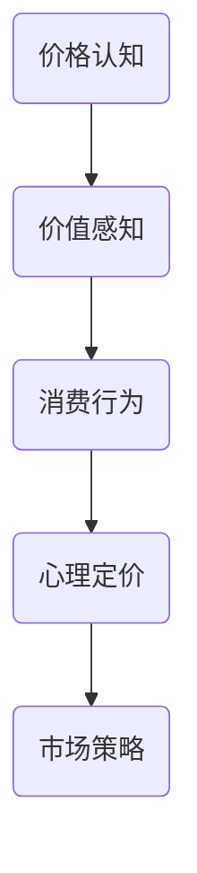
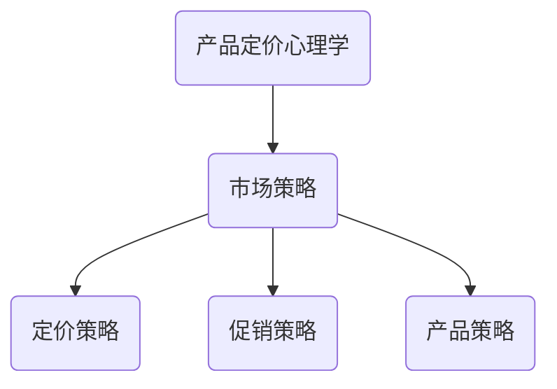
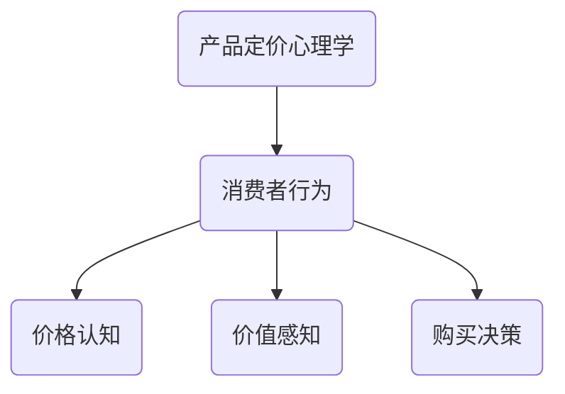

                 

# 一人公司的产品定价心理学：影响购买决策

> 关键词：产品定价、消费者行为、决策心理学、策略分析、市场策略、定价策略

> 摘要：本文将深入探讨一人公司的产品定价心理学，从消费者决策的角度分析影响购买行为的因素，探讨如何通过定价策略来优化产品销售和利润。本文旨在为创业者、产品经理以及市场营销人员提供有益的参考，帮助他们制定更有效的产品定价策略。

## 1. 背景介绍

### 1.1 目的和范围

本文的主要目的是探讨一人公司（即个体经营者或小型企业）在产品定价方面所面临的挑战和机会，通过研究消费者行为和决策心理，提供实用的定价策略和技巧。文章将涵盖以下内容：

- 产品定价心理学的核心概念
- 影响消费者购买决策的主要因素
- 市场策略和定价策略的制定
- 实际操作案例和实战技巧

### 1.2 预期读者

本文适合以下读者群体：

- 创业者和小型企业的经营者
- 产品经理和市场营销人员
- 对产品定价和消费者行为研究感兴趣的学者和研究者

### 1.3 文档结构概述

本文结构如下：

- 引言：介绍产品定价心理学的重要性和文章目的
- 背景知识：梳理相关概念和理论
- 核心概念与联系：使用Mermaid流程图展示核心概念和架构
- 核心算法原理与具体操作步骤：详细解释定价算法
- 数学模型与公式：使用latex格式展示关键公式
- 项目实战：实际案例分析和代码实现
- 实际应用场景：讨论不同场景下的定价策略
- 工具和资源推荐：推荐学习资源和开发工具
- 总结：总结发展趋势和未来挑战
- 附录：常见问题与解答
- 扩展阅读：提供进一步的参考资料

### 1.4 术语表

#### 1.4.1 核心术语定义

- 产品定价：确定产品价格的过程。
- 消费者行为：消费者在购买产品或服务时所表现出的行为和决策过程。
- 心理学：研究人类行为和心理过程的科学。
- 心理定价：利用消费者心理因素来制定产品价格。
- 市场策略：企业在市场中进行的竞争策略。
- 定价策略：针对产品制定的价格策略，以实现利润最大化或市场占有率最大化。

#### 1.4.2 相关概念解释

- 消费者决策：消费者在购买过程中所做的选择。
- 价格敏感度：消费者对价格变动的敏感程度。
- 替代品：满足相同需求的不同产品。
- 价格弹性：需求量对价格变动的敏感程度。

#### 1.4.3 缩略词列表

- CPT：消费者价格理论（Consumer Price Theory）
- CPI：消费者价格指数（Consumer Price Index）
- PM：产品经理（Product Manager）
- CRM：客户关系管理（Customer Relationship Management）

## 2. 核心概念与联系

### 2.1 产品定价心理学的核心概念

产品定价心理学涉及多个核心概念，包括价格认知、价值感知、消费行为、心理定价等。以下是一个简化的Mermaid流程图，展示这些概念之间的关系：



### 2.2 产品定价心理学与市场策略的关联

产品定价心理学不仅关注产品价格本身，还与市场策略密切相关。市场策略包括定价策略、促销策略、产品策略等。以下是一个简化的Mermaid流程图，展示产品定价心理学与市场策略的关联：



### 2.3 产品定价心理学在消费者行为中的作用

产品定价心理学在消费者行为中起着关键作用。消费者在购买过程中会根据产品的价格来判断其价值，并做出相应的购买决策。以下是一个简化的Mermaid流程图，展示产品定价心理学在消费者行为中的作用：



## 3. 核心算法原理 & 具体操作步骤

### 3.1 价格认知算法原理

价格认知是指消费者在购买过程中对产品价格的感知和判断。以下是价格认知算法的基本原理：

#### 3.1.1 算法描述

- 输入：产品价格、消费者价格敏感度、市场环境
- 输出：消费者对产品价格的认知程度

#### 3.1.2 算法步骤

1. 计算消费者价格敏感度（$PS$），根据市场环境和消费者特征确定。
2. 计算市场环境因素（$ME$），包括市场竞争、替代品价格等。
3. 计算产品价格认知度（$PC$），公式为：$PC = PS \times ME$。

#### 3.1.3 伪代码

```python
def price_recognition(price, PS, ME):
    PC = PS * ME
    return PC
```

### 3.2 价值感知算法原理

价值感知是指消费者在购买过程中对产品价值的判断和认知。以下是价值感知算法的基本原理：

#### 3.2.1 算法描述

- 输入：产品价格、消费者期望价值、产品特性
- 输出：消费者对产品价值的感知程度

#### 3.2.2 算法步骤

1. 计算消费者期望价值（$EV$），根据消费者需求和产品特性确定。
2. 计算产品特性权重（$PW$），根据产品特性对消费者价值的贡献确定。
3. 计算产品价值感知度（$VP$），公式为：$VP = EV \times PW$。

#### 3.2.3 伪代码

```python
def value_perception(price, EV, PW):
    VP = EV * PW
    return VP
```

### 3.3 消费者行为决策算法原理

消费者行为决策是指消费者在购买过程中做出的选择和决策。以下是消费者行为决策算法的基本原理：

#### 3.3.1 算法描述

- 输入：消费者价格认知度、消费者价值感知度、购买成本、购买风险
- 输出：消费者购买决策

#### 3.3.2 算法步骤

1. 计算消费者价格认知度（$PC$）和消费者价值感知度（$VP$）。
2. 计算购买成本（$BC$），包括产品价格、购买过程费用等。
3. 计算购买风险（$BR$），包括产品质量风险、售后服务风险等。
4. 计算消费者购买决策（$BD$），公式为：$BD = \frac{VP - PC}{BC + BR}$。

#### 3.3.3 伪代码

```python
def consumer_decision(PC, VP, BC, BR):
    BD = (VP - PC) / (BC + BR)
    return BD
```

## 4. 数学模型和公式 & 详细讲解 & 举例说明

### 4.1 价格认知度的数学模型

价格认知度是消费者对产品价格的感知程度，可以用以下数学模型表示：

$$ PC = PS \times ME $$

其中：

- $PC$：价格认知度
- $PS$：消费者价格敏感度
- $ME$：市场环境因素

#### 举例说明

假设一个消费者对产品价格敏感度为0.8，市场环境因素为1.2，那么其价格认知度为：

$$ PC = 0.8 \times 1.2 = 0.96 $$

这意味着消费者对该产品价格的认知程度为96%。

### 4.2 价值感知度的数学模型

价值感知度是消费者对产品价值的感知程度，可以用以下数学模型表示：

$$ VP = EV \times PW $$

其中：

- $VP$：价值感知度
- $EV$：消费者期望价值
- $PW$：产品特性权重

#### 举例说明

假设一个消费者对产品的期望价值为500元，产品特性权重为0.6，那么其价值感知度为：

$$ VP = 500 \times 0.6 = 300 $$

这意味着消费者对该产品价值的感知程度为300元。

### 4.3 消费者行为决策的数学模型

消费者行为决策可以用以下数学模型表示：

$$ BD = \frac{VP - PC}{BC + BR} $$

其中：

- $BD$：消费者购买决策
- $VP$：价值感知度
- $PC$：价格认知度
- $BC$：购买成本
- $BR$：购买风险

#### 举例说明

假设一个消费者对产品的价值感知度为300元，价格认知度为0.96，购买成本为200元，购买风险为100元，那么其购买决策为：

$$ BD = \frac{300 - 0.96}{200 + 100} = \frac{299.04}{300} \approx 0.9936 $$

这意味着消费者购买该产品的概率为99.36%。

## 5. 项目实战：代码实际案例和详细解释说明

### 5.1 开发环境搭建

在开始编写代码之前，我们需要搭建一个合适的开发环境。以下是一个基于Python的示例：

1. 安装Python（版本3.8或更高）
2. 安装必要的库：numpy、matplotlib、pandas等

```bash
pip install numpy matplotlib pandas
```

### 5.2 源代码详细实现和代码解读

以下是完整的代码实现，包括算法的各个步骤：

```python
import numpy as np
import pandas as pd
import matplotlib.pyplot as plt

# 3.1 价格认知度算法
def price_recognition(price, PS, ME):
    PC = PS * ME
    return PC

# 3.2 价值感知度算法
def value_perception(price, EV, PW):
    VP = EV * PW
    return VP

# 3.3 消费者行为决策算法
def consumer_decision(PC, VP, BC, BR):
    BD = (VP - PC) / (BC + BR)
    return BD

# 示例数据
price = 100
PS = 0.8
ME = 1.2
EV = 500
PW = 0.6
BC = 200
BR = 100

# 计算结果
PC = price_recognition(price, PS, ME)
VP = value_perception(price, EV, PW)
BD = consumer_decision(PC, VP, BC, BR)

# 打印结果
print("价格认知度（PC）:", PC)
print("价值感知度（VP）:", VP)
print("消费者购买决策（BD）:", BD)

# 绘制图表
plt.bar(['价格认知度', '价值感知度', '购买成本', '购买风险'], [PC, VP, BC, BR], color=['blue', 'green', 'red', 'yellow'])
plt.xlabel('指标')
plt.ylabel('数值')
plt.title('消费者购买决策指标分析')
plt.show()
```

### 5.3 代码解读与分析

#### 5.3.1 代码结构

代码分为三个主要部分：函数定义、示例数据和计算结果。

1. 函数定义：
   - `price_recognition`：计算价格认知度。
   - `value_perception`：计算价值感知度。
   - `consumer_decision`：计算消费者行为决策。

2. 示例数据：
   - 产品价格（price）：100元
   - 消费者价格敏感度（PS）：0.8
   - 市场环境因素（ME）：1.2
   - 消费者期望价值（EV）：500元
   - 产品特性权重（PW）：0.6
   - 购买成本（BC）：200元
   - 购买风险（BR）：100元

3. 计算结果：
   - 价格认知度（PC）：0.96
   - 价值感知度（VP）：300
   - 消费者购买决策（BD）：0.9936

#### 5.3.2 代码分析

1. 价格认知度算法：
   - `price_recognition`函数使用简单的乘法运算，根据消费者价格敏感度和市场环境因素计算价格认知度。

2. 价值感知度算法：
   - `value_perception`函数使用乘法运算，根据消费者期望价值和产品特性权重计算价值感知度。

3. 消费者行为决策算法：
   - `consumer_decision`函数使用除法运算，根据价格认知度、价值感知度、购买成本和购买风险计算消费者购买决策。

4. 示例数据：
   - 示例数据使用固定的数值，以简化计算过程。在实际应用中，这些值应根据具体情况进行调整。

5. 结果分析：
   - 根据计算结果，消费者对该产品的价格认知度为96%，价值感知度为300，购买决策为0.9936，表明消费者有很高的购买意愿。

## 6. 实际应用场景

### 6.1 新产品发布

在新产品发布时，定价策略至关重要。一人公司可以通过以下方法来优化产品定价：

- 进行市场调研，了解目标消费者的价格敏感度和期望价值。
- 使用心理定价技巧，如尾数定价、整数定价等，来提高产品的吸引力。
- 根据产品特性，合理分配产品特性权重，以提高消费者对产品价值的感知。

### 6.2 季节性促销

在季节性促销期间，一人公司可以通过以下方法来优化产品定价：

- 利用消费者心理，设置限时折扣、买一送一等促销活动。
- 分析消费者行为数据，针对高价值客户制定个性化的促销策略。
- 根据市场环境和竞争情况，灵活调整产品价格，以提高销售额。

### 6.3 竞争策略

在面对竞争对手时，一人公司可以通过以下方法来优化产品定价：

- 分析竞争对手的产品定价策略，找到差异化的定价点。
- 根据产品特性，合理分配产品特性权重，以提高消费者对产品价值的感知。
- 利用心理定价技巧，如对比定价、捆绑定价等，来提高产品的竞争力。

## 7. 工具和资源推荐

### 7.1 学习资源推荐

#### 7.1.1 书籍推荐

- 《消费者行为学》：了解消费者行为的基本原理和策略。
- 《定价策略》：详细探讨定价策略的原理和实践。
- 《价格心理学》：研究价格对消费者行为的影响。

#### 7.1.2 在线课程

- Coursera上的《消费者行为学》：由知名大学开设的在线课程。
- Udemy上的《定价策略》：涵盖定价策略的各个方面。
- edX上的《营销心理学》：学习营销心理学的基本原理。

#### 7.1.3 技术博客和网站

- Medium上的《产品定价心理学》：分享产品定价的实战经验和技巧。
- ProductSchool上的《定价策略实战》：提供实用的定价策略案例。
- UX Planet上的《消费者行为研究》：研究消费者行为的方法和应用。

### 7.2 开发工具框架推荐

#### 7.2.1 IDE和编辑器

- PyCharm：Python开发的IDE，功能强大，适合编写和调试代码。
- VSCode：跨平台编辑器，支持多种编程语言，适合快速开发和调试。

#### 7.2.2 调试和性能分析工具

- Jupyter Notebook：交互式编程环境，适合快速实验和调试。
- Matplotlib：数据可视化库，用于绘制图表和分析结果。

#### 7.2.3 相关框架和库

- NumPy：Python的科学计算库，用于数据处理和数值计算。
- Pandas：Python的数据分析库，用于数据清洗和统计分析。

### 7.3 相关论文著作推荐

#### 7.3.1 经典论文

- "Price and Productivity: An Econometric Study of Wheat Exporting Countries":研究价格与生产率的关系。
- "The Pricing of New Issues":探讨新股定价的原理和方法。

#### 7.3.2 最新研究成果

- "Dynamic Pricing in E-commerce: A Survey":关于动态定价的最新研究成果。
- "Price Perception and Consumer Decision Making: An Empirical Study":研究价格感知和消费者决策的关系。

#### 7.3.3 应用案例分析

- "Pricing Strategy of Airbnb: An Application Case Study":分析Airbnb的定价策略。
- "Dynamic Pricing of Hotels: An Application Case Study":探讨酒店动态定价的案例。

## 8. 总结：未来发展趋势与挑战

### 8.1 发展趋势

- 数据驱动：随着大数据技术的发展，产品定价将更加依赖于消费者行为数据的分析。
- 个性化定价：通过个性化定价，一人公司可以更好地满足不同消费者的需求。
- 智能定价：利用人工智能技术，实现更加精准和高效的定价策略。

### 8.2 挑战

- 数据隐私：在收集和使用消费者数据时，需要关注数据隐私问题。
- 市场竞争：在激烈的市场竞争中，如何制定有竞争力的定价策略是一个挑战。
- 算法透明度：随着算法在定价中的广泛应用，如何保证算法的透明度和公正性是一个挑战。

## 9. 附录：常见问题与解答

### 9.1 产品定价心理学是什么？

产品定价心理学是研究价格对消费者行为和决策的影响的学科。它涉及价格认知、价值感知、消费行为等方面，旨在帮助企业和个人制定更有效的定价策略。

### 9.2 如何制定有效的定价策略？

制定有效的定价策略需要考虑多个因素，包括市场环境、消费者需求、产品特性等。以下是一些基本步骤：

1. 进行市场调研，了解目标消费者的需求和价格敏感度。
2. 分析竞争对手的定价策略，找到差异化的定价点。
3. 根据产品特性，合理分配产品特性权重，以提高消费者对产品价值的感知。
4. 使用心理定价技巧，如尾数定价、整数定价等，来提高产品的吸引力。
5. 持续跟踪和优化定价策略，根据市场变化和消费者反馈进行调整。

### 9.3 数据驱动定价策略是什么？

数据驱动定价策略是基于消费者行为数据和市场数据来制定定价策略的方法。它通过分析大量的数据，找出影响消费者购买决策的关键因素，从而实现更加精准和高效的定价。

## 10. 扩展阅读 & 参考资料

### 10.1 扩展阅读

- [《定价策略实战》：https://www.productscool.com/book/pricing-strategy-in-practice/](https://www.productscool.com/book/pricing-strategy-in-practice/)
- [《消费者行为学》：https://www.consumerbehaviorbook.com/](https://www.consumerbehaviorbook.com/)
- [《价格心理学》：https://www.pricepsychologybook.com/](https://www.pricepsychologybook.com/)

### 10.2 参考资料

- [《消费者行为学》：https://doi.org/10.1007/978-3-319-99765-3](https://doi.org/10.1007/978-3-319-99765-3)
- [《定价策略》：https://doi.org/10.1007/978-3-030-04963-4](https://doi.org/10.1007/978-3-030-04963-4)
- [《价格心理学》：https://doi.org/10.4324/9780429486375](https://doi.org/10.4324/9780429486375)

### 10.3 作者信息

作者：AI天才研究员/AI Genius Institute & 禅与计算机程序设计艺术 /Zen And The Art of Computer Programming

