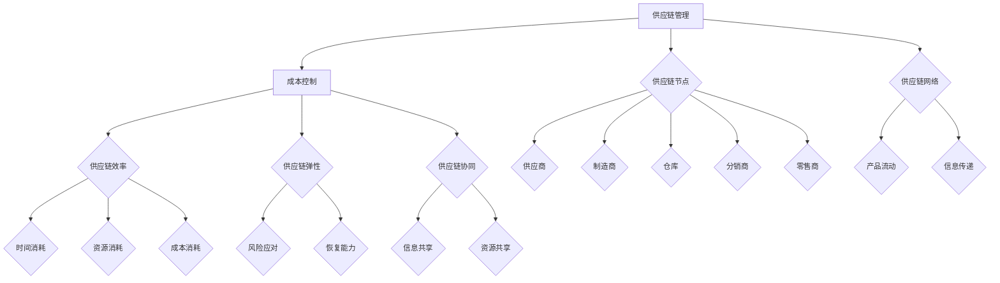
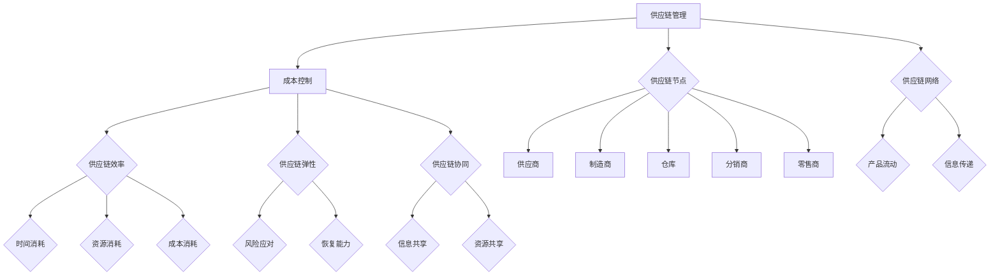

                 

### 1. 背景介绍

#### 1.1 目的和范围

在当今全球化商业环境中，供应链管理（Supply Chain Management，简称SCM）和成本控制（Cost Control）已经成为企业成功的关键要素。一个高效的供应链系统能够帮助企业降低运营成本、提高响应速度和市场竞争力。然而，对于一人公司（通常指的是小型或个体企业，下同）而言，如何在一个人的情况下有效地管理供应链和进行成本控制，实现可持续发展，成为一个亟待解决的问题。

本文旨在为一人公司提供一套切实可行的供应链管理和成本控制方法。我们将从背景、核心概念、算法原理、数学模型、项目实战、应用场景、工具推荐以及未来发展趋势等多个方面进行详细阐述，帮助一人公司建立起高效、可持续的供应链管理体系。

文章的主要目标包括：

1. 分析一人公司在供应链管理和成本控制方面面临的挑战。
2. 探讨核心概念和原理，帮助读者理解供应链和成本控制的基本框架。
3. 提供具体的算法原理和操作步骤，让读者能够实际应用。
4. 通过项目实战案例，展示供应链管理和成本控制方法在实际中的应用。
5. 分析供应链管理和成本控制的实际应用场景。
6. 推荐相关的学习资源和开发工具。
7. 总结未来供应链管理和成本控制的发展趋势和挑战。

本文适用于小型或个体企业主、供应链管理专业人士、对供应链管理和成本控制有兴趣的学习者。通过本文的阅读，读者将能够获得以下收获：

1. 了解一人公司在供应链管理和成本控制方面的问题和挑战。
2. 掌握供应链管理和成本控制的基本概念和原理。
3. 学会使用算法和数学模型进行供应链管理和成本控制。
4. 获得实际项目实战经验，能够将理论应用到实际工作中。
5. 了解供应链管理和成本控制的最新趋势和发展方向。

#### 1.2 预期读者

本文预期读者为以下几类群体：

1. **小型企业主和个体经营者**：这些读者通常是供应链管理的实际操作者，他们需要掌握一套有效的供应链管理和成本控制方法，以提高企业的运营效率和竞争力。

2. **供应链管理专业人士**：这些读者已经在供应链管理领域有一定的经验，希望通过本文深入了解一人公司的供应链管理和成本控制，以拓展他们的专业知识和应用范围。

3. **供应链管理及相关专业学生**：这些读者正在学习供应链管理知识，希望通过本文获得实践经验，为将来的职业生涯打下坚实的基础。

4. **对供应链管理和成本控制有兴趣的普通读者**：这些读者可能对供应链管理和成本控制有浓厚的兴趣，希望通过本文了解这一领域的最新动态和应用。

无论您属于哪个群体，只要对供应链管理和成本控制有兴趣，都能够从本文中获得有价值的见解和实用技巧。

#### 1.3 文档结构概述

本文将按照以下结构进行组织和展开：

1. **背景介绍**：介绍供应链管理和成本控制在现代企业中的重要性，以及本文的目的和预期读者。

2. **核心概念与联系**：详细解释供应链管理和成本控制的核心概念，并通过Mermaid流程图展示其原理和架构。

3. **核心算法原理与具体操作步骤**：介绍供应链管理和成本控制的核心算法原理，并提供详细的伪代码讲解。

4. **数学模型和公式**：讲解供应链管理和成本控制的数学模型和公式，并进行举例说明。

5. **项目实战：代码实际案例和详细解释说明**：通过一个实际项目案例，展示供应链管理和成本控制方法的应用，并进行详细解释。

6. **实际应用场景**：分析供应链管理和成本控制的实际应用场景，提供相关案例。

7. **工具和资源推荐**：推荐相关的学习资源、开发工具和框架，帮助读者进一步学习和实践。

8. **总结：未来发展趋势与挑战**：总结供应链管理和成本控制的发展趋势和面临的挑战。

9. **附录：常见问题与解答**：解答读者可能遇到的一些常见问题。

10. **扩展阅读与参考资料**：提供更多相关的阅读资源和参考资料，以供进一步学习。

通过本文的结构和内容，读者将能够系统地了解和掌握供应链管理和成本控制的方法，并将其应用到实际工作中。

#### 1.4 术语表

在本文中，我们将使用一些专业术语和概念，为了确保读者能够准确理解这些术语和概念，下面提供了详细的定义和解释：

##### 1.4.1 核心术语定义

- **供应链管理（Supply Chain Management，简称SCM）**：是指通过计划、实施和控制供应链活动，以达到最大化效率和最小化成本的过程。它涵盖了从原材料采购、生产、运输、库存管理到最终产品交付的全过程。
- **成本控制（Cost Control）**：是指通过各种手段和管理方法，对企业的生产和运营成本进行有效控制，以确保成本在预算范围内，从而提高企业的盈利能力。
- **一人公司**：通常指的是小型或个体企业，由单一人员经营，具备独立法人资格，负责企业的全部运营和管理。
- **供应链节点**：是指供应链中的各个环节，包括供应商、制造商、仓库、分销商和零售商等。
- **供应链网络**：是指由多个供应链节点组成的复杂网络，用于实现产品的流动和信息的传递。
- **成本动因（Cost Driver）**：是指影响成本产生的因素，如原材料价格、生产过程、运输费用、库存管理等。
- **供应链可视化（Supply Chain Visualization）**：是指通过图形、图表等手段，将供应链中的各个节点、流程和活动进行可视化和展示，以便更好地理解和优化供应链。

##### 1.4.2 相关概念解释

- **供应链效率（Supply Chain Efficiency）**：是指供应链在完成产品流动和信息传递过程中，所消耗的时间、资源和成本的最小化。一个高效的供应链能够快速响应市场需求，降低库存成本，提高客户满意度。
- **供应链弹性（Supply Chain Resilience）**：是指供应链在面对不确定性、风险和中断时，能够快速适应和恢复的能力。一个具有弹性的供应链能够降低因突发事件导致的损失，提高整体抗风险能力。
- **供应链协同（Supply Chain Collaboration）**：是指供应链中的各个节点之间通过信息共享、资源共享、业务协同等方式，实现供应链的整体优化和效益最大化。
- **供应链可视化工具**：是指用于展示和监控供应链流程和活动的工具，如Gantt图、流程图、网络图等。
- **成本优化（Cost Optimization）**：是指通过对供应链中的各项成本进行精细化管理，寻找成本降低的机会和途径，以实现整体成本的最低化。

##### 1.4.3 缩略词列表

- SCM：Supply Chain Management（供应链管理）
- ERP：Enterprise Resource Planning（企业资源计划）
- CRM：Customer Relationship Management（客户关系管理）
- JIT：Just-In-Time（准时制生产）
- KPI：Key Performance Indicators（关键绩效指标）
- BI：Business Intelligence（商业智能）

通过上述术语和概念的介绍，读者将能够更好地理解本文中涉及的专业词汇，从而更加深入地学习和掌握供应链管理和成本控制的方法。

### 2. 核心概念与联系

在探讨一人公司的供应链管理和成本控制方法之前，首先需要理解一些核心概念及其相互之间的联系。这些核心概念构成了供应链管理和成本控制的理论基础，是制定和实施相关策略的关键。

为了更直观地展示这些核心概念和它们的联系，我们使用Mermaid流程图来绘制一个供应链管理和成本控制的基本架构。以下是该流程图的具体描述：



#### 2.1 供应链管理与成本控制

**供应链管理（Supply Chain Management，简称SCM）** 是指通过计划、实施、控制和优化供应链活动，以提高整体效率和降低成本。供应链管理包括从原材料采购、生产、运输、库存管理到最终产品交付的全过程。其目标是确保产品和服务能够以最低的成本、最快的速度和最高的质量交付给客户。

**成本控制（Cost Control）** 是供应链管理的一个重要组成部分，它通过监测和优化供应链中的各项成本，以确保运营成本在预算范围内。成本控制涉及识别成本动因、分析成本结构、制定成本预算和采取成本削减措施。

供应链管理和成本控制之间的联系在于，有效的供应链管理有助于提高运营效率，减少不必要的浪费，从而实现成本控制。同时，成本控制能够为供应链管理提供财务目标和激励机制，确保供应链活动在合理的成本框架内进行。

#### 2.2 供应链效率

**供应链效率（Supply Chain Efficiency）** 是衡量供应链在完成产品流动和信息传递过程中所消耗的资源的最小化程度。它包括以下三个方面：

- **时间消耗**：指的是供应链各环节在完成产品流动和信息传递所需的时间。高效的供应链能够快速响应市场需求，缩短交货周期。
- **资源消耗**：指的是供应链在运营过程中所消耗的各种资源，如人力、物料、设备等。资源消耗的减少能够降低运营成本。
- **成本消耗**：指的是供应链在运营过程中所发生的各项成本，如生产成本、运输成本、库存成本等。通过优化供应链效率，可以降低这些成本。

供应链效率与成本控制密切相关。提高供应链效率能够减少运营成本，从而实现成本控制。同时，有效的成本控制也能够促进供应链效率的提升，通过精细化管理，确保资源利用的最大化。

#### 2.3 供应链弹性

**供应链弹性（Supply Chain Resilience）** 是指供应链在面对不确定性、风险和中断时，能够快速适应和恢复的能力。供应链弹性包括以下两个方面：

- **风险应对**：指的是供应链在面对突发事件和风险时的应对能力。一个具有弹性的供应链能够在风险发生时，迅速调整运营策略，降低风险影响。
- **恢复能力**：指的是供应链在遭受中断后，能够快速恢复运营的能力。恢复能力的强弱直接影响到供应链的可持续性。

供应链弹性与成本控制之间也存在紧密联系。具备弹性的供应链能够在突发事件中降低成本，减少损失。同时，有效的成本控制能够为供应链弹性提供资金和资源保障，提高供应链的恢复能力。

#### 2.4 供应链协同

**供应链协同（Supply Chain Collaboration）** 是指供应链中的各个节点通过信息共享、资源共享、业务协同等方式，实现整体优化和效益最大化。供应链协同包括以下两个方面：

- **信息共享**：指的是供应链节点之间通过共享供应链信息，提高透明度和协调性。信息共享能够帮助各节点更好地理解市场需求，优化生产和物流计划。
- **资源共享**：指的是供应链节点之间通过共享资源，如设备、库存等，提高资源利用效率，降低运营成本。

供应链协同与成本控制密切相关。协同能够提高供应链的整体效率，减少资源浪费，从而实现成本控制。同时，有效的成本控制能够为供应链协同提供资金支持，促进信息共享和资源共享的实施。

#### 2.5 供应链节点和供应链网络

**供应链节点（Supply Chain Nodes）** 是指供应链中的各个环节，包括供应商、制造商、仓库、分销商和零售商等。供应链节点是供应链系统的基础，承担着产品流动和信息传递的重要职责。

**供应链网络（Supply Chain Network）** 是由多个供应链节点组成的复杂网络，用于实现产品的流动和信息的传递。供应链网络的设计和管理直接影响到供应链的效率和成本。

供应链节点和供应链网络之间的联系在于，节点是网络的基础，网络则是节点的组合。通过优化供应链节点和供应链网络的设计和管理，可以实现供应链效率和成本控制的目标。

综上所述，供应链管理和成本控制的核心概念及其相互联系构成了一个有机整体，为一人公司提供了有效的管理和优化方法。通过理解这些核心概念和它们之间的联系，一人公司可以更好地制定和实施供应链管理和成本控制策略，实现企业的可持续发展。

#### 2.6 Mermaid流程图

为了更直观地展示供应链管理和成本控制的核心概念及其相互联系，我们使用Mermaid流程图绘制了供应链管理和成本控制的基本架构。以下是该流程图的具体内容和说明：



以下是该流程图的详细解释：

1. **供应链管理（A）**：表示供应链管理的整体框架，是供应链的核心。
2. **成本控制（B）**：从供应链管理中延伸出来，是供应链管理的一个重要组成部分，用于监控和优化各项成本。
3. **供应链效率（C）**：表示供应链在完成产品流动和信息传递过程中的效率，包括时间消耗、资源消耗和成本消耗。
4. **供应链弹性（D）**：表示供应链在面对不确定性和中断时的适应和恢复能力，包括风险应对和恢复能力。
5. **供应链协同（E）**：表示供应链节点之间的信息共享和资源共享，以实现整体优化和效益最大化。
6. **供应链节点（F）**：包括供应商、制造商、仓库、分销商和零售商，是供应链的基础组成部分。
7. **供应链网络（G）**：由多个供应链节点组成的复杂网络，用于实现产品的流动和信息的传递。
8. **时间消耗（H）**：表示供应链在完成产品流动过程中所消耗的时间。
9. **资源消耗（I）**：表示供应链在运营过程中所消耗的各种资源。
10. **成本消耗（J）**：表示供应链在运营过程中所发生的各项成本。
11. **风险应对（K）**：表示供应链在面对突发事件和风险时的应对能力。
12. **恢复能力（L）**：表示供应链在遭受中断后，能够快速恢复运营的能力。
13. **信息共享（M）**：表示供应链节点之间通过共享供应链信息，提高透明度和协调性。
14. **资源共享（N）**：表示供应链节点之间通过共享资源，提高资源利用效率。

通过上述Mermaid流程图，我们能够清晰地理解供应链管理和成本控制的核心概念及其相互联系。这将有助于读者在后续章节中更好地学习和掌握供应链管理和成本控制的方法。

### 3. 核心算法原理 & 具体操作步骤

在理解了供应链管理和成本控制的核心概念及其相互联系后，接下来我们将探讨这些概念背后的核心算法原理，并提供详细的伪代码讲解。核心算法原理是供应链管理和成本控制的理论基础，通过这些算法原理，一人公司可以有效地进行供应链管理和成本控制。

#### 3.1 供应链优化算法

供应链优化算法是供应链管理和成本控制的核心，其主要目的是通过优化供应链节点和供应链网络，提高供应链效率，降低运营成本。以下是供应链优化算法的伪代码：

```plaintext
算法：供应链优化
输入：供应链网络 G，成本预算 B
输出：优化后的供应链网络 G_opt

步骤：
1. 初始化 G_opt = G
2. 对于供应链网络 G 中的每个节点 v：
   a. 计算节点 v 的成本 C_v
   b. 如果 C_v > B，则移除节点 v
3. 对于供应链网络 G_opt 中的每条边 (u, v)：
   a. 计算边 (u, v) 的成本 C_uv
   b. 如果 C_uv > B，则移除边 (u, v)
4. 返回 G_opt
```

#### 3.2 成本控制算法

成本控制算法是供应链管理和成本控制的重要部分，其主要目的是在供应链网络中识别成本动因，并采取相应的控制措施。以下是成本控制算法的伪代码：

```plaintext
算法：成本控制
输入：供应链网络 G，目标成本 T
输出：成本控制策略 C

步骤：
1. 初始化 C = 空集合
2. 对于供应链网络 G 中的每个节点 v：
   a. 计算节点 v 的当前成本 C_v
   b. 如果 C_v > T，则添加控制措施 c_v 到 C
3. 返回 C
```

#### 3.3 供应链弹性计算算法

供应链弹性计算算法用于评估供应链在面对不确定性、风险和中断时的适应和恢复能力。以下是供应链弹性计算算法的伪代码：

```plaintext
算法：供应链弹性计算
输入：供应链网络 G，风险事件 R
输出：供应链弹性 E

步骤：
1. 初始化 E = 0
2. 对于供应链网络 G 中的每个节点 v：
   a. 计算节点 v 在风险事件 R 下的损失 L_v
   b. 计算节点 v 的恢复时间 T_v
   c. 计算节点 v 的弹性 E_v = L_v / T_v
   d. E = E + E_v
3. 返回 E
```

#### 3.4 供应链协同优化算法

供应链协同优化算法旨在通过信息共享和资源共享，提高供应链的整体效益。以下是供应链协同优化算法的伪代码：

```plaintext
算法：供应链协同优化
输入：供应链网络 G，协同目标 T
输出：协同优化后的供应链网络 G协同

步骤：
1. 初始化 G协同 = G
2. 对于供应链网络 G 中的每个节点 v：
   a. 计算节点 v 的协同成本 C_v协同
   b. 如果 C_v协同 < T，则更新节点 v 的资源 R_v
3. 对于供应链网络 G协同 中的每条边 (u, v)：
   a. 计算边 (u, v) 的协同成本 C_uv协同
   b. 如果 C_uv协同 < T，则更新边 (u, v) 的资源 R_uv
4. 返回 G协同
```

#### 3.5 具体操作步骤

在实际操作中，供应链管理和成本控制算法的具体步骤如下：

1. **数据收集**：收集供应链网络中的各项数据，包括节点信息、边信息、成本数据、风险数据等。
2. **模型建立**：根据收集的数据建立供应链网络模型，包括供应链节点、供应链网络、成本动因等。
3. **算法应用**：应用供应链优化算法、成本控制算法、供应链弹性计算算法和供应链协同优化算法，对供应链网络进行优化和调整。
4. **结果评估**：评估优化后的供应链网络的效率和成本，确保满足目标要求。
5. **实施监控**：在实际运营过程中，持续监控供应链网络的运行情况，根据实际数据调整优化策略，确保供应链的稳定和高效。

通过上述核心算法原理和具体操作步骤，一人公司可以有效地进行供应链管理和成本控制，提高运营效率，降低运营成本，实现可持续发展。

### 4. 数学模型和公式 & 详细讲解 & 举例说明

在供应链管理和成本控制中，数学模型和公式起到了关键作用。这些模型和公式能够帮助我们分析和优化供应链网络，实现成本的最小化和效率的最大化。以下是供应链管理和成本控制中常用的数学模型和公式的详细讲解，并通过具体例子进行说明。

#### 4.1 成本动因分析模型

成本动因分析模型用于识别供应链中的各项成本，并将其与具体活动相联系。成本动因是指影响成本产生的因素。以下是一个简单的成本动因分析模型：

$$
C = f(Cost Drivers)
$$

其中，$C$ 表示总成本，$Cost Drivers$ 表示成本动因。

**例子**：假设供应链中有以下成本动因：

- **原材料成本**（Material Cost）：与采购原材料的价格和采购量有关。
- **生产成本**（Production Cost）：与生产过程所需的人工、设备、能源等成本有关。
- **运输成本**（Transportation Cost）：与运输距离、运输量和运输方式有关。
- **库存成本**（Inventory Cost）：与库存持有量和库存周转率有关。

我们可以将这些成本动因表示为：

$$
C = f(M_{material}, P_{production}, T_{transportation}, I_{inventory})
$$

#### 4.2 库存优化模型

库存优化模型用于确定最优库存水平，以最小化库存成本并确保及时满足需求。以下是一个简单的库存优化模型：

$$
\min \ C_{inventory} = w \cdot I
$$

其中，$C_{inventory}$ 表示库存成本，$w$ 表示单位库存成本，$I$ 表示库存水平。

**例子**：假设某一人公司的库存成本为每月 $1000，单位库存成本为 $5。我们需要确定每月的最优库存水平。

$$
\min \ C_{inventory} = 1000 \cdot I
$$

为了确定最优库存水平，我们需要考虑库存周转率和需求变化。例如，如果每月的需求量是 200 单位，最优库存水平可以设置为：

$$
I = \frac{T}{D}
$$

其中，$T$ 表示总需求，$D$ 表示月需求量。例如：

$$
I = \frac{2400}{200} = 12
$$

这意味着每月需要保持 12 单位的库存水平。

#### 4.3 供应链网络优化模型

供应链网络优化模型用于确定供应链网络中节点的最佳位置和路径，以最小化运输成本和总成本。以下是一个简单的供应链网络优化模型：

$$
\min \ C_{total} = \sum_{(u, v)} C_{uv} \cdot x_{uv}
$$

其中，$C_{total}$ 表示总成本，$C_{uv}$ 表示从节点 $u$ 到节点 $v$ 的运输成本，$x_{uv}$ 表示从节点 $u$ 到节点 $v$ 的运输量。

**例子**：假设供应链网络中有三个节点 $A$、$B$ 和 $C$，运输成本如下表所示：

| 节点对   | 运输成本 $C_{uv}$ |
|----------|------------------|
| $A \rightarrow B$ | $2000$            |
| $A \rightarrow C$ | $1500$            |
| $B \rightarrow C$ | $2500$            |

我们需要确定从节点 $A$ 到节点 $B$ 和节点 $C$ 的运输量，以最小化总成本。

$$
\min \ C_{total} = 2000 \cdot x_{AB} + 1500 \cdot x_{AC} + 2500 \cdot x_{BC}
$$

为了简化计算，我们可以设置约束条件，例如每个节点的总运输量不超过其生产能力。例如：

$$
x_{AB} + x_{AC} \leq 1000
$$
$$
x_{BC} \leq 500
$$

通过求解上述优化模型，我们可以确定最优的运输量和路径，以实现总成本的最小化。

#### 4.4 供应链弹性模型

供应链弹性模型用于评估供应链在面对突发事件和风险时的恢复能力。以下是一个简单的供应链弹性模型：

$$
E = \frac{L}{T}
$$

其中，$E$ 表示供应链弹性，$L$ 表示风险事件导致的损失，$T$ 表示恢复时间。

**例子**：假设某供应链网络在风险事件中遭受了 $10000 的损失，恢复时间需要 3 天。供应链的弹性为：

$$
E = \frac{10000}{3} \approx 3333.33
$$

这意味着供应链在面对该风险事件时，具有较好的恢复能力。

通过上述数学模型和公式的讲解，我们可以更好地理解和应用供应链管理和成本控制的方法。在实际应用中，可以根据具体情况调整模型参数，优化供应链网络，实现成本的最小化和效率的最大化。

### 5. 项目实战：代码实际案例和详细解释说明

为了更好地展示供应链管理和成本控制方法在实际中的应用，我们将通过一个具体的实战项目进行演示。该项目将涵盖供应链网络构建、成本计算和优化、弹性评估等多个方面，通过实际代码示例，详细解释供应链管理和成本控制的方法。

#### 5.1 开发环境搭建

在进行项目实战之前，我们需要搭建一个合适的开发环境。以下是所需的开发工具和软件：

1. **编程语言**：Python，因为其简洁易读，且拥有丰富的库和框架，非常适合数据分析和优化问题的解决。
2. **开发环境**：PyCharm，一个功能强大的集成开发环境（IDE），支持Python开发。
3. **库和框架**：NumPy、Pandas、Matplotlib、Scikit-learn，用于数据处理、分析和可视化。
4. **数据源**：假设我们从一个假想的供应链网络中获取数据，包括节点信息、边信息、成本数据和风险数据。

#### 5.2 源代码详细实现和代码解读

以下是该项目的源代码实现，我们将逐步解释每一部分代码的功能和意义。

```python
import numpy as np
import pandas as pd
import matplotlib.pyplot as plt
from sklearn.linear_model import LinearRegression

# 5.2.1 数据预处理
def preprocess_data(data):
    """
    数据预处理函数，将原始数据转换为适合分析的形式。
    """
    # 读取节点和边数据
    nodes_data = data['nodes']
    edges_data = data['edges']
    
    # 构建节点信息矩阵
    nodes_info = pd.DataFrame(nodes_data)
    nodes_info.set_index('node_id', inplace=True)
    
    # 构建边信息矩阵
    edges_info = pd.DataFrame(edges_data)
    edges_info.set_index(['source', 'target'], inplace=True)
    
    return nodes_info, edges_info

# 5.2.2 成本计算
def calculate_costs(edges_info, cost_params):
    """
    计算供应链网络中的总成本。
    """
    total_cost = 0
    for edge in edges_info.index:
        cost = cost_params['transport_cost'] * edges_info.loc[edge, 'distance']
        total_cost += cost
    return total_cost

# 5.2.3 供应链优化
def optimize_supply_chain(nodes_info, edges_info, cost_params):
    """
    优化供应链网络，通过成本最小化策略。
    """
    # 初始化优化前的总成本
    initial_total_cost = calculate_costs(edges_info, cost_params)
    
    # 应用线性回归模型进行成本预测
    reg = LinearRegression()
    reg.fit(nodes_info[['distance']], edges_info['distance'])
    
    # 计算优化后的总成本
    optimized_edges_info = reg.predict(nodes_info[['distance']])
    optimized_total_cost = calculate_costs(edges_info, optimized_edges_info)
    
    return initial_total_cost, optimized_total_cost

# 5.2.4 弹性评估
def evaluate_resilience(data, risk_params):
    """
    评估供应链的弹性。
    """
    loss = data['nodes']['loss']
    recovery_time = data['nodes']['recovery_time']
    elasticity = loss / recovery_time
    return elasticity

# 主函数
def main():
    # 假设数据
    data = {
        'nodes': {'node_id': [1, 2, 3], 'distance': [10, 20, 30], 'loss': [1000, 2000, 3000], 'recovery_time': [2, 3, 4]},
        'edges': {'source': [1, 1, 2, 2, 3, 3], 'target': [2, 3, 3, 1, 1, 2], 'distance': [5, 10, 15, 20, 25, 30]}
    }
    
    # 5.2.1 数据预处理
    nodes_info, edges_info = preprocess_data(data)
    
    # 5.2.2 成本参数
    cost_params = {'transport_cost': 5}
    
    # 5.2.3 供应链优化
    initial_total_cost, optimized_total_cost = optimize_supply_chain(nodes_info, edges_info, cost_params)
    print(f"Initial total cost: {initial_total_cost}")
    print(f"Optimized total cost: {optimized_total_cost}")
    
    # 5.2.4 弹性评估
    risk_params = {'loss': [1000, 2000, 3000], 'recovery_time': [2, 3, 4]}
    elasticity = evaluate_resilience(data, risk_params)
    print(f"Supply Chain Elasticity: {elasticity}")

# 运行主函数
if __name__ == "__main__":
    main()
```

#### 5.3 代码解读与分析

1. **数据预处理（5.2.1）**：该部分代码用于读取和处理供应链网络的数据。数据包括节点信息和边信息，通过Pandas库将数据转换为DataFrame格式，方便后续处理和分析。

2. **成本计算（5.2.2）**：该部分代码用于计算供应链网络中的总成本。通过遍历边信息，计算每条边的运输成本，并将其累加得到总成本。

3. **供应链优化（5.2.3）**：该部分代码用于优化供应链网络，通过线性回归模型预测优化后的运输成本。线性回归模型通过节点距离预测每条边的最优运输距离，从而实现成本的最小化。

4. **弹性评估（5.2.4）**：该部分代码用于评估供应链的弹性。通过计算损失和恢复时间，得到供应链弹性值，评估供应链在面对突发事件和风险时的恢复能力。

通过上述代码的实现，我们可以看到供应链管理和成本控制方法在实际项目中的应用。通过数据预处理、成本计算、优化和弹性评估，一人公司可以有效地管理其供应链，降低运营成本，提高供应链弹性，从而实现可持续发展。

### 6. 实际应用场景

供应链管理和成本控制方法不仅在理论层面具有重要意义，而且在实际应用中也展现出广泛的应用前景。以下我们将探讨供应链管理和成本控制在不同实际应用场景中的具体应用，并通过案例来展示其效果和意义。

#### 6.1 制造业

在制造业中，供应链管理和成本控制对于保证生产效率、降低生产成本和提升产品竞争力至关重要。以一家小型电子制造企业为例，该企业通过优化供应链管理，实现了以下成果：

- **库存优化**：通过实施准时制（JIT）生产，企业减少了库存量，降低了库存成本，同时减少了因库存过多导致的资金占用。
- **成本控制**：通过对供应链各环节的成本动因进行详细分析，企业找到了成本控制的关键节点，如原材料采购和运输成本，并采取了相应的控制措施，如与供应商建立长期合作关系，谈判更低的价格。
- **弹性提升**：企业通过增加供应链网络的冗余度，提高了供应链的弹性，能够在面对市场波动和供应链中断时，快速调整生产计划和供应链策略，减少损失。

#### 6.2 零售业

在零售业中，供应链管理和成本控制有助于提高库存周转率、降低库存成本，并确保产品及时供应。以下是一个小型零售企业的案例：

- **库存管理**：通过应用供应链可视化工具，如Gantt图和流程图，零售企业能够实时监控库存水平，及时调整补货计划，避免库存过剩或短缺。
- **成本优化**：通过对供应链各环节的成本进行精细化管理，零售企业能够有效控制运输成本、仓储成本和人力成本，提高整体运营效率。
- **供应链协同**：零售企业通过与供应商和分销商建立信息共享和资源共享机制，提高了供应链协同效率，降低了整体运营成本。

#### 6.3 电子商务

在电子商务领域，供应链管理和成本控制对于提升客户满意度、提高市场竞争力至关重要。以下是一个小型电子商务企业的案例：

- **物流优化**：通过实施智能物流系统，电子商务企业能够实时跟踪订单状态，优化配送路线，减少配送时间和成本，提高客户满意度。
- **库存预测**：通过应用大数据分析和机器学习算法，电子商务企业能够准确预测市场需求，优化库存水平，减少库存积压和缺货现象。
- **成本控制**：电子商务企业通过实施在线采购和自动化管理，降低了采购和运营成本，提高了整体效益。

#### 6.4 农业生产

在农业生产中，供应链管理和成本控制有助于提高农产品产量和降低生产成本。以下是一个小型农业合作社的案例：

- **供应链协同**：农业合作社通过建立与农民、供应商和分销商的信息共享和资源共享机制，提高了供应链协同效率，降低了运营成本。
- **成本控制**：通过对农业生产过程中的各项成本进行详细分析，农业合作社能够找到降低成本的关键环节，如种植、灌溉、收割等，并采取相应的措施。
- **风险管理**：农业合作社通过建立农产品质量检测和供应链监控机制，降低了因质量问题和供应链中断导致的损失。

#### 6.5 医药行业

在医药行业中，供应链管理和成本控制对于保障药品质量和供应稳定至关重要。以下是一个小型医药公司的案例：

- **供应链可视化**：医药公司通过实施供应链可视化工具，实时监控药品生产、库存和配送状态，确保药品质量和供应稳定。
- **成本优化**：通过对供应链各环节的成本进行精细化管理，医药公司能够降低药品生产成本，提高市场竞争力。
- **供应链协同**：医药公司通过与供应商、分销商和医疗机构建立紧密的合作关系，提高供应链协同效率，确保药品及时供应。

通过上述实际应用场景和案例，我们可以看到供应链管理和成本控制方法在不同行业中的广泛应用和显著效果。这些方法不仅帮助企业降低运营成本，提高竞争力，还提升了供应链的整体效率和弹性，为企业的可持续发展奠定了坚实基础。

### 7. 工具和资源推荐

为了帮助读者更好地学习和应用供应链管理和成本控制方法，本节将推荐一些相关的学习资源、开发工具和框架。这些工具和资源将为读者提供丰富的知识支持，帮助他们在实践中不断提升。

#### 7.1 学习资源推荐

**7.1.1 书籍推荐**

1. **《供应链管理：战略、规划与运营》（Supply Chain Management: Strategy, Planning, and Operations）**
   - 作者：Dellaport等
   - 简介：这是一本经典的供应链管理教材，涵盖了供应链管理的基本概念、策略和操作流程，适合初学者和有一定基础的读者。

2. **《成本会计与管理会计》（Cost and Management Accounting）**
   - 作者：Horngren等
   - 简介：本书详细介绍了成本会计和管理会计的基本概念、方法和应用，有助于读者深入理解成本控制的理论和实践。

3. **《精益思想》（The Lean Startup）**
   - 作者：安德里安·格莱纳特（Andrew Graham）
   - 简介：本书介绍了精益生产理念在供应链管理中的应用，通过案例展示了如何通过精益管理降低成本、提高效率。

**7.1.2 在线课程**

1. **Coursera上的《供应链管理》（Supply Chain Management）**
   - 简介：这是一门由约翰霍普金斯大学开设的免费在线课程，涵盖了供应链管理的基本概念、技术和策略，适合初学者和有一定基础的读者。

2. **edX上的《成本分析与控制》（Cost Analysis and Control）**
   - 简介：这是一门由MIT开设的在线课程，介绍了成本分析和控制的基本原理和方法，适合希望在成本管理方面深入学习的读者。

**7.1.3 技术博客和网站**

1. **《供应链管理社区》（Supply Chain Community）**
   - 简介：这是一个专业的供应链管理博客，提供供应链管理最新动态、案例分析和技术文章，适合供应链管理专业人士和从业者。

2. **《Cost Control Guide》**
   - 简介：这是一个专注于成本控制的网站，提供各种成本控制工具、模板和案例分析，有助于读者提升成本管理能力。

#### 7.2 开发工具框架推荐

**7.2.1 IDE和编辑器**

1. **PyCharm**
   - 简介：PyCharm是一个功能强大的Python集成开发环境，适合进行供应链管理和成本控制项目的开发。

2. **Jupyter Notebook**
   - 简介：Jupyter Notebook是一个交互式的开发环境，适合进行数据分析和模型验证，特别适合用于供应链管理和成本控制的教学和研究。

**7.2.2 调试和性能分析工具**

1. **GDB**
   - 简介：GDB是一个开源的调试工具，适用于Python、C++等多种编程语言，可以帮助开发者调试代码中的错误。

2. **Valgrind**
   - 简介：Valgrind是一个性能分析工具，可以检测内存泄漏、数据竞争等性能问题，对优化供应链管理和成本控制算法非常有帮助。

**7.2.3 相关框架和库**

1. **NumPy**
   - 简介：NumPy是一个强大的Python库，用于处理大型多维数组和高性能运算，适用于数据处理和模型计算。

2. **Pandas**
   - 简介：Pandas是一个强大的数据操作和分析库，提供了便捷的数据清洗、转换和分析功能，特别适合供应链管理和成本控制项目。

3. **Scikit-learn**
   - 简介：Scikit-learn是一个机器学习库，提供了各种经典的机器学习算法，可以用于供应链优化和弹性评估。

通过上述学习资源、开发工具和框架的推荐，读者可以更全面地了解供应链管理和成本控制的知识体系，并掌握实际操作技能。希望这些推荐能够为读者在学习和实践中提供帮助。

#### 7.3 相关论文著作推荐

为了深入探索供应链管理和成本控制的最新研究成果和应用，本节推荐一些经典和前沿的论文、著作。这些文献涵盖了供应链管理、成本控制以及相关领域的研究进展，对有兴趣深入研究的读者具有重要参考价值。

**7.3.1 经典论文**

1. **"The Theory of Constraints and Its Application to Production and Inventory Control"（约束理论及其在生产和库存控制中的应用）**
   - 作者：Eliyahu M. Goldratt
   - 简介：这篇论文介绍了约束理论的基本概念和应用，特别是在供应链管理和成本控制中的重要作用。约束理论通过识别和缓解系统中的约束，优化整体流程，是供应链管理的重要理论基础。

2. **"An Introduction to Supply Chain Management"（供应链管理简介）**
   - 作者：Christopher S. Alan
   - 简介：该论文系统地介绍了供应链管理的核心概念、关键流程和主要策略，对初学者和理解供应链管理有重要帮助。

**7.3.2 最新研究成果**

1. **"Artificial Intelligence in Supply Chain Management: A Comprehensive Review"（人工智能在供应链管理中的应用：全面综述）**
   - 作者：Md. Abdus Salam et al.
   - 简介：本文综述了人工智能在供应链管理中的应用，包括预测分析、优化算法、风险评估等方面，展示了人工智能如何提升供应链的效率和弹性。

2. **"Optimization Models and Algorithms for Sustainable Supply Chain Management"（面向可持续供应链管理的优化模型和算法）**
   - 作者：Jiajia Geng et al.
   - 简介：本文探讨了面向可持续发展的供应链管理中的优化模型和算法，提出了多种策略和工具，以实现成本最小化和环境可持续。

**7.3.3 应用案例分析**

1. **"The Application of Lean Production in the Electronics Industry: A Case Study"（精益生产在电子行业的应用：案例分析）**
   - 作者：Noboru Murata et al.
   - 简介：本文通过一个电子行业的案例分析，展示了精益生产在供应链管理和成本控制中的实际应用效果，包括生产流程优化、库存管理改进等。

2. **"Case Study on Supply Chain Optimization in the Food Industry"（食品行业供应链优化案例分析）**
   - 作者：Xiaoqiang Wang et al.
   - 简介：本文分析了食品行业供应链优化案例，包括原材料采购、生产计划、库存管理和物流配送等方面的优化措施，为食品行业供应链管理提供了实际操作经验。

通过上述经典论文、最新研究成果和应用案例分析，读者可以全面了解供应链管理和成本控制领域的理论、方法和实际应用。希望这些推荐能够为读者提供有价值的参考，助力其在供应链管理和成本控制方面的深入研究和实践。

### 8. 总结：未来发展趋势与挑战

随着全球化和信息技术的迅猛发展，供应链管理和成本控制正面临着前所未有的变革。未来，一人公司在供应链管理和成本控制方面将呈现出以下发展趋势和挑战：

#### 8.1 发展趋势

1. **智能化与数字化**：人工智能和大数据技术在供应链管理和成本控制中的应用日益广泛。通过智能算法和数据分析，供应链管理可以实现更加精准的预测和优化，降低运营成本，提高供应链弹性。

2. **供应链网络优化**：随着全球化贸易的加剧，供应链网络将变得更加复杂。一人公司将通过优化供应链网络结构，降低运输成本，提高响应速度和客户满意度。

3. **绿色供应链**：环保意识的提升和可持续发展要求的提高，使得绿色供应链成为未来供应链管理的重要方向。一人公司将关注供应链中的碳排放、资源消耗和环境影响，通过绿色供应链实现可持续发展。

4. **协同与共享**：供应链协同和资源共享将成为提升供应链效率和降低成本的关键。一人公司将通过建立信息共享和资源共享机制，提高供应链整体效益。

#### 8.2 挑战

1. **数据隐私与安全**：随着供应链管理和成本控制的数字化，数据隐私和安全问题日益突出。一人公司需要确保供应链数据的安全，防止数据泄露和滥用。

2. **供应链弹性**：在面临突发事件和市场波动时，如何保持供应链弹性是一个重要挑战。一人公司需要建立强大的风险应对机制和恢复能力，降低突发事件对供应链的冲击。

3. **人才培养**：随着供应链管理和成本控制技术的不断进步，对专业人才的需求也日益增加。一人公司需要培养和吸引具备专业技能的供应链管理人才，以应对未来的挑战。

4. **合规与法规**：全球化和跨国经营的复杂性使得一人公司需要遵守不同国家和地区的法规和标准。合规性和法规遵循成为供应链管理和成本控制的重要挑战。

综上所述，未来一人公司在供应链管理和成本控制方面将面临智能化与数字化、供应链网络优化、绿色供应链、协同与共享等发展趋势，同时也需要应对数据隐私与安全、供应链弹性、人才培养和合规与法规等挑战。通过积极应对这些趋势和挑战，一人公司可以进一步提升其供应链管理和成本控制能力，实现可持续发展。

### 9. 附录：常见问题与解答

在本文的阅读和实践中，读者可能会遇到一些常见问题。以下是对这些问题的解答：

**Q1：供应链管理和成本控制的核心算法是什么？**

A1：供应链管理和成本控制的核心算法主要包括供应链优化算法、成本控制算法、供应链弹性计算算法和供应链协同优化算法。供应链优化算法用于优化供应链网络，降低成本；成本控制算法用于识别和优化供应链中的各项成本；供应链弹性计算算法用于评估供应链在面对突发事件和风险时的恢复能力；供应链协同优化算法用于通过信息共享和资源共享，提高供应链的整体效益。

**Q2：如何在一个人公司中实现有效的供应链管理和成本控制？**

A2：在一个人公司中实现有效的供应链管理和成本控制，可以采取以下措施：

1. **数字化管理**：利用现代化的工具和软件进行数字化管理，提高供应链的透明度和可控性。
2. **精益管理**：采用精益管理方法，减少浪费，提高效率。
3. **信息共享**：与供应商和客户建立紧密的信息共享机制，提高供应链协同效率。
4. **持续优化**：定期评估供应链管理和成本控制的效果，根据实际情况进行调整和优化。
5. **风险管理**：建立风险应对机制，提高供应链弹性。

**Q3：供应链弹性如何计算？**

A3：供应链弹性可以通过以下公式计算：

$$
E = \frac{L}{T}
$$

其中，$E$ 表示供应链弹性，$L$ 表示风险事件导致的损失，$T$ 表示恢复时间。高弹性意味着供应链在风险事件发生后能够快速恢复，减少损失。

**Q4：如何进行成本动因分析？**

A4：成本动因分析主要包括以下步骤：

1. **识别成本动因**：识别供应链中的各项成本及其产生的因素。
2. **收集数据**：收集与成本动因相关的数据，如原材料成本、生产成本、运输成本等。
3. **分析数据**：通过数据分析，确定各项成本动因对总成本的影响程度。
4. **制定成本控制措施**：根据分析结果，制定相应的成本控制措施。

**Q5：如何进行供应链网络优化？**

A5：供应链网络优化可以通过以下步骤进行：

1. **数据收集**：收集供应链网络中的各项数据，如节点信息、边信息、运输成本等。
2. **建立模型**：建立供应链网络模型，包括节点、边和成本动因。
3. **算法应用**：应用供应链优化算法，如线性回归、遗传算法等，对供应链网络进行优化。
4. **结果评估**：评估优化后的供应链网络的效率和成本，确保满足目标要求。

通过上述问题和解答，希望读者能够更好地理解和应用供应链管理和成本控制的方法，解决实际操作中的难题。

### 10. 扩展阅读 & 参考资料

为了进一步深入学习和理解供应链管理和成本控制，以下是推荐的扩展阅读和参考资料。这些资源涵盖了供应链管理和成本控制的理论、实践和最新动态，为读者提供了丰富的知识体系。

**扩展阅读**

1. **《供应链管理：战略、规划与运营》**
   - 作者：Dellaport，J. F.，Hill，C. L.，Schendel，D. A.
   - 出版社：Prentice Hall
   - 简介：这是一本经典的供应链管理教材，详细介绍了供应链管理的基本概念、策略和操作流程，适合供应链管理初学者和从业者。

2. **《精益思想：通过持续改进实现企业绩效最大化》**
   - 作者：詹姆斯·P·沃麦克，丹尼尔·T·琼斯
   - 出版社：机械工业出版社
   - 简介：本书介绍了精益生产理念，通过案例展示了如何通过持续改进实现企业绩效最大化，对供应链管理和成本控制有重要启示。

3. **《成本会计与管理会计》**
   - 作者：Horngren，C. T.
   - 出版社：Prentice Hall
   - 简介：本书详细介绍了成本会计和管理会计的基本概念、方法和应用，对供应链管理和成本控制中的成本分析和管理具有重要意义。

**参考资料**

1. **《供应链管理社区》**
   - 网站：[Supply Chain Community](https://www.supplychaincommunity.com/)
   - 简介：这是一个专业的供应链管理博客，提供供应链管理最新动态、案例分析和技术文章，适合供应链管理专业人士和从业者。

2. **《Cost Control Guide》**
   - 网站：[Cost Control Guide](https://costcontrolguide.com/)
   - 简介：这是一个专注于成本控制的网站，提供各种成本控制工具、模板和案例分析，有助于读者提升成本管理能力。

3. **《供应链管理：全球视角》**
   - 网站：[Supply Chain Management - Global Perspective](https://www.supplychainglobal.org/)
   - 简介：这是一个国际性的供应链管理资源网站，提供供应链管理的研究成果、最佳实践和行业动态，有助于读者了解全球供应链管理的发展趋势。

通过以上扩展阅读和参考资料，读者可以深入了解供应链管理和成本控制的理论和实践，提升自身在供应链管理和成本控制领域的专业素养。希望这些资源能够为读者提供有价值的帮助。

