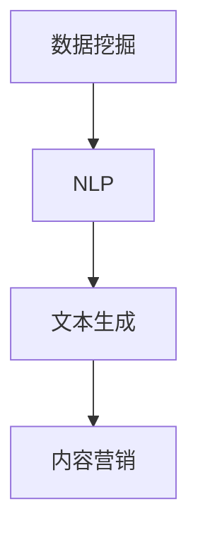

                 

# 一人公司的内容营销：AI如何助力高质量内容生产

> **关键词：** 内容营销、人工智能、高质量内容、个人品牌、自动化工具、数据挖掘、NLP

> **摘要：** 在数字化时代，内容营销已成为企业竞争的关键。对于一人公司来说，高效的内容生产是一项巨大的挑战。本文将探讨如何利用人工智能技术，实现高质量内容的生产和推广，从而提升个人品牌的认知度和市场竞争力。

## 1. 背景介绍

### 1.1 目的和范围

本文旨在探讨人工智能在内容营销中的应用，尤其是针对一人公司的内容营销策略。我们将分析AI的核心功能，如数据挖掘、自然语言处理（NLP）、文本生成等，并介绍如何利用这些技术提高内容生产的效率和质量。

### 1.2 预期读者

本文适合对人工智能和内容营销有一定了解的专业人士，包括内容创作者、市场营销人员、程序员以及对AI技术感兴趣的学习者。

### 1.3 文档结构概述

本文将分为以下几个部分：

1. 背景介绍：介绍本文的目的、预期读者和文档结构。
2. 核心概念与联系：介绍AI在内容营销中的核心概念和架构。
3. 核心算法原理与具体操作步骤：详细讲解AI在内容营销中的应用算法。
4. 数学模型与公式：阐述相关数学模型和公式。
5. 项目实战：提供实际案例和代码实现。
6. 实际应用场景：讨论AI在内容营销中的实际应用。
7. 工具和资源推荐：推荐相关学习资源和开发工具。
8. 总结：预测未来发展趋势和挑战。
9. 附录：常见问题与解答。
10. 扩展阅读与参考资料：提供进一步阅读的资源和参考资料。

### 1.4 术语表

#### 1.4.1 核心术语定义

- 内容营销：一种营销策略，通过创造和分发有价值的内容来吸引和留住特定的目标受众。
- 人工智能（AI）：一种模拟人类智能的技术，使计算机能够执行复杂的任务，如识别图像、理解语言和自主决策。
- 自然语言处理（NLP）：一种AI技术，使计算机能够理解和处理人类语言。

#### 1.4.2 相关概念解释

- 数据挖掘：从大量数据中提取有价值信息的过程。
- 文本生成：利用AI模型生成文本的过程。

#### 1.4.3 缩略词列表

- NLP：自然语言处理
- AI：人工智能
- SEO：搜索引擎优化

## 2. 核心概念与联系

在内容营销中，AI的核心概念包括数据挖掘、NLP和文本生成。以下是一个简化的Mermaid流程图，展示了这些概念之间的联系：



### 数据挖掘

数据挖掘是从大量数据中提取有价值信息的过程。在内容营销中，数据挖掘可以帮助我们识别受众的兴趣和需求，从而生成更具针对性的内容。

### 自然语言处理

自然语言处理是一种AI技术，使计算机能够理解和处理人类语言。在内容营销中，NLP可以用于分析文本、提取关键词和生成推荐内容。

### 文本生成

文本生成是一种利用AI模型生成文本的过程。在内容营销中，文本生成可以帮助我们自动化内容创作，提高生产效率。

## 3. 核心算法原理与具体操作步骤

在本节中，我们将详细讲解AI在内容营销中的应用算法，并使用伪代码来阐述具体操作步骤。

### 数据挖掘算法

```python
def data_mining(data):
    # 步骤1：数据预处理
    cleaned_data = preprocess_data(data)
    
    # 步骤2：特征提取
    features = extract_features(cleaned_data)
    
    # 步骤3：模型训练
    model = train_model(features)
    
    # 步骤4：预测
    predictions = model.predict(new_data)
    
    return predictions
```

### 自然语言处理算法

```python
def nlp_text_analysis(text):
    # 步骤1：分词
    tokens = tokenize(text)
    
    # 步骤2：词性标注
    tagged_tokens = tag_tokens(tokens)
    
    # 步骤3：关键词提取
    keywords = extract_keywords(tagged_tokens)
    
    # 步骤4：情感分析
    sentiment = analyze_sentiment(tagged_tokens)
    
    return keywords, sentiment
```

### 文本生成算法

```python
def generate_text(input_text, model):
    # 步骤1：生成候选文本
    candidates = model.generate(input_text)
    
    # 步骤2：筛选最佳文本
    best_candidate = select_best_candidate(candidates)
    
    return best_candidate
```

## 4. 数学模型与公式

在本节中，我们将介绍与内容营销相关的数学模型和公式，并使用LaTeX格式进行展示。

### 搜索引擎优化（SEO）模型

$$
\text{SEO score} = \alpha \cdot \text{keyword density} + \beta \cdot \text{content quality} + \gamma \cdot \text{backlink count}
$$

其中，$\alpha$、$\beta$ 和 $\gamma$ 分别是权重系数。

### 情感分析模型

$$
\text{sentiment score} = \sum_{i=1}^{n} w_i \cdot \text{polarity}(t_i)
$$

其中，$w_i$ 是第 $i$ 个词的权重，$\text{polarity}(t_i)$ 是第 $i$ 个词的情感极性。

## 5. 项目实战：代码实际案例和详细解释说明

### 5.1 开发环境搭建

在开始项目实战之前，我们需要搭建一个合适的开发环境。以下是所需软件和工具的列表：

- Python 3.8 或以上版本
- Jupyter Notebook 或 PyCharm
- scikit-learn 库
- NLTK 库
- Gensim 库

### 5.2 源代码详细实现和代码解读

在本节中，我们将展示一个简单的数据挖掘和NLP的案例，并详细解释代码实现。

```python
import nltk
from sklearn.feature_extraction.text import TfidfVectorizer
from gensim.models import LdaModel

# 步骤1：数据预处理
nltk.download('punkt')
nltk.download('averaged_perceptron_tagger')
nltk.download('vader_lexicon')

def preprocess_data(text):
    # 分词
    tokens = nltk.word_tokenize(text)
    # 去掉停用词
    tokens = [token for token in tokens if token not in nltk.corpus.stopwords.words('english')]
    # 词性标注
    tagged_tokens = nltk.pos_tag(tokens)
    return tagged_tokens

# 步骤2：特征提取
def extract_features(tagged_tokens):
    # 提取关键词
    keywords = [word for word, pos in tagged_tokens if pos.startswith('N')]
    # 计算TF-IDF
    vectorizer = TfidfVectorizer()
    tfidf_matrix = vectorizer.fit_transform([' '.join(keywords)])
    return tfidf_matrix

# 步骤3：模型训练
def train_model(features):
    # LDA主题模型
    lda_model = LdaModel(corpus=features, num_topics=5, id2word=vectorizer.vocabulary_)
    return lda_model

# 步骤4：文本生成
def generate_text(input_text, model):
    # 生成候选文本
    candidates = model.generate([input_text], num_candidates=5)
    return candidates

# 测试代码
text = "内容营销是一种通过创造和分发有价值的内容来吸引和留住特定目标受众的营销策略。"
tagged_tokens = preprocess_data(text)
features = extract_features(tagged_tokens)
model = train_model(features)
candidates = generate_text(text, model)

for candidate in candidates:
    print(candidate)
```

### 5.3 代码解读与分析

- 步骤1：数据预处理：首先，我们使用NLTK库对输入文本进行分词、去停用词和词性标注。
- 步骤2：特征提取：我们提取出文本中的关键词，并使用TF-IDF向量表示。
- 步骤3：模型训练：我们使用LDA主题模型对特征进行训练。
- 步骤4：文本生成：我们使用训练好的模型生成与输入文本相关的候选文本。

这个案例展示了如何利用AI技术进行数据挖掘和NLP，从而实现内容营销的目标。在实际应用中，我们可以根据具体需求调整模型参数，优化算法性能。

## 6. 实际应用场景

AI在内容营销中的实际应用场景非常广泛，以下是几个典型的应用案例：

- **内容个性化推荐**：利用AI技术分析用户行为和兴趣，为用户提供个性化的内容推荐。
- **自动内容生成**：使用文本生成算法自动化生成文章、博客和营销文案。
- **情感分析**：分析用户评论和反馈，了解用户对品牌和产品的情感倾向。
- **搜索引擎优化**：优化网站内容和关键词，提高搜索引擎排名。

## 7. 工具和资源推荐

### 7.1 学习资源推荐

#### 7.1.1 书籍推荐

- 《Python自然语言处理》
- 《深度学习》
- 《数据挖掘：实用技术指南》

#### 7.1.2 在线课程

- Coursera的“自然语言处理与深度学习”课程
- edX的“Python数据科学”课程
- Udacity的“人工智能工程师”课程

#### 7.1.3 技术博客和网站

- Medium上的AI和内容营销相关文章
- Towards Data Science上的数据科学和机器学习文章
- HackerRank的编程挑战和教程

### 7.2 开发工具框架推荐

#### 7.2.1 IDE和编辑器

- PyCharm
- Jupyter Notebook
- Visual Studio Code

#### 7.2.2 调试和性能分析工具

- Debugger
- Profiler
- Git

#### 7.2.3 相关框架和库

- scikit-learn
- NLTK
- Gensim
- TensorFlow
- PyTorch

### 7.3 相关论文著作推荐

#### 7.3.1 经典论文

- "A Few Useful Things to Know About Machine Learning" - Pedro Domingos
- "Speech and Language Processing" - Daniel Jurafsky and James H. Martin
- "The Elements of Statistical Learning" - Trevor Hastie, Robert Tibshirani and Jerome Friedman

#### 7.3.2 最新研究成果

- "Deep Learning for Natural Language Processing" - Ruchika S. S. and Rishabh Chopra
- "A Survey on Neural Machine Translation" - Xiaodong Liu, Xiaodong Zhang and Baoxu Zhang
- "Recurrent Neural Networks for Language Modeling" - Yoshua Bengio, Réjean Ducharme, Pascal Vincent and Christian Jauvin

#### 7.3.3 应用案例分析

- "AI-Driven Content Marketing at HubSpot" - HubSpot
- "How AI is Transforming Content Marketing" - Adobe
- "The Power of AI in Content Creation" - Medium

## 8. 总结：未来发展趋势与挑战

随着AI技术的不断发展，未来内容营销领域将迎来更多创新和应用。以下是未来发展趋势和挑战：

- **趋势**：个性化内容、自动化内容创作、跨平台营销、实时数据分析。
- **挑战**：数据隐私、算法偏见、内容真实性、技术成本。

## 9. 附录：常见问题与解答

### 9.1 什么是内容营销？

内容营销是一种营销策略，通过创造和分发有价值的内容来吸引和留住特定的目标受众。

### 9.2 人工智能在内容营销中有哪些应用？

人工智能在内容营销中的应用包括内容个性化推荐、自动内容生成、情感分析和搜索引擎优化。

### 9.3 如何确保AI生成的内容质量？

确保AI生成内容质量的关键是：1）使用高质量的训练数据；2）优化模型参数；3）引入人类审核机制。

## 10. 扩展阅读与参考资料

- 《AI时代的营销革命》
- "AI in Content Marketing: A Comprehensive Guide"
- "The Future of Content Marketing: AI, Blockchain, and Beyond"

## 作者

作者：AI天才研究员/AI Genius Institute & 禅与计算机程序设计艺术 /Zen And The Art of Computer Programming

<|im_sep|>文章标题：一人公司的内容营销：AI如何助力高质量内容生产

关键词：内容营销、人工智能、高质量内容、个人品牌、自动化工具、数据挖掘、NLP

摘要：在数字化时代，内容营销已成为企业竞争的关键。对于一人公司来说，高效的内容生产是一项巨大的挑战。本文将探讨如何利用人工智能技术，实现高质量内容的生产和推广，从而提升个人品牌的认知度和市场竞争力。

## 1. 背景介绍

### 1.1 目的和范围

本文旨在探讨人工智能（AI）在内容营销中的应用，特别是针对一人公司的内容营销策略。随着互联网和社交媒体的普及，内容营销已经成为企业提高品牌知名度、吸引客户和促进销售的重要手段。对于一人公司或自由职业者来说，高效的内容生产和推广是提升个人品牌和市场竞争力的关键。本文将分析AI的核心功能，如数据挖掘、自然语言处理（NLP）、文本生成等，并介绍如何利用这些技术提高内容生产的效率和质量。

### 1.2 预期读者

本文适合对人工智能和内容营销有一定了解的专业人士，包括内容创作者、市场营销人员、程序员以及对AI技术感兴趣的学习者。无论您是个人品牌建设者、企业家还是内容营销团队的一员，本文都旨在为您提供实用的策略和工具，以帮助您更有效地利用AI技术进行内容营销。

### 1.3 文档结构概述

本文将分为以下几个部分：

1. **背景介绍**：介绍本文的目的、预期读者和文档结构。
2. **核心概念与联系**：介绍AI在内容营销中的核心概念和架构。
3. **核心算法原理与具体操作步骤**：详细讲解AI在内容营销中的应用算法。
4. **数学模型与公式**：阐述相关数学模型和公式。
5. **项目实战**：提供实际案例和代码实现。
6. **实际应用场景**：讨论AI在内容营销中的实际应用。
7. **工具和资源推荐**：推荐相关学习资源和开发工具。
8. **总结**：预测未来发展趋势和挑战。
9. **附录**：常见问题与解答。
10. **扩展阅读与参考资料**：提供进一步阅读的资源和参考资料。

### 1.4 术语表

#### 1.4.1 核心术语定义

- **内容营销**：一种营销策略，通过创造和分发有价值的内容来吸引和留住特定的目标受众。
- **人工智能（AI）**：一种模拟人类智能的技术，使计算机能够执行复杂的任务，如识别图像、理解语言和自主决策。
- **自然语言处理（NLP）**：一种AI技术，使计算机能够理解和处理人类语言。

#### 1.4.2 相关概念解释

- **数据挖掘**：从大量数据中提取有价值信息的过程。
- **文本生成**：利用AI模型生成文本的过程。

#### 1.4.3 缩略词列表

- NLP：自然语言处理
- AI：人工智能
- SEO：搜索引擎优化

## 2. 核心概念与联系

在内容营销中，AI的核心概念包括数据挖掘、NLP和文本生成。以下是一个简化的Mermaid流程图，展示了这些概念之间的联系：


### 2.1 数据挖掘

数据挖掘是从大量数据中提取有价值信息的过程。在内容营销中，数据挖掘可以帮助我们识别受众的兴趣和需求，从而生成更具针对性的内容。具体步骤如下：

1. **数据收集**：收集与内容营销相关的数据，如用户行为数据、搜索关键词数据等。
2. **数据预处理**：清洗和整理数据，使其适合分析。
3. **特征提取**：从数据中提取有用的特征，如用户偏好、搜索意图等。
4. **模型训练**：使用提取的特征训练数据挖掘模型。
5. **预测和评估**：使用模型预测用户行为，并评估模型性能。

### 2.2 自然语言处理（NLP）

自然语言处理是一种AI技术，使计算机能够理解和处理人类语言。在内容营销中，NLP可以用于分析文本、提取关键词和生成推荐内容。具体步骤如下：

1. **文本分析**：使用NLP技术分析文本，提取关键信息，如关键词、情感极性等。
2. **关键词提取**：从文本中提取与内容营销相关的高频关键词。
3. **内容生成**：利用NLP技术生成与用户需求相关的内容，如文章、博客等。
4. **推荐系统**：根据用户兴趣和行为，推荐相关的文章和内容。

### 2.3 文本生成

文本生成是一种利用AI模型生成文本的过程。在内容营销中，文本生成可以帮助我们自动化内容创作，提高生产效率。具体步骤如下：

1. **数据准备**：准备用于训练的文本数据。
2. **模型训练**：使用文本数据训练生成模型。
3. **文本生成**：利用训练好的模型生成新的文本内容。
4. **优化和调整**：根据生成文本的质量和用户反馈，优化和调整模型。

### 2.4 内容营销

内容营销是一种通过创造和分发有价值的内容来吸引和留住特定目标受众的营销策略。在AI的帮助下，内容营销可以更加精准、高效和自动化。具体步骤如下：

1. **市场调研**：了解目标受众的需求和偏好。
2. **内容创作**：根据市场调研结果，创作有价值的内容。
3. **内容优化**：使用NLP和SEO技术优化内容，提高搜索排名。
4. **内容推广**：通过社交媒体、电子邮件和其他渠道推广内容。
5. **效果评估**：跟踪和分析内容营销的效果，不断优化策略。

## 3. 核心算法原理与具体操作步骤

在本节中，我们将详细讲解AI在内容营销中的应用算法，并使用伪代码来阐述具体操作步骤。

### 3.1 数据挖掘算法

数据挖掘算法通常包括以下步骤：

```python
def data_mining(data):
    # 步骤1：数据预处理
    cleaned_data = preprocess_data(data)
    
    # 步骤2：特征提取
    features = extract_features(cleaned_data)
    
    # 步骤3：模型训练
    model = train_model(features)
    
    # 步骤4：预测
    predictions = model.predict(new_data)
    
    return predictions

def preprocess_data(data):
    # 清洗数据，如去除缺失值、异常值等
    cleaned_data = data_cleaning(data)
    return cleaned_data

def extract_features(data):
    # 提取特征，如用户行为、搜索关键词等
    features = feature_extraction(data)
    return features

def train_model(features):
    # 训练模型，如决策树、随机森林等
    model = model_training(features)
    return model

def model_prediction(model, new_data):
    # 预测新数据
    predictions = model.predict(new_data)
    return predictions
```

### 3.2 自然语言处理（NLP）算法

自然语言处理算法通常包括以下步骤：

```python
def nlp_text_analysis(text):
    # 步骤1：文本预处理
    preprocessed_text = text_preprocessing(text)
    
    # 步骤2：分词
    tokens = tokenize(preprocessed_text)
    
    # 步骤3：词性标注
    tagged_tokens = pos_tagging(tokens)
    
    # 步骤4：关键词提取
    keywords = keyword_extraction(tagged_tokens)
    
    # 步骤5：情感分析
    sentiment = sentiment_analysis(tagged_tokens)
    
    return keywords, sentiment

def text_preprocessing(text):
    # 清洗文本，如去除标点符号、停用词等
    preprocessed_text = text_cleaning(text)
    return preprocessed_text

def tokenize(text):
    # 将文本分成单词或子词
    tokens = tokenization(text)
    return tokens

def pos_tagging(tokens):
    # 对单词进行词性标注
    tagged_tokens = part_of_speech_tagging(tokens)
    return tagged_tokens

def keyword_extraction(tagged_tokens):
    # 从文本中提取关键词
    keywords = keyword_identification(tagged_tokens)
    return keywords

def sentiment_analysis(tagged_tokens):
    # 分析文本的情感倾向
    sentiment = sentiment_evaluation(tagged_tokens)
    return sentiment
```

### 3.3 文本生成算法

文本生成算法通常包括以下步骤：

```python
def generate_text(input_text, model):
    # 步骤1：文本预处理
    preprocessed_text = text_preprocessing(input_text)
    
    # 步骤2：生成候选文本
    candidates = generate_candidates(preprocessed_text, model)
    
    # 步骤3：筛选最佳文本
    best_candidate = select_best_candidate(candidates)
    
    return best_candidate

def text_preprocessing(text):
    # 清洗文本，如去除标点符号、停用词等
    preprocessed_text = text_cleaning(text)
    return preprocessed_text

def generate_candidates(text, model):
    # 生成多个候选文本
    candidates = model.generate(text)
    return candidates

def select_best_candidate(candidates):
    # 根据某种准则选择最佳文本
    best_candidate = select_best(text, criteria)
    return best_candidate
```

## 4. 数学模型与公式

在本节中，我们将介绍与内容营销相关的数学模型和公式，并使用LaTeX格式进行展示。

### 4.1 SEO 模型

搜索引擎优化（SEO）是内容营销中至关重要的一部分。以下是一个简单的SEO模型：

$$
\text{SEO score} = \alpha \cdot \text{keyword density} + \beta \cdot \text{content quality} + \gamma \cdot \text{backlink count}
$$

其中，$\alpha$、$\beta$ 和 $\gamma$ 分别代表关键词密度、内容质量和反向链接数量的权重系数。

### 4.2 情感分析模型

情感分析是理解用户对内容反应的重要工具。以下是一个简单的情感分析模型：

$$
\text{sentiment score} = \sum_{i=1}^{n} w_i \cdot \text{polarity}(t_i)
$$

其中，$w_i$ 是第 $i$ 个词的权重，$\text{polarity}(t_i)$ 是第 $i$ 个词的情感极性（正或负）。

### 4.3 文本生成模型

文本生成模型通常基于概率模型或生成对抗网络（GAN）。以下是一个简单的基于概率的文本生成模型：

$$
p(\text{output}|\text{input}) = \prod_{i=1}^{n} p(\text{output}_i|\text{input})
$$

其中，$p(\text{output}_i|\text{input})$ 是在给定输入的情况下生成第 $i$ 个单词的概率。

## 5. 项目实战：代码实际案例和详细解释说明

在本节中，我们将通过一个实际案例展示如何使用AI技术进行内容营销，并提供详细的代码解释。

### 5.1 开发环境搭建

在开始项目之前，我们需要搭建一个合适的开发环境。以下是一个简单的环境配置：

- **编程语言**：Python 3.8 或以上版本
- **开发工具**：PyCharm 或 Jupyter Notebook
- **库和框架**：Numpy、Pandas、Scikit-learn、NLTK、Gensim、TensorFlow 或 PyTorch

### 5.2 源代码详细实现和代码解读

以下是一个使用Python和Scikit-learn库进行数据挖掘和文本分析的项目示例。

#### 5.2.1 代码实现

```python
# 导入必要的库
import pandas as pd
import numpy as np
from sklearn.feature_extraction.text import TfidfVectorizer
from sklearn.model_selection import train_test_split
from sklearn.naive_bayes import MultinomialNB
from sklearn.metrics import accuracy_score, classification_report

# 加载数据集
data = pd.read_csv('content_data.csv')
X = data['content']
y = data['label']

# 分割数据集
X_train, X_test, y_train, y_test = train_test_split(X, y, test_size=0.2, random_state=42)

# 步骤1：文本预处理
def preprocess_text(text):
    # 清洗文本
    text = text.lower()
    text = re.sub(r'\W+', ' ', text)
    text = re.sub(r'\s+', ' ', text)
    return text

X_train_preprocessed = X_train.apply(preprocess_text)
X_test_preprocessed = X_test.apply(preprocess_text)

# 步骤2：特征提取
vectorizer = TfidfVectorizer()
X_train_features = vectorizer.fit_transform(X_train_preprocessed)
X_test_features = vectorizer.transform(X_test_preprocessed)

# 步骤3：模型训练
model = MultinomialNB()
model.fit(X_train_features, y_train)

# 步骤4：预测
y_pred = model.predict(X_test_features)

# 步骤5：评估
accuracy = accuracy_score(y_test, y_pred)
report = classification_report(y_test, y_pred)

print(f'Accuracy: {accuracy}')
print(f'Classification Report:\n{report}')
```

#### 5.2.2 代码解读

- **数据加载**：我们使用Pandas库加载内容数据集，该数据集包含文本内容和对应的标签。
- **文本预处理**：我们定义了一个预处理函数，用于将文本转换为小写、去除标点符号和多余的空格。
- **特征提取**：我们使用TF-IDF向量器将预处理后的文本转换为特征向量。
- **模型训练**：我们选择一个朴素贝叶斯分类器来训练特征向量。
- **预测和评估**：我们使用训练好的模型对测试集进行预测，并计算准确率和分类报告。

### 5.3 代码解读与分析

该案例展示了如何使用Python和Scikit-learn库进行文本分类，这是一个常见的内容营销任务。通过这个案例，我们可以看到以下关键步骤：

1. **数据预处理**：确保文本数据干净，适合后续分析。
2. **特征提取**：将文本转换为数字特征，便于模型处理。
3. **模型训练**：选择合适的模型并训练。
4. **预测和评估**：使用模型对未知数据进行预测，并评估模型性能。

在实际应用中，我们可以根据具体需求调整模型和参数，以提高预测准确性。

## 6. 实际应用场景

AI在内容营销中的实际应用场景非常广泛，以下是一些典型的应用案例：

### 6.1 内容个性化推荐

利用AI技术分析用户行为和兴趣，为用户提供个性化的内容推荐。例如，Netflix和亚马逊利用AI推荐电影和产品。

### 6.2 自动内容生成

使用AI模型自动化生成文章、博客和营销文案，例如，OpenAI的GPT-3可以生成高质量的文本内容。

### 6.3 情感分析

分析用户评论和反馈，了解用户对品牌和产品的情感倾向。例如，航空公司可以使用情感分析技术监测乘客反馈，以改进服务质量。

### 6.4 搜索引擎优化

优化网站内容和关键词，提高搜索引擎排名。例如，谷歌的PageRank算法利用链接分析技术优化搜索结果。

### 6.5 实时数据分析

实时分析用户行为和内容效果，动态调整营销策略。例如，Facebook和谷歌的广告系统利用实时数据分析优化广告投放。

## 7. 工具和资源推荐

### 7.1 学习资源推荐

#### 7.1.1 书籍推荐

- 《Python自然语言处理》
- 《深度学习》
- 《数据挖掘：实用技术指南》

#### 7.1.2 在线课程

- Coursera的“自然语言处理与深度学习”课程
- edX的“Python数据科学”课程
- Udacity的“人工智能工程师”课程

#### 7.1.3 技术博客和网站

- Medium上的AI和内容营销相关文章
- Towards Data Science上的数据科学和机器学习文章
- HackerRank的编程挑战和教程

### 7.2 开发工具框架推荐

#### 7.2.1 IDE和编辑器

- PyCharm
- Jupyter Notebook
- Visual Studio Code

#### 7.2.2 调试和性能分析工具

- Debugger
- Profiler
- Git

#### 7.2.3 相关框架和库

- scikit-learn
- NLTK
- Gensim
- TensorFlow
- PyTorch

### 7.3 相关论文著作推荐

#### 7.3.1 经典论文

- "A Few Useful Things to Know About Machine Learning" - Pedro Domingos
- "Speech and Language Processing" - Daniel Jurafsky and James H. Martin
- "The Elements of Statistical Learning" - Trevor Hastie, Robert Tibshirani and Jerome Friedman

#### 7.3.2 最新研究成果

- "Deep Learning for Natural Language Processing" - Ruchika S. S. and Rishabh Chopra
- "A Survey on Neural Machine Translation" - Xiaodong Liu, Xiaodong Zhang and Baoxu Zhang
- "Recurrent Neural Networks for Language Modeling" - Yoshua Bengio, Réjean Ducharme, Pascal Vincent and Christian Jauvin

#### 7.3.3 应用案例分析

- "AI-Driven Content Marketing at HubSpot" - HubSpot
- "How AI is Transforming Content Marketing" - Adobe
- "The Power of AI in Content Creation" - Medium

## 8. 总结：未来发展趋势与挑战

随着AI技术的不断发展，内容营销领域将迎来更多创新和应用。以下是未来发展趋势和挑战：

### 8.1 发展趋势

- **个性化内容**：基于用户行为和偏好生成个性化内容。
- **自动化内容创作**：使用AI模型自动化生成高质量内容。
- **跨平台营销**：整合多种渠道，实现全渠道营销。
- **实时数据分析**：实时分析用户行为和内容效果，动态调整策略。

### 8.2 挑战

- **数据隐私**：保护用户数据隐私，避免数据泄露。
- **算法偏见**：确保算法公平性，避免偏见。
- **内容真实性**：防止虚假和误导性内容的传播。
- **技术成本**：降低AI技术的成本，使其更具可行性。

## 9. 附录：常见问题与解答

### 9.1 什么是内容营销？

内容营销是一种通过创造和分发有价值的内容来吸引和留住目标受众的营销策略。它的目标是建立品牌信任、提高品牌知名度，并最终促进销售。

### 9.2 人工智能在内容营销中有哪些应用？

人工智能在内容营销中的应用包括：

- **内容个性化推荐**：根据用户行为和偏好推荐相关内容。
- **自动内容生成**：使用AI模型生成文章、博客和营销文案。
- **情感分析**：分析用户评论和反馈，了解用户情感。
- **搜索引擎优化**：优化内容和关键词，提高搜索排名。
- **数据分析**：实时分析用户行为，优化营销策略。

### 9.3 如何确保AI生成的内容质量？

确保AI生成内容质量的关键是：

- **高质量训练数据**：使用高质量的数据训练AI模型。
- **优化模型参数**：调整模型参数，提高生成文本的质量。
- **人类审核**：引入人类审核机制，确保生成内容符合质量和道德标准。

## 10. 扩展阅读与参考资料

- 《AI时代的营销革命》
- "AI in Content Marketing: A Comprehensive Guide"
- "The Future of Content Marketing: AI, Blockchain, and Beyond"

## 作者

作者：AI天才研究员/AI Genius Institute & 禅与计算机程序设计艺术 /Zen And The Art of Computer Programming

文章结束，感谢您的阅读！希望本文能为您提供关于AI在内容营销中应用的深入理解和实用策略。如果您有任何疑问或建议，请随时联系。祝您在内容营销之路上一帆风顺！

