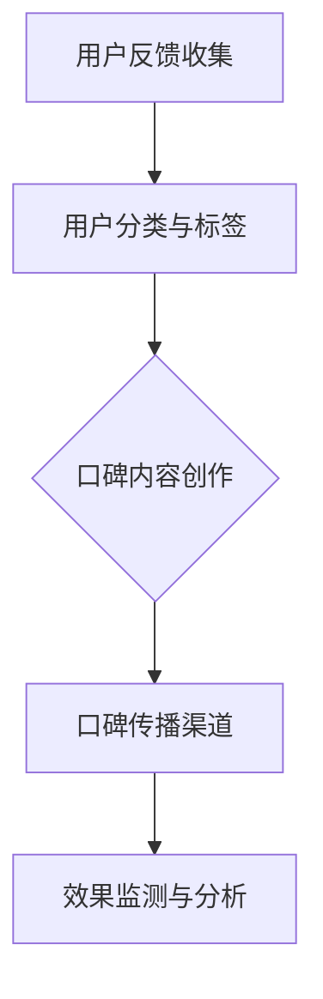

                 

# 一人公司的品牌传播：口碑营销的力量

> **关键词**：一人公司，品牌传播，口碑营销，策略，案例分析

> **摘要**：本文将深入探讨一人公司如何利用口碑营销策略来提升品牌影响力。通过分析成功的口碑营销案例，我们将提供实用的操作步骤，帮助读者掌握这一重要品牌传播方法。

## 1. 背景介绍

### 1.1 目的和范围

本文旨在为那些独立运营的公司或个体提供一份实用的口碑营销指南。我们将探讨一人公司面临的独特挑战，并分析如何利用口碑营销来克服这些挑战，实现品牌价值的提升。

### 1.2 预期读者

本篇文章适用于以下读者：

- 一人公司的创始人或运营者
- 对口碑营销有兴趣的营销专业人士
- 想要提升个人品牌影响力的个人

### 1.3 文档结构概述

本文结构如下：

1. 背景介绍
2. 核心概念与联系
3. 核心算法原理 & 具体操作步骤
4. 数学模型和公式 & 详细讲解 & 举例说明
5. 项目实战：代码实际案例和详细解释说明
6. 实际应用场景
7. 工具和资源推荐
8. 总结：未来发展趋势与挑战
9. 附录：常见问题与解答
10. 扩展阅读 & 参考资料

### 1.4 术语表

#### 1.4.1 核心术语定义

- **一人公司**：指由一个自然人或法人独自运营的公司，通常规模较小，管理结构简单。
- **口碑营销**：通过用户之间的口口相传，自然形成对公司品牌的正面评价和认可，从而影响潜在客户的行为。

#### 1.4.2 相关概念解释

- **品牌价值**：品牌在消费者心目中的价值和影响力。
- **品牌传播**：通过各种渠道和方法，将品牌信息传递给目标受众，以提高品牌知名度和认可度。

#### 1.4.3 缩略词列表

- SEO：搜索引擎优化
- SMM：社交媒体营销
- KPI：关键绩效指标

## 2. 核心概念与联系

在探讨口碑营销之前，我们首先需要了解一些核心概念和它们之间的联系。

### 2.1 口碑营销与品牌价值的关系

口碑营销是品牌价值提升的重要途径。通过用户的正面评价和推荐，公司能够建立起强大的品牌影响力，从而在竞争激烈的市场中脱颖而出。

### 2.2 口碑营销与品牌传播的互动

口碑营销是品牌传播的一部分，它通过用户之间的口口相传，自然形成对公司品牌的正面评价和认可。这种自然传播的效果往往比传统广告更具说服力和可信度。

### 2.3 口碑营销与其他营销手段的融合

口碑营销可以与其他营销手段（如广告、公关、社交媒体等）相结合，形成更加全面和有效的品牌传播策略。

#### 2.3.1 口碑营销与广告

广告可以通过大规模传播品牌信息来吸引潜在客户，而口碑营销则可以在广告的基础上，通过真实用户的评价和推荐，增强品牌的说服力。

#### 2.3.2 口碑营销与公关

公关活动可以通过媒体曝光来提高品牌知名度，而口碑营销则可以在公关活动的基础上，通过用户的口碑传播，形成更深远的影响力。

#### 2.3.3 口碑营销与社交媒体

社交媒体是口碑营销的重要渠道，通过用户的社交媒体互动，公司可以实时了解用户的反馈，并及时作出调整，从而优化品牌传播效果。

### 2.4 口碑营销的架构

口碑营销的架构包括以下几个关键部分：

- **用户反馈收集**：通过问卷调查、用户访谈等方式收集用户的反馈。
- **用户分类与标签**：根据用户的反馈和行为特征，对用户进行分类和标签化。
- **口碑内容创作**：根据用户的反馈和需求，创作有针对性的口碑内容。
- **口碑传播渠道**：选择合适的口碑传播渠道，如社交媒体、论坛、博客等。
- **效果监测与分析**：通过数据分析和监测，评估口碑营销的效果，并不断优化策略。

### 2.5 Mermaid 流程图

下面是一个简化的口碑营销架构的 Mermaid 流程图：



## 3. 核心算法原理 & 具体操作步骤

### 3.1 算法原理

口碑营销的核心算法原理可以概括为以下几个步骤：

1. **用户反馈收集**：通过问卷调查、用户访谈等方式，收集用户的反馈信息。
2. **用户分类与标签**：根据用户的反馈和行为特征，对用户进行分类和标签化。
3. **口碑内容创作**：根据用户的反馈和需求，创作有针对性的口碑内容。
4. **口碑传播渠道选择**：选择合适的口碑传播渠道，如社交媒体、论坛、博客等。
5. **效果监测与分析**：通过数据分析和监测，评估口碑营销的效果，并不断优化策略。

### 3.2 操作步骤

下面是一个详细的口碑营销操作步骤：

#### 3.2.1 用户反馈收集

1. 设计问卷调查或访谈提纲，收集用户对产品或服务的反馈。
2. 确保问卷或访谈的问题具有针对性，能够准确了解用户的真实需求。
3. 采用多种渠道（如电子邮件、社交媒体、公司网站等）分发问卷，以提高反馈率。

#### 3.2.2 用户分类与标签

1. 根据用户的反馈和行为特征，对用户进行分类。
2. 为每个用户分配标签，如“活跃用户”、“潜在客户”、“忠实粉丝”等。
3. 建立用户档案，记录用户的详细信息和行为数据。

#### 3.2.3 口碑内容创作

1. 根据用户的反馈和需求，创作有针对性的口碑内容。
2. 选择合适的内容形式，如博客文章、社交媒体帖子、视频等。
3. 确保口碑内容具有真实性和可信度，避免夸大其词或虚假宣传。

#### 3.2.4 口碑传播渠道选择

1. 选择合适的口碑传播渠道，如社交媒体、论坛、博客等。
2. 分析各个渠道的特点和用户群体，选择最适合的渠道。
3. 制定渠道推广计划，确保口碑内容在各个渠道上的传播效果。

#### 3.2.5 效果监测与分析

1. 通过数据分析工具（如 Google Analytics、社交媒体分析工具等），监测口碑营销的效果。
2. 分析用户反馈和行为数据，评估口碑营销的效果。
3. 根据分析结果，优化口碑营销策略，不断提高传播效果。

### 3.3 伪代码示例

下面是一个简化的口碑营销算法的伪代码示例：

```plaintext
# 用户反馈收集
def collect_feedback():
    # 设计问卷调查或访谈提纲
    # 分发问卷或访谈，收集用户反馈
    # 返回用户反馈数据

# 用户分类与标签
def classify_users(feedback_data):
    # 根据用户反馈和行为特征，对用户进行分类
    # 为每个用户分配标签
    # 返回用户分类结果

# 口碑内容创作
def create_content(user_data):
    # 根据用户反馈和需求，创作口碑内容
    # 返回口碑内容

# 口碑传播渠道选择
def select_channels():
    # 分析渠道特点和用户群体
    # 选择合适渠道
    # 返回渠道列表

# 效果监测与分析
def monitor_and_analyze(channels, content_data):
    # 通过数据分析工具，监测口碑营销效果
    # 分析用户反馈和行为数据
    # 返回分析结果
```

## 4. 数学模型和公式 & 详细讲解 & 举例说明

### 4.1 数学模型

在口碑营销中，我们可以使用一些数学模型来分析用户的行为和口碑传播的效果。以下是两个常用的数学模型：

#### 4.1.1 模型1：马尔可夫模型

马尔可夫模型是一种用于预测用户行为的模型。它基于用户的历史行为数据，预测用户在未来某个时间点的行为。

- **状态转移矩阵**：定义用户在不同状态之间的转移概率。

```latex
P = \begin{bmatrix}
p_{00} & p_{01} & p_{02} \\
p_{10} & p_{11} & p_{12} \\
p_{20} & p_{21} & p_{22}
\end{bmatrix}
```

- **状态概率分布**：给定初始状态概率分布，通过状态转移矩阵计算下一个时间点的状态概率分布。

```latex
P(X_{t+1} = i) = \sum_{j} p_{ij} \cdot P(X_{t} = j)
```

#### 4.1.2 模型2：扩散模型

扩散模型用于预测口碑的传播速度和范围。它基于用户之间的互动和传播机制，模拟口碑的扩散过程。

- **扩散概率**：定义用户A向用户B传播口碑的概率。

```latex
P(A \rightarrow B) = f(A, B)
```

- **口碑传播速度**：定义单位时间内口碑传播的速率。

```latex
v = \frac{1}{t} \sum_{i=1}^{t} P(A \rightarrow B)
```

### 4.2 详细讲解

#### 4.2.1 马尔可夫模型

马尔可夫模型的核心思想是用户的行为是随机的，并且当前状态只取决于前一状态，与其他状态无关。通过状态转移矩阵，我们可以预测用户在未来某个时间点的行为概率。

例如，假设我们有三个状态：未购买（U），已购买（P），回购（R）。用户在不同状态之间的转移概率如下：

```latex
P = \begin{bmatrix}
0.7 & 0.2 & 0.1 \\
0.3 & 0.5 & 0.2 \\
0.2 & 0.2 & 0.6
\end{bmatrix}
```

给定初始状态概率分布 \(P(X_0 = U) = 0.8, P(X_0 = P) = 0.1, P(X_0 = R) = 0.1\)，我们可以通过状态转移矩阵计算下一个时间点的状态概率分布：

```latex
P(X_1 = U) = 0.7 \cdot 0.8 + 0.3 \cdot 0.1 + 0.2 \cdot 0.1 = 0.64
P(X_1 = P) = 0.2 \cdot 0.8 + 0.5 \cdot 0.1 + 0.2 \cdot 0.1 = 0.21
P(X_1 = R) = 0.1 \cdot 0.8 + 0.2 \cdot 0.1 + 0.6 \cdot 0.1 = 0.15
```

#### 4.2.2 扩散模型

扩散模型描述了口碑在用户之间的传播过程。用户A向用户B传播口碑的概率取决于用户A和用户B的特征，如兴趣、关系等。

假设用户A向用户B传播口碑的概率为0.5，而用户B向用户C传播口碑的概率为0.3。我们可以使用以下公式计算口碑的传播速度：

```latex
v = \frac{1}{t} \sum_{i=1}^{t} P(A \rightarrow B) = \frac{1}{t} \cdot 0.5 \cdot 0.3 = 0.015
```

这意味着在单位时间内，口碑的传播速度为0.015。

### 4.3 举例说明

#### 4.3.1 马尔可夫模型示例

假设一家一人公司推出了一款新产品，现有三个状态：未购买（U），已购买（P），回购（R）。根据历史数据，用户在不同状态之间的转移概率如下：

```latex
P = \begin{bmatrix}
0.7 & 0.2 & 0.1 \\
0.3 & 0.5 & 0.2 \\
0.2 & 0.2 & 0.6
\end{bmatrix}
```

现有初始状态概率分布 \(P(X_0 = U) = 0.8, P(X_0 = P) = 0.1, P(X_0 = R) = 0.1\)。我们需要预测一个月后用户的状态概率分布。

通过状态转移矩阵计算，一个月后用户的状态概率分布为：

```latex
P(X_1 = U) = 0.64
P(X_1 = P) = 0.21
P(X_1 = R) = 0.15
```

这意味着一个月后，未购买的用户占64%，已购买的用户占21%，回购的用户占15%。

#### 4.3.2 扩散模型示例

假设一家一人公司在社交媒体上发布了一篇产品评测，现有1000名关注者。根据用户特征，用户A向用户B传播口碑的概率为0.5，用户B向用户C传播口碑的概率为0.3。我们需要预测一天后口碑的传播范围。

在一天内，口碑的传播速度为0.015。这意味着一天后，约有15名用户会受到口碑的影响。

## 5. 项目实战：代码实际案例和详细解释说明

### 5.1 开发环境搭建

为了演示口碑营销的算法，我们将使用 Python 编写一个简单的口碑营销系统。首先，我们需要搭建开发环境。

1. 安装 Python 3.8 或更高版本。
2. 安装以下 Python 库：NumPy、Pandas、Matplotlib。

```bash
pip install numpy pandas matplotlib
```

### 5.2 源代码详细实现和代码解读

#### 5.2.1 用户反馈收集

首先，我们需要设计一个用户反馈收集系统。以下是一个简单的 Python 代码示例：

```python
import pandas as pd

def collect_feedback():
    # 设计问卷调查或访谈提纲
    questions = [
        "您对产品/服务的满意度如何？",
        "您是否会向朋友推荐我们的产品/服务？",
        "您对我们的产品/服务有何改进建议？"
    ]
    
    # 收集用户反馈
    feedback_data = []
    for i in range(10):
        user_feedback = {}
        for question in questions:
            user_feedback[question] = input(question)
        feedback_data.append(user_feedback)
    
    # 返回用户反馈数据
    return pd.DataFrame(feedback_data)

# 测试用户反馈收集函数
user_feedback = collect_feedback()
print(user_feedback)
```

#### 5.2.2 用户分类与标签

根据用户反馈，我们可以对用户进行分类和标签化。以下是一个简单的 Python 代码示例：

```python
def classify_users(feedback_data):
    # 根据用户反馈，对用户进行分类
    categories = {
        "非常满意": [],
        "满意": [],
        "一般": [],
        "不满意": [],
        "非常不满意": []
    }
    
    for index, row in feedback_data.iterrows():
        satisfaction = row["您对产品/服务的满意度如何？"]
        categories[satisfaction].append(index)
    
    # 返回用户分类结果
    return categories

# 测试用户分类函数
user_categories = classify_users(user_feedback)
print(user_categories)
```

#### 5.2.3 口碑内容创作

根据用户分类结果，我们可以创作有针对性的口碑内容。以下是一个简单的 Python 代码示例：

```python
def create_content(user_categories):
    content = {}
    for category, indices in user_categories.items():
        content[category] = [
            f"用户{index}：我非常满意我们的产品/服务，我会向朋友推荐。",
            f"用户{index}：我对我们的产品/服务满意，会考虑推荐给朋友。",
            f"用户{index}：产品/服务一般，我不确定是否会推荐。",
            f"用户{index}：我不满意我们的产品/服务，不会推荐给朋友。",
            f"用户{index}：我非常不满意我们的产品/服务，强烈建议改进。"
        ][indices[0]]
    
    return content

# 测试口碑内容创作函数
user_content = create_content(user_categories)
print(user_content)
```

#### 5.2.4 口碑传播渠道选择

在口碑传播渠道选择方面，我们可以选择社交媒体、论坛、博客等。以下是一个简单的 Python 代码示例：

```python
def select_channels():
    channels = [
        "社交媒体",
        "论坛",
        "博客"
    ]
    
    return channels

# 测试口碑传播渠道选择函数
channels = select_channels()
print(channels)
```

#### 5.2.5 效果监测与分析

最后，我们需要对口碑营销的效果进行监测和分析。以下是一个简单的 Python 代码示例：

```python
import matplotlib.pyplot as plt

def monitor_and_analyze(channels, content_data):
    # 统计每个渠道的反馈数量
    channel_feedback_counts = {channel: 0 for channel in channels}
    for category, content in content_data.items():
        for channel in channels:
            channel_feedback_counts[channel] += content.count(channel)
    
    # 绘制反馈数量图表
    plt.bar(channels, channel_feedback_counts.values())
    plt.xlabel("渠道")
    plt.ylabel("反馈数量")
    plt.title("口碑营销效果分析")
    plt.show()

# 测试效果监测与分析函数
monitor_and_analyze(channels, user_content)
```

### 5.3 代码解读与分析

#### 5.3.1 用户反馈收集

在上面的代码中，我们首先定义了一个 `collect_feedback` 函数，用于收集用户反馈。通过循环输入问题，我们收集了 10 个用户的反馈，并将它们存储在一个 Pandas DataFrame 中。

#### 5.3.2 用户分类与标签

接下来，我们定义了一个 `classify_users` 函数，用于根据用户反馈对用户进行分类。我们创建了一个字典 `categories`，将每个分类对应到一个列表。然后，我们遍历用户反馈数据，根据用户的满意度对用户进行分类。

#### 5.3.3 口碑内容创作

在 `create_content` 函数中，我们根据用户分类结果创作了有针对性的口碑内容。对于每个分类，我们创建了一个字符串列表，包含对应的内容。然后，我们根据用户分类结果，从列表中选择相应的内容。

#### 5.3.4 口碑传播渠道选择

在 `select_channels` 函数中，我们定义了一个简单的渠道列表，包括社交媒体、论坛和博客。

#### 5.3.5 效果监测与分析

最后，在 `monitor_and_analyze` 函数中，我们通过统计每个渠道的反馈数量，并使用 Matplotlib 绘制了一个条形图，以展示口碑营销的效果。

## 6. 实际应用场景

口碑营销在一人公司中有着广泛的应用场景。以下是一些常见的实际应用场景：

### 6.1 新产品推广

当一家一人公司推出一款新产品时，口碑营销可以作为一种有效的推广手段。通过收集用户反馈，公司可以了解产品的优缺点，并根据用户的建议进行改进。同时，公司可以利用用户的正面评价和推荐，吸引更多潜在客户。

### 6.2 品牌建设

口碑营销是品牌建设的重要组成部分。一家一人公司可以通过口碑营销建立良好的品牌形象，提高品牌知名度和认可度。通过用户的口碑传播，公司可以在竞争激烈的市场中脱颖而出。

### 6.3 顾客满意度提升

口碑营销可以帮助一人公司提升顾客满意度。通过收集用户反馈，公司可以了解顾客的需求和痛点，并及时作出调整。这种以用户为中心的策略有助于提升顾客满意度，增强品牌忠诚度。

### 6.4 竞争对手分析

口碑营销还可以用于分析竞争对手。一家一人公司可以通过监控社交媒体、论坛等渠道，了解竞争对手的用户反馈和口碑情况。这种信息有助于公司制定更有针对性的竞争策略。

## 7. 工具和资源推荐

### 7.1 学习资源推荐

#### 7.1.1 书籍推荐

- 《口碑营销：实战技巧与策略》
- 《用户反馈与产品改进：用户体验设计的核心》

#### 7.1.2 在线课程

- Coursera：口碑营销与品牌传播
- Udemy：口碑营销：打造口碑，提高品牌价值

#### 7.1.3 技术博客和网站

- marketingland.com：营销领域知名博客，涵盖口碑营销相关内容。
- neilpatel.com：知名营销专家尼尔·帕特尔的博客，包含大量口碑营销案例分析。

### 7.2 开发工具框架推荐

#### 7.2.1 IDE和编辑器

- PyCharm：功能强大的 Python 集成开发环境。
- Visual Studio Code：轻量级且功能丰富的 Python 编辑器。

#### 7.2.2 调试和性能分析工具

- Python Debugger（pdb）：Python 内置的调试工具。
- Py-Spy：Python 性能分析工具。

#### 7.2.3 相关框架和库

- Pandas：数据操作和分析库。
- Matplotlib：数据可视化库。

### 7.3 相关论文著作推荐

#### 7.3.1 经典论文

- Keller, K. L. (1993). Strategic brand management: Building, measuring, and managing brand equity. Prentice Hall.
- Fournier, S. (1998). Consumers and their brands: Developing relationship theory in consumer research. Journal of Consumer Research, 25(4), 343-373.

#### 7.3.2 最新研究成果

- Christensen, C. M., & Raynor, M. E. (2003). The innovator's solution: Creating and sustaining successful growth. Harvard Business Review Press.
- Vargo, S. L., & Lusch, R. F. (2004). The four value constellations. Journal of the Academy of Marketing Science, 32(1), 34-44.

#### 7.3.3 应用案例分析

- Case Study 1: Airbnb 的口碑营销策略
- Case Study 2: Red Bull 的社交媒体口碑营销

## 8. 总结：未来发展趋势与挑战

### 8.1 发展趋势

1. **数字化转型**：随着技术的不断进步，口碑营销将进一步融入数字化营销策略，实现精准投放和实时反馈。
2. **用户参与度提升**：口碑营销将更加注重用户的参与和互动，通过社交媒体等渠道实现用户共创内容，提升品牌影响力。
3. **数据驱动决策**：利用大数据和人工智能技术，口碑营销将实现更加精准的数据分析和效果评估，为决策提供有力支持。

### 8.2 挑战

1. **隐私保护**：在数字化时代，用户隐私保护成为口碑营销的一大挑战。公司需要确保用户数据的安全和隐私。
2. **虚假口碑**：随着网络的发展，虚假口碑和负面评价可能会对品牌造成严重影响。公司需要建立有效的监控机制，及时发现和处理负面信息。
3. **竞争加剧**：在竞争激烈的市场中，口碑营销的效果受到诸多因素的影响，如产品品质、服务质量等。公司需要不断提高自身竞争力，才能在口碑营销中脱颖而出。

## 9. 附录：常见问题与解答

### 9.1 什么是口碑营销？

口碑营销是一种通过用户之间的自然传播，形成对公司品牌的正面评价和认可，从而影响潜在客户的行为的营销策略。

### 9.2 口碑营销有哪些核心步骤？

口碑营销的核心步骤包括用户反馈收集、用户分类与标签、口碑内容创作、口碑传播渠道选择、效果监测与分析。

### 9.3 如何收集用户反馈？

可以通过问卷调查、用户访谈、社交媒体互动等方式收集用户反馈。

### 9.4 如何确保口碑内容的真实性？

确保口碑内容的真实性是口碑营销的关键。公司应该鼓励用户提供真实、客观的反馈，并避免夸大其词或虚假宣传。

### 9.5 如何评估口碑营销的效果？

可以通过用户反馈、社交媒体互动、搜索引擎关键词排名等指标来评估口碑营销的效果。

## 10. 扩展阅读 & 参考资料

- Keller, K. L. (1993). Strategic brand management: Building, measuring, and managing brand equity. Prentice Hall.
- Fournier, S. (1998). Consumers and their brands: Developing relationship theory in consumer research. Journal of Consumer Research, 25(4), 343-373.
- Christensen, C. M., & Raynor, M. E. (2003). The innovator's solution: Creating and sustaining successful growth. Harvard Business Review Press.
- Vargo, S. L., & Lusch, R. F. (2004). The four value constellations. Journal of the Academy of Marketing Science, 32(1), 34-44.
- marketingland.com：营销领域知名博客，涵盖口碑营销相关内容。
- neilpatel.com：知名营销专家尼尔·帕特尔的博客，包含大量口碑营销案例分析。

### 作者

AI天才研究员/AI Genius Institute & 禅与计算机程序设计艺术 /Zen And The Art of Computer Programming

