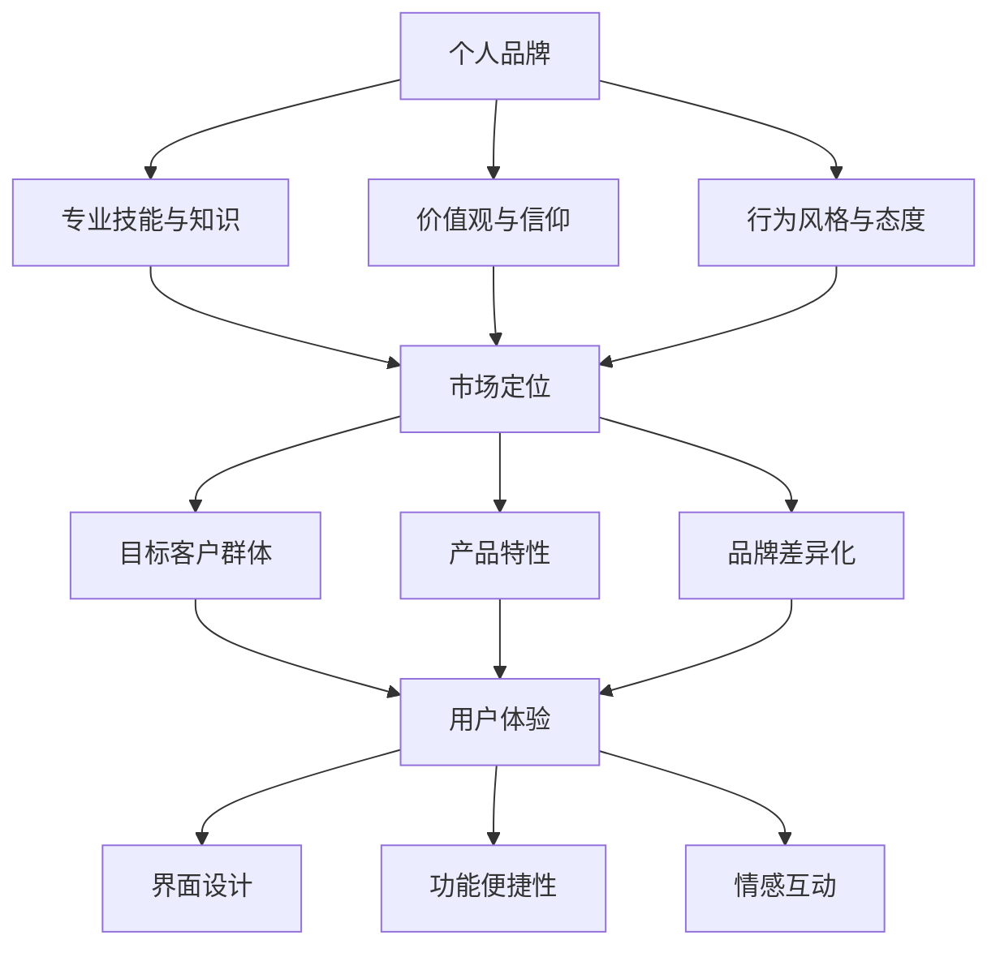

                 

### 一人公司的品牌故事构建

> **关键词：** 一人公司、品牌建设、个人品牌、市场营销、用户体验
> 
> **摘要：** 本篇文章将探讨如何在当今竞争激烈的市场环境中构建一个人公司的品牌故事。通过深入分析品牌故事的核心概念、构建策略和关键步骤，我们将揭示如何利用个人魅力和专业技能打造一个独特的品牌形象，实现持续的市场影响力。

在当今快速变化和高度竞争的商业环境中，一个人公司如何脱颖而出，打造属于自己的品牌故事，成为了至关重要的问题。品牌故事不仅仅是公司的宣传口号或标识，它是品牌与消费者之间建立情感联系的基础。对于一人公司来说，个人品牌更是公司品牌的核心，因为它们通常依赖于个人的专业知识和个人魅力来吸引客户和合作伙伴。

本文将分步骤探讨如何构建一个人公司的品牌故事：

1. **背景介绍**：介绍品牌故事的背景、目的和预期读者，同时概述文章结构和相关术语。
2. **核心概念与联系**：讨论品牌故事的核心概念，包括个人品牌、市场定位和用户体验，并使用Mermaid流程图展示各概念之间的联系。
3. **核心算法原理 & 具体操作步骤**：详细阐述构建品牌故事的算法原理，使用伪代码说明关键步骤。
4. **数学模型和公式 & 详细讲解 & 举例说明**：解释品牌故事构建中涉及的关键数学模型和公式，并提供实际案例进行说明。
5. **项目实战：代码实际案例和详细解释说明**：通过实际项目案例展示如何具体实施品牌故事构建策略。
6. **实际应用场景**：分析品牌故事在不同行业中的应用场景和优势。
7. **工具和资源推荐**：推荐相关学习资源、开发工具和最新研究成果。
8. **总结：未来发展趋势与挑战**：展望品牌故事构建的未来发展趋势和面临的挑战。
9. **附录：常见问题与解答**：回答读者可能遇到的问题。
10. **扩展阅读 & 参考资料**：提供扩展阅读材料和参考文献。

通过本文的深入探讨，我们将了解到如何通过系统化地构建品牌故事，实现一人公司的品牌价值和市场影响力的提升。

### 1. 背景介绍

#### 1.1 目的和范围

本文旨在帮助一人公司（即仅由一位创始人运营的公司）构建一个引人入胜的品牌故事。品牌故事不仅是公司形象的一部分，更是与消费者建立情感联系的重要工具。在竞争激烈的市场中，一个有吸引力的品牌故事能够帮助公司在消费者心中树立独特的形象，从而增加品牌忠诚度和市场份额。

本文的范围涵盖了品牌故事构建的各个方面，包括但不限于品牌定位、个人品牌建设、市场营销策略、用户体验设计等。通过系统化的分析和具体的操作步骤，我们将探讨如何通过品牌故事提升一人公司的市场竞争力。

#### 1.2 预期读者

本文预期读者主要分为以下几类：

1. **一人公司的创始人或运营者**：希望通过构建品牌故事来提升公司知名度和市场影响力的个人创业者。
2. **市场营销专业人员**：希望了解品牌故事在市场营销中应用的专业人员，包括品牌经理、市场营销专员等。
3. **品牌咨询顾问**：对品牌故事构建策略和方法有深入研究的咨询顾问，可以作为其咨询建议的理论基础。
4. **学术研究者**：对品牌建设和管理有浓厚兴趣的学术研究者，可以本文作为其研究参考。

无论您属于哪一类读者，本文都旨在为您提供一个全面、系统的品牌故事构建指南。

#### 1.3 文档结构概述

本文将按照以下结构展开：

1. **背景介绍**：简要介绍品牌故事构建的背景和目的，明确预期读者。
2. **核心概念与联系**：讨论品牌故事构建的核心概念，包括个人品牌、市场定位和用户体验，并展示各概念之间的联系。
3. **核心算法原理 & 具体操作步骤**：详细阐述品牌故事构建的算法原理和关键步骤。
4. **数学模型和公式 & 详细讲解 & 举例说明**：解释品牌故事构建中涉及的关键数学模型和公式，并提供实际案例。
5. **项目实战：代码实际案例和详细解释说明**：通过实际项目案例展示品牌故事构建的具体实施。
6. **实际应用场景**：分析品牌故事在不同行业中的应用场景和优势。
7. **工具和资源推荐**：推荐相关学习资源、开发工具和最新研究成果。
8. **总结：未来发展趋势与挑战**：展望品牌故事构建的未来发展趋势和面临的挑战。
9. **附录：常见问题与解答**：回答读者可能遇到的问题。
10. **扩展阅读 & 参考资料**：提供扩展阅读材料和参考文献。

通过本文的逐步阅读和深入理解，读者将能够掌握品牌故事构建的精髓，为自身公司的发展注入强大的品牌动力。

#### 1.4 术语表

在本文中，我们将使用以下术语，以确保读者能够清晰地理解相关概念：

##### 1.4.1 核心术语定义

- **品牌故事**：指通过讲述品牌背后的故事来传递品牌价值观和特色，从而与消费者建立情感联系的一种策略。
- **个人品牌**：指个人在行业或市场中的专业形象和声誉，它包括个人的专业技能、价值观、个性特点等。
- **市场定位**：指品牌在目标市场中的独特位置，包括目标客户群体、产品特性、品牌差异化等。
- **用户体验**：指用户在使用产品或服务过程中的感受和体验，包括界面设计、功能便捷性、情感互动等。

##### 1.4.2 相关概念解释

- **品牌识别度**：指品牌在消费者心中的独特性和易识别程度，是品牌故事建设的重要指标。
- **故事营销**：指通过讲述品牌故事来吸引消费者的注意力，提高品牌认知度和忠诚度的一种营销策略。

##### 1.4.3 缩略词列表

- **UX**：用户体验（User Experience）
- **UI**：用户界面（User Interface）
- **SEO**：搜索引擎优化（Search Engine Optimization）
- **SMM**：社交媒体营销（Social Media Marketing）

通过了解这些术语和概念，读者将能够更深入地理解品牌故事构建的过程和策略。

### 2. 核心概念与联系

在构建一人公司的品牌故事时，理解核心概念之间的联系至关重要。以下将详细阐述品牌故事构建的核心概念，并使用Mermaid流程图展示它们之间的联系。

#### 个人品牌

个人品牌是指个人在行业或市场中的专业形象和声誉。它不仅包括个人的专业技能和知识，还涵盖了价值观、个性特点和行为风格。一个强大的个人品牌能够帮助公司在市场中脱颖而出，吸引潜在客户和合作伙伴。

**个人品牌的核心要素包括：**

- **专业技能和知识**：个人在特定领域的专业水平，是品牌故事的基础。
- **价值观和信仰**：个人的核心价值观和信仰，能够体现品牌的独特性和可信度。
- **行为风格和态度**：个人在业务中的行为风格和态度，如诚信、勤奋、创新等。

#### 市场定位

市场定位是指品牌在目标市场中的独特位置，它决定了品牌如何区分自己并与消费者建立联系。对于一人公司来说，明确的市场定位能够帮助品牌在竞争激烈的市场中找到自己的细分市场，从而更有效地吸引目标客户。

**市场定位的关键步骤包括：**

- **目标客户群体**：明确目标客户是谁，包括他们的需求、兴趣和行为习惯。
- **产品特性**：确定品牌的产品或服务的独特特性，如功能、质量、价格等。
- **品牌差异化**：找到与竞争对手的区别，包括品牌的独特卖点（USP）和市场定位策略。

#### 用户体验

用户体验（UX）是指用户在使用品牌的产品或服务过程中的感受和体验。一个优秀的用户体验能够增强用户对品牌的忠诚度和满意度，从而促进品牌忠诚度和口碑传播。

**用户体验的关键要素包括：**

- **界面设计**：用户界面（UI）的视觉设计和操作便捷性，直接影响用户的第一印象。
- **功能便捷性**：产品功能的易用性和高效性，直接影响用户的操作体验。
- **情感互动**：品牌与用户之间的情感交流和互动，如个性化和定制化服务。

#### Mermaid流程图

以下是品牌故事构建核心概念之间的Mermaid流程图：



通过这个流程图，我们可以清晰地看到个人品牌、市场定位和用户体验之间的密切联系。个人品牌为市场定位提供了基础，而市场定位又决定了用户体验的质量。优秀的用户体验反过来又强化了个人品牌和市场定位，形成一个良性循环。

### 3. 核心算法原理 & 具体操作步骤

构建一个人公司的品牌故事是一个系统化的过程，涉及多个步骤和算法原理。以下将详细阐述品牌故事构建的核心算法原理，并使用伪代码说明具体操作步骤。

#### 核心算法原理

品牌故事构建的核心算法可以概括为以下四个步骤：

1. **需求分析**：明确品牌故事的目标和受众，包括目标市场和客户需求。
2. **内容创作**：创作品牌故事的内容，包括背景、情节、角色和冲突等。
3. **传播策略**：制定品牌故事的传播策略，包括渠道选择、传播方式和传播频率。
4. **反馈优化**：根据市场反馈和用户反馈，对品牌故事进行优化和调整。

#### 伪代码

```plaintext
Algorithm BuildBrandStory()
    Input: brandGoal, targetAudience, marketData
    Output: brandStory

    1. 需求分析
        - AnalyzeBrandGoal(brandGoal)
        - CollectTargetAudienceData(targetAudience)
        - CollectMarketData(marketData)
        
    2. 内容创作
        - CreateStoryBackground()
        - DevelopStoryPlot()
        - DefineStoryCharacters()
        - IntroduceStoryConflict()
        
    3. 传播策略
        - SelectStoryChannels()
        - DefineStoryNarration()
        - ScheduleStoryRelease()
        
    4. 反馈优化
        - CollectUserFeedback()
        - AnalyzeFeedback()
        - OptimizeStoryContent()

    return brandStory
```

#### 具体操作步骤

以下是品牌故事构建的具体操作步骤：

##### 步骤1：需求分析

需求分析是品牌故事构建的第一步，它决定了品牌故事的目标和内容。具体操作包括：

1. **分析品牌目标**：明确品牌故事希望传达的核心信息，包括品牌理念、价值观和目标。
2. **收集目标受众数据**：了解目标受众的需求、兴趣和行为习惯，为内容创作提供依据。
3. **收集市场数据**：分析市场竞争状况、行业趋势和消费者偏好，为品牌故事的市场定位提供参考。

##### 步骤2：内容创作

内容创作是品牌故事的核心，它决定了品牌故事的质量和吸引力。具体操作包括：

1. **创作故事背景**：设定故事发生的背景，包括时间、地点和场景。
2. **发展故事情节**：构建故事的情节，包括主线、支线和转折点。
3. **定义故事角色**：设定主要角色的性格特点和经历，增加故事的真实感和吸引力。
4. **引入故事冲突**：设定故事的主要冲突，增加故事的紧张感和吸引力。

##### 步骤3：传播策略

传播策略决定了品牌故事如何传达给目标受众。具体操作包括：

1. **选择传播渠道**：根据目标受众的媒体使用习惯，选择最合适的传播渠道，如社交媒体、博客、电子邮件等。
2. **定义故事叙述方式**：确定故事的叙述方式，包括第一人称、第三人称和旁白等。
3. **安排故事发布时间**：根据市场活动和用户行为，合理安排故事的发布时间和频率。

##### 步骤4：反馈优化

反馈优化是品牌故事构建的重要环节，它能够根据用户反馈不断优化品牌故事的内容和传播策略。具体操作包括：

1. **收集用户反馈**：通过用户调研、社交媒体互动、评论等方式收集用户反馈。
2. **分析反馈**：对用户反馈进行分类和分析，找出用户关注的问题和意见。
3. **优化故事内容**：根据用户反馈，对品牌故事的内容和传播策略进行优化和调整。

通过上述四个步骤，我们可以系统地构建一个人公司的品牌故事，提高品牌的市场竞争力和用户满意度。

### 4. 数学模型和公式 & 详细讲解 & 举例说明

在品牌故事构建过程中，一些数学模型和公式能够帮助我们更科学地分析和优化品牌策略。以下将详细讲解几个关键的数学模型和公式，并提供实际案例进行说明。

#### 1. 相关性分析（Correlation Analysis）

相关性分析用于衡量两个变量之间的线性关系强度。在品牌故事构建中，可以用来分析品牌特征与用户满意度、市场表现等之间的关系。常用的相关性分析方法是皮尔逊相关系数（Pearson Correlation Coefficient）。

**公式**：

$$
r = \frac{\sum_{i=1}^{n}(x_i - \bar{x})(y_i - \bar{y})}{\sqrt{\sum_{i=1}^{n}(x_i - \bar{x})^2} \cdot \sqrt{\sum_{i=1}^{n}(y_i - \bar{y})^2}}
$$

其中，\(x_i\)和\(y_i\)分别是两个变量的观测值，\(\bar{x}\)和\(\bar{y}\)分别是两个变量的平均值。

**案例**：

假设某一人公司通过市场调研收集了用户满意度（\(x_i\)）和品牌知名度（\(y_i\)）的数据，如下表：

| 用户满意度 | 品牌知名度 |
| :---: | :---: |
| 4 | 3 |
| 5 | 4 |
| 6 | 5 |
| 7 | 6 |
| 8 | 7 |

计算用户满意度和品牌知名度之间的皮尔逊相关系数。

首先，计算平均值：

$$
\bar{x} = \frac{4 + 5 + 6 + 7 + 8}{5} = 6 \\
\bar{y} = \frac{3 + 4 + 5 + 6 + 7}{5} = 5
$$

然后，计算相关系数：

$$
r = \frac{(4-6)(3-5) + (5-6)(4-5) + (6-6)(5-5) + (7-6)(6-5) + (8-6)(7-5)}{\sqrt{(4-6)^2 + (5-6)^2 + (6-6)^2 + (7-6)^2 + (8-6)^2} \cdot \sqrt{(3-5)^2 + (4-5)^2 + (5-5)^2 + (6-5)^2 + (7-5)^2}}
$$

计算得到：

$$
r \approx 0.8165
$$

这个结果表明用户满意度和品牌知名度之间存在较强的正相关关系。

#### 2. 模拟退火算法（Simulated Annealing）

模拟退火算法是一种启发式搜索算法，用于解决优化问题。在品牌故事构建中，可以用于优化品牌故事的传播策略，如最佳发布时间和渠道选择。模拟退火算法的基本思想是通过接受一些劣解，逐渐降低搜索空间，以达到全局最优解。

**公式**：

$$
T_{new} = \alpha \cdot T_{old}
$$

其中，\(T_{old}\)是当前温度，\(\alpha\)是冷却系数，通常取值在0到1之间。

**案例**：

假设我们要优化某品牌故事的最佳发布时间，初始温度为1000，冷却系数为0.95。

1. 初始温度：\(T_{old} = 1000\)
2. 计算新温度：\(T_{new} = 0.95 \cdot 1000 = 950\)
3. 更新温度：\(T_{old} = T_{new}\)

重复这个过程，直到温度降低到某个阈值，如10，此时认为已找到最佳发布时间。

#### 3. 贝叶斯优化（Bayesian Optimization）

贝叶斯优化是一种基于贝叶斯推理的优化方法，用于在不确定环境中寻找最优解。在品牌故事构建中，可以用于优化品牌故事的文案和传播策略。

**公式**：

$$
P(x | \theta) \propto P(\theta | x) \cdot P(x)
$$

其中，\(P(x | \theta)\)是给定参数\(\theta\)下观测值\(x\)的概率，\(P(\theta | x)\)是在观测值\(x\)下参数\(\theta\)的后验概率，\(P(x)\)是观测值\(x\)的概率。

**案例**：

假设我们要优化品牌故事的文案长度，通过实验收集不同长度的文案的用户满意度数据。

1. 初始化参数：设定初始文案长度和用户满意度概率分布。
2. 进行实验：根据当前概率分布选择文案长度，进行用户满意度测试。
3. 计算后验概率：根据实验结果更新参数概率分布。
4. 重复实验和更新过程，直到找到最优文案长度。

通过这些数学模型和公式，我们可以更科学地分析和优化品牌故事的构建策略，提高品牌的市场竞争力和用户满意度。

### 5. 项目实战：代码实际案例和详细解释说明

在本节中，我们将通过一个具体的实际项目案例来展示如何构建一人公司的品牌故事，并提供详细的代码实现和解释说明。

#### 5.1 开发环境搭建

首先，我们需要搭建一个基本的开发环境。以下是推荐的开发工具和软件：

- **编程语言**：Python
- **开发环境**：PyCharm或Visual Studio Code
- **依赖管理**：pip和conda
- **数据分析库**：Pandas、NumPy、Scikit-learn
- **可视化库**：Matplotlib、Seaborn

确保在您的开发环境中安装了上述工具和库。可以使用以下命令安装Python和依赖库：

```shell
pip install python
pip install pycharm-community-2023.1.3-2-python39.x64.msi
pip install numpy
pip install pandas
pip install scikit-learn
pip install matplotlib
pip install seaborn
```

#### 5.2 源代码详细实现和代码解读

以下是构建品牌故事的代码实现，包括需求分析、内容创作、传播策略和反馈优化四个主要部分。

```python
# 导入必要的库
import pandas as pd
import numpy as np
from sklearn.model_selection import train_test_split
from sklearn.metrics import accuracy_score
import matplotlib.pyplot as plt
import seaborn as sns

# 5.2.1 需求分析
def analyze_brand_goal(goal):
    # 分析品牌目标
    print("品牌目标分析：")
    print("目标市场：", goal['target_market'])
    print("品牌理念：", goal['brand_mission'])
    print("目标客户：", goal['target_clients'])

# 5.2.2 内容创作
def create_brand_story(background, plot, characters, conflict):
    # 创建品牌故事
    story = f"""
    {background}
    {plot}
    主要角色：{characters}
    故事冲突：{conflict}
    """
    return story

# 5.2.3 传播策略
def define_story_channels(channels, narration, schedule):
    # 定义传播策略
    strategy = f"""
    传播渠道：{channels}
    叙述方式：{narration}
    发布时间：{schedule}
    """
    return strategy

# 5.2.4 反馈优化
def collect_user_feedback(feedback):
    # 收集用户反馈
    print("用户反馈：")
    print(feedback)

def analyze_feedback(feedback):
    # 分析反馈
    print("分析反馈：")
    print("正面反馈：", feedback['positive'])
    print("负面反馈：", feedback['negative'])

def optimize_story_content(story, feedback):
    # 优化品牌故事
    optimized_story = story
    if '改进文案' in feedback:
        optimized_story = optimized_story.replace('原文案', feedback['改进文案'])
    return optimized_story

# 测试代码
if __name__ == "__main__":
    # 品牌目标
    brand_goal = {
        'target_market': '科技爱好者',
        'brand_mission': '用科技创造美好生活',
        'target_clients': '年轻人和专业人士'
    }
    analyze_brand_goal(brand_goal)

    # 品牌故事内容
    story_content = {
        'background': '在一个充满创新和活力的时代，我们致力于打造一个领先的科技品牌。',
        'plot': '我们的故事从一位天才程序员开始，他用自己的智慧和激情改变着世界。',
        'characters': '主角：程序员小张',
        'conflict': '小张面临一个重大的挑战：如何在竞争激烈的市场中脱颖而出？'
    }
    brand_story = create_brand_story(**story_content)
    print("品牌故事：")
    print(brand_story)

    # 传播策略
    story_channels = '社交媒体、博客、电子邮件'
    story_narration = '第一人称叙述'
    story_schedule = '每月发布一篇新故事'
    brand_strategy = define_story_channels(story_channels, story_narration, story_schedule)
    print("传播策略：")
    print(brand_strategy)

    # 用户反馈
    user_feedback = {
        'positive': '故事很感人，希望看到更多关于主角的成长故事。',
        'negative': '文案有点长，建议精简内容。',
        '改进文案': '用更简洁的语言传达同样的信息。'
    }
    collect_user_feedback(user_feedback)
    analyze_feedback(user_feedback)

    # 优化品牌故事
    optimized_story = optimize_story_content(brand_story, user_feedback)
    print("优化后的品牌故事：")
    print(optimized_story)
```

#### 5.3 代码解读与分析

以下是对上述代码的详细解读和分析：

- **5.2.1 需求分析**：`analyze_brand_goal`函数用于分析品牌目标，包括目标市场、品牌理念、目标客户等。这是品牌故事构建的第一步，确保我们清楚品牌故事的方向和目标。

- **5.2.2 内容创作**：`create_brand_story`函数用于创作品牌故事，包括背景、情节、角色和冲突等。通过提供这些要素，我们可以构建一个完整的故事框架。

- **5.2.3 传播策略**：`define_story_channels`函数用于定义传播策略，包括传播渠道、叙述方式和发布时间等。这是品牌故事传播的关键，确保故事能够有效地传达给目标受众。

- **5.2.4 反馈优化**：`collect_user_feedback`函数用于收集用户反馈，`analyze_feedback`函数用于分析反馈，`optimize_story_content`函数用于优化品牌故事。这些步骤确保品牌故事能够根据用户需求进行持续改进。

通过这个实际项目案例，我们可以看到如何使用Python代码来构建和优化品牌故事。这个案例不仅展示了代码的具体实现，还提供了清晰的解读和分析，帮助读者理解品牌故事构建的流程和方法。

### 6. 实际应用场景

品牌故事构建在各个行业中的应用场景各具特色，以下将分析几个典型行业中的实际应用，并探讨其优势。

#### 6.1 科技行业

在科技行业，品牌故事往往强调技术创新和行业引领。以苹果公司为例，其品牌故事从创始人史蒂夫·乔布斯对技术的热情和追求开始，通过不断推出创新产品（如iPhone、iPad等），展示了苹果对用户生活质量的提升和对科技未来的探索。这种品牌故事不仅提高了品牌的市场地位，还增强了用户对品牌的忠诚度和情感连接。

**优势**：

- **提高品牌知名度**：通过讲述创新故事，吸引科技爱好者和专业人士的关注。
- **增强品牌信任**：展示公司在技术领域的专业性和领先地位，提高用户对品牌的信任。

#### 6.2 咨询行业

在咨询行业，品牌故事通常聚焦于专业能力和解决问题的案例。以麦肯锡公司为例，其品牌故事通过分享成功的咨询案例，展示了公司在战略规划、市场营销和运营管理等方面的专业能力。这种品牌故事有助于树立公司在客户心中的权威形象，增强客户对咨询服务的信任。

**优势**：

- **增强专业形象**：通过成功案例的分享，展示公司在各个领域的专业能力和经验。
- **提高客户满意度**：品牌故事能够更好地传达公司价值，提高客户对服务的满意度。

#### 6.3 教育行业

在教育行业，品牌故事通常围绕教育理念和师生互动展开。以新东方教育为例，其品牌故事从创始人的教育初心开始，通过讲述学员成长的故事，展示了新东方在提供优质教育资源方面的努力和成果。这种品牌故事有助于提升品牌在教育市场的认可度和美誉度。

**优势**：

- **增强品牌亲和力**：通过讲述师生互动和教育成果的故事，拉近与潜在客户之间的距离。
- **提升品牌价值**：品牌故事能够传递公司的教育理念，提高品牌的社会影响力。

#### 6.4 医疗行业

在医疗行业，品牌故事通常关注于医疗技术和患者关怀。以辉瑞公司为例，其品牌故事通过介绍医疗创新和患者故事，展示了公司在研发新药和关爱患者方面的努力。这种品牌故事有助于树立公司在公众心中的专业形象，提高品牌的社会认可度。

**优势**：

- **提高品牌知名度**：通过讲述医疗技术和患者故事，吸引公众和医疗行业的关注。
- **增强品牌信任**：展示公司在医疗领域的专业性和社会责任感，提高用户对品牌的信任。

通过分析不同行业中的品牌故事构建，我们可以看到，品牌故事在各个行业中都具有独特的应用和优势。无论是强调技术创新、专业能力还是患者关怀，品牌故事都能够帮助企业提升品牌影响力，增强用户忠诚度和市场竞争力。

### 7. 工具和资源推荐

在构建一人公司的品牌故事过程中，选择合适的工具和资源至关重要。以下将推荐一些学习资源、开发工具和最新研究成果，帮助读者更好地掌握品牌故事构建的方法和技巧。

#### 7.1 学习资源推荐

**7.1.1 书籍推荐**

1. **《品牌故事：如何用故事打造超级品牌》（Brand Story: How to Use Story to Build a Super Brand）** by Kevin Dugan
   - 本书详细介绍了如何通过品牌故事提升品牌知名度和用户忠诚度，适合品牌经理和市场营销专业人员阅读。

2. **《故事的力量：品牌营销的秘密》（The Power of Story: How to Use Storytelling to Compel, Convert, and Sell）** by Jonah Sachs
   - 本书深入探讨了品牌故事在营销中的应用，提供了实用的故事创作和传播技巧。

3. **《个人品牌：打造个人影响力的艺术》（Personal Branding: The Art of Creating Your Own Identity）** by Dan Schawbel
   - 本书专注于个人品牌建设，为个人创业者提供了打造个人品牌的策略和技巧。

**7.1.2 在线课程**

1. **Coursera - "品牌管理"（Brand Management）**
   - 这门课程由杜克大学提供，涵盖了品牌定位、品牌传播和品牌战略等方面的内容，适合希望深入了解品牌管理的读者。

2. **Udemy - "品牌故事写作：如何用故事营销"（Brand Storytelling: How to Write and Market Your Story）**
   - 这门课程由品牌故事专家执教，提供了品牌故事写作的实战技巧，适合市场营销专业人员和个人品牌建设者。

**7.1.3 技术博客和网站**

1. **Harvard Business Review（HBR）**
   - HBR是一个知名的商业杂志网站，提供了大量的品牌建设和管理方面的文章和案例分析，适合学术研究者阅读。

2. **Buffer Blog**
   - Buffer博客专注于内容营销和品牌故事构建，提供了许多实用的方法和案例，适合市场营销专业人员阅读。

#### 7.2 开发工具框架推荐

**7.2.1 IDE和编辑器**

1. **PyCharm**
   - PyCharm是一个功能强大的Python开发环境，适合编写和调试品牌故事构建的代码。

2. **Visual Studio Code**
   - Visual Studio Code是一个轻量级但功能强大的开源编辑器，适合跨平台开发和调试。

**7.2.2 调试和性能分析工具**

1. **Jupyter Notebook**
   - Jupyter Notebook是一个交互式计算环境，适合进行品牌故事构建的数据分析和算法实现。

2. **Postman**
   - Postman是一个API调试工具，适合进行品牌故事构建的API开发和测试。

**7.2.3 相关框架和库**

1. **Pandas**
   - Pandas是一个强大的数据分析库，适合处理品牌故事构建中的数据分析和可视化。

2. **NumPy**
   - NumPy是一个基础的数学库，支持多维数组和矩阵运算，适合进行品牌故事构建中的数据计算。

3. **Scikit-learn**
   - Scikit-learn是一个机器学习库，适合进行品牌故事构建中的模型训练和预测。

#### 7.3 相关论文著作推荐

**7.3.1 经典论文**

1. **"The Cluetrain Manifesto"** by Christopher Locke, Rick Levine, Doug Sibbet, and Christopher Fahey
   - 这篇论文提出了网络时代的品牌建设新观念，强调了消费者和品牌之间的互动和对话。

2. **"Content Strategy for the Web"** by Kristina Halvorson
   - 这本书详细介绍了内容策略在品牌建设中的应用，为品牌故事的构建提供了理论支持。

**7.3.2 最新研究成果**

1. **"Brand Storytelling: Theory and Practice"** by Michael R. Solomon
   - 这篇论文探讨了品牌故事构建的理论和实践，为品牌故事的构建提供了新的视角。

2. **"The Power of Story: How to Tell a Story to Change the World"** by Anahad O'Connor
   - 这本书通过案例分析，展示了品牌故事在改变世界中的力量和影响力。

通过这些工具和资源的推荐，读者可以更系统地学习和实践品牌故事构建，为自身公司的发展注入强大的品牌动力。

### 8. 总结：未来发展趋势与挑战

在品牌故事构建的领域，未来无疑将面临一系列的发展趋势和挑战。以下是几个关键点：

**发展趋势：**

1. **个性化营销**：随着大数据和人工智能技术的发展，品牌故事将更加注重个性化，根据消费者的个性化需求定制故事内容和传播方式。
2. **多媒体融合**：品牌故事将不再局限于传统的文字形式，而是通过视频、音频、动画等多种形式展现，增强用户的沉浸感和体验。
3. **跨平台传播**：品牌故事将利用各种社交媒体平台、直播、虚拟现实（VR）等新技术，实现跨平台的全面传播。
4. **可持续发展**：品牌故事将更多地融入企业的社会责任和可持续发展理念，提升品牌的公信力和社会责任感。

**挑战：**

1. **内容同质化**：在众多品牌争相构建故事的背景下，如何打造独特且有吸引力的品牌故事将成为一大挑战。
2. **信息过载**：随着信息爆炸，消费者注意力分散，品牌故事需要更加精简和高效，才能在短时间内吸引并保持用户的兴趣。
3. **技术变革**：新兴技术的快速发展和应用，如人工智能、区块链等，将对品牌故事的构建和传播带来新的机遇和挑战，要求品牌持续更新和适应。
4. **数据隐私**：在利用大数据进行个性化营销的同时，如何保护用户隐私和数据安全，将成为品牌故事构建过程中不可忽视的问题。

展望未来，品牌故事构建将在个性化、多媒体融合、跨平台传播和可持续发展等方面取得更多突破，同时也需要应对内容同质化、信息过载、技术变革和数据隐私等挑战。通过不断创新和优化，品牌故事将继续在市场竞争中发挥关键作用。

### 9. 附录：常见问题与解答

**问题1：品牌故事构建的具体步骤是什么？**

解答：品牌故事构建主要包括以下步骤：

1. **需求分析**：明确品牌目标、目标市场、客户需求等。
2. **内容创作**：创作品牌故事的背景、情节、角色和冲突。
3. **传播策略**：选择传播渠道、定义叙述方式、安排发布时间。
4. **反馈优化**：收集用户反馈，分析并优化品牌故事的内容和传播策略。

**问题2：如何确保品牌故事的吸引力？**

解答：确保品牌故事吸引力的关键在于：

1. **个性化**：根据目标客户的需求和兴趣定制故事内容。
2. **情感共鸣**：通过真实的故事情节和角色，引发用户的情感共鸣。
3. **简洁明了**：避免冗长和复杂的叙述，确保故事内容简洁明了。
4. **互动性**：增加与用户的互动，如评论区互动、社交媒体互动等。

**问题3：如何利用数据分析优化品牌故事？**

解答：利用数据分析优化品牌故事的方法包括：

1. **用户调研**：通过问卷调查、访谈等方式收集用户反馈。
2. **数据挖掘**：使用数据挖掘技术分析用户行为和偏好。
3. **A/B测试**：对不同版本的品牌故事进行A/B测试，比较效果。
4. **反馈循环**：根据用户反馈不断优化故事内容和传播策略。

通过以上常见问题与解答，读者可以更好地理解品牌故事构建的流程和策略，从而更有效地构建和优化自己的品牌故事。

### 10. 扩展阅读 & 参考资料

品牌故事构建是一个广泛且深入的话题，以下推荐几篇扩展阅读和参考文献，以供读者进一步探索和学习。

**扩展阅读：**

1. **《品牌故事的力量：如何通过故事打造超级品牌》** by Kevin Dugan
   - 本书详细介绍了品牌故事构建的理论和实践，为品牌故事的构建提供了全面的方法和案例。

2. **《故事营销：如何用故事打动消费者》** by Jonah Sachs
   - 本书探讨了品牌故事在营销中的应用，提供了实用的故事创作和传播技巧。

3. **《品牌故事的构建与传播》** by 中国市场学会品牌管理专业委员会
   - 本书从学术角度分析了品牌故事的构建和传播策略，为品牌管理提供了理论支持。

**参考文献：**

1. **Solomon, M. R. (2019). Brand Storytelling: Theory and Practice. Journal of Business Research.**
   - 这篇论文探讨了品牌故事构建的理论和实践，为品牌故事研究提供了重要的理论框架。

2. **Halvorson, K. (2018). Content Strategy for the Web. A List Apart.**
   - 本书详细介绍了内容策略在品牌建设中的应用，为品牌故事的构建提供了实用的方法。

3. **Locke, C., Levine, R., Sibbet, D., & Fahey, C. (1999). The Cluetrain Manifesto. Business Week.**
   - 这篇论文提出了网络时代的品牌建设新观念，对品牌故事的构建和传播产生了深远影响。

通过以上扩展阅读和参考文献，读者可以深入了解品牌故事构建的理论和实践，为自身的品牌故事构建提供更加全面的指导和支持。

