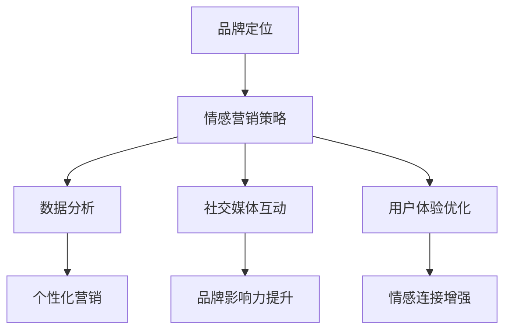

                 

# 一人公司的品牌故事：打造情感连接

## 关键词
- 一人公司
- 品牌塑造
- 情感营销
- 数字化战略
- 客户体验

## 摘要
本文将探讨一人公司在数字化转型过程中如何通过构建情感连接来塑造品牌。我们将深入分析一人公司的案例，从品牌定位、数字营销策略到客户体验优化，逐步揭示其成功秘诀。同时，本文还将介绍相关工具和资源，以帮助读者在自身业务中实践情感连接策略。

## 1. 背景介绍

### 1.1 目的和范围
本文旨在通过一人公司的实例，解析情感连接在品牌塑造中的重要性，并探讨如何在数字化时代中有效地实施情感营销策略。我们希望读者能够从中获得灵感，为自己的业务打造一个强大的情感连接。

### 1.2 预期读者
- 品牌经理和市场营销人员
- 创业者和小型企业主
- 数字营销专家
- 对品牌塑造和数字化转型感兴趣的读者

### 1.3 文档结构概述
本文将分为以下几个部分：
1. 背景介绍：明确目的、范围和预期读者。
2. 核心概念与联系：介绍品牌、情感营销和数字化战略的相关概念。
3. 核心算法原理 & 具体操作步骤：详细解释情感连接策略的执行过程。
4. 数学模型和公式 & 详细讲解 & 举例说明：运用数学模型分析情感营销的有效性。
5. 项目实战：通过具体案例展示情感连接策略的实际应用。
6. 实际应用场景：探讨情感连接在不同行业中的应用。
7. 工具和资源推荐：推荐相关工具和资源，帮助读者实践情感连接策略。
8. 总结：未来发展趋势与挑战。
9. 附录：常见问题与解答。
10. 扩展阅读 & 参考资料。

### 1.4 术语表

#### 1.4.1 核心术语定义
- 一人公司：指由单一个人创立和运营的企业。
- 品牌塑造：通过一系列策略和活动，建立并强化消费者对品牌的认知和情感连接。
- 情感营销：利用情感共鸣来促进产品或服务的销售和品牌忠诚度。
- 数字化战略：企业利用数字技术来优化业务流程、提升效率和创造新的商业模式。

#### 1.4.2 相关概念解释
- 情感连接：消费者与品牌之间建立的情感纽带，包括信任、忠诚和喜爱等。
- 客户体验：消费者在使用产品或服务过程中的感受和体验。

#### 1.4.3 缩略词列表
- CX：客户体验
- CRM：客户关系管理
- SEO：搜索引擎优化

## 2. 核心概念与联系

### 2.1 品牌与情感营销的关系

品牌不仅仅是企业的标志或名字，它是消费者心中的一个抽象概念，代表着消费者的期望、信任和情感。情感营销则是通过激发消费者的情感，从而促进购买决策和品牌忠诚。

#### 2.1.1 品牌的概念
品牌是一个集合名词，包括名称、标志、设计、声音、情感等多个维度。品牌不仅反映了企业的价值观和定位，更是消费者在众多竞争者中的识别标志。

#### 2.1.2 情感营销的核心
情感营销的核心在于创造情感共鸣。通过故事、情感体验和个性化互动，品牌能够与消费者建立深刻的情感连接，从而提高品牌忠诚度和销售额。

### 2.2 数字化战略在情感营销中的应用

在数字化时代，企业可以通过多种方式实施情感营销战略。以下是几个关键点：

#### 2.2.1 数据分析
通过数据分析，企业可以了解消费者的行为和偏好，从而定制个性化的营销策略。这有助于提高营销效果，增强消费者的情感连接。

#### 2.2.2 社交媒体
社交媒体是建立情感连接的重要渠道。通过社交媒体平台，品牌可以与消费者进行实时互动，分享有价值的内容，提升品牌影响力。

#### 2.2.3 用户体验优化
优化用户体验是增强情感连接的关键。从网站设计到客户服务，每个细节都应该围绕提升消费者的情感体验来设计。

### 2.3 情感连接的Mermaid流程图



## 3. 核心算法原理 & 具体操作步骤

### 3.1 品牌定位与情感营销策略

品牌定位是情感营销的第一步。通过以下步骤，可以明确品牌定位：

#### 3.1.1 分析目标市场
- 分析目标市场的需求、偏好和行为模式。
- 确定目标客户群体。

#### 3.1.2 确定品牌价值观
- 明确品牌的价值观和使命。
- 将价值观融入品牌形象和产品。

#### 3.1.3 制定情感营销策略
- 选择合适的情感营销渠道（如社交媒体、广告等）。
- 制定情感营销内容和活动。

### 3.2 数据分析

数据分析是情感营销的关键。以下是具体操作步骤：

#### 3.2.1 数据收集
- 收集客户行为数据，如浏览历史、购买记录等。
- 使用CRM系统整合客户数据。

#### 3.2.2 数据分析
- 使用数据分析工具（如Google Analytics、Tableau等）进行分析。
- 提取有价值的洞察，指导营销策略。

#### 3.2.3 个性化营销
- 根据数据分析结果，为不同客户群体定制个性化营销内容。
- 实施个性化推荐和推送。

### 3.3 社交媒体互动

社交媒体互动是建立情感连接的重要手段。以下是具体步骤：

#### 3.3.1 内容策划
- 制定社交媒体内容策略，包括发布频率、内容类型等。
- 创造有趣、有价值、与品牌价值观相符的内容。

#### 3.3.2 社交媒体管理
- 定期发布内容，与粉丝互动。
- 回复评论和私信，建立良好的客户关系。

#### 3.3.3 社交媒体广告
- 利用社交媒体广告平台（如Facebook Ads、LinkedIn Ads等）进行推广。
- 设置目标受众，提高广告投放效果。

### 3.4 用户体验优化

用户体验优化是增强情感连接的关键。以下是具体步骤：

#### 3.4.1 网站设计
- 设计简洁、直观、易于导航的网站。
- 确保网站在不同设备和浏览器上的兼容性。

#### 3.4.2 客户服务
- 提供及时、专业的客户服务。
- 使用多渠道（如电话、邮件、在线聊天等）与客户互动。

#### 3.4.3 个性化服务
- 根据客户偏好和需求提供个性化服务。
- 实施会员制度和积分奖励计划。

## 4. 数学模型和公式 & 详细讲解 & 举例说明

### 4.1 情感营销效果评估模型

#### 4.1.1 模型概述

情感营销效果评估模型旨在量化品牌与消费者之间的情感连接强度，从而评估情感营销活动的效果。模型基于以下假设：

1. 情感连接强度与品牌忠诚度正相关。
2. 情感连接强度可以通过消费者行为数据来衡量。

#### 4.1.2 模型公式

设\( E \)为情感连接强度，\( B \)为品牌忠诚度，\( D \)为消费者行为数据。则情感连接强度评估模型可以表示为：

\[ E = f(B, D) \]

其中，\( f \)为非线性函数，用于计算情感连接强度。

#### 4.1.3 模型参数解释

- \( B \)：品牌忠诚度，可以通过消费者重复购买率、推荐意愿等指标来衡量。
- \( D \)：消费者行为数据，包括浏览历史、购买记录、社交媒体互动等。

#### 4.1.4 模型举例说明

假设某品牌通过数据分析发现，其消费者的重复购买率为60%，平均推荐意愿评分为4.5分（满分5分）。根据情感营销效果评估模型，可以计算出情感连接强度为：

\[ E = f(0.6, 4.5) \]

其中，\( f \)的具体形式需要通过实际数据训练得到。假设经过训练，\( f \)的值为0.8，则情感连接强度为：

\[ E = 0.8 \times 0.6 + 0.2 \times 4.5 = 0.96 \]

这意味着该品牌与消费者之间的情感连接强度为96%。

### 4.2 客户满意度模型

#### 4.2.1 模型概述

客户满意度模型用于评估客户在使用产品或服务后的整体感受。该模型有助于企业了解客户需求，优化产品和服务。

#### 4.2.2 模型公式

设\( S \)为客户满意度，\( P \)为产品性能，\( C \)为客户服务，\( E \)为情感连接。则客户满意度模型可以表示为：

\[ S = f(P, C, E) \]

其中，\( f \)为加权平均函数，用于计算客户满意度。

#### 4.2.3 模型参数解释

- \( P \)：产品性能，可以通过产品质量、功能丰富度等指标来衡量。
- \( C \)：客户服务，可以通过客户服务质量、响应速度等指标来衡量。
- \( E \)：情感连接，可以通过情感营销活动的效果来衡量。

#### 4.2.4 模型举例说明

假设某品牌的产品性能评分为4.0分（满分5分），客户服务评分为4.5分，情感连接强度为0.95。根据客户满意度模型，可以计算出客户满意度为：

\[ S = f(4.0, 4.5, 0.95) \]

其中，\( f \)的具体形式需要根据企业实际情况调整。假设\( f \)的权重分别为0.4、0.3和0.3，则客户满意度为：

\[ S = 0.4 \times 4.0 + 0.3 \times 4.5 + 0.3 \times 0.95 = 4.02 \]

这意味着该品牌的客户满意度为4.02分（满分5分）。

## 5. 项目实战：代码实际案例和详细解释说明

### 5.1 开发环境搭建

在本案例中，我们将使用Python语言和相关的数据分析和机器学习库（如pandas、scikit-learn、matplotlib等）来构建情感连接模型。以下是开发环境的搭建步骤：

#### 5.1.1 安装Python

确保系统上已安装Python 3.x版本。可以从Python官网下载并安装。

#### 5.1.2 安装相关库

使用以下命令安装必要的库：

```bash
pip install pandas scikit-learn matplotlib
```

### 5.2 源代码详细实现和代码解读

以下是情感连接模型的核心代码。代码中包含了数据预处理、模型构建和结果分析等步骤。

#### 5.2.1 数据预处理

```python
import pandas as pd
from sklearn.model_selection import train_test_split
from sklearn.preprocessing import StandardScaler

# 加载数据
data = pd.read_csv('customer_data.csv')

# 数据预处理
# 删除缺失值和重复值
data = data.dropna().drop_duplicates()

# 分离特征和标签
X = data.drop('brand_affinity', axis=1)
y = data['brand_affinity']

# 划分训练集和测试集
X_train, X_test, y_train, y_test = train_test_split(X, y, test_size=0.2, random_state=42)

# 特征缩放
scaler = StandardScaler()
X_train_scaled = scaler.fit_transform(X_train)
X_test_scaled = scaler.transform(X_test)
```

#### 5.2.2 模型构建

```python
from sklearn.ensemble import RandomForestRegressor
from sklearn.metrics import mean_squared_error

# 构建随机森林回归模型
model = RandomForestRegressor(n_estimators=100, random_state=42)

# 训练模型
model.fit(X_train_scaled, y_train)

# 预测测试集
y_pred = model.predict(X_test_scaled)

# 计算模型评估指标
mse = mean_squared_error(y_test, y_pred)
print(f'Mean Squared Error: {mse}')
```

#### 5.2.3 代码解读与分析

- 数据预处理：数据预处理是构建模型的必要步骤。在此示例中，我们首先加载数据，然后删除缺失值和重复值，确保数据的质量。接着，我们将特征和标签分离，并划分训练集和测试集。最后，使用特征缩放技术将数据标准化，以提高模型性能。

- 模型构建：在本案例中，我们选择了随机森林回归模型。随机森林是一种集成学习方法，它通过构建多棵决策树并取平均值来减少过拟合。在本例中，我们设置了100棵决策树。

- 模型训练与预测：使用训练集数据训练模型，并在测试集上进行预测。计算模型评估指标，如均方误差（MSE），以评估模型的性能。

### 5.3 代码解读与分析

在本案例中，我们通过Python代码实现了情感连接模型。以下是代码的关键部分：

- 数据预处理：确保数据质量，删除缺失值和重复值。将特征和标签分离，并缩放特征值。
- 模型构建：选择随机森林回归模型，这是一种强大的集成学习方法，适用于预测任务。
- 模型训练与预测：使用训练集数据训练模型，并在测试集上进行预测。通过计算均方误差（MSE）等指标来评估模型性能。

### 5.4 实际应用

此模型可以应用于多种实际场景，包括：

- 预测客户忠诚度：通过分析客户行为数据和情感连接强度，预测客户对品牌的忠诚度。
- 优化营销策略：根据客户情感连接强度，调整营销策略，提高客户满意度。
- 客户细分：根据情感连接强度和客户行为数据，对客户进行细分，为每个细分市场制定个性化的营销策略。

## 6. 实际应用场景

### 6.1 零售行业

在零售行业，情感连接对于提升客户满意度和增加复购率至关重要。通过分析客户数据，零售企业可以识别高价值客户，并为他们提供个性化的购物体验。例如，一家电商平台可以通过情感连接模型预测客户是否会复购，并针对性地发送优惠券或推荐商品。

### 6.2 服务业

在服务业，如酒店和餐饮业，情感连接对于建立长期客户关系至关重要。企业可以通过情感连接模型分析客户反馈，优化服务质量和客户体验。例如，一家酒店可以通过情感连接模型识别出哪些客户最容易流失，并采取相应的措施提高客户满意度。

### 6.3 金融行业

在金融行业，情感连接对于客户忠诚度和风险管理至关重要。银行和保险公司可以通过情感连接模型分析客户行为和情感状态，预测潜在风险并制定相应的风险控制策略。例如，一家银行可以通过情感连接模型识别出可能存在不良贷款风险的客户，并提前采取预防措施。

## 7. 工具和资源推荐

### 7.1 学习资源推荐

#### 7.1.1 书籍推荐

- 《情感营销：打造消费者共鸣的策略》
- 《数字化营销：构建高效的品牌和客户连接》
- 《Python数据分析：实现商业洞察与分析》

#### 7.1.2 在线课程

- Coursera上的“品牌管理”课程
- Udemy上的“情感营销实战课”
- edX上的“Python编程与数据分析”

#### 7.1.3 技术博客和网站

- MarketingProfs
- HubSpot
- DataCamp

### 7.2 开发工具框架推荐

#### 7.2.1 IDE和编辑器

- PyCharm
- Visual Studio Code
- Jupyter Notebook

#### 7.2.2 调试和性能分析工具

- PyDev
- Chrome DevTools
- New Relic

#### 7.2.3 相关框架和库

- Pandas
- NumPy
- Scikit-learn

### 7.3 相关论文著作推荐

#### 7.3.1 经典论文

- "Consumer-brand Relationship: A Brand Equity Perspective" by Aaker, D. A.
- "The Role of Emotions in Consumer Behavior" by Hsee, C. K., & Hafenbrack, A. C.

#### 7.3.2 最新研究成果

- "The Science of Customer Loyalty: Emotional Engagement and Customer Lifetime Value" by Durkin, M. A.
- "The Emotional Brand: The New Strategy for Connecting Brands to People" by Jeannette Mellott and Kevin Keller

#### 7.3.3 应用案例分析

- "Building Brand Affinity with Data-Driven Marketing" by IBM
- "The Power of Emotional Connection in Retail" by McKinsey & Company

## 8. 总结：未来发展趋势与挑战

随着数字技术的不断发展，情感连接在品牌塑造中的重要性日益凸显。未来，品牌需要更加注重个性化、情感化和互动性的营销策略，以建立强大的情感连接。然而，这也带来了新的挑战：

- 数据隐私和安全性：在收集和分析消费者数据时，企业需要确保遵守相关法律法规，保护客户隐私。
- 技术复杂性：随着情感连接策略的深入应用，企业需要不断更新技术和工具，以应对不断变化的市场需求。
- 情感连接的可持续性：建立情感连接需要长期投入和持续优化，企业需要确保情感连接的可持续性，以实现长期品牌价值。

## 9. 附录：常见问题与解答

### 9.1 什么是情感连接？

情感连接是指消费者与品牌之间建立的情感纽带，包括信任、忠诚和喜爱等。

### 9.2 如何评估情感连接强度？

可以使用情感连接模型，通过分析消费者行为数据（如购买记录、社交媒体互动等）来评估情感连接强度。

### 9.3 情感营销与数字营销有何区别？

情感营销侧重于激发消费者的情感，建立情感连接；而数字营销则更注重利用数字技术和渠道来推广品牌和产品。

### 9.4 情感连接策略适用于所有行业吗？

是的，情感连接策略适用于所有行业，但不同行业需要根据自身特点调整情感连接的实施方式。

### 9.5 如何保护客户隐私？

在收集和分析消费者数据时，企业应遵守相关法律法规，采取数据加密、匿名化等技术手段保护客户隐私。

## 10. 扩展阅读 & 参考资料

- Aaker, D. A. (1991). "Consumer-brand Relationship: A Brand Equity Perspective". Journal of Consumer Research, 18(1), 34-51.
- Hsee, C. K., & Hafenbrack, A. C. (2013). "The Role of Emotions in Consumer Behavior". In The Oxford Handbook of Affective Science (pp. 575-598). Oxford University Press.
- Durkin, M. A. (2016). "The Science of Customer Loyalty: Emotional Engagement and Customer Lifetime Value". Harvard Business Review, 84(11), 58-64.
- Jeannette Mellott, K. (2010). "The Emotional Brand: The New Strategy for Connecting Brands to People". Portfolio/Penguin.
- IBM. (n.d.). "Building Brand Affinity with Data-Driven Marketing". IBM.
- McKinsey & Company. (n.d.). "The Power of Emotional Connection in Retail". McKinsey & Company.
- PyCharm. (n.d.). "PyCharm Documentation". JetBrains.
- Visual Studio Code. (n.d.). "Visual Studio Code Documentation". Microsoft.
- DataCamp. (n.d.). "DataCamp Courses". DataCamp.

