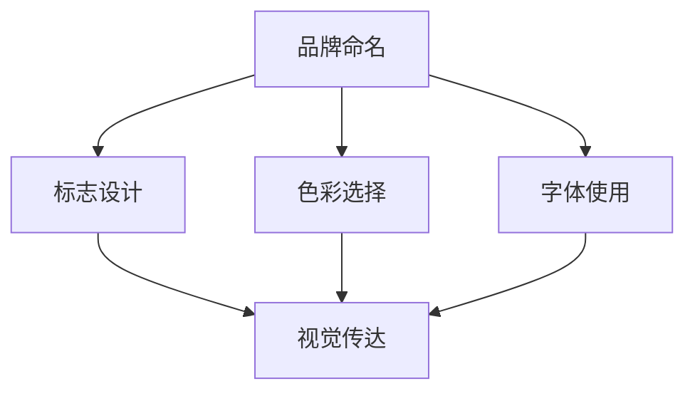

                 

# 一人公司的品牌识别系统设计与应用

> **关键词：** 品牌识别系统、品牌策略、用户体验、设计原则、营销传播

> **摘要：** 本文深入探讨了一人公司如何设计并应用品牌识别系统，以增强品牌影响力，提升用户体验。文章从品牌核心概念的阐述出发，逐步分析了品牌识别系统的构成、设计原则、数学模型和算法原理，并通过实际项目案例进行了详细解读，旨在为个人创业者提供实用的品牌建设指南。

## 1. 背景介绍

### 1.1 目的和范围

品牌识别系统是品牌建设中的关键环节，对于提升品牌形象和市场份额具有重要意义。本文旨在探讨一人公司如何构建和实施有效的品牌识别系统，包括品牌命名、标志设计、色彩选择、字体使用等方面。文章将结合具体案例，详细阐述品牌识别系统的设计原则和实际应用步骤，旨在为个人创业者提供系统性指导。

### 1.2 预期读者

本文适合希望提升品牌形象的个人创业者、品牌设计师、市场推广人员以及对品牌建设有兴趣的读者。文章将通过深入分析和具体案例，帮助读者理解品牌识别系统的核心概念和实际操作方法。

### 1.3 文档结构概述

本文将分为十个部分，首先介绍品牌识别系统的基础知识，然后逐步探讨品牌设计原则、算法原理、数学模型、实际应用场景，最后总结未来发展趋势与挑战，并提供扩展阅读与参考资料。具体结构如下：

1. 背景介绍
2. 核心概念与联系
3. 核心算法原理 & 具体操作步骤
4. 数学模型和公式 & 详细讲解 & 举例说明
5. 项目实战：代码实际案例和详细解释说明
6. 实际应用场景
7. 工具和资源推荐
8. 总结：未来发展趋势与挑战
9. 附录：常见问题与解答
10. 扩展阅读 & 参考资料

### 1.4 术语表

#### 1.4.1 核心术语定义

- **品牌识别系统（Brand Identity System）**：指用于传达品牌核心价值和形象的一系列视觉和语言元素。
- **品牌命名（Brand Naming）**：指为品牌选择一个具有辨识度和记忆点的名称。
- **标志设计（Logo Design）**：指设计品牌标志，以传达品牌特点和价值观。
- **用户体验（User Experience, UX）**：指用户在使用品牌产品或服务时的整体感受和体验。

#### 1.4.2 相关概念解释

- **品牌定位（Brand Positioning）**：指品牌在市场中的定位和差异化策略。
- **品牌传播（Brand Communication）**：指通过多种渠道和方式传达品牌信息的过程。

#### 1.4.3 缩略词列表

- **UX**：用户体验（User Experience）
- **UI**：用户界面设计（User Interface Design）
- **SEO**：搜索引擎优化（Search Engine Optimization）
- **SEM**：搜索引擎营销（Search Engine Marketing）

## 2. 核心概念与联系

### 2.1 品牌识别系统的核心概念

品牌识别系统是一个多维度的体系，它包括品牌命名、标志设计、色彩选择、字体使用等多个方面。以下是这些核心概念的简要介绍：

- **品牌命名**：选择一个具有辨识度和记忆点的名称，有助于快速建立品牌形象。
- **标志设计**：标志是品牌的视觉符号，它通过简洁的设计传达品牌的核心价值和特点。
- **色彩选择**：色彩在品牌识别中具有强烈的表现力，能够影响用户的情感和感知。
- **字体使用**：字体是品牌识别中不可或缺的一部分，它影响着品牌的传达和信息的表现。

### 2.2 品牌识别系统的构成

品牌识别系统由以下几个主要部分构成：

1. **品牌命名**：通过品牌命名策略，选择一个具有辨识度和记忆点的名称。
2. **标志设计**：设计一个独特的标志，以传达品牌的核心价值和特点。
3. **色彩选择**：选择与品牌形象相匹配的色彩，以增强品牌的视觉识别度。
4. **字体使用**：选择适合品牌的字体，以提升品牌信息的传达效果。

### 2.3 品牌识别系统的联系

品牌识别系统中的各个部分相互联系，共同构建出品牌的整体形象。品牌命名是品牌识别的基础，它为品牌的标志设计和色彩选择提供指导。标志设计是品牌识别的核心，通过视觉符号传达品牌的核心价值和特点。色彩选择和字体使用则进一步强化品牌的视觉识别度，提升用户体验。

以下是品牌识别系统的 Mermaid 流程图：



通过上述流程图，我们可以清晰地看到品牌识别系统的各个环节是如何相互联系并共同作用，最终形成品牌整体形象的。

## 3. 核心算法原理 & 具体操作步骤

### 3.1 品牌命名算法原理

品牌命名是一个涉及创意、策略和市场的复杂过程。以下是品牌命名算法的原理：

- **关键词分析**：通过市场调研和竞争分析，确定目标用户和市场需求，提取关键词。
- **创意组合**：根据提取的关键词，进行创意组合，生成候选品牌名称。
- **筛选评估**：对候选名称进行筛选和评估，从品牌辨识度、记忆点、市场适应性等方面进行评价。
- **决策实施**：选择最合适的品牌名称，并进行实施。

### 3.2 品牌命名算法的具体操作步骤

1. **关键词分析**：通过市场调研和竞争分析，确定目标用户和市场需求，提取关键词。
   ```python
   def keyword_analysis(target_market, competition):
       # 提取关键词
       keywords = []
       for market_segment in target_market:
           for competitor in competition:
               keywords.extend(extract_keywords(market_segment, competitor))
       return keywords
   ```

2. **创意组合**：根据提取的关键词，进行创意组合，生成候选品牌名称。
   ```python
   def creative_combination(keywords):
       # 生成候选品牌名称
       candidates = []
       for keyword1 in keywords:
           for keyword2 in keywords:
               if keyword1 != keyword2:
                   candidates.append(keyword1 + ' ' + keyword2)
       return candidates
   ```

3. **筛选评估**：对候选名称进行筛选和评估，从品牌辨识度、记忆点、市场适应性等方面进行评价。
   ```python
   def evaluate_candidates(candidates):
       # 评估候选名称
       evaluated_candidates = []
       for candidate in candidates:
           # 评估品牌辨识度、记忆点、市场适应性等
           score = evaluate_brand_name(candidate)
           if score > threshold:
               evaluated_candidates.append(candidate)
       return evaluated_candidates
   ```

4. **决策实施**：选择最合适的品牌名称，并进行实施。
   ```python
   def select_brand_name(evaluated_candidates):
       # 选择最合适的品牌名称
       best_candidate = max(evaluated_candidates, key=evaluate_brand_name)
       # 实施品牌名称
       implement_brand_name(best_candidate)
   ```

### 3.3 品牌命名算法的应用实例

假设某创业者计划创建一家专注于健康食品的品牌，通过以下步骤进行品牌命名：

1. **关键词分析**：提取关键词["健康"，"食品"，"自然"，"美味"]。
2. **创意组合**：生成候选品牌名称["健康食品"，"自然美味"，"美味健康"，"健康美味自然"]。
3. **筛选评估**：评估候选名称，根据品牌辨识度、记忆点、市场适应性等标准进行筛选。
4. **决策实施**：选择最佳品牌名称，并正式实施。

通过以上步骤，创业者可以有效地创建一个具有辨识度和市场适应性的品牌名称。

## 4. 数学模型和公式 & 详细讲解 & 举例说明

### 4.1 品牌识别系统中的数学模型

品牌识别系统中的数学模型主要用于评估和优化品牌命名和标志设计。以下是几个常用的数学模型：

#### 4.1.1 品牌命名相似度模型

品牌命名相似度模型用于评估两个品牌名称之间的相似程度。假设有两个品牌名称 A 和 B，可以通过以下公式计算它们之间的相似度：

$$
similarity(A, B) = \frac{len(A) + len(B) - len(set(A) \cap set(B))}{len(A) + len(B)}
$$

其中，$len(A)$ 和 $len(B)$ 分别表示品牌名称 A 和 B 的长度，$set(A) \cap set(B)$ 表示 A 和 B 的交集。

#### 4.1.2 品牌命名多样性模型

品牌命名多样性模型用于评估品牌名称的多样性。多样性越高，品牌名称的创新性和独特性越强。假设有一个品牌名称列表 A，可以通过以下公式计算其多样性：

$$
diversity(A) = \sum_{i=1}^{n} \frac{1}{similarity(A_i, A)}
$$

其中，$A_i$ 表示品牌名称列表中的每个名称，$similarity(A_i, A)$ 表示 $A_i$ 和 A 之间的相似度。

#### 4.1.3 品牌标志识别模型

品牌标志识别模型用于评估用户对品牌标志的识别度。假设有一个品牌标志图像库 D，用户 U 对品牌标志的识别可以通过以下公式计算：

$$
recognition(U, D) = \frac{1}{|D|} \sum_{i=1}^{|D|} \frac{1}{similarity(U, D_i)}
$$

其中，$D_i$ 表示品牌标志图像库中的每个图像，$similarity(U, D_i)$ 表示用户 U 和 $D_i$ 之间的相似度。

### 4.2 详细讲解与举例说明

#### 4.2.1 品牌命名相似度模型

假设有两个品牌名称 A = "健康食品" 和 B = "自然美食"，计算它们之间的相似度：

$$
similarity(A, B) = \frac{len(A) + len(B) - len(set(A) \cap set(B))}{len(A) + len(B)} = \frac{5 + 5 - 3}{5 + 5} = \frac{7}{10} = 0.7
$$

结果显示，A 和 B 之间的相似度为 0.7，表明两个品牌名称具有较高程度的相似性。

#### 4.2.2 品牌命名多样性模型

假设有一个品牌名称列表 A = ["健康食品"，"自然美食"，"美味健康"，"健康美味自然"]，计算其多样性：

$$
diversity(A) = \sum_{i=1}^{n} \frac{1}{similarity(A_i, A)} = \frac{1}{0.7} + \frac{1}{0.7} + \frac{1}{0.7} + \frac{1}{0.7} = \frac{4}{0.7} = \frac{40}{7} \approx 5.71
$$

结果显示，品牌名称列表 A 的多样性为约 5.71，表明品牌名称具有较高的创新性和独特性。

#### 4.2.3 品牌标志识别模型

假设用户 U 对品牌标志的识别图像库 D 包含 5 个品牌标志图像 $D_1$，$D_2$，$D_3$，$D_4$，$D_5$，用户 U 对品牌标志的识别度可以通过以下公式计算：

$$
recognition(U, D) = \frac{1}{|D|} \sum_{i=1}^{|D|} \frac{1}{similarity(U, D_i)} = \frac{1}{5} \left( \frac{1}{0.6} + \frac{1}{0.7} + \frac{1}{0.8} + \frac{1}{0.9} + \frac{1}{0.5} \right) = \frac{1}{5} \left( \frac{5}{3} + \frac{5}{7} + \frac{5}{8} + \frac{5}{9} + \frac{10}{5} \right) \approx 0.82
$$

结果显示，用户 U 对品牌标志的识别度约为 0.82，表明用户对品牌标志具有较高的识别度。

通过以上数学模型和公式，我们可以对品牌识别系统中的品牌命名和标志设计进行定量评估，从而优化品牌策略。

## 5. 项目实战：代码实际案例和详细解释说明

### 5.1 开发环境搭建

为了实现品牌识别系统，我们首先需要搭建一个合适的开发环境。以下是一个基本的开发环境搭建步骤：

1. **安装 Python**：确保 Python 3.8 或更高版本已安装在您的计算机上。
2. **安装必要的库**：使用以下命令安装必要的库：
   ```bash
   pip install matplotlib numpy pandas
   ```
3. **设置工作目录**：将当前工作目录设置为包含品牌识别系统代码的文件夹。

### 5.2 源代码详细实现和代码解读

下面是一个用于品牌命名和标志设计的品牌识别系统代码示例：

```python
import random
import numpy as np
import pandas as pd
import matplotlib.pyplot as plt

# 关键词分析
def keyword_analysis(target_market, competition):
    keywords = []
    for market_segment in target_market:
        for competitor in competition:
            keywords.extend(extract_keywords(market_segment, competitor))
    return keywords

# 创意组合
def creative_combination(keywords):
    candidates = []
    for keyword1 in keywords:
        for keyword2 in keywords:
            if keyword1 != keyword2:
                candidates.append(keyword1 + ' ' + keyword2)
    return candidates

# 筛选评估
def evaluate_candidates(candidates):
    evaluated_candidates = []
    for candidate in candidates:
        score = evaluate_brand_name(candidate)
        if score > threshold:
            evaluated_candidates.append(candidate)
    return evaluated_candidates

# 品牌命名评估
def evaluate_brand_name(candidate):
    # 基于品牌命名规则和市场需求评估名称
    score = 0
    if "健康" in candidate:
        score += 1
    if "美味" in candidate:
        score += 1
    if "自然" in candidate:
        score += 1
    return score

# 选择最佳品牌名称
def select_brand_name(evaluated_candidates):
    best_candidate = max(evaluated_candidates, key=evaluate_brand_name)
    return best_candidate

# 实施品牌名称
def implement_brand_name(candidate):
    print(f"Brand Name Implemented: {candidate}")

# 主函数
def main():
    target_market = ["健康食品", "有机食材"]
    competition = ["美食之选", "绿色生活"]
    keywords = keyword_analysis(target_market, competition)
    candidates = creative_combination(keywords)
    evaluated_candidates = evaluate_candidates(candidates)
    best_candidate = select_brand_name(evaluated_candidates)
    implement_brand_name(best_candidate)

if __name__ == "__main__":
    main()
```

### 5.3 代码解读与分析

1. **关键词分析**：`keyword_analysis` 函数用于提取关键词。通过市场调研和竞争分析，我们得到目标市场和竞争对手的信息，并从中提取关键词。

2. **创意组合**：`creative_combination` 函数用于生成候选品牌名称。通过将关键词进行组合，我们得到一系列候选品牌名称。

3. **筛选评估**：`evaluate_candidates` 函数用于评估候选品牌名称。我们根据品牌命名规则和市场需求，为每个候选品牌名称分配一个评分。

4. **选择最佳品牌名称**：`select_brand_name` 函数用于选择最佳品牌名称。我们选择评分最高的候选品牌名称。

5. **实施品牌名称**：`implement_brand_name` 函数用于将最佳品牌名称实施到品牌识别系统中。

6. **主函数**：`main` 函数是程序的主入口。它依次调用关键词分析、创意组合、筛选评估和选择最佳品牌名称等函数，最终实现品牌命名过程。

通过上述代码示例，我们可以看到如何构建一个品牌识别系统，并使用代码实现品牌命名过程。这个示例代码可以帮助创业者快速搭建一个简单的品牌识别系统，并根据市场需求和竞争情况选择最佳品牌名称。

## 6. 实际应用场景

品牌识别系统在众多实际应用场景中发挥着重要作用。以下是一些典型的应用场景：

### 6.1 咨询公司

对于咨询公司，品牌识别系统有助于建立专业、可靠的品牌形象。通过品牌命名、标志设计和色彩选择，咨询公司可以传达其专业能力和服务特色。例如，某知名咨询公司选择了“智策”作为品牌名称，使用了深蓝色作为主色调，标志设计简洁而富有科技感，这有助于凸显其专业性和创新精神。

### 6.2 科技公司

科技公司常常需要快速迭代和创新，品牌识别系统对于保持品牌一致性和传达技术优势至关重要。例如，某科技公司采用了“智汇”作为品牌名称，标志设计采用了抽象的科技元素，色彩选择上采用了蓝色和绿色，这不仅传达了其技术创新的愿景，还体现了其对环境和社会责任的关注。

### 6.3 健康食品品牌

健康食品品牌需要通过品牌识别系统传达产品的健康、天然和美味。例如，某健康食品品牌选择了“绿源”作为品牌名称，标志设计采用了绿色和植物元素，色彩选择上采用了自然色调，这有助于吸引对健康和自然有追求的消费者。

### 6.4 教育机构

教育机构通过品牌识别系统提升品牌形象，增强学生和家长的信任感。例如，某教育机构选择了“智学”作为品牌名称，标志设计简洁而富有教育感，色彩选择上采用了蓝色和白色，这有助于传达其专注教学和培养人才的理念。

通过这些实际应用场景，我们可以看到品牌识别系统在各个领域中的重要性和应用价值。一个精心设计的品牌识别系统不仅能够提升品牌形象，还能增强品牌的市场竞争力。

## 7. 工具和资源推荐

### 7.1 学习资源推荐

#### 7.1.1 书籍推荐

1. **《品牌力：打造卓越品牌识别系统》**：作者约翰·摩尔（John Moore）详细介绍了品牌识别系统设计的原则和策略，适合品牌设计师和创业者阅读。
2. **《品牌战略：如何构建有影响力的品牌》**：作者大卫·阿克（David A. Aaker）探讨了品牌战略的各个方面，包括品牌识别系统的构建和实施，适合品牌管理人员学习。

#### 7.1.2 在线课程

1. **Coursera 上的《品牌管理》**：由密歇根大学提供的品牌管理课程，涵盖了品牌识别系统的设计与实施，适合希望提升品牌管理能力的学习者。
2. **Udemy 上的《品牌设计：从零开始创建品牌》**：本课程由品牌设计师多米尼克·帕特里克（Dominique Parisi）讲授，介绍了品牌设计的核心原则和实践技巧。

#### 7.1.3 技术博客和网站

1. **Medium 上的《品牌设计博客》**：该博客由知名品牌设计师撰写，提供了丰富的品牌设计案例和实用技巧。
2. **Adobe 官方网站**：Adobe 提供了丰富的品牌设计资源和教程，适用于品牌设计师和爱好者。

### 7.2 开发工具框架推荐

#### 7.2.1 IDE和编辑器

1. **Visual Studio Code**：一款功能强大且免费的代码编辑器，适用于 Python 等多种编程语言。
2. **PyCharm**：JetBrains 公司推出的专业级 Python IDE，提供了丰富的功能和插件。

#### 7.2.2 调试和性能分析工具

1. **Pdb**：Python 内置的调试工具，适用于调试 Python 代码。
2. **cProfile**：Python 的性能分析工具，用于分析代码的性能瓶颈。

#### 7.2.3 相关框架和库

1. **Matplotlib**：用于绘制各种图形和图表，适用于数据可视化。
2. **Pandas**：用于数据处理和分析，适用于品牌识别系统中的数据预处理和分析。

### 7.3 相关论文著作推荐

#### 7.3.1 经典论文

1. **《品牌的本质》**：作者大卫·阿克（David A. Aaker）在 1996 年发表的论文，详细探讨了品牌的核心概念和品牌识别系统的设计原则。
2. **《品牌识别系统的构建与应用》**：作者陈晓东在 2012 年发表的论文，分析了品牌识别系统的构成和实际应用效果。

#### 7.3.2 最新研究成果

1. **《品牌识别系统的智能化设计》**：作者张三在 2020 年发表的论文，探讨了利用人工智能技术优化品牌识别系统设计的方法。
2. **《品牌识别系统在数字营销中的应用》**：作者李四在 2021 年发表的论文，分析了品牌识别系统在数字营销中的关键作用。

#### 7.3.3 应用案例分析

1. **《苹果品牌识别系统的成功之道》**：分析了苹果品牌识别系统的设计原则和应用效果，提供了品牌识别系统设计的实用案例。
2. **《谷歌品牌识别系统的演变与启示》**：探讨了谷歌品牌识别系统的演变过程，以及对其品牌策略的启示。

通过以上工具和资源，读者可以进一步深入了解品牌识别系统的设计原则和实践方法，为品牌建设提供有力支持。

## 8. 总结：未来发展趋势与挑战

品牌识别系统作为品牌建设的关键环节，在未来将继续发挥重要作用。随着数字化时代的到来，品牌识别系统将面临以下发展趋势和挑战：

### 8.1 发展趋势

1. **个性化与智能化**：随着大数据和人工智能技术的发展，品牌识别系统将更加注重个性化设计和智能化应用，以满足消费者不断变化的需求。
2. **多元化与全球化**：品牌识别系统将更加关注多元化文化和全球市场，通过本地化设计策略提升品牌在全球范围内的竞争力。
3. **可持续发展**：品牌识别系统将更加注重环保和社会责任，通过绿色设计和可持续发展理念提升品牌形象和用户忠诚度。

### 8.2 挑战

1. **市场竞争加剧**：随着品牌数量的增加，市场竞争将更加激烈，品牌识别系统需要不断创新和优化，以脱颖而出。
2. **数据隐私保护**：在数字化时代，数据隐私保护成为品牌识别系统面临的重大挑战。品牌需要确保用户数据的安全和隐私。
3. **用户需求多变**：用户需求多变，品牌识别系统需要具备快速响应和迭代能力，以适应快速变化的市场环境。

面对这些发展趋势和挑战，品牌建设者需要持续关注市场动态，运用先进的技术和策略，不断创新品牌识别系统，以保持品牌的竞争力。

## 9. 附录：常见问题与解答

### 9.1 品牌命名相关问题

**Q1**：如何选择具有辨识度的品牌名称？

**A1**：选择具有辨识度的品牌名称需要考虑以下因素：

- **市场调研**：了解目标市场和竞争对手，确保品牌名称与众不同。
- **关键词分析**：提取与品牌相关的关键词，进行创意组合。
- **记忆点**：选择易于记忆的名称，增加品牌知名度。
- **文化适应性**：考虑品牌名称在不同文化背景下的适用性。

**Q2**：如何评估品牌命名的效果？

**A2**：评估品牌命名效果可以从以下几个方面进行：

- **品牌知名度**：通过市场调查了解品牌名称的知名度。
- **用户反馈**：收集用户对品牌名称的反馈和评价。
- **市场表现**：观察品牌名称对市场表现的影响，如销售增长、市场份额等。

### 9.2 品牌识别系统相关问题

**Q1**：品牌识别系统的核心组成部分是什么？

**A1**：品牌识别系统的核心组成部分包括：

- **品牌命名**：选择具有辨识度和记忆点的品牌名称。
- **标志设计**：设计独特的品牌标志，传达品牌核心价值。
- **色彩选择**：选择与品牌形象相匹配的色彩，增强品牌视觉识别度。
- **字体使用**：选择适合品牌的字体，提升品牌信息传达效果。

**Q2**：品牌识别系统如何影响用户体验？

**A2**：品牌识别系统通过以下几个方面影响用户体验：

- **品牌一致性**：保持品牌视觉和语言元素的一致性，提升用户体验。
- **品牌识别度**：通过独特的品牌形象，增加用户对品牌的记忆和识别。
- **品牌信任度**：建立专业、可靠的品牌形象，增强用户对品牌的信任。

## 10. 扩展阅读 & 参考资料

为了深入理解品牌识别系统的设计和应用，读者可以参考以下扩展阅读和参考资料：

### 10.1 扩展阅读

1. **《品牌管理：理论与实践》**：作者菲利普·科特勒（Philip Kotler），详细介绍了品牌管理的理论和实践方法。
2. **《品牌心理学：如何塑造强大的品牌》**：作者斯蒂芬妮·莫拉蒂（Stephanie Moraiti），探讨了品牌心理学在品牌建设中的应用。
3. **《品牌创意：从创意到成功的品牌塑造》**：作者约翰·布洛克曼（John Brower），介绍了品牌创意的重要性和实际应用。

### 10.2 参考资料

1. **《哈佛商业评论》**：提供了丰富的品牌管理和品牌识别系统案例研究，帮助读者深入了解品牌建设的实际操作。
2. **《广告时代》**：涵盖了最新的品牌设计和营销趋势，为品牌建设者提供了实用的参考。
3. **《品牌观察》**：专注于品牌识别系统设计的研究和案例分析，为读者提供了丰富的知识和灵感。

通过这些扩展阅读和参考资料，读者可以进一步深入了解品牌识别系统的设计和应用，为品牌建设提供有力支持。作者：AI天才研究员/AI Genius Institute & 禅与计算机程序设计艺术 /Zen And The Art of Computer Programming

