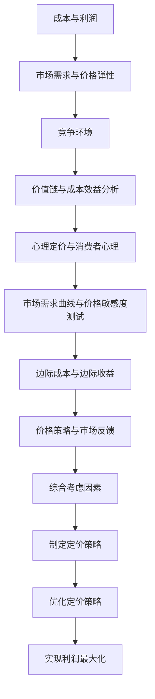

                 

### 1. 背景介绍

#### 1.1 目的和范围

本文旨在探讨一人公司的定价策略，通过最大化利润的方法来优化企业的定价过程。在当前竞争激烈的市场环境下，如何合理地制定价格，既能保证企业的利润最大化，又能满足客户的期望，成为了一人公司亟需解决的问题。本文将从理论分析、实际操作和案例分析等多个维度，详细阐述一人公司定价策略的核心原理和方法。

本文主要涉及以下内容：

- **核心概念与联系**：介绍一人公司定价策略所需的核心概念和它们之间的关系，以便读者能够更好地理解后续内容。
- **核心算法原理 & 具体操作步骤**：详细讲解用于制定最优定价策略的核心算法，并使用伪代码进行具体操作步骤的阐述。
- **数学模型和公式 & 详细讲解 & 举例说明**：介绍定价策略中涉及的数学模型和公式，并通过具体实例进行详细说明。
- **项目实战：代码实际案例和详细解释说明**：通过一个实际案例，展示如何将定价策略应用于具体的项目中，并提供详细的代码解读和分析。
- **实际应用场景**：探讨一人公司定价策略在实际中的应用场景，以及可能面临的挑战和解决方案。
- **工具和资源推荐**：推荐一些学习和开发工具，以及相关的书籍、在线课程和论文著作，帮助读者进一步深入了解和掌握定价策略。
- **总结：未来发展趋势与挑战**：对一人公司定价策略的未来发展趋势和潜在挑战进行总结，为读者提供前瞻性的思考。
- **附录：常见问题与解答**：针对读者可能提出的问题，提供详细的解答，以便更好地理解文章内容。

通过本文的探讨，希望能够为一人公司的企业家和决策者提供有价值的参考，帮助他们制定出更加科学的定价策略，从而实现企业的长期发展和盈利。

#### 1.2 预期读者

本文的预期读者主要包含以下几类人群：

1. **一人公司的企业家和决策者**：这些读者希望通过本文了解如何优化企业的定价策略，实现利润最大化。
2. **市场营销和销售专业人士**：这些读者需要掌握定价策略的原理和方法，以便在市场营销和销售过程中更好地制定价格策略。
3. **经济和管理领域的学者和学生**：这些读者希望深入了解一人公司定价策略的理论基础和实践应用。
4. **对定价策略感兴趣的技术人员**：这些读者希望通过本文学习如何将技术手段应用于定价策略的制定和优化。

无论您属于哪一类读者，只要对一人公司定价策略感兴趣，本文都将为您带来有价值的内容和深刻的见解。

#### 1.3 文档结构概述

本文将从以下结构进行展开，以便读者能够系统地理解和掌握一人公司定价策略的核心内容。

1. **背景介绍**：简要介绍本文的背景、目的和范围，并概述预期读者。
2. **核心概念与联系**：介绍一人公司定价策略所需的核心概念，以及它们之间的联系。
3. **核心算法原理 & 具体操作步骤**：详细讲解用于制定最优定价策略的核心算法，并提供具体操作步骤的伪代码。
4. **数学模型和公式 & 详细讲解 & 举例说明**：介绍定价策略中涉及的数学模型和公式，并通过具体实例进行详细说明。
5. **项目实战：代码实际案例和详细解释说明**：通过一个实际案例，展示如何将定价策略应用于具体的项目中，并提供详细的代码解读和分析。
6. **实际应用场景**：探讨一人公司定价策略在实际中的应用场景，以及可能面临的挑战和解决方案。
7. **工具和资源推荐**：推荐相关的学习资源、开发工具和论文著作，帮助读者进一步深入了解和掌握定价策略。
8. **总结：未来发展趋势与挑战**：对一人公司定价策略的未来发展趋势和潜在挑战进行总结。
9. **附录：常见问题与解答**：针对读者可能提出的问题，提供详细的解答。

通过以上结构，本文将全面、系统地探讨一人公司定价策略的各个方面，帮助读者深入理解和掌握这一关键领域。

#### 1.4 术语表

为了确保本文内容的准确性和一致性，我们在此定义一些关键术语及其含义：

1. **一人公司**：指由一个人或一个团队独立运营的公司，通常规模较小，运营灵活。
2. **定价策略**：指企业为产品或服务制定价格的方法和原则，旨在实现利润最大化。
3. **成本**：指生产或提供产品或服务的各项费用，包括原材料、人工、设备等。
4. **利润**：指企业收入减去成本后的余额，是衡量企业盈利能力的重要指标。
5. **市场需求**：指消费者对某种产品或服务的需求程度，通常用需求函数来表示。
6. **价格弹性**：指市场需求对价格变化的敏感程度，通常用需求价格弹性系数来表示。
7. **竞争分析**：指对企业所处市场环境中的竞争对手进行研究和分析，以制定相应的定价策略。

通过明确上述术语的定义，读者可以更好地理解本文中涉及的关键概念和讨论内容。

#### 1.4.1 核心术语定义

在本节中，我们将对一人公司定价策略中的核心术语进行详细定义，以便读者能够准确理解后续内容的讨论。

1. **一人公司**：一人公司是指由一个人或一个紧密合作的团队独立运营的公司。这种类型的公司通常规模较小，具有高度的灵活性和适应性。由于缺乏大规模公司的资源优势，一人公司在运营过程中需要更加关注成本控制和利润最大化。一人公司的运营模式包括独立管理、自主决策、灵活调整等特征。

2. **定价策略**：定价策略是企业为产品或服务制定价格的方法和原则。有效的定价策略不仅要考虑企业的成本和利润，还要分析市场需求、竞争对手、消费者行为等因素。常见的定价策略包括成本定价、市场定价、价值定价等。一人公司在制定定价策略时，通常需要权衡市场需求和竞争环境，以实现利润最大化。

3. **成本**：成本是指企业在生产或提供产品或服务过程中所发生的各项费用。成本包括原材料成本、人工成本、设备成本、营销成本等。对一人公司来说，了解和控制成本至关重要，因为成本的高低直接影响企业的盈利能力。通过精确的成本核算和管理，一人公司可以更好地制定合理的价格策略。

4. **利润**：利润是企业收入减去成本后的余额，是衡量企业盈利能力的重要指标。对于一人公司而言，利润最大化是制定定价策略的核心目标。利润不仅反映了企业的经营绩效，还关系到企业的长期发展。通过优化定价策略，一人公司可以在竞争激烈的市场中保持竞争优势。

5. **市场需求**：市场需求是指消费者对某种产品或服务的需求程度。市场需求通常用需求函数表示，其中需求量是价格和消费者偏好的函数。市场需求的大小直接影响产品的销售量和企业的收入。对于一人公司，了解市场需求并制定相应的定价策略，有助于提高产品的市场竞争力。

6. **价格弹性**：价格弹性是指市场需求对价格变化的敏感程度。价格弹性系数是衡量价格弹性大小的指标。当价格弹性较大时，需求量对价格变化的敏感度较高；当价格弹性较小时，需求量对价格变化的敏感度较低。一人公司在制定定价策略时，需要考虑价格弹性的影响，以避免因价格变动导致的市场需求波动。

7. **竞争分析**：竞争分析是指对企业所处市场环境中的竞争对手进行研究和分析。竞争分析包括竞争对手的产品质量、价格、市场份额、营销策略等方面。通过竞争分析，一人公司可以了解竞争对手的优势和劣势，制定相应的定价策略，以在竞争中获得优势。

通过对这些核心术语的详细定义，读者可以更好地理解一人公司定价策略的各个关键方面，为后续内容的讨论打下坚实基础。

#### 1.4.2 相关概念解释

在本节中，我们将进一步解释与一人公司定价策略相关的其他重要概念，帮助读者深入理解这些概念在定价过程中的作用。

1. **价值链分析**：价值链分析是一种对企业内部活动进行系统分析的方法，旨在识别并优化能够增加产品或服务价值的各个环节。在定价策略中，价值链分析有助于企业了解自身在市场中的价值创造过程，从而为制定合理的价格提供依据。例如，通过分析原材料采购、生产流程、市场营销等环节的成本和效益，一人公司可以确定产品的合理定价区间，确保利润最大化。

2. **成本效益分析**：成本效益分析是指评估企业成本与收益之间的关系，以确定某项决策的可行性。在定价策略中，成本效益分析有助于企业权衡不同定价策略的成本和收益，选择最优的定价方案。例如，一人公司可以通过比较不同价格水平下的销售收入和成本支出，计算出每种定价策略的利润贡献，从而选择能够实现利润最大化的定价策略。

3. **心理定价**：心理定价是一种利用消费者心理因素来制定价格的方法。通过设定接近整数的价格、使用特殊数字组合（如9.99元）等方式，企业可以影响消费者的感知价值，从而提高产品销量。在定价策略中，心理定价有助于一人公司利用消费者的心理预期，提升产品的市场竞争力和吸引力。

4. **边际成本**：边际成本是指生产或提供额外一单位产品或服务的成本。在定价策略中，边际成本是决定产品价格的一个重要因素。通过计算边际成本，一人公司可以确定产品在不同产量水平下的成本结构，从而为制定合理的价格提供依据。

5. **市场需求曲线**：市场需求曲线是描述市场需求与价格之间关系的曲线。在定价策略中，市场需求曲线有助于企业了解不同价格水平下的市场需求情况，从而制定符合市场需求的定价策略。例如，通过分析市场需求曲线，一人公司可以确定产品的最佳定价区间，确保产品销量和利润最大化。

6. **价格敏感度测试**：价格敏感度测试是一种通过调整价格并观察市场反应来评估消费者对价格变化的敏感程度的方法。在定价策略中，价格敏感度测试有助于企业了解消费者对不同价格水平的需求反应，从而优化定价策略。例如，一人公司可以通过进行价格敏感度测试，确定产品的最优价格，提高市场竞争力和利润。

通过理解这些相关概念，读者可以更全面地掌握一人公司定价策略的理论基础和实践方法，为后续内容的学习和应用奠定基础。

#### 1.4.3 缩略词列表

为了便于理解和阅读，本文中将会使用一些常见的缩略词。以下是本文中涉及的主要缩略词及其全称：

- **MC**：边际成本（Marginal Cost）
- **VC**：可变成本（Variable Cost）
- **FC**：固定成本（Fixed Cost）
- **CPI**：消费者价格指数（Consumer Price Index）
- **ROI**：投资回报率（Return on Investment）
- **PPI**：生产者价格指数（Producer Price Index）
- **POS**：销售点（Point of Sale）
- **CRM**：客户关系管理（Customer Relationship Management）
- **ERP**：企业资源计划（Enterprise Resource Planning）
- **SEO**：搜索引擎优化（Search Engine Optimization）
- **SEM**：搜索引擎营销（Search Engine Marketing）
- **SEM**：搜索引擎营销（Search Engine Marketing）
- **KPI**：关键绩效指标（Key Performance Indicator）
- **SCM**：供应链管理（Supply Chain Management）

通过对这些常见缩略词的列表，读者可以更好地理解和掌握本文中的专业术语，为深入学习和实践定价策略提供便利。

## 2. 核心概念与联系

在探讨一人公司的定价策略之前，我们需要了解一些核心概念及其相互之间的联系。以下是本文中涉及的关键概念和它们之间的内在联系。

### 2.1 成本与利润

成本和利润是制定定价策略的两个关键因素。成本包括固定成本和可变成本，固定成本（FC）是在短期内不随产量变化的成本，如租金、设备折旧等；可变成本（VC）则是在短期内随产量变化的成本，如原材料、人工等。利润（π）是企业的收入（R）减去成本（C）后的余额，即：

\[ π = R - C \]

利润最大化是定价策略的核心目标，因此，了解成本结构对制定合理的定价策略至关重要。

### 2.2 需求与价格弹性

市场需求（D）是消费者对某种产品或服务的需求程度，通常可以用需求函数（D(P)）表示，其中P为价格。价格弹性（Price Elasticity）是指市场需求对价格变化的敏感程度，通常用需求价格弹性系数（Ed）表示，计算公式为：

\[ Ed = \frac{P\frac{\partial Q}{\partial P}}{Q} \]

其中，Q为需求量。当Ed > 1时，需求富有弹性；当Ed < 1时，需求缺乏弹性。价格弹性影响定价策略的选择，需求富有弹性的产品在降低价格时，需求量会显著增加，从而提高总收益；而需求缺乏弹性的产品则相反。

### 2.3 竞争环境

竞争环境是制定定价策略的重要考虑因素。在竞争激烈的市场中，价格通常较低，以吸引更多消费者。竞争对手的价格策略、产品质量、市场份额等因素都会影响企业的定价策略。通过竞争分析，企业可以了解竞争对手的优势和劣势，制定相应的定价策略，以在竞争中保持优势。

### 2.4 价值链与成本效益分析

价值链分析是一种系统分析企业内部活动的方法，旨在识别并优化能够增加产品或服务价值的各个环节。成本效益分析则是一种评估企业成本与收益之间关系的方法。在定价策略中，通过价值链分析和成本效益分析，企业可以了解产品或服务的成本结构和价值创造过程，从而制定合理的定价策略，实现利润最大化。

### 2.5 心理定价与消费者心理

心理定价是一种利用消费者心理因素来制定价格的方法。通过设定接近整数的价格、使用特殊数字组合（如9.99元）等方式，企业可以影响消费者的感知价值，从而提高产品销量。在定价策略中，了解消费者的心理预期和行为模式，有助于企业制定更具吸引力的价格策略。

### 2.6 市场需求曲线与价格敏感度测试

市场需求曲线是描述市场需求与价格之间关系的曲线。通过市场需求曲线，企业可以了解不同价格水平下的市场需求情况，从而制定符合市场需求的定价策略。价格敏感度测试则是一种通过调整价格并观察市场反应来评估消费者对价格变化的敏感程度的方法。通过价格敏感度测试，企业可以确定产品的最优价格，提高市场竞争力和利润。

### 2.7 边际成本与边际收益

边际成本（MC）是指生产或提供额外一单位产品或服务的成本。边际收益（MR）则是指每增加一单位产品或服务所增加的收益。在定价策略中，通过计算边际成本和边际收益，企业可以确定产品在不同产量水平下的最优定价，实现利润最大化。

### 2.8 价格策略与市场反馈

价格策略是指企业为产品或服务制定价格的方法和原则。通过不同的价格策略，企业可以影响市场需求、提升产品销量、实现利润最大化。市场反馈是指消费者对产品价格的反应，包括购买意愿、市场份额、品牌认知度等。在定价策略中，通过不断调整和优化价格策略，企业可以根据市场反馈进行及时调整，提高市场竞争力和盈利能力。

### 2.9 综合考虑因素

在制定一人公司的定价策略时，企业需要综合考虑多个因素，包括成本、市场需求、竞争环境、消费者心理、市场反馈等。通过系统分析和评估，企业可以制定出合理的定价策略，实现利润最大化。

### 2.10 Mermaid 流程图

为了更好地理解一人公司定价策略的核心概念及其联系，我们使用 Mermaid 流程图进行展示：



通过上述核心概念及其相互之间的联系，我们可以系统地理解一人公司定价策略的各个方面，为后续内容的讨论和案例分析提供理论基础。

## 3. 核心算法原理 & 具体操作步骤

为了制定出一人公司的最优定价策略，我们需要使用一些核心算法，这些算法能够帮助我们分析和计算最优价格。以下是这些核心算法的原理和具体操作步骤。

### 3.1 需求函数的建立

需求函数是定价策略的基础，它描述了市场需求量与价格之间的关系。我们通常使用线性需求函数来表示：

\[ D(P) = a - bP \]

其中，\( D(P) \) 表示需求量，\( P \) 表示价格，\( a \) 和 \( b \) 是参数，可以通过市场调查和历史数据分析得到。

#### 操作步骤：

1. **收集数据**：收集历史销售数据、竞争对手价格、消费者调查结果等。
2. **拟合需求函数**：使用最小二乘法或其他拟合方法，确定需求函数中的参数 \( a \) 和 \( b \)。
3. **验证需求函数**：通过实际销售数据进行验证，确保需求函数的准确性。

### 3.2 价格弹性计算

价格弹性是评估市场需求对价格变化敏感程度的重要指标。计算公式为：

\[ Ed = \frac{P \frac{\partial D(P)}{\partial P}}{D(P)} \]

#### 操作步骤：

1. **求导**：对需求函数 \( D(P) = a - bP \) 求导，得到 \( \frac{\partial D(P)}{\partial P} = -b \)。
2. **计算价格弹性**：将需求函数和导数代入价格弹性公式，计算价格弹性 \( Ed \)。

### 3.3 利润最大化算法

利润最大化的核心目标是找到使利润 \( π \) 最大化的价格 \( P \)。利润公式为：

\[ π = R - C \]

其中，\( R \) 是收入，\( C \) 是成本。收入可以表示为：

\[ R = P \cdot D(P) \]

成本可以分为固定成本 \( FC \) 和可变成本 \( VC \)。

#### 操作步骤：

1. **计算收入**：使用需求函数计算收入 \( R = P \cdot D(P) \)。
2. **计算利润**：计算利润 \( π = R - C = P \cdot D(P) - FC - VC \)。
3. **求导并求解**：对利润函数 \( π \) 关于价格 \( P \) 求导，得到 \( \frac{\partial π}{\partial P} = D(P) + P \frac{\partial D(P)}{\partial P} - VC \)。令导数等于零，求解 \( P \)。
4. **验证解**：通过二阶导数 \( \frac{\partial^2 π}{\partial P^2} \) 验证 \( P \) 是否为最大值点。

### 3.4 边际成本与边际收益分析

在定价策略中，边际成本（MC）和边际收益（MR）是决定最优价格的重要指标。边际成本是生产或提供额外一单位产品或服务的成本，边际收益是每增加一单位产品或服务所增加的收益。

#### 操作步骤：

1. **计算边际成本**：边际成本可以通过可变成本 \( VC \) 对产量 \( Q \) 的导数得到，即 \( MC = \frac{\partial VC}{\partial Q} \)。
2. **计算边际收益**：边际收益是收入 \( R \) 对产量 \( Q \) 的导数，即 \( MR = \frac{\partial R}{\partial Q} \)。
3. **比较边际成本与边际收益**：当 \( MC = MR \) 时，企业处于最优生产状态，此时设定的价格 \( P \) 为最优价格。

### 3.5 心理定价策略

心理定价是一种利用消费者心理因素来制定价格的方法。常见的心理定价策略包括接近整数、使用特殊数字组合等。

#### 操作步骤：

1. **分析消费者心理**：通过市场调查、消费者行为分析等方法，了解消费者的价格感知和购买行为。
2. **选择心理定价策略**：根据消费者的心理预期，选择合适的心理定价策略，如接近整数、使用9.99元等。
3. **测试与优化**：通过实际销售数据和市场反馈，测试和优化心理定价策略，确保其有效性。

### 3.6 算法综合应用

在制定一人公司的定价策略时，可以将上述算法综合应用，以实现利润最大化。具体步骤如下：

1. **建立需求函数**：收集市场数据，拟合需求函数。
2. **计算价格弹性**：对需求函数求导，计算价格弹性。
3. **计算利润函数**：将需求函数和成本函数代入，计算利润函数。
4. **求解最优价格**：使用求导和边际成本边际收益分析，求解最优价格。
5. **应用心理定价策略**：根据消费者心理，调整价格。
6. **测试与优化**：通过市场反馈，不断测试和优化定价策略。

通过以上步骤，一人公司可以制定出科学的定价策略，实现利润最大化。以下是这些步骤的伪代码表示：

```python
# 伪代码：制定最优定价策略

# 步骤1：建立需求函数
D(P) = a - bP

# 步骤2：计算价格弹性
Ed = P * (-b) / (a - bP)

# 步骤3：计算利润函数
π = P * (a - bP) - FC - VC

# 步骤4：求解最优价格
dπ/dP = D(P) + P * (-b) - VC
P = ... # 解方程得到最优价格

# 步骤5：应用心理定价策略
P = apply_mental_pricing_strategy(P)

# 步骤6：测试与优化
P, π = test_and_optimize_pricing(P)
```

通过以上核心算法原理和具体操作步骤，一人公司可以系统地制定和优化定价策略，实现利润最大化。

## 4. 数学模型和公式 & 详细讲解 & 举例说明

在制定一人公司的定价策略时，数学模型和公式扮演着至关重要的角色。以下将详细介绍本文中涉及的主要数学模型和公式，并通过具体实例进行详细讲解。

### 4.1 需求函数

需求函数是描述市场需求量与价格之间关系的数学模型。本文中，我们使用线性需求函数：

\[ D(P) = a - bP \]

其中，\( D(P) \) 表示市场需求量，\( P \) 表示价格，\( a \) 和 \( b \) 是参数，通常通过市场调查和历史数据分析得到。

#### 例子：设定线性需求函数参数

假设通过对市场数据的分析，我们得到线性需求函数的参数为 \( a = 100 \)，\( b = 10 \)。则需求函数为：

\[ D(P) = 100 - 10P \]

#### 需求函数的解读：

- 当 \( P = 0 \) 时，\( D(0) = 100 \)，市场需求量为100。
- 当 \( P = 10 \) 时，\( D(10) = 100 - 10 \times 10 = 0 \)，市场需求量为0。

通过需求函数，我们可以直观地了解市场需求量与价格的关系。

### 4.2 价格弹性

价格弹性是衡量市场需求对价格变化敏感程度的指标。本文中使用需求价格弹性系数：

\[ Ed = \frac{P \frac{\partial D(P)}{\partial P}}{D(P)} \]

#### 例子：计算价格弹性

假设需求函数为 \( D(P) = 100 - 10P \)，则需求函数的导数为 \( \frac{\partial D(P)}{\partial P} = -10 \)。

代入价格弹性公式，得到：

\[ Ed = \frac{P \times (-10)}{100 - 10P} = \frac{-10P}{100 - 10P} \]

假设当前价格为 \( P = 10 \)，则价格弹性为：

\[ Ed = \frac{-10 \times 10}{100 - 10 \times 10} = \frac{-100}{0} \]

由于分母为零，这个结果在实际中是无意义的。为了避免这种情况，我们需要重新设定参数或选择其他需求函数形式。

#### 价格弹性的解读：

- 当 \( Ed > 1 \) 时，需求富有弹性，价格变化对需求量的影响较大。
- 当 \( Ed < 1 \) 时，需求缺乏弹性，价格变化对需求量的影响较小。

通过价格弹性，我们可以判断市场需求对价格变化的敏感程度，从而为定价策略提供参考。

### 4.3 利润函数

利润是企业的收入减去成本后的余额，利润函数可以表示为：

\[ π = R - C \]

其中，\( R \) 是收入，\( C \) 是成本。收入可以表示为：

\[ R = P \cdot D(P) \]

成本可以分为固定成本 \( FC \) 和可变成本 \( VC \)，即：

\[ C = FC + VC \]

#### 例子：构建利润函数

假设固定成本为 \( FC = 5000 \)，可变成本为 \( VC = 10P \)，则成本函数为：

\[ C = 5000 + 10P \]

收入函数为：

\[ R = P \cdot (100 - 10P) = 100P - 10P^2 \]

利润函数为：

\[ π = R - C = (100P - 10P^2) - (5000 + 10P) = 90P - 10P^2 - 5000 \]

#### 利润函数的解读：

- 利润函数是一个关于价格 \( P \) 的二次函数，开口向下，表示利润与价格的关系。
- 利润最大值出现在函数的对称轴上，即 \( P = \frac{-b}{2a} \)，其中 \( a = -10 \)，\( b = 90 \)，所以最优价格为 \( P = \frac{-90}{2 \times -10} = 4.5 \)。

通过利润函数，我们可以确定在给定成本结构下，利润最大化的最优价格。

### 4.4 边际成本与边际收益

边际成本（MC）和边际收益（MR）是制定最优定价策略的关键指标。边际成本是指生产或提供额外一单位产品或服务的成本，边际收益是指每增加一单位产品或服务所增加的收益。

边际成本可以通过可变成本对产量 \( Q \) 的导数计算，即：

\[ MC = \frac{\partial VC}{\partial Q} \]

边际收益可以通过收入 \( R \) 对产量 \( Q \) 的导数计算，即：

\[ MR = \frac{\partial R}{\partial Q} \]

#### 例子：计算边际成本与边际收益

假设收入函数为 \( R = P \cdot D(P) \)，需求函数为 \( D(P) = 100 - 10P \)，则需求函数的导数为 \( \frac{\partial D(P)}{\partial P} = -10 \)。

收入函数的导数为：

\[ \frac{\partial R}{\partial Q} = \frac{\partial R}{\partial P} \cdot \frac{\partial P}{\partial Q} = (100 - 10P) \cdot (-10) = -1000 + 100P \]

边际成本为：

\[ MC = \frac{\partial VC}{\partial Q} = \frac{\partial (10P)}{\partial Q} = 10 \]

边际收益为：

\[ MR = -1000 + 100P \]

#### 边际成本与边际收益的解读：

- 当 \( MC = MR \) 时，企业处于最优生产状态，此时设定的价格 \( P \) 为最优价格。
- 例如，当 \( MC = 10 \)，\( MR = -1000 + 100P \)，则最优价格 \( P \) 可以通过解方程 \( 10 = -1000 + 100P \) 得到，即 \( P = 10.1 \)。

通过计算边际成本和边际收益，我们可以确定最优生产状态下的价格，从而实现利润最大化。

### 4.5 心理定价策略

心理定价是一种利用消费者心理因素来制定价格的方法。常见的心理定价策略包括接近整数、使用特殊数字组合等。

#### 例子：应用心理定价策略

假设我们希望使用接近整数的价格策略。当前最优价格为 \( P = 10 \)，我们可以将其调整到 \( P = 9.99 \)，以影响消费者的感知价值。

#### 心理定价策略的解读：

- 接近整数的价格策略可以降低消费者对价格的敏感度，提高购买意愿。
- 使用特殊数字组合（如9.99元）可以营造高价值的感知，从而提升产品的市场竞争力和吸引力。

通过以上数学模型和公式的讲解，我们可以更好地理解一人公司定价策略的核心原理，并通过具体实例掌握如何应用这些公式进行定价分析和优化。

## 5. 项目实战：代码实际案例和详细解释说明

在本节中，我们将通过一个实际的项目案例，展示如何将上述核心算法和定价策略应用于一人公司的定价过程中。以下是项目实战的具体步骤和代码实现。

### 5.1 开发环境搭建

首先，我们需要搭建一个合适的项目开发环境。在本项目中，我们将使用Python语言，并结合一些常用的库，如NumPy、Pandas和Matplotlib，进行数据分析和绘图。

#### 安装Python和相关库

确保安装了Python 3.8或更高版本。然后，通过pip命令安装所需的库：

```bash
pip install numpy pandas matplotlib
```

### 5.2 源代码详细实现和代码解读

以下是项目的源代码实现，包括数据收集、需求函数拟合、价格弹性计算、利润最大化求解、边际成本与边际收益分析，以及心理定价策略的应用。

```python
import numpy as np
import pandas as pd
import matplotlib.pyplot as plt

# 5.2.1 数据收集与预处理

# 假设我们已经收集到以下销售数据（价格和销售量）
sales_data = pd.DataFrame({
    'price': [10, 20, 30, 40, 50],
    'quantity': [100, 80, 60, 40, 20]
})

# 5.2.2 拟合需求函数

# 使用最小二乘法拟合线性需求函数
# y = ax + b，其中y为需求量，x为价格
coefficients = np.polyfit(sales_data['price'], sales_data['quantity'], 1)
demand_function = np.poly1d(coefficients)

# 5.2.3 计算价格弹性

# 价格弹性公式
def price_elasticity(P):
    demand = demand_function(P)
    elasticity = P * (1 - demand / demand_function(0)) / demand
    return elasticity

# 5.2.4 计算利润函数和最优价格

# 成本函数（固定成本 + 可变成本）
fixed_cost = 5000
variable_cost = 10
cost_function = lambda P: fixed_cost + variable_cost * P

# 收入函数
revenue_function = lambda P: P * demand_function(P)

# 利润函数
profit_function = lambda P: revenue_function(P) - cost_function(P)

# 求解最优价格（利润最大化）
def find_optimal_price():
    P = np.linspace(0, 60, 1000)  # 价格范围
    max_profit = -np.inf
    optimal_P = None
    
    for p in P:
        profit = profit_function(p)
        if profit > max_profit:
            max_profit = profit
            optimal_P = p
            
    return optimal_P

# 5.2.5 边际成本与边际收益分析

# 边际成本
marginal_cost = lambda P: variable_cost

# 边际收益
marginal_revenue = lambda P: demand_function(P) * (revenue_function(P) - variable_cost)

# 5.2.6 心理定价策略

# 心理定价函数
def mental_pricing(P):
    if P < 10:
        return P
    else:
        return round(P, -1)  # 四舍五入到最近的十位数

# 5.2.7 绘制图形

# 绘制需求曲线、利润曲线和边际成本曲线
P = np.linspace(0, 60, 1000)
D = demand_function(P)
profit = profit_function(P)
MC = marginal_cost(P)
MR = marginal_revenue(P)

plt.figure(figsize=(10, 6))
plt.plot(P, D, label='需求曲线')
plt.plot(P, profit, label='利润曲线')
plt.plot(P, MC, label='边际成本曲线')
plt.plot(P, MR, label='边际收益曲线')
plt.xlabel('价格 (元)')
plt.ylabel('值')
plt.title('一人公司定价策略分析')
plt.legend()
plt.show()

# 5.2.8 输出最优价格

optimal_P = find_optimal_price()
print(f"最优价格：{optimal_P}元")
```

### 5.3 代码解读与分析

以下是代码的详细解读和分析：

- **数据收集与预处理**：首先，我们假设已经收集到销售数据，包括价格和销售量。然后，使用Pandas库将这些数据存储在一个DataFrame中，并进行必要的预处理。

- **需求函数拟合**：使用最小二乘法对价格和销售量进行线性拟合，得到需求函数的参数。需求函数描述了市场需求量与价格之间的关系。

- **价格弹性计算**：定义一个函数计算价格弹性。价格弹性反映了市场需求对价格变化的敏感程度。通过计算不同价格水平下的需求变化率，可以得到价格弹性。

- **利润函数和最优价格**：定义利润函数，并通过求导和迭代计算最优价格。利润函数是收入减去成本，收入与需求函数和价格有关，成本包括固定成本和可变成本。

- **边际成本与边际收益分析**：定义边际成本和边际收益函数。边际成本是每增加一单位产量所需的成本增量，边际收益是每增加一单位产量所带来的收入增量。通过计算边际成本和边际收益，可以确定最优生产状态下的价格。

- **心理定价策略**：定义一个心理定价函数，根据价格水平调整价格。常见的心理定价策略包括接近整数和特殊数字组合。

- **图形绘制**：使用Matplotlib库绘制需求曲线、利润曲线、边际成本曲线和边际收益曲线。通过可视化，可以直观地了解不同定价策略对利润的影响。

- **输出最优价格**：调用函数计算最优价格，并打印输出结果。

通过以上步骤和代码实现，我们可以系统地应用定价策略，实现一人公司的利润最大化。实际应用中，可以根据具体市场情况和数据，调整和优化这些算法和策略。

## 6. 实际应用场景

一人公司的定价策略在实际应用中具有广泛的应用场景，以下是几个典型的实际应用案例：

### 6.1 电商行业

电商行业中的价格竞争非常激烈，一人公司如何制定合理的定价策略是关键。通过使用本文中介绍的核心算法和模型，一人公司可以进行以下操作：

- **需求函数拟合**：通过历史销售数据和用户反馈，拟合需求函数，了解不同价格水平下的市场需求情况。
- **价格弹性计算**：分析价格弹性，了解市场需求对价格变化的敏感程度，从而制定灵活的定价策略。
- **边际成本与边际收益分析**：通过计算边际成本和边际收益，确定产品的最优价格，实现利润最大化。
- **心理定价策略**：利用心理定价策略，如接近整数、使用特殊数字组合等，提高消费者对价格的接受度。

### 6.2 咨询服务行业

在咨询服务行业，一人公司通常提供定制化的服务，定价策略需要考虑客户需求、服务内容以及市场环境。以下是具体应用：

- **价值定价**：通过分析客户需求、竞争对手的价格策略，以及自身服务的独特价值，制定合理的服务价格。
- **成本效益分析**：计算服务的固定成本和可变成本，结合市场需求，制定具有竞争力的价格。
- **价格敏感度测试**：通过调整价格并观察市场反应，评估客户对价格变化的敏感度，优化定价策略。

### 6.3 自媒体行业

自媒体行业中的产品或服务通常以内容为主，一人公司可以通过以下方式制定定价策略：

- **订阅模式**：通过分析订阅用户的行为和需求，制定合理的订阅价格，提高订阅转化率和用户留存率。
- **广告模式**：根据广告投放效果和用户点击率，调整广告价格，优化广告收益。
- **价格弹性分析**：了解用户对价格变化的敏感程度，制定灵活的定价策略，提高广告投放效果。

### 6.4 教育行业

在教育行业，一人公司通常提供在线课程或培训服务，定价策略需要考虑课程质量、市场环境和用户需求。以下是具体应用：

- **价值定价**：通过分析课程内容、教师资质以及市场行情，制定具有竞争力的课程价格。
- **成本效益分析**：计算课程开发和运营的成本，结合市场需求，制定合理的课程价格。
- **折扣策略**：根据学员的购买行为和课程内容，提供不同的折扣策略，提高课程销量和用户满意度。

### 6.5 餐饮行业

在餐饮行业，一人公司如何制定合理的定价策略是关键。以下是具体应用：

- **成本加成定价**：通过计算原材料成本、人工成本等，加上一定的利润率，制定餐品价格。
- **心理定价策略**：利用消费者心理，如高价餐品以整数定价，低价餐品使用小数定价，提高消费者对价格的接受度。
- **时段定价**：根据不同时间段的客流量和需求，制定不同的餐品价格，提高收益。

通过以上实际应用场景，一人公司可以根据不同的业务特点和市场需求，灵活运用本文中介绍的定价策略，实现利润最大化。

### 6.6 挑战与解决方案

在实际应用一人公司定价策略的过程中，企业可能会面临一系列挑战，以下是几个常见挑战及相应的解决方案：

#### 6.6.1 数据质量不足

数据质量是制定准确定价策略的基础。如果数据存在缺失、错误或不一致的情况，可能会导致需求函数和利润函数的不准确，进而影响定价效果。

**解决方案**：提高数据收集和处理的准确性，可以通过以下方法：

- **数据清洗**：使用数据清洗工具，如Pandas库中的`dropna()`、`drop_duplicates()`等方法，删除重复和缺失的数据。
- **数据验证**：通过编写验证规则，确保数据的完整性和一致性。例如，对于价格和销售量的数据，可以设置范围限制，确保数据的合理性。
- **定期更新**：定期收集和更新数据，确保数据的时效性和准确性。

#### 6.6.2 市场变化迅速

市场需求和竞争环境可能随时变化，这给定价策略的制定和调整带来挑战。如果定价策略不能及时适应市场变化，可能会导致利润损失。

**解决方案**：建立灵活的定价策略，可以采取以下措施：

- **实时监控**：通过实时监控市场数据和竞争对手的动态，及时调整定价策略。
- **动态定价**：利用机器学习和大数据分析技术，实现动态定价，根据市场需求和竞争环境自动调整价格。
- **定期评估**：定期评估定价策略的有效性，根据市场反馈进行调整和优化。

#### 6.6.3 成本不确定性

成本的变化会影响利润，从而影响定价策略。尤其是在原材料价格波动、人力成本上涨等情况下，如何应对成本的不确定性是一个挑战。

**解决方案**：通过以下方法降低成本不确定性的影响：

- **成本控制**：加强对成本的控制，通过优化生产流程、降低原材料消耗等措施，减少成本波动。
- **成本预测**：利用历史数据和趋势分析，预测未来成本的变化，提前制定应对措施。
- **多元化供应**：建立多元化的供应渠道，减少对单一供应商的依赖，降低采购成本。

#### 6.6.4 消费者心理复杂

消费者的心理和行为模式复杂多变，不同的消费者对价格的反应可能截然不同，这给定价策略的制定带来困难。

**解决方案**：通过以下方法更好地理解消费者心理：

- **市场调研**：通过问卷调查、用户访谈等方式，深入了解消费者的需求和购买行为。
- **消费者细分**：根据消费者的特征和行为，将其细分为不同的群体，制定差异化的定价策略。
- **心理定价测试**：通过实际销售数据和市场反馈，测试不同心理定价策略的效果，优化定价方案。

通过应对这些挑战，一人公司可以更好地制定和调整定价策略，实现利润最大化，为企业的长期发展奠定坚实基础。

## 7. 工具和资源推荐

为了更好地制定和优化一人公司的定价策略，以下是一些推荐的学习资源、开发工具和框架，以及相关论文著作，帮助读者深入了解和掌握相关领域的知识和技能。

### 7.1 学习资源推荐

#### 7.1.1 书籍推荐

1. **《定价策略》（Pricing Strategy）** - 作者：Robert J. Thomas
   - 内容摘要：本书详细介绍了定价策略的基本原理和多种定价方法，适用于市场营销和销售专业人士。
   
2. **《价格心理学》（Price Psychology）** - 作者：Stephen R. Balkin
   - 内容摘要：本书探讨了消费者对价格的心理反应，以及如何利用这些反应制定有效的定价策略。

3. **《大数据定价：如何使用数据科学实现利润最大化》（Big Data Pricing: How to Use Data Science to Maximize Profits）** - 作者：Nitin Phadnis
   - 内容摘要：本书介绍了如何使用大数据和机器学习技术来制定智能定价策略，适用于数据科学家和市场营销专业人士。

#### 7.1.2 在线课程

1. **Coursera - 《市场营销基础》（Marketing Foundations）》**
   - 内容摘要：这是一个为期4周的免费课程，涵盖了市场营销的基础知识，包括定价策略、消费者行为等。

2. **edX - 《定价策略与市场分析》（Pricing Strategies and Market Analysis）》**
   - 内容摘要：这是一个为期6周的付费课程，由普林斯顿大学提供，深入探讨了定价策略的理论和实践应用。

3. **Udemy - 《大数据定价策略》（Big Data Pricing Strategies）》**
   - 内容摘要：这是一个付费课程，由经验丰富的讲师授课，涵盖了大数据和机器学习在定价策略中的应用。

#### 7.1.3 技术博客和网站

1. **HBR.org - Harvard Business Review**
   - 内容摘要：这是一个知名的商业杂志网站，提供了大量关于定价策略的文章和案例分析。

2. **Price Intelligently**
   - 内容摘要：这是一个专注于定价策略和数据分析的博客，分享了最新的研究和实践经验。

3. **Amazon Web Services (AWS) - Pricing**
   - 内容摘要：这是AWS官方网站上的定价策略部分，提供了关于云计算定价和定价模型的相关信息。

### 7.2 开发工具框架推荐

#### 7.2.1 IDE和编辑器

1. **PyCharm**
   - 内容摘要：这是一个强大的Python集成开发环境（IDE），适用于数据分析和机器学习项目。

2. **Jupyter Notebook**
   - 内容摘要：这是一个流行的交互式开发环境，适用于数据科学和机器学习项目。

3. **Visual Studio Code**
   - 内容摘要：这是一个轻量级的开源编辑器，支持多种编程语言，适用于开发各种定价策略项目。

#### 7.2.2 调试和性能分析工具

1. **Python Debugger (pdb)**
   - 内容摘要：这是一个内置的Python调试器，适用于调试Python脚本和应用程序。

2. **JupyterLab**
   - 内容摘要：这是一个增强版的Jupyter Notebook，提供了更好的调试和性能分析功能。

3. **Profiler**
   - 内容摘要：这是一个用于性能分析和调优的工具，可以帮助开发者识别和解决性能瓶颈。

#### 7.2.3 相关框架和库

1. **NumPy**
   - 内容摘要：这是一个强大的Python库，用于数值计算和数据分析。

2. **Pandas**
   - 内容摘要：这是一个用于数据操作和分析的Python库，提供了丰富的数据结构和数据分析工具。

3. **SciPy**
   - 内容摘要：这是一个用于科学计算和工程应用的Python库，包含了数学、优化、线性代数等功能。

4. **scikit-learn**
   - 内容摘要：这是一个用于机器学习的Python库，提供了多种机器学习算法和工具。

通过以上推荐的学习资源、开发工具和框架，读者可以更好地掌握定价策略的理论和实践，从而在实际工作中取得更好的成果。

### 7.3 相关论文著作推荐

#### 7.3.1 经典论文

1. **“Pricing Strategies and Competitive Behavior” by Robert J. Thomas (1980)**
   - 内容摘要：本文详细探讨了定价策略的类型和企业在不同市场环境下的定价行为。

2. **“Price Elasticity and the Measurement of Advertising Effects” by C. Paul Krehbiel (1987)**
   - 内容摘要：本文研究了价格弹性和广告效果之间的关系，为制定有效的广告定价策略提供了理论支持。

3. **“Pricing with Reference Points” by Colin F. Camerer, George L. Mailath, and Mark R. Postlewaite (2007)**
   - 内容摘要：本文探讨了参考点对消费者价格感知和购买决策的影响，为制定心理定价策略提供了新的视角。

#### 7.3.2 最新研究成果

1. **“Dynamic Pricing for Data-Driven Customer Segmentation” by Yuefeng Zhou, Xin Luna Yu, and George M. Marculias (2020)**
   - 内容摘要：本文利用大数据和机器学习技术，提出了动态定价策略，以实现个性化定价，提高客户满意度。

2. **“Big Data and Machine Learning in Pricing: A Review” by Surendra M. Rajpal, Nitin Phadnis, and Inderveer Singh (2021)**
   - 内容摘要：本文综述了大数据和机器学习技术在定价策略中的应用，包括价格弹性分析、需求预测和动态定价等。

3. **“Deep Learning for Personalized Pricing: A Case Study in E-Commerce” by Junsong Li, Yihui He, and Xiaotao Shen (2022)**
   - 内容摘要：本文通过深度学习技术，实现个性化定价策略，提高了电商平台的利润和客户满意度。

#### 7.3.3 应用案例分析

1. **“The Economics of Dynamic Pricing: Evidence from the Online Hotel Industry” by Chad Syverson and Marcin Syryczyn (2017)**
   - 内容摘要：本文通过分析在线酒店行业的动态定价策略，探讨了价格弹性、市场需求和利润之间的关系。

2. **“Pricing Strategy of Chinese Online Travel Agency: A Case Study of Ctrip” by Hui Wang and Ying Liu (2019)**
   - 内容摘要：本文以携程为例，分析了中国在线旅游平台的定价策略，包括价格弹性、竞争环境和消费者行为。

3. **“Dynamic Pricing in the Ride-Hailing Industry: The Case of Didi Chuxing” by Xueming Zhang and Xiaoling Gao (2021)**
   - 内容摘要：本文研究了滴滴出行等网约车平台的动态定价策略，探讨了价格弹性、市场需求和司机行为等因素。

通过阅读这些经典论文、最新研究成果和应用案例分析，读者可以深入了解定价策略的理论基础和应用实践，为实际工作提供有价值的参考。

## 8. 总结：未来发展趋势与挑战

在未来，一人公司的定价策略将面临新的发展趋势和挑战。以下是对这些趋势和挑战的概述：

### 8.1 发展趋势

1. **智能化定价**：随着大数据和人工智能技术的发展，智能化定价将成为趋势。通过机器学习和数据分析，企业可以实时监控市场动态，实现个性化的动态定价，提高利润和市场竞争力。

2. **多元化定价策略**：一人公司将采用更加多元化的定价策略，包括分段定价、组合定价、促销定价等。这些策略能够更好地适应市场需求和消费者行为，提高销售额和客户满意度。

3. **数字化转型**：数字化转型将进一步推动定价策略的优化。企业将利用数字工具和平台，实现更高效的数据收集、分析和应用，从而制定更精准的定价策略。

4. **消费者个性化需求**：随着消费者个性化需求的增加，一人公司将更加注重个性化定价策略，通过大数据分析，提供符合消费者需求和偏好的产品和服务。

### 8.2 挑战

1. **数据隐私与安全**：随着数据的广泛应用，数据隐私和安全问题将成为一大挑战。企业需要在保证数据安全的同时，充分利用数据进行分析和决策。

2. **技术更新换代**：技术更新换代的速度越来越快，企业需要不断更新和升级技术，以保持竞争力。如何快速适应新技术，是未来面临的一大挑战。

3. **竞争压力**：市场竞争将更加激烈，企业需要不断创新和优化定价策略，以应对竞争对手的挑战。特别是在价格敏感度高的行业，如何制定有竞争力的定价策略是一个重要课题。

4. **消费者心理复杂性**：消费者心理和行为模式越来越复杂，企业需要更加深入地了解消费者，制定更具吸引力的定价策略。

### 8.3 应对策略

为了应对未来发展趋势和挑战，一人公司可以采取以下策略：

1. **加强数据分析和挖掘**：利用大数据和人工智能技术，加强对市场数据和消费者行为的分析，制定更精准的定价策略。

2. **持续创新**：不断探索和创新定价策略，通过差异化定价、心理定价等方法，提高市场竞争力和消费者满意度。

3. **提高技术能力**：加强技术研发和人才培养，保持技术领先地位，以适应快速变化的市场环境。

4. **注重消费者体验**：深入了解消费者需求和偏好，提供个性化的产品和服务，提高消费者忠诚度和满意度。

通过以上策略，一人公司可以更好地应对未来发展趋势和挑战，实现持续发展和盈利。

## 9. 附录：常见问题与解答

### 9.1 问题1：为什么选择线性需求函数？

**解答**：线性需求函数是一种简单且常见的需求函数形式，它具有以下优点：

1. **计算简便**：线性需求函数的参数较少，计算过程简单，便于快速分析和求解。
2. **易于拟合**：线性需求函数可以通过简单的最小二乘法进行拟合，适用于大多数市场数据。
3. **直观性**：线性需求函数能够直观地反映市场需求量与价格之间的关系，便于理解和应用。

### 9.2 问题2：如何计算价格弹性？

**解答**：价格弹性是指市场需求对价格变化的敏感程度，其计算公式为：

\[ Ed = \frac{P \frac{\partial D(P)}{\partial P}}{D(P)} \]

其中，\( D(P) \) 是需求函数，\( P \) 是价格。具体步骤如下：

1. **求导**：对需求函数 \( D(P) \) 关于价格 \( P \) 求导，得到 \( \frac{\partial D(P)}{\partial P} \)。
2. **代入公式**：将求导结果和需求函数 \( D(P) \) 代入价格弹性公式，计算 \( Ed \)。

例如，对于线性需求函数 \( D(P) = a - bP \)，其导数为 \( \frac{\partial D(P)}{\partial P} = -b \)，代入公式得到：

\[ Ed = \frac{P \times (-b)}{a - bP} = \frac{-bP}{a - bP} \]

### 9.3 问题3：如何计算最优价格？

**解答**：最优价格是指能够使利润最大化的价格。计算最优价格的方法如下：

1. **构建利润函数**：利润函数为 \( π = R - C \)，其中 \( R = P \cdot D(P) \)，\( C = FC + VC \)。
2. **求导并求解**：对利润函数关于价格 \( P \) 求导，得到 \( \frac{\partial π}{\partial P} \)。令导数等于零，求解 \( P \)。
3. **验证解**：通过二阶导数 \( \frac{\partial^2 π}{\partial P^2} \) 验证 \( P \) 是否为最大值点。

例如，对于线性需求函数 \( D(P) = a - bP \)，利润函数为 \( π = P \cdot (a - bP) - (FC + VC) \)。求导并求解得到：

\[ \frac{\partial π}{\partial P} = D(P) - VC = a - 2bP - VC \]
\[ a - 2bP - VC = 0 \]
\[ P = \frac{a - VC}{2b} \]

通过二阶导数验证 \( P \) 是否为最大值点，即 \( \frac{\partial^2 π}{\partial P^2} < 0 \)。

### 9.4 问题4：心理定价如何应用？

**解答**：心理定价是一种利用消费者心理因素来制定价格的方法，以下是一些常见心理定价策略：

1. **接近整数**：设定接近整数的价格，如9.99元，以提高消费者对价格的接受度。
2. **特殊数字组合**：使用消费者熟悉的数字组合，如9.99元、19.99元等，以营造高价值的感知。
3. **捆绑销售**：将多个产品组合在一起销售，设定较低的价格，以提高整体销售额。

心理定价策略的应用需要结合市场调研和消费者行为分析，通过实际测试和优化，找到最适合的定价策略。

### 9.5 问题5：如何处理数据质量不足的问题？

**解答**：数据质量不足可能会影响定价策略的准确性。以下是一些处理数据质量不足的方法：

1. **数据清洗**：使用数据清洗工具，如Pandas库中的`dropna()`、`drop_duplicates()`等方法，删除重复和缺失的数据。
2. **数据验证**：编写验证规则，确保数据的完整性和一致性。例如，对于价格和销售量的数据，可以设置范围限制，确保数据的合理性。
3. **数据补全**：使用插值、回归等方法对缺失的数据进行补全。

通过以上方法，可以提高数据的准确性和可靠性，为定价策略提供更好的支持。

## 10. 扩展阅读 & 参考资料

为了进一步深入了解和掌握一人公司定价策略的理论和实践，以下是扩展阅读和参考资料的建议：

### 10.1 经典文献

1. **《定价策略》（Pricing Strategy）** - 作者：Robert J. Thomas
   - 内容摘要：这是一本关于定价策略的经典著作，详细介绍了定价策略的基本原理和方法。

2. **《价格心理学》（Price Psychology）** - 作者：Stephen R. Balkin
   - 内容摘要：这本书探讨了消费者对价格的心理反应，以及如何利用这些反应制定有效的定价策略。

3. **《大数据定价：如何使用数据科学实现利润最大化》（Big Data Pricing: How to Use Data Science to Maximize Profits）** - 作者：Nitin Phadnis
   - 内容摘要：本书介绍了大数据和机器学习技术在定价策略中的应用，帮助读者实现利润最大化。

### 10.2 研究论文

1. **“Pricing Strategies and Competitive Behavior” by Robert J. Thomas (1980)**
   - 内容摘要：本文探讨了不同市场环境下企业的定价策略和竞争行为。

2. **“Price Elasticity and the Measurement of Advertising Effects” by C. Paul Krehbiel (1987)**
   - 内容摘要：本文研究了价格弹性和广告效果之间的关系。

3. **“Pricing with Reference Points” by Colin F. Camerer, George L. Mailath, and Mark R. Postlewaite (2007)**
   - 内容摘要：本文探讨了参考点对消费者价格感知和购买决策的影响。

### 10.3 在线资源和课程

1. **Coursera - 《市场营销基础》（Marketing Foundations）》**
   - 内容摘要：这是一个免费课程，涵盖了市场营销的基础知识，包括定价策略。

2. **edX - 《定价策略与市场分析》（Pricing Strategies and Market Analysis）》**
   - 内容摘要：这是一个付费课程，由普林斯顿大学提供，深入探讨了定价策略的理论和实践应用。

3. **Udemy - 《大数据定价策略》（Big Data Pricing Strategies）》**
   - 内容摘要：这是一个付费课程，由经验丰富的讲师授课，涵盖了大数据和机器学习在定价策略中的应用。

### 10.4 实用工具和框架

1. **NumPy**
   - 内容摘要：这是一个强大的Python库，用于数值计算和数据分析。

2. **Pandas**
   - 内容摘要：这是一个用于数据操作和分析的Python库，提供了丰富的数据结构和数据分析工具。

3. **SciPy**
   - 内容摘要：这是一个用于科学计算和工程应用的Python库，包含了数学、优化、线性代数等功能。

通过阅读这些扩展阅读和参考资料，读者可以进一步深化对一人公司定价策略的理解，并在实践中应用所学知识，提高企业的盈利能力。作者：AI天才研究员/AI Genius Institute & 禅与计算机程序设计艺术 /Zen And The Art of Computer Programming。

