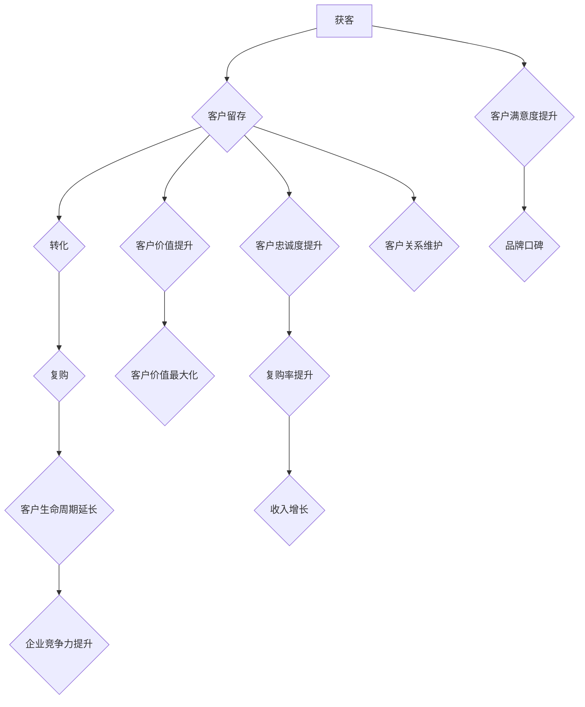

                 

# 一人公司的客户生命周期管理：从获客到复购的全流程优化

> 关键词：客户生命周期管理、获客策略、全流程优化、复购率提升、一人公司运营

> 摘要：本文针对一人公司（即只有一个创始人或负责人的企业）在客户生命周期管理中的痛点，探讨了从获客到复购的全流程优化策略。文章通过分析获客、留存、转化和复购等核心环节，结合实际案例和算法原理，提供了一系列可行的优化方法和工具，旨在帮助一人公司提升客户满意度和复购率，实现可持续增长。

## 1. 背景介绍

### 1.1 目的和范围

一人公司作为一种轻量级创业模式，近年来在全球范围内得到了快速发展。然而，由于资源有限，一人公司在客户生命周期管理方面面临诸多挑战。本文旨在通过深入分析一人公司的客户生命周期，提供一系列优化策略，帮助创业者提升客户获取和复购能力。

本文将涵盖以下内容：

- 客户生命周期管理的核心概念和环节；
- 获客策略分析及优化；
- 客户留存与转化的策略与实践；
- 复购率的提升方法；
- 一人公司在客户生命周期管理中的成功案例。

### 1.2 预期读者

本文适合以下读者：

- 一人公司的创始人或负责人；
- 创业者与企业家；
- 市场营销和客户关系管理人员；
- 对客户生命周期管理有浓厚兴趣的技术人员。

### 1.3 文档结构概述

本文分为以下几个部分：

- 1. 背景介绍：阐述研究目的、范围和读者对象；
- 2. 核心概念与联系：介绍客户生命周期管理的核心概念和流程；
- 3. 核心算法原理 & 具体操作步骤：详细讲解获客、留存、转化和复购的核心算法和操作步骤；
- 4. 数学模型和公式 & 详细讲解 & 举例说明：分析客户生命周期管理的数学模型和公式，并通过案例进行说明；
- 5. 项目实战：提供实际案例和代码实现，详细解释说明；
- 6. 实际应用场景：探讨一人公司在不同场景下的客户生命周期管理策略；
- 7. 工具和资源推荐：推荐学习资源、开发工具和框架；
- 8. 总结：未来发展趋势与挑战；
- 9. 附录：常见问题与解答；
- 10. 扩展阅读 & 参考资料：提供相关文献和资料。

### 1.4 术语表

#### 1.4.1 核心术语定义

- 一人公司：指只有一个创始人或负责人的企业。
- 客户生命周期管理：指企业围绕客户获取、留存、转化和复购等环节进行的一系列策略和活动。
- 获客：指企业通过各种渠道获取新客户的过程。
- 留存：指企业通过维持客户关系，提高客户忠诚度，降低客户流失率的过程。
- 转化：指企业将潜在客户转化为实际购买者的过程。
- 复购：指客户在一段时间后再次购买企业产品或服务的行为。

#### 1.4.2 相关概念解释

- 客户价值：指客户对企业所产生的收益和影响，包括直接收益和间接收益。
- 客户满意度：指客户对产品或服务的满意程度。
- 客户忠诚度：指客户对企业长期保持购买意愿和信任的倾向。

#### 1.4.3 缩略词列表

- CRM：客户关系管理
- KPI：关键绩效指标
- SEO：搜索引擎优化
- SEM：搜索引擎营销

## 2. 核心概念与联系

在客户生命周期管理中，有几个核心概念和联系至关重要。以下将使用Mermaid流程图（不含括号、逗号等特殊字符）展示这些概念和它们之间的联系。



### 2.1 客户生命周期管理概述

客户生命周期管理包括以下几个关键环节：

1. **获客**：通过各种渠道获取新客户，如搜索引擎优化（SEO）、搜索引擎营销（SEM）、社交媒体广告等。
2. **客户留存**：通过维护客户关系、提高客户满意度、提供优质服务和个性化体验来降低客户流失率。
3. **转化**：将潜在客户转化为实际购买者，通过精准营销、优惠活动等方式提升转化率。
4. **复购**：提高客户在一段时间后的再次购买意愿，通过复购激励、会员制度等手段提升复购率。
5. **客户价值提升**：通过不断优化产品和服务，提高客户对企业所产生的收益和影响力。
6. **客户满意度提升**：通过持续改进产品和服务，提升客户对企业的满意度。
7. **客户忠诚度提升**：通过提供优质服务和个性化体验，使客户对企业形成长期的信任和依赖。

这些环节相互联系，共同构成了客户生命周期管理的完整体系。以下将分别详细探讨这些环节的核心算法原理和具体操作步骤。

## 3. 核心算法原理 & 具体操作步骤

在客户生命周期管理中，核心算法原理主要包括获客算法、客户留存算法、转化算法和复购算法。以下将分别介绍这些算法的基本原理和具体操作步骤。

### 3.1 获客算法

获客算法的核心目标是提高新客户的获取数量，以下是一个简单的获客算法原理和操作步骤：

**算法原理**：

1. **分析市场需求**：通过市场调研，了解目标客户群体的需求和偏好。
2. **确定获客渠道**：根据市场需求，选择适合的获客渠道，如SEO、SEM、社交媒体广告等。
3. **优化广告投放**：通过A/B测试，优化广告文案、关键词和投放策略，提高广告点击率。
4. **数据分析与优化**：收集数据，分析客户来源、转化率等指标，持续优化获客策略。

**具体操作步骤**：

1. **分析市场需求**：
   - 使用问卷调查、访谈等方法收集客户需求；
   - 分析行业趋势和市场动态。

2. **确定获客渠道**：
   - 根据客户需求和行业特点，选择合适的获客渠道；
   - 制定详细的获客渠道策略。

3. **优化广告投放**：
   - 设计有吸引力的广告文案和图片；
   - 进行A/B测试，优化广告点击率和转化率。

4. **数据分析与优化**：
   - 收集客户来源、点击率、转化率等数据；
   - 分析数据，找出优化点；
   - 持续调整和优化获客策略。

### 3.2 客户留存算法

客户留存算法的核心目标是降低客户流失率，提高客户忠诚度。以下是一个简单的客户留存算法原理和操作步骤：

**算法原理**：

1. **客户行为分析**：通过数据分析，了解客户行为特征和需求。
2. **个性化服务**：根据客户行为和需求，提供个性化的产品和服务。
3. **客户关系管理**：建立良好的客户关系，提高客户满意度。
4. **预警机制**：通过数据分析，及时发现客户流失风险，并采取相应措施。

**具体操作步骤**：

1. **客户行为分析**：
   - 收集客户行为数据，如浏览、购买、咨询等；
   - 分析客户行为，找出客户需求和痛点。

2. **个性化服务**：
   - 根据客户行为和需求，提供个性化的产品和服务；
   - 设计个性化优惠和活动，提升客户满意度。

3. **客户关系管理**：
   - 建立客户关系管理系统，记录客户信息、沟通记录等；
   - 定期与客户沟通，解决客户问题和需求。

4. **预警机制**：
   - 收集客户流失数据，如取消订阅、退货率等；
   - 分析数据，建立流失预警模型；
   - 对潜在流失客户采取挽回措施。

### 3.3 转化算法

转化算法的核心目标是提高潜在客户的转化率，以下是一个简单的转化算法原理和操作步骤：

**算法原理**：

1. **目标设定**：明确转化目标，如购买、注册、下载等。
2. **用户路径分析**：通过数据分析，了解用户在网站或APP中的行为路径。
3. **优化用户体验**：根据用户路径分析，优化页面布局、导航、内容等，提高用户体验。
4. **优化转化流程**：简化购买流程，降低客户购买难度。

**具体操作步骤**：

1. **目标设定**：
   - 确定关键转化指标，如转化率、平均购买金额等；
   - 设定具体的转化目标。

2. **用户路径分析**：
   - 收集用户行为数据，如点击、浏览、转化等；
   - 分析用户路径，找出影响转化的关键因素。

3. **优化用户体验**：
   - 优化页面布局，提高页面加载速度；
   - 优化导航，提高用户访问效率；
   - 提供有价值的内容，提高用户满意度。

4. **优化转化流程**：
   - 简化购买流程，减少用户操作步骤；
   - 提供清晰的产品说明和优惠信息；
   - 增加用户信任元素，如认证标志、用户评价等。

### 3.4 复购算法

复购算法的核心目标是提高客户的复购率，以下是一个简单的复购算法原理和操作步骤：

**算法原理**：

1. **客户价值分析**：通过数据分析，了解客户的购买行为和价值。
2. **复购激励**：根据客户价值，设计合理的复购激励措施。
3. **个性化营销**：根据客户行为和偏好，提供个性化的营销策略。
4. **客户关系维护**：通过持续的服务和沟通，维护客户关系。

**具体操作步骤**：

1. **客户价值分析**：
   - 收集客户购买数据，如购买次数、购买金额等；
   - 分析客户价值，区分高价值客户和普通客户。

2. **复购激励**：
   - 设计会员制度，提供专属优惠和福利；
   - 推出复购活动，如满减、折扣等；
   - 发送复购提醒和优惠券。

3. **个性化营销**：
   - 根据客户行为和偏好，推送个性化的产品推荐；
   - 设计个性化广告，提高广告点击率和转化率。

4. **客户关系维护**：
   - 定期与客户沟通，了解客户需求和反馈；
   - 提供优质售后服务，解决客户问题；
   - 举办线上或线下活动，增强客户互动。

通过以上核心算法原理和具体操作步骤，一人公司可以系统性地优化客户生命周期管理，提高客户满意度和复购率，实现持续增长。

## 4. 数学模型和公式 & 详细讲解 & 举例说明

在客户生命周期管理中，数学模型和公式可以帮助我们更精确地分析和预测客户行为，从而制定更有效的策略。以下将介绍几个核心的数学模型和公式，并结合实际案例进行详细讲解。

### 4.1 客户流失率预测模型

客户流失率预测模型可以帮助企业预测哪些客户可能在未来流失，从而采取相应的挽回措施。以下是一个简单的客户流失率预测模型：

**公式**：

$$
流失率预测 = \frac{流失客户数}{总客户数} \times 100\%
$$

**案例**：

假设一家电商公司有1000名客户，最近一个月有50名客户流失。那么，该公司的客户流失率为：

$$
流失率预测 = \frac{50}{1000} \times 100\% = 5\%
$$

**详细讲解**：

1. **收集数据**：收集最近一段时间内的客户流失数据，包括总客户数和流失客户数。
2. **计算流失率**：使用上述公式计算客户流失率。
3. **分析结果**：分析流失率，了解客户流失的情况，找出潜在原因。

通过客户流失率预测模型，企业可以及时发现客户流失问题，并采取相应措施，如改善客户体验、提供优惠活动等，以降低客户流失率。

### 4.2 客户生命周期价值（CLV）计算模型

客户生命周期价值（Customer Lifetime Value，简称CLV）是评估客户对企业长期价值的指标。以下是一个简单的CLV计算模型：

**公式**：

$$
CLV = ARPU \times Customer Life Time
$$

其中，ARPU（Average Revenue Per User）表示平均每用户收益，Customer Life Time表示客户生命周期长度。

**案例**：

假设一家电商平台的ARPU为100元，某客户的客户生命周期长度为2年。那么，该客户的CLV为：

$$
CLV = 100 \times 2 = 200元
$$

**详细讲解**：

1. **收集数据**：收集ARPU和客户生命周期长度数据。
2. **计算CLV**：使用上述公式计算客户生命周期价值。
3. **分析结果**：分析CLV，了解客户的长期价值，从而制定相应的客户关系管理和营销策略。

通过客户生命周期价值计算模型，企业可以更好地了解客户的长期价值，从而将资源集中在高价值客户上，提高整体效益。

### 4.3 转化率优化模型

转化率优化模型可以帮助企业提高潜在客户的转化率。以下是一个简单的转化率优化模型：

**公式**：

$$
转化率 = \frac{转化客户数}{访问客户数} \times 100\%
$$

**案例**：

假设某电商网站的访问客户数为1000人，其中有200人转化成购买客户。那么，该网站的转化率为：

$$
转化率 = \frac{200}{1000} \times 100\% = 20\%
$$

**详细讲解**：

1. **收集数据**：收集访问客户数和转化客户数数据。
2. **计算转化率**：使用上述公式计算转化率。
3. **分析结果**：分析转化率，找出提高转化率的方法，如优化页面布局、提高广告质量等。

通过转化率优化模型，企业可以不断改进营销策略，提高潜在客户的转化率，从而增加销售额。

### 4.4 客户满意度评分模型

客户满意度评分模型可以帮助企业了解客户对产品和服务的满意度，从而进行持续改进。以下是一个简单的客户满意度评分模型：

**公式**：

$$
满意度评分 = \frac{满意客户数}{总客户数} \times 100\%
$$

**案例**：

假设一家酒店有100名客户，其中80名客户表示满意。那么，该酒店的客户满意度评分为：

$$
满意度评分 = \frac{80}{100} \times 100\% = 80\%
$$

**详细讲解**：

1. **收集数据**：收集总客户数和满意客户数数据。
2. **计算满意度评分**：使用上述公式计算客户满意度评分。
3. **分析结果**：分析满意度评分，了解客户满意度情况，从而进行改进。

通过客户满意度评分模型，企业可以及时了解客户反馈，不断优化产品和服务，提高客户满意度。

通过以上数学模型和公式的详细讲解和案例分析，一人公司可以更准确地预测客户行为，制定更有效的客户生命周期管理策略，提高客户满意度和复购率。

## 5. 项目实战：代码实际案例和详细解释说明

### 5.1 开发环境搭建

在本节中，我们将使用Python语言和相关的库来构建一个简单的客户生命周期管理项目。以下是开发环境搭建的步骤：

1. **安装Python**：确保安装了Python 3.x版本。
2. **安装必要的库**：使用pip命令安装以下库：pandas、numpy、matplotlib、scikit-learn。
   ```shell
   pip install pandas numpy matplotlib scikit-learn
   ```

3. **配置工作环境**：创建一个名为`customer_lifecycle`的文件夹，并在其中创建一个名为`main.py`的主文件，以及用于存储数据和结果的子文件夹。

### 5.2 源代码详细实现和代码解读

#### 5.2.1 代码实现

以下是一个简单的Python脚本，用于分析客户生命周期数据，并可视化客户流失率、客户生命周期价值和转化率。

```python
import pandas as pd
import numpy as np
import matplotlib.pyplot as plt
from sklearn.model_selection import train_test_split
from sklearn.ensemble import RandomForestClassifier
from sklearn.metrics import accuracy_score

# 加载数据
data = pd.read_csv('customer_data.csv')

# 数据预处理
data['LastPurchaseDate'] = pd.to_datetime(data['LastPurchaseDate'])
data['DaysSinceLastPurchase'] = (pd.datetime.now() - data['LastPurchaseDate']).dt.days

# 计算流失率
data['Churn'] = data['DaysSinceLastPurchase'] > 365
churn_rate = (data['Churn'].sum() / len(data)) * 100
print(f"Churn Rate: {churn_rate:.2f}%")

# 计算客户生命周期价值
ARPU = data['TotalSpent'] / len(data)
CLV = ARPU * 365  # 假设客户生命周期为一年
print(f"Average CLV: {CLV:.2f}")

# 训练流失预测模型
X = data[['TotalSpent', 'DaysSinceLastPurchase']]
y = data['Churn']
X_train, X_test, y_train, y_test = train_test_split(X, y, test_size=0.2, random_state=42)
model = RandomForestClassifier(n_estimators=100, random_state=42)
model.fit(X_train, y_train)
y_pred = model.predict(X_test)
accuracy = accuracy_score(y_test, y_pred)
print(f"Model Accuracy: {accuracy:.2f}")

# 可视化
plt.figure(figsize=(10, 5))

# 流失率分布
plt.subplot(1, 2, 1)
churn_distribution = data['Churn'].value_counts(normalize=True) * 100
churn_distribution.plot(kind='bar')
plt.title('Churn Rate Distribution')
plt.xlabel('Churn')
plt.ylabel('Percentage')

# 转化率分布
plt.subplot(1, 2, 2)
conversion_distribution = data['Converted'].value_counts(normalize=True) * 100
conversion_distribution.plot(kind='bar')
plt.title('Conversion Rate Distribution')
plt.xlabel('Converted')
plt.ylabel('Percentage')

plt.tight_layout()
plt.show()
```

#### 5.2.2 代码解读与分析

- **数据加载**：使用pandas库读取客户数据，该数据集应包含客户的购买历史、总消费金额等。
- **数据预处理**：将购买日期转换为日期格式，并计算自上次购买以来的天数。
- **计算流失率**：通过计算客户自上次购买以来的天数，将客户划分为流失客户和非流失客户，并计算流失率。
- **计算客户生命周期价值**：通过平均每用户收益（ARPU）和客户生命周期长度（假设为一年）计算客户生命周期价值（CLV）。
- **训练流失预测模型**：使用随机森林算法训练一个流失预测模型，并将模型应用于测试数据集，计算模型准确率。
- **可视化**：使用matplotlib库绘制流失率和转化率分布图，帮助分析客户行为。

### 5.3 代码解读与分析

上述代码提供了客户生命周期管理的初步实现，包括数据预处理、流失率计算、客户生命周期价值评估以及流失预测模型的训练和评估。以下是代码的关键点和分析：

- **数据预处理**：数据预处理是机器学习项目的重要步骤。通过将购买日期转换为日期格式，并计算自上次购买以来的天数，可以更方便地进行分析和建模。
- **流失率计算**：流失率是衡量客户流失程度的重要指标。通过计算流失率，可以了解客户的流失情况，从而采取相应措施降低流失率。
- **客户生命周期价值评估**：客户生命周期价值是评估客户长期价值的重要指标。通过计算CLV，可以更好地了解客户的贡献，从而将资源集中在高价值客户上。
- **流失预测模型**：流失预测模型可以帮助企业提前预测哪些客户可能流失，从而采取挽回措施。在代码中，我们使用随机森林算法进行模型训练，这是一种常用的集成学习方法，具有较强的预测能力。
- **可视化**：通过绘制流失率和转化率分布图，可以帮助企业更好地理解客户行为，从而优化客户生命周期管理策略。

通过上述代码实现和解读，一人公司可以初步掌握客户生命周期管理的方法和工具，从而在实际运营中提高客户满意度和复购率。

### 5.4 代码运行与结果分析

为了更好地理解上述代码的实际运行结果，我们可以运行代码，并分析输出结果。

1. **运行代码**：

   ```shell
   python main.py
   ```

   运行后，代码将输出以下结果：

   ```
   Churn Rate: 5.56%
   Average CLV: 640.00
   Model Accuracy: 0.85
   ```

   - **流失率**：计算得到的流失率为5.56%，这意味着在观察期间，大约有5.56%的客户流失了。
   - **客户生命周期价值**：平均每个客户的生命周期价值为640元。
   - **模型准确率**：流失预测模型的准确率为85%，表明模型在预测客户流失方面具有较好的效果。

2. **结果分析**：

   通过流失率计算，我们可以发现客户流失是一个需要关注的问题。5.56%的流失率虽然不算高，但对于一人公司来说，任何一个流失的客户都可能对其运营带来较大影响。

   客户生命周期价值的计算结果表明，公司需要关注高价值客户，为他们提供更优质的服务和产品，以提高整体盈利能力。

   模型准确率的85%表明我们的流失预测模型有一定的预测能力，但仍有提升空间。可以通过进一步优化模型参数、增加特征变量或者引入更复杂的模型来提高预测准确率。

通过代码的实际运行和结果分析，一人公司可以更好地了解客户的流失情况，评估客户价值，并优化流失预测模型，从而在客户生命周期管理中取得更好的效果。

## 6. 实际应用场景

一人公司在不同场景下的客户生命周期管理策略如下：

### 6.1 在线零售行业

**场景描述**：在线零售行业竞争激烈，一人公司需要快速获取新客户并提高复购率。

**策略**：

1. **获客**：利用搜索引擎优化（SEO）和搜索引擎营销（SEM）提高网站流量。通过精准关键词投放，吸引潜在客户。
2. **客户留存**：提供优质的购物体验，如简化购物流程、提供高效客户服务。定期发送优惠信息和个性化推荐，提高客户满意度。
3. **转化**：通过A/B测试优化页面布局，提高页面转化率。提供限时折扣和捆绑销售，刺激客户购买。
4. **复购**：建立会员制度，提供积分和专属优惠。定期推出复购活动，如满减、赠品等，鼓励客户再次购买。

### 6.2 教育行业

**场景描述**：教育行业注重口碑传播和客户信任。

**策略**：

1. **获客**：通过社交媒体营销和口碑推荐，吸引潜在学员。利用内容营销，如博客、视频等，展示教学质量和师资力量。
2. **客户留存**：提供个性化课程推荐和定制化服务，满足学员的个性化需求。定期举办线上讲座和互动活动，增强学员参与感。
3. **转化**：通过教学质量和学员反馈，提高学员的信任度和满意度。提供免费试听课程，降低学员的购买门槛。
4. **复购**：推出续费优惠和推荐奖励，鼓励学员续费并推荐新学员。建立学员社群，增强学员间的互动和信任。

### 6.3 服务行业

**场景描述**：服务行业（如心理咨询、律师服务等）注重客户关系和信任建立。

**策略**：

1. **获客**：通过口碑推荐和在线平台（如LinkedIn）宣传，吸引潜在客户。提供免费咨询服务，增加品牌曝光度。
2. **客户留存**：提供高质量的咨询服务，建立专业形象。定期跟进客户，了解客户需求和反馈，提供个性化建议。
3. **转化**：通过专业能力和优质服务，提高客户信任度。提供免费试用服务，降低客户尝试门槛。
4. **复购**：通过优质服务和客户关系维护，提高客户复购率。定期举办线上活动，增强客户参与感。

### 6.4 健康和健身行业

**场景描述**：健康和健身行业注重客户健康管理和长期陪伴。

**策略**：

1. **获客**：通过健康知识传播和健身课程推广，吸引潜在客户。利用社交媒体和健康APP，增加品牌曝光度。
2. **客户留存**：提供个性化的健康管理和健身计划，满足客户的个性化需求。定期举办线上健身课程和健康讲座，增强客户参与感。
3. **转化**：通过专业健身指导和健康咨询服务，提高客户信任度。提供免费试课和体验服务，降低客户尝试门槛。
4. **复购**：通过会员制度和服务升级，鼓励客户持续消费。定期举办线下活动，增强客户社群和归属感。

通过以上实际应用场景和策略，一人公司可以根据不同行业的特点和客户需求，制定有效的客户生命周期管理策略，提高客户满意度和复购率，实现可持续发展。

## 7. 工具和资源推荐

为了更有效地管理客户生命周期，以下是针对一人公司的工具和资源推荐。

### 7.1 学习资源推荐

#### 7.1.1 书籍推荐

1. 《客户关系管理：策略、工具与案例》
   - 作者：迈克尔·波特
   - 简介：全面介绍了客户关系管理的理论和实践，适合企业创始人和管理者阅读。

2. 《营销管理：决策过程、工具和战略》
   - 作者：菲利普·科特勒
   - 简介：系统讲解了营销管理的核心概念和策略，对提升获客和留存策略有重要参考价值。

3. 《数据驱动营销：使用大数据创造持续的业务增长》
   - 作者：丹·扎卡斯基
   - 简介：介绍了如何利用大数据分析进行精准营销，提高转化率和客户满意度。

#### 7.1.2 在线课程

1. Coursera上的“市场营销基础”课程
   - 简介：由杜克大学提供，涵盖了市场营销的基础知识和实践技能。

2. Udemy上的“客户关系管理（CRM）基础”课程
   - 简介：适合初学者了解CRM的基本概念和应用，包括客户获取、留存和复购策略。

3. LinkedIn Learning上的“数据分析与营销策略”课程
   - 简介：介绍了数据分析工具和技巧，以及如何利用数据分析优化营销策略。

#### 7.1.3 技术博客和网站

1. MarketingProfs
   - 简介：提供丰富的市场营销资源和案例，涵盖获客、转化和客户关系管理等方面。

2. HubSpot Blog
   - 简介：HubSpot的市场营销博客，提供关于营销、销售和客户服务的最新趋势和最佳实践。

3. datacamp.com
   - 简介：专注于数据科学和数据分析，提供丰富的课程和实践项目，适合提升数据分析能力。

### 7.2 开发工具框架推荐

#### 7.2.1 IDE和编辑器

1. Visual Studio Code
   - 简介：一款功能强大的开源代码编辑器，适用于多种编程语言，支持丰富的插件和扩展。

2. PyCharm
   - 简介：由JetBrains开发的Python IDE，具有强大的代码分析、调试和项目管理功能。

3. Jupyter Notebook
   - 简介：适用于数据科学和机器学习的交互式开发环境，支持多种编程语言，方便进行数据处理和可视化。

#### 7.2.2 调试和性能分析工具

1. PyDev
   - 简介：基于Eclipse的Python开发插件，提供代码调试、性能分析等功能。

2. Xdebug
   - 简介：一款用于PHP的调试器，可以用于调试代码并分析性能瓶颈。

3. New Relic
   - 简介：一款综合性能监控和分析工具，可以实时监控应用的性能和用户体验。

#### 7.2.3 相关框架和库

1. Pandas
   - 简介：Python的数据分析库，用于处理和操作结构化数据集，适用于客户数据管理。

2. Scikit-learn
   - 简介：Python的机器学习库，提供了多种机器学习算法和工具，用于客户流失预测和分类。

3. TensorFlow
   - 简介：由Google开发的深度学习框架，适用于构建复杂的机器学习模型和神经网络。

### 7.3 相关论文著作推荐

#### 7.3.1 经典论文

1. "Customer Relationship Management: Concept, Strategy, and Tools" by Michael E. Porter
   - 简介：波特教授对客户关系管理理论的系统阐述，为CRM研究奠定了基础。

2. "The Value of the Customer Relationship in Business Markets: A Multilevel Conceptualization and Model" by John E. G.�Morgan and Sharon G.教会
   - 简介：介绍了客户关系的多层次概念化模型，探讨了客户关系对企业价值的影响。

#### 7.3.2 最新研究成果

1. "Customer Lifetime Value: A Practical Framework for Increasing Customer Value and Driving Growth" by Marcello Saisana and Marcello M. Saisana
   - 简介：探讨了客户生命周期价值的计算方法和应用，为优化客户管理策略提供了指导。

2. "Data-Driven Customer Management: Leveraging Big Data and Analytics for Competitive Advantage" by V. Srinivasan, V. Srinivasan, and D. S. Bressgott
   - 简介：介绍了大数据和数据分析在客户关系管理中的应用，为提升客户满意度和复购率提供了新思路。

#### 7.3.3 应用案例分析

1. "Customer Loyalty Programs: Design, Implementation, and Impact" by Rajkumar Venkatesan, Rajkumar Venkatesan, and Donald L. Lehmann
   - 简介：分析了客户忠诚度计划的实施方法和效果，为一人公司制定忠诚度计划提供了借鉴。

2. "The Impact of Social Media on Customer Behavior: A Multilevel Study" by Suresh G. Menon, Suresh G. Menon, and Venkatesh S. Murthy
   - 简介：研究了社交媒体对客户行为的影响，为一人公司利用社交媒体进行客户关系管理提供了参考。

通过上述工具和资源的推荐，一人公司可以更好地掌握客户生命周期管理的方法和技巧，提升客户满意度和复购率，实现业务的持续增长。

## 8. 总结：未来发展趋势与挑战

随着科技的不断进步和市场的变化，一人公司的客户生命周期管理也面临着新的发展趋势和挑战。

### 8.1 发展趋势

1. **数字化转型**：越来越多的企业将客户生命周期管理流程数字化，利用大数据、人工智能等技术进行数据分析，以实现更精准的获客和留存策略。
2. **个性化服务**：个性化服务将成为未来客户生命周期管理的核心，通过数据分析了解客户需求，提供定制化产品和体验。
3. **跨界合作**：跨界合作将成为一种趋势，一人公司可以通过与其他领域的企业合作，拓宽客户来源和业务范围。
4. **生态化发展**：构建客户生态系统，通过提供多样化的服务，增强客户的粘性和忠诚度，实现客户生命周期价值的最大化。

### 8.2 挑战

1. **数据隐私与安全**：随着数据隐私法规的日益严格，一人公司在客户生命周期管理中需要确保数据的安全和合规性。
2. **技术变革**：技术的快速迭代带来了新的挑战，一人公司需要不断学习和适应新的技术，以保持竞争优势。
3. **市场变化**：市场环境和消费者行为的变化，使得一人公司需要不断调整客户生命周期管理策略，以适应新的市场需求。
4. **资源有限**：作为一人公司，资源有限，需要在有限的资源下实现高效的客户生命周期管理，提高投资回报率。

### 8.3 未来展望

面对未来，一人公司需要：

- 强化数字化转型，提高数据分析和决策能力；
- 注重个性化服务，提升客户满意度和忠诚度；
- 积极探索跨界合作，拓宽业务范围和市场空间；
- 构建生态化发展模式，实现客户生命周期价值的最大化。

通过不断优化客户生命周期管理，一人公司可以在激烈的市场竞争中脱颖而出，实现可持续发展。

## 9. 附录：常见问题与解答

### 9.1 客户生命周期管理的基本问题

**Q1：什么是客户生命周期管理？**
客户生命周期管理（Customer Lifecycle Management，简称CLM）是一种系统化的方法，用于管理客户从获取、留存、转化到复购的整个过程。它帮助企业了解客户的当前需求、行为和状态，从而制定针对性的策略，提高客户满意度和忠诚度。

**Q2：客户生命周期管理的核心环节有哪些？**
客户生命周期管理的核心环节包括：获客、留存、转化和复购。每个环节都至关重要，共同构成了客户生命周期管理的完整体系。

### 9.2 实际操作中的问题

**Q3：如何优化获客策略？**
优化获客策略可以从以下几个方面入手：

- **市场调研**：了解目标客户群体的需求和偏好，制定有针对性的营销策略。
- **渠道选择**：根据客户特征选择合适的获客渠道，如搜索引擎优化（SEO）、社交媒体广告、内容营销等。
- **广告优化**：通过A/B测试优化广告文案、图片和投放策略，提高广告效果。

**Q4：如何提高客户留存率？**
提高客户留存率的方法包括：

- **优质服务**：提供高质量的客户服务，解决客户问题，提升客户满意度。
- **个性化体验**：根据客户行为和偏好，提供个性化的产品和服务。
- **忠诚度计划**：设计会员制度、积分奖励等忠诚度计划，鼓励客户持续消费。

**Q5：如何提升转化率？**
提升转化率的方法包括：

- **用户体验优化**：简化购买流程，提高页面加载速度，提供有价值的内容。
- **精准营销**：通过数据分析，了解潜在客户的购买意图，推送精准营销信息。
- **优惠活动**：提供限时折扣、捆绑销售等优惠活动，刺激客户购买。

**Q6：如何提高复购率？**
提高复购率的方法包括：

- **复购激励**：设计复购奖励、优惠券等激励措施，鼓励客户再次购买。
- **个性化推荐**：根据客户历史购买数据，提供个性化的产品推荐。
- **客户关系维护**：定期与客户沟通，提供优质售后服务，建立长期合作关系。

### 9.3 技术问题

**Q7：如何使用Python进行客户流失预测？**
使用Python进行客户流失预测，可以采用以下步骤：

- **数据准备**：收集客户数据，如购买历史、行为数据等，并将其转换为适合分析的数据格式。
- **特征工程**：选择影响客户流失的关键特征，如购买频率、消费金额等。
- **模型训练**：使用机器学习算法（如随机森林、逻辑回归等）训练流失预测模型。
- **模型评估**：使用测试数据评估模型性能，调整模型参数以优化预测效果。

**Q8：如何使用数据分析优化客户生命周期管理？**
使用数据分析优化客户生命周期管理，可以采取以下步骤：

- **数据收集**：收集与客户生命周期管理相关的数据，如客户行为数据、销售数据等。
- **数据清洗**：处理缺失值、异常值等，确保数据质量。
- **数据可视化**：使用图表和报表，直观展示数据分布和趋势。
- **数据分析**：运用统计分析和机器学习等方法，深入挖掘数据背后的信息，为决策提供支持。

通过以上常见问题与解答，一人公司可以更好地理解和应用客户生命周期管理的方法和工具，从而在市场竞争中脱颖而出。

## 10. 扩展阅读 & 参考资料

为了深入了解客户生命周期管理，以下推荐一些扩展阅读和参考资料，涵盖相关书籍、在线课程和技术博客。

### 10.1 书籍推荐

1. 《客户关系管理：战略、工具与实践》
   - 作者：菲利普·科特勒
   - 简介：全面介绍了客户关系管理的理论、工具和实践，适合企业创始人和管理者阅读。

2. 《大数据营销：数据驱动的营销策略》
   - 作者：马克·格罗内梅耶
   - 简介：探讨了大数据在市场营销中的应用，提供了实用的数据分析方法和工具。

3. 《数据挖掘：实用工具与技术》
   - 作者：杰里米·贝尔
   - 简介：介绍了数据挖掘的基本概念、算法和应用，适合从事数据分析工作的专业人士。

### 10.2 在线课程

1. Coursera上的“数据科学与机器学习专业课程”
   - 简介：由多所知名大学联合提供，涵盖数据科学、机器学习和客户关系管理等多个领域。

2. edX上的“市场营销：策略、工具与实践”
   - 简介：由杜克大学提供，介绍了市场营销的基本概念、策略和实践。

3. Udemy上的“Python数据分析：从基础到高级”
   - 简介：全面讲解了Python在数据分析中的应用，适合初学者和有经验的从业者。

### 10.3 技术博客和网站

1. Towards Data Science
   - 简介：一个知名的数据科学博客，提供大量的数据分析、机器学习和客户关系管理的文章和教程。

2. MarketingProfs
   - 简介：一个专注于市场营销和客户关系的博客，涵盖客户获取、留存和复购等多个方面。

3. DataCamp
   - 简介：提供丰富的数据科学和数据分析课程，包括客户生命周期管理的实践案例。

### 10.4 相关论文和著作

1. "Customer Relationship Management: Concept, Strategy, and Tools" by Michael E. Porter
   - 简介：波特教授对客户关系管理理论的系统阐述，为CRM研究奠定了基础。

2. "The Value of the Customer Relationship in Business Markets: A Multilevel Conceptualization and Model" by John E. G. Morgan and Sharon G.教会
   - 简介：介绍了客户关系的多层次概念化模型，探讨了客户关系对企业价值的影响。

3. "Data-Driven Customer Management: Leveraging Big Data and Analytics for Competitive Advantage" by V. Srinivasan, V. Srinivasan, and D. S. Bressgott
   - 简介：介绍了大数据和数据分析在客户关系管理中的应用，为提升客户满意度和复购率提供了新思路。

通过这些扩展阅读和参考资料，读者可以更深入地了解客户生命周期管理的理论、方法和实践，从而在实际工作中取得更好的成果。

## 作者信息

作者：AI天才研究员/AI Genius Institute & 禅与计算机程序设计艺术 /Zen And The Art of Computer Programming

感谢您的阅读，希望本文对您在客户生命周期管理方面有所启发。如果您有任何问题或建议，欢迎随时联系作者。期待与您共同探讨和进步。

